# AZ-104 学習資料 統合版

このファイルは `az104-study-guide` 配下の章ファイルを番号順に連結した統合版です。

## 章一覧
1. 第1章 AZ-104 の全体像と Azure 管理の土台
2. 第2章 Azure の管理構造とガバナンス
3. 第3章 Microsoft Entra ID と Azure RBAC
4. 第4章 ストレージ設計とデータ保護の基礎
5. 第5章 Azure Blob と Azure Files の実装
6. 第6章 ARM/Bicep と Azure VM の管理
7. 第7章 コンテナーと Azure App Service
8. 第8章 仮想ネットワーク、サブネット、ルーティング
9. 第9章 セキュアな接続、名前解決、負荷分散
10. 第10章 Azure Monitor と運用監視
11. 第11章 バックアップ、災害対策、総合演習

---

# 第1章 AZ-104 の全体像と Azure 管理の土台

## 3行要約
AZ-104 は、Azure の各サービスを単発で暗記する試験ではなく、「どの単位で管理し、どの権限で操作し、どう安全に運用するか」を問う試験です。  
最初に覚えるべきなのは、テナント、サブスクリプション、リソース グループ、リソースという管理階層と、コントロール プレーンとデータ プレーンの違いです。  
この章を終えると、後続の章で出てくる設定が「どの層の話か」を見失わずに学べるようになります。  

## 全体像の図
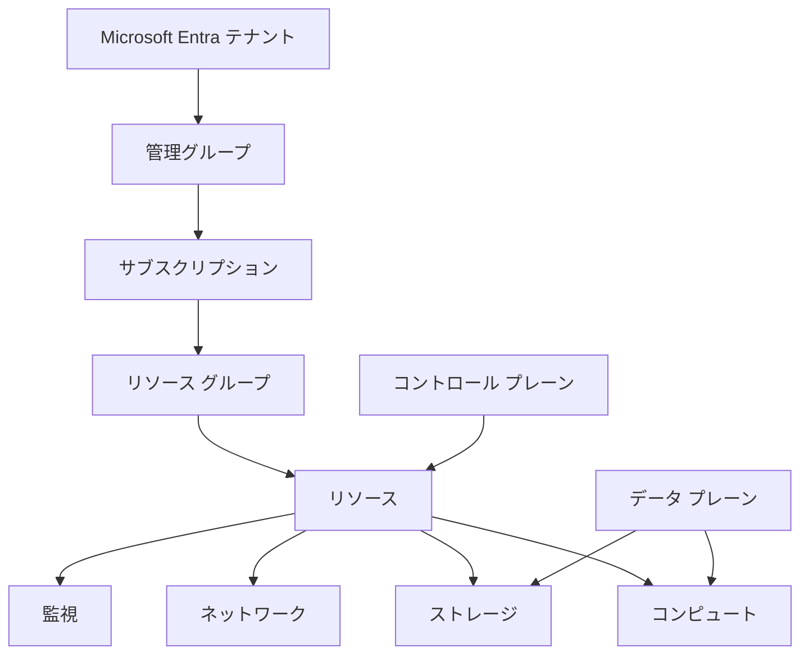

図の読み方
- 左側の縦の流れは「管理の入れ物」です。下に行くほど具体的な構成要素になります。
- 右側の箱は実際に操作する Azure サービスです。これらはすべてリソースとして管理されます。
- `コントロール プレーン` は Azure 管理 API の操作、`データ プレーン` は実データや実ワークロードへの操作です。
- AZ-104 の問題文は、多くの場合「どの層に対して、誰が、何をするか」を聞いています。

## まず結論
AZ-104 の学習は、次の 4 つの軸で整理すると理解しやすくなります。

1. `管理階層` を理解する  
   テナント、管理グループ、サブスクリプション、リソース グループ、リソースの関係を理解します。
2. `責任分界` を理解する  
   Azure が面倒を見る部分と、自分が設定すべき部分を分けて考えます。
3. `操作面` を分ける  
   Azure Portal、Azure CLI、PowerShell、Bicep、ARM テンプレートは、やっている操作の窓口が違うだけで、管理対象は同じです。
4. `運用前提` で覚える  
   作るだけでは不十分です。監視、権限、バックアップ、可用性まで含めて 1 つの設計です。

比較表で見ると、試験の見え方が整理しやすくなります。

| 軸 | 問われること | 典型的な問題の形 |
| --- | --- | --- |
| 管理階層 | どの単位で整理するか | どのスコープでポリシーやロールを適用するか |
| 権限 | 誰が何をできるか | RBAC でどのロールを付与するか |
| 実装 | どう作るか | Portal/CLI/Bicep でどう構成するか |
| 運用 | 障害時にどう維持するか | 監視、バックアップ、可用性、復旧 |

AZ-104 を初学者が難しく感じる大きな理由は、各用語が「似ているのに役割が違う」からです。たとえば、`サブスクリプション` と `リソース グループ` はどちらも入れ物に見えますが、課金・クォータ・契約の単位はサブスクリプションであり、ライフサイクル管理の単位はリソース グループです。ここを混同すると、後の章で RBAC、Policy、コスト管理、デプロイのすべてが曖昧になります。

もう 1 つ重要なのは、AZ-104 の問題は「正しいサービス名を知っているか」だけではなく、「どの要求に対して、そのサービスが最小の手間で要件を満たすか」を問うことです。つまり、暗記よりも比較が重要です。後続の章では、比較表を頻繁に使って判断軸を整理します。

### 確認質問
1. リソース グループとサブスクリプションは、どちらが課金やクォータの単位ですか。
2. Azure Portal と Azure CLI は、管理対象が違うのか、操作手段が違うのか、どちらですか。
3. 監視やバックアップを後回しにすると、なぜ本番運用で困りますか。

## 先に知っておく用語

| 用語 | フルネーム / 意味 | 先に押さえるポイント |
| --- | --- | --- |
| Microsoft Entra ID | 旧 Azure AD。ID 基盤 | ユーザー、グループ、認証の土台 |
| テナント | 組織の ID 境界 | 1 つの組織ディレクトリの単位 |
| 管理グループ | サブスクリプションを束ねる単位 | ガバナンスを上位で統一したいときに使う |
| サブスクリプション | 課金・クォータ・契約の単位 | 多くの管理設定の大きな境界 |
| リソース グループ | リソースの論理グループ | まとめてデプロイ、削除、整理しやすい |
| リソース | VM、VNet、Storage Account など | Azure で管理対象になる実体 |
| Azure Resource Manager | ARM | Azure の管理 API とデプロイ基盤 |
| Bicep | ARM を書きやすくした言語 | 宣言的に Azure を構築する |
| コントロール プレーン | 管理操作の面 | 作成、削除、設定変更など |
| データ プレーン | 実データ操作の面 | Blob の読み書き、VM への接続など |
| リージョン | データセンター群の地理的な場所 | 東日本、西日本など |
| 可用性ゾーン | リージョン内の独立した障害分離単位 | ゾーン障害に備えるための単位 |

初学者は、`Azure Resource Manager` を「テンプレート機能の名前」だと誤解しやすいですが、実際には Azure の管理モデル全体の中心です。Portal で VM を作るときも、CLI で Storage Account を作るときも、裏側では ARM に対して要求が送られています。だからこそ、Portal の画面操作だけで覚えると限界があります。ARM の観点を持つと、異なるツールで同じことをしていると理解できます。

例として、Storage Account を作る行為を考えます。Portal ではフォーム入力です。CLI ではコマンドです。Bicep では宣言文です。しかし、どれも結果として「指定したサブスクリプションとリソース グループの下に、ある種類のリソースをデプロイする」点は同じです。この共通構造が見えると、ツールが変わっても混乱しにくくなります。

### 小演習
次の文章の空欄を埋めてください。

1. VM や VNet のような実体は Azure の `______` として管理される。  
2. 予算やクォータを考える大きな単位は `______` である。  
3. Blob の中身を読み書きする操作は、主に `______ プレーン` の話である。  

## 核心概念の説明

### 1. Azure を「管理階層」で見る
Azure では、いきなり VM や Storage Account を作るのではなく、その前に「どの組織」「どの契約」「どの整理単位」に置くかを決めます。これが管理階層です。

管理階層を上から順に見ると次のようになります。

1. `Microsoft Entra テナント`  
   ID の境界です。ユーザーやグループ、認証の土台になります。
2. `管理グループ`  
   複数サブスクリプションに同じルールをまとめて適用したいときに使います。
3. `サブスクリプション`  
   課金、クォータ、アクセス管理の大きな単位です。
4. `リソース グループ`  
   アプリやシステム単位でまとめる箱です。更新、削除、権限付与の単位として便利です。
5. `リソース`  
   実際のサービスです。VM、ディスク、VNet、NSG、Storage Account などが該当します。

ここで重要なのは、上位に設定したものが下位に影響することです。たとえば、管理グループやサブスクリプションに Azure Policy を割り当てると、その配下にあるリソース作成に制約がかかります。後の章で扱う RBAC も同様で、スコープが上位ほど影響範囲が広くなります。

例として、「開発部門用の 3 つのサブスクリプションに同じタグ付けルールを適用したい」なら、各リソース グループに個別設定するより、管理グループにまとめて Policy を割り当てる方が運用しやすいです。逆に、特定アプリだけ削除防止したいなら、そのアプリのリソース グループにロックを付ける方が自然です。

#### 確認質問
1. 管理グループを使う主な理由は何ですか。
2. アプリ単位でまとめて削除や再デプロイを考えたいとき、どの単位で整理すると扱いやすいですか。

### 2. コントロール プレーンとデータ プレーンを分けて考える
AZ-104 では、この区別が非常に重要です。

`コントロール プレーン` は、Azure 管理 API を通じた操作です。たとえば、Storage Account を作る、VNet にルールを設定する、VM のサイズを変更する、といった操作が該当します。  
`データ プレーン` は、そのリソースの中身や実データに対する操作です。たとえば、Blob コンテナーにファイルをアップロードする、ファイル共有にアクセスする、アプリに HTTPS で接続するといった操作です。

この違いを理解していないと、次のような混乱が起きます。

| 操作 | どちらか | 具体例 |
| --- | --- | --- |
| Storage Account を作成する | コントロール プレーン | ARM、Portal、CLI から実行 |
| Blob にファイルをアップロードする | データ プレーン | SAS、RBAC、キーでアクセス |
| VM サイズを変更する | コントロール プレーン | 管理者ロールが必要 |
| VM に RDP/SSH 接続する | データ プレーン寄りの実利用 | ネットワークや OS 資格情報が必要 |

なぜこの違いが大事かというと、認証・権限・ネットワーク制御のかかり方が違うからです。たとえば、Storage Account への管理操作は Azure RBAC で制御できますが、Blob データの読み書きはデータ プレーンの権限や SAS、共有キーの影響を受けます。この違いは、ストレージ章で詳しく扱います。

例として、運用担当者が「Storage Account の診断設定を変更できる」が「ファイルをダウンロードできない」状態は普通にありえます。前者は管理面、後者はデータアクセス面だからです。AZ-104 の問題文で「閲覧だけ許可したい」「設定変更だけ許可したい」という表現が出たら、この区別を思い出してください。

#### 確認質問
1. Blob の中身を読む操作は、コントロール プレーンですか、データ プレーンですか。
2. 管理者が設定変更できてもデータを読めないことはありますか。あるなら、なぜですか。

### 3. Azure の操作手段は複数あるが、裏側は同じ
AZ-104 では、Azure Portal、Azure CLI、Azure PowerShell、ARM テンプレート、Bicep が登場します。最初は別物に見えますが、役割の違いとして理解すると整理しやすくなります。

| 手段 | 向いている場面 | 注意点 |
| --- | --- | --- |
| Azure Portal | 学習、検証、単発操作 | 手順が属人化しやすい |
| Azure CLI | 反復作業、スクリプト化 | コマンド名とパラメーターに慣れが必要 |
| Azure PowerShell | Windows 管理寄り、PowerShell 文化の組織 | モジュール差異に注意 |
| ARM テンプレート | JSON ベースで厳密に定義 | 読みにくいことがある |
| Bicep | 宣言的 IaC を書きやすい | 依存関係とパラメーター設計が重要 |

試験では「どの方法が唯一正しいか」を聞くより、「この要件なら宣言的に構成管理した方がよい」「この作業は CLI で反復しやすい」という判断が問われます。つまり、ツールの宗教論ではなく、運用上の再現性が軸です。

例として、毎月同じ構成の検証環境を 5 個作るなら、Portal で 5 回クリックするより Bicep でテンプレート化する方が確実です。逆に、単に既存 VM の設定を 1 回確認するだけなら、Portal が最速です。

#### 小演習
次の要件に対して、最初に選びたい手段を書いてください。

1. 同じ構成の Web サーバーを 10 台分、毎回同じ設定で作りたい。  
2. ストレージ アカウントの診断設定が有効か今すぐ目視確認したい。  
3. 開発チームが自分で環境を作っても、許可外リージョンは使えないようにしたい。  

### 4. リージョン、可用性ゾーン、リージョン ペア
Azure は世界中のリージョンに分かれており、リージョンの中に可用性ゾーンがある場合があります。ここは可用性と障害対策を考えるうえで重要です。

`リージョン` は地理的な場所です。`可用性ゾーン` は同一リージョン内で電源、冷却、ネットワークが独立した障害分離単位です。すべてのリージョンがゾーン対応とは限りません。詳細なリージョン対応状況は変わる可能性があるため、最新情報は公式の Azure global infrastructure を確認してください。

よくある誤解は、「別サブネットに置けば高可用になる」というものです。サブネットはネットワークの論理分割に過ぎず、物理障害の分離にはなりません。物理障害に備えるなら、Availability Set や Availability Zones、あるいはマネージド サービス側の冗長構成を使います。

例として、2 台の VM を同じリージョンの異なる可用性ゾーンに配置すれば、1 つのゾーン障害に耐えやすくなります。ただし、そのためにはリージョンがゾーン対応であること、LB など周辺設計も合わせることが必要です。

#### 確認質問
1. サブネットを分けるだけで物理障害対策になりますか。
2. 可用性ゾーンはリージョンの外側ですか、内側ですか。

### 5. 試験問題の読み方
AZ-104 の問題は、暗記量よりも、問題文の制約条件を読み落とさないことが重要です。次の順で読むと精度が上がります。

1. `何を最優先しているか` を探す  
   最小管理コスト、最小権限、最小停止時間、最小変更など。
2. `どのスコープの話か` を探す  
   テナント、サブスクリプション、リソース グループ、単一リソース。
3. `コントロール プレーンかデータ プレーンか` を見る  
   権限やネットワーク制御が変わります。
4. `既存資産を残す必要があるか` を見る  
   移行、移動、バックアップ、段階導入の判断に影響します。

例として、「開発者が Blob データは読めるが、Storage Account の設定は変更できないようにしたい」という問題では、ストレージのデータ プレーン権限と管理権限を分けて考える必要があります。ここを混ぜると誤答しやすくなります。

#### 小演習
次の要件文を読んで、優先されている軸を 1 つ選んでください。  
「既存の運用チームに追加学習コストを増やさず、複数サブスクリプションへ一貫した制限を適用したい。」

## worked example

### シナリオ
あなたは、小規模な開発チーム向けに Azure の最初の環境を用意する担当者です。要件は次のとおりです。

- 開発用と本番用で分けたい
- 課金を分けて見たい
- 主要なリソースはアプリ単位でまとめたい
- 後から IaC に移行しやすい構成にしたい

まずは手動で最小構成を作り、その後 Bicep に落とし込みやすいように整理します。

### 実施イメージ
```bash
az group create \
  --name rg-app1-dev-jpe \
  --location japaneast

az tag create --name environment

az group update \
  --name rg-app1-dev-jpe \
  --set tags.environment=dev tags.owner=team-a
```

```bicep
param location string = 'japaneast'
param rgTags object = {
  environment: 'dev'
  owner: 'team-a'
}

resource stg 'Microsoft.Storage/storageAccounts@2023-05-01' = {
  name: 'stapp1dev001'
  location: location
  sku: {
    name: 'Standard_LRS'
  }
  kind: 'StorageV2'
  tags: rgTags
}
```

### subgoal 単位での見方
1. `管理の単位を決める`  
   先にリソース グループ名とタグの規則を決めています。これは後から検索、課金整理、権限付与をしやすくするためです。
2. `最低限の共通情報を持たせる`  
   `environment` や `owner` のようなタグは、ガバナンスと運用の共通言語になります。
3. `手動操作を宣言に変換しやすくする`  
   Bicep 側でも同じタグや location を使っており、Portal や CLI から IaC へ移しやすい形です。

### この例から学ぶこと
この時点では VM もネットワークも作っていませんが、すでに「どこに属し、どう管理し、どう再現するか」が決まっています。AZ-104 で強い人は、サービス作成前の整理がうまいです。逆に、いきなり VM や VNet を作り始めると、後でタグ、権限、ポリシー、コスト整理で苦労します。

### 確認質問
1. なぜ最初にリソース グループ名とタグ規則を決めると有利ですか。
2. なぜ手動作成だけで終わらず、Bicep に寄せられる形を意識するのですか。

## 実践手順または小演習

### 実践手順: Azure 管理階層を意識して環境を読む
1. Azure Portal で任意のサブスクリプションを開きます。
2. そのサブスクリプション配下のリソース グループを一覧し、命名規則がそろっているか確認します。
3. 1 つのリソース グループを開き、中にあるリソースの種類を確認します。
4. 各リソースに共通タグが付いているかを確認します。
5. その後、同じ操作を Azure CLI でも確認し、Portal と CLI が同じ管理対象を見ていることを意識します。

### CLI 例
```bash
az account show --output table
az group list --output table
az resource list --resource-group rg-app1-dev-jpe --output table
```

### subgoal 単位での説明
1. `現在のサブスクリプションを確認する`  
   誤ったサブスクリプションで作業すると、課金も権限もずれます。
2. `リソース グループで整理を見る`  
   Azure の運用品質は、リソース グループとタグを見るとかなり分かります。
3. `実リソースへ落ちる`  
   VNet、NSG、Public IP、VM、Disk などの関連が 1 つの画面で見えてきます。

### 小演習
次の設計を考えてください。

- 会社に開発、検証、本番の 3 環境がある
- ネットワーク担当とアプリ担当で権限を分けたい
- 本番だけ削除事故を特に避けたい

考える項目は次の 3 つです。

1. サブスクリプションは何個に分けるとよいか  
2. リソース グループは何単位で切るとよいか  
3. どこにロックやタグを入れると管理しやすいか  

## よくある失敗

| よくある失敗 | なぜ起きるか | 防ぎ方 |
| --- | --- | --- |
| サブスクリプションとリソース グループを混同する | どちらも箱に見えるから | 課金・クォータはサブスクリプション、整理とライフサイクルはリソース グループと覚える |
| Portal の画面操作だけで覚える | 最初は分かりやすいから | CLI や Bicep と対応づけて、裏側は ARM だと理解する |
| 可用性ゾーンとサブネットを混同する | どちらも分離に見えるから | ゾーンは物理障害分離、サブネットはネットワーク論理分割と分ける |
| データ プレーンの権限を見落とす | 管理者権限だけで十分だと思うから | ストレージやキー操作では管理面とデータ面を分けて考える |
| 命名とタグを後回しにする | 先に動かしたくなるから | 最初に最低限の規則を決める |

失敗を減らすコツは、Azure を「設定の集まり」ではなく「運用するシステム」として見ることです。AZ-104 は、作れれば終わりではありません。誰が変更できるか、どう再現するか、障害時にどう戻すかまで含めて理解しているかが問われます。

### 確認質問
1. 本番リソースで命名規則とタグがバラバラだと、どんな運用上の問題が起きますか。
2. 管理者ロールがあっても、すべてのデータアクセスが自動的に許可されるとは限らないのはなぜですか。

## まとめ
この章で覚えるべき点は、次の 6 つです。

1. Azure は `テナント → 管理グループ → サブスクリプション → リソース グループ → リソース` の順で整理する。
2. `サブスクリプション` は課金・クォータ・契約の単位、`リソース グループ` は論理整理とライフサイクル管理の単位である。
3. `コントロール プレーン` と `データ プレーン` は分けて考える。
4. Portal、CLI、PowerShell、Bicep は窓口が違うだけで、管理対象は同じ Azure リソースである。
5. 可用性の話では、サブネットではなく、リージョン、可用性ゾーン、可用性セットなどの障害分離単位を意識する。
6. AZ-104 はサービス名の暗記試験ではなく、要件に対して最小の手間で正しく運用できる設計を選ぶ試験である。

### 最終確認
次の 3 つを自分の言葉で説明できれば、この章の到達点に近いです。

1. テナント、サブスクリプション、リソース グループの違い  
2. コントロール プレーンとデータ プレーンの違い  
3. Portal と Bicep をどう使い分けるか  

## 付録: 参照情報
- Microsoft Learn 試験ガイド: [Study guide for Exam AZ-104](https://learn.microsoft.com/en-us/credentials/certifications/resources/study-guides/az-104)
- Azure Resource Manager の概要: [What is Azure Resource Manager?](https://learn.microsoft.com/azure/azure-resource-manager/management/overview)
- Azure のグローバル インフラストラクチャ: [Azure global infrastructure](https://learn.microsoft.com/azure/networking/azure-global-infrastructure/overview)
- Bicep ドキュメント: [Bicep documentation](https://learn.microsoft.com/azure/azure-resource-manager/bicep/)
- Azure CLI ドキュメント: [Azure CLI documentation](https://learn.microsoft.com/cli/azure/)


---

# 第2章 Azure の管理構造とガバナンス

## 3行要約
ガバナンスは「勝手に使わせない」ためだけの仕組みではなく、Azure を長期運用できる形に整える仕組みです。  
AZ-104 では、管理グループ、サブスクリプション、リソース グループ、タグ、ロック、Azure Policy、コスト管理の関係を整理して理解する必要があります。  
この章を終えると、複数チームや複数環境を前提にした Azure の整理方法を説明できるようになります。  

## 全体像の図
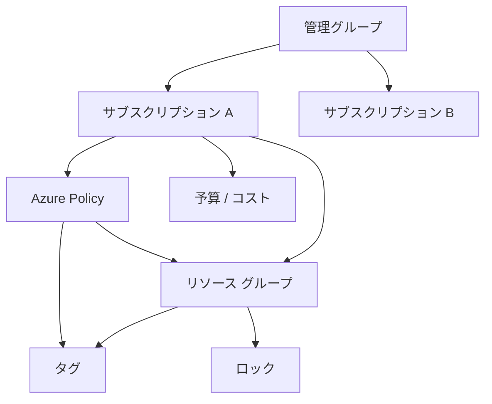

図の読み方
- 管理グループは、複数サブスクリプションへ共通ルールを乗せる土台です。
- Azure Policy は「作成前後の制御」、ロックは「意図しない変更や削除の防止」に向いています。
- タグは整理と可視化に効きますが、タグだけでは制御できません。
- コスト管理は後付けではなく、サブスクリプション設計と一緒に考えます。

## まず結論
Azure のガバナンスで最初に押さえるべき結論は、次の 5 つです。

1. `管理グループ` は、複数サブスクリプションへの共通ルール適用に使う。
2. `サブスクリプション` は、課金、クォータ、運用責任の大きな境界として設計する。
3. `リソース グループ` は、アプリや環境ごとのライフサイクル単位として使う。
4. `Azure Policy` は「何を許し、何を拒否し、何を自動補正するか」を決める。
5. `タグ、ロック、予算` は補助ではなく、運用の基本装備である。

初学者が混乱しやすいのは、「整理」と「制御」を同じものだと思ってしまう点です。タグは整理に強いですが、拒否や強制はできません。ロックは削除防止に強いですが、使ってはいけない SKU を禁止するには向きません。Azure Policy は制御に強いですが、課金予算の通知までは直接担いません。つまり、1 つの機能ですべてを解決するのではなく、役割を分けて組み合わせます。

まずは役割を表で整理します。

| 機能 | 主目的 | できること | できないこと |
| --- | --- | --- | --- |
| タグ | 整理、分類、検索、コスト分析補助 | `environment=prod` などの付与 | 単独では作成禁止や削除防止はできない |
| ロック | 事故防止 | 削除禁止、読み取り専用 | 条件付きルール適用はできない |
| Azure Policy | 制御、監査、自動補正 | 禁止、監査、付与、自動修復 | 予算通知そのものは別機能 |
| 予算 | コスト統制 | 閾値通知、アラート | リソース構成そのものは制御しない |
| 管理グループ | 上位統制 | サブスクリプション横断で統一 | リソースそのものの入れ物ではない |

### 確認質問
1. タグだけで「本番環境では特定リージョン以外を禁止」できますか。
2. 誤削除防止に最も直結するのは、タグ、ロック、Policy のどれですか。

## 先に知っておく用語

| 用語 | 意味 | AZ-104 での見方 |
| --- | --- | --- |
| 管理グループ | 複数サブスクリプションを束ねる上位階層 | 共通ポリシーや共通権限を適用する |
| サブスクリプション | 課金・クォータ・契約の単位 | 部門、環境、請求単位で分ける |
| リソース グループ | リソースの論理単位 | アプリやワークロードのまとまり |
| タグ | キーと値のメタデータ | 検索、分類、コスト配賦補助 |
| リソース ロック | 削除や変更を防ぐ仕組み | `CanNotDelete` と `ReadOnly` が重要 |
| Azure Policy | 構成ルールの適用と監査 | 許可/拒否/監査/修復の中心 |
| イニシアティブ | 複数 Policy のまとめ | セキュリティ基準や社内基準の一括適用 |
| 予算 | コストの上限目安 | 閾値通知で超過を早期発見 |
| Azure Advisor | 推奨事項サービス | コスト、可用性、セキュリティ、性能の助言 |
| 継承 | 上位スコープの設定が下位に及ぶこと | 管理グループやサブスクリプションで重要 |

`継承` は、ガバナンスで非常に重要です。上位スコープで定めたルールは、通常その配下に影響します。これは便利ですが、強すぎる設定を上位に入れると、多くのチームを一度に止める危険もあります。だからこそ、検証用サブスクリプションで試し、本番へ段階適用する発想が必要です。

例として、管理グループに「許可リージョンは Japan East と Japan West のみ」という Policy を割り当てると、その配下のサブスクリプションで新規作成されるリソースは原則その制限を受けます。これにより統制はしやすくなりますが、将来海外リージョン利用が必要になったときには例外設計も必要です。

### 小演習
次の用語の役割を 1 文で説明してください。

1. タグ  
2. ロック  
3. Azure Policy  
4. 管理グループ  

## 核心概念の説明

### 1. サブスクリプション設計は「請求」と「運用責任」で考える
サブスクリプションの切り方に唯一の正解はありません。しかし、AZ-104 の文脈では、次の判断軸で考えると整理しやすいです。

| 分け方 | 向いている場面 | 長所 | 注意点 |
| --- | --- | --- | --- |
| 環境ごと | dev/test/prod を明確に分けたい | 請求、権限、事故影響を分離しやすい | サブスクリプション数が増える |
| 部門ごと | 事業部単位で責任を分けたい | コスト責任が明確 | 横断ルールは管理グループが必要 |
| システムごと | 重要システム単位で分離したい | 強い隔離ができる | 細かく分けすぎると運用が煩雑 |
| 共有基盤 / 個別基盤 | ネットワークや監視を共通化したい | 共有管理しやすい | 責任境界の説明が必要 |

初心者は「とりあえず 1 サブスクリプションで全部入れる」か「逆に細かく分けすぎる」のどちらかに振れがちです。大事なのは、請求責任、クォータ、権限、ガバナンス、障害影響範囲の 5 つで考えることです。

例として、本番と開発を同じサブスクリプションに入れると、予算管理や RBAC は簡単そうに見えますが、本番向けに厳しい Policy を入れたときに開発も巻き込まれやすくなります。逆に本番専用サブスクリプションを切れば、削除ロックや厳格な Policy を本番だけに強く適用しやすくなります。

#### 確認質問
1. サブスクリプションを分ける主な判断軸を 2 つ挙げてください。
2. 本番と開発を分けると、どんな運用メリットがありますか。

### 2. リソース グループは「一緒に管理する単位」で切る
リソース グループは、単なるフォルダーではありません。多くの場面で、権限付与、デプロイ、削除、監査の単位になります。したがって、「一緒に変更し、一緒に見るもの」をまとめるのが基本です。

よくある設計は次の 3 パターンです。

| パターン | 例 | 向いているケース | 注意点 |
| --- | --- | --- | --- |
| アプリ単位 | app1 に必要な VM、LB、NSG を同居 | ワークロードごとの責任が明確 | 共有ネットワークは別管理が必要 |
| 層単位 | network-rg、compute-rg、monitor-rg | 基盤チームが分業している | 依存関係が見えにくい |
| 環境単位 | rg-prod-web、rg-dev-web | 環境別で明確に分けたい | 共通基盤の置き場所を整理する |

重要なのは、「削除して困るものをむやみに同居させない」ことです。たとえば、複数アプリで使う共有 VNet を、1 アプリ専用のリソース グループに入れるのは危険です。そのアプリのライフサイクルに巻き込まれてしまうからです。

例として、App Service 本体と専用の Application Insights、診断ストレージを同じリソース グループに置くかどうかは、運用責任次第です。1 つのアプリチームがまとめて面倒を見るなら同居は自然ですが、監視基盤を中央運用するなら分離した方がよいことがあります。

#### 小演習
次の 2 つのリソースを同じリソース グループに置くか考えてください。

1. 1 つの業務アプリ専用の VM と、その VM 専用の NSG  
2. 複数システムで共用する DNS ゾーンと、単一アプリ専用のストレージ アカウント  

### 3. タグは「意味の揃った共通語」にする
タグはキーと値のペアですが、実務では「命名ルールが揃っているか」が非常に重要です。`Env=Prod`、`environment=production`、`環境=本番` が混在すると、検索、集計、コスト配賦、Policy 自動付与が崩れます。

タグ設計では、数を増やしすぎるより、最小の共通語を決める方が重要です。典型例は次のようなものです。

| タグ キー | 値の例 | 用途 |
| --- | --- | --- |
| environment | dev / test / prod | 環境判別 |
| owner | team-a / infra-team | 責任者の特定 |
| costCenter | cc001 | 課金配賦 |
| criticality | high / medium / low | 重要度の可視化 |
| application | sales-api | アプリ識別 |

ただし、タグには限界があります。タグを付け忘れたら意味がありませんし、タグだけで作成禁止はできません。そこで Azure Policy を使って「タグがなければ作成拒否」「足りないタグを追加」といった制御を組み合わせます。

例として、「本番リソースには `owner` と `costCenter` が必須」というルールは、口頭周知では守られません。Policy で明示的に強制することで、運用のばらつきを減らせます。

#### 確認質問
1. タグのキー名がばらつくと何が起きますか。
2. タグの付与を強制したいとき、補助的に使うべき Azure 機能は何ですか。

### 4. ロックは「強いが単純」な事故防止策
ロックには主に 2 種類あります。

| ロック種別 | 効果 | 典型用途 |
| --- | --- | --- |
| CanNotDelete | 削除を防ぐ | 本番 DB、重要ストレージ |
| ReadOnly | 更新と削除を防ぐ | ほぼ固定の共有基盤 |

ロックは非常に効果的ですが、適用しすぎると運用変更まで止まります。特に `ReadOnly` は強力で、想定以上に多くの操作を阻害します。試験では「誤削除を防ぎたい」なら `CanNotDelete` がまず候補になります。

例として、本番用の Recovery Services vault に誤って削除が入るとバックアップ戦略そのものが壊れます。このようなリソースには `CanNotDelete` を検討する価値があります。一方、頻繁に設定変更する App Service に `ReadOnly` を入れるのは通常不向きです。

#### 小演習
次の要件に対して、ロックを使うべきか考えてください。

1. 本番ストレージを削除事故から守りたい  
2. 開発環境で毎日構成変更する VM を保護したい  

### 5. Azure Policy は「監査」「拒否」「自動補正」を扱う
Azure Policy は、Azure ガバナンスの中心です。単に監査するだけでなく、構成を拒否したり、タグ追加などの自動修復を行ったりできます。

代表的な考え方を整理します。

| 効果 | イメージ | 典型例 |
| --- | --- | --- |
| Audit | ルール違反を記録する | 許可外の SKU を使っている VM を把握 |
| Deny | ルール違反の作成や更新を拒否 | 許可リージョン以外を禁止 |
| Append / Modify | 足りない情報を追加する | タグを自動付与する |
| DeployIfNotExists | 足りない関連設定を自動展開 | 診断設定を自動投入する |

初学者がつまずく点は、「Policy はロックではない」ということです。Policy は条件付きの構成制御が得意です。ロックは事故防止です。両者は競合ではなく補完関係です。

例として、「本番サブスクリプションではパブリック IP の新規作成を禁止したい」なら Policy が向いています。「既存の重要リソースを誤削除したくない」ならロックが向いています。

さらに、複数の Policy をまとめる `イニシアティブ` を使うと、社内標準をパッケージ化できます。試験では単体 Policy と Initiative の使い分けも意識しましょう。

#### 確認質問
1. 許可外リージョンでのリソース作成を止めたいとき、最有力候補は何ですか。
2. タグの自動付与は、Policy のどの考え方に近いですか。

### 6. コスト管理は「使い過ぎた後に気づかない」ための仕組み
Azure のコスト管理では、請求額そのものを学ぶより、早めに異常をつかむ仕組みが重要です。AZ-104 では、予算、アラート、Azure Advisor 推奨事項の組み合わせを押さえます。

| 機能 | 役割 | 例 |
| --- | --- | --- |
| 予算 | 金額の閾値を決めて通知する | 月額予算の 80% 到達で通知 |
| コスト分析 | 何にいくら使っているか見る | サブスクリプション別、タグ別の分析 |
| Azure Advisor | コスト削減余地を提案 | 未使用リソースやサイズ過大を指摘 |

ここで重要なのは、「予算は超過を防ぐ万能ストッパーではない」ということです。通知はしてくれますが、自動停止を保証する仕組みではありません。したがって、予算通知を受けて誰がどう動くかまで決めておく必要があります。

例として、開発サブスクリプションに月額 20 万円の予算を設定し、80%、100%、120% で異なる通知先にアラートを飛ばすと、早めに異常を発見しやすくなります。そこに Advisor のサイズ最適化提案を組み合わせれば、コスト改善サイクルを回しやすくなります。

#### 小演習
「月末に請求を見て驚く」状態を防ぐために、次の 3 つのどれを組み合わせるべきか考えてください。

1. 予算  
2. ロック  
3. Azure Advisor  
4. タグ  

## worked example

### シナリオ
あなたは、開発部門に 2 つのサブスクリプションを配る設計を担当しています。

- `sub-dev` は自由度を高くしたい
- `sub-prod` はリージョン制限、必須タグ、削除事故防止を入れたい
- 両方ともコスト予算を見たい
- 将来さらにサブスクリプションが増える可能性がある

### 設計の考え方
1. `管理グループ` を作り、部門配下のサブスクリプションを束ねる
2. `sub-prod` には強めの Policy とロックを入れる
3. `sub-dev` には最低限のタグ Policy と予算を入れる
4. タグ規則を両方で統一する

### Policy のイメージ
```json
{
  "if": {
    "field": "location",
    "notIn": [
      "japaneast",
      "japanwest"
    ]
  },
  "then": {
    "effect": "deny"
  }
}
```

### subgoal 単位での見方
1. `上位で共通化する`  
   将来サブスクリプションが増えても、管理グループで一括制御しやすくします。
2. `本番だけ強化する`  
   本番の削除事故防止やリージョン制限は、開発より強くするのが自然です。
3. `タグで見える化する`  
   `environment` や `costCenter` を揃えると、運用とコスト分析の共通言語になります。
4. `予算で異常を早期検知する`  
   予算は止める機能ではなく、早く気づくための仕組みです。

### 実務での判断軸
「最初から完璧なルールを全社へ適用する」より、「最小構成から始めて、監査モード→拒否モードへ段階適用する」方が失敗しにくいです。Policy は強力なので、いきなり `Deny` にすると業務停止リスクがあります。

### 確認質問
1. なぜ最初からすべての Policy を `Deny` にしない方がよい場合がありますか。
2. 本番だけロックを強める設計は、どの要件に応えていますか。

## 実践手順または小演習

### 実践手順: ガバナンスの最小セットを設計する
1. サブスクリプションを `dev` と `prod` に分けるかどうかを決めます。
2. すべてのリソースに必須としたいタグを 3 つ以内で決めます。
3. 本番で誤削除を防ぎたいリソースを洗い出します。
4. 許可リージョン、禁止 SKU、必須タグのどれを Policy 化するか決めます。
5. 月額予算と通知閾値を決めます。
6. 管理グループに入れる共通ルールと、個別サブスクリプションに残すルールを分けます。

### 例として考える設計
| 項目 | dev | prod |
| --- | --- | --- |
| 許可リージョン | Japan East / Japan West | Japan East / Japan West |
| 必須タグ | environment, owner | environment, owner, costCenter |
| ロック | 原則なし | 重要リソースに `CanNotDelete` |
| 予算 | 低め、通知重視 | 高め、複数通知先 |

### 小演習
次の要件を満たす構成案を紙に書いてください。

- 経理は本番と開発の請求を分けたい
- インフラ チームは共通ルールを上から効かせたい
- 開発チームは一部自由に検証したい
- 本番では `owner` タグが欠けたリソースを禁止したい

考えるべきものは、管理グループ、サブスクリプション、Policy、ロック、予算です。

## よくある失敗

| よくある失敗 | なぜ起きるか | 防ぎ方 |
| --- | --- | --- |
| タグだけで統制しようとする | タグは整理に強く、制御に弱いから | 強制や拒否は Policy と組み合わせる |
| いきなり広いスコープへ Deny Policy を入れる | 強い統制を急ぎたくなるから | まず Audit で影響を確認する |
| `ReadOnly` ロックを安易に使う | 削除防止と同じだと思うから | まず `CanNotDelete` で足りるか考える |
| 共有基盤と個別アプリを同じ RG に入れる | まとめると楽に見えるから | ライフサイクルと責任単位で切り分ける |
| 予算を設定しただけで安心する | 通知後の行動設計をしていないから | 通知先、対応者、停止基準を決める |

本章で最も大事なのは、「整理」「制御」「事故防止」「コスト監視」は別の役割だという理解です。Azure のガバナンスは 1 つの機能で完結しません。タグ、ロック、Policy、予算、Advisor を組み合わせて、初めて実運用に耐える形になります。

### 確認質問
1. タグ、ロック、Policy の役割の違いを 1 文ずつで言えますか。
2. 共有 VNet をアプリ専用 RG に置くと、なぜ危険ですか。

## まとめ
この章で覚えるべき点は、次の 7 つです。

1. 管理グループは、複数サブスクリプションへの共通統制の土台である。
2. サブスクリプションは、課金・クォータ・責任境界の大きな単位で設計する。
3. リソース グループは、一緒に管理するライフサイクル単位で切る。
4. タグは整理の道具であり、単独では制御機能にならない。
5. ロックは誤削除や誤変更の防止に強く、Policy は条件付きルール制御に強い。
6. Policy は Audit、Deny、Modify、DeployIfNotExists などの考え方で理解すると整理しやすい。
7. コスト管理は、予算、タグ、Advisor を組み合わせて早期発見と改善に使う。

### 最終確認
次の問いに答えられるか確認してください。

1. 本番サブスクリプションだけに厳しい制限をかけるには、どこに何を置くのが自然ですか。  
2. 必須タグの欠落を減らすには、タグだけで十分ですか。  
3. 誤削除を防ぎたいが、通常の更新は続けたい場合、どのロックが候補ですか。  

## 付録: 参照情報
- 試験ガイド: [Study guide for Exam AZ-104](https://learn.microsoft.com/en-us/credentials/certifications/resources/study-guides/az-104)
- 管理グループ: [Management groups](https://learn.microsoft.com/azure/governance/management-groups/overview)
- Azure Policy: [Azure Policy documentation](https://learn.microsoft.com/azure/governance/policy/overview)
- リソース ロック: [Lock your Azure resources](https://learn.microsoft.com/azure/azure-resource-manager/management/lock-resources)
- タグ: [Use tags to organize your Azure resources](https://learn.microsoft.com/azure/azure-resource-manager/management/tag-resources)
- コスト管理: [Microsoft Cost Management documentation](https://learn.microsoft.com/azure/cost-management-billing/cost-management-billing-overview)
- Azure Advisor: [Azure Advisor overview](https://learn.microsoft.com/azure/advisor/advisor-overview)


---

# 第3章 Microsoft Entra ID と Azure RBAC

## 3行要約
AZ-104 の ID 分野は、「誰でログインするか」と「何ができるか」を分けて理解すると急に整理しやすくなります。  
Microsoft Entra ID は認証の土台であり、Azure RBAC は Azure リソースへの認可の仕組みです。  
この章を終えると、ユーザー、グループ、外部ユーザー、SSPR、ロール、スコープ、継承の関係を説明できるようになります。  

## 全体像の図
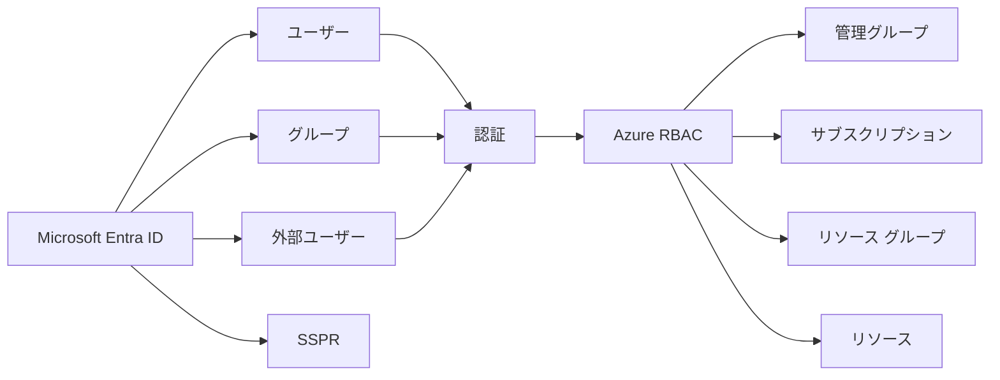

図の読み方
- 左側は「誰か」を扱う領域です。Microsoft Entra ID がユーザーやグループの土台になります。
- 真ん中の `認証` は「本人確認」です。まず誰かを確定します。
- 右側の `Azure RBAC` は「何ができるか」です。スコープごとにロールを割り当てます。
- 同じユーザーでも、割り当てられたスコープとロールが違えばできることは変わります。

## まず結論
この章の核心は、次の 6 点です。

1. `Microsoft Entra ID` は ID 基盤であり、ユーザー、グループ、外部ユーザー、認証機能を管理する。
2. `認証` と `認可` は別物である。ログインできても、Azure リソースを変更できるとは限らない。
3. `Azure RBAC` はロールをスコープに割り当てる仕組みであり、上位スコープほど影響範囲が広い。
4. 権限は `直接割り当て`、`グループ経由`、`上位からの継承` の 3 つを意識して読む。
5. 役割は最小権限で考える。何でも `Owner` を付ける設計は誤りやすい。
6. Entra の管理者ロールと Azure RBAC のロールは別物である。

初学者が最も混乱しやすいのは、`Microsoft Entra の管理者ロール` と `Azure RBAC のロール` を同じものだと思うことです。前者は Entra ディレクトリ自体の管理権限です。後者は Azure リソースの管理権限です。たとえば、Entra でユーザーを作れる人が、そのまま VM を停止できるとは限りません。逆に、サブスクリプションの `Contributor` が Entra ユーザー作成をできるとも限りません。

比較すると違いがはっきりします。

| 項目 | Microsoft Entra の管理者ロール | Azure RBAC |
| --- | --- | --- |
| 対象 | Entra テナント内の ID 管理 | Azure リソース管理 |
| 例 | User Administrator | Owner, Contributor, Reader |
| 主な用途 | ユーザー、グループ、ライセンス管理 | VM、VNet、Storage Account の操作 |
| スコープ | ディレクトリ中心 | 管理グループ、サブスクリプション、RG、リソース |

### 確認質問
1. Entra のユーザー管理権限と Azure の VM 管理権限は同じ仕組みですか。
2. 最小権限が重要なのはなぜですか。

## 先に知っておく用語

| 用語 | 意味 | 初学者向けの要点 |
| --- | --- | --- |
| Microsoft Entra ID | Azure の ID 基盤 | 旧 Azure AD |
| ユーザー | 人を表す ID | 社員、運用担当者など |
| グループ | 複数ユーザーのまとめ | 権限の一括付与に使う |
| 外部ユーザー | ゲストなどの外部 ID | 委託先や協力会社に使う |
| ライセンス | Entra や Microsoft 365 機能利用権 | 機能差は SKU に依存する |
| SSPR | Self-Service Password Reset | ユーザー自身のパスワード リセット |
| Azure RBAC | Azure role-based access control | Azure リソースへの認可 |
| ロール | できる操作の集合 | Reader, Contributor, Owner など |
| スコープ | 権限が及ぶ範囲 | 管理グループ、サブスクリプションなど |
| 継承 | 上位スコープの割り当てが下位へ及ぶこと | サブスクリプションで付けた Reader は配下でも有効 |
| アクセス割り当て | 誰にどのロールがどこで付いているか | 直接、グループ経由、継承を読む |

ここで `認証` と `認可` を改めて分けておきます。認証は「あなたは誰ですか」。認可は「あなたに何をさせますか」です。Entra が認証の土台で、Azure RBAC がリソースへの認可です。試験問題では、この 2 つがセットで出ることが多いです。

例として、協力会社の担当者を Azure Portal に入れる場合を考えます。まず Entra テナントに外部ユーザーとして招待し、本人確認できる状態を作ります。次に、その人に必要な Azure RBAC ロールを必要なスコープへ付けます。どちらか一方だけでは不十分です。

### 小演習
次のケースで必要なのが `認証`, `認可`, `両方` のどれか答えてください。

1. 外部委託先の担当者を Azure Portal に招待する  
2. その担当者に特定のリソース グループだけ閲覧させる  
3. 社員が自分でパスワードを再設定できるようにする  

## 核心概念の説明

### 1. ユーザーとグループは「個人管理」より「運用管理」で考える
Entra ではユーザーとグループを作成できますが、試験対策として重要なのは、単に作り方を覚えることではありません。`個別割り当て` と `グループベース管理` の違いを理解することです。

個人に直接ロールを付けると、その人が異動や退職したときに追跡が難しくなります。グループへロールを付けておけば、メンバー変更で運用できます。実務でも試験でも、継続運用しやすい方が正解になりやすいです。

| 付与方法 | 長所 | 短所 | 典型用途 |
| --- | --- | --- | --- |
| ユーザーへ直接付与 | 単発では速い | 管理が散らばる | 一時対応、例外対応 |
| グループへ付与 | 標準化しやすい | 初期設計が必要 | 継続運用、本番権限 |

例として、「Web チームの運用担当は本番 Web 用 RG だけ Contributor」という要件なら、`grp-web-ops` のようなセキュリティ グループを作り、そのグループにロールを付与する方が管理しやすいです。

さらに、Entra グループはライセンス配布やアクセス制御の単位としても使えます。AZ-104 ではライセンス操作自体も範囲に含まれますが、細かい SKU 差分は変更され得るため、試験直前には公式ライセンス情報の最新表を確認してください。

#### 確認質問
1. なぜ本番権限は個人ではなくグループに寄せる方がよいのですか。
2. 一時的な例外権限は、どの方法だと管理しにくくなりやすいですか。

### 2. 外部ユーザーは「入れること」より「どこまで許すか」が重要
外部ユーザーは、協力会社、ベンダー、監査人などに Azure へ必要最小限のアクセスを渡したいときに使います。ここで大事なのは、「招待したら終わり」ではなく、どのスコープまで何を許すかを分けることです。

外部ユーザーに対しても Azure RBAC は通常どおり使えます。つまり、内部ユーザーと同様に最小権限で設計します。むしろ外部ユーザーの方が、スコープを狭くする意識が重要です。

例として、監査人に全サブスクリプションの閲覧だけを許可したいなら、管理グループまたはサブスクリプションで `Reader` を付けます。一方、委託先に特定アプリの運用を頼むだけなら、そのアプリ用リソース グループに限定して `Contributor` を付ける方が安全です。

ここで「外部ユーザーだから特別な Azure RBAC が必要」というわけではありません。違いは主に Entra 側の招待や ID 管理であり、Azure リソースへの権限付与の考え方は同じです。

#### 小演習
協力会社に「本番サブスクリプションの一部 RG だけ閲覧させたい」場合、次の 2 つをどう設定するか書いてください。

1. Entra 側  
2. Azure RBAC 側  

### 3. SSPR は本人確認の運用負荷を下げる
SSPR は `Self-Service Password Reset` の略で、ユーザー自身がパスワードをリセットできる仕組みです。初学者は試験範囲として軽く見がちですが、ID 運用の基本機能として問われます。

SSPR の本質は、ヘルプデスク依存を減らしつつ、本人確認の手順を整えることです。どの認証方法やライセンスで何が使えるかの細かな条件は変更されることがあるため、試験直前には公式の SSPR ドキュメントを確認してください。

AZ-104 の観点では、次のポイントを押さえると十分です。

1. ユーザーが自分でリセットできる運用を作る機能である
2. 対象ユーザーやグループを選んで有効化できる
3. 本人確認方法を複数組み合わせる考え方がある
4. ID 管理の運用負荷軽減策として理解する

例として、新入社員の初回ログイン問い合わせが多い組織では、SSPR を適切に有効化することで運用負荷を減らせます。ただし、本人確認方式の設計が甘いとセキュリティリスクが上がるため、利便性と安全性の両方で考える必要があります。

#### 確認質問
1. SSPR の主な目的は何ですか。
2. SSPR を入れるとき、利便性だけでなく何も考える必要がありますか。

### 4. Azure RBAC は「ロール + スコープ + 割り当て先」で理解する
Azure RBAC は、次の 3 要素の組み合わせで考えると分かりやすいです。

1. `誰に` 付けるか  
   ユーザー、グループ、サービス プリンシパル、マネージド ID など
2. `どのロールを` 付けるか  
   Reader、Contributor、Owner など
3. `どのスコープで` 付けるか  
   管理グループ、サブスクリプション、リソース グループ、リソース

ここで大事なのは、スコープが広いほど影響も広いことです。

| スコープ | 影響範囲 | 典型用途 |
| --- | --- | --- |
| 管理グループ | 複数サブスクリプション全体 | 監査チームの閲覧権限など |
| サブスクリプション | 1 サブスクリプション全体 | 運用チームの管理権限 |
| リソース グループ | 1 ワークロード単位 | アプリ担当へ限定付与 |
| リソース | 単一リソース | 例外的な個別権限 |

例として、ネットワーク チームがサブスクリプション全体の VNet を運用するなら、ネットワーク専用 RG に絞るか、サブスクリプション単位で必要ロールを付けるかを考えます。逆に、1 個の Storage Account にだけ操作権限を付けるなら、リソース スコープの付与が候補になります。

#### 確認質問
1. 同じ `Contributor` でも、スコープが違うと何が変わりますか。
2. なぜスコープは必要最小限が基本なのですか。

### 5. よく使う組み込みロールの違いを押さえる
AZ-104 では、すべての組み込みロールを暗記する必要はありません。しかし、頻出の基本ロールは区別できる必要があります。

| ロール | できること | できないこと | 使いどころ |
| --- | --- | --- | --- |
| Reader | 閲覧 | 変更 | 監査、参照専用 |
| Contributor | 多くの管理操作 | ロール割り当て管理 | 運用担当 |
| Owner | ほぼすべての管理操作 | なしに近い | 管理責任者、ただし配布しすぎない |
| User Access Administrator | アクセス管理 | 一般的なリソース変更は主目的ではない | RBAC 管理担当 |

特に重要なのは、`Contributor` は強そうに見えてもロール割り当ては原則できないことです。逆に `Owner` は非常に強く、付けすぎると最小権限の原則から外れます。

例として、「運用チームには VM 起動停止やサイズ変更を許可したいが、他人へ権限を配ることは許可したくない」なら、多くの場合 `Contributor` が候補になります。「権限配布そのものを担当する IAM チーム」なら `User Access Administrator` も検討対象です。

#### 小演習
次の要件に合うロールを選んでください。

1. 閲覧だけ許可したい  
2. リソース変更は許可したいが、ロール付与はさせたくない  
3. RBAC 割り当てを管理したい  

### 6. アクセス割り当ては「直接」「グループ経由」「継承」を読む
実際の問題で混乱しやすいのは、「この人はなぜアクセスできるのか」を読む場面です。アクセスの理由は主に次の 3 つです。

1. `直接割り当て`  
   本人に直接ロールが付いている
2. `グループ経由`  
   所属グループにロールが付いている
3. `上位継承`  
   親スコープのロールが下位に継承されている

Azure RBAC は加算型モデルです。つまり、有効権限は付与されたロールの合計で考えます。だからこそ、意図しない広い権限が残りやすいのです。

例として、ユーザー A がリソース グループで `Reader` を直接持ち、さらにサブスクリプションで所属グループ経由の `Contributor` を持っていれば、そのリソース グループ内ではより強い操作ができる可能性があります。問題文で「なぜ閲覧以上ができてしまうのか」を問われたら、継承とグループ経由を疑います。

#### 確認質問
1. あるユーザーの権限を読むとき、なぜグループ所属を確認する必要がありますか。
2. スコープの親子関係を見ないと、どんな誤解が起きますか。

## worked example

### シナリオ
あなたは、次の要件で Azure のアクセス設計を行います。

- 監査チームは全サブスクリプションを閲覧だけしたい
- Web 運用チームは `rg-web-prod` を運用したいが、他チームへ権限配布はできなくしたい
- 協力会社の担当者は `rg-web-dev` だけに一時参加させたい
- ヘルプデスクのパスワード問い合わせを減らしたい

### 設計方針
1. 監査チーム用グループに上位スコープで `Reader` を付ける
2. Web 運用チーム用グループに `rg-web-prod` スコープで `Contributor` を付ける
3. 協力会社担当者を外部ユーザーとして招待し、`rg-web-dev` に限定してロールを付ける
4. 社内ユーザーへ SSPR を有効化する

### CLI 例
```bash
az role assignment create \
  --assignee web-ops-group-object-id \
  --role Contributor \
  --scope /subscriptions/<sub-id>/resourceGroups/rg-web-prod
```

```bash
az role assignment create \
  --assignee audit-group-object-id \
  --role Reader \
  --scope /providers/Microsoft.Management/managementGroups/mg-platform
```

### subgoal 単位での見方
1. `個人ではなくグループへ付与する`  
   メンバーの出入りに強くなります。
2. `スコープを絞る`  
   Web 運用チームには必要な RG だけを任せ、全サブスクリプションには広げません。
3. `外部ユーザーも最小権限で扱う`  
   招待しただけで広い権限を与えないことが重要です。
4. `本人対応の運用負荷を下げる`  
   SSPR はアクセス制御ではなく、ID 運用効率の改善です。

### この例の落とし穴
`Owner` をまとめて全員に付ければ早いように見えますが、それでは権限配布までできてしまい、統制が崩れます。AZ-104 の問題では、この「一見手早いが広すぎる権限」が誤答になりやすいです。

### 確認質問
1. Web 運用チームに `Owner` ではなく `Contributor` を選ぶ理由は何ですか。
2. 協力会社担当者への権限付与で、なぜスコープを `rg-web-dev` に絞るのですか。

## 実践手順または小演習

### 実践手順: 役割とスコープを言語化する
1. 自分の想定組織で「監査」「運用」「開発」「外部委託」の 4 種類の利用者を洗い出します。
2. それぞれに必要な操作を `閲覧`, `変更`, `権限管理` の 3 段階で整理します。
3. どのスコープで付与するのが自然かを決めます。
4. 個人付与でなくグループ付与に変換します。
5. その後、外部ユーザーや SSPR の要否を考えます。

### 例
| 利用者 | 必要操作 | 推奨ロール | 推奨スコープ |
| --- | --- | --- | --- |
| 監査チーム | 閲覧のみ | Reader | 管理グループ |
| Web 運用 | 変更 | Contributor | リソース グループ |
| IAM チーム | 権限管理 | User Access Administrator | サブスクリプション |
| 委託先 | 限定変更 | Contributor か Reader | 対象 RG のみ |

### 小演習
次の要件に対して、`誰に`, `何のロールを`, `どこへ` の 3 列で表を作ってください。

- 監視チームは Application Insights と Log Analytics を閲覧したい
- DB チームは本番 DB 関連 RG のみ変更したい
- セキュリティ チームはサブスクリプション全体のアクセス割り当てを確認したい

## よくある失敗

| よくある失敗 | なぜ起きるか | 防ぎ方 |
| --- | --- | --- |
| Entra 管理者ロールと Azure RBAC を混同する | どちらも「ロール」という言葉を使うから | 対象が ID か Azure リソースかを分けて考える |
| 個人へ直接権限を大量付与する | その場では速いから | 標準はグループ付与にする |
| 何でも Owner を付ける | トラブルを避けたくて広く渡してしまうから | Reader、Contributor、User Access Administrator を使い分ける |
| スコープを広く取りすぎる | 管理が楽に見えるから | 必要最小限のスコープに絞る |
| 外部ユーザーを招待しただけで安心する | 認証できれば十分だと思うから | Azure RBAC の権限範囲も必ず確認する |
| 直接割り当てしか見ない | グループと継承を見落とすから | 有効アクセスは合算で読む |

この章の失敗は、ほとんどが「どの層の話か」を混同するところから始まります。Entra は ID、RBAC は Azure リソース、SSPR は本人対応運用、外部ユーザーは ID 取り込みです。これらを混ぜずに並べることが重要です。

### 確認質問
1. 外部ユーザーを招待しただけでは、Azure リソースを操作できるとは限らないのはなぜですか。
2. `Contributor` と `Owner` の差を 1 文で説明できますか。

## まとめ
この章で覚えるべき点は、次の 8 つです。

1. Microsoft Entra ID は ID 基盤、Azure RBAC は Azure リソースへの認可である。
2. 認証と認可は別物である。
3. ユーザーへ直接付与するより、グループ経由の方が運用しやすい。
4. 外部ユーザーも内部ユーザーと同様に最小権限で扱う。
5. SSPR は自己リセットを可能にし、ID 運用負荷を下げる。
6. Azure RBAC は `ロール + スコープ + 割り当て先` で理解する。
7. 頻出ロールは Reader、Contributor、Owner、User Access Administrator である。
8. 有効権限は、直接、グループ経由、継承の合算で読む。

### 最終確認
次の 3 つを説明できれば、この章の到達点に近いです。

1. Microsoft Entra の管理者ロールと Azure RBAC の違い  
2. 外部ユーザーを Azure へ安全に参加させる流れ  
3. あるユーザーの権限を確認するときの確認順序  

## 付録: 参照情報
- 試験ガイド: [Study guide for Exam AZ-104](https://learn.microsoft.com/en-us/credentials/certifications/resources/study-guides/az-104)
- Microsoft Entra の概要: [What is Microsoft Entra ID?](https://learn.microsoft.com/entra/fundamentals/whatis)
- Azure RBAC の概要: [What is Azure role-based access control (Azure RBAC)?](https://learn.microsoft.com/azure/role-based-access-control/overview)
- Azure 組み込みロール: [Azure built-in roles](https://learn.microsoft.com/azure/role-based-access-control/built-in-roles)
- ロール割り当て: [Steps to assign an Azure role](https://learn.microsoft.com/azure/role-based-access-control/role-assignments-steps)
- SSPR: [How Microsoft Entra self-service password reset works](https://learn.microsoft.com/entra/identity/authentication/concept-sspr-howitworks)
- 外部 ID: [What is Microsoft Entra External ID?](https://learn.microsoft.com/entra/external-id/external-identities-overview)


---

# 第4章 ストレージ設計とデータ保護の基礎

## 3行要約
AZ-104 のストレージ分野では、「何を保存するか」より先に「どう守り、どう公開し、どこまで冗長化するか」を決める必要があります。  
Storage Account は複数のサービスの土台であり、アクセス制御、ネットワーク制御、冗長化、暗号化、レプリケーションの判断が重要です。  
この章を終えると、Storage Account の種類と保護設計を、要件に合わせて比較できるようになります。  

## 全体像の図
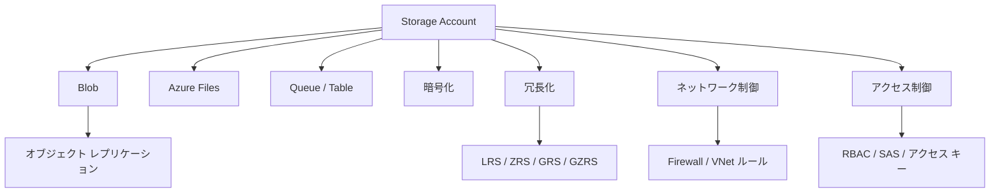

図の読み方
- `Storage Account` が土台で、その下に Blob や Azure Files などのサービスがあります。
- 横断的な設計要素として、暗号化、冗長化、ネットワーク制御、アクセス制御があります。
- Blob の一部機能としてオブジェクト レプリケーションがあり、別リージョン運用や複製設計に関係します。
- AZ-104 では、ストレージを「保存先」ではなく「保護された基盤」として見ることが重要です。

## まず結論
ストレージ分野で最初に押さえるべき結論は次の 6 つです。

1. `Storage Account` は Blob、Azure Files などの土台であり、最初の設計判断が後続機能に影響する。
2. アクセス制御は `RBAC`, `SAS`, `アクセス キー` の役割を分けて考える。
3. ネットワーク制御は、公開範囲を絞る仕組みであり、認可の代わりではない。
4. 冗長化は `LRS`, `ZRS`, `GRS`, `GZRS` を使い分ける。
5. 暗号化は標準で有効だが、どの鍵でどう守るかの考え方を理解する。
6. オブジェクト レプリケーションは、Blob を非同期で別アカウントへ複製する仕組みである。

初学者が迷いやすいのは、「ストレージのアクセス制御」と「ネットワーク制御」を同じだと思う点です。たとえば、Storage Account Firewall で特定ネットワークだけ許可しても、その中にいる全員へ無条件で読み書きを許可しているわけではありません。逆に、RBAC でデータ権限を与えていても、ネットワークから到達できなければアクセスできません。つまり、`誰がよいか` と `どこからよいか` は別の層です。

比較表で整理します。

| 観点 | 主な機能 | 何を決めるか |
| --- | --- | --- |
| 認可 | RBAC、SAS、アクセス キー | 誰がどこまで操作できるか |
| ネットワーク | Firewall、VNet ルール | どこから接続できるか |
| 保護 | 暗号化、冗長化、レプリケーション | どう守るか、障害時にどう残すか |

### 確認質問
1. Firewall を設定しただけで、Blob データへの読み書き権限まで決まりますか。
2. 冗長化と暗号化は、どちらもデータ保護ですが、守っているものは同じですか。

## 先に知っておく用語

| 用語 | 意味 | 先に押さえるポイント |
| --- | --- | --- |
| Storage Account | Azure Storage の管理単位 | Blob、Files などの土台 |
| Blob Storage | オブジェクト ストレージ | ファイル配布、ログ、バックアップなど |
| Azure Files | マネージド ファイル共有 | SMB/NFS 共有に向く |
| SAS | Shared Access Signature | 限定された期限付きアクセス |
| アクセス キー | Storage Account の共有キー | 強力だが管理が重い |
| Firewall | ストレージへのネットワーク制限 | 接続元を絞る |
| VNet ルール | 特定ネットワークからの許可 | サービス エンドポイント等と組み合わせる |
| LRS | Locally Redundant Storage | 単一データセンター内で複製 |
| ZRS | Zone-Redundant Storage | 同一リージョン内の複数ゾーンへ複製 |
| GRS | Geo-Redundant Storage | 別リージョンにも非同期複製 |
| GZRS | Geo-Zone-Redundant Storage | ゾーン冗長 + 地理冗長 |
| オブジェクト レプリケーション | Blob の非同期複製 | ソースから宛先アカウントへ複製 |

ストレージで重要なのは、「最初に選んだアカウント設計が後から効いてくる」ことです。たとえば、冗長化、パフォーマンス層、ネットワーク公開設定、キー管理方針は、作成後に変更可能なものと、制約があるものがあります。試験では「最初にどう選ぶと要件に合うか」が問われます。

例として、「本番ログは別リージョンにも残したい」「ただし通常のファイル共有のように扱いたい」という要件なら、Blob と Azure Files のどちらが主役かで設計が変わります。同じ Azure Storage でも、サービスの性格が異なるからです。

### 小演習
次の要件に近いのが `Blob`, `Azure Files`, `どちらでもない` のどれか考えてください。

1. Web アプリから画像ファイルを大量保存したい  
2. 既存の Windows サーバーから共有ドライブのように使いたい  
3. 一時トークンで外部へ限定公開したい  

## 核心概念の説明

### 1. Storage Account の種類と責務を理解する
Storage Account は、Azure Storage を使うときの大きな管理単位です。作成すると、Blob、Files、Queue、Table などの機能を提供できます。ただし、機能や冗長化、性能、名前解決、ネットワーク制御は Storage Account 単位で影響するものが多いため、単なる入れ物ではありません。

AZ-104 では、特に `StorageV2` を中心に理解すると整理しやすいです。一般用途 v2 は、多くの機能に対応し、標準的な選択肢になります。一方で、Premium のファイル共有や特定用途向けアカウントもあります。

| アカウント観点 | 何が変わるか | 試験での見方 |
| --- | --- | --- |
| 種類 | 利用可能機能、性能層 | まず一般用途 v2 を基準に考える |
| パフォーマンス | Standard / Premium | 遅延や IOPS 要件で判断 |
| 冗長化 | LRS / ZRS / GRS / GZRS | 可用性と DR 要件で判断 |
| ネットワーク | 公開 / 制限 / 無効 | 到達性に直結 |

例として、「通常の Blob 保存と Azure Files を 1 つのアカウントにまとめたい」ことはできますが、用途ごとに責任や公開範囲が違うなら分離した方がよい場合があります。たとえば、アプリ公開用 Blob と社内限定 Azure Files を同じ Storage Account に置くと、ネットワークや権限の境界が考えにくくなることがあります。

#### 確認質問
1. Storage Account は単なるフォルダーではなく、何の管理単位ですか。
2. なぜ用途によってアカウント分離を考える必要がありますか。

### 2. 認可の選択肢: RBAC、SAS、アクセス キー
ストレージの認可方法は 1 つではありません。ここでは、それぞれの特徴を整理します。

| 方法 | 向いている場面 | 長所 | 注意点 |
| --- | --- | --- | --- |
| Microsoft Entra + RBAC | 社内ユーザー、アプリ、原則運用 | 中央管理しやすい | 対応するサービスや操作を理解する必要 |
| SAS | 一時的、限定的な委譲 | 期限、権限、対象を細かく絞れる | 漏えいすると有効期限内は使われ得る |
| アクセス キー | 旧来連携や一部運用 | 広く利用可能 | 強力すぎて最小権限に向かない |

Microsoft は可能な限り Microsoft Entra ベースの認可を推奨しています。特に Blob では、`user delegation SAS` がアカウント キーより安全な選択肢になりやすいです。

SAS には主に `User delegation SAS`, `Service SAS`, `Account SAS` があります。ここでよく出るのが `stored access policy` です。これはコンテナー、キュー、テーブル、ファイル共有といったリソース コンテナーに定義するルールで、1 つ以上の `Service SAS` の制約を一元管理できます。`User delegation SAS` と `Account SAS` では stored access policy を使えません。

例として、外部パートナーへ特定コンテナーだけ 2 日間アップロードを許可したいなら、SAS が有力候補です。一方、社内運用チームが継続的に Blob データを読むなら、RBAC の方が管理しやすいです。

#### 小演習
次の要件で最初に検討する認可方法を書いてください。

1. 社内運用チームが日常的に Blob を読む  
2. 一時的に外部ユーザーへ限定公開したい  
3. レガシー アプリがまだアカウント キー前提で動いている  

### 3. ストレージ Firewall と VNet ルールは「どこから来るか」を制御する
Storage Account のネットワーク制御では、公開範囲をどこまで絞るかを考えます。代表的な考え方は次のとおりです。

| 設定 | 意味 | 典型用途 |
| --- | --- | --- |
| Public network access 有効 | インターネット経由も許可可能 | 公開サービス、移行初期 |
| Selected networks | 指定ネットワークのみ許可 | 社内システム、閉域寄り運用 |
| Public network access 無効 | 公開経路を閉じる | 強く閉じたい本番 |

ここで `Firewall` は認可ではなく到達制御です。許可されたネットワークからでも、認可がなければアクセスできません。逆に、RBAC で権限があっても、ネットワークが閉じていれば接続できません。

VNet ルールは、サービス エンドポイントなどを使って特定仮想ネットワークからの接続を許可する設計に関係します。Private Endpoint はネットワーク章で詳しく扱いますが、ストレージ視点でも「公開経路を減らす手段」として意識しておくと理解がつながります。

例として、社内 Web サーバーだけからバックアップ用 Blob に書き込みさせたいなら、ストレージ側で Selected networks を選び、対象ネットワークからだけ到達可能にしたうえで、認可も絞ります。

#### 確認質問
1. Firewall は「誰が使えるか」ではなく何を制御しますか。
2. 権限があっても接続できないケースがあるのはなぜですか。

### 4. 冗長化は「何の障害まで耐えたいか」で選ぶ
Azure Storage の冗長化は頻出です。単語だけでなく、障害範囲で理解しましょう。

| 冗長化 | 複製先 | 向いている要件 | 注意点 |
| --- | --- | --- | --- |
| LRS | 単一リージョン内の単一データセンター | 低コスト重視 | データセンター障害には弱い |
| ZRS | 単一リージョン内の複数可用性ゾーン | ゾーン障害に強い | すべての種類やリージョンで同一ではない |
| GRS | プライマリ + ペア リージョン | 地理障害対策 | セカンダリは通常読み取り不可 |
| RA-GRS | GRS + セカンダリ読み取り | DR 時に読み取り活用 | 非同期複製である点に注意 |
| GZRS | ゾーン冗長 + 地理冗長 | 高い可用性と DR を両立 | 対応条件とコストを確認 |
| RA-GZRS | GZRS + セカンダリ読み取り | より高い DR 読み取り要件 | コストと要件の釣り合いを見る |

試験では、「最小コストでよい」「ゾーン障害に耐えたい」「リージョン障害にも備えたい」「セカンダリを読み取りたい」という条件から選ぶことが多いです。

例として、単一リージョン内のゾーン障害まで耐えればよいなら ZRS が候補です。別リージョンへの複製が必要なら GRS 系または GZRS 系を検討します。セカンダリから読みたいなら RA 付きです。

なお、どのアカウント種別やサービスでどの冗長化が使えるかは変わることがあるため、細かな対応表は公式ドキュメントで確認してください。

#### 小演習
次の要件に対して候補の冗長化を書いてください。

1. 低コスト優先で、単一データセンター障害は許容する  
2. 同一リージョン内のゾーン障害に耐えたい  
3. 別リージョンへ複製し、必要ならセカンダリ読み取りもしたい  

### 5. 暗号化は「既定で有効」だが、運用方針を理解する
Azure Storage のデータは既定で暗号化されます。したがって、試験では「暗号化があるかないか」よりも、「どの鍵を使うか」「要件に応じてどう考えるか」が重要です。

基本的な考え方は次のとおりです。

| 観点 | 考え方 |
| --- | --- |
| 既定動作 | 保存データは暗号化される |
| 鍵管理 | Microsoft 管理キーか、顧客管理キーかを考える |
| 追加要件 | 規制や監査要件で CMK が必要なことがある |

初学者は「暗号化が既定なら勉強不要」と考えがちですが、AZ-104 では、顧客管理キーやインフラ暗号化など、保護レベルの違いを大づかみで理解しておくと問題に対応しやすくなります。

例として、厳格なコンプライアンス要件で鍵のローテーション管理を組織側で制御したいなら、顧客管理キーが候補になります。一方、通常要件であれば既定の暗号化で十分なことも多いです。

#### 確認質問
1. Azure Storage の保存データ暗号化は、既定で有効ですか。
2. 顧客管理キーが必要になるのは、どんなときですか。

### 6. オブジェクト レプリケーションは Blob の非同期複製
オブジェクト レプリケーションは、Blob をソース アカウントから宛先アカウントへ非同期に複製する機能です。ここで重要なのは、`同期ではない` ことと、`ブロック Blob` が中心であることです。

代表的な用途は、次のようなものです。

1. 地域をまたぐデータ配布
2. DR 用のデータ複製
3. 分離されたアカウント間での Blob データ保全

ただし、オブジェクト レプリケーションは万能ではありません。複製の遅延がありえますし、対象や要件に制約があります。ソースと宛先のアカウントは同じ Entra テナントに属する必要があります。細かな制約条件は変更される可能性があるため、設計時には公式ドキュメントを確認してください。

例として、ログ集約用の Blob を別アカウントに複製して監査専用アカウントで読む構成は考えられます。ただし、即時反映を前提にすると誤解になります。非同期であることを前提に評価します。

#### 確認質問
1. オブジェクト レプリケーションは同期ですか、非同期ですか。
2. すべてのストレージ サービスにそのまま使えると考えてよいですか。

## worked example

### シナリオ
あなたは、社内のファイル保管とアプリ配信用のストレージを設計します。要件は次のとおりです。

- アプリ配信用の画像は Blob で保存したい
- 社内共有は Azure Files を使いたい
- 本番データはリージョン障害にも備えたい
- 外部パートナーには一時的に一部ファイルだけ渡したい
- 本番アクセスは社内ネットワークとアプリ サブネットからだけ許可したい

### 設計方針
1. 用途の違うデータは Storage Account を分ける
2. 社内共有用は Azure Files、アプリ配信用は Blob を中心に考える
3. 本番 Blob は GRS 系または GZRS 系を検討する
4. 外部共有は SAS を短期限で使う
5. 接続元は Firewall と VNet ルールで絞る

### CLI 例
```bash
az storage account create \
  --name stappprod001 \
  --resource-group rg-app-prod \
  --location japaneast \
  --sku Standard_GRS \
  --kind StorageV2
```

```bash
az storage account update \
  --name stappprod001 \
  --resource-group rg-app-prod \
  --default-action Deny
```

### subgoal 単位での見方
1. `用途を分離する`  
   Blob と Azure Files を無理に 1 つへ詰め込まず、責任境界を明確にします。
2. `DR 要件を冗長化で満たす`  
   リージョン障害まで考えるので GRS 系や GZRS 系を検討します。
3. `外部公開は短命にする`  
   SAS は便利ですが、恒久権限にしないことが重要です。
4. `ネットワークと認可を両方絞る`  
   社内から到達できても、認可がなければ使えない構成にします。

### この例から学ぶこと
Storage Account 設計は、単に SKU を選ぶ話ではありません。用途分離、可用性、ネットワーク、認可をまとめて決める必要があります。AZ-104 では、単独機能よりこの組み合わせで問われます。

### 確認質問
1. なぜ社内共有とアプリ配信用 Blob を別アカウントに分けると管理しやすいことがありますか。
2. SAS を「便利だから恒久的に発行する」運用が危険なのはなぜですか。

## 実践手順または小演習

### 実践手順: ストレージ要件を設計表に落とす
1. 対象データを `Blob`, `ファイル共有`, `その他` に分けます。
2. それぞれについて `誰が使うか`, `どこから使うか`, `どの障害まで耐えるか` を書き出します。
3. 認可方式を `RBAC`, `SAS`, `アクセス キー` から選びます。
4. ネットワーク公開を `公開`, `選択ネットワーク`, `閉鎖` から選びます。
5. 冗長化を `LRS`, `ZRS`, `GRS`, `GZRS` 系から選びます。
6. 必要ならオブジェクト レプリケーションの要否を決めます。

### 設計シート例
| データ | 主利用者 | 接続元 | 認可方式 | 冗長化 |
| --- | --- | --- | --- | --- |
| アプリ画像 | Web アプリ | App サブネット | RBAC または SAS | GRS |
| 社内共有ファイル | 社員 | 社内 NW / VPN | ID ベース + RBAC | ZRS または GRS |
| 外部受け渡し用 | パートナー | インターネット | SAS | LRS でも要件次第 |

### 小演習
次の要件に対して、1 行ずつ設計表を作ってください。

- 会計データは厳格に保護したい
- 画像配信は高頻度だが、外部に一部だけ公開したい
- 監査ログは別リージョンへ残したい

## よくある失敗

| よくある失敗 | なぜ起きるか | 防ぎ方 |
| --- | --- | --- |
| ネットワーク制御だけで安全だと思う | 認可との違いを見落とすから | `誰が` と `どこから` を分けて設計する |
| アクセス キーを常用する | 手早く使えるから | 可能なら Entra ベース認可や SAS を検討する |
| 冗長化をコストだけで決める | 障害範囲を考えていないから | 何の障害に耐えたいかで選ぶ |
| SAS を長期間・広権限で発行する | 便利だから | 期限、権限、対象を最小化する |
| 用途の異なるデータを 1 アカウントへ混在させる | 管理対象を減らしたくなるから | 責任境界と公開範囲で分離を検討する |
| オブジェクト レプリケーションを同期だと思う | 複製という言葉の印象が強いから | 非同期である前提で要件を確認する |

### 確認質問
1. Firewall と SAS の役割の違いを 1 文ずつで言えますか。
2. オブジェクト レプリケーションを即時同期と誤解すると、どんな設計ミスが起きますか。

## まとめ
この章で覚えるべき点は、次の 8 つです。

1. Storage Account は Blob や Azure Files の土台であり、重要な管理単位である。
2. 認可は RBAC、SAS、アクセス キーを使い分ける。
3. Firewall や VNet ルールは接続元制御であり、認可とは別である。
4. 冗長化は障害範囲とコストの両方で選ぶ。
5. ZRS はゾーン障害、GRS/GZRS は地理障害を意識した選択肢である。
6. Storage の保存データ暗号化は既定で有効だが、鍵管理方針も理解する。
7. オブジェクト レプリケーションは Blob の非同期複製である。
8. ストレージ設計では、用途分離、公開範囲、DR、認可をまとめて考える。

### 最終確認
次の 3 つを説明できるか確認してください。

1. RBAC, SAS, アクセス キーの違い  
2. LRS, ZRS, GRS, GZRS 系の違い  
3. Firewall と認可を別々に考える理由  

## 付録: 参照情報
- 試験ガイド: [Study guide for Exam AZ-104](https://learn.microsoft.com/en-us/credentials/certifications/resources/study-guides/az-104)
- Storage Account の概要: [Storage account overview](https://learn.microsoft.com/azure/storage/common/storage-account-overview)
- データ冗長化: [Data redundancy - Azure Storage](https://learn.microsoft.com/azure/storage/common/storage-redundancy)
- SAS 概要: [Grant limited access to data with shared access signatures (SAS)](https://learn.microsoft.com/en-us/azure/storage/common/storage-sas-overview)
- データ アクセス認可: [Authorize access to Azure Storage](https://learn.microsoft.com/en-us/azure/storage/common/authorize-data-access)
- ストレージ ネットワーク セキュリティ: [Azure Storage network security](https://learn.microsoft.com/azure/storage/common/storage-network-security)
- オブジェクト レプリケーション: [Object replication overview](https://learn.microsoft.com/en-us/azure/storage/blobs/object-replication-overview)
- 暗号化: [Azure Storage encryption for data at rest](https://learn.microsoft.com/azure/storage/common/storage-service-encryption)


---

# 第5章 Azure Blob と Azure Files の実装

## 3行要約
ストレージの後半では、Storage Account を作った後に、実際のデータをどう配置し、どう保護し、どう運用するかを学びます。  
AZ-104 では、Blob コンテナー、Azure Files、アクセス層、ソフト削除、スナップショット、バージョニング、ライフサイクル管理、AzCopy、Storage Explorer が重要です。  
この章を終えると、データを置くだけでなく「誤削除から守り、コストを最適化し、運用しやすくする」設定を説明できるようになります。  

## 全体像の図
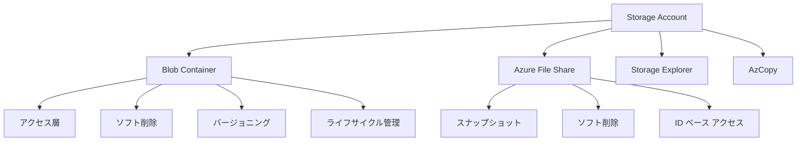

図の読み方
- Blob と Azure Files は同じ Storage Account の中で使えますが、運用観点は異なります。
- Blob 側はアクセス層、バージョニング、ライフサイクル管理が特に重要です。
- Azure Files 側は共有ドライブ的に使うため、ID ベース アクセスとスナップショットが重要です。
- Storage Explorer と AzCopy は、データ運用を支える実務ツールとして頻出です。

## まず結論
この章で先に押さえるべき結論は次の 7 つです。

1. `Blob Container` はオブジェクト単位の運用、`Azure File Share` は共有ファイル運用に向く。
2. Blob の `アクセス層` はコストと復旧速度のトレードオフで選ぶ。
3. `ソフト削除`, `スナップショット`, `バージョニング` は誤削除や誤更新から守るための基礎機能である。
4. `ライフサイクル管理` は、使われない Blob を自動で階層移動や削除する仕組みである。
5. Azure Files では `ID ベース アクセス` を使うと、共有キーに頼らず運用しやすい。
6. `AzCopy` は大量データ転送に強く、`Storage Explorer` は視覚的な管理に強い。
7. バックアップが別章にあるからといって、この章の保護機能を軽視してはいけない。

初学者は、「バックアップがあるならソフト削除やバージョニングはいらない」と思いがちです。しかし、役割が違います。バックアップは広い意味での復旧戦略です。ソフト削除やバージョニングは、もっと手前の「操作ミスをすぐ戻せる」仕組みです。日常運用では、こちらの方が先に効くことが多いです。

比較表で整理します。

| 機能 | 主な対象 | 守れる事故 | 特徴 |
| --- | --- | --- | --- |
| ソフト削除 | Blob / File Share | 誤削除 | 一定期間は論理削除状態で残る |
| バージョニング | Blob | 誤更新、上書き | 以前の版を残せる |
| スナップショット | Azure Files, Blob | ある時点の保全 | 読み戻しや比較に使える |
| ライフサイクル管理 | Blob | コスト膨張 | 条件に応じて階層移動や削除 |

### 確認質問
1. バックアップとソフト削除は、同じ役割ですか。
2. Blob の運用で、なぜバージョニングが役に立つのですか。

## 先に知っておく用語

| 用語 | 意味 | 先に押さえるポイント |
| --- | --- | --- |
| Blob Container | Blob をまとめる単位 | オブジェクト保存の論理箱 |
| Azure File Share | Azure Files の共有単位 | SMB/NFS で共有可能 |
| アクセス層 | Hot, Cool, Cold, Archive | コストとアクセス頻度で選ぶ |
| ソフト削除 | 論理削除保護 | 削除直後に戻しやすい |
| スナップショット | 特定時点のコピー | 差分的な保全や復元に使う |
| バージョニング | 版管理 | 上書き事故に強い |
| ライフサイクル管理 | ルールベースの自動階層移動・削除 | コスト最適化に使う |
| AzCopy | 高速データ転送ツール | バッチ転送に向く |
| Storage Explorer | GUI 管理ツール | 目視確認や操作に向く |
| ID ベース アクセス | Entra ベースで Azure Files を使う | 共有キー依存を減らす |

Blob と Azure Files は似て見えても、操作モデルが異なります。Blob は HTTP ベースのオブジェクト ストレージとして扱うのが基本で、アプリや配信、ログ保存に強いです。Azure Files は共有フォルダーに近く、既存ファイル サーバーの延長として考えやすいです。

例として、アプリのアップロード画像を保存するなら Blob が自然です。複数の Windows サーバーが同じ共有フォルダーを使いたいなら Azure Files が自然です。ここを逆にすると、後で権限設計やアクセス経路で苦労します。

### 小演習
次の要件に対して、`Blob`, `Azure Files` のどちらが自然か答えてください。

1. Web API が画像を PUT/GET する  
2. 既存の社内システムが共有ドライブを前提にしている  
3. ライフサイクルで低頻度データを段階的に安くしたい  

## 核心概念の説明

### 1. Blob Container は「オブジェクト単位」で設計する
Blob Container は、Blob をまとめる単位です。フォルダーのように見える階層を使うこともありますが、本質はオブジェクト ストレージです。ディレクトリ構造そのものより、命名、タグ、アクセス方式、保持期間が重要です。

Container 設計では、次の観点を先に決めると迷いにくくなります。

| 観点 | 何を決めるか |
| --- | --- |
| 用途 | アプリ配信、ログ、バックアップ、一時共有など |
| 公開範囲 | 完全非公開、一時公開、匿名公開の可否 |
| 保持期間 | 何日残すか、いつ安い層へ落とすか |
| 復元性 | ソフト削除、バージョニングを使うか |

例として、監査ログ用コンテナーなら匿名公開は不要で、長期保管とライフサイクル管理が重要です。一方、静的 Web コンテンツ配信なら配信性能や公開方法が重要になります。Container は単なる箱ではなく、用途ごとに運用方針を持たせる単位だと理解してください。

#### 確認質問
1. Blob Container を設計するとき、なぜフォルダー構造だけで考えてはいけないのですか。
2. 監査ログ用コンテナーで優先すべき設定は何ですか。

### 2. アクセス層はコストだけでなく復元時間でも選ぶ
Blob のアクセス層は `Hot`, `Cool`, `Cold`, `Archive` が基本です。選び方は、単純な安さだけではありません。アクセス頻度、保存期間、再取得コスト、復元にかかる時間で考えます。

| 層 | 向いているデータ | 特徴 |
| --- | --- | --- |
| Hot | 頻繁に読むデータ | 保存コストは高め、アクセスコストは低め |
| Cool | たまに読むデータ | 保存コストは下がるが、アクセスコストは上がる |
| Cold | まれに読むデータ | Cool よりさらに安いが、保持期間条件に注意 |
| Archive | ほとんど読まない長期保管 | 最安だが、再水和に時間がかかる |

Archive を「安いから最強」と誤解してはいけません。Archive はオフライン層であり、即時アクセス向きではありません。数時間単位の再水和を前提に考える必要があります。また、保持期間条件もあります。

例として、毎日参照する運用ログを Archive に入れるのは不適切です。一方、法令保管が必要で、ほぼ読み戻さないデータなら候補になります。

#### 小演習
次のデータに向くアクセス層を書いてください。

1. 直近 7 日間に頻繁に読む画像  
2. 月 1 回程度しか見ない帳票  
3. 年に 1 回読むかどうかの監査保管データ  

### 3. ソフト削除、バージョニング、スナップショットの役割を分ける
この 3 つは似て見えますが、守れる事故が違います。

| 機能 | 主な対象 | 強い事故 | 典型用途 |
| --- | --- | --- | --- |
| ソフト削除 | Blob / Container / File Share | 誤削除 | 削除直後の復旧 |
| バージョニング | Blob | 上書き事故、誤更新 | 以前版への戻し |
| スナップショット | File Share / Blob | 時点保全 | 定期退避、比較、復元 |

ソフト削除は、「消したつもりでも一定期間残す」機能です。バージョニングは、「更新前の版を持つ」機能です。スナップショットは、「ある瞬間の状態を切り取る」機能です。だから、同時に併用する価値があります。

例として、アプリが誤って Blob を上書きした場合、ソフト削除だけでは以前内容の復元には弱いことがあります。バージョニングがあれば、旧版を使って戻しやすくなります。逆に、Blob 自体を消してしまったならソフト削除が効きます。

#### 確認質問
1. 上書き事故への最有力候補は、ソフト削除とバージョニングのどちらですか。
2. スナップショットは、どういうときに便利ですか。

### 4. ライフサイクル管理は「使われないデータを放置しない」仕組み
Blob lifecycle management は、条件に応じて Blob を別階層へ移したり、削除したりするルールベース機能です。コスト最適化の中心機能です。

代表的な考え方は次のとおりです。

1. 一定日数アクセスがなければ Cool や Cold に移す
2. さらに長期間使われなければ Archive に移す
3. 保存期間が過ぎたら削除する

例として、「30 日使わなければ Cool、90 日で Cold、365 日で削除」というルールを作れば、運用担当が手作業で階層移動しなくて済みます。ログや画像など、増え続けるデータには特に有効です。

ただし、Archive への移動は再アクセス時の遅延を生むため、誤って頻繁に読むデータへ適用しないように注意が必要です。また、Premium Block Blob ストレージでは通常のアクセス層移動制約があるため、詳細条件は公式ドキュメントを確認してください。

#### 小演習
「アクセス頻度が 1 か月で急に落ちるが、たまに監査で戻す可能性があるログ」向けに、30 日、90 日、365 日でどう階層を動かすか考えてください。

### 5. Azure Files は ID ベース アクセスが重要
Azure Files を共有フォルダーのように使う場合、アクセス キーだけで運用すると、共有キーを知る人が広く使えてしまい、利用者単位の制御が難しくなります。そこで重要なのが `ID ベース アクセス` です。

Azure Files は Microsoft Entra Domain Services やオンプレミス Active Directory Domain Services、Microsoft Entra Kerberos などと連携した認証シナリオを持ちます。どの方式を選ぶかは既存環境によります。AZ-104 では、「共有キー依存から脱却し、ID ベースで制御できる」ことを理解するのが重要です。

| 方式 | 向いている場面 | ポイント |
| --- | --- | --- |
| 共有キー | 一時的、簡易接続 | 利用者単位の追跡が難しい |
| ID ベース アクセス | 社員やサーバーの継続利用 | 個別/グループ単位で制御しやすい |

例として、社内の複数部門が Azure Files を部門共有として使うなら、ID ベース アクセスでグループ単位に権限を分けた方が自然です。キーを配ってしまうと、誰が何をしたか追いにくくなります。

#### 確認質問
1. Azure Files で共有キーだけに頼る運用の弱点は何ですか。
2. ID ベース アクセスの利点を 1 つ挙げてください。

### 6. AzCopy と Storage Explorer は役割が違う
試験では、AzCopy と Storage Explorer の違いも整理しておきたいポイントです。

| ツール | 向いている場面 | 長所 | 注意点 |
| --- | --- | --- | --- |
| AzCopy | 大量転送、自動化、スクリプト | 高速、繰り返しやすい | コマンド操作に慣れが必要 |
| Storage Explorer | 目視確認、単発操作、GUI 管理 | 分かりやすい | 大量処理の自動化には向かない |

AzCopy は、大量データのアップロード、ダウンロード、同期に強いです。Storage Explorer は、コンテナーやファイル共有の中身確認、SAS を使った接続、簡単な操作に向きます。

例として、数 TB のログを定期転送するなら AzCopy が候補です。特定コンテナーの中身を GUI で見ながら確認したいなら Storage Explorer が便利です。

#### 小演習
次の作業に向くツールを書いてください。

1. 夜間バッチで毎日大量転送する  
2. 手元でコンテナー内容を目視確認する  
3. スクリプトから再実行可能な転送処理にしたい  

## worked example

### シナリオ
あなたは、社内システムのデータ運用を整理します。要件は次のとおりです。

- アプリ画像は Blob に保存する
- 30 日を過ぎた画像はアクセス頻度が下がる
- 法定保管が必要なログは長期保管したい
- 社内共有フォルダーは Azure Files に移行する
- 画像の誤削除や上書き事故に備えたい

### 設計方針
1. 画像用コンテナーにソフト削除とバージョニングを入れる
2. 画像用 Blob はライフサイクル管理で Hot から Cool へ移す
3. 長期ログは Cold または Archive を検討する
4. 社内共有は Azure Files にし、ID ベース アクセスを有効化する
5. バルク移行は AzCopy を使う

### CLI 例
```bash
az storage container create \
  --name app-images \
  --account-name stappprod001 \
  --auth-mode login
```

```bash
azcopy copy "C:\\data\\images" "https://stappprod001.blob.core.windows.net/app-images?<SAS>" --recursive=true
```

### ライフサイクル ポリシーのイメージ
```json
{
  "rules": [
    {
      "name": "move-old-images",
      "enabled": true,
      "type": "Lifecycle",
      "definition": {
        "filters": {
          "blobTypes": [
            "blockBlob"
          ],
          "prefixMatch": [
            "app-images/"
          ]
        },
        "actions": {
          "baseBlob": {
            "tierToCool": {
              "daysAfterModificationGreaterThan": 30
            }
          }
        }
      }
    }
  ]
}
```

### subgoal 単位での見方
1. `誤操作から守る`  
   ソフト削除とバージョニングで、削除と上書きの両方に備えます。
2. `コストを自動調整する`  
   ライフサイクル管理で、古くなった画像を自動で安い層へ移します。
3. `共有フォルダーを近代化する`  
   Azure Files に移しつつ、ID ベース アクセスで運用します。
4. `移行作業を現実的にする`  
   大量転送は AzCopy で処理し、GUI での微調整は Storage Explorer に任せます。

### 確認質問
1. 画像用 Blob にソフト削除とバージョニングを併用する理由は何ですか。
2. 大量移行で Portal より AzCopy が向く理由は何ですか。

## 実践手順または小演習

### 実践手順: Blob と Azure Files の保護設定を考える
1. 任意のデータを `オブジェクト保存` と `共有ファイル` に分けます。
2. Blob について、アクセス層、ソフト削除、バージョニング、ライフサイクルの要否を決めます。
3. Azure Files について、ID ベース アクセス、スナップショット、ソフト削除の要否を決めます。
4. データ移行に AzCopy を使うか、Storage Explorer を使うかを選びます。
5. 「誤削除」「誤更新」「コスト増加」の 3 つに対する対策を 1 行ずつ書きます。

### 練習用設計表
| データ種別 | 保存先 | 保護設定 | コスト最適化 |
| --- | --- | --- | --- |
| 商品画像 | Blob | ソフト削除、バージョニング | 30 日後 Cool |
| 監査ログ | Blob | ソフト削除 | 90 日後 Cold / 長期は Archive |
| 部門共有 | Azure Files | スナップショット、ソフト削除、ID ベース | 容量監視中心 |

### 小演習
次の要件を満たす設定を箇条書きで書いてください。

- 共有ファイルの誤削除を 1 週間以内なら戻したい
- 画像の上書き事故を追跡したい
- 古いログは自動で安い層へ落としたい

## よくある失敗

| よくある失敗 | なぜ起きるか | 防ぎ方 |
| --- | --- | --- |
| Archive を安いからとすぐ選ぶ | 復元遅延を見ていないから | 再水和時間まで考える |
| バックアップがあるからバージョニング不要と考える | 役割の違いを見落とすから | 日常復旧と本格復旧を分けて考える |
| Azure Files に共有キーを配り続ける | 旧来運用の延長で考えるから | ID ベース アクセスを検討する |
| GUI だけで大量データ移行しようとする | 目に見える操作が安心だから | 大量転送は AzCopy を使う |
| ライフサイクルを使わず手動で階層変更する | 最初は少量で回るから | データ増加前に自動化する |
| ソフト削除とバージョニングを混同する | どちらも「戻せる」と理解するから | 削除事故か上書き事故かで使い分ける |

### 確認質問
1. Archive の最大の注意点は何ですか。
2. 上書き事故の追跡と復元に強いのは何ですか。

## まとめ
この章で覚えるべき点は、次の 8 つです。

1. Blob はオブジェクト運用、Azure Files は共有ファイル運用に向く。
2. アクセス層は Hot, Cool, Cold, Archive をアクセス頻度と復元速度で選ぶ。
3. ソフト削除は誤削除、バージョニングは誤更新、スナップショットは時点保全に強い。
4. ライフサイクル管理は Blob のコスト自動最適化に有効である。
5. Azure Files では ID ベース アクセスが運用上有利である。
6. AzCopy は高速転送と自動化、Storage Explorer は GUI 管理に向く。
7. ストレージ保護は、バックアップ以前の「日常防御」として重要である。
8. データ特性ごとに設定を分けると、コストと復元性の両立がしやすい。

### 最終確認
次の 3 つを説明できるか確認してください。

1. ソフト削除、バージョニング、スナップショットの違い  
2. Hot, Cool, Cold, Archive の使い分け  
3. AzCopy と Storage Explorer の違い  

## 付録: 参照情報
- 試験ガイド: [Study guide for Exam AZ-104](https://learn.microsoft.com/en-us/credentials/certifications/resources/study-guides/az-104)
- Azure Blob Storage アクセス層: [Access tiers for blob data](https://learn.microsoft.com/en-us/azure/storage/blobs/access-tiers-overview)
- Blob ライフサイクル管理: [Azure Blob Storage lifecycle management](https://learn.microsoft.com/en-us/azure/storage/blobs/lifecycle-management-overview)
- Blob バージョニング: [Blob versioning](https://learn.microsoft.com/en-us/azure/storage/blobs/versioning-overview)
- Blob ソフト削除: [Soft delete for blobs](https://learn.microsoft.com/en-us/azure/storage/blobs/soft-delete-blob-overview)
- Azure Files の ID ベース アクセス: [Overview of Azure Files identity-based authentication options for SMB access](https://learn.microsoft.com/en-us/azure/storage/files/storage-files-active-directory-overview)
- AzCopy: [Get started with AzCopy](https://learn.microsoft.com/en-us/azure/storage/common/storage-use-azcopy-v10)
- Storage Explorer: [Manage Azure storage resources with Storage Explorer](https://learn.microsoft.com/en-us/azure/storage/common/storage-explorer/vs-azure-tools-storage-manage-with-storage-explorer)


---

# 第6章 ARM/Bicep と Azure VM の管理

## 3行要約
AZ-104 のコンピュート分野では、仮想マシンを作れるだけでは不十分で、再現可能なデプロイ、可用性設計、ディスク運用、移動、暗号化まで理解する必要があります。  
ARM テンプレートと Bicep は、Azure リソースを宣言的に管理するための基盤であり、VM 運用の再現性を高めます。  
この章を終えると、VM をどこにどう配置し、どのように安全に継続運用するかを説明できるようになります。  

## 全体像の図
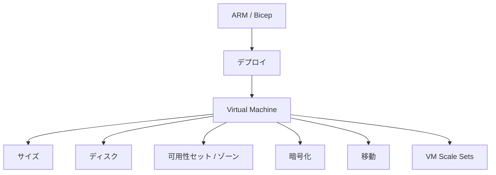

図の読み方
- 左から右へ、まず再現方法を決めてから VM 本体の設計に入る流れです。
- VM の周辺で特に重要なのは、サイズ、ディスク、可用性、暗号化、移動です。
- `VM Scale Sets` は複数 VM をスケールさせる仕組みで、単一 VM とは運用前提が異なります。
- AZ-104 では、作成と変更だけでなく、移行と継続運用も問われます。

## まず結論
この章で先に覚えるべき結論は次の 7 つです。

1. `Portal で作れる` と `再現できる` は違う。継続運用を考えるなら Bicep や ARM が重要である。
2. VM 設計では、`サイズ`, `ディスク`, `可用性`, `ネットワーク`, `暗号化` をまとめて考える。
3. `Availability Set` と `Availability Zone` は目的が似ていても、障害分離の考え方が違う。
4. ディスクは OS ディスク、データ ディスク、一時ディスクの役割を分けて理解する。
5. VM の移動は、同じリージョン内の RG/サブスクリプション移動と、リージョン間移行で考え方が違う。
6. `Azure Disk Encryption` はゲスト OS 側も関わる暗号化であり、保存データの既定暗号化とは別概念である。
7. 複数台を前提に自動スケールしたいなら、単発 VM より `VM Scale Sets` を疑う。

初学者は VM を「Azure の中心」と見がちですが、実際には VM は数ある実行基盤の 1 つにすぎません。だからこそ、必要以上に VM を増やさず、必要なときだけ VM を正しく使うことが重要です。AZ-104 では PaaS やコンテナーも出ますが、まず VM を正しく扱えることが土台になります。

比較表で、よく混同する項目を先に整理します。

| 項目 | 似て見える相手 | 違い |
| --- | --- | --- |
| ARM テンプレート | Bicep | どちらも宣言的だが、Bicep の方が読みやすい |
| Availability Set | Availability Zone | Set は同一データセンター前提、Zone はゾーン分離 |
| ディスクの既定暗号化 | Azure Disk Encryption | 役割と実装層が異なる |
| 単一 VM | VM Scale Sets | 1 台管理か、複数台の一括運用か |

### 確認質問
1. Portal で 1 回作れることと、毎回同じように再現できることは同じですか。
2. Availability Set と Availability Zone は、同じ障害分離を提供しますか。

## 先に知っておく用語

| 用語 | 意味 | 先に押さえるポイント |
| --- | --- | --- |
| ARM テンプレート | Azure Resource Manager JSON テンプレート | 宣言的 IaC |
| Bicep | ARM を簡潔に書ける DSL | 初学者はこちらから理解しやすい |
| Virtual Machine | Azure 上の仮想マシン | IaaS の代表 |
| VM サイズ | vCPU、メモリ、性能の組み合わせ | ワークロードに応じて変更可能 |
| OS ディスク | OS を入れるディスク | VM 起動に必須 |
| データ ディスク | 業務データ用ディスク | アプリや DB のデータ向け |
| 一時ディスク | ホスト依存の一時領域 | 永続データ保存に不向き |
| Availability Set | 障害ドメイン/更新ドメイン分散 | 同一 DC 内の分散 |
| Availability Zone | リージョン内の独立ゾーン | より強い物理分離 |
| Azure Disk Encryption | ゲスト OS レベルのディスク暗号化 | 既定暗号化とは別に理解する |
| VM Scale Sets | 同一構成 VM 群の一括管理 | 自動スケールや大規模配備向け |

特に `ARM テンプレート` と `Bicep` は、単なる記法の差以上に「運用の再現性」を象徴する存在です。Portal だけでは、誰がどんな値を入れたかの再現が難しくなります。Bicep なら、構成をファイルとして残し、レビューし、再利用できます。

例として、本番と検証でほぼ同じ VM 構成を作るなら、Portal で 2 回作るより、Bicep でパラメーターを変えてデプロイする方が安全です。

### 小演習
次の要件に対して、`Portal`, `Bicep`, `どちらも使う` のどれが自然か答えてください。

1. 1 回だけ試しに VM を作る  
2. 毎月同じ構成の検証環境を再作成する  
3. 既存 VM の設定値を目視確認する  

## 核心概念の説明

### 1. ARM と Bicep は「手順」ではなく「完成形」を表す
ARM テンプレートと Bicep は、Azure リソースを宣言的に定義します。つまり、「まずこれを作って、次にこれを設定して」という手順を書くより、「最終的にこういう状態であってほしい」と表現します。

この考え方の利点は次のとおりです。

1. 再現できる
2. 差分管理できる
3. レビューしやすい
4. 手作業ミスを減らせる

例として、VM、VNet、NSG、Public IP をまとめて環境として作るとき、Bicep なら依存関係を保ちながら一括定義できます。Portal で何度も作ると、設定漏れや命名ゆれが起こりやすくなります。

ARM JSON は機械的で厳密ですが、人間には読みづらいです。Bicep はそれを読みやすくした言語です。試験では、既存 ARM を Bicep に変換したり、デプロイを理解したりする観点が問われます。

#### 確認質問
1. 宣言的デプロイの利点を 2 つ挙げてください。
2. Bicep が ARM より初学者に向く理由は何ですか。

### 2. VM 作成では「サイズ」「ディスク」「ネットワーク」を同時に見る
VM を作るとき、CPU とメモリだけ見てはいけません。少なくとも次の 3 つは同時に見ます。

| 観点 | 主な判断 | 代表的な失敗 |
| --- | --- | --- |
| サイズ | vCPU、メモリ、系列 | 過大スペックでコスト超過 |
| ディスク | OS、データ、性能 | 一時ディスクに永続データを置く |
| ネットワーク | VNet、Subnet、NSG、Public IP | 不要な公開 IP を付ける |

サイズは後から変えられることが多いですが、ワークロード影響や停止を伴う場合があります。ディスクは性能要件にも関係します。ネットワークはセキュリティと到達性に直結します。どれか 1 つだけ最適でも、全体として正しくないことがあります。

例として、管理用の小規模 VM なのに大きなメモリ最適化 SKU を選ぶとコスト過剰です。逆に、DB ワークロードで IOPS が足りないディスクを選ぶと性能問題が出ます。

#### 小演習
次の VM に対して重視すべき観点を書いてください。

1. バッチ実行だけの小規模管理サーバー  
2. I/O が多いアプリ サーバー  
3. 外部公開不要な内部運用サーバー  

### 3. ディスクの役割を分ける
Azure VM のディスクでは、役割の違いを押さえることが重要です。

| ディスク | 役割 | 注意点 |
| --- | --- | --- |
| OS ディスク | OS を保持 | VM の起動に必須 |
| データ ディスク | アプリ データ、DB データ | 追加接続して使う |
| 一時ディスク | 一時データ | 再起動やホスト変更で消える可能性がある |

初学者が最も危険なのは、一時ディスクを永続保存先だと思うことです。一時ディスクはキャッシュや一時ファイル向けであり、重要データの保存先ではありません。

また、管理ディスクの種類やサイズで性能が変わります。Premium SSD、Standard SSD、Standard HDD などの違いは、コストと性能のトレードオフです。試験では細かな数値暗記より、性能要件に対する大まかな使い分けが重要です。

例として、ログの一時展開先を一時ディスクに置くのはありえますが、業務 DB を置くのは不適切です。

#### 確認質問
1. 一時ディスクに業務データを置くのが危険な理由は何ですか。
2. データ ディスクは何のために使いますか。

### 4. 可用性セットと可用性ゾーンの違い
どちらも可用性向上に使いますが、障害分離の単位が違います。

| 項目 | Availability Set | Availability Zone |
| --- | --- | --- |
| 分離対象 | 障害ドメイン、更新ドメイン | リージョン内の物理的に独立したゾーン |
| 主な想定 | 同一データセンター内での分散 | ゾーン障害対策 |
| 強さ | ゾーンより限定的 | より強い物理分離 |

Availability Set は古い概念と誤解されることがありますが、依然として試験範囲です。Availability Zone が使えないリージョンや要件もありえます。大事なのは、「どの障害に耐えたいか」を見て選ぶことです。

例として、2 台のアプリ VM をゾーン対応リージョンに配置できるなら、異なる Availability Zone へ置く方が物理障害耐性は高いです。一方、ゾーン対応が使えない条件なら Availability Set が候補になります。

#### 小演習
次の要件に向く候補を書いてください。

1. リージョン内のゾーン障害に備えたい  
2. ゾーン未対応環境で複数 VM を分散したい  

### 5. Azure Disk Encryption は保存データの既定暗号化と別物
Azure の管理ディスクは既定で保存時暗号化されています。しかし、試験範囲には `Azure Disk Encryption` も含まれます。ここで混乱しないことが重要です。

`既定暗号化` は、Azure 側で保存データを保護する仕組みです。`Azure Disk Encryption` は、BitLocker や DM-Crypt を使ったゲスト OS 側の暗号化です。つまり、層が違います。

初学者は「既定で暗号化されているなら ADE は不要」と短絡しがちですが、コンプライアンスや要件によってはゲスト OS レベルの暗号化が必要な場合があります。一方で、運用負荷や対応可否もあるため、何でも ADE が正解ではありません。

例として、「ゲスト OS レベルでの暗号化を必須とする監査要件」があるなら ADE を検討します。単に Azure 標準の保存時暗号化で足りるなら、既定暗号化で十分なこともあります。

#### 確認質問
1. 既定の保存時暗号化と Azure Disk Encryption の違いは何ですか。
2. ADE は Azure 側だけの設定で完結しますか。

### 6. VM の移動は「どこへ移すか」で手段が変わる
AZ-104 では、VM を別リソース グループ、別サブスクリプション、別リージョンへ移す考え方も問われます。

| 移動先 | 考え方 | ポイント |
| --- | --- | --- |
| 別リソース グループ | 同一サブスクリプション内移動 | 依存リソースの整合性を確認 |
| 別サブスクリプション | 所有境界変更 | サポート可否と依存関係を確認 |
| 別リージョン | 再配置に近い | Azure Site Recovery や再デプロイを検討 |

リージョン間移行を「単純な move」と思わないことが重要です。リージョンをまたぐと、場所そのものが変わるため、移行ツールや再作成、複製の考え方が必要になります。バックアップや Site Recovery の章ともつながります。

例として、同一リージョン内で RG を整理し直したいだけなら、リソース移動で済むことがあります。しかし、Japan East から Japan West へ VM を移したいなら、移行設計が別物です。

#### 小演習
次の移動で難しさが高い方を書いてください。

1. 同一リージョン内で RG を変える  
2. 別リージョンへ移す  

### 7. VM Scale Sets は「複数台を同じ型で回す」ための仕組み
VM Scale Sets は、同じ構成の VM を複数台まとめて扱う仕組みです。Web サーバー群やバッチ ワーカー群のように、同型 VM を増減したい場面で使います。

| 単一 VM | VM Scale Sets |
| --- | --- |
| 1 台ずつ管理する | 同一構成群を一括管理する |
| 手動変更しやすい | スケール、自動修復、自動展開に向く |
| 単独サーバー向け | 多数台のフロント/ワーカー向け |

初学者は「将来増えるかもしれないから最初から全部 Scale Set」と考えがちですが、運用前提が異なります。単独でしか動かないサーバーや、手作業前提のサーバーには向かないことがあります。

例として、Web フロント 3 台を負荷に応じて 5 台、10 台に増やしたいなら Scale Set が有力です。一方、運用管理用の踏み台サーバー 1 台なら単一 VM の方が自然です。

#### 確認質問
1. VM Scale Sets が向くワークロードの特徴は何ですか。
2. 単一の管理サーバーに Scale Set が過剰になりやすいのはなぜですか。

## worked example

### シナリオ
あなたは、2 層 Web システム向けの VM 基盤を設計します。

- Web サーバー 2 台は将来 4 台まで増やしたい
- 管理用サーバーは 1 台でよい
- 構成を dev/prod で再利用したい
- 本番はゾーン障害を考慮したい
- Web サーバーの OS ディスクとは別にデータ保存用ディスクが必要

### 設計方針
1. Web 系は Bicep で定義し、Scale Set または複数 VM を再現可能にする
2. 管理用は単一 VM とする
3. 本番 Web は Availability Zone を使えるなら優先検討する
4. データはデータ ディスクへ置き、一時ディスクへは置かない

### Bicep 例
```bicep
param location string = 'japaneast'
param adminUsername string
@secure()
param adminPassword string

resource vm 'Microsoft.Compute/virtualMachines@2023-09-01' = {
  name: 'vm-admin-001'
  location: location
  properties: {
    hardwareProfile: {
      vmSize: 'Standard_B2s'
    }
    osProfile: {
      computerName: 'vm-admin-001'
      adminUsername: adminUsername
      adminPassword: adminPassword
    }
    storageProfile: {
      imageReference: {
        publisher: 'MicrosoftWindowsServer'
        offer: 'WindowsServer'
        sku: '2022-datacenter-azure-edition'
        version: 'latest'
      }
      osDisk: {
        createOption: 'FromImage'
        managedDisk: {
          storageAccountType: 'Premium_LRS'
        }
      }
    }
  }
}
```

### subgoal 単位での見方
1. `再利用できる形で作る`  
   dev/prod で共通化するため、Portal 手順ではなく Bicep に寄せています。
2. `役割ごとに実行基盤を分ける`  
   管理用は単一 VM、Web は将来拡張を見込んで別設計にしています。
3. `可用性要件を先に反映する`  
   本番はゾーン障害を考慮します。
4. `ディスクの役割を守る`  
   データはデータ ディスク側に置く前提です。

### 確認質問
1. 管理用サーバーを単一 VM にし、Web を別設計にする理由は何ですか。
2. dev/prod 再利用で Bicep が役立つ理由は何ですか。

## 実践手順または小演習

### 実践手順: VM 設計シートを作る
1. VM ごとに `役割`, `想定負荷`, `公開要否`, `必要可用性`, `保存データ` を書き出します。
2. 各 VM に対して、サイズ、ディスク種別、Public IP の要否を決めます。
3. 単一 VM か Scale Set かを決めます。
4. Availability Set と Availability Zone のどちらが適切かを書きます。
5. 手作業でなく Bicep にする部分を決めます。
6. 暗号化要件として、既定暗号化で十分か、ADE が必要かを整理します。

### 小演習
次の要件に対する設計を 1 行ずつ書いてください。

- 監視サーバーは 1 台でよいが、夜間だけ負荷が高い  
- Web サーバー群は自動増減したい  
- DB データは永続保存が必要  
- 監査要件でゲスト OS レベル暗号化を求められた  

## よくある失敗

| よくある失敗 | なぜ起きるか | 防ぎ方 |
| --- | --- | --- |
| Portal だけで本番環境を作り続ける | その場では速いから | Bicep/ARM に寄せる |
| 一時ディスクへ重要データを置く | ディスクの役割を理解していないから | OS / データ / 一時 を分ける |
| Availability Set と Zone を混同する | どちらも冗長化に見えるから | 障害分離の単位で覚える |
| 何でも大きな VM サイズを選ぶ | 性能不安から過剰にするから | 必要負荷に合わせて調整する |
| 別リージョン移動を単純な Move と思う | RG 移動と同じ感覚で考えるから | リージョン変更は別設計と考える |
| 既定暗号化と ADE を同一視する | どちらも暗号化だから | 実装層が違うと理解する |

### 確認質問
1. 一時ディスク誤用は、どんな障害を招きますか。
2. Portal のみで本番を作り続ける運用の弱点は何ですか。

## まとめ
この章で覚えるべき点は、次の 9 つです。

1. ARM/Bicep は Azure リソースを宣言的に再現するための仕組みである。
2. Bicep は ARM より読みやすく、初学者にも扱いやすい。
3. VM はサイズ、ディスク、ネットワーク、可用性をまとめて設計する。
4. OS ディスク、データ ディスク、一時ディスクの役割は明確に違う。
5. Availability Set と Availability Zone は障害分離のレベルが異なる。
6. Azure Disk Encryption は既定の保存時暗号化とは別概念である。
7. VM のリージョン間移行は、同一リージョン内移動より設計が重い。
8. 同型 VM の増減には VM Scale Sets が向く。
9. VM 運用では、作成より再現性と可用性の方が重要になる。

### 最終確認
次の 3 つを説明できるか確認してください。

1. ARM と Bicep の関係  
2. Availability Set と Availability Zone の違い  
3. OS ディスク、データ ディスク、一時ディスクの違い  

## 付録: 参照情報
- 試験ガイド: [Study guide for Exam AZ-104](https://learn.microsoft.com/en-us/credentials/certifications/resources/study-guides/az-104)
- ARM テンプレート: [ARM templates documentation](https://learn.microsoft.com/en-us/azure/azure-resource-manager/templates/)
- Bicep: [Bicep documentation](https://learn.microsoft.com/en-us/azure/azure-resource-manager/bicep/)
- Virtual Machines: [Windows virtual machines in Azure](https://learn.microsoft.com/en-us/azure/virtual-machines/windows/overview)
- 管理ディスク: [Introduction to Azure managed disks](https://learn.microsoft.com/en-us/azure/virtual-machines/managed-disks-overview)
- VM サイズ: [Sizes for virtual machines in Azure](https://learn.microsoft.com/en-us/azure/virtual-machines/sizes/overview)
- Availability Sets: [Availability options for Azure Virtual Machines](https://learn.microsoft.com/en-us/azure/virtual-machines/availability)
- Azure Disk Encryption: [Azure Disk Encryption overview](https://learn.microsoft.com/en-us/azure/virtual-machines/disk-encryption-overview)
- Virtual Machine Scale Sets: [Azure Virtual Machine Scale Sets overview](https://learn.microsoft.com/en-us/azure/virtual-machine-scale-sets/overview)


---

# 第7章 コンテナーと Azure App Service

## 3行要約
AZ-104 のコンピュート後半では、VM だけでなく、Azure Container Registry、Azure Container Instances、Azure Container Apps、Azure App Service の違いを理解する必要があります。  
ここで重要なのは、サービス名の暗記ではなく、「どの実行基盤が要件に合うか」を判断できることです。  
この章を終えると、コンテナー配備と Web アプリ配備の選択肢を比較し、スケーリング、TLS、カスタム ドメイン、バックアップ、スロットまで説明できるようになります。  

## 全体像の図
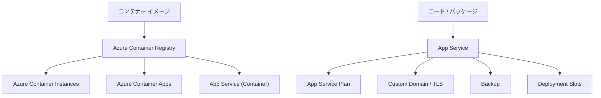

図の読み方
- コンテナーを使う場合、まずイメージの置き場所として ACR を考えます。
- そのイメージをどこで実行するかが、ACI、Container Apps、App Service for Containers の分岐です。
- App Service はコード実行でもコンテナー実行でも使えますが、Plan とスケーリングの考え方が重要です。
- 後半の Web 運用では、Custom Domain、TLS、Backup、Deployment Slots が頻出です。

## まず結論
この章の核心は次の 8 点です。

1. `Azure Container Registry (ACR)` はコンテナーを動かす場所ではなく、イメージを保管するレジストリである。
2. `Azure Container Instances (ACI)` は単発・軽量・素早いコンテナー実行に向く。
3. `Azure Container Apps (ACA)` はマイクロサービスやイベント駆動、オートスケールに向く。
4. `Azure App Service` は Web アプリや API を素早く運用するための PaaS であり、コードでもコンテナーでも実行できる。
5. `App Service Plan` は App Service の実行基盤で、スケールや料金に大きく関係する。
6. `Scale up` と `Scale out` は別概念であり、App Service でもコンテナーでも区別して考える。
7. `Deployment Slots` は本番切り替えリスクを下げる重要機能である。
8. TLS、Custom Domain、Backup、Networking は、アプリの本番運用では必須に近い基本項目である。

初心者が迷いやすいのは、「コンテナー」という言葉で 1 つの技術に見えてしまう点です。しかし、試験で問われるのはコンテナーそのものより、`どの Azure サービスで運用するか` の判断です。つまり、イメージの保管場所、実行場所、スケール方法、ネットワーク統合を分けて考える必要があります。

比較すると違いが見えます。

| サービス | 主な用途 | 強み | 注意点 |
| --- | --- | --- | --- |
| ACR | イメージ保管 | セキュアなプライベート レジストリ | 実行基盤ではない |
| ACI | 単発コンテナー実行 | 素早く起動、管理が軽い | 複雑なアプリ運用には限界がある |
| Container Apps | コンテナー アプリ運用 | オートスケール、リビジョン、マイクロサービス向き | ACA 独自の運用概念を理解する必要 |
| App Service | Web/API 運用 | PaaS として成熟、TLS やスロットが扱いやすい | 一般的な Web/HTTP 前提が中心 |

### 確認質問
1. ACR はコンテナーを実行する場所ですか。
2. ACI と Container Apps は、同じ使いどころですか。

## 先に知っておく用語

| 用語 | 意味 | 先に押さえるポイント |
| --- | --- | --- |
| Azure Container Registry | プライベート コンテナー レジストリ | Docker イメージ保管庫 |
| Azure Container Instances | 単体または少数コンテナー実行サービス | サーバー管理不要 |
| Azure Container Apps | マネージド コンテナー実行基盤 | スケーリングやリビジョンが特徴 |
| App Service | Web アプリ実行 PaaS | Web/API に強い |
| App Service Plan | App Service の基盤プラン | 料金、スケール、機能に影響 |
| Scale up | 上位 SKU へ変更 | 1 インスタンスを強くする |
| Scale out | インスタンス数を増やす | 台数を増やす |
| Deployment Slot | 別スロット環境 | 安全なリリースに使う |
| Custom Domain | 独自ドメイン | 既存 DNS 名をアプリへ紐づける |
| TLS | Transport Layer Security | HTTPS 通信の基本 |

コンテナー周りの用語では、`イメージ`, `レジストリ`, `実行環境` を混同しないことが大切です。イメージは実行に必要なアプリと依存関係をまとめたものです。レジストリはその保管場所です。実行環境は、ACI、Container Apps、App Service などです。

例として、開発チームが Docker イメージを作っても、それだけでは Azure 上で動きません。どこに置くか、どこで動かすか、どう公開するかまで決めて初めてサービスになります。

### 小演習
次の 3 つを 1 文で説明してください。

1. ACR  
2. ACI  
3. App Service Plan  

## 核心概念の説明

### 1. ACR は「共有されるアプリ部品の倉庫」
Azure Container Registry は、コンテナー イメージを格納するためのプライベート レジストリです。Docker Hub の社内版のように考えると理解しやすいです。重要なのは、ACR 自体は実行基盤ではないことです。

ACR を使う利点は次のとおりです。

1. 社内イメージを安全に保管できる
2. 権限とネットワーク制御を組み合わせやすい
3. ACI、ACA、App Service などと連携しやすい

例として、開発チームが `sales-api:v1` というイメージを ACR に push し、運用チームが本番 Container Apps からそのイメージを pull する、という流れが典型です。このとき、イメージの更新と実行環境の更新を分けて管理できます。

#### 確認質問
1. ACR が持つ役割は何ですか。
2. ACR を使うと、Docker Hub 公開より何が管理しやすくなりますか。

### 2. ACI は「すぐ動かしたい少数コンテナー」に向く
Azure Container Instances は、オーケストレーションを自分で管理せず、コンテナーをすぐ動かしたいときに向くサービスです。簡単な API、バッチ、検証環境、短期処理などに使いやすいです。

ACI の特徴を整理します。

| 長所 | 向く場面 |
| --- | --- |
| 起動が速い | 単発ジョブ、検証 |
| 基盤管理が少ない | 小規模ワークロード |
| YAML や複雑な制御が不要な場合がある | 学習や軽量運用 |

ただし、マイクロサービス群の継続運用や高度なトラフィック制御、複雑なスケーリングには限界があります。そこでは Container Apps などの方が自然です。

例として、1 日 1 回だけデータ変換コンテナーを起動したいなら、ACI は有力候補です。常時稼働の複数サービス群には向きにくいです。

#### 小演習
次の要件に ACI が向くか考えてください。

1. 1 日 1 回だけ起動する ETL コンテナー  
2. 複数サービスをイベント駆動で自動スケールしたい API 群  

### 3. Container Apps は「コンテナー アプリの運用基盤」
Azure Container Apps は、コンテナーをマネージドに実行する基盤で、マイクロサービス、HTTP API、イベント駆動ワークロードに向きます。特に、リビジョン管理とオートスケールが重要です。

Container Apps を ACI と分けて考えるポイントは次のとおりです。

| 観点 | ACI | Container Apps |
| --- | --- | --- |
| 主な用途 | 単発・少数・簡易実行 | 継続運用、イベント駆動、マイクロサービス |
| スケール | 限定的 | より柔軟 |
| リビジョン | 基本概念では弱い | 重要機能 |
| アプリ群管理 | 単体寄り | 環境単位で考えやすい |

例として、複数の API とワーカーをコンテナーで動かし、トラフィックに応じて増減させたいなら Container Apps が候補です。試験では「Container Apps を選ぶべき条件」が問われやすいです。

#### 確認質問
1. Container Apps を ACI より有力候補とする条件は何ですか。
2. リビジョン管理が役立つのは、どんな場面ですか。

### 4. App Service は Web 運用をシンプルにする
Azure App Service は、Web アプリや API を PaaS で動かす代表的サービスです。コードをそのままデプロイすることも、コンテナー化してデプロイすることもできます。重要なのは、OS や IIS/Apache の細かな管理から距離を置けることです。

App Service が向く典型要件は次のとおりです。

1. HTTP ベースの Web アプリや API
2. 迅速な公開
3. TLS、Custom Domain、スロット、バックアップなどを使いたい
4. VM 管理を減らしたい

例として、社内向け業務 Web アプリを素早く公開し、青緑リリースに近い安全な切り替えをしたいなら、App Service は非常に有力です。

#### 確認質問
1. App Service が VM より運用を簡素化しやすいのはなぜですか。
2. App Service が特に向くワークロードは何ですか。

### 5. App Service Plan は「アプリのサイズ」ではなく「基盤の容量」
App Service Plan は、App Service アプリを載せる実行基盤です。ここが初学者のつまずきポイントです。Plan の SKU やインスタンス数は、1 つのアプリではなく、Plan 配下のアプリ群に影響します。

| 誤解 | 正しい理解 |
| --- | --- |
| App Service ごとに完全独立で課金される | 同じ Plan 上のアプリは基盤を共有する |
| スケールはアプリ単体だけの話 | Plan のリソース容量とも関係する |

`Scale up` は、Plan の SKU を上げて 1 インスタンスあたりの性能を強くすることです。`Scale out` は、インスタンス数を増やすことです。どちらが必要かは、CPU/メモリ不足か、同時接続台数不足かで考えます。

例として、1 台の処理能力が足りないなら Scale up を考えます。ピーク時アクセス数が増えるなら Scale out を考えます。両方必要なこともあります。

#### 小演習
次の状況で `Scale up`, `Scale out` のどちらを先に疑うか書いてください。

1. 1 インスタンスの CPU が常に高い  
2. 昼休みだけアクセス数が急増する  

### 6. Custom Domain と TLS は本番公開の基礎
App Service を本番利用するなら、`<appname>.azurewebsites.net` のまま終わることは通常ありません。独自ドメインを割り当て、TLS 証明書を適用し、HTTPS で安全に公開するのが基本です。

ここで重要なのは、DNS 側のレコード設定と App Service 側のバインド設定が両方必要なことです。どちらかだけでは独自ドメインは機能しません。

例として、`api.contoso.com` を App Service に割り当てるには、DNS の CNAME または A レコード構成と、App Service のカスタム ドメイン設定を合わせます。そのうえで証明書を紐づけて HTTPS を有効にします。

#### 確認質問
1. Custom Domain を使うには、DNS と App Service の両方で設定が必要ですか。
2. TLS は何を守るために必要ですか。

### 7. Deployment Slots は安全なリリースのための武器
Deployment Slots は、staging などの別スロットへ事前デプロイし、動作確認後に本番へ swap する仕組みです。これは AZ-104 で非常に重要です。

スロットの利点は次のとおりです。

1. 本番切り替え前に検証できる
2. 失敗時の切り戻しがしやすい
3. 設定の一部をスロット固有にできる

例として、新バージョンを staging スロットへ入れ、接続文字列やテスト URL で確認し、問題なければ本番へ swap します。いきなり本番へ上書きするより安全です。

#### 小演習
本番アプリに直接上書きデプロイするより、スロットを使う利点を 2 つ書いてください。

### 8. App Service Backup と Networking もセットで考える
App Service では、バックアップ設定やネットワーク統合も重要です。バックアップは、アプリ構成やコンテンツ保全に役立ちますが、何がバックアップ対象かは事前に確認が必要です。特にデータベースを完全に含むとは限らないため、別サービスのバックアップと組み合わせて考えます。

ネットワーク設定では、VNet 統合やアクセス制限が重要です。App Service 自体を完全な閉域で使いたいか、PaaS としてインターネット公開しつつバックエンド接続だけ閉じたいかで設計が変わります。

例として、社内向け API を App Service で動かし、バックエンドの Azure SQL や Storage へ VNet 統合経由でアクセスする構成はよくあります。ここでは App Service 単体ではなく、周辺のネットワーク章の知識とつながります。

#### 確認質問
1. App Service Backup だけで全データ保護が完結すると考えてよいですか。
2. App Service のネットワーク設定は、どんな要件に影響しますか。

## worked example

### シナリオ
あなたは、新しい社内 API 基盤を選定します。要件は次のとおりです。

- Docker イメージで配布したい
- まずは 1 サービスだが、将来 5 サービスに増える可能性がある
- アクセス増に応じて自動で増減したい
- 独自ドメインと HTTPS を使いたい
- 本番切り替えを安全にしたい

### 判断の流れ
1. イメージ保管は ACR
2. 継続運用と将来の複数サービス化を考えるなら Container Apps が第一候補
3. もし HTTP API とリリース運用の簡潔さを最優先するなら App Service for Containers も候補
4. 独自ドメイン、TLS、リリース スロットが重要なら App Service の強みが大きい

### CLI 例
```bash
az acr create \
  --name acrteamprod001 \
  --resource-group rg-app-prod \
  --sku Basic
```

```bash
az appservice plan create \
  --name plan-api-prod \
  --resource-group rg-app-prod \
  --sku P1v3 \
  --is-linux
```

```bash
az webapp create \
  --name app-api-prod-001 \
  --plan plan-api-prod \
  --resource-group rg-app-prod \
  --deployment-container-image-name acrteamprod001.azurecr.io/sales-api:v1
```

### subgoal 単位での見方
1. `保管と実行を分ける`  
   ACR は倉庫、App Service は実行基盤です。
2. `将来の増加を先に考える`  
   サービス数増加やオートスケール要件があるなら、ACI より上位の選択肢を疑います。
3. `公開と運用まで見る`  
   独自ドメイン、TLS、スロットは本番運用に直結します。
4. `本番切り替え事故を減らす`  
   staging スロットを使って段階的に切り替えます。

### 確認質問
1. ACI を第一候補にしない理由は何ですか。
2. App Service を選ぶと、独自ドメインやスロットの運用で何が楽になりますか。

## 実践手順または小演習

### 実践手順: 実行基盤を選ぶ
1. アプリが `単発実行`, `継続 API`, `複数サービス`, `Web アプリ` のどれに近いか整理します。
2. イメージ保管が必要なら ACR を前提にします。
3. 実行基盤を `ACI`, `Container Apps`, `App Service` から選びます。
4. スケール要件を `Scale up`, `Scale out`, `自動スケール不要` で分けます。
5. 独自ドメイン、TLS、スロット、バックアップの要否を決めます。
6. 本番切り替え方法を 1 文で決めます。

### 比較表
| 要件 | 候補 |
| --- | --- |
| 一時ジョブをすぐ動かしたい | ACI |
| 複数コンテナーを継続運用したい | Container Apps |
| Web/API を PaaS で素早く公開したい | App Service |

### 小演習
次の要件に対して、候補サービスと理由を 1 行ずつ書いてください。

- 毎晩だけ動くレポート生成コンテナー  
- 独自ドメイン付き社外向け API  
- 5 つのマイクロサービスをイベント駆動で増減させたい  

## よくある失敗

| よくある失敗 | なぜ起きるか | 防ぎ方 |
| --- | --- | --- |
| ACR を実行基盤だと思う | レジストリと実行を混同するから | ACR は倉庫、実行は別と覚える |
| ACI で長期マイクロサービス運用をしようとする | 「コンテナーなら何でも同じ」に見えるから | 運用要件で Container Apps や App Service を検討する |
| App Service Plan をアプリ 1 個のサイズだと思う | Plan の共有性を見落とすから | Plan 配下の基盤容量として理解する |
| Scale up と Scale out を混同する | どちらも「大きくする」に見えるから | 1 台強化か台数追加かで分ける |
| スロットなしで本番へ直接デプロイする | 早く終わるから | staging で確認して swap する |
| Custom Domain で DNS 側設定を忘れる | App Service 画面だけ見てしまうから | DNS と App Service の両面を確認する |

### 確認質問
1. ACR と ACI の違いを 1 文で言えますか。
2. Scale up と Scale out は何が違いますか。

## まとめ
この章で覚えるべき点は、次の 9 つです。

1. ACR はコンテナー イメージの保管場所である。
2. ACI は少数・単発・軽量なコンテナー実行に向く。
3. Container Apps は継続運用、オートスケール、マイクロサービスに向く。
4. App Service は Web アプリや API を素早く運用する PaaS である。
5. App Service Plan は実行基盤の容量と料金に関わる。
6. Scale up は 1 台強化、Scale out は台数追加である。
7. Custom Domain と TLS は本番公開の基本である。
8. Deployment Slots は安全なリリースに有効である。
9. サービス選定は「コンテナーかどうか」ではなく、運用要件で決める。

### 最終確認
次の 3 つを説明できるか確認してください。

1. ACR, ACI, Container Apps の違い  
2. App Service Plan と App Service の関係  
3. スロットを使う理由  

## 付録: 参照情報
- 試験ガイド: [Study guide for Exam AZ-104](https://learn.microsoft.com/en-us/credentials/certifications/resources/study-guides/az-104)
- Azure Container Registry: [Azure Container Registry introduction](https://learn.microsoft.com/en-us/azure/container-registry/container-registry-intro)
- Azure Container Instances: [Azure Container Instances overview](https://learn.microsoft.com/en-us/azure/container-instances/container-instances-overview)
- Azure Container Apps: [Azure Container Apps overview](https://learn.microsoft.com/en-us/azure/container-apps/overview)
- Azure App Service: [App Service overview](https://learn.microsoft.com/en-us/azure/app-service/overview)
- App Service のスケール: [Scale up an app in Azure App Service](https://learn.microsoft.com/en-us/azure/app-service/manage-scale-up)
- App Service スロット: [Set up staging environments in Azure App Service](https://learn.microsoft.com/en-us/azure/app-service/deploy-staging-slots)
- Custom Domain: [Tutorial: Map an existing custom DNS name to Azure App Service](https://learn.microsoft.com/en-us/azure/app-service/app-service-web-tutorial-custom-domain)
- TLS/証明書: [Secure a custom DNS name with a TLS/SSL binding in App Service](https://learn.microsoft.com/en-us/azure/app-service/configure-ssl-bindings)


---

# 第8章 仮想ネットワーク、サブネット、ルーティング

## 3行要約
ネットワーク分野の前半では、Azure Virtual Network、サブネット、IP、ピアリング、ユーザー定義ルートを使って、通信の土台を設計する考え方を学びます。  
AZ-104 では、単に VNet を作れるだけでなく、アドレス設計、分離、接続、経路制御、障害切り分けを説明できることが重要です。  
この章を終えると、Azure ネットワークを「配線」ではなく「境界と経路の設計」として理解できるようになります。  

## 全体像の図
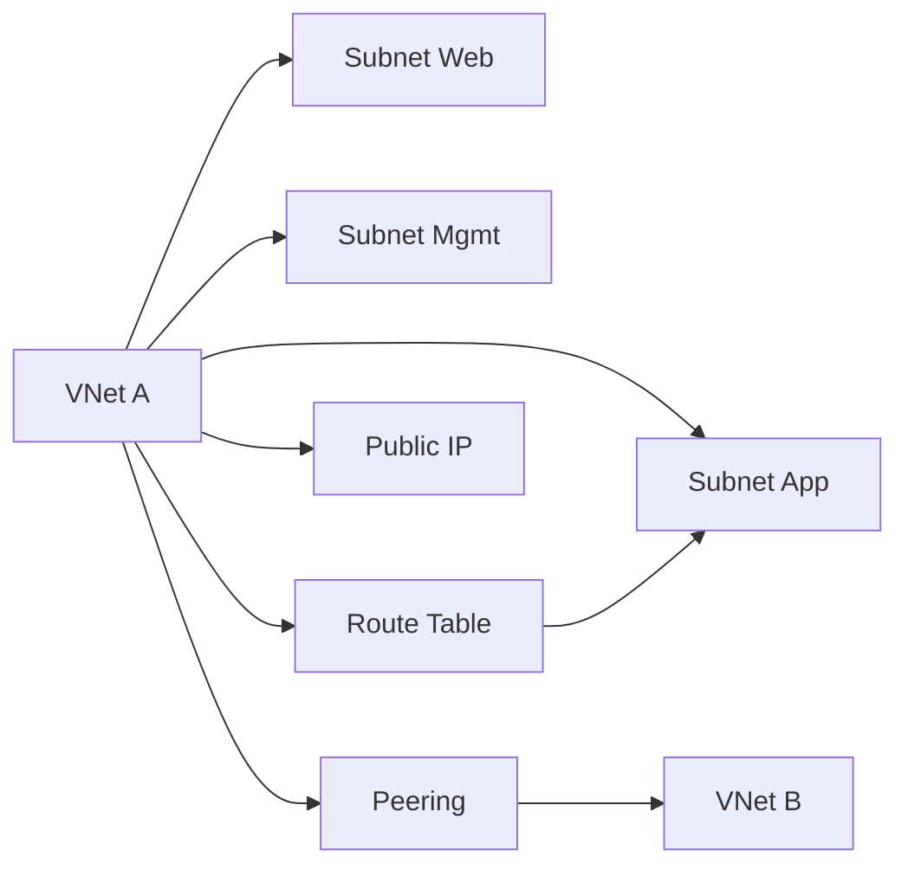

図の読み方
- VNet が大きなネットワーク境界で、その中に用途別の Subnet を切ります。
- Public IP は外部到達性の入口であり、すべてのリソースに必要なわけではありません。
- Route Table は、どこへ通信を流すかを制御します。
- VNet Peering は、複数 VNet を Azure バックボーンでつなぐ基本手段です。

## まず結論
ネットワーク前半の核心は次の 7 点です。

1. `VNet` は Azure 上の論理ネットワーク境界であり、まずアドレス空間設計が必要である。
2. `Subnet` は用途と制御単位で切る。何となく細かく分けるのではなく、役割で分ける。
3. `Public IP` は必要な場所だけに付ける。内部専用リソースへ安易に付けない。
4. `VNet Peering` は VNet 間接続の基本手段であり、ゲートウェイを経由しない。
5. `User-Defined Route (UDR)` は、Azure 既定経路を上書きして通信経路を制御する。
6. ネットワーク障害は、`名前解決`, `経路`, `セキュリティ`, `到達先状態` に分けて切り分ける。
7. ネットワーク設計は、後で追加するセキュリティや private endpoint の土台になる。

初学者は、VNet を単なる「クラウドの LAN」と考えがちです。それ自体は近いのですが、Azure ではサブネット、NSG、ルート、PaaS 接続、Private Endpoint などが密接に関わるため、最初の切り方が非常に重要です。後から付け足せる設定もありますが、アドレス重複や責任境界の曖昧さは大きな運用負債になります。

比較表で整理します。

| 機能 | 役割 | 典型的な誤解 |
| --- | --- | --- |
| VNet | 大きなネットワーク境界 | 何個でも適当に作ればよいと思う |
| Subnet | 用途ごとの区切り | VM ごとに切ればよいと思う |
| Public IP | 外部到達性 | あると便利だから付けたくなる |
| Peering | VNet 間接続 | VPN が必須だと思う |
| UDR | 通信経路の強制 | NSG と同じ役割だと思う |

### 確認質問
1. VNet と Subnet は、どちらが大きな境界ですか。
2. UDR は通信を許可/拒否する機能ですか、それとも経路を決める機能ですか。

## 先に知っておく用語

| 用語 | 意味 | 先に押さえるポイント |
| --- | --- | --- |
| Virtual Network | Azure の仮想ネットワーク | アドレス空間の大きな入れ物 |
| Subnet | VNet 内の区画 | Web, App, DB など役割分離に使う |
| Address Space | CIDR 形式のアドレス範囲 | 重複すると接続で困る |
| Public IP Address | 外部公開用 IP | 必要最小限にする |
| VNet Peering | VNet 間接続 | Azure バックボーンで接続 |
| Route Table | 経路表 | UDR を紐づける場所 |
| User-Defined Route | 独自定義経路 | 通信先を明示的に制御 |
| Next Hop | 次の転送先 | Virtual appliance, Internet など |

ネットワーク設計で最初に重要なのは、アドレス空間の重複回避です。オンプレミスや他 VNet とつなぐ可能性があるなら、最初から重複しない CIDR を選ぶべきです。ここを雑に始めると、後でピアリングや VPN 接続で行き詰まります。

例として、`10.0.0.0/16` を本番 VNet に使い、開発 VNet も同じ `10.0.0.0/16` にしてしまうと、後から両者をピアリングしたいときに問題になります。アドレス計画は見えにくいですが、AZ-104 では非常に重要です。

### 小演習
次の設計で気になる点を書いてください。  
「本番 VNet も開発 VNet も、どちらも 10.0.0.0/16 にした」

## 核心概念の説明

### 1. VNet 設計は「将来つなぐ可能性」込みで考える
VNet は 1 システムごとに独立して作れますが、実務では後から接続要件が増えます。オンプレミス接続、共有サービス接続、監視基盤接続、他部門接続などです。だからこそ、最初のアドレス設計が重要です。

設計時に見る観点は次のとおりです。

1. 他 VNet と重複しないか
2. オンプレミスと重複しないか
3. 将来のサブネット追加余地があるか
4. 環境ごとの分離方針が明確か

例として、本番 VNet は広めのアドレス空間を確保し、開発はやや小さくする、といった差をつけることがあります。なぜなら、本番は増設や private endpoint 追加が増えやすいからです。

#### 確認質問
1. VNet アドレス空間で重複を避ける理由は何ですか。
2. 将来のサブネット追加余地を持つ意味は何ですか。

### 2. Subnet は役割と制御の単位で切る
Subnet は細かければよいわけではありません。Web、アプリ、管理、DB、Private Endpoint 専用など、役割と制御単位で分けます。

| 切り方 | 長所 | 注意点 |
| --- | --- | --- |
| 層ごとに分ける | 制御しやすい | 小さすぎると拡張しにくい |
| 機能ごとに分ける | 役割が明確 | 乱立すると把握しづらい |
| 管理用を分ける | Bastion や管理経路整理に有利 | 命名規則が重要 |

サブネットを分ける理由は、主に `セキュリティ制御`, `ルート適用`, `サービス要件` の 3 つです。たとえば、あるサブネットだけに UDR を適用したい、private endpoint 専用サブネットを設けたい、といった要件があるなら分離が有効です。

例として、Web と DB を同じサブネットに入れると、後から NSG やルートで差をつけにくくなります。役割が違うものは、少なくとも制御単位で分けておく方が扱いやすいです。

#### 小演習
次の 4 つを、どのサブネットへ分けるか考えてください。

1. Web サーバー  
2. 管理用踏み台  
3. DB サーバー  
4. Private Endpoint  

### 3. Public IP は「必要なものだけ」に付ける
Azure では簡単に Public IP を作れますが、必要性を吟味せず付けるのは危険です。Public IP は外部到達性そのものです。特に管理用 VM に安易に直接 Public IP を付ける設計は、Bastion や VPN で代替できるかを検討すべきです。

| Public IP が必要になりやすいもの | 不要なことが多いもの |
| --- | --- |
| 外部公開 LB、App Gateway、公開エンドポイント | 内部 DB、内部アプリ、管理専用 VM |

例として、外部公開 Web システムのフロントに Public Load Balancer を置くのは自然です。一方、社内だけで使う管理 VM に Public IP を付けると、攻撃面が広がります。後の章で Azure Bastion を扱いますが、その典型例です。

#### 確認質問
1. Public IP を最小限にすべき理由は何ですか。
2. 管理専用 VM に Public IP を付けない代替案は何がありますか。

### 4. VNet Peering は VNet 間接続の基本
VNet Peering は、Azure バックボーン上で 2 つの VNet を接続する仕組みです。VPN Gateway を経由しないため、Azure 内部の VNet 同士をつなぐ基本手段として理解します。

Peering を考えるときのポイントは次のとおりです。

1. アドレス空間が重複してはいけない
2. 通常は低遅延で Azure バックボーン接続となる
3. 接続はしても、通信可否は NSG やルートの影響を受ける

例として、共有監視基盤 VNet と業務アプリ VNet をピアリングし、監視サーバーから各アプリ VNet を監視する構成はよくあります。ただし、ピアリングしただけで無条件に何でも通るわけではありません。

#### 小演習
「ピアリングしたのに通信できない」場合に、何を疑うべきか 2 つ書いてください。

### 5. UDR は Azure 既定経路を上書きする
Azure には既定ルートがありますが、独自の経路を指定したいときに使うのが `User-Defined Route` です。これはセキュリティ制御ではなく、通信の進み方を変えるものです。

典型例は、トラフィックを仮想アプライアンスに集約したいときです。

| 目的 | UDR の使い方 |
| --- | --- |
| 送信トラフィックを検査機器へ流したい | Next hop を Virtual appliance にする |
| 既定経路を強制したい | 0.0.0.0/0 を独自に定義する |
| 特定セグメントだけ別経路にしたい | プレフィックス別にルートを切る |

例として、アプリ サブネットからの外向き通信を必ず Azure Firewall や NVA 経由にしたいなら、UDR で経路を制御します。NSG では経路は変えられません。

#### 確認質問
1. UDR が得意なのは許可/拒否ですか、それとも経路制御ですか。
2. すべてのトラフィックを検査装置へ流したいとき、何を使いますか。

### 6. 通信障害の切り分けは順番が重要
Azure で通信できないとき、いきなり 1 つの設定だけを見ると迷います。次の順で切り分けると整理しやすいです。

1. 名前解決は合っているか
2. 宛先 IP や Public/Private の前提は合っているか
3. 経路は正しいか
4. NSG や Firewall で止まっていないか
5. 宛先サービスが起動しているか

例として、Web VM から DB へ接続できない場合、まず名前解決ミスか、サブネット間 NSG か、UDR か、DB 側 Listen 状態かを順番に見ます。Azure の通信障害は、複数要因が重なりやすいからです。

#### 小演習
「名前解決は成功したが接続できない」場合、次に見るべき項目を 2 つ書いてください。

## worked example

### シナリオ
あなたは、業務システム向けに次のネットワークを設計します。

- 本番 VNet と共有監視 VNet を分けたい
- Web, App, Mgmt を別サブネットにしたい
- 管理 VM に Public IP は付けたくない
- App サブネットの通信は必ず検査装置経由にしたい

### 設計方針
1. 重複しないアドレス空間を確保する
2. 役割ごとにサブネットを分ける
3. 本番 VNet と監視 VNet は Peering する
4. 管理経路は Bastion などを前提にし、管理 VM へ Public IP は付けない
5. App サブネットには UDR を適用して検査装置へ送る

### Bicep のイメージ
```bicep
resource vnet 'Microsoft.Network/virtualNetworks@2023-09-01' = {
  name: 'vnet-prod'
  location: 'japaneast'
  properties: {
    addressSpace: {
      addressPrefixes: [
        '10.10.0.0/16'
      ]
    }
    subnets: [
      {
        name: 'snet-web'
        properties: {
          addressPrefix: '10.10.1.0/24'
        }
      }
      {
        name: 'snet-app'
        properties: {
          addressPrefix: '10.10.2.0/24'
        }
      }
    ]
  }
}
```

### subgoal 単位での見方
1. `重複しない前提を作る`  
   先にアドレス重複を避けることで Peering を可能にします。
2. `制御単位で切る`  
   Web と App を分けることで、将来の NSG や UDR も分けやすくなります。
3. `管理経路を安全にする`  
   管理 VM へ安易に Public IP を付けない設計です。
4. `トラフィックの流れを決める`  
   App サブネットだけ UDR で検査装置へ向けます。

### 確認質問
1. App サブネットだけ UDR を当てる利点は何ですか。
2. VNet Peering の前に確認すべき最重要項目は何ですか。

## 実践手順または小演習

### 実践手順: VNet 設計を紙に書く
1. 本番、開発、共有基盤の VNet を描きます。
2. それぞれのアドレス空間を書き、重複しないか確認します。
3. サブネットを Web、App、Mgmt、DB などで分けます。
4. 外部公開が必要な場所だけ Public IP を候補にします。
5. VNet 間接続が必要なら Peering を記入します。
6. 特定サブネットだけ経路制御したいなら UDR を記入します。

### 小演習
次の要件を満たすネットワーク図を自分で描いてください。

- Web は外部公開する
- DB は内部だけ
- 監視 VNet から本番 VNet を監視したい
- 管理は Bastion 経由にしたい
- App サブネットの送信通信は Firewall 経由にしたい

## よくある失敗

| よくある失敗 | なぜ起きるか | 防ぎ方 |
| --- | --- | --- |
| VNet のアドレスを重複させる | 先の接続要件を考えていないから | 最初に全体アドレス計画を作る |
| サブネットを何となく細かく切る | 分けるほど良いと思うから | 役割と制御単位で切る |
| 管理 VM に Public IP を付ける | 接続が楽だから | Bastion や閉域管理を検討する |
| UDR と NSG を混同する | どちらもネットワーク設定だから | UDR は経路、NSG は許可/拒否と分ける |
| Peering すれば何でも通ると思う | 接続と許可を混同するから | NSG や経路も確認する |
| 通信障害を順番なく調べる | 焦って設定を触るから | 名前解決→経路→セキュリティ→宛先の順で切る |

### 確認質問
1. UDR と NSG の違いを 1 文ずつで言えますか。
2. Peering 後も通信できない場合、どこを疑いますか。

## まとめ
この章で覚えるべき点は、次の 8 つです。

1. VNet は Azure ネットワークの大きな境界である。
2. Subnet は役割と制御単位で分ける。
3. アドレス重複は将来の接続で大きな問題になる。
4. Public IP は必要最小限にする。
5. VNet Peering は Azure 内 VNet 接続の基本である。
6. UDR は通信経路を制御するための機能である。
7. ネットワーク障害は、名前解決、経路、セキュリティ、宛先の順で切り分ける。
8. この章の設計は、次章の NSG、Bastion、Private Endpoint の土台になる。

### 最終確認
次の 3 つを説明できるか確認してください。

1. VNet と Subnet の役割  
2. VNet Peering の前提条件  
3. UDR の役割  

## 付録: 参照情報
- 試験ガイド: [Study guide for Exam AZ-104](https://learn.microsoft.com/en-us/credentials/certifications/resources/study-guides/az-104)
- Virtual Network の概要: [What is Azure Virtual Network?](https://learn.microsoft.com/en-us/azure/virtual-network/virtual-networks-overview)
- Subnet とアドレス空間: [Virtual network address space and subnetting for Azure](https://learn.microsoft.com/en-us/azure/cloud-adoption-framework/ready/azure-best-practices/plan-for-ip-addressing)
- VNet Peering: [Virtual network peering](https://learn.microsoft.com/en-us/azure/virtual-network/virtual-network-peering-overview)
- Public IP: [Public IP addresses in Azure](https://learn.microsoft.com/en-us/azure/virtual-network/ip-services/public-ip-addresses)
- UDR: [User-defined routes overview](https://learn.microsoft.com/en-us/azure/virtual-network/virtual-networks-udr-overview)
- 接続トラブルシューティング: [Troubleshoot Azure virtual network connectivity problems](https://learn.microsoft.com/en-us/troubleshoot/azure/virtual-machines/windows/troubleshoot-vm-connectivity)


---

# 第9章 セキュアな接続、名前解決、負荷分散

## 3行要約
ネットワーク後半では、通信を安全に通すための NSG、ASG、Azure Bastion、Service Endpoint、Private Endpoint、Azure DNS、Load Balancer を学びます。  
AZ-104 では、「つながる」だけでなく、「どこまで公開するか」「どの経路を使うか」「どう分散するか」を判断できることが重要です。  
この章を終えると、ネットワークの保護と公開を要件に応じて設計し、よくある接続トラブルを構造で切り分けられるようになります。  

## 全体像の図
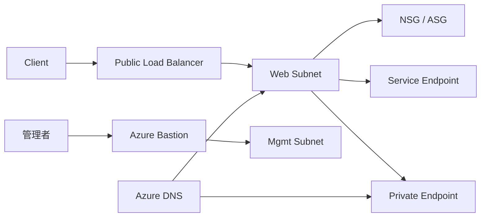

図の読み方
- 外部公開は Load Balancer などの入口から入り、サブネット単位で NSG による制御を受けます。
- 管理者接続は Public IP 直付けではなく、Azure Bastion を使う設計が代表例です。
- PaaS 連携では Service Endpoint か Private Endpoint を選びます。
- 名前解決は Azure DNS や Private DNS と密接に関係し、Private Endpoint では特に重要です。

## まず結論
この章で先に覚えるべき結論は次の 8 つです。

1. `NSG` は通信の許可/拒否、`UDR` は経路制御であり、役割が違う。
2. `Application Security Group (ASG)` は IP ではなくアプリ役割で NSG ルールを整理する助けになる。
3. `Effective security rules` を見ると、最終的にどのルールが効いているかを把握しやすい。
4. 管理用 VM へ直接 Public IP を付けるより、`Azure Bastion` を優先検討する。
5. `Service Endpoint` は VNet から Azure PaaS へ安全に到達しやすくする仕組み、`Private Endpoint` は PaaS を VNet 内のプライベート IP で使う仕組みである。
6. `Azure DNS` はドメイン名の管理、Private DNS は VNet 内名前解決で重要になる。
7. `Public Load Balancer` と `Internal Load Balancer` は公開範囲が違う。
8. 負荷分散障害は、バックエンド正常性、ポート、プローブ、NSG、経路を順番に見る。

初学者が混同しやすいのは、「安全にする設定」が全部同じ目的に見えることです。実際には、NSG はパケットの許可/拒否、Bastion は管理経路の安全化、Private Endpoint は PaaS の到達経路の私設化、Load Balancer はトラフィック分散です。役割を混ぜると正答しづらくなります。

比較表で整理します。

| 機能 | 主目的 | 典型的用途 |
| --- | --- | --- |
| NSG | 通信の許可/拒否 | サブネットや NIC の保護 |
| ASG | ルールの整理 | Web/App/DB など役割単位の制御 |
| Bastion | 安全な管理接続 | RDP/SSH の Public IP 削減 |
| Service Endpoint | PaaS への安全な到達 | Storage などへ VNet から接続 |
| Private Endpoint | PaaS のプライベート化 | Private IP で PaaS を使う |
| Azure DNS | 名前解決 | 公開/内部ドメイン管理 |
| Load Balancer | トラフィック分散 | 内部/外部の多台数分散 |

### 確認質問
1. NSG と Bastion は同じ役割ですか。
2. Service Endpoint と Private Endpoint は、どちらも PaaS 連携ですが同じですか。

## 先に知っておく用語

| 用語 | 意味 | 先に押さえるポイント |
| --- | --- | --- |
| Network Security Group | 通信制御ルールの集合 | 許可/拒否の中心 |
| Application Security Group | アプリ単位の論理グループ | IP 依存を減らす |
| Effective security rules | 最終的に有効なセキュリティ ルール | 重なった結果を見る |
| Azure Bastion | ブラウザー経由の安全な VM 管理 | VM へ Public IP を付けにくくする |
| Service Endpoint | Azure PaaS への VNet からの最適到達 | PaaS 側公開は残る |
| Private Endpoint | PaaS へプライベート IP で接続 | PaaS を VNet 内のように扱う |
| Azure DNS | DNS ホスティング | 独自ドメイン管理 |
| Public Load Balancer | インターネット向け負荷分散 | 外部公開フロント |
| Internal Load Balancer | VNet 内向け負荷分散 | 内部アプリや DB 前段 |
| Health Probe | バックエンド死活確認 | 不健康なインスタンスを外す |

名前が似ている `Service Endpoint` と `Private Endpoint` は特に重要です。Service Endpoint は、Azure バックボーン上で特定 PaaS へ最適到達しつつ、PaaS 側で VNet ベースの許可がしやすくなる仕組みです。一方 Private Endpoint は、PaaS リソースにプライベート IP を割り当てるイメージで、より閉域寄りです。

例として、Storage Account へ社内 VNet からだけアクセスしたい場合、Service Endpoint でも構成できることがあります。しかし、完全にプライベート IP で解決し、パブリック公開面を減らしたいなら Private Endpoint を優先検討します。

### 小演習
次の要件で有力候補を書いてください。

1. 管理 VM に Public IP を付けずにブラウザーから管理したい  
2. PaaS をプライベート IP で使いたい  
3. 既存 NSG ルールを IP ではなく役割ベースで整理したい  

## 核心概念の説明

### 1. NSG はネットワーク制御の基本
NSG は、Azure ネットワークにおける基本的なパケット フィルターです。送信と受信でルールを持ち、優先度順に評価されます。サブネットにも NIC にも関連付けられます。

| NSG で考える要素 | 内容 |
| --- | --- |
| 方向 | Inbound / Outbound |
| 送信元 / 宛先 | IP、サービス タグ、ASG |
| ポート | 単一または範囲 |
| プロトコル | TCP, UDP, Any |
| アクション | Allow / Deny |

よくある誤解は、「細かいルールを増やすほど安全」というものです。実際には、可読性が下がると事故が増えます。だからこそ、ASG やサービス タグを使って読みやすくする価値があります。

例として、`Web から App へ 443 を許可` のようなルールを IP で直書きするより、`asg-web -> asg-app, TCP 443, Allow` のように役割で書いた方が運用しやすくなります。

#### 確認質問
1. NSG は何を制御しますか。
2. ルールが多すぎると何が困りますか。

### 2. ASG は役割ベースでルールを読みやすくする
Application Security Group は、NIC を論理グループ化し、NSG ルールの対象として使う仕組みです。IP アドレスを直接書かないため、VM が増減してもルールを保ちやすくなります。

| IP ベース | ASG ベース |
| --- | --- |
| サーバー追加時にルール修正が増える | NIC をグループへ追加すれば済む |
| 可読性が下がりやすい | 役割が見えやすい |

例として、Web サーバーが 2 台から 5 台に増えても、全 NIC を `asg-web` に入れておけば、App 向け許可ルールは変えなくて済みます。Scale Set や増減する VM 群と相性がよい考え方です。

#### 小演習
次の構成で ASG をどう切るとよいか考えてください。

1. Web 3 台  
2. App 2 台  
3. DB 1 台  

### 3. Effective security rules は「最終結果」を見るための視点
現場でよく起きるのは、「NSG を見たが原因が分からない」という状況です。その理由は、サブネット NSG と NIC NSG の両方、既定ルール、優先度が重なるからです。ここで使う視点が `Effective security rules` です。

Effective security rules を見ると、対象 NIC から見て最終的にどのルールが適用されているかを確認しやすくなります。試験では、単に NSG を作るだけでなく、結果を評価する観点が重要です。

例として、サブネットで許可していても NIC 側で拒否していれば通信できないことがあります。逆に、想定外の上位ルールが許可している場合もあります。設定ファイル単体ではなく、結果を見る癖が必要です。

#### 確認質問
1. Effective security rules を見る目的は何ですか。
2. サブネット NSG と NIC NSG が両方あるとき、なぜ結果確認が必要ですか。

### 4. Azure Bastion は管理用 Public IP を減らす
Azure Bastion は、Azure Portal からブラウザー経由で VM へ安全に接続するためのサービスです。RDP/SSH をインターネットへ直接さらす代わりに、Bastion を中継点にします。

Azure Bastion の利点は次のとおりです。

1. 管理 VM に Public IP を付けなくてよい
2. 管理ポートを直接公開しない
3. Portal 経由で接続できる

例として、本番管理サーバーへ RDP 用の Public IP を付ける代わりに、Bastion を使えば、外部公開面をかなり減らせます。AZ-104 では「Public IP を付けずに管理したい」要件で頻出です。

#### 小演習
管理 VM の Public IP を減らしたい要件に対して、Bastion の利点を 2 つ書いてください。

### 5. Service Endpoint と Private Endpoint の違い
この比較は AZ-104 の頻出論点です。

| 観点 | Service Endpoint | Private Endpoint |
| --- | --- | --- |
| PaaS の到達方式 | Azure バックボーン経由で最適化 | VNet 内のプライベート IP 経由 |
| PaaS 公開面 | 公開エンドポイントは残る | Private Link により閉域寄り |
| DNS の重要度 | 相対的に低い | 非常に高い |
| 典型用途 | まずは VNet 制限で十分な場合 | より強い閉域要件 |

Service Endpoint は比較的導入しやすいですが、PaaS を private IP 化するわけではありません。Private Endpoint はより閉じた構成を作れますが、Private DNS を含む設計が必要です。

例として、Storage Account へ特定 VNet だけからアクセス可能にしたいだけなら Service Endpoint が候補です。Storage を完全に private IP で扱いたいなら Private Endpoint が候補です。

#### 確認質問
1. PaaS をプライベート IP で扱いたい場合の候補は何ですか。
2. Private Endpoint で DNS が重要になる理由は何ですか。

### 6. Azure DNS は名前解決の土台
Azure DNS は、DNS ゾーンを Azure でホストするサービスです。Custom Domain と組み合わせるだけでなく、Private Endpoint の設計でも名前解決が重要になります。

ここで大事なのは、`名前が正しく解決されること` が通信の前提だということです。ネットワーク障害に見えて、実際には DNS 設定ミスというケースは多いです。

例として、`api.contoso.com` を App Service や Load Balancer に向けるには、正しいレコード設定が必要です。Private Endpoint では、対応する Private DNS Zone とリンク設定が不足すると、名前が public 側を向いてしまうことがあります。

#### 小演習
「Private Endpoint を作ったが、名前解決はまだ public 名を返している」場合、何を疑うべきか書いてください。

### 7. Load Balancer は入口を分散する
Azure Load Balancer は、L4 レベルでトラフィックを複数バックエンドへ分散するサービスです。Public と Internal の 2 つを使い分けます。

| 種類 | 公開範囲 | 典型用途 |
| --- | --- | --- |
| Public Load Balancer | インターネット向け | 外部公開 Web フロント |
| Internal Load Balancer | VNet 内部向け | 内部 API、内部 DB 前段 |

重要なのは、Load Balancer 自体はアプリの健全性を完全に理解するわけではなく、主にプローブに基づいて振り分けることです。したがって、`Health Probe`, `バックエンド プール`, `ルール` の 3 点セットで理解します。

例として、Web サーバー 2 台へ 80/443 を分散するなら Public Load Balancer が候補です。App 層の内部 API 2 台へ 8080 を分散するなら Internal Load Balancer が候補です。

#### 確認質問
1. 内部専用 API を分散したい場合、Public と Internal のどちらが候補ですか。
2. Load Balancer で死活確認に使う要素は何ですか。

### 8. 負荷分散トラブルはプローブと経路から疑う
「Load Balancer を作ったのに通信できない」ときは、次の順で見ると整理しやすいです。

1. バックエンド VM は起動しているか
2. Health Probe は成功しているか
3. LB ルールのフロント/バックエンド ポートは正しいか
4. NSG がプローブや実通信をブロックしていないか
5. UDR や OS ファイアウォールで戻り通信が壊れていないか

例として、バックエンド VM のアプリが 8080 で待っているのに、LB プローブが 80 を見ていれば不健康扱いになります。すると、フロントから見るとつながらないように見えます。

#### 小演習
「LB 配下 VM は起動しているが、全台 unhealthy」なとき、最初に確認したい項目を 2 つ書いてください。

## worked example

### シナリオ
あなたは、次の要件で本番ネットワークを仕上げます。

- Web VM は外部公開したい
- App VM は内部のみ
- 管理 VM は Public IP なしで接続したい
- Storage Account はできるだけ閉じて使いたい
- 将来 Web VM が増えても NSG ルールを増やしたくない

### 設計方針
1. Web 前段に Public Load Balancer
2. App 層には Internal Load Balancer も検討
3. 管理用には Azure Bastion
4. Web/App は ASG を使って NSG を整理
5. Storage には Private Endpoint を優先検討し、必要に応じて Private DNS を構成

### NSG ルールのイメージ
```bash
az network nsg rule create \
  --resource-group rg-net-prod \
  --nsg-name nsg-app \
  --name allow-web-to-app-443 \
  --priority 100 \
  --source-asgs asg-web \
  --destination-asgs asg-app \
  --destination-port-ranges 443 \
  --access Allow \
  --protocol Tcp \
  --direction Inbound
```

### subgoal 単位での見方
1. `公開と内部を分ける`  
   Web は Public LB、App は内部化して公開面を絞ります。
2. `管理面を閉じる`  
   Bastion で Public IP 直付けを避けます。
3. `ルールを役割で管理する`  
   ASG で Web/App の増減に耐えます。
4. `PaaS 接続も閉じる`  
   Storage には Private Endpoint を検討し、名前解決までそろえます。

### 確認質問
1. ASG を使うと、将来 Web VM が増えたとき何が楽になりますか。
2. Storage へ Private Endpoint を使うとき、なぜ DNS もセットで考える必要がありますか。

## 実践手順または小演習

### 実践手順: セキュア公開パターンを作る
1. 公開が必要な入口と不要な内部リソースを分けます。
2. 公開入口には Public LB、内部のみには Internal LB の要否を検討します。
3. 管理経路として Bastion の採用可否を決めます。
4. NSG と ASG で Web/App/DB の通信ルールを整理します。
5. PaaS 接続で Service Endpoint と Private Endpoint のどちらが適切か決めます。
6. DNS レコードまたは Private DNS 設計を書きます。

### 小演習
次の要件に対して、候補機能を 1 行ずつ書いてください。

- 外部公開 Web  
- 内部 API のみ分散  
- 管理 VM へ安全接続  
- Storage を private IP で使う  

## よくある失敗

| よくある失敗 | なぜ起きるか | 防ぎ方 |
| --- | --- | --- |
| NSG と UDR を混同する | どちらもネットワーク設定だから | 許可/拒否と経路で分ける |
| Bastion を使わず管理 VM に Public IP を付ける | 手早く接続したいから | 管理経路を分離する |
| ASG を使わず IP 直書きで運用する | 小規模では問題が見えないから | 役割ベースでルール化する |
| Service Endpoint と Private Endpoint を同じだと思う | どちらも PaaS 接続だから | 到達方式と公開面の差で理解する |
| Private Endpoint で DNS を忘れる | ネットワークだけ作れば十分だと思うから | 名前解決まで設計する |
| LB トラブルでプローブを見ない | フロント設定だけを見てしまうから | バックエンド正常性から確認する |

### 確認質問
1. Service Endpoint と Private Endpoint の違いを 1 文ずつで言えますか。
2. Load Balancer が不健康判定になるとき、最初にどこを見るべきですか。

## まとめ
この章で覚えるべき点は、次の 9 つです。

1. NSG は通信制御、ASG は役割ベース整理に使う。
2. Effective security rules は最終的な適用結果を見るために重要である。
3. Azure Bastion は管理用 Public IP を減らす代表手段である。
4. Service Endpoint は PaaS への安全な到達、Private Endpoint は PaaS の private IP 化である。
5. Private Endpoint では Private DNS を含む名前解決設計が重要である。
6. Azure DNS は公開・内部の名前解決基盤として重要である。
7. Public Load Balancer と Internal Load Balancer は公開範囲が違う。
8. 負荷分散障害は、プローブ、ポート、NSG、経路の順で切る。
9. セキュアな設計は「公開面を減らす」ことから始まる。

### 最終確認
次の 3 つを説明できるか確認してください。

1. NSG と ASG の関係  
2. Service Endpoint と Private Endpoint の違い  
3. Public Load Balancer と Internal Load Balancer の違い  

## 付録: 参照情報
- 試験ガイド: [Study guide for Exam AZ-104](https://learn.microsoft.com/en-us/credentials/certifications/resources/study-guides/az-104)
- NSG: [Network security groups](https://learn.microsoft.com/en-us/azure/virtual-network/network-security-groups-overview)
- ASG: [Application security groups](https://learn.microsoft.com/en-us/azure/virtual-network/application-security-groups)
- Azure Bastion: [What is Azure Bastion?](https://learn.microsoft.com/en-us/azure/bastion/bastion-overview)
- Service Endpoint: [Virtual network service endpoints](https://learn.microsoft.com/en-us/azure/virtual-network/virtual-network-service-endpoints-overview)
- Private Endpoint: [What is a private endpoint?](https://learn.microsoft.com/en-us/azure/private-link/private-endpoint-overview)
- Azure DNS: [What is Azure DNS?](https://learn.microsoft.com/en-us/azure/dns/dns-overview)
- Azure Load Balancer: [What is Azure Load Balancer?](https://learn.microsoft.com/en-us/azure/load-balancer/load-balancer-overview)


---

# 第10章 Azure Monitor と運用監視

## 3行要約
AZ-104 の監視分野では、Azure Monitor を中心に、メトリック、ログ、アラート、Insights、Network Watcher、Connection Monitor を組み合わせて運用する考え方を学びます。  
重要なのは、「監視ツールを知っていること」ではなく、「どの異常を、どのデータで、誰へ通知するか」を設計できることです。  
この章を終えると、Azure リソースの監視を、見える化、分析、通知、切り分けの 4 段階で説明できるようになります。  

## 全体像の図
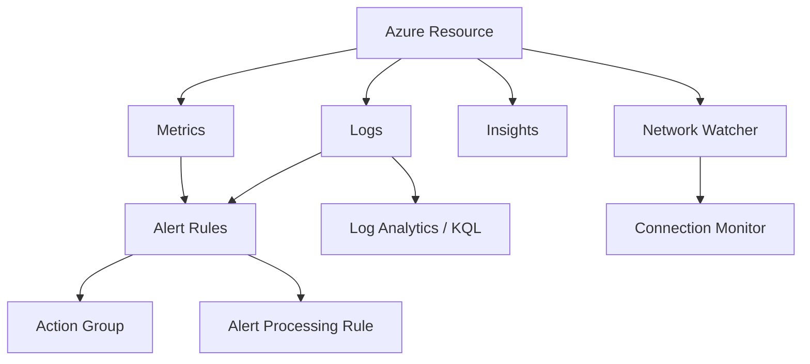

図の読み方
- Azure リソースから得るデータは、大きく `Metrics` と `Logs` に分かれます。
- それらを条件化して `Alert Rules` を作り、通知先を `Action Group` で定義します。
- `Alert Processing Rule` は、通知の抑制や振り分けの調整に使います。
- VM, Storage, Network などの `Insights` は、既成の監視画面として理解すると整理しやすいです。

## まず結論
この章の核心は次の 8 点です。

1. `Metrics` は数値の時系列、`Logs` は詳細イベントや記録であり、用途が違う。
2. 監視は `見る`, `調べる`, `知らせる`, `対応する` の 4 段階で考える。
3. `Alert Rule` は条件、`Action Group` は通知先、`Alert Processing Rule` は通知のさばき方である。
4. `Log Analytics` と KQL は、原因調査や横断分析の中心になる。
5. `Insights` は VM、Storage、Network の監視を素早く把握するための既成ビューである。
6. `Network Watcher` と `Connection Monitor` はネットワーク経路や疎通確認で重要である。
7. ログを有効化していなければ、後から分析したくても材料がない。
8. 監視は設定しただけで終わりではなく、通知先と対応手順まで含めて完成する。

初学者は、メトリックとログの区別が曖昧なまま勉強しがちです。すると、CPU 使用率のしきい値通知を取りたいのにログを探したり、詳細なエラー原因を知りたいのにメトリックだけ見たりして迷います。まずは役割を分けることが重要です。

比較表で整理します。

| 観点 | Metrics | Logs |
| --- | --- | --- |
| 形 | 数値時系列 | イベント・記録・詳細データ |
| 向く用途 | しきい値監視、グラフ | 原因分析、検索、相関分析 |
| 典型例 | CPU 使用率、要求数 | アクティビティ ログ、診断ログ、クエリ結果 |

### 確認質問
1. CPU 使用率が 90% を超えたら通知したい場合、まず見るのは Metrics と Logs のどちらですか。
2. 障害の詳細原因を追いたい場合、どちらが重要になりますか。

## 先に知っておく用語

| 用語 | 意味 | 先に押さえるポイント |
| --- | --- | --- |
| Azure Monitor | Azure の統合監視基盤 | メトリック、ログ、アラートの中心 |
| Metric | 数値の時系列 | しきい値監視に強い |
| Log | 詳細記録 | 分析や原因調査に強い |
| Log Analytics Workspace | ログ分析用ワークスペース | KQL で検索・分析する |
| KQL | Kusto Query Language | ログ分析のクエリ言語 |
| Alert Rule | アラート条件 | 何を異常とみなすか |
| Action Group | 通知・実行先 | メール、Webhook など |
| Alert Processing Rule | アラート後処理 | 抑制、適用範囲の調整 |
| Azure Monitor Insights | 既成の監視ビュー | VM、Storage、Network など |
| Network Watcher | ネットワーク診断ツール群 | 疎通や経路の分析に使う |
| Connection Monitor | 継続的疎通確認 | ネットワーク監視に使う |

ここで `Activity Log` も押さえておきます。Activity Log は、Azure リソースに対する管理操作の記録です。誰が作ったか、削除したか、設定を変えたかを追うのに重要です。アプリ内部の詳細ログとは役割が違います。

例として、VM が削除された原因を調べたいなら Activity Log が候補です。VM 内アプリのエラーを調べたいならゲスト OS ログやアプリ ログが候補です。

### 小演習
次のケースで見るべき候補を書いてください。

1. 誰が NSG を変更したか知りたい  
2. VM の CPU が高騰している  
3. App Service のエラー傾向を横断的に見たい  

## 核心概念の説明

### 1. Metrics は「異常を早く知る」ための数値
Metrics は一定間隔で収集される数値データです。CPU 使用率、ディスク IOPS、要求数、成功率など、状態を数値で把握するのに向きます。

Metrics の強みは次のとおりです。

1. グラフ化しやすい
2. しきい値アラートに向く
3. 変化をすぐ見つけやすい

例として、「CPU が 5 分間 85% 超で通知」「HTTP 5xx が一定数を超えたら通知」といった使い方が典型です。詳細な原因はログで追いますが、最初の異常検知はメトリックが得意です。

#### 確認質問
1. メトリックが向くのは異常検知ですか、詳細原因分析ですか。
2. CPU しきい値通知がメトリック向きな理由は何ですか。

### 2. Logs は「何が起きたか」を深掘りするための材料
Logs は詳細なイベントや記録です。Azure Diagnostics、Activity Log、リソース ログ、アプリ ログなど、種類は多いですが、共通しているのは「あとで掘り下げる材料」であることです。

Log Analytics Workspace へ集約すると、KQL で横断分析しやすくなります。

| ログの種類 | 典型用途 |
| --- | --- |
| Activity Log | 管理操作の追跡 |
| Resource Log | サービス固有イベント |
| Guest / App Log | OS 内部、アプリ内部の追跡 |

例として、「特定時間帯だけストレージ接続失敗が増えた」原因を知りたいなら、ログを時間帯で絞って相関を見ることになります。これはメトリックだけでは難しいことがあります。

#### 小演習
「設定変更の履歴を追いたい」場合と「OS 内部エラーを追いたい」場合で、見るログの種類を書き分けてください。

### 3. Log Analytics と KQL は運用調査の中心
Log Analytics Workspace は、Azure のログ分析の土台です。複数リソースのログを集約し、KQL で検索や集計を行います。試験では、深いクエリ技術より、`何を調べるために使うか` を理解することが重要です。

KQL 例を見ます。

```kusto
AzureActivity
| where OperationNameValue contains "Microsoft.Network/networkSecurityGroups/write"
| where ActivityStatusValue == "Success"
| project TimeGenerated, ResourceGroup, Caller, OperationNameValue
| sort by TimeGenerated desc
```

このクエリは、NSG 変更の成功記録を新しい順に表示するイメージです。

subgoal 単位で見ると次のようになります。

1. `対象テーブルを選ぶ`  
   ここでは `AzureActivity` を使っています。
2. `条件で絞る`  
   NSG 変更だけ、成功だけに絞ります。
3. `必要列だけ出す`  
   時刻、呼び出し元、対象 RG を見やすくします。
4. `並べ替える`  
   直近の変更から調べやすくします。

例として、削除事故や権限変更の追跡で Activity Log を KQL で見るのは非常に実務的です。

#### 確認質問
1. KQL は何のために使いますか。
2. 単にグラフを見るだけでなく KQL が必要になるのはどんなときですか。

### 4. Alert Rule, Action Group, Alert Processing Rule の役割分担
この 3 つは頻出です。

| 機能 | 役割 |
| --- | --- |
| Alert Rule | 何を異常とみなすか決める |
| Action Group | 誰にどう通知するか決める |
| Alert Processing Rule | いつ抑制・変更するか決める |

Action Group にはメール、SMS、Webhook などを設定できます。Alert Processing Rule は、メンテナンス時間帯だけ通知を抑制する、といった使い方に向きます。

例として、「CPU 90% 超でアラート」「運用チームへメール通知」「毎週日曜の定期メンテ中は通知抑制」という 3 層で考えると理解しやすいです。

#### 小演習
「条件」「通知先」「メンテ中だけ抑制」をそれぞれ何で実現するか書いてください。

### 5. Insights は既成の見える化セット
VM Insights、Storage Insights、Network Insights は、ゼロからダッシュボードを組まなくても、重要指標を見やすく表示してくれる仕組みです。

| Insights | 主に見るもの |
| --- | --- |
| VM Insights | CPU、メモリ傾向、接続、依存関係 |
| Storage Insights | 容量、要求、可用性 |
| Network Insights | トポロジ、接続性、依存関係 |

試験では、「すぐに見える化したい」「VM やネットワークの状態を俯瞰したい」という要件に対して、Insights が候補になります。

例として、複数 VM の CPU と接続状況を素早く一覧したい場合、VM Insights を使うと早いです。

#### 確認質問
1. Insights は何を簡単にしますか。
2. VM Insights で見たい典型情報を 1 つ挙げてください。

### 6. Network Watcher と Connection Monitor は疎通確認の実務ツール
Network Watcher は、Azure ネットワークの診断ツール群です。Connection Monitor は、その中でも継続的に疎通や遅延を監視する機能です。

これらが有効なのは、単発の確認と継続監視を分けて考えられるからです。

| 機能 | 向いている用途 |
| --- | --- |
| Network Watcher | 経路、パケット、接続可否の診断 |
| Connection Monitor | 継続的な疎通監視 |

例として、ある VM から Storage Private Endpoint へ定期的に疎通確認したいなら Connection Monitor が候補です。一方、今この瞬間なぜつながらないかを調べたいなら、Network Watcher の診断機能が役立ちます。

#### 小演習
次の 2 つで適した機能を書いてください。

1. 毎分の疎通を継続確認したい  
2. 今だけルートや接続可否を調べたい  

### 7. 監視は「有効化しないと後から見えない」
運用で非常に重要なのが、この当たり前の事実です。ログや診断設定を有効化していなければ、障害発生後に調べたくても情報がありません。AZ-104 では、ログ設定の重要性を理解しているかが問われます。

例として、Storage Account で診断ログを取っていなければ、アクセス失敗の詳細分析が難しくなります。VM のメトリックは見えても、OS 内部の詳細は別途設定が必要です。

#### 確認質問
1. 障害後にログを取り始めても、過去の詳細が分からないことがあるのはなぜですか。
2. 監視設計で「通知先」と同じくらい大事なのは何ですか。

## worked example

### シナリオ
あなたは、Web システム運用の最小監視セットを設計します。

- Web VM 2 台、App Service 1 個、Storage Account 1 個がある
- CPU 高騰、HTTP 5xx、ストレージ エラー、NSG 変更を検知したい
- 運用チームへメール通知したい
- 毎週日曜 1:00-2:00 のメンテ時間は通知を抑制したい

### 設計方針
1. CPU や HTTP 5xx はメトリック アラート
2. NSG 変更は Activity Log を Log Analytics へ送り、必要に応じて検索
3. Action Group で運用チーム通知
4. Alert Processing Rule でメンテ抑制
5. VM Insights と Storage Insights を有効化

### KQL 例
```kusto
AzureActivity
| where ResourceProviderValue =~ "MICROSOFT.NETWORK"
| where OperationNameValue contains "networkSecurityGroups"
| project TimeGenerated, Caller, OperationNameValue, ActivityStatusValue
```

### subgoal 単位での見方
1. `異常検知を数値で取る`  
   CPU や 5xx はメトリックで早く知ります。
2. `変更履歴を追跡する`  
   NSG 変更は Activity Log と KQL で追います。
3. `人へ届ける`  
   Action Group で誰に知らせるかを明確にします。
4. `不要な通知を減らす`  
   メンテ時抑制でノイズを減らします。

### 確認質問
1. NSG 変更の追跡に Activity Log が向くのはなぜですか。
2. メンテナンス時間の通知抑制は何で行いますか。

## 実践手順または小演習

### 実践手順: 監視設計表を作る
1. 監視したい異常を 5 個書きます。
2. それぞれが `メトリック向き` か `ログ向き` かを分類します。
3. どのリソースへ診断設定が必要か書きます。
4. Alert Rule と Action Group の組み合わせを書きます。
5. メンテ中に抑制したい通知を決めます。
6. VM / Storage / Network の Insights 有効化要否を決めます。

### 小演習
次の異常を、`見るデータ`, `通知方法`, `補助ツール` の 3 列で整理してください。

- VM CPU 高騰  
- Storage への接続失敗増加  
- 重要 RG の削除  
- ネットワーク疎通劣化  

## よくある失敗

| よくある失敗 | なぜ起きるか | 防ぎ方 |
| --- | --- | --- |
| Metrics と Logs を混同する | どちらも監視データに見えるから | 数値検知か詳細分析かで分ける |
| Alert Rule だけ作って通知先を決めない | 条件設定で満足してしまうから | Action Group まで作る |
| メンテ時間の通知抑制を考えない | 監視は鳴れば良いと思うから | Alert Processing Rule を使う |
| ログ設定を後回しにする | 普段は見なくても困らないから | 障害前に有効化する |
| Insights を使わず毎回ゼロから調べる | 既成ビューを知らないから | VM/Storage/Network Insights を活用する |
| 疎通確認を手作業 ping だけで済ませる | 手元で確認しやすいから | Network Watcher と Connection Monitor を使う |

### 確認質問
1. Alert Rule と Action Group の違いを 1 文ずつで言えますか。
2. 監視で最も危険な「後からやればよい」は何ですか。

## まとめ
この章で覚えるべき点は、次の 9 つです。

1. Azure Monitor は Azure の統合監視基盤である。
2. Metrics は数値監視、Logs は詳細分析に向く。
3. Log Analytics と KQL は横断分析に重要である。
4. Alert Rule は条件、Action Group は通知先、Alert Processing Rule は通知調整である。
5. Activity Log は管理操作の追跡に向く。
6. Insights は VM、Storage、Network の見える化を簡単にする。
7. Network Watcher と Connection Monitor は疎通監視と診断で有効である。
8. ログは事前に有効化していないと、障害後に十分調べられないことがある。
9. 監視は通知の設計まで含めて完成する。

### 最終確認
次の 3 つを説明できるか確認してください。

1. Metrics と Logs の違い  
2. Alert Rule, Action Group, Alert Processing Rule の違い  
3. Network Watcher と Connection Monitor の役割  

## 付録: 参照情報
- 試験ガイド: [Study guide for Exam AZ-104](https://learn.microsoft.com/en-us/credentials/certifications/resources/study-guides/az-104)
- Azure Monitor: [What is Azure Monitor?](https://learn.microsoft.com/en-us/azure/azure-monitor/fundamentals/overview)
- Metrics: [Metrics in Azure Monitor](https://learn.microsoft.com/en-us/azure/azure-monitor/essentials/data-platform-metrics)
- Logs: [Logs in Azure Monitor](https://learn.microsoft.com/en-us/azure/azure-monitor/logs/data-platform-logs)
- Log Analytics / KQL: [Get started with log queries in Azure Monitor](https://learn.microsoft.com/en-us/azure/azure-monitor/logs/get-started-queries)
- Alerts: [Overview of alerts in Microsoft Azure](https://learn.microsoft.com/en-us/azure/azure-monitor/alerts/alerts-overview)
- VM Insights: [VM insights overview](https://learn.microsoft.com/en-us/azure/azure-monitor/vm/vminsights-overview)
- Network Watcher: [What is Azure Network Watcher?](https://learn.microsoft.com/en-us/azure/network-watcher/network-watcher-monitoring-overview)
- Connection Monitor: [Connection Monitor overview](https://learn.microsoft.com/en-us/azure/network-watcher/connection-monitor-overview)


---

# 第11章 バックアップ、災害対策、総合演習

## 3行要約
AZ-104 の最後は、バックアップと災害対策を「保存」と「継続運転」の 2 つに分けて理解することが重要です。  
Azure Backup は復旧ポイントを残す仕組みであり、Azure Site Recovery はワークロードを別リージョンや別サイトで継続稼働させるための仕組みです。  
この章を終えると、Recovery Services vault、Backup vault、バックアップ ポリシー、復元、Site Recovery、フェールオーバーの関係を説明でき、AZ-104 全体を横断した問題に対応しやすくなります。  

## 全体像の図
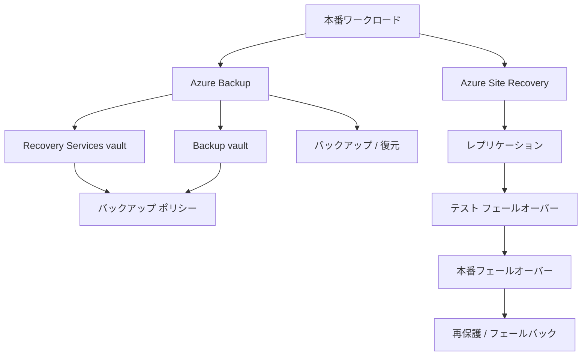

図の読み方
- `Azure Backup` は復旧ポイントを作る流れ、`Azure Site Recovery` は継続稼働のために別側へ切り替える流れです。
- Vault には `Recovery Services vault` と `Backup vault` があり、保護できるデータソースが異なります。
- バックアップではポリシー、保持、復元手順が重要です。
- Site Recovery ではレプリケーション、テスト フェールオーバー、本番フェールオーバー、再保護の順で考えます。

## まず結論
最後の章で最初に押さえるべき結論は次の 9 つです。

1. `Azure Backup` と `Azure Site Recovery` は役割が違う。前者は復旧ポイント、後者は継続運転である。
2. `Recovery Services vault` と `Backup vault` は、保護できるデータソースが異なる。
3. バックアップは `何を`, `どの頻度で`, `どれだけ保持するか` の 3 点で設計する。
4. 復元手順はバックアップ取得と同じくらい重要であり、定期的な検証が必要である。
5. Site Recovery では、いきなり本番フェールオーバーするのではなく、`テスト フェールオーバー` を先に考える。
6. フェールオーバー後は `commit` と `reprotect` の流れを理解する必要がある。
7. バックアップ監視では、ジョブ、アラート、レポートを見て失敗を放置しないことが重要である。
8. DR 設計は、RPO と RTO の考え方で整理すると比較しやすい。
9. AZ-104 の終盤問題は、ID、ネットワーク、ストレージ、監視、バックアップをまとめて問う形が多い。

ここで重要なのは、「バックアップがあるから DR は不要」「Site Recovery があるからバックアップ不要」と考えないことです。両者は補完関係です。バックアップは誤削除や過去時点への復元に強く、Site Recovery はリージョン障害時の継続運転に強いです。

比較表で整理します。

| 観点 | Azure Backup | Azure Site Recovery |
| --- | --- | --- |
| 主目的 | 復旧ポイントの保持 | ワークロード継続運転 |
| 典型要件 | 誤削除、過去版復元、保持 | リージョン障害、短時間切り替え |
| 結果 | データやマシンを復元 | 別リージョンで起動・切り替え |
| 重要操作 | バックアップ、復元、ポリシー | レプリケーション、フェールオーバー、再保護 |

### 確認質問
1. バックアップと Site Recovery は同じ役割ですか。
2. DR を考えるとき、なぜ復元テストが重要ですか。

## 先に知っておく用語

| 用語 | 意味 | 先に押さえるポイント |
| --- | --- | --- |
| Recovery Services vault | Azure Backup と Site Recovery で使う古くからの Vault 種別 | Azure VM、Azure Files などで重要 |
| Backup vault | 比較的新しいワークロード向け Vault 種別 | Azure Disk、Azure Blob、PostgreSQL など |
| バックアップ ポリシー | バックアップ頻度と保持期間の定義 | 日次、週次、月次保持など |
| Recovery Point | 復元可能な時点 | どの時点に戻せるかの基準 |
| Restore | 復元操作 | 元場所復元か別場所復元かを意識 |
| Site Recovery | 災害復旧サービス | レプリケーションとフェールオーバー |
| Test Failover | 本番影響なしの DR テスト | 定期訓練に重要 |
| Commit | フェールオーバー確定 | 後戻り前提を外す重要操作 |
| Reprotect | フェールオーバー後の逆方向保護 | フェールバック準備に必要 |
| RPO | Recovery Point Objective | どれだけデータ損失を許容するか |
| RTO | Recovery Time Objective | どれだけ停止時間を許容するか |

RPO と RTO は、製品知識ではなく判断軸です。RPO が厳しいほど複製頻度や仕組みが重要になります。RTO が厳しいほど、手作業復元より自動化された切り替えが重要になります。AZ-104 では深い設計論を問う試験ではありませんが、この 2 つで読むと正答しやすくなります。

例として、「1 時間分のデータ損失は許容するが、翌日まで復旧できればよい」ならバックアップ中心の設計が候補です。「数分以内に別リージョンで再開したい」なら Site Recovery を強く疑います。

### 小演習
次の要件が厳しいのは RPO, RTO のどちらか答えてください。

1. 5 分以上のデータ損失は許容できない  
2. 30 分以内にサービス再開したい  

## 核心概念の説明

### 1. Recovery Services vault と Backup vault の違い
2026-03-08 時点の Azure Backup 公式サポート マトリックスでは、Recovery Services vault と Backup vault の両方が存在し、保護できるデータソースが異なります。

大まかな違いは次のとおりです。

| Vault 種別 | 主な対応データソース例 | 補足 |
| --- | --- | --- |
| Recovery Services vault | Azure VM、SQL in Azure VM、SAP HANA in Azure VM、Azure Files、MARS/MABS/DPM 系 | Azure Backup と Site Recovery の両方でよく登場 |
| Backup vault | Azure Disk、Azure Blob、Azure Database for PostgreSQL などの新しいワークロード | 対応ワークロードは拡張され得る |

この対応表は将来変わる可能性があるため、試験直前には公式サポート マトリックスを確認してください。特に Backup vault 側の対象は拡張されやすいです。

例として、Azure VM のバックアップを設定したいなら、まず Recovery Services vault を疑います。Azure Blob の Vaulted Backup を考えるなら Backup vault が候補になります。

#### 確認質問
1. Azure VM のバックアップで第一候補となる Vault 種別はどちらですか。
2. Backup vault の対応ワークロードは今後変わり得ますか。

### 2. バックアップ ポリシーは「頻度」と「保持」の設計
バックアップ ポリシーは、いつ取得し、何日・何週間・何か月残すかを決める仕組みです。初学者は「毎日取る」で終わりがちですが、保持設計まで含めて理解することが重要です。

| 設計項目 | 例 |
| --- | --- |
| 頻度 | 毎日 23:00 |
| 短期保持 | 日次 30 日 |
| 中期保持 | 週次 12 週 |
| 長期保持 | 月次 12 か月 |

ポリシーは、業務要件とコスト、復元要件のバランスで決めます。何でも長く残すとコストが増えますが、短すぎると必要な復元点が消えます。

例として、誤更新が翌営業日に見つかることが多いなら、少なくとも数日から数週間の短期保持が必要です。月次締めの検証が必要なら、月次保持も検討します。

#### 小演習
次の要件に対して、短期保持と長期保持の考え方を書いてください。

1. 日次障害復旧用  
2. 月次監査用  

### 3. バックアップと復元はセットで理解する
バックアップを取れていても、復元できなければ意味がありません。AZ-104 では `Perform backup and restore operations by using Azure Backup` が明示されています。つまり、取得と復元をセットで理解する必要があります。

復元では次の違いが重要です。

| 観点 | 例 |
| --- | --- |
| 元の場所へ戻す | 誤削除から元へ戻す |
| 別の場所へ戻す | 検証や監査のために別名で復元する |
| 復旧時点 | 最新か、特定 Recovery Point か |

例として、Azure Files の誤削除共有を復元する場合と、Azure VM を別名で検証用に復元する場合では、目的が違います。前者は業務再開、後者は検証です。

#### 確認質問
1. バックアップ取得だけでなく復元手順も重要な理由は何ですか。
2. 別場所復元が役立つのはどんな場面ですか。

### 4. バックアップ監視は「失敗を見逃さない」ためにある
バックアップは設定しただけで終わりではありません。ジョブ失敗や長時間化、保護解除、保持逸脱を監視する必要があります。試験範囲にも、バックアップのレポートやアラートを解釈する項目があります。

監視対象の典型例は次のとおりです。

1. バックアップ ジョブ成功/失敗
2. 保護対象数
3. アラート発生状況
4. 復旧ポイントの状態

例として、日次バックアップが 3 日連続失敗しているのに誰も気づかない状態は最悪です。障害発生時に「取れていると思っていたバックアップ」が使えない可能性があるからです。

#### 小演習
バックアップ監視で最低限追いたい項目を 3 つ書いてください。

### 5. Site Recovery は継続運転のための複製基盤
Azure Site Recovery は、Azure VM やオンプレミス ワークロードを別の Azure リージョンや別サイトへレプリケートし、障害時に切り替えるためのサービスです。

ここでの中心概念は次の流れです。

1. レプリケーション有効化
2. 定期同期
3. テスト フェールオーバー
4. 本番フェールオーバー
5. Commit
6. Reprotect
7. Failback

例として、Japan East の本番 VM を Japan West へ保護しておき、災害時に Japan West で起動する、というのが典型です。この流れは単なるバックアップ復元より継続運転に向いています。

#### 確認質問
1. Site Recovery の主目的は何ですか。
2. バックアップ復元より Site Recovery が向く要件は何ですか。

### 6. テスト フェールオーバーを先に考える
DR 設計で非常に重要なのは、本番時に初めて切り替えを試さないことです。Site Recovery にはテスト フェールオーバーがあり、本番影響を抑えながら DR 手順を検証できます。

試験でも実務でも、「定期的な DR 訓練」が重要です。切り替えられると思っていたが、NSG、DNS、アプリ設定、依存先接続が不足していた、ということは珍しくありません。

例として、テスト フェールオーバーで Web は起動したが、DB 接続先 DNS がまだ元リージョンを向いていた、という問題は実際に起こりやすいです。これを本番障害で初めて知るのは危険です。

#### 小演習
テスト フェールオーバーで確認すべき項目を 3 つ書いてください。

### 7. フェールオーバー後の Commit と Reprotect
Site Recovery の切り替え後には、`Commit` と `Reprotect` を理解する必要があります。

`Commit` は、フェールオーバーした復旧ポイントを確定する操作です。  
`Reprotect` は、新しい側から元の側へ逆方向に保護を張り直す操作です。

この流れを知らないと、「切り替えて終わり」と誤解してしまいます。しかし、DR は切り替えた後に元へ戻せる状態を作るところまで含みます。

例として、Japan West 側へフェールオーバーした後、そのまま無保護で運用し続けるのは危険です。Reprotect で今度は West から East へ複製できる状態に戻します。

#### 確認質問
1. Commit は何を確定する操作ですか。
2. Reprotect は何のために必要ですか。

## worked example

### シナリオ
あなたは、会計システムの BC/DR 設計を担当しています。要件は次のとおりです。

- 本番 VM は誤削除にもリージョン障害にも備えたい
- Azure Files に置いた共有帳票も保護したい
- 月次監査のため長期保持したい
- 障害時はできるだけ早く別リージョンで業務再開したい
- 年 2 回は DR 訓練を行いたい

### 設計方針
1. 本番 VM と Azure Files は Azure Backup で保護する
2. VM は Recovery Services vault に日次バックアップ ポリシーを設定する
3. VM のリージョン障害対策として Site Recovery を有効化する
4. DR 訓練はテスト フェールオーバーで実施する
5. バックアップ ジョブと Site Recovery 状態は定期監視する

### CLI 例
```bash
az backup vault create \
  --resource-group rg-bcdr \
  --name vault-backup-finance \
  --location japaneast \
  --type SystemAssigned
```

```bash
az backup policy list \
  --resource-group rg-bcdr \
  --vault-name rsv-finance-prod
```

### subgoal 単位での見方
1. `バックアップと DR を分ける`  
   誤削除対策とリージョン障害対策を別レイヤーで持ちます。
2. `保持要件をポリシーへ落とす`  
   月次監査に必要な期間を保持で表現します。
3. `切り替え前に訓練する`  
   テスト フェールオーバーで本番手順を検証します。
4. `切り替え後も守る`  
   Commit と Reprotect まで考えます。

### この例の重要点
この設計では、Backup と Site Recovery を競合ではなく補完として使っています。AZ-104 の後半問題では、この「複数サービスの役割分担」が見えるかどうかで差がつきます。

### 確認質問
1. 会計システムで Backup と Site Recovery を併用する理由は何ですか。
2. DR 訓練を年 2 回行う価値は何ですか。

## 実践手順または小演習

### 実践手順: BC/DR 設計を 1 枚にまとめる
1. 守る対象を `VM`, `ファイル`, `Blob`, `DB` などで列挙します。
2. 各対象について、誤削除対策が必要か、リージョン障害対策が必要かを分けます。
3. バックアップに使う Vault 種別を決めます。
4. バックアップ ポリシーの頻度と保持を決めます。
5. Site Recovery の要否と対象 VM を決めます。
6. テスト フェールオーバー、Commit、Reprotect の手順を 1 行ずつ書きます。
7. 監視対象として、バックアップ失敗とレプリケーション状態を追加します。

### 総合演習
次の要件に対して、各章の知識を使って設計してください。

- 本番 Web システムは VM 2 台 + Internal API + Storage Account + Azure Files で構成
- 運用チームは `rg-app-prod` だけ変更可能にしたい
- Storage は private IP ベースで使いたい
- 監視チームにはサブスクリプション全体の閲覧権限だけを付けたい
- CPU 高騰とバックアップ失敗は即通知したい
- リージョン障害時は別リージョンへ切り替えたい

考える項目は次の 7 つです。

1. RBAC とスコープ  
2. Storage アクセス方式  
3. ネットワーク保護  
4. VM 可用性  
5. 監視と通知  
6. バックアップ ポリシー  
7. Site Recovery 手順  

## よくある失敗

| よくある失敗 | なぜ起きるか | 防ぎ方 |
| --- | --- | --- |
| Backup と Site Recovery を同じだと思う | どちらも「復旧」に見えるから | 過去時点復元と継続運転で分ける |
| Vault 種別を気にせず作る | 名前が似ているから | 保護対象データソースで選ぶ |
| バックアップは取るが復元手順を試さない | 障害が起きるまで後回しにするから | 定期的に復元演習を行う |
| DR 訓練をしない | 本番障害時にやればよいと思うから | テスト フェールオーバーを定期実施する |
| フェールオーバー後に Reprotect を忘れる | 切り替えで安心してしまうから | 切り替え後の保護状態まで確認する |
| バックアップ失敗通知を見ない | 「設定済みだから大丈夫」と思うから | レポートとアラートを定期確認する |

### 確認質問
1. フェールオーバー後に無保護のまま運用すると、どんなリスクがありますか。
2. Vault 種別を誤ると何が起きますか。

## まとめ
この章で覚えるべき点は、次の 10 つです。

1. Azure Backup は復旧ポイントの保持、Azure Site Recovery は継続運転に強い。
2. Recovery Services vault と Backup vault は対応ワークロードが異なる。
3. バックアップ ポリシーは頻度と保持で設計する。
4. 復元手順は取得と同じくらい重要である。
5. バックアップ監視ではジョブ失敗やアラートを見逃さない。
6. Site Recovery はレプリケーション、テスト フェールオーバー、本番フェールオーバー、Reprotect の流れで理解する。
7. Commit はフェールオーバー確定、Reprotect は逆方向保護である。
8. RPO と RTO は DR の比較軸である。
9. AZ-104 は最後に複数サービスを横断して問うため、単独知識でなく関係で覚える。
10. この資料を一周したら、各章の小演習を自力で再回答し、最後に総合演習を時間制限つきで解くと定着しやすい。

### 最終確認
次の 4 つを説明できれば、AZ-104 全体像がかなり整理されています。

1. Azure Backup と Azure Site Recovery の違い  
2. Recovery Services vault と Backup vault の違い  
3. バックアップ ポリシーで決めること  
4. フェールオーバー後に Reprotect が必要な理由  

## 付録: 参照情報
- 試験ガイド: [Study guide for Exam AZ-104](https://learn.microsoft.com/en-us/credentials/certifications/resources/study-guides/az-104)
- Azure Backup の概要: [What is Azure Backup?](https://learn.microsoft.com/en-us/azure/backup/backup-overview)
- Backup vault の概要: [Overview of Backup vaults](https://learn.microsoft.com/en-us/azure/backup/backup-vault-overview)
- Recovery Services vault の概要: [Overview of Recovery Services vaults](https://learn.microsoft.com/en-us/azure/backup/backup-azure-recovery-services-vault-overview)
- Azure Backup サポート マトリックス: [Azure Backup support matrix](https://learn.microsoft.com/en-us/azure/backup/backup-support-matrix)
- Azure Site Recovery の概要: [Azure Site Recovery overview](https://learn.microsoft.com/en-us/azure/site-recovery/site-recovery-overview)
- Azure VM の DR クイックスタート: [Set up disaster recovery to a secondary region with Azure Site Recovery](https://learn.microsoft.com/en-us/azure/site-recovery/azure-to-azure-quickstart)
- フェールオーバー / フェールバック: [Tutorial: Fail over Azure VMs to a secondary region](https://learn.microsoft.com/en-us/azure/site-recovery/azure-to-azure-tutorial-failover-failback)
- バックアップ監視: [Monitor your backups with Backup Explorer](https://learn.microsoft.com/en-us/azure/backup/monitor-azure-backup-with-backup-explorer)

