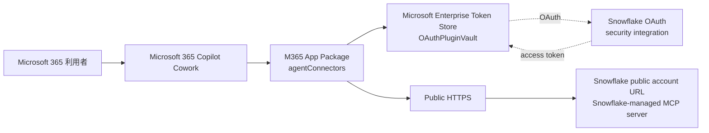

# Copilot Cowork から Snowflake MCP へパブリック接続する手順

作成日: 2026-06-19

## この資料の目的

この資料は、Microsoft 365 Copilot Cowork から Snowflake-managed MCP server にパブリックな HTTPS 経由で接続するための構成と手順を、初心者向けにまとめたものです。

ここでの「パブリック接続」とは、Copilot Cowork が Microsoft 365 側のクラウドから Snowflake の公開 account URL、または公開された APIM / gateway URL、へ接続する構成です。

## 全体構成



## 結論

Copilot Cowork では、M365 App Package の `agentConnectors` に remote MCP server を定義します。Snowflake-managed MCP server は Dynamic Client Registration をサポートしていないため、Copilot Cowork 側では `OAuthPluginVault` を使い、Teams Developer Portal で OAuth client registration を作る構成が現実的です。

## 事前に決める値

| 項目 | 例 | 説明 |
|---|---|---|
| Snowflake public account URL | `https://<account>.snowflakecomputing.com` | Copilot Cowork から到達できる公開URL |
| MCP server name | `COWORK_PUBLIC_MCP` | Snowflake 内の MCP server object 名 |
| Database | `ANALYTICS_DB` | MCP server object を作るデータベース |
| Schema | `MCP` | MCP server object を作るスキーマ |
| OAuth integration | `COWORK_MCP_OAUTH` | Snowflake OAuth 用 integration |
| OAuth redirect URI | `https://teams.microsoft.com/api/platform/v1.0/oAuthRedirect` | Microsoft 365 plugin OAuth 用 redirect URI |
| Teams OAuth registration ID | `A1bC...` | Teams Developer Portal で作成後に得られる ID |

## 1. Snowflake 側の MCP server を作る

入力する画面: Snowflake Snowsight の `Worksheets`

```sql
-- 管理者権限で作業するため、ACCOUNTADMIN ロールに切り替えます。
USE ROLE ACCOUNTADMIN;

-- Copilot Cowork から使う MCP 専用ロールを作成します。
CREATE ROLE IF NOT EXISTS MCP_COWORK_ROLE;

-- MCP tool 実行時に使うウェアハウスの利用権限を付与します。
GRANT USAGE ON WAREHOUSE <WAREHOUSE_NAME> TO ROLE MCP_COWORK_ROLE;

-- MCP server object を置くデータベースの利用権限を付与します。
GRANT USAGE ON DATABASE <DATABASE_NAME> TO ROLE MCP_COWORK_ROLE;

-- MCP server object を置くスキーマの利用権限を付与します。
GRANT USAGE ON SCHEMA <DATABASE_NAME>.<SCHEMA_NAME> TO ROLE MCP_COWORK_ROLE;

-- MCP server object を作成する権限を付与します。
GRANT CREATE MCP SERVER ON SCHEMA <DATABASE_NAME>.<SCHEMA_NAME> TO ROLE MCP_COWORK_ROLE;

-- Cortex Search Service を MCP tool として使う場合の利用権限です。
GRANT USAGE ON CORTEX SEARCH SERVICE <DATABASE_NAME>.<SCHEMA_NAME>.<SEARCH_SERVICE_NAME> TO ROLE MCP_COWORK_ROLE;
```

MCP server object を作ります。

```sql
-- MCP server を作成するロールに切り替えます。
USE ROLE MCP_COWORK_ROLE;

-- MCP server object を作るデータベースを選択します。
USE DATABASE <DATABASE_NAME>;

-- MCP server object を作るスキーマを選択します。
USE SCHEMA <SCHEMA_NAME>;

-- Copilot Cowork から呼び出す Snowflake-managed MCP server を作成します。
CREATE OR REPLACE MCP SERVER COWORK_PUBLIC_MCP
  -- ここから MCP tool 定義を YAML で記述します。
  FROM SPECIFICATION $$
    # 公開する tool の一覧です。
    tools:
      # Cowork に表示される tool のタイトルです。
      - title: "Search internal documents"
        # Cowork が tool を呼ぶための一意な名前です。
        name: "search_internal_documents"
        # tool の用途を説明します。
        description: "Search approved internal documents through a Snowflake Cortex Search Service."
        # Cortex Search Service を呼び出す tool 種別です。
        type: "CORTEX_SEARCH_SERVICE_QUERY"
        # 対象の Cortex Search Service の完全修飾名です。
        identifier: "<DATABASE_NAME>.<SCHEMA_NAME>.<SEARCH_SERVICE_NAME>"
  $$;
```

MCP server URL の形式です。

```text
https://<snowflake_public_account_url>/api/v2/databases/<database>/schemas/<schema>/mcp-servers/COWORK_PUBLIC_MCP
```

## 2. Snowflake OAuth security integration を作る

入力する画面: Snowflake Snowsight の `Worksheets`

Copilot Cowork の OAuth plugin では、Microsoft 側の redirect URI を Snowflake に登録します。

```sql
-- OAuth integration を作成するため、ACCOUNTADMIN ロールに切り替えます。
USE ROLE ACCOUNTADMIN;

-- Copilot Cowork 用の Snowflake OAuth security integration を作成または上書きします。
CREATE OR REPLACE SECURITY INTEGRATION COWORK_MCP_OAUTH
  -- Snowflake OAuth を使うことを指定します。
  TYPE = OAUTH
  -- Snowflake 公式クライアントではなく、自社で登録する custom client として扱います。
  OAUTH_CLIENT = CUSTOM
  -- この OAuth integration を有効化します。
  ENABLED = TRUE
  -- Microsoft Enterprise Token Store が secret を保持するため confidential client とします。
  OAUTH_CLIENT_TYPE = 'CONFIDENTIAL'
  -- Microsoft 365 plugin OAuth 用の redirect URI です。
  OAUTH_REDIRECT_URI = 'https://teams.microsoft.com/api/platform/v1.0/oAuthRedirect'
  -- 認可コード横取り対策として PKCE を必須にします。
  OAUTH_ENFORCE_PKCE = TRUE
  -- OAuth セッションで secondary roles を使わないようにします。
  OAUTH_USE_SECONDARY_ROLES = NONE
  -- access token 更新用の refresh token を発行します。
  OAUTH_ISSUE_REFRESH_TOKENS = TRUE
  -- refresh token の有効期間を 1 日にします。必要に応じて社内ルールで調整します。
  OAUTH_REFRESH_TOKEN_VALIDITY = 86400
  -- 強い管理者ロールを OAuth 利用から明示的に除外します。
  BLOCKED_ROLES_LIST = ('ACCOUNTADMIN', 'SECURITYADMIN', 'ORGADMIN', 'GLOBALORGADMIN');
```

Client ID と Client Secret を確認します。

```sql
-- OAuth client ID と client secret を表示します。
SELECT SYSTEM$SHOW_OAUTH_CLIENT_SECRETS('COWORK_MCP_OAUTH');
```

Snowflake OAuth endpoint は通常、次の形式です。

```text
https://<snowflake_public_account_url>/oauth/authorize
https://<snowflake_public_account_url>/oauth/token-request
```

## 3. 利用者ユーザーにロールとデフォルトウェアハウスを設定する

入力する画面: Snowflake Snowsight の `Worksheets`

```sql
-- 管理者権限でユーザー設定を変更するため、ACCOUNTADMIN ロールに切り替えます。
USE ROLE ACCOUNTADMIN;

-- Copilot Cowork を使う Snowflake ユーザーに MCP 用ロールを付与します。
GRANT ROLE MCP_COWORK_ROLE TO USER <SNOWFLAKE_USER_NAME>;

-- OAuth セッションで使われる default role と default warehouse を設定します。
ALTER USER <SNOWFLAKE_USER_NAME> SET DEFAULT_ROLE = 'MCP_COWORK_ROLE' DEFAULT_WAREHOUSE = '<WAREHOUSE_NAME>';
```

## 4. Snowflake の network policy を確認する

入力する画面: Snowflake Snowsight の `Worksheets`、または社内の Snowflake 管理手順

Snowflake account に network policy が設定されている場合、Copilot Cowork からの接続元を許可する必要があります。Microsoft が Copilot Cowork 用の固定 outbound IP を公開している場合は、その IP を許可します。固定 IP が確認できない場合は、Snowflake を直接公開するのではなく、公開 APIM、Azure Front Door、WAF などの自社管理ゲートウェイを前段に置く構成を推奨します。

考え方:

```sql
-- Copilot Cowork または自社公開ゲートウェイの接続元IPを許可する network rule を作ります。
CREATE NETWORK RULE mcp_cowork_ingress_rule
  -- Snowflake への inbound 通信を制御するルールです。
  MODE = INGRESS
  -- IPv4 アドレスで許可します。
  TYPE = IPV4
  -- 許可する接続元IPアドレスを列挙します。
  VALUE_LIST = ('<ALLOWED_PUBLIC_IP_1>', '<ALLOWED_PUBLIC_IP_2>');

-- 既存 network policy に作成した network rule を追加します。
ALTER NETWORK POLICY <NETWORK_POLICY_NAME> ADD ALLOWED_NETWORK_RULE_LIST = ('mcp_cowork_ingress_rule');
```

## 5. Teams Developer Portal で OAuth client registration を作る

入力する画面: [Teams Developer Portal](https://dev.teams.microsoft.com/) -> `Tools` -> `OAuth client registration`

1. Teams Developer Portal を開きます。
2. `Tools` を開きます。
3. `OAuth client registration` を開きます。
4. `Register client` または `New OAuth client registration` を押します。
5. `Registration name` に `Snowflake MCP OAuth` などを入力します。
6. `Base URL` に Snowflake MCP server のベースURLを入力します。
7. `Client ID` に Snowflake の client ID を入力します。
8. `Client secret` に Snowflake の client secret を入力します。
9. `Authorization endpoint` に `https://<snowflake_public_account_url>/oauth/authorize` を入力します。
10. `Token endpoint` に `https://<snowflake_public_account_url>/oauth/token-request` を入力します。
11. `Refresh endpoint` に `https://<snowflake_public_account_url>/oauth/token-request` を入力します。
12. `Scope` は最初は最小にします。Snowflake role を scope で指定する設計の場合は `session:role:<role_name>` を使います。
13. `Enable Proof Key for Code Exchange (PKCE)` は Snowflake 側で `OAUTH_ENFORCE_PKCE = TRUE` にした場合、有効にします。
14. `Save` を押します。
15. 作成された OAuth client registration ID を控えます。

## 6. M365 App Package の manifest を作る

入力する画面: Windows の任意の作業フォルダ。編集は VS Code またはメモ帳で可能です。

フォルダ構成の例です。

```text
snowflake-cowork-plugin/
manifest.json
color.png
outline.png
```

`manifest.json` の最小イメージです。実ファイルは JSON なのでコメントは入れられません。下のブロックは説明用です。

```jsonc
{
  // Microsoft Teams / Microsoft 365 app manifest のスキーマです。
  "$schema": "https://developer.microsoft.com/json-schemas/teams/v1.28/MicrosoftTeams.schema.json",

  // manifest のバージョンです。
  "manifestVersion": "1.28",

  // このアプリパッケージのバージョンです。
  "version": "1.0.0",

  // アプリの一意な GUID です。
  "id": "<YOUR-GUID-HERE>",

  // 開発元情報です。
  "developer": {
    "name": "<YOUR_COMPANY_NAME>",
    "websiteUrl": "https://<YOUR_COMPANY_WEBSITE>",
    "privacyUrl": "https://<YOUR_COMPANY_WEBSITE>/privacy",
    "termsOfUseUrl": "https://<YOUR_COMPANY_WEBSITE>/terms"
  },

  // Copilot Cowork 上に表示される名前です。
  "name": {
    "short": "Snowflake MCP",
    "full": "Snowflake MCP Connector for Copilot Cowork"
  },

  // アプリの説明です。
  "description": {
    "short": "Connect Copilot Cowork to approved Snowflake MCP tools.",
    "full": "Allows Copilot Cowork to use approved Snowflake-managed MCP tools through OAuth."
  },

  // アイコンファイルです。
  "icons": {
    "color": "color.png",
    "outline": "outline.png"
  },

  // アクセントカラーです。
  "accentColor": "#2B579A",

  // 外部データへ接続する connector 定義です。
  "agentConnectors": [
    {
      "id": "snowflake-mcp",
      "displayName": "Snowflake MCP",
      "description": "Access approved Snowflake MCP tools.",
      "toolSource": {
        "remoteMcpServer": {
          "mcpServerUrl": "https://<snowflake_public_account_url>/api/v2/databases/<database>/schemas/<schema>/mcp-servers/COWORK_PUBLIC_MCP",
          "authorization": {
            "type": "OAuthPluginVault",
            "referenceId": "<TEAMS_OAUTH_REGISTRATION_ID>"
          }
        }
      }
    }
  ]
}
```

実際に保存する JSON ではコメントを削除してください。

## 7. ZIP パッケージを作成する

入力する画面: Windows PowerShell

PowerShell は、Windows のスタートメニューで `PowerShell` と検索して起動します。`cd` で `manifest.json` があるフォルダへ移動してから実行します。

```powershell
# 現在のフォルダにある manifest.json、color.png、outline.png を zip にまとめます。
Compress-Archive -Path manifest.json, color.png, outline.png -DestinationPath snowflake-cowork-plugin.zip
```

コマンドの説明:

- `Compress-Archive` は ZIP ファイルを作る PowerShell の標準コマンドです。
- `-Path` は ZIP に入れるファイルを指定します。
- `-DestinationPath` は作成する ZIP ファイル名を指定します。

## 8. Microsoft 365 管理センターへアップロードする

入力する画面: Microsoft 365 Admin Center

1. Microsoft 365 Admin Center を開きます。
2. `Manage Apps` を開きます。
3. `Upload custom app` を選びます。
4. 作成した `snowflake-cowork-plugin.zip` をアップロードします。
5. アップロード後、許可対象ユーザーまたはグループを指定します。
6. Copilot Cowork を開きます。
7. `Sources & Skills` を開きます。
8. Snowflake MCP connector が表示されることを確認します。

## 9. Copilot Cowork で認証して使う

入力する画面: Microsoft 365 Copilot Cowork

1. Copilot Cowork を開きます。
2. `Sources & Skills` で Snowflake MCP connector を有効化します。
3. 初回利用時に OAuth サインインが表示されたら、Snowflake ユーザーでログインします。
4. 同意画面で `MCP_COWORK_ROLE` など想定ロールになっていることを確認します。
5. 接続後、Snowflake MCP tool を使うプロンプトを入力します。

確認用プロンプト:

```text
Snowflake MCP の search_internal_documents tool を使って、月次レポートに関する社内文書を検索してください。更新や削除はしないでください。
```

## 10. Copilot Cowork 向け tool annotation

Copilot Cowork は MCP tool の `annotations` を見て、ユーザー確認が必要かを判断します。Snowflake-managed MCP server の tool 定義で annotation を細かく設定できる場合は、読み取り専用 tool には `readOnlyHint` を付け、破壊的操作には `destructiveHint` を付ける設計にしてください。

読み取り専用 tool の考え方:

```jsonc
{
  // tool の一意な名前です。
  "name": "search_internal_documents",

  // tool が読み取り専用であることを Cowork に伝えます。
  "annotations": {
    "readOnlyHint": true,
    "title": "Search Internal Documents"
  }
}
```

更新系 tool の考え方:

```jsonc
{
  // tool の一意な名前です。
  "name": "update_record",

  // tool が破壊的または更新系であることを Cowork に伝えます。
  "annotations": {
    "destructiveHint": true,
    "title": "Update Snowflake Record"
  }
}
```

## トラブルシューティング

| 症状 | 原因候補 | 確認場所 |
|---|---|---|
| connector が表示されない | M365 app package の manifest または ZIP 構造が不正 | Microsoft 365 Admin Center、manifest validation |
| OAuth が失敗する | Snowflake `OAUTH_REDIRECT_URI` が Teams の redirect URI と一致していない | Snowflake `DESCRIBE INTEGRATION COWORK_MCP_OAUTH` |
| token endpoint で失敗する | Teams Developer Portal の client secret または token endpoint が誤り | Teams Developer Portal |
| Snowflake へ接続できない | network policy が Microsoft 側の接続元を許可していない | Snowflake network policy |
| tool は見えるが実行できない | MCP role に underlying object 権限がない | Snowflake grants |
| 毎回承認が必要 | refresh token 設定、Enterprise Token Store、同意状態の問題 | Snowflake OAuth、Teams OAuth registration |

## 運用上の推奨

- パブリック接続では、Snowflake を直接公開するより、APIM や WAF を前段に置く構成を検討してください。
- Snowflake network policy を必ず確認してください。
- 最初は読み取り専用 tool だけを公開してください。
- OAuth client secret は manifest や `SKILL.md` に書かず、Teams Developer Portal の OAuth registration に保管してください。
- tool の description は、利用範囲と禁止事項が分かるように書いてください。

## 参考資料

- Microsoft: [Build plugins for Copilot Cowork](https://learn.microsoft.com/en-us/microsoft-365/copilot/cowork/cowork-plugin-development)
- Microsoft: [Configure authentication for MCP and API plugins in agents](https://learn.microsoft.com/en-us/microsoft-365/copilot/extensibility/plugin-authentication)
- Microsoft: [Extend your agent with Model Context Protocol in Copilot Studio](https://learn.microsoft.com/en-us/microsoft-copilot-studio/agent-extend-action-mcp)
- Snowflake: [Snowflake-managed MCP server](https://docs.snowflake.com/en/user-guide/snowflake-cortex/cortex-agents-mcp)
- Snowflake: [Configure Snowflake OAuth for custom clients](https://docs.snowflake.com/en/user-guide/oauth-custom)
- Snowflake: [CREATE SECURITY INTEGRATION (Snowflake OAuth)](https://docs.snowflake.com/en/sql-reference/sql/create-security-integration-oauth-snowflake)
- MCP: [Authorization specification](https://modelcontextprotocol.io/specification/2025-11-25/basic/authorization)

