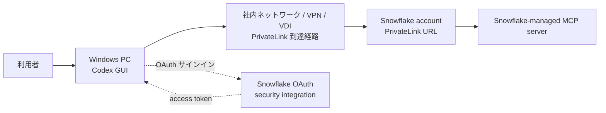

# Codex GUI から Snowflake MCP へ PrivateLink で直接接続する手順

作成日: 2026-06-19

## この資料の目的

この資料は、Windows の Codex GUI から、Azure Private Link 経由で Snowflake-managed MCP server に直接接続するための構成と手順を、初心者向けにまとめたものです。

ここでの「直接接続」とは、Azure API Management を経由せず、Codex GUI が Snowflake の MCP エンドポイントを直接呼び出す構成です。

## 結論

推奨構成は、Snowflake が提供する Snowflake-managed MCP server を使う構成です。自前で MCP サーバーアプリをホストしなくても、Snowflake 内で MCP server object を作成し、Cortex Search、Cortex Analyst、Cortex Agent、UDF、ストアドプロシージャ、または SQL 実行を MCP tool として公開できます。

ただし、Codex GUI から Snowflake MCP へ直接 OAuth 接続する構成は、この資料だけで無条件に「必ず動く」とは言い切れません。Snowflake-managed MCP server は OAuth を推奨していますが、Snowflake は Dynamic Client Registration をサポートしていません。また、現行の公開されている Codex `config.toml` 設定項目では、MCP OAuth の `client_id` と `client_secret` を直接指定するキーを確認できません。

そのため、Codex GUI 側が Snowflake OAuth の事前登録 client を扱えることを実機で確認できない場合は、直接 OAuth ではなく、`bearer_token_env_var` による短時間 token 検証、または `02_codex_apim_private_snowflake_mcp.md` の APIM 経由構成を優先してください。

## 再調査後の機能判定

この資料の Snowflake 側設定、PrivateLink URL、MCP server URL、`config.toml` の基本項目は公式仕様と整合しています。一方で、直接 OAuth だけは要検証です。

| 項目 | 判定 | 理由 |
|---|---|---|
| Snowflake-managed MCP server の作成 | 動く前提でよい | Snowflake 公式の `CREATE MCP SERVER ... FROM SPECIFICATION` 構文と一致しています |
| PrivateLink URL を Codex の `url` に設定 | 動く前提でよい | Codex は Streamable HTTP MCP server の `url` 設定に対応しています |
| `mcp_oauth_callback_port` / `mcp_oauth_callback_url` | 動く前提でよい | Codex 公式設定にある OAuth callback 固定項目です |
| `scopes` に `session:role:...` を指定 | 条件付きで有効 | Snowflake OAuth の scope としては妥当ですが、Codex の OAuth 開始処理で期待どおり送られるか実機確認が必要です |
| 直接 OAuth ログイン | 要検証 | Snowflake は DCR 非対応で、Codex `config.toml` には `client_secret` 指定項目が確認できないためです |
| `bearer_token_env_var` 方式 | 検証用として有効 | Codex 公式設定にあり、Snowflake に渡せる有効な bearer token を別手順で用意できる場合に使えます |

初心者向けに言うと、この資料のネットワークとMCP URLの作り方は妥当です。ただし、OAuthの「最初のログイン画面が出て、SnowflakeのClient ID/Secretを使ってtokenを取る部分」は、Codex GUI側の実装に依存するため、最初のPoCで必ず確認してください。

## 全体構成



## 事前に決める値

| 項目 | 例 | 説明 |
|---|---|---|
| Snowflake PrivateLink account URL | `https://<account>.privatelink.snowflakecomputing.com` | PrivateLink 経由で名前解決される Snowflake URL |
| Database | `ANALYTICS_DB` | MCP server object を作るデータベース |
| Schema | `MCP` | MCP server object を作るスキーマ |
| MCP server name | `CODEX_PRIVATE_MCP` | Snowflake 内で作る MCP server object 名 |
| Warehouse | `COMPUTE_WH` | MCP tool 実行時に使うウェアハウス |
| Access role | `MCP_CODEX_ROLE` | Codex 接続ユーザーに付与する最小権限ロール |
| OAuth integration | `CODEX_MCP_OAUTH` | Snowflake OAuth 用の security integration 名 |
| OAuth redirect URI | `http://localhost:4321/callback` | Codex の OAuth コールバック先。`config.toml` で固定する |

## 重要な前提

- Snowflake 側の Azure Private Link は構築済みである前提です。
- 実装先 Windows PC から Snowflake PrivateLink URL に到達できる必要があります。
- DNS は Snowflake の account URL と OCSP URL を PrivateLink 側に解決できる必要があります。
- Codex は GUI を使用します。CLI は使いません。
- Snowflake の OAuth セッションでは、接続ユーザーの `DEFAULT_ROLE` が使われます。Secondary role は使えません。
- `ACCOUNTADMIN` や `SECURITYADMIN` などの強いロールを OAuth 接続用に使わないでください。

## 1. Snowflake 側のロールと権限を作る

入力する画面: Snowflake Snowsight の `Worksheets`

次の SQL は、管理者が Snowsight の Worksheet に貼り付けて実行します。`<...>` は自社環境の値に置き換えてください。

```sql
-- 管理者権限で作業するため、ACCOUNTADMIN ロールに切り替えます。
USE ROLE ACCOUNTADMIN;

-- Codex から MCP tool を使うための専用ロールを作成します。
CREATE ROLE IF NOT EXISTS MCP_CODEX_ROLE;

-- MCP tool 実行時に使うウェアハウスの利用権限を付与します。
GRANT USAGE ON WAREHOUSE <WAREHOUSE_NAME> TO ROLE MCP_CODEX_ROLE;

-- MCP server object を置くデータベースの利用権限を付与します。
GRANT USAGE ON DATABASE <DATABASE_NAME> TO ROLE MCP_CODEX_ROLE;

-- MCP server object を置くスキーマの利用権限を付与します。
GRANT USAGE ON SCHEMA <DATABASE_NAME>.<SCHEMA_NAME> TO ROLE MCP_CODEX_ROLE;

-- MCP server object を作成できる権限をスキーマに付与します。
GRANT CREATE MCP SERVER ON SCHEMA <DATABASE_NAME>.<SCHEMA_NAME> TO ROLE MCP_CODEX_ROLE;

-- Cortex Search を tool として使う場合だけ、対象サービスの利用権限を付与します。
GRANT USAGE ON CORTEX SEARCH SERVICE <DATABASE_NAME>.<SCHEMA_NAME>.<SEARCH_SERVICE_NAME> TO ROLE MCP_CODEX_ROLE;

-- UDF を custom tool として使う場合だけ、対象関数の利用権限を付与します。
GRANT USAGE ON FUNCTION <DATABASE_NAME>.<SCHEMA_NAME>.<FUNCTION_NAME>(<ARG_TYPES>) TO ROLE MCP_CODEX_ROLE;

-- ストアドプロシージャを custom tool として使う場合だけ、対象プロシージャの利用権限を付与します。
GRANT USAGE ON PROCEDURE <DATABASE_NAME>.<SCHEMA_NAME>.<PROCEDURE_NAME>(<ARG_TYPES>) TO ROLE MCP_CODEX_ROLE;

-- SQL 実行 tool を使う場合だけ、参照させたいテーブルまたはビューに SELECT 権限を付与します。
GRANT SELECT ON TABLE <DATABASE_NAME>.<SCHEMA_NAME>.<TABLE_NAME> TO ROLE MCP_CODEX_ROLE;
```

補足:

- 使わない tool 種別の `GRANT` は実行しないでください。
- 最初は読み取り系 tool だけで始めるのが安全です。
- SQL 実行 tool は便利ですが、広い権限を付けると想定外のデータ参照につながります。

## 2. Snowflake-managed MCP server を作成する

入力する画面: Snowflake Snowsight の `Worksheets`

次の例は Cortex Search Service を MCP tool として公開する最小構成です。実際には、自社で公開したい Cortex Search、Cortex Analyst、Cortex Agent、UDF、ストアドプロシージャに合わせて調整します。

```sql
-- MCP server を作成する専用ロールに切り替えます。
USE ROLE MCP_CODEX_ROLE;

-- MCP server object を作るデータベースを選択します。
USE DATABASE <DATABASE_NAME>;

-- MCP server object を作るスキーマを選択します。
USE SCHEMA <SCHEMA_NAME>;

-- Snowflake 内に MCP server object を作成または上書きします。
CREATE OR REPLACE MCP SERVER CODEX_PRIVATE_MCP
  -- ここから MCP server の tool 定義を YAML で記述します。
  FROM SPECIFICATION $$
    # この MCP server に公開する tool の一覧です。
    tools:
      # Codex に表示される tool の人間向けタイトルです。
      - title: "Search internal documents"
        # Codex が tool を呼ぶときに使う一意な名前です。
        name: "search_internal_documents"
        # この tool が何をするかを Codex に説明します。
        description: "Search approved internal documents through a Snowflake Cortex Search Service."
        # Cortex Search Service を呼び出す tool 種別です。
        type: "CORTEX_SEARCH_SERVICE_QUERY"
        # 実際に呼び出す Cortex Search Service の完全修飾名です。
        identifier: "<DATABASE_NAME>.<SCHEMA_NAME>.<SEARCH_SERVICE_NAME>"
  $$;
```

確認用 SQL です。

```sql
-- 現在のスキーマにある MCP server object の一覧を表示します。
SHOW MCP SERVERS IN SCHEMA <DATABASE_NAME>.<SCHEMA_NAME>;

-- 作成した MCP server object の定義を表示します。
DESCRIBE MCP SERVER CODEX_PRIVATE_MCP;
```

## 3. MCP server URL を作る

Codex の `config.toml` に設定する URL は、次の形式です。

```text
https://<account_url>/api/v2/databases/<database>/schemas/<schema>/mcp-servers/<mcp_server_name>
```

例:

```text
https://myorg-myaccount.privatelink.snowflakecomputing.com/api/v2/databases/ANALYTICS_DB/schemas/MCP/mcp-servers/CODEX_PRIVATE_MCP
```

注意:

- `<account_url>` は PrivateLink 用の Snowflake account URL を使います。
- クライアントによっては account URL 内の `_` が問題になるため、Snowflake 公式は `_` ではなく `-` を使うことを案内しています。

## 4. Codex の OAuth redirect URI を config.toml で固定する

入力する画面: Codex GUI の `Settings` -> `Configuration` -> `Open config.toml`

Codex では MCP server の設定を `config.toml` に書けます。Snowflake OAuth では redirect URI を Snowflake 側に事前登録する必要があるため、Codex 側の callback URL を固定します。

1. Codex GUI を開きます。
2. `Settings` を開きます。
3. `Configuration` を開きます。
4. `Open config.toml` を押します。
5. 開いた `config.toml` の末尾に、次の設定を追加します。

```toml
# MCP OAuth のコールバック受信ポートを 4321 に固定します。
mcp_oauth_callback_port = 4321

# MCP OAuth の redirect_uri を固定します。
mcp_oauth_callback_url = "http://localhost:4321/callback"
```

この固定案を使う場合、Snowflake の OAuth integration には `http://localhost:4321/callback` を登録します。localhost の HTTP redirect を使うため、Snowflake 側で `OAUTH_ALLOW_NON_TLS_REDIRECT_URI = TRUE` が必要です。

## 5. Snowflake OAuth security integration を作成する

入力する画面: Snowflake Snowsight の `Worksheets`

次の例は、Codex の redirect URI を `http://localhost:4321/callback` に固定した場合です。

```sql
-- OAuth integration を作成するため、ACCOUNTADMIN ロールに切り替えます。
USE ROLE ACCOUNTADMIN;

-- Codex GUI 用の Snowflake OAuth security integration を作成または上書きします。
CREATE OR REPLACE SECURITY INTEGRATION CODEX_MCP_OAUTH
  -- Snowflake OAuth を使うことを指定します。
  TYPE = OAUTH
  -- Snowflake 公式クライアントではなく、自社で登録する custom client として扱います。
  OAUTH_CLIENT = CUSTOM
  -- この OAuth integration を有効化します。
  ENABLED = TRUE
  -- Client Secret を保持できるクライアントとして登録します。
  OAUTH_CLIENT_TYPE = 'CONFIDENTIAL'
  -- Codex GUI が OAuth 完了後に戻ってくる URL です。
  OAUTH_REDIRECT_URI = 'http://localhost:4321/callback'
  -- localhost の HTTP redirect を許可します。HTTPS callback の場合はこの行を削除します。
  OAUTH_ALLOW_NON_TLS_REDIRECT_URI = TRUE
  -- 認可コード横取り対策として PKCE を必須にします。
  OAUTH_ENFORCE_PKCE = TRUE
  -- OAuth セッションで secondary roles を使わないようにします。
  OAUTH_USE_SECONDARY_ROLES = NONE
  -- access token 更新用の refresh token を発行します。
  OAUTH_ISSUE_REFRESH_TOKENS = TRUE
  -- refresh token の有効期間を 1 日にします。必要に応じて社内ルールで調整します。
  OAUTH_REFRESH_TOKEN_VALIDITY = 86400
  -- 強い管理者ロールを OAuth 利用から明示的に除外します。
  BLOCKED_ROLES_LIST = ('ACCOUNTADMIN', 'SECURITYADMIN', 'ORGADMIN', 'GLOBALORGADMIN')
  -- ユーザーが認証画面へ行く経路にも PrivateLink を使う設定です。
  USE_PRIVATELINK_FOR_AUTHORIZATION_ENDPOINT = TRUE;
```

Client ID と Client Secret を確認します。

```sql
-- OAuth client ID と client secret を表示します。
SELECT SYSTEM$SHOW_OAUTH_CLIENT_SECRETS('CODEX_MCP_OAUTH');
```

表示された値は、Codex が Snowflake OAuth ログインに対応している場合に使います。ただし、現行の公開されている Codex `config.toml` 設定例では、MCP server の `client_id` と `client_secret` を直接書くキーは確認できません。GUI の初回接続時に OAuth ログイン画面や client 情報入力画面が出ない場合は、APIM 経由構成を使ってください。

## 6. 利用者ユーザーにロールとデフォルトウェアハウスを設定する

入力する画面: Snowflake Snowsight の `Worksheets`

```sql
-- 管理者権限でユーザー設定を変更するため、ACCOUNTADMIN ロールに切り替えます。
USE ROLE ACCOUNTADMIN;

-- Codex を使う Snowflake ユーザーに MCP 用ロールを付与します。
GRANT ROLE MCP_CODEX_ROLE TO USER <SNOWFLAKE_USER_NAME>;

-- OAuth セッションで使われる default role と default warehouse を設定します。
ALTER USER <SNOWFLAKE_USER_NAME> SET DEFAULT_ROLE = 'MCP_CODEX_ROLE' DEFAULT_WAREHOUSE = '<WAREHOUSE_NAME>';
```

## 7. Codex の config.toml に MCP server を設定する

入力する画面: Codex GUI の `Settings` -> `Configuration` -> `Open config.toml`

### 7.1 OAuth ログインを使う想定の設定

まずはこの設定を `config.toml` に追加します。この設定は Snowflake の MCP server URL、OAuth callback URL、tool の実行タイムアウト、利用可能 tool を Codex に教えるものです。

```toml
# MCP OAuth のコールバック受信ポートを 4321 に固定します。
mcp_oauth_callback_port = 4321

# Snowflake OAuth に登録する redirect_uri を固定します。
mcp_oauth_callback_url = "http://localhost:4321/callback"

# snowflake-private という名前の MCP server 設定を追加します。
[mcp_servers.snowflake-private]

# Snowflake PrivateLink 経由の MCP server URL を指定します。
url = "https://<account>.privatelink.snowflakecomputing.com/api/v2/databases/<DATABASE_NAME>/schemas/<SCHEMA_NAME>/mcp-servers/CODEX_PRIVATE_MCP"

# OAuth scope を明示したい場合に使います。不要な場合はこの行を削除します。
scopes = ["session:role:MCP_CODEX_ROLE"]

# MCP server への接続開始待ち時間を 20 秒にします。
startup_timeout_sec = 20

# MCP tool の実行待ち時間を 120 秒にします。
tool_timeout_sec = 120

# この MCP server を有効化します。
enabled = true

# この MCP server が起動できない場合でも Codex 自体は起動できるようにします。
required = false

# Snowflake tool を使う前に Codex が確認を出す既定動作にします。
default_tools_approval_mode = "prompt"

# Codex から使わせる tool を明示的に絞ります。
enabled_tools = ["search_internal_documents"]
```

設定後の操作:

1. `config.toml` を保存します。
2. Codex GUI を完全に終了します。
3. Codex GUI を再起動します。
4. Snowflake MCP tool を使う依頼を入力します。
5. OAuth サインイン画面が表示されたら、Snowflake ユーザーでログインします。

注意:

- 現行の公開Codex設定例では、MCP OAuth の `client_id` と `client_secret` を `config.toml` に直接書くキーは確認できません。
- Snowflake-managed MCP server は Dynamic Client Registration 非対応です。
- Codex GUI の初回接続時に OAuth の client 情報を入力できない、またはサインイン画面が出ない場合、直接OAuth接続はその環境では難しい可能性があります。
- その場合は、`02_codex_apim_private_snowflake_mcp.md` の APIM 経由構成で、APIM 側に認証やヘッダー付与を寄せる構成を検討してください。

### 7.2 暫定検証として Bearer token を環境変数から送る設定

Snowflake または社内の認証基盤から短時間の access token を取得できる場合は、Codex の `config.toml` で `bearer_token_env_var` を使えます。この方式では、token の取得と更新は Codex ではなく社内手順で行います。

Windows の環境変数設定画面:

1. Windows のスタートメニューで `環境変数` と検索します。
2. `環境変数を編集` を開きます。
3. ユーザー環境変数に `SNOWFLAKE_MCP_ACCESS_TOKEN` を追加します。
4. 値に短時間の access token を入力します。
5. Codex GUI を完全に終了してから再起動します。

`config.toml` の設定例です。

```toml
# snowflake-private-bearer という名前の MCP server 設定を追加します。
[mcp_servers.snowflake-private-bearer]

# Snowflake PrivateLink 経由の MCP server URL を指定します。
url = "https://<account>.privatelink.snowflakecomputing.com/api/v2/databases/<DATABASE_NAME>/schemas/<SCHEMA_NAME>/mcp-servers/CODEX_PRIVATE_MCP"

# SNOWFLAKE_MCP_ACCESS_TOKEN 環境変数の値を Authorization: Bearer として送ります。
bearer_token_env_var = "SNOWFLAKE_MCP_ACCESS_TOKEN"

# MCP tool の実行待ち時間を 120 秒にします。
tool_timeout_sec = 120

# この MCP server を有効化します。
enabled = true

# Snowflake tool を使う前に Codex が確認を出す既定動作にします。
default_tools_approval_mode = "prompt"

# Codex から使わせる tool を明示的に絞ります。
enabled_tools = ["search_internal_documents"]
```

## 8. 動作確認

入力する画面: Codex GUI のチャット画面

次のように、最初は読み取りだけの依頼で確認します。

```text
Snowflake の search_internal_documents tool を使って、社内文書から「月次レポート」の関連情報を検索してください。SQLの実行や更新はしないでください。
```

確認すること:

- Codex が Snowflake の MCP tool を選択できること。
- Snowflake 側でエラーにならないこと。
- 返ってくる情報が、`MCP_CODEX_ROLE` で許可した範囲だけであること。
- 不要な tool が Codex に見えていないこと。

## OAuth の動き

OAuth は、Codex に Snowflake のパスワードを渡さずに接続するための仕組みです。

1. Codex GUI が Snowflake の OAuth 認可画面を開きます。
2. 利用者が Snowflake にログインします。
3. Snowflake が「このクライアントに、このロールでアクセスを許可しますか」と確認します。
4. 利用者が承認すると、Snowflake が Codex GUI に access token を返します。
5. Codex GUI は access token を使って MCP server を呼び出します。
6. Snowflake は token と `DEFAULT_ROLE` を確認し、許可された tool だけを実行します。

## トラブルシューティング

| 症状 | 原因候補 | 確認場所 |
|---|---|---|
| Codex から接続できない | 実装先 PC が PrivateLink URL を名前解決できていない | Windows のブラウザー、社内DNS、ネットワーク担当 |
| OAuth callback が失敗する | Snowflake の `OAUTH_REDIRECT_URI` と Codex の callback URL が一致していない | Snowflake `DESCRIBE INTEGRATION CODEX_MCP_OAUTH` |
| tool が見えない | MCP server object の `USAGE` 権限がない | Snowflake grants |
| tool 実行で権限エラー | tool の裏側の Cortex Search、UDF、テーブルなどに権限がない | Snowflake grants |
| OAuth 後に想定外ロールになる | ユーザーの `DEFAULT_ROLE` が違う | `SHOW USERS LIKE '<user>'`、`ALTER USER` |
| Client ID/Secret を入力できない | Codex GUI 側の MCP OAuth UI が Snowflake の方式に未対応 | APIM 経由構成を検討 |

## 運用上の推奨

- 最初は検索系や参照系 tool だけを公開します。
- tool 名と description は、何ができて何ができないかを明確に書きます。
- MCP server ごとに最大 tool 数を増やしすぎないようにします。
- OAuth integration の refresh token 有効期間は、社内セキュリティ方針に合わせて短めに始めます。
- 利用者ごとに権限差が大きい場合は、MCP server またはロールを分けます。

## 参考資料

- Snowflake: [Snowflake-managed MCP server](https://docs.snowflake.com/en/user-guide/snowflake-cortex/cortex-agents-mcp)
- Snowflake: [CREATE MCP SERVER](https://docs.snowflake.com/en/sql-reference/sql/create-mcp-server)
- Snowflake: [CREATE SECURITY INTEGRATION (Snowflake OAuth)](https://docs.snowflake.com/en/sql-reference/sql/create-security-integration-oauth-snowflake)
- Snowflake: [Azure Private Link and Snowflake](https://docs.snowflake.com/en/user-guide/privatelink-azure)
- OpenAI: [Codex MCP](https://developers.openai.com/codex/mcp)
- OpenAI: [Codex app features](https://developers.openai.com/codex/app/features)
- MCP: [Authorization specification](https://modelcontextprotocol.io/specification/2025-11-25/basic/authorization)
