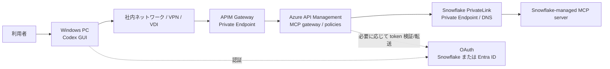

# Codex GUI から Azure API Management 経由で Snowflake MCP へ PrivateLink 接続する手順

作成日: 2026-06-19

## この資料の目的

この資料は、Windows の Codex GUI から Azure API Management、以下 APIM、を経由して Snowflake-managed MCP server にプライベート接続するための構成と手順を、初心者向けにまとめたものです。

この構成は、APIM で MCP tool 呼び出しの回数、利用者別の制限、認証、監査、ログ、タイムアウトなどを制御したい場合に使います。

## 先に知っておくべき重要事項

APIM で制御できるのは、主に Codex から Snowflake MCP server へ向かう MCP tool 呼び出しです。

Codex GUI 自体が OpenAI / ChatGPT 側で使うモデル token の消費量は、通常 APIM を通りません。そのため、この構成で直接制御できるのは次の範囲です。

- MCP tool の呼び出し回数
- MCP tool の同時実行数
- MCP tool のタイムアウト
- MCP tool の応答サイズやストリーミングに関する制御
- APIM を通る LLM API を別途使う場合の LLM token 制限

APIM の `llm-token-limit` は OpenAI Responses API、Chat Completions API、Anthropic Messages API、Google Vertex AI API などの LLM API 向けです。Snowflake MCP tool 呼び出しそのものは LLM API ではないため、Snowflake MCP への呼び出しには通常 `rate-limit-by-key` や `quota-by-key` を使います。

## 再調査後の機能判定

この APIM 経由構成は、3資料の中で Codex から安定させやすい構成です。ただし、Codex から APIM へ subscription key を送るだけでは Snowflake MCP は認証されません。APIM から Snowflake へ送る `Authorization: Bearer ...` も必ず設計してください。

| 項目 | 判定 | 理由 |
|---|---|---|
| APIM で既存 MCP server を公開 | 動く前提でよい | APIM は既存の remote MCP server を Streamable HTTP で公開、管理できます |
| Codex の `url` に APIM の MCP Server URL を設定 | 動く前提でよい | Codex は Streamable HTTP MCP server の `url` 設定に対応しています |
| `env_http_headers` で APIM subscription key を送る | APIM入口認証として有効 | Codex 公式設定にある HTTP header 環境変数方式です |
| APIM subscription key だけで Snowflake に接続 | 不十分 | subscription key は APIM 入口用であり、Snowflake の OAuth / bearer token にはなりません |
| APIM が Snowflake bearer token を付与 | 動く可能性が高い | APIM Credential Manager または安全な Named Value / Key Vault で token を付与する設計にできます |
| Snowflake OAuth pass-through | 要検証 | Codex 直結OAuthと同じ client 情報問題が残るため、APIM側でURLやPRMの整合確認が必要です |

最小で機能させるなら、最初のPoCでは「Codex -> APIM は subscription key」「APIM -> Snowflake は Snowflake 用 bearer token を APIM が付与」という2段構成にしてください。その後、ユーザー別監査が必要になった段階で Snowflake OAuth pass-through または APIM Credential Manager の設計を深掘りします。

## 全体構成



## 推奨する考え方

初心者向けには、次の順で考えると迷いにくいです。

1. Snowflake 側には Snowflake-managed MCP server を作る。
2. APIM には「既存の MCP server を公開して管理する」機能で Snowflake MCP server を登録する。
3. Codex GUI は Snowflake ではなく APIM の MCP URL を `config.toml` に登録する。
4. APIM policy で呼び出し回数、認証、ログ、タイムアウトを制御する。
5. ユーザー単位の Snowflake 権限を維持したい場合は、OAuth token をエンドツーエンドで扱えるかを設計検証する。

## この構成の認証パターン

| パターン | 入口認証 | Snowflake 側認証 | 特徴 |
|---|---|---|---|
| A. Snowflake OAuth pass-through | Codex が Snowflake OAuth | APIM が Authorization header を転送 | ユーザー別Snowflake監査を維持しやすいが、OAuth discovery と URL 書き換えの検証が必要 |
| B. APIM入口を Entra ID OAuth | Codex が Entra ID OAuth | APIM が Snowflake 用 token を付与 | 企業標準の入口制御に向くが、APIM から Snowflake への token 管理設計が必要 |
| C. APIM subscription key | Codex が固定ヘッダーを送る | APIM が Snowflake 用 token を付与 | 構築は簡単だが、認証強度は OAuth より弱い。PrivateLink と組み合わせた内部利用向け |

本番では A または B を推奨します。早期検証では C で疎通を確認し、その後 OAuth に上げる進め方が現実的です。

## 1. Snowflake 側の MCP server を作る

入力する画面: Snowflake Snowsight の `Worksheets`

Snowflake 側の基本設定は `01_codex_private_snowflake_mcp.md` と同じです。ここでは APIM 経由でも使える最小例だけ載せます。

```sql
-- 管理者権限で作業するため、ACCOUNTADMIN ロールに切り替えます。
USE ROLE ACCOUNTADMIN;

-- APIM 経由で使う MCP 専用ロールを作成します。
CREATE ROLE IF NOT EXISTS MCP_APIM_ROLE;

-- MCP tool 実行時に使うウェアハウスの利用権限を付与します。
GRANT USAGE ON WAREHOUSE <WAREHOUSE_NAME> TO ROLE MCP_APIM_ROLE;

-- MCP server object を置くデータベースの利用権限を付与します。
GRANT USAGE ON DATABASE <DATABASE_NAME> TO ROLE MCP_APIM_ROLE;

-- MCP server object を置くスキーマの利用権限を付与します。
GRANT USAGE ON SCHEMA <DATABASE_NAME>.<SCHEMA_NAME> TO ROLE MCP_APIM_ROLE;

-- MCP server object を作成する権限を付与します。
GRANT CREATE MCP SERVER ON SCHEMA <DATABASE_NAME>.<SCHEMA_NAME> TO ROLE MCP_APIM_ROLE;

-- Cortex Search Service を MCP tool として使う場合の利用権限です。
GRANT USAGE ON CORTEX SEARCH SERVICE <DATABASE_NAME>.<SCHEMA_NAME>.<SEARCH_SERVICE_NAME> TO ROLE MCP_APIM_ROLE;
```

MCP server object を作ります。

```sql
-- MCP server を作成するロールに切り替えます。
USE ROLE MCP_APIM_ROLE;

-- MCP server object を作るデータベースを選択します。
USE DATABASE <DATABASE_NAME>;

-- MCP server object を作るスキーマを選択します。
USE SCHEMA <SCHEMA_NAME>;

-- APIM から呼び出す Snowflake-managed MCP server を作成します。
CREATE OR REPLACE MCP SERVER APIM_PRIVATE_MCP
  -- ここから MCP tool 定義を YAML で記述します。
  FROM SPECIFICATION $$
    # 公開する tool の一覧です。
    tools:
      # APIM と Codex に表示される tool のタイトルです。
      - title: "Search internal documents"
        # Codex が tool を呼ぶための一意な名前です。
        name: "search_internal_documents"
        # tool の用途を説明します。
        description: "Search approved internal documents through a Snowflake Cortex Search Service."
        # Cortex Search Service を呼び出す tool 種別です。
        type: "CORTEX_SEARCH_SERVICE_QUERY"
        # 対象の Cortex Search Service の完全修飾名です。
        identifier: "<DATABASE_NAME>.<SCHEMA_NAME>.<SEARCH_SERVICE_NAME>"
  $$;
```

Snowflake MCP server URL の形式です。

```text
https://<snowflake_private_account_url>/api/v2/databases/<database>/schemas/<schema>/mcp-servers/APIM_PRIVATE_MCP
```

## 2. APIM のネットワークを PrivateLink 対応にする

入力する画面: Azure Portal

### 2.1 APIM の inbound private endpoint を作る

Azure Portal で操作します。

1. Azure Portal を開きます。
2. `API Management services` を開きます。
3. 対象の APIM インスタンスを選択します。
4. 左メニューの `Network` を開きます。
5. `Inbound private endpoint connections` を選びます。
6. `+ Add endpoint` を押します。
7. `Target sub-resource` は `Gateway` を選びます。
8. Codex 実行PCから到達できる VNet と Subnet を選びます。
9. Private DNS integration は有効にします。
10. 作成後、Connection state が `Approved` であることを確認します。

### 2.2 APIM から Snowflake PrivateLink へ出られるようにする

入力する画面: Azure Portal

APIM から Snowflake PrivateLink URL を呼び出すには、APIM の outbound 側も Snowflake PrivateLink に到達できる必要があります。

確認すること:

- APIM が Snowflake PrivateLink のある VNet または名前解決可能なネットワークに接続されていること。
- APIM から Snowflake account URL と OCSP URL が PrivateLink 側の IP に解決できること。
- APIM の SKU が、必要な inbound private endpoint と outbound VNet 統合をサポートしていること。

Azure Portal では、対象 APIM の `Network` 画面で `Outbound virtual network integration` または同等のネットワーク設定を確認します。

## 3. APIM に Snowflake MCP server を登録する

入力する画面: Azure Portal の APIM インスタンス

1. Azure Portal を開きます。
2. `API Management services` を開きます。
3. 対象 APIM インスタンスを選択します。
4. 左メニューの `APIs` を開きます。
5. `MCP servers` を開きます。
6. `+ Create MCP server` を押します。
7. `Expose an existing MCP server` を選びます。
8. `Backend MCP server base URL` に Snowflake MCP server URL を入力します。
9. `Transport type` は `Streamable HTTP` を選びます。
10. `Name` に `snowflake-private-mcp` などを入力します。
11. `Base path` に `snowflake-private` などを入力します。
12. 必要に応じて `Product` を関連付けます。
13. `Create` を押します。
14. 作成後、APIM の画面に表示される `Server URL` を控えます。

Codex の `config.toml` に登録するのは Snowflake URL ではなく、APIM が表示する `Server URL` です。

## 4. APIM policy で呼び出し制限を設定する

入力する画面: Azure Portal -> APIM -> `APIs` -> `MCP servers` -> 対象 MCP server -> `Policies`

次の例は、IP アドレスごとに 30 秒あたり 5 回まで MCP tool 呼び出しを許可する基本 policy です。MCP のストリーミングや長時間接続を壊さないため、レスポンス本文を policy 内で読み取らないでください。

```xml
<!-- APIM policy 全体の入れ物です。 -->
<policies>
  <!-- クライアントから APIM に入ってきた直後に実行する処理です。 -->
  <inbound>
    <!-- 既存の上位スコープ policy を継承します。 -->
    <base />

    <!-- 呼び出し元IPごとに 30 秒あたり 5 回までに制限します。 -->
    <rate-limit-by-key calls="5" renewal-period="30" counter-key="@(context.Request.IpAddress)" remaining-calls-variable-name="remainingCallsPerIP" />

    <!-- APIM からバックエンドへ送るリクエストに識別用ヘッダーを追加します。 -->
    <set-header name="x-apim-gateway" exists-action="override">
      <!-- このリクエストが APIM 経由であることを示す値です。 -->
      <value>snowflake-mcp-private</value>
    </set-header>
  </inbound>

  <!-- APIM から Snowflake MCP server へ転送する処理です。 -->
  <backend>
    <!-- 既存のバックエンド設定を継承します。 -->
    <base />
  </backend>

  <!-- Snowflake から APIM に戻ってきた直後に実行する処理です。 -->
  <outbound>
    <!-- 既存の上位スコープ policy を継承します。 -->
    <base />
  </outbound>

  <!-- エラー発生時に実行する処理です。 -->
  <on-error>
    <!-- 既存のエラー処理を継承します。 -->
    <base />
  </on-error>
</policies>
```

## 5. Entra ID OAuth で APIM 入口を保護する場合

入力する画面: Azure Portal -> Microsoft Entra ID -> App registrations

この方式では、Codex GUI は APIM を保護する Entra ID OAuth にサインインし、APIM が token を検証します。Snowflake 側の OAuth とは別物です。

### 5.1 Entra ID にアプリ登録を作る

1. Azure Portal を開きます。
2. `Microsoft Entra ID` を開きます。
3. `App registrations` を開きます。
4. `New registration` を押します。
5. Name に `codex-snowflake-mcp-apim` などを入力します。
6. Supported account types は社内方針に合わせて選びます。
7. Redirect URI は Codex の `config.toml` で固定する OAuth callback URL、例 `http://localhost:4321/callback`、を入れます。
8. 登録後、`Application (client) ID` と `Directory (tenant) ID` を控えます。

### 5.2 APIM policy で token を検証する

入力する画面: Azure Portal -> APIM -> `Policies`

```xml
<!-- APIM policy 全体の入れ物です。 -->
<policies>
  <!-- クライアントから APIM に入ってきた直後に実行する処理です。 -->
  <inbound>
    <!-- 既存の上位スコープ policy を継承します。 -->
    <base />

    <!-- Authorization ヘッダーに入った Microsoft Entra ID token を検証します。 -->
    <validate-azure-ad-token tenant-id="<TENANT_ID>" header-name="Authorization" failed-validation-httpcode="401" failed-validation-error-message="Unauthorized. Access token is missing or invalid.">
      <!-- 許可する Codex 用アプリ登録の client ID を指定します。 -->
      <client-application-ids>
        <!-- Azure Portal の Application (client) ID を入れます。 -->
        <application-id><CLIENT_APPLICATION_ID></application-id>
      </client-application-ids>
    </validate-azure-ad-token>

    <!-- 認証済みリクエストにも接続元IPごとの呼び出し回数制限をかけます。 -->
    <rate-limit-by-key calls="30" renewal-period="60" counter-key="@(context.Request.IpAddress)" remaining-calls-variable-name="remainingCallsPerIP" />
  </inbound>

  <!-- APIM から Snowflake MCP server へ転送する処理です。 -->
  <backend>
    <!-- 既存のバックエンド設定を継承します。 -->
    <base />
  </backend>

  <!-- Snowflake から APIM に戻ってきた直後に実行する処理です。 -->
  <outbound>
    <!-- 既存の上位スコープ policy を継承します。 -->
    <base />
  </outbound>

  <!-- エラー発生時に実行する処理です。 -->
  <on-error>
    <!-- 既存のエラー処理を継承します。 -->
    <base />
  </on-error>
</policies>
```

## 6. APIM から Snowflake へ OAuth token を渡す考え方

Snowflake-managed MCP server は OAuth を推奨し、Snowflake OAuth の Client ID と Client Secret を使います。また、Snowflake-managed MCP server は Dynamic Client Registration をサポートしていません。

APIM 経由では、次のどちらかを選びます。

### 6.1 ユーザーの Snowflake OAuth token を転送する

この方式は、ユーザーごとの Snowflake 権限と監査を維持しやすいです。

必要なこと:

- Codex GUI が Snowflake OAuth を完了できること。
- APIM が `Authorization` ヘッダーを Snowflake に転送すること。
- Snowflake OAuth の protected resource metadata や redirect URI が、APIM 経由でも矛盾しないこと。

APIM policy の考え方:

```xml
<!-- クライアントから来た Authorization ヘッダーを Snowflake へ明示的に転送します。 -->
<set-header name="Authorization" exists-action="override">
  <!-- 受信した Authorization ヘッダーの値をそのまま使います。 -->
  <value>@(context.Request.Headers.GetValueOrDefault("Authorization"))</value>
</set-header>
```

### 6.2 APIM が Snowflake 用 token を付与する

この方式は、Codex 側の認証と Snowflake 側の認証を分離できます。ただし、サービスアカウント的な接続になると、Snowflake 上の監査が個人単位ではなくなる可能性があります。

必要なこと:

- APIM Credential Manager などで Snowflake 用 OAuth token を管理します。
- APIM policy で token を取得し、Snowflake への `Authorization` ヘッダーに設定します。
- Snowflake 側では APIM が使うユーザーまたはロールに最小権限を付与します。

APIM policy の考え方:

```xml
<!-- APIM Credential Manager から OAuth access token を取得します。 -->
<get-authorization-context provider-id="<PROVIDER_ID>" authorization-id="<AUTHORIZATION_ID>" context-variable-name="auth-context" identity-type="managed" ignore-error="false" />

<!-- 取得した access token を Snowflake へ送る Authorization ヘッダーに設定します。 -->
<set-header name="Authorization" exists-action="override">
  <!-- Bearer token 形式で Snowflake へ渡します。 -->
  <value>@("Bearer " + ((Authorization)context.Variables.GetValueOrDefault("auth-context"))?.AccessToken)</value>
</set-header>
```

### 6.3 最小PoC: APIM から Snowflake へ固定 bearer token を付ける

最初の疎通確認だけを目的にする場合は、Snowflake 用の短時間 token または PAT を Azure Key Vault に保存し、APIM の Named Value から参照して `Authorization` ヘッダーに設定する方法もあります。これは本番の理想形ではありませんが、「APIM から Snowflake へ認証付きで到達できるか」を切り分けるには分かりやすいです。

入力する画面: Azure Portal -> APIM -> `Named values`

1. Azure Key Vault に Snowflake 用 token を保存します。
2. APIM の `Named values` で Key Vault secret を参照する値を作ります。
3. 例として Named Value 名を `snowflake-mcp-bearer-token` にします。
4. 値は `Bearer <Snowflake用token>` の形にします。
5. APIM の MCP server policy に次の `set-header` を追加します。

```xml
<!-- APIM から Snowflake へ送る Authorization ヘッダーを設定します。 -->
<set-header name="Authorization" exists-action="override">
  <!-- Key Vault 連携の Named Value から Bearer token 全体を読み込みます。 -->
  <value>{{snowflake-mcp-bearer-token}}</value>
</set-header>
```

注意:

- `snowflake-mcp-bearer-token` の値を `config.toml` に書かないでください。token は APIM / Key Vault 側で保管します。
- この方式では Snowflake 側の監査上、APIM が使う token のユーザーまたはロールで実行されたように見えます。
- token の有効期限が切れると `401 Unauthorized` になります。PoC後は Credential Manager、OAuth refresh、または社内のtoken更新運用を設計してください。

## 7. Codex の config.toml に APIM MCP URL を設定する

入力する画面: Codex GUI の `Settings` -> `Configuration` -> `Open config.toml`

Codex GUI では CLI を使わず、GUI から `config.toml` を開いて MCP server を設定します。APIM が表示した MCP `Server URL` を、Snowflake URL ではなく Codex に登録します。

1. Codex GUI を開きます。
2. `Settings` を開きます。
3. `Configuration` を開きます。
4. `Open config.toml` を押します。
5. 開いた `config.toml` の末尾に、利用する認証方式に合わせて次のいずれかを追加します。
6. `config.toml` を保存します。
7. Codex GUI を完全に終了します。
8. Codex GUI を再起動します。

### 7.1 推奨: APIM subscription key を環境変数から送る

この方式は、APIM 側で subscription key、rate limit、quota、監査を扱う構成です。キーを `config.toml` に直接書かず、Windows の環境変数に入れるため、比較的安全に運用できます。

重要: この設定だけでは Snowflake 側の認証は完了しません。`APIM_SUBSCRIPTION_KEY` は Codex から APIM へ入るための鍵です。APIM から Snowflake MCP へ出ていくリクエストには、6.1、6.2、または6.3のいずれかの方法で Snowflake 用の `Authorization` ヘッダーを付けてください。これを忘れると、Codex から APIM までは届いても、Snowflake 側で `401 Unauthorized` になります。

Windows の環境変数設定画面:

1. Windows のスタートメニューで `環境変数` と検索します。
2. `環境変数を編集` を開きます。
3. ユーザー環境変数に `APIM_SUBSCRIPTION_KEY` を追加します。
4. 値に APIM の subscription key を入力します。
5. Codex GUI を完全に終了してから再起動します。

`config.toml` の設定例です。

```toml
# snowflake-apim-private という名前の MCP server 設定を追加します。
[mcp_servers.snowflake-apim-private]

# APIM が表示した MCP Server URL を指定します。
url = "https://<apim-name>.azure-api.net/<apim-mcp-path>/mcp"

# APIM_SUBSCRIPTION_KEY 環境変数の値を Ocp-Apim-Subscription-Key ヘッダーとして送ります。
env_http_headers = { "Ocp-Apim-Subscription-Key" = "APIM_SUBSCRIPTION_KEY" }

# MCP server への接続開始待ち時間を 20 秒にします。
startup_timeout_sec = 20

# MCP tool の実行待ち時間を 120 秒にします。
tool_timeout_sec = 120

# この MCP server を有効化します。
enabled = true

# APIM に接続できない場合でも Codex 自体は起動できるようにします。
required = false

# Snowflake tool を使う前に Codex が確認を出す既定動作にします。
default_tools_approval_mode = "prompt"

# Codex から使わせる tool を明示的に絞ります。
enabled_tools = ["search_internal_documents"]
```

### 7.2 検証用: APIM subscription key を config.toml に直接書く

この方式は設定が簡単ですが、`config.toml` に秘密情報が残ります。本番では 7.1 の環境変数方式を推奨します。

```toml
# snowflake-apim-private-test という名前の MCP server 設定を追加します。
[mcp_servers.snowflake-apim-private-test]

# APIM が表示した MCP Server URL を指定します。
url = "https://<apim-name>.azure-api.net/<apim-mcp-path>/mcp"

# APIM subscription key を固定ヘッダーとして送ります。
http_headers = { "Ocp-Apim-Subscription-Key" = "<APIM_SUBSCRIPTION_KEY>" }

# MCP tool の実行待ち時間を 120 秒にします。
tool_timeout_sec = 120

# この MCP server を有効化します。
enabled = true
```

### 7.3 APIM 入口を OAuth / Bearer token で保護する場合

APIM 側を Entra ID OAuth や独自の bearer token で保護する場合は、Codex から `Authorization: Bearer ...` を送ります。token は Windows の環境変数に入れます。

Windows の環境変数設定画面:

1. Windows のスタートメニューで `環境変数` と検索します。
2. `環境変数を編集` を開きます。
3. ユーザー環境変数に `APIM_MCP_BEARER_TOKEN` を追加します。
4. 値に APIM へ送る access token を入力します。
5. Codex GUI を完全に終了してから再起動します。

`config.toml` の設定例です。

```toml
# snowflake-apim-private-bearer という名前の MCP server 設定を追加します。
[mcp_servers.snowflake-apim-private-bearer]

# APIM が表示した MCP Server URL を指定します。
url = "https://<apim-name>.azure-api.net/<apim-mcp-path>/mcp"

# APIM_MCP_BEARER_TOKEN 環境変数の値を Authorization: Bearer として送ります。
bearer_token_env_var = "APIM_MCP_BEARER_TOKEN"

# MCP server への接続開始待ち時間を 20 秒にします。
startup_timeout_sec = 20

# MCP tool の実行待ち時間を 120 秒にします。
tool_timeout_sec = 120

# この MCP server を有効化します。
enabled = true

# Snowflake tool を使う前に Codex が確認を出す既定動作にします。
default_tools_approval_mode = "prompt"

# Codex から使わせる tool を明示的に絞ります。
enabled_tools = ["search_internal_documents"]
```

### 7.4 APIM 経由で Snowflake OAuth を pass-through する場合

APIM が `Authorization` ヘッダーを Snowflake へそのまま転送する設計では、Codex 側の OAuth callback URL も `config.toml` で固定します。

```toml
# MCP OAuth のコールバック受信ポートを 4321 に固定します。
mcp_oauth_callback_port = 4321

# OAuth redirect_uri を固定します。
mcp_oauth_callback_url = "http://localhost:4321/callback"

# snowflake-apim-private-oauth という名前の MCP server 設定を追加します。
[mcp_servers.snowflake-apim-private-oauth]

# APIM が表示した MCP Server URL を指定します。
url = "https://<apim-name>.azure-api.net/<apim-mcp-path>/mcp"

# Snowflake role を OAuth scope として明示したい場合に使います。
scopes = ["session:role:MCP_APIM_ROLE"]

# MCP tool の実行待ち時間を 120 秒にします。
tool_timeout_sec = 120

# この MCP server を有効化します。
enabled = true

# Snowflake tool を使う前に Codex が確認を出す既定動作にします。
default_tools_approval_mode = "prompt"
```

注意:

- 現行の公開Codex設定例では、MCP OAuth の `client_id` と `client_secret` を `config.toml` に直接書くキーは確認できません。
- Snowflake-managed MCP server は Dynamic Client Registration 非対応です。
- Codex GUI の初回接続時に OAuth の client 情報入力やサインインができない場合は、7.1 または 7.3 のように APIM 側へ認証制御を寄せる構成を優先してください。

## 8. APIM で token 使用量を制御したい場合の整理

### Snowflake MCP tool 呼び出し

Snowflake MCP tool 呼び出しには、通常このような制御を使います。

- `rate-limit-by-key`: 一定時間あたりの呼び出し回数を制限します。
- `quota-by-key`: 日次、月次などの総呼び出し量を制限します。
- `limit-concurrency`: 同時実行数を制限します。
- timeout 設定: 長すぎる tool 実行を止めます。
- Snowflake 側の `query_timeout`: custom tool の実行時間を制限します。

### OpenAI / Azure OpenAI などの LLM API

APIM 経由で LLM API も通す場合は、`llm-token-limit` で token per minute や月次 token quota を制御できます。

```xml
<!-- APIM policy 全体の入れ物です。 -->
<policies>
  <!-- LLM API に入ってきた直後に実行する処理です。 -->
  <inbound>
    <!-- 既存の上位スコープ policy を継承します。 -->
    <base />

    <!-- subscription ID ごとに 1 分あたり 5000 token までに制限します。 -->
    <llm-token-limit counter-key="@(context.Subscription.Id)" tokens-per-minute="5000" estimate-prompt-tokens="false" remaining-tokens-variable-name="remainingTokens" />
  </inbound>

  <!-- バックエンド LLM API へ転送する処理です。 -->
  <backend>
    <!-- 既存のバックエンド設定を継承します。 -->
    <base />
  </backend>

  <!-- LLM API からの応答後に実行する処理です。 -->
  <outbound>
    <!-- 既存の上位スコープ policy を継承します。 -->
    <base />
  </outbound>

  <!-- エラー発生時に実行する処理です。 -->
  <on-error>
    <!-- 既存のエラー処理を継承します。 -->
    <base />
  </on-error>
</policies>
```

Codex GUI のモデル通信そのものは、通常この APIM を通らないため、この `llm-token-limit` で Codex GUI の ChatGPT 利用 token を直接制御できるとは考えないでください。

## 9. 動作確認

入力する画面: Codex GUI のチャット画面

```text
APIM 経由の Snowflake MCP tool を使って、社内文書から「月次レポート」に関する情報を検索してください。更新系の操作はしないでください。
```

確認すること:

- Codex が APIM の MCP URL から tool 一覧を取得できること。
- APIM のメトリックでリクエストが記録されること。
- APIM の rate limit が効くこと。
- Snowflake 側で対象ロールの範囲内だけが返ること。

## トラブルシューティング

| 症状 | 原因候補 | 確認場所 |
|---|---|---|
| Codex から APIM に接続できない | APIM private endpoint の DNS が解決できない | Windows PC、社内DNS、APIM private DNS |
| APIM から Snowflake に接続できない | APIM outbound が Snowflake PrivateLink に到達できない | APIM Network、VNet、Private DNS |
| MCP streaming が壊れる | policy が response body を読んで buffering している | APIM Policies、Diagnostic settings |
| 401 Unauthorized | Authorization header が Snowflake へ転送されていない | APIM Policies |
| 429 Too Many Requests | APIM の rate limit に達した | APIM Metrics、Policies |
| token 制限が効かない | Snowflake MCP 呼び出しに LLM token policy を使っている | APIM policy 種別 |

## 参考資料

- Microsoft: [Expose and govern an existing MCP server](https://learn.microsoft.com/en-us/azure/api-management/expose-existing-mcp-server)
- Microsoft: [Secure access to MCP servers in API Management](https://learn.microsoft.com/en-us/azure/api-management/secure-mcp-servers)
- Microsoft: [Connect privately to API Management by using an inbound private endpoint](https://learn.microsoft.com/en-us/azure/api-management/private-endpoint)
- Microsoft: [Configure API for server-sent events in Azure API Management](https://learn.microsoft.com/en-us/azure/api-management/how-to-server-sent-events)
- Microsoft: [AI gateway in Azure API Management](https://learn.microsoft.com/en-us/azure/api-management/genai-gateway-capabilities)
- Microsoft: [llm-token-limit policy](https://learn.microsoft.com/en-us/azure/api-management/llm-token-limit-policy)
- Snowflake: [Snowflake-managed MCP server](https://docs.snowflake.com/en/user-guide/snowflake-cortex/cortex-agents-mcp)
- OpenAI: [Codex MCP](https://developers.openai.com/codex/mcp)
