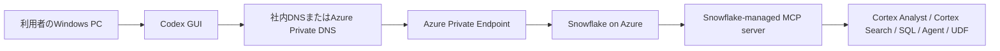
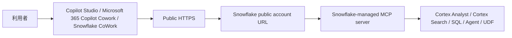
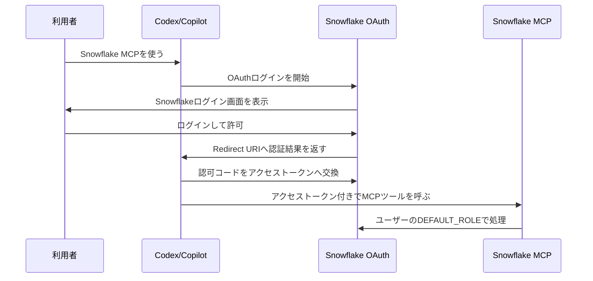
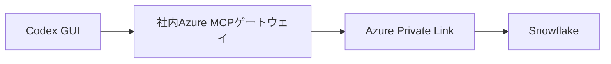

# Snowflake MCPサーバー構築とクライアント接続手順

作成日: 2026-06-19  
対象: Windows PCで、Codex GUIとCopilot/Cowork系クライアントからSnowflakeへMCP接続する担当者  
前提: SnowflakeはAzure上に構築済みで、Azure Private Link接続も利用可能な状態

## 1. 先に結論

今回の構成では、まず **Snowflake-managed MCP server** を第一候補にします。

理由は、Snowflake公式が現在提供しているMCPサーバーであり、別途VMやコンテナにMCPサーバーを自作して運用しなくても、Snowflake内のCortex Analyst、Cortex Search、Cortex Agent、SQL実行、UDF、ストアドプロシージャをMCPツールとして公開できるためです。

ただし、Codex GUIからSnowflake-managed MCP serverへ **OAuth直結** する場合は注意が必要です。Snowflake-managed MCP serverはOAuthを使いますが、Snowflake公式ドキュメントでは **Dynamic Client Registrationは未対応** とされています。一方、Codex公式ドキュメントでは、MCP OAuthに対して静的な `client_id` と `client_secret` を `config.toml` に書く方法が明示されていません。そのため、Codex GUIの「Integrations & MCP」画面にOAuthのClient ID/Secret入力欄があるかを、実機で必ず確認してください。

実装時の判断は次の通りです。

| パターン | 推奨度 | 内容 |
| --- | --- | --- |
| Snowflake-managed MCP server + Codex GUIでClient ID/Secretを入力できる | 高 | 最もシンプル。Snowflake公式MCPをPrivateLink URLでCodexへ登録する |
| Snowflake-managed MCP server + ChatGPT/Copilot Studio/Copilot Cowork | 高 | Public接続側。OAuth Client ID/Secretを入力できるクライアントなら構成しやすい |
| Codex GUIにClient ID/Secret入力欄がない | 中 | 直結ではなく、社内Azure上にMCPゲートウェイを用意するか、PAT/Bearer方式をSnowflake側で検証する |
| 旧Snowflake-LabsのMCPサーバーを使う | 低 | Snowflake-Labs/mcpは非推奨。新規採用しない |

## 2. 重要な用語

| 用語 | 初心者向け説明 |
| --- | --- |
| MCP | AIクライアントが外部ツールやデータに安全に接続するための共通プロトコル |
| MCPサーバー | Snowflakeのデータ検索、SQL実行、Cortex AnalystなどをAIから呼び出せるようにする入口 |
| MCPクライアント | Codex、Copilot Studio、Copilot Cowork、ChatGPT、Cursorなど、MCPサーバーへ接続する側 |
| Snowflake-managed MCP server | SnowflakeがSnowflake内に用意している公式MCPサーバー機能 |
| PrivateLink | Windows PCまたは社内ネットワークからSnowflakeへ、インターネットではなくAzureの私設経路で接続する仕組み |
| OAuth | ユーザーがSnowflakeにログインして、AIクライアントに限定的なアクセスを許可する認証方式 |
| Client ID / Client Secret | OAuthで「このAIクライアントは登録済みです」とSnowflakeへ示すためのIDと秘密情報 |
| Redirect URI | OAuthログイン完了後に、Snowflakeが認証結果を返す戻り先URL |
| DEFAULT_ROLE | OAuthでSnowflakeへ接続したときに使われるSnowflakeロール |
| DEFAULT_WAREHOUSE | OAuthセッション開始時に使うSnowflakeウェアハウス |

## 3. 全体構成

### 3.1 Private接続: Codex GUIからSnowflakeへ接続



ポイント:

- Codex GUIはユーザーのWindows PC上で動きます。
- そのWindows PCからSnowflakeのPrivateLink用ホスト名を名前解決できる必要があります。
- MCPサーバーURLの `<account_url>` には、Public URLではなくPrivateLink用URLを使います。
- OAuthログイン画面も、Windows PCの通常ブラウザから開ける必要があります。

### 3.2 Public接続: Copilot/Cowork系クライアントからSnowflakeへ接続



ポイント:

- Public接続では、クライアントサービス側のクラウド基盤からSnowflakeへアクセスします。
- Snowflakeのネットワークポリシーを使っている場合、ユーザーのPCのIPではなく、クライアント提供元の送信元IPを許可する必要があります。
- Copilot StudioはMCPの **Streamable transport** をサポートし、SSEは2025年8月以降サポート対象外です。
- OAuthは通常、Copilot側の画面で `Client ID`、`Client secret`、`Authorization URL`、`Token URL`、`Refresh URL`、`Scopes` を入力します。

## 4. 採用するSnowflake側方式

Snowflake公式の現在の推奨は、Snowflake-managed MCP serverです。

Snowflake-managed MCP serverで公開できる代表的なツールは次の通りです。

| ツール種別 | できること |
| --- | --- |
| `CORTEX_ANALYST_MESSAGE` | Semantic Viewを使って自然言語からSQL分析する |
| `CORTEX_SEARCH_SERVICE_QUERY` | Cortex Searchで非構造化データを検索する |
| `SYSTEM_EXECUTE_SQL` | Snowflake上でSQLを実行する |
| `CORTEX_AGENT_RUN` | Cortex AgentをMCPツールとして呼び出す |
| `GENERIC` | UDFまたはストアドプロシージャをMCPツールとして呼び出す |

重要:

- 旧 `Snowflake-Labs/mcp` リポジトリは非推奨です。新規構築では使わないでください。
- `SYSTEM_EXECUTE_SQL` を使う場合は、最初は `read_only: true` から始めるのが安全です。
- MCPサーバーへ接続できても、裏側のCortex Search、Semantic View、Agent、UDFなどへの権限が別途必要です。

## 5. 作業前に集める情報

実際の設定前に、次の情報を社内管理者またはSnowflake管理者から受け取ってください。

| 情報 | 例 | 誰に確認するか |
| --- | --- | --- |
| Snowflake組織名 | `myorg` | Snowflake管理者 |
| Snowflakeアカウント名 | `prod_account` | Snowflake管理者 |
| Public account URL | `https://myorg-prod-account.azure.snowflakecomputing.com` | Snowflake管理者 |
| PrivateLink account URL | `https://myorg-prod-account.privatelink.snowflakecomputing.com` | Snowflake管理者またはAzure管理者 |
| MCPサーバーを作るDB | `MCP_DB` | Snowflake管理者 |
| MCPサーバーを作るSchema | `MCP_SCHEMA` | Snowflake管理者 |
| MCPサーバー名 | `COMPANY_MCP_SERVER` | 設計者 |
| MCP利用ロール | `MCP_ACCESS_ROLE` | Snowflake管理者 |
| Warehouse | `MCP_WH` | Snowflake管理者 |
| OAuth Redirect URI | Codex/Copilot画面に表示されるURL | MCPクライアント画面 |
| OAuth Client ID/Secret | Snowflakeから取得 | Snowflake管理者 |

## 6. PrivateLink疎通確認

このPCでは実設定しません。実装先Windows PCで確認してください。

### 6.1 DNS確認

入力する場所: 実装先Windows PCの **Windows PowerShell**

```powershell
# PrivateLink用Snowflakeホスト名が、社内DNSまたはAzure Private DNSで名前解決できるか確認します。
nslookup <privatelink_account_host>

# PrivateLink用Snowflakeホスト名の443番ポートへTCP接続できるか確認します。
Test-NetConnection <privatelink_account_host> -Port 443
```

行ごとの説明:

| 行 | 説明 |
| --- | --- |
| `nslookup <privatelink_account_host>` | PrivateLink用ホスト名がIPアドレスへ変換できるか確認します |
| `Test-NetConnection <privatelink_account_host> -Port 443` | HTTPS通信に必要な443番ポートへ接続できるか確認します |

補足:

- `<privatelink_account_host>` は `https://` を除いたホスト名です。
- 例: `myorg-prod-account.privatelink.snowflakecomputing.com`
- `nslookup` の結果がPublic IPを返す場合、PrivateLink DNSの設定が意図通りではない可能性があります。

## 7. Snowflake側のMCPサーバー作成

入力する場所: **Snowsight > SQL Worksheets**

実行ロール: 原則 `ACCOUNTADMIN` または必要権限を持つ管理ロール

### 7.1 作業DB、Schema、Warehouseを選択

```sql
-- MCPサーバー作成に必要な管理権限を持つロールへ切り替えます。
USE ROLE ACCOUNTADMIN;

-- MCPサーバーを作成するデータベースを選択します。
USE DATABASE <MCP_DB>;

-- MCPサーバーを作成するスキーマを選択します。
USE SCHEMA <MCP_SCHEMA>;

-- MCPツール実行時に使うウェアハウスを選択します。
USE WAREHOUSE <MCP_WH>;
```

行ごとの説明:

| 行 | 説明 |
| --- | --- |
| `USE ROLE ACCOUNTADMIN;` | 管理作業用のSnowflakeロールに切り替えます |
| `USE DATABASE <MCP_DB>;` | MCPサーバーを置くデータベースを選択します |
| `USE SCHEMA <MCP_SCHEMA>;` | MCPサーバーを置くスキーマを選択します |
| `USE WAREHOUSE <MCP_WH>;` | SQLや一部ツール実行時に使うウェアハウスを選択します |

### 7.2 MCPサーバーを作成

最初は安全のため、Cortex Analyst、Cortex Search、読み取り専用SQLから始めるのがおすすめです。

入力する場所: **Snowsight > SQL Worksheets**

```sql
-- 指定した名前でSnowflake-managed MCP serverを作成または置き換えます。
CREATE OR REPLACE MCP SERVER <MCP_SERVER_NAME>
-- ここからMCPツール定義をYAML形式で書きます。
FROM SPECIFICATION $$
-- MCPクライアントに公開するツールの一覧です。
tools:
  -- Cortex Analyst用のツール定義です。
  - name: "business_analyst"
    -- 自然言語から分析SQLを生成するCortex Analystツールです。
    type: "CORTEX_ANALYST_MESSAGE"
    -- 利用するSemantic Viewの完全修飾名です。
    identifier: "<DATABASE>.<SCHEMA>.<SEMANTIC_VIEW>"
    -- AIクライアントがツール選択時に読む説明です。
    description: "Business metrics analysis using the approved semantic view."
    -- 画面に表示される短い名前です。
    title: "Business Analyst"

  -- Cortex Search用のツール定義です。
  - name: "document_search"
    -- 非構造化データを検索するCortex Searchツールです。
    type: "CORTEX_SEARCH_SERVICE_QUERY"
    -- 利用するCortex Search Serviceの完全修飾名です。
    identifier: "<DATABASE>.<SCHEMA>.<CORTEX_SEARCH_SERVICE>"
    -- AIクライアントがツール選択時に読む説明です。
    description: "Search approved internal documents indexed by Cortex Search."
    -- 画面に表示される短い名前です。
    title: "Document Search"

  -- SQL実行用のツール定義です。
  - name: "read_only_sql"
    -- SQLを実行するSnowflake管理ツールです。
    type: "SYSTEM_EXECUTE_SQL"
    -- AIクライアントがツール選択時に読む説明です。
    description: "Run read-only SQL queries against approved Snowflake objects."
    -- 画面に表示される短い名前です。
    title: "Read Only SQL"
    -- SQLツールの詳細設定です。
    config:
      -- trueにするとSELECTなどの読み取り系SQLだけを許可します。
      read_only: true
      -- SQL実行の最大待ち時間を秒で指定します。
      query_timeout: 120
      -- SQL実行に使うウェアハウスを指定します。
      warehouse: "<MCP_WH>"
-- YAML定義を終了します。
$$;
```

置き換える値:

| 置換文字 | 入れる値 |
| --- | --- |
| `<MCP_SERVER_NAME>` | 作成するMCPサーバー名 |
| `<DATABASE>.<SCHEMA>.<SEMANTIC_VIEW>` | Cortex Analystで使うSemantic View |
| `<DATABASE>.<SCHEMA>.<CORTEX_SEARCH_SERVICE>` | Cortex Search Service |
| `<MCP_WH>` | MCP実行用Warehouse |

注意:

- Snowflake-managed MCP serverのCortex Analystツールは、Semantic Viewを使います。
- Semantic ModelではなくSemantic Viewを使う点に注意してください。
- SQL実行ツールを有効化する場合、初期構築では `read_only: true` にしてください。

### 7.3 MCPサーバーの存在確認

入力する場所: **Snowsight > SQL Worksheets**

```sql
-- 現在のアカウントで見えるMCPサーバー一覧を表示します。
SHOW MCP SERVERS IN ACCOUNT;

-- 作成したMCPサーバーの詳細とツール定義を表示します。
DESCRIBE MCP SERVER <MCP_SERVER_NAME>;
```

行ごとの説明:

| 行 | 説明 |
| --- | --- |
| `SHOW MCP SERVERS IN ACCOUNT;` | 権限のあるMCPサーバー一覧を表示します |
| `DESCRIBE MCP SERVER <MCP_SERVER_NAME>;` | 作成したMCPサーバーの詳細設定を確認します |

## 8. Snowflake側の権限設定

Snowflakeでは、MCPサーバーへの接続権限と、MCPツールの裏側にあるオブジェクト権限は別です。

入力する場所: **Snowsight > SQL Worksheets**

```sql
-- MCP利用者向けのロールを作成します。
CREATE ROLE IF NOT EXISTS MCP_ACCESS_ROLE;

-- MCPサーバーが置かれているデータベースを使えるようにします。
GRANT USAGE ON DATABASE <MCP_DB> TO ROLE MCP_ACCESS_ROLE;

-- MCPサーバーが置かれているスキーマを使えるようにします。
GRANT USAGE ON SCHEMA <MCP_DB>.<MCP_SCHEMA> TO ROLE MCP_ACCESS_ROLE;

-- MCPサーバーに接続してツール一覧を取得できるようにします。
GRANT USAGE ON MCP SERVER <MCP_DB>.<MCP_SCHEMA>.<MCP_SERVER_NAME> TO ROLE MCP_ACCESS_ROLE;

-- MCPツール実行に使うウェアハウスを使えるようにします。
GRANT USAGE ON WAREHOUSE <MCP_WH> TO ROLE MCP_ACCESS_ROLE;

-- Cortex Search ServiceをMCPツールから呼び出せるようにします。
GRANT USAGE ON CORTEX SEARCH SERVICE <DATABASE>.<SCHEMA>.<CORTEX_SEARCH_SERVICE> TO ROLE MCP_ACCESS_ROLE;

-- Semantic ViewをCortex Analystツールから参照できるようにします。
GRANT SELECT ON SEMANTIC VIEW <DATABASE>.<SCHEMA>.<SEMANTIC_VIEW> TO ROLE MCP_ACCESS_ROLE;
```

行ごとの説明:

| 行 | 説明 |
| --- | --- |
| `CREATE ROLE IF NOT EXISTS MCP_ACCESS_ROLE;` | MCP用の最小権限ロールを作成します |
| `GRANT USAGE ON DATABASE ...` | 対象データベースを参照可能にします |
| `GRANT USAGE ON SCHEMA ...` | 対象スキーマを参照可能にします |
| `GRANT USAGE ON MCP SERVER ...` | MCPサーバー自体へ接続可能にします |
| `GRANT USAGE ON WAREHOUSE ...` | ツール実行用Warehouseを利用可能にします |
| `GRANT USAGE ON CORTEX SEARCH SERVICE ...` | Cortex Searchツールを実行可能にします |
| `GRANT SELECT ON SEMANTIC VIEW ...` | Cortex AnalystツールがSemantic Viewを使えるようにします |

UDFやストアドプロシージャを `GENERIC` ツールとして公開する場合は、追加で次のような権限が必要です。

```sql
-- UDFをMCPツールから呼び出せるようにします。
GRANT USAGE ON FUNCTION <DATABASE>.<SCHEMA>.<FUNCTION_NAME>(<ARG_TYPE>) TO ROLE MCP_ACCESS_ROLE;

-- ストアドプロシージャをMCPツールから呼び出せるようにします。
GRANT USAGE ON PROCEDURE <DATABASE>.<SCHEMA>.<PROCEDURE_NAME>(<ARG_TYPE>) TO ROLE MCP_ACCESS_ROLE;
```

行ごとの説明:

| 行 | 説明 |
| --- | --- |
| `GRANT USAGE ON FUNCTION ...` | 指定したUDFをMCPから呼び出せるようにします |
| `GRANT USAGE ON PROCEDURE ...` | 指定したストアドプロシージャをMCPから呼び出せるようにします |

## 9. OAuth設定の考え方

### 9.1 OAuthの流れ



初心者向けに言うと、OAuthは「AIクライアントにSnowflakeのパスワードを渡さず、Snowflakeのログイン画面で許可する方式」です。

### 9.2 Snowflake OAuthで重要な点

- Snowflake-managed MCP serverはOAuth 2.0をサポートします。
- Snowflake-managed MCP serverはDynamic Client Registrationに対応していません。
- そのため、Snowflakeで事前にOAuth Security Integrationを作り、Client IDとClient Secretを発行します。
- ユーザーごとの権限は、Snowflakeログインユーザーの `DEFAULT_ROLE` と `DEFAULT_WAREHOUSE` が重要です。
- 二次ロールはSnowflake-managed MCP serverのOAuthセッションでは基本的に使えません。

## 10. OAuth Security Integration作成

### 10.1 Private接続のCodex用

入力する場所: **Snowsight > SQL Worksheets**

前提:

- Codex GUI側でOAuth Client ID/Secretを入力できる場合のみ、この直結方式を使います。
- Codex GUIにClient ID/Secret入力欄がない場合は、14章の代替構成を検討してください。
- Redirect URIは、Codex GUIが表示する値を最優先で使います。
- Codex側で固定コールバックを使う場合の例は `http://localhost:5555/callback` です。

```sql
-- OAuth連携を作成できる管理ロールへ切り替えます。
USE ROLE ACCOUNTADMIN;

-- Codex用のSnowflake OAuth Security Integrationを作成します。
CREATE OR REPLACE SECURITY INTEGRATION CODEX_MCP_OAUTH
  -- Snowflake内蔵OAuthを使うことを指定します。
  TYPE = OAUTH
  -- 独自MCPクライアント用のOAuth設定であることを指定します。
  OAUTH_CLIENT = CUSTOM
  -- このOAuth連携を有効化します。
  ENABLED = TRUE
  -- Client Secretを持つ機密クライアントとして登録します。
  OAUTH_CLIENT_TYPE = 'CONFIDENTIAL'
  -- OAuthログイン完了後にCodexへ戻るURLを指定します。
  OAUTH_REDIRECT_URI = 'http://localhost:5555/callback'
  -- localhostのHTTP Redirect URIを許可します。社内セキュリティ方針に合わせて判断してください。
  OAUTH_ALLOW_NON_TLS_REDIRECT_URI = TRUE
  -- リフレッシュトークンの発行を許可します。
  OAUTH_ISSUE_REFRESH_TOKENS = TRUE
  -- リフレッシュトークンの有効期間を秒で指定します。7776000秒は90日です。
  OAUTH_REFRESH_TOKEN_VALIDITY = 7776000
  -- OAuthで利用できるロールをMCP用ロールに限定します。
  ALLOWED_ROLES_LIST = ('MCP_ACCESS_ROLE')
  -- PrivateLink用の認可エンドポイントを使う設定です。
  USE_PRIVATELINK_FOR_AUTHORIZATION_ENDPOINT = TRUE;
```

行ごとの説明:

| 行 | 説明 |
| --- | --- |
| `USE ROLE ACCOUNTADMIN;` | OAuth連携を作成できる管理ロールに切り替えます |
| `CREATE OR REPLACE SECURITY INTEGRATION CODEX_MCP_OAUTH` | Codex用のOAuth連携を作成または更新します |
| `TYPE = OAUTH` | Snowflake OAuthを使うことを指定します |
| `OAUTH_CLIENT = CUSTOM` | Codexのようなカスタムクライアント向けにします |
| `ENABLED = TRUE` | 作成直後から使える状態にします |
| `OAUTH_CLIENT_TYPE = 'CONFIDENTIAL'` | Client Secretを使うクライアントとして登録します |
| `OAUTH_REDIRECT_URI = ...` | OAuth完了後に戻るCodex側URLを指定します |
| `OAUTH_ALLOW_NON_TLS_REDIRECT_URI = TRUE` | localhostのHTTP戻り先を許可します |
| `OAUTH_ISSUE_REFRESH_TOKENS = TRUE` | 再ログイン頻度を下げるためリフレッシュトークンを発行します |
| `OAUTH_REFRESH_TOKEN_VALIDITY = 7776000` | リフレッシュトークンを90日有効にします |
| `ALLOWED_ROLES_LIST = ('MCP_ACCESS_ROLE')` | OAuthで使えるロールをMCP用ロールに限定します |
| `USE_PRIVATELINK_FOR_AUTHORIZATION_ENDPOINT = TRUE;` | OAuth認可もPrivateLink側URLで行うようにします |

### 10.2 Public接続のCopilot/Cowork用

入力する場所: **Snowsight > SQL Worksheets**

Copilot StudioやMicrosoft 365 Copilot Coworkの場合、画面の途中でCallback URLが表示されます。最初は仮のHTTPS Redirect URIで作成し、Copilot側で表示されたCallback URLに後で差し替える流れが安全です。

```sql
-- OAuth連携を作成できる管理ロールへ切り替えます。
USE ROLE ACCOUNTADMIN;

-- Copilot/Cowork用のSnowflake OAuth Security Integrationを作成します。
CREATE OR REPLACE SECURITY INTEGRATION COPILOT_MCP_OAUTH
  -- Snowflake内蔵OAuthを使うことを指定します。
  TYPE = OAUTH
  -- 独自MCPクライアント用のOAuth設定であることを指定します。
  OAUTH_CLIENT = CUSTOM
  -- このOAuth連携を有効化します。
  ENABLED = TRUE
  -- Client Secretを持つ機密クライアントとして登録します。
  OAUTH_CLIENT_TYPE = 'CONFIDENTIAL'
  -- 最初は仮のHTTPS Redirect URIを入れます。後でCopilot画面のCallback URLに変更します。
  OAUTH_REDIRECT_URI = 'https://placeholder.example.com/oauth/callback'
  -- リフレッシュトークンの発行を許可します。
  OAUTH_ISSUE_REFRESH_TOKENS = TRUE
  -- リフレッシュトークンの有効期間を秒で指定します。7776000秒は90日です。
  OAUTH_REFRESH_TOKEN_VALIDITY = 7776000
  -- OAuthで利用できるロールをMCP用ロールに限定します。
  ALLOWED_ROLES_LIST = ('MCP_ACCESS_ROLE');
```

Copilot/Cowork画面でCallback URLが表示された後に実行します。

```sql
-- Copilot/Cowork画面に表示されたCallback URLへRedirect URIを更新します。
ALTER SECURITY INTEGRATION COPILOT_MCP_OAUTH
  -- OAuth完了後にCopilot/Coworkへ戻る正式なURLを設定します。
  SET OAUTH_REDIRECT_URI = '<COPILOT_CALLBACK_URL>';
```

行ごとの説明:

| 行 | 説明 |
| --- | --- |
| `CREATE OR REPLACE SECURITY INTEGRATION COPILOT_MCP_OAUTH` | Copilot/Cowork用のOAuth連携を作ります |
| `OAUTH_REDIRECT_URI = 'https://placeholder.example.com/oauth/callback'` | 初回作成のための仮URLです |
| `ALTER SECURITY INTEGRATION COPILOT_MCP_OAUTH` | 既存のOAuth連携を変更します |
| `SET OAUTH_REDIRECT_URI = '<COPILOT_CALLBACK_URL>';` | Copilot/Coworkが表示した正式な戻り先URLへ変更します |

## 11. OAuth Client ID / Secretの取得

入力する場所: **Snowsight > SQL Worksheets**

### 11.1 Codex用

```sql
-- CODEX_MCP_OAUTHのClient IDとClient SecretをJSON形式で表示します。
SELECT SYSTEM$SHOW_OAUTH_CLIENT_SECRETS('CODEX_MCP_OAUTH');
```

### 11.2 Copilot/Cowork用

```sql
-- COPILOT_MCP_OAUTHのClient IDとClient SecretをJSON形式で表示します。
SELECT SYSTEM$SHOW_OAUTH_CLIENT_SECRETS('COPILOT_MCP_OAUTH');
```

行ごとの説明:

| 行 | 説明 |
| --- | --- |
| `SELECT SYSTEM$SHOW_OAUTH_CLIENT_SECRETS('CODEX_MCP_OAUTH');` | Codex用のClient ID/Secretを取得します |
| `SELECT SYSTEM$SHOW_OAUTH_CLIENT_SECRETS('COPILOT_MCP_OAUTH');` | Copilot/Cowork用のClient ID/Secretを取得します |

注意:

- Client Secretはパスワードと同じ扱いです。
- チャット、メール、チケットに平文で貼らないでください。
- 実運用ではシークレット管理ツールに保存してください。

## 12. ユーザーのDEFAULT_ROLEとDEFAULT_WAREHOUSE設定

Snowflake-managed MCP serverのOAuthセッションは、接続ユーザーの `DEFAULT_ROLE` を使います。

入力する場所: **Snowsight > SQL Worksheets**

```sql
-- 対象ユーザーのOAuthセッションで使うデフォルトロールとウェアハウスを設定します。
ALTER USER <USERNAME> SET DEFAULT_ROLE = 'MCP_ACCESS_ROLE' DEFAULT_WAREHOUSE = '<MCP_WH>';
```

行ごとの説明:

| 行 | 説明 |
| --- | --- |
| `ALTER USER <USERNAME> SET ...` | 対象ユーザーがOAuthで入ったときのロールとウェアハウスを固定します |

注意:

- `<USERNAME>` はSnowflakeユーザー名です。
- `<MCP_WH>` は実際のWarehouse名に置き換えます。
- ユーザーごとにデータアクセス範囲を変えたい場合は、ロールとMCPサーバーを分ける設計を検討します。

## 13. MCPサーバーURLの作り方

Snowflake-managed MCP serverのURL形式は次です。

```text
https://<account_url>/api/v2/databases/<database>/schemas/<schema>/mcp-servers/<name>
```

各部分の意味:

| 部分 | 説明 |
| --- | --- |
| `<account_url>` | SnowflakeアカウントURLです。Private接続ならPrivateLink用URL、Public接続ならPublic URLを使います |
| `<database>` | MCPサーバーを作成したDB名です |
| `<schema>` | MCPサーバーを作成したSchema名です |
| `<name>` | MCPサーバー名です |

例:

```text
https://myorg-prod-account.privatelink.snowflakecomputing.com/api/v2/databases/MCP_DB/schemas/MCP_SCHEMA/mcp-servers/COMPANY_MCP_SERVER
```

注意:

- Snowflake公式は、MCP接続のホスト名ではアンダースコア `_` ではなくハイフン `-` を使うことを推奨しています。
- PrivateLinkの場合、`<account_url>` には `SYSTEM$GET_PRIVATELINK_CONFIG()` で確認したPrivateLink用アカウントURLを使います。

## 14. Codex GUIへの設定

### 14.1 まずGUIで確認すること

入力する場所: **Codex GUI**

1. Codexアプリを開きます。
2. 左下またはアプリメニューから **Settings** を開きます。
3. **Integrations & MCP** を開きます。
4. **Add custom server** または同等の追加ボタンを探します。
5. Server URLにSnowflake MCP Server URLを入れられるか確認します。
6. AuthenticationでOAuthを選べるか確認します。
7. OAuthの `Client ID` と `Client Secret` を入力できる欄があるか確認します。

判断:

| 画面状態 | 対応 |
| --- | --- |
| OAuth + Client ID/Secret入力欄がある | Snowflake-managed MCP serverへ直結できます |
| OAuthはあるがClient ID/Secret入力欄がない | SnowflakeはDCR非対応のため直結できない可能性が高いです |
| Bearer token入力だけある | PAT方式をSnowflake側で検証するか、MCPゲートウェイ方式を検討します |

### 14.2 Codex GUIで直結できる場合

入力する場所: **Codex GUI > Settings > Integrations & MCP**

| 項目 | 入力値 |
| --- | --- |
| Name | `Snowflake Private MCP` |
| Transport | `Streamable HTTP` または `Remote HTTP` |
| URL | PrivateLink用MCPサーバーURL |
| Authentication | `OAuth` |
| Client ID | `SYSTEM$SHOW_OAUTH_CLIENT_SECRETS` で取得した値 |
| Client Secret | `SYSTEM$SHOW_OAUTH_CLIENT_SECRETS` で取得した値 |
| Scopes | `refresh_token session:role:MCP_ACCESS_ROLE` |

その後:

1. Codex GUIで保存します。
2. Codex GUIがSnowflakeログイン画面を開きます。
3. Snowflakeへログインします。
4. OAuth同意画面で内容を確認して許可します。
5. CodexのMCP一覧にSnowflakeツールが表示されることを確認します。

### 14.3 Codex GUIで直結できない場合の代替案

Codex GUIに静的OAuth Client ID/Secret入力欄がない場合は、次のどちらかを検討してください。

#### 代替案A: 社内Azure上にMCPゲートウェイを作る



この方式では、Codexから見えるMCPサーバーは自社管理のMCPゲートウェイです。ゲートウェイがSnowflakeへ接続します。

メリット:

- Codex側はBearer tokenなど、Codexが扱いやすい認証にできます。
- Snowflake側のOAuth非DCR問題をゲートウェイ内で吸収できます。
- 公開するツールを社内側で強く制限できます。

デメリット:

- Azure上でMCPゲートウェイを運用する必要があります。
- ログ、監視、認証、脆弱性対応が必要です。

#### 代替案B: PAT/Bearer方式を検証する

Snowflake公式はOAuthを推奨しつつ、PATを使う場合は最小権限ロールにするよう注意しています。Codex公式はHTTP MCPサーバーに対してBearer token環境変数をサポートしています。

ただし、Snowflake-managed MCP serverでPAT/Bearer方式が自社環境の要件を満たすかは、Snowflake管理者またはSnowflakeサポートに確認してください。

## 15. Codexのconfig.tomlを使う場合

通常はGUIで設定します。GUIで詳細設定が足りない場合だけ、メモ帳で `config.toml` を編集します。CLIは使いません。

入力する場所: **Windowsのメモ帳**

開き方:

1. `Windows + R` を押します。
2. 次を入力します。

```text
notepad %USERPROFILE%\.codex\config.toml
```

行ごとの説明:

| 行 | 説明 |
| --- | --- |
| `notepad %USERPROFILE%\.codex\config.toml` | Codexの設定ファイルをメモ帳で開きます |

設定例:

```toml
# CodexのMCP OAuthコールバック待受ポートを固定します。
mcp_oauth_callback_port = 5555

# Snowflake OAuthのRedirect URIと一致させるため、Codexの戻り先URLを固定します。
mcp_oauth_callback_url = "http://localhost:5555/callback"

# Snowflake PrivateLink用MCPサーバーの設定ブロックを開始します。
[mcp_servers.snowflake_private]

# MCPサーバーを有効化します。
enabled = true

# Snowflake-managed MCP serverのPrivateLink URLを指定します。
url = "https://<privatelink_account_url>/api/v2/databases/<MCP_DB>/schemas/<MCP_SCHEMA>/mcp-servers/<MCP_SERVER_NAME>"

# MCPツール実行時にCodexが都度確認する設定にします。
default_tools_approval_mode = "prompt"

# OAuthで要求するSnowflakeスコープを指定します。
scopes = ["refresh_token", "session:role:MCP_ACCESS_ROLE"]

# MCPサーバーの起動または接続待ち時間を秒で指定します。
startup_timeout_sec = 20

# MCPツール1回あたりの実行待ち時間を秒で指定します。
tool_timeout_sec = 120
```

行ごとの説明:

| 行 | 説明 |
| --- | --- |
| `mcp_oauth_callback_port = 5555` | CodexがOAuth結果を受け取るローカルポートを固定します |
| `mcp_oauth_callback_url = ...` | Snowflake側のRedirect URIと一致させるURLです |
| `[mcp_servers.snowflake_private]` | `snowflake_private` という名前のMCPサーバー設定を開始します |
| `enabled = true` | このMCPサーバーを有効にします |
| `url = ...` | Snowflake-managed MCP serverのURLを指定します |
| `default_tools_approval_mode = "prompt"` | MCPツールを使う前にCodexが確認するようにします |
| `scopes = ...` | OAuthで要求するSnowflake権限範囲を指定します |
| `startup_timeout_sec = 20` | 接続開始の待ち時間を増やします |
| `tool_timeout_sec = 120` | Snowflake側の処理が長い場合に備えて待ち時間を増やします |

重要:

- Codex公式ドキュメント上、`config.toml` にSnowflakeの `client_id` と `client_secret` を直接書くキーは確認できませんでした。
- そのため、この設定だけではSnowflake OAuthが完了しない可能性があります。
- 実際に直結できるかは、Codex GUIのOAuth設定画面にClient ID/Secret入力欄があるかで判断してください。

## 16. Copilot Studioへの設定

この章は、Public接続で **Microsoft Copilot Studio** を使う場合です。

入力する場所: **Copilot StudioのWeb画面**

### 16.1 MCPサーバーを追加

1. Copilot Studioで対象エージェントを開きます。
2. **Tools** ページを開きます。
3. **Add a tool** を選びます。
4. **New tool** を選びます。
5. **Model Context Protocol** を選びます。
6. MCP onboarding wizardで次を入力します。

| 項目 | 入力値 |
| --- | --- |
| Server name | `Snowflake MCP` |
| Server description | `Use approved Snowflake analytics and search tools.` |
| Server URL | Public用MCPサーバーURL |
| Authentication | `OAuth 2.0` |
| OAuth type | `Manual` |

### 16.2 OAuth項目

入力する場所: **Copilot Studio > MCP onboarding wizard > OAuth 2.0 Manual**

| 項目 | 入力値 |
| --- | --- |
| Client ID | `SYSTEM$SHOW_OAUTH_CLIENT_SECRETS` で取得した `oauth_client_id` |
| Client secret | `SYSTEM$SHOW_OAUTH_CLIENT_SECRETS` で取得した `oauth_client_secret` |
| Authorization URL | `https://<public_account_url>/oauth/authorize` |
| Token URL template | `https://<public_account_url>/oauth/token-request` |
| Refresh URL | `https://<public_account_url>/oauth/token-request` |
| Scopes | `refresh_token session:role:MCP_ACCESS_ROLE` |

### 16.3 Callback URLをSnowflakeに反映

Copilot Studioの画面にCallback URLが表示されたら、Snowflake側で次を実行します。

入力する場所: **Snowsight > SQL Worksheets**

```sql
-- Copilot Studio画面に表示されたCallback URLへRedirect URIを更新します。
ALTER SECURITY INTEGRATION COPILOT_MCP_OAUTH
  -- OAuth完了後にCopilot Studioへ戻る正式なURLを設定します。
  SET OAUTH_REDIRECT_URI = '<COPILOT_STUDIO_CALLBACK_URL>';
```

行ごとの説明:

| 行 | 説明 |
| --- | --- |
| `ALTER SECURITY INTEGRATION COPILOT_MCP_OAUTH` | Copilot用OAuth設定を変更します |
| `SET OAUTH_REDIRECT_URI = ...` | Copilot Studioが表示したCallback URLをSnowflakeへ登録します |

### 16.4 接続テスト

入力する場所: **Copilot StudioのWeb画面**

1. **Create a new connection** を選びます。
2. Snowflakeログイン画面が表示されます。
3. MCP利用ユーザーでSnowflakeにログインします。
4. 同意画面でロールが `MCP_ACCESS_ROLE` になっているか確認します。
5. ツールをエージェントへ追加します。
6. 次のような質問でテストします。

```text
承認済みのSnowflakeデータを使って、今月の売上傾向を要約してください。
```

## 17. Microsoft 365 Copilot Coworkを使う場合

ユーザー文面の「copilot cowork」が **Microsoft 365 Copilot Cowork** を指す場合、Microsoft公式ではM365 App Packageとして配布する方式になります。

基本構成:

- M365 Unified App Manifest v1.28
- `agentConnectors` でRemote MCP serverを指定
- OAuthを使う場合は、Microsoft 365側のOAuth登録とSnowflake側のOAuth Security Integrationを対応させる
- 管理者がMicrosoft 365 Admin Centerでアプリを承認、配布

注意:

- Microsoft 365 Copilot CoworkはFrontier/Preview扱いの情報が混在しており、テナントや管理者権限により画面や機能が変わる可能性があります。
- OAuth付きRemote MCP connectorは、Copilot Studioよりトラブルシュート難度が高い可能性があります。
- 初期検証はCopilot StudioのMCP onboarding wizardで成功させ、その後Coworkのパッケージ化へ進む流れが安全です。

## 18. Snowflake CoWorkを使う場合

もし「CoWork」がMicrosoft 365 Copilot Coworkではなく **Snowflake CoWork** を指す場合は、構成が変わります。

Snowflake CoWorkはSnowflake内のCortex AgentsやMCP connectorsを使うSnowflake側のAI体験です。

Private connectivityでSnowflake CoWorkを使う場合:

- Azure Private LinkまたはAWS PrivateLinkが前提です。
- Snowflake CoWorkはPrivate接続時にregionless URL形式を使います。
- DNSで `si-<org-acct>.privatelink.snowflakecomputing.com` をPrivate Endpointへ向けます。
- 利用者は `https://si-<org-acct>.privatelink.snowflakecomputing.com` へアクセスします。

Snowflake CoWorkの権限例:

入力する場所: **Snowsight > SQL Worksheets**

```sql
-- 指定ロールにCortex Agent APIを使う権限を付与します。
GRANT DATABASE ROLE SNOWFLAKE.CORTEX_AGENT_USER TO ROLE <ROLE_NAME>;

-- Snowflake CoWorkオブジェクトを表示できる権限を付与します。
GRANT USAGE ON SNOWFLAKE INTELLIGENCE SNOWFLAKE_INTELLIGENCE_OBJECT_DEFAULT TO ROLE <ROLE_NAME>;
```

行ごとの説明:

| 行 | 説明 |
| --- | --- |
| `GRANT DATABASE ROLE SNOWFLAKE.CORTEX_AGENT_USER ...` | 指定ロールでSnowflake CoWorkとCortex Agent APIを使えるようにします |
| `GRANT USAGE ON SNOWFLAKE INTELLIGENCE ...` | Snowflake CoWork上のエージェント一覧を見られるようにします |

## 19. Public接続時のネットワークポリシー

Snowflakeアカウントでネットワークポリシーを使っている場合、Public接続のMCPクライアントは注意が必要です。

ポイント:

- 接続元は利用者PCではありません。
- ChatGPT、Copilot Studio、Microsoft 365 Copilotなど、クライアント提供元のクラウド基盤からSnowflakeへ接続されます。
- そのため、クライアント提供元が公開している送信元IPをSnowflakeのネットワークポリシーに追加する必要があります。

入力する場所: **Snowsight > SQL Worksheets**

```sql
-- MCPクライアント提供元の送信元IPを許可するネットワークルールを作成します。
CREATE NETWORK RULE mcp_client_ingress_rule
  -- Snowflakeへの受信通信を制御するルールとして作成します。
  MODE = INGRESS
  -- IPアドレス形式のルールであることを指定します。
  TYPE = IPV4
  -- クライアント提供元が公開している送信元IPを列挙します。
  VALUE_LIST = ('<client_provider_ip_1>', '<client_provider_ip_2>');

-- 既存のネットワークポリシーにMCPクライアント用ルールを追加します。
ALTER NETWORK POLICY <your_policy_name> ADD ALLOWED_NETWORK_RULE_LIST = ('mcp_client_ingress_rule');
```

行ごとの説明:

| 行 | 説明 |
| --- | --- |
| `CREATE NETWORK RULE ...` | Snowflakeへ接続を許可するIPルールを作ります |
| `MODE = INGRESS` | Snowflakeへの受信方向の制御にします |
| `TYPE = IPV4` | IPv4アドレスで許可します |
| `VALUE_LIST = ...` | 許可する送信元IPを入力します |
| `ALTER NETWORK POLICY ...` | 既存ポリシーに作成したルールを追加します |

## 20. 初回テスト観点

### 20.1 Snowflake側

入力する場所: **Snowsight > SQL Worksheets**

```sql
-- MCPサーバーが存在し、現在のロールで見えるか確認します。
SHOW MCP SERVERS IN ACCOUNT;

-- OAuth利用ユーザーのデフォルトロールとデフォルトウェアハウスを確認します。
DESCRIBE USER <USERNAME>;

-- MCP用ロールに必要な権限が付与されているか確認します。
SHOW GRANTS TO ROLE MCP_ACCESS_ROLE;
```

行ごとの説明:

| 行 | 説明 |
| --- | --- |
| `SHOW MCP SERVERS IN ACCOUNT;` | MCPサーバーが作成済みか確認します |
| `DESCRIBE USER <USERNAME>;` | ユーザーのDEFAULT_ROLEとDEFAULT_WAREHOUSEを確認します |
| `SHOW GRANTS TO ROLE MCP_ACCESS_ROLE;` | MCP用ロールに付与された権限を確認します |

### 20.2 Codex GUI側

入力する場所: **Codex GUI**

確認項目:

- MCPサーバーがConnectedになるか
- OAuthログインが完了するか
- ツール一覧にSnowflakeのツールが表示されるか
- SQL実行ツールがある場合、読み取り専用として動くか
- Codexがツール実行前に確認を出すか

テスト文例:

```text
Snowflake MCPで利用できるツール一覧を確認してください。
```

```text
承認済みのSemantic Viewを使って、先月の主要指標を要約してください。SQLを実行する前に内容を説明してください。
```

### 20.3 Copilot Studio側

入力する場所: **Copilot Studioのチャットテスト画面**

確認項目:

- OAuth接続がConnectedになるか
- Consent画面に意図したロールが表示されるか
- MCPツールがAgentのToolsに追加されるか
- Snowflake側のネットワークポリシーでブロックされていないか

## 21. よくある失敗と対処

| 症状 | 原因候補 | 対処 |
| --- | --- | --- |
| CodexからOAuthが始まらない | CodexがSnowflakeの静的Client ID/Secret方式に未対応 | Codex GUIの入力欄を確認。なければMCPゲートウェイ方式へ |
| OAuth後にRedirect URI mismatch | Snowflakeの `OAUTH_REDIRECT_URI` とクライアント画面のCallback URLが不一致 | Snowflake側を正式Callback URLに更新 |
| ツール一覧は見えるが実行できない | MCPサーバー権限はあるが裏側のSemantic ViewやSearch権限がない | `GRANT SELECT ON SEMANTIC VIEW` や `GRANT USAGE ON CORTEX SEARCH SERVICE` を確認 |
| OAuthログインは成功するが権限不足 | ユーザーの `DEFAULT_ROLE` がMCP用ロールではない | `ALTER USER ... DEFAULT_ROLE` を設定 |
| セッション初期化に失敗 | ユーザーの `DEFAULT_WAREHOUSE` が未設定 | `ALTER USER ... DEFAULT_WAREHOUSE` を設定 |
| Public接続だけ失敗 | Snowflakeネットワークポリシーでクライアント提供元IPが未許可 | Providerの送信元IPを確認してNetwork Rule追加 |
| Private接続だけ失敗 | DNSがPublic側へ解決されている、またはVPN/ExpressRoute経路がない | `nslookup` と `Test-NetConnection` で確認 |
| ホスト名エラー | アカウントURLに `_` が含まれる | 可能な場合はハイフン `-` のURLを使う |

## 22. セキュリティ設計の推奨

最初から本番データへ広く接続しないでください。

推奨:

- MCP用の専用ロールを作る
- `ACCOUNTADMIN`、`SECURITYADMIN`、`SYSADMIN` をOAuth用途に使わない
- `SYSTEM_EXECUTE_SQL` は最初 `read_only: true` にする
- ツール説明文は具体的に書く
- ツールを増やしすぎない
- Client Secretはシークレット管理ツールへ保管する
- SnowflakeのLogin HistoryやQuery Historyで監査する
- Public接続はネットワークポリシーとOAuthロール制限を併用する
- Private接続はDNS、Private Endpoint、Firewall、OAuth Redirect URIをセットで確認する

## 23. 最終的な構築順序

初心者向けには、この順番で進めるのが安全です。

1. Snowflake管理者と対象データ、対象ロール、対象Warehouseを決める
2. PrivateLink URLとPublic URLを整理する
3. SnowsightでMCPサーバーを作成する
4. MCP用ロールに最小権限を付与する
5. ユーザーのDEFAULT_ROLEとDEFAULT_WAREHOUSEを設定する
6. OAuth Security Integrationを作成する
7. Client ID/Secretを取得する
8. Codex GUIにClient ID/Secret入力欄があるか確認する
9. Codex GUIでPrivateLink MCP URLを登録してOAuthテストする
10. 直結不可ならMCPゲートウェイ方式またはPAT/Bearer方式を検討する
11. Copilot StudioまたはCopilot CoworkにPublic MCP URLを登録する
12. Copilot側のCallback URLをSnowflake OAuth Integrationへ反映する
13. ツール一覧、権限、実行ログを確認する
14. 本番データに広げる前に利用者テストと監査設計を完了する

## 24. 調査元リンク

- [Snowflake-managed MCP server](https://docs.snowflake.com/en/user-guide/snowflake-cortex/cortex-agents-mcp)
- [CREATE MCP SERVER](https://docs.snowflake.com/en/sql-reference/sql/create-mcp-server)
- [SHOW MCP SERVERS](https://docs.snowflake.com/en/sql-reference/sql/show-mcp-servers)
- [Snowflake OAuth for custom clients](https://docs.snowflake.com/en/user-guide/oauth-custom)
- [CREATE SECURITY INTEGRATION (Snowflake OAuth)](https://docs.snowflake.com/en/sql-reference/sql/create-security-integration-oauth-snowflake)
- [SYSTEM$SHOW_OAUTH_CLIENT_SECRETS](https://docs.snowflake.com/en/sql-reference/functions/system_show_oauth_client_secrets)
- [Azure Private Link and Snowflake](https://docs.snowflake.com/en/user-guide/privatelink-azure)
- [SYSTEM$GET_PRIVATELINK_CONFIG](https://docs.snowflake.com/en/sql-reference/functions/system_get_privatelink_config)
- [Private connectivity for inbound network traffic](https://docs.snowflake.com/en/user-guide/private-connectivity-inbound)
- [Snowflake CoWork private connectivity and user access](https://docs.snowflake.com/en/user-guide/snowflake-cortex/snowflake-cowork/deploy-agents)
- [MCP Connectors in Snowflake](https://docs.snowflake.com/en/user-guide/snowflake-cortex/cortex-agents-mcp-connectors)
- [Codex MCP official documentation](https://developers.openai.com/codex/mcp)
- [Codex app settings](https://developers.openai.com/codex/app/settings)
- [Codex Windows app](https://developers.openai.com/codex/app/windows)
- [Microsoft Copilot Studio: connect existing MCP server](https://learn.microsoft.com/en-us/microsoft-copilot-studio/mcp-add-existing-server-to-agent)
- [Microsoft 365 Copilot plugin authentication](https://learn.microsoft.com/en-us/microsoft-365/copilot/extensibility/plugin-authentication)
- [Microsoft 365 Copilot Cowork plugin development](https://learn.microsoft.com/en-us/microsoft-365/copilot/cowork/cowork-plugin-development)

