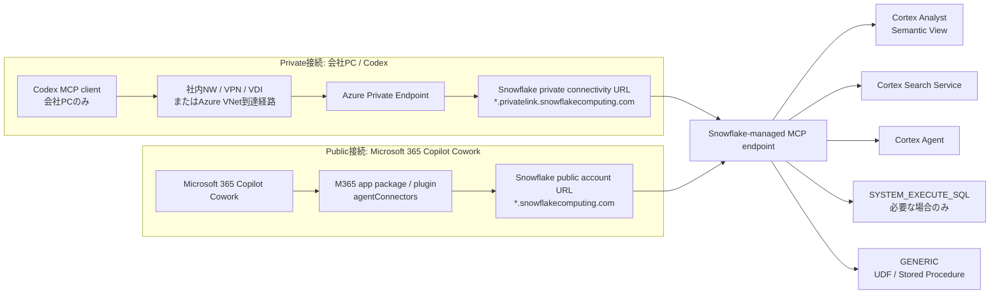
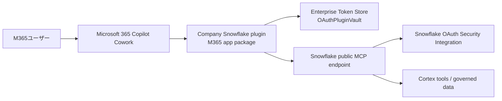

# Snowflake MCPサーバー構築手順

作成日: 2026-06-17  
対象: 会社PC、会社Snowflakeアカウント、会社Microsoft 365 tenantで実施する本番作業

## 1. 前提と結論

この資料は、自宅PCではなく会社PCで実施するための手順書です。自宅PCではSnowflakeへの実接続、秘密情報の保存、Codex MCP設定、Microsoft 365 tenant設定は行いません。

今回の本線構成は、Snowflake側に自前でMCPサーバーをホストするのではなく、Snowflake-managed MCP serverを使う構成です。Snowflake-managed MCP serverは、Snowflakeアカウント内のCortex Analyst、Cortex Search、Cortex Agents、SQL実行、UDF/ストアドプロシージャをMCP toolとして外部MCP clientに公開します。

接続方式は2系統に分けます。

- Private接続: 会社PCのCodex MCP clientから、社内ネットワーク/VPN/VDI/Azure VNetを経由し、Azure Private Link経由のSnowflake private URLへ接続する。
- Public接続: Microsoft 365 Copilot Cowork pluginから、公開Snowflake URLのMCP endpointへ接続する。

認証はOAuth中心にします。PATは短期の疎通確認または暫定運用だけに限定します。

## 2. 全体構成

画像版の構成図は以下に分けて作成しています。1枚に情報を詰め込みすぎないよう、全体像、Private接続、Public接続、Snowflake内部構成に分割しています。

- [図1: Snowflake MCP 全体構成](構成図_imagegen/01_overall_architecture_imagegen.png)
- [図2: Private接続: Codex + Azure Private Link](構成図_imagegen/02_private_connection_imagegen.png)
- [図3: Public接続: Microsoft 365 Copilot Cowork](構成図_imagegen/03_public_cowork_connection_imagegen.png)
- [図4: Snowflake MCP server と RBAC](構成図_imagegen/04_snowflake_mcp_rbac_imagegen.png)



MCP endpointのURL形式は共通です。Private接続では`<account_url>`にprivate URLを、Public接続ではpublic URLを使います。

```text
https://<account_url>/api/v2/databases/<database>/schemas/<schema>/mcp-servers/<mcp_server_name>
```

重要な設計判断:

- Private接続だけで運用するSnowflakeアカウントに対して`privatelink-only`を有効化すると、Microsoft 365 Copilot CoworkのようなSaaS側からpublic endpointへ接続できなくなります。
- Codex用のPrivate接続とCowork用のPublic接続を同じSnowflakeアカウントで併用する場合、public endpointを残しつつネットワークポリシーとOAuth/RBACで制御します。
- 強い分離が必要な場合は、用途別にSnowflake account、MCP server、role、network policyを分けます。

## 3. 役割分担

| 領域 | 主担当 | 主な作業 |
| --- | --- | --- |
| Snowflake | Snowflake管理者 / データ基盤担当 | MCP server作成、Cortex tool準備、OAuth integration、RBAC、network policy |
| Azure Private Link | Azure/ネットワーク管理者 | Private Endpoint、DNS、FW/NSG、社内経路、SnowCD疎通確認 |
| Codex | 開発者 / Codex管理者 | 会社PCでMCP client設定、OAuthログイン、tool確認 |
| Microsoft 365 Copilot Cowork | M365管理者 / Power Platform管理者 | plugin package、OAuthPluginVault、tenant配布、ユーザー利用許可 |
| セキュリティ | 情シス / セキュリティ管理者 | 秘密情報管理、ログ、監査、データ持ち出し判断、DLP/Purview |

## 4. Snowflake側のMCP server準備

### 4.1 公開するtoolを決める

最初にMCP serverへ公開するtoolを用途別に決めます。最小構成はCortex AnalystまたはCortex Searchだけにします。

| Tool type | 用途 | 注意点 |
| --- | --- | --- |
| `CORTEX_ANALYST_MESSAGE` | Semantic Viewを使った自然言語分析 | 対象Semantic Viewへの`SELECT`権限が必要 |
| `CORTEX_SEARCH_SERVICE_QUERY` | 非構造データや文書チャンク検索 | 対象Cortex Search Serviceへの`USAGE`権限が必要 |
| `CORTEX_AGENT_RUN` | Snowflake内で作成したCortex Agent呼び出し | 対象Cortex Agentへの`USAGE`権限が必要 |
| `SYSTEM_EXECUTE_SQL` | MCP経由でSQL実行 | 事故防止のため原則避ける。使う場合は読み取り専用roleに限定 |
| `GENERIC` | UDFまたはStored Procedureをtool化 | 入力schema、warehouse、実行権限を明確化 |

推奨:

- Private Codex用とPublic Cowork用でMCP serverを分ける。
- Public Cowork用には`SYSTEM_EXECUTE_SQL`を入れず、Semantic View、Search、Cortex Agent中心にする。
- tool名、description、titleに個人情報、機密名、内部コード名を入れない。Snowflakeのmetadataとして残るため。

### 4.2 Roleと権限の考え方

例として以下のroleを使います。実際の命名規則に合わせて変更してください。

| Role | 用途 |
| --- | --- |
| `<MCP_ADMIN_ROLE>` | MCP serverを作成・更新する管理role |
| `<MCP_ACCESS_ROLE>` | MCP clientから接続するユーザーのdefault role |
| `<MCP_COWORK_ROLE>` | Microsoft 365 Copilot Cowork用のdefault role |

基本方針:

- MCP serverへの`USAGE`だけでは、配下toolの実行権限は付与されません。Cortex Search、Semantic View、Cortex Agent、UDF/SP、Warehouseへ個別に権限を付与します。
- Snowflake-managed MCP serverのOAuth sessionは接続ユーザーの`DEFAULT_ROLE`を使います。Secondary roleには依存しない設計にします。
- ユーザーには`DEFAULT_WAREHOUSE`も設定します。未設定だとセッション初期化に失敗する可能性があります。

権限付与の例:

```sql
-- 管理role
GRANT USAGE ON DATABASE <DATABASE> TO ROLE <MCP_ADMIN_ROLE>;
GRANT USAGE ON SCHEMA <DATABASE>.<SCHEMA> TO ROLE <MCP_ADMIN_ROLE>;
GRANT CREATE MCP SERVER ON SCHEMA <DATABASE>.<SCHEMA> TO ROLE <MCP_ADMIN_ROLE>;

-- 利用role
GRANT USAGE ON DATABASE <DATABASE> TO ROLE <MCP_ACCESS_ROLE>;
GRANT USAGE ON SCHEMA <DATABASE>.<SCHEMA> TO ROLE <MCP_ACCESS_ROLE>;
GRANT USAGE ON WAREHOUSE <WAREHOUSE> TO ROLE <MCP_ACCESS_ROLE>;

-- Cortex Analyst / Semantic View
GRANT SELECT ON SEMANTIC VIEW <DATABASE>.<SCHEMA>.<SEMANTIC_VIEW> TO ROLE <MCP_ACCESS_ROLE>;

-- Cortex Search
GRANT USAGE ON CORTEX SEARCH SERVICE <DATABASE>.<SCHEMA>.<SEARCH_SERVICE> TO ROLE <MCP_ACCESS_ROLE>;

-- Cortex Agent
GRANT USAGE ON CORTEX AGENT <DATABASE>.<SCHEMA>.<CORTEX_AGENT> TO ROLE <MCP_ACCESS_ROLE>;

-- UDF / Stored ProcedureをGENERIC toolとして使う場合
GRANT USAGE ON FUNCTION <DATABASE>.<SCHEMA>.<FUNCTION_NAME>(<ARG_TYPES>) TO ROLE <MCP_ACCESS_ROLE>;
GRANT USAGE ON PROCEDURE <DATABASE>.<SCHEMA>.<PROCEDURE_NAME>(<ARG_TYPES>) TO ROLE <MCP_ACCESS_ROLE>;
```

ユーザーのdefault role/warehouse設定例:

```sql
ALTER USER <USERNAME>
  SET DEFAULT_ROLE = '<MCP_ACCESS_ROLE>'
      DEFAULT_WAREHOUSE = '<WAREHOUSE>';
```

### 4.3 MCP serverを作成する

最小構成例です。不要なtoolは削除してください。

```sql
USE ROLE <MCP_ADMIN_ROLE>;
USE DATABASE <DATABASE>;
USE SCHEMA <SCHEMA>;

CREATE OR REPLACE MCP SERVER <MCP_SERVER_NAME>
  FROM SPECIFICATION $$
    tools:
      - name: "business-analyst"
        type: "CORTEX_ANALYST_MESSAGE"
        identifier: "<DATABASE>.<SCHEMA>.<SEMANTIC_VIEW>"
        title: "Business Analyst"
        description: "Business semantic view for governed analytical questions."

      - name: "document-search"
        type: "CORTEX_SEARCH_SERVICE_QUERY"
        identifier: "<DATABASE>.<SCHEMA>.<SEARCH_SERVICE>"
        title: "Document Search"
        description: "Searches governed business documents and support records."

      - name: "business-agent"
        type: "CORTEX_AGENT_RUN"
        identifier: "<DATABASE>.<SCHEMA>.<CORTEX_AGENT>"
        title: "Business Agent"
        description: "Runs a governed Cortex Agent for business questions."
  $$;
```

MCP server利用権限:

```sql
GRANT USAGE ON MCP SERVER <DATABASE>.<SCHEMA>.<MCP_SERVER_NAME>
  TO ROLE <MCP_ACCESS_ROLE>;
```

確認:

```sql
SHOW MCP SERVERS IN SCHEMA <DATABASE>.<SCHEMA>;
DESCRIBE MCP SERVER <DATABASE>.<SCHEMA>.<MCP_SERVER_NAME>;
```

## 5. Snowflake OAuth設定

Snowflake-managed MCP serverはOAuth 2.0をサポートします。ただし、Dynamic Client Registrationはサポートしないため、Snowflake側でOAuth security integrationを作成し、client ID/secretをMCP client側に登録します。

OAuth integration作成例:

```sql
USE ROLE ACCOUNTADMIN;

CREATE OR REPLACE SECURITY INTEGRATION <OAUTH_INTEGRATION_NAME>
  TYPE = OAUTH
  OAUTH_CLIENT = CUSTOM
  ENABLED = TRUE
  OAUTH_CLIENT_TYPE = 'CONFIDENTIAL'
  OAUTH_REDIRECT_URI = '<PRIMARY_REDIRECT_URI>'
  OAUTH_ALTERNATE_REDIRECT_URIS = ('<ALTERNATE_REDIRECT_URI_1>', '<ALTERNATE_REDIRECT_URI_2>')
  OAUTH_ISSUE_REFRESH_TOKENS = TRUE
  OAUTH_REFRESH_TOKEN_VALIDITY = 86400
  OAUTH_USE_SECONDARY_ROLES = NONE
  BLOCKED_ROLES_LIST = ('ACCOUNTADMIN', 'SECURITYADMIN', 'ORGADMIN', 'GLOBALORGADMIN');
```

client ID/secret取得:

```sql
SELECT SYSTEM$SHOW_OAUTH_CLIENT_SECRETS('<OAUTH_INTEGRATION_NAME_IN_UPPERCASE>');
```

Private Link経由でOAuth認可画面もPrivate接続に寄せる場合は、会社ネットワーク設計とSnowflake設定を確認したうえで`USE_PRIVATELINK_FOR_AUTHORIZATION_ENDPOINT = TRUE`を検討します。ただし、Snowflakeドキュメント上、この設定でもclientからSnowflakeへの一部通信がpublic internet経由になる可能性があるため、会社のセキュリティレビュー対象にしてください。

Codex OAuth注意点:

- Codex公式CLI仕様では、Streamable HTTP MCP serverに対する`--oauth-client-id`と`codex mcp login`は確認できます。
- 一方で、会社PCに導入されているCodexバージョンがSnowflakeのconfidential client secretをどのように扱えるかは、会社PCで検証が必要です。
- Codex直結OAuthがclient secret要件で成立しない場合は、会社管理の中継MCP/API gatewayを用意し、gateway側でSnowflake OAuthを処理する構成にします。
- PATはその場合の恒久対策ではなく、短期検証または暫定運用に限定します。

## 6. Private接続: Azure Private Link

### 6.1 前提

Azure Private Link for SnowflakeはBusiness Critical以上のSnowflake機能です。Azure Private Link自体はMicrosoft Azureの機能であり、SnowflakeはSnowflake account側でPrivate Linkを使えるようにする形です。

必要なもの:

- 会社Snowflake accountの管理権限
- Azure subscription / resource group / VNet / subnetへの権限
- 会社PCからPrivate Endpointへ到達できる経路
- 社内DNSまたはAzure Private DNSの管理権限
- outbound firewall / NSGでTCP 443とOCSP用通信を許可する設計

### 6.2 SnowflakeからPrivate Link設定値を取得

```sql
USE ROLE ACCOUNTADMIN;
SELECT SYSTEM$GET_PRIVATELINK_CONFIG();
```

取得対象の例:

- `privatelink-pls-id`
- private connectivity account URL
- OCSP用URL
- Snowsightやapp serviceを使う場合のprivate URL

### 6.3 Azure Private Endpointを作成

Azure側でPrivate Endpointを作成します。

1. Azure PortalでPrivate Link / Private endpointsを開く。
2. 対象subscription、resource group、region、VNet、subnetを指定する。
3. Connection methodは、Snowflakeから取得したPrivate Link Service IDまたはaliasを指定する。
4. 作成されたPrivate Endpointのresource IDとfederated tokenを控える。
5. Snowflake側でPrivate Endpointを承認する。

承認例:

```sql
USE ROLE ACCOUNTADMIN;

SELECT SYSTEM$AUTHORIZE_PRIVATELINK(
  '<AZURE_PRIVATE_ENDPOINT_RESOURCE_ID>',
  '<FEDERATED_TOKEN>'
);
```

承認確認:

```sql
SELECT SYSTEM$GET_PRIVATELINK('<AZURE_PRIVATE_ENDPOINT_RESOURCE_ID>');
```

### 6.4 DNSとFirewall

会社PCや会社ネットワークからSnowflake private URLを引いたとき、Azure Private Endpointのprivate IPへ解決されるようにします。

確認例:

```powershell
Resolve-DnsName <ORG>-<ACCOUNT>.privatelink.snowflakecomputing.com
Test-NetConnection <ORG>-<ACCOUNT>.privatelink.snowflakecomputing.com -Port 443
```

DNS設定対象:

- Snowflake private account URL
- OCSP URL
- SnowsightやNotebooksなどを使う場合は各private URL

Snowflake公式手順では、Private Link構成後にSnowCDと`SYSTEM$ALLOWLIST_PRIVATELINK`で接続確認することが推奨されています。

```sql
SELECT SYSTEM$ALLOWLIST_PRIVATELINK();
```

### 6.5 privatelink-onlyの判断

`SYSTEM$ENFORCE_PRIVATELINK_ACCESS_ONLY`によりpublic accessを無効化できます。ただし、これを有効化すると、Microsoft 365 Copilot Coworkのようなpublic SaaSから同じSnowflake accountへ接続できなくなる可能性が高いです。

判断:

- Codex Private接続だけを許可するSnowflake account: privatelink-onlyを検討可能。
- Cowork Public接続も同じaccountで使う: privatelink-onlyは有効化せず、network policy / OAuth / RBACで制御する。
- 両方を厳密に分けたい: Private専用accountとPublic連携用accountを分ける。

## 7. Codex MCP client設定

この作業は会社PCで行います。自宅PCでは行いません。

### 7.1 MCP endpoint URLを決める

Private接続用:

```text
https://<ORG>-<ACCOUNT>.privatelink.snowflakecomputing.com/api/v2/databases/<DATABASE>/schemas/<SCHEMA>/mcp-servers/<MCP_SERVER_NAME>
```

Public検証用:

```text
https://<ORG>-<ACCOUNT>.snowflakecomputing.com/api/v2/databases/<DATABASE>/schemas/<SCHEMA>/mcp-servers/<MCP_SERVER_NAME>
```

### 7.2 Codex CLIで追加する例

CodexのOAuth client secret対応は会社PCで確認してください。まずは公式CLIにある`--oauth-client-id`で登録し、`codex mcp login`でOAuth flowが成立するか検証します。

```powershell
codex mcp add snowflake-private `
  --url "https://<ORG>-<ACCOUNT>.privatelink.snowflakecomputing.com/api/v2/databases/<DATABASE>/schemas/<SCHEMA>/mcp-servers/<MCP_SERVER_NAME>" `
  --oauth-client-id "<OAUTH_CLIENT_ID>"

codex mcp login snowflake-private
```

MCP一覧:

```powershell
codex mcp list
codex mcp get snowflake-private --json
```

Codex TUIでは`/mcp`で有効なMCP serverを確認します。

### 7.3 `config.toml`で設定する例

会社PCの`~/.codex/config.toml`、または信頼済みprojectの`.codex/config.toml`に設定します。秘密値は直接書かないでください。

```toml
[mcp_servers.snowflake_private]
enabled = true
required = true
url = "https://<ORG>-<ACCOUNT>.privatelink.snowflakecomputing.com/api/v2/databases/<DATABASE>/schemas/<SCHEMA>/mcp-servers/<MCP_SERVER_NAME>"
startup_timeout_sec = 20
tool_timeout_sec = 120

# 必要な場合のみ。Snowflake側のDEFAULT_ROLE設計を優先し、scopeに依存しない。
# scopes = ["session:role:<MCP_ACCESS_ROLE>"]

# OAuth resource指定が必要な場合のみ、会社PCで検証して設定する。
# oauth_resource = "https://<ORG>-<ACCOUNT>.privatelink.snowflakecomputing.com"
```

### 7.4 PATによる短期疎通確認

OAuthが会社PCのCodexバージョンで直ちに成立しない場合のみ、短期検証としてPATを使います。PATはrole restriction、短い有効期限、network policyを必須にします。

PAT作成例:

```sql
ALTER USER <USERNAME>
  ADD PROGRAMMATIC ACCESS TOKEN <TOKEN_NAME>
  ROLE_RESTRICTION = '<MCP_ACCESS_ROLE>'
  DAYS_TO_EXPIRY = 7
  COMMENT = 'Temporary PAT for Codex Snowflake MCP validation';
```

Codex設定例:

```toml
[mcp_servers.snowflake_private_pat]
enabled = true
url = "https://<ORG>-<ACCOUNT>.privatelink.snowflakecomputing.com/api/v2/databases/<DATABASE>/schemas/<SCHEMA>/mcp-servers/<MCP_SERVER_NAME>"
bearer_token_env_var = "SNOWFLAKE_MCP_PAT"
http_headers = { "X-Snowflake-Authorization-Token-Type" = "PROGRAMMATIC_ACCESS_TOKEN" }
startup_timeout_sec = 20
tool_timeout_sec = 120
```

会社PCの一時PowerShell sessionだけに入れる例:

```powershell
$env:SNOWFLAKE_MCP_PAT = "<TOKEN_SECRET>"
```

恒久保存が必要な場合は、会社のsecret manager、Windows Credential Manager、MDM配布、または社内標準のvaultを使用します。リポジトリ、Markdown、チャット、チケットには絶対に貼り付けないでください。

## 8. Public接続: Microsoft 365 Copilot Cowork

Microsoft 365 Copilot Coworkは、M365 app package / Teams app packageの仕組みでpluginを配布し、plugin内のconnectorとしてremote MCP serverを宣言します。CoworkはruntimeでMCP `initialize`と`tools/list`を呼び、利用可能toolを動的に検出します。

### 8.1 公開接続の構成



公開接続のendpoint:

```text
https://<ORG>-<ACCOUNT>.snowflakecomputing.com/api/v2/databases/<DATABASE>/schemas/<SCHEMA>/mcp-servers/<MCP_SERVER_NAME>
```

注意:

- Public接続では`privatelink`付きURLではなくpublic URLを使います。
- Snowflake network policyでMicrosoft 365 Copilot Cowork / connector基盤のoutbound IPを許可する必要があります。固定IP範囲はMicrosoft側の最新情報を確認し、資料やコードに古いIPを固定しないでください。
- ユーザーのSnowflake権限はdefault roleで評価されます。Cowork向けの利用者roleを明確にします。

### 8.2 OAuthPluginVaultの準備

1. Microsoft 365 Agents ToolkitまたはTeams Developer Portal側でOAuth clientを登録する。
2. Snowflake OAuth security integrationのclient ID/secretをMicrosoft Enterprise Token Storeへ格納する。
3. 生成された`referenceId`をplugin manifestのauthorization設定で参照する。
4. Microsoft側に表示されるredirect URIをSnowflake security integrationの`OAUTH_REDIRECT_URI`または`OAUTH_ALTERNATE_REDIRECT_URIS`へ登録する。

Snowflake側:

```sql
ALTER SECURITY INTEGRATION <OAUTH_INTEGRATION_NAME> SET
  OAUTH_REDIRECT_URI = '<MICROSOFT_COWORK_REDIRECT_URI>';
```

複数clientやテスト/本番がある場合:

```sql
ALTER SECURITY INTEGRATION <OAUTH_INTEGRATION_NAME> SET
  OAUTH_REDIRECT_URI = '<PRIMARY_REDIRECT_URI>'
  OAUTH_ALTERNATE_REDIRECT_URIS = ('<DEV_REDIRECT_URI>', '<PROD_REDIRECT_URI>');
```

### 8.3 Plugin packageの最小構成

実際のmanifest schemaはMicrosoft 365 Agents Toolkitでvalidateしてください。以下は構成イメージです。

```text
snowflake-cowork-plugin.zip
├── manifest.json
├── color.png
├── outline.png
└── skills/
    └── snowflake-analysis/
        └── SKILL.md
```

manifestの概念例:

```json
{
  "$schema": "https://developer.microsoft.com/en/json-schemas/teams/vDevPreview/MicrosoftTeams.schema.json",
  "manifestVersion": "devPreview",
  "version": "1.0.0",
  "packageName": "com.company.snowflake-mcp",
  "name": {
    "short": "Snowflake MCP",
    "full": "Company Snowflake MCP for Copilot Cowork"
  },
  "description": {
    "short": "Snowflake data tools for Cowork.",
    "full": "Connects Copilot Cowork to governed Snowflake MCP tools."
  },
  "icons": {
    "color": "color.png",
    "outline": "outline.png"
  },
  "accentColor": "#2B579A",
  "agentConnectors": [
    {
      "id": "snowflake-mcp",
      "name": "Snowflake MCP",
      "description": "Governed Snowflake MCP tools for business analysis.",
      "toolSource": {
        "type": "remoteMcpServer",
        "url": "https://<ORG>-<ACCOUNT>.snowflakecomputing.com/api/v2/databases/<DATABASE>/schemas/<SCHEMA>/mcp-servers/<MCP_SERVER_NAME>"
      },
      "authorization": {
        "type": "OAuthPluginVault",
        "referenceId": "<MICROSOFT_ENTERPRISE_TOKEN_STORE_REFERENCE_ID>"
      }
    }
  ]
}
```

### 8.4 Test / deploy

開発者テスト:

```powershell
npm install -g @microsoft/m365agentstoolkit-cli
atk auth login
atk package --manifest-file ./appPackage/manifest.json `
  --output-package-file ./appPackage/build/snowflake-cowork-plugin.zip `
  --output-folder ./appPackage/build
atk install --file-path "./appPackage/build/snowflake-cowork-plugin.zip" --scope Personal
```

Tenant配布:

1. Microsoft 365 admin centerを開く。
2. custom app / plugin packageをアップロードする。
3. 対象ユーザーまたはグループへ配布する。
4. CoworkのSources & Skillsでpluginが表示されることを確認する。
5. 初回利用時にユーザーがSnowflake OAuth同意を行う。
6. `tools/list`でSnowflake MCP toolが検出されることを確認する。

## 9. 検証チェックリスト

### 9.1 Snowflake MCP server

- [ ] `SHOW MCP SERVERS IN SCHEMA <DATABASE>.<SCHEMA>;`でserverが表示される。
- [ ] `DESCRIBE MCP SERVER <DATABASE>.<SCHEMA>.<MCP_SERVER_NAME>;`で想定toolのみ表示される。
- [ ] 接続ユーザーの`DEFAULT_ROLE`が`<MCP_ACCESS_ROLE>`または`<MCP_COWORK_ROLE>`になっている。
- [ ] 接続ユーザーの`DEFAULT_WAREHOUSE`が設定されている。
- [ ] MCP server、Semantic View、Cortex Search、Cortex Agent、Warehouseの権限がroleに付与されている。

### 9.2 Private / Codex

- [ ] 会社PCからprivate hostnameがPrivate EndpointのIPへ解決される。
- [ ] `Test-NetConnection <private_host> -Port 443`が成功する。
- [ ] SnowCDと`SYSTEM$ALLOWLIST_PRIVATELINK()`でPrivate Link接続が確認できる。
- [ ] Codexの`/mcp`または`codex mcp list`で`snowflake-private`が有効になっている。
- [ ] `tools/list`相当でSnowflake MCP toolが見える。
- [ ] 代表質問でCortex Analyst/Search/Agent toolが動作する。
- [ ] 自宅PCまたは社外ネットワークからprivate URLへ接続できない。

### 9.3 Public / Copilot Cowork

- [ ] M365 admin centerでpluginが配布済みになっている。
- [ ] CoworkのSources & Skillsでpluginが表示される。
- [ ] ユーザーがSnowflake OAuth同意を完了できる。
- [ ] Coworkが`tools/list`でSnowflake MCP toolを検出できる。
- [ ] 代表質問で期待したtoolが呼ばれる。
- [ ] Snowflake query history / access history / OAuthログで実行ユーザーを追跡できる。

### 9.4 Negative test

- [ ] 権限不足ユーザーではtool実行が失敗する。
- [ ] `DEFAULT_WAREHOUSE`未設定ユーザーでは初期化失敗または実行失敗を確認する。
- [ ] network policyで未許可IPからのpublic接続が拒否される。
- [ ] `privatelink-only`有効時にpublic SaaS接続が成立しないことを理解し、誤って有効化しない。
- [ ] PAT期限切れ、無効化、role revoke時に接続できなくなる。

## 10. セキュリティ設計ポイント

### 10.1 最小権限

- MCP利用roleには、必要なdatabase/schema/object/warehouseだけを付与する。
- Public Cowork用roleは、業務ユーザー向けに読ませてよいSemantic ViewやSearch Serviceだけに絞る。
- `SYSTEM_EXECUTE_SQL`は原則Private Codex用だけにし、Public Coworkには出さない。

### 10.2 ネットワーク制御

- Private接続はAzure Private EndpointとDNSでprivate URLへ誘導する。
- Public接続はMicrosoft 365 Copilot Coworkの接続元をnetwork policyで許可する。
- `privatelink-only`はPublic接続と両立しない可能性が高いため、導入前にPublic連携の要否を確定する。

### 10.3 秘密情報

- OAuth client secret、PAT、client ID/secretの出力結果はMarkdown、Git、チケット、チャットに貼らない。
- OAuth client secretはMicrosoft Enterprise Token Storeまたは会社標準のsecret管理基盤へ格納する。
- PATを使う場合はrole restriction、有効期限、network policy、ローテーション、失効手順を必須にする。

### 10.4 監査

- Snowflake query history、access history、login history、OAuth関連ログを確認する。
- Microsoft側はM365 audit、plugin deployment、user consent、Purview/DLPの対象にする。
- 代表的な質問と結果を検証記録として残す。ただし実データや個人情報を含む回答を手順書に貼らない。

## 11. 実施順序

1. 会社側で対象ユースケース、公開tool、対象データ、利用者を決める。
2. SnowflakeでSemantic View、Cortex Search、Cortex Agentを準備する。
3. Snowflakeでrole、warehouse、権限を設計する。
4. Snowflake-managed MCP serverを作成する。
5. Snowflake OAuth security integrationを作成する。
6. Azure Private Linkを作成し、DNS/FW/OCSP/SnowCDを確認する。
7. 会社PCでCodex MCP clientをPrivate URLに接続する。
8. Codex OAuth直結可否を検証する。不可なら会社管理の中継MCP/API gatewayまたは短期PAT検証へ切り替える。
9. Microsoft 365 Copilot Cowork pluginを作成し、OAuthPluginVaultを設定する。
10. M365 admin centerでpluginをテスト配布し、Coworkからtool discoveryを確認する。
11. セキュリティレビュー後、本番ユーザーへ段階展開する。

## 12. 会社PCで埋める値

| 項目 | 値 |
| --- | --- |
| Snowflake organization | `<ORG>` |
| Snowflake account | `<ACCOUNT>` |
| Public account URL | `https://<ORG>-<ACCOUNT>.snowflakecomputing.com` |
| Private account URL | `https://<ORG>-<ACCOUNT>.privatelink.snowflakecomputing.com` |
| Database | `<DATABASE>` |
| Schema | `<SCHEMA>` |
| MCP server | `<MCP_SERVER_NAME>` |
| Admin role | `<MCP_ADMIN_ROLE>` |
| Codex access role | `<MCP_ACCESS_ROLE>` |
| Cowork access role | `<MCP_COWORK_ROLE>` |
| Warehouse | `<WAREHOUSE>` |
| OAuth integration | `<OAUTH_INTEGRATION_NAME>` |
| Codex redirect URI | `<CODEX_REDIRECT_URI>` |
| Cowork redirect URI | `<MICROSOFT_COWORK_REDIRECT_URI>` |
| Azure Private Endpoint resource ID | `<AZURE_PRIVATE_ENDPOINT_RESOURCE_ID>` |
| Microsoft token store reference ID | `<MICROSOFT_ENTERPRISE_TOKEN_STORE_REFERENCE_ID>` |

## 13. 参照元

- [Snowflake-managed MCP server](https://docs.snowflake.com/en/user-guide/snowflake-cortex/cortex-agents-mcp)
- [CREATE MCP SERVER](https://docs.snowflake.com/en/sql-reference/sql/create-mcp-server)
- [Azure Private Link and Snowflake](https://docs.snowflake.com/en/user-guide/privatelink-azure)
- [Enforcement of privatelink-only access](https://docs.snowflake.com/en/user-guide/security-disable-public-access-privatelink)
- [SYSTEM$GET_PRIVATELINK_CONFIG](https://docs.snowflake.com/en/sql-reference/functions/system_get_privatelink_config)
- [Snowflake OAuth security integration](https://docs.snowflake.com/en/sql-reference/sql/create-security-integration-oauth-snowflake)
- [Configure Snowflake OAuth for custom clients](https://docs.snowflake.com/en/user-guide/oauth-custom)
- [Programmatic access tokens](https://docs.snowflake.com/en/user-guide/programmatic-access-tokens)
- [Codex MCP](https://developers.openai.com/codex/mcp)
- [Codex CLI MCP options](https://developers.openai.com/codex/cli/reference)
- [Copilot Cowork plugin development](https://learn.microsoft.com/en-us/microsoft-365/copilot/cowork/cowork-plugin-development)
- [Copilot Cowork plugin management](https://learn.microsoft.com/en-us/microsoft-365/copilot/cowork/cowork-manage-plugins)
- [Copilot Studio MCP onboarding](https://learn.microsoft.com/en-us/microsoft-copilot-studio/mcp-add-existing-server-to-agent)
