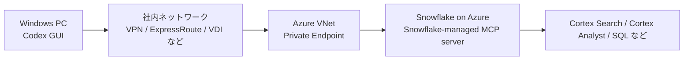

# Snowflake MCP プライベート接続手順

対象: Azure Private Link 経由で、Windows 版 Codex GUI から Snowflake MCP Server に接続する構成  
調査日: 2026-06-18  
前提: Codex は GUI アプリを使用し、Codex CLI は使用しない

## 1. この資料の目的

この資料では、会社の Snowflake に対して **プライベート接続** で MCP を使うための構成と手順を説明します。

構成は次のとおりです。



ポイント:

- MCP サーバーは Snowflake 内に作成します。別サーバーへデプロイする必要はありません。
- Codex GUI は MCP クライアントです。
- Windows PC から Azure Private Endpoint に到達できる必要があります。
- DNS で Snowflake PrivateLink 用 URL が Private Endpoint のプライベート IP に解決される必要があります。

## 2. 採用する構成

推奨は **Snowflake-managed MCP server** です。

旧 Snowflake-Labs の OSS MCP サーバーは非推奨になっており、現在は Snowflake 公式の managed MCP server を使うのが本線です。

| 項目 | 内容 |
|---|---|
| MCP サーバー | Snowflake-managed MCP server |
| MCP クライアント | Codex GUI |
| ネットワーク | Azure Private Link |
| 認証 | まず PAT で疎通確認。可能なら OAuth |
| 接続 URL | PrivateLink 用 Snowflake account URL を使う |

## 3. 作業全体の流れ

| 手順 | 作業場所 | 内容 |
|---|---|---|
| 1 | Snowsight | MCP 用ロール、Warehouse、権限を準備 |
| 2 | Snowsight | `CREATE MCP SERVER` で MCP server を作成 |
| 3 | Azure Portal | Snowflake 向け Private Endpoint を作成 |
| 4 | Azure Cloud Shell / PowerShell | Azure access token と Private Endpoint resource ID を取得 |
| 5 | Snowsight | `SYSTEM$AUTHORIZE_PRIVATELINK` で Snowflake 側を承認 |
| 6 | DNS 管理 | PrivateLink 用 URL を Private Endpoint の IP に解決 |
| 7 | Windows PowerShell | 名前解決と 443 疎通を確認 |
| 8 | Codex GUI | MCP クライアント設定を追加 |

## 4. Snowflake MCP Server を作成する

### 4.1 どの画面で入力するか

Snowflake の SQL は **Snowsight** で実行します。

操作:

1. ブラウザで Snowflake Snowsight を開く
2. 左メニューから **Worksheets** を開く
3. 新しい SQL Worksheet を作成
4. 右上または上部のロールを `ACCOUNTADMIN` など必要なロールへ変更
5. SQL を貼り付けて **Run** を押す

### 4.2 MCP Server 作成 SQL

以下は例です。実際のデータベース名、スキーマ名、Semantic View、Cortex Search Service、Warehouse 名に置き換えてください。

```sql
USE ROLE ACCOUNTADMIN;
USE DATABASE ANALYTICS_DB;
USE SCHEMA AI_MCP;

CREATE OR REPLACE MCP SERVER muam_mcp_server
  FROM SPECIFICATION $$
tools:
  - name: "revenue-semantic-view"
    type: "CORTEX_ANALYST_MESSAGE"
    identifier: "ANALYTICS_DB.AI_MCP.REVENUE_SEMANTIC_VIEW"
    description: "売上データを自然言語で分析するための Semantic View"
    title: "Revenue Analyst"

  - name: "document-search"
    type: "CORTEX_SEARCH_SERVICE_QUERY"
    identifier: "ANALYTICS_DB.AI_MCP.DOCUMENT_SEARCH_SERVICE"
    description: "社内ドキュメントを検索する Cortex Search Service"
    title: "Document Search"

  - name: "readonly-sql"
    type: "SYSTEM_EXECUTE_SQL"
    description: "承認された範囲で Snowflake SQL を実行する読み取り用ツール"
    title: "Read Only SQL"
    config:
      read_only: true
      query_timeout: 120
      warehouse: "ANALYST_WH"
$$;
```

注意:

- `SYSTEM_EXECUTE_SQL` は、最初は `read_only: true` にしてください。
- Cortex Analyst は Semantic View を使います。
- tool 名と description は、Codex がツール選択するときの判断材料になります。曖昧な説明は避けます。
- Snowflake-managed MCP server は 1 server あたり最大 50 tools です。

### 4.3 作成確認

Snowsight の SQL Worksheet で実行します。

```sql
SHOW MCP SERVERS IN SCHEMA ANALYTICS_DB.AI_MCP;

DESCRIBE MCP SERVER ANALYTICS_DB.AI_MCP.MUAM_MCP_SERVER;
```

## 5. Snowflake 権限設定

### 5.1 考え方

MCP server への `USAGE` だけでは不十分です。裏側の Semantic View、Cortex Search Service、Warehouse などにも権限が必要です。

OAuth セッションでは、接続ユーザーの `DEFAULT_ROLE` が使われます。Secondary roles は MCP OAuth セッションでは使えません。

### 5.2 サンプル SQL

Snowsight の SQL Worksheet で実行します。

```sql
USE ROLE SECURITYADMIN;

CREATE ROLE IF NOT EXISTS MCP_SNOWFLAKE_USER_ROLE;

GRANT USAGE ON DATABASE ANALYTICS_DB TO ROLE MCP_SNOWFLAKE_USER_ROLE;
GRANT USAGE ON SCHEMA ANALYTICS_DB.AI_MCP TO ROLE MCP_SNOWFLAKE_USER_ROLE;
GRANT USAGE ON WAREHOUSE ANALYST_WH TO ROLE MCP_SNOWFLAKE_USER_ROLE;

GRANT USAGE ON MCP SERVER ANALYTICS_DB.AI_MCP.MUAM_MCP_SERVER
  TO ROLE MCP_SNOWFLAKE_USER_ROLE;

GRANT SELECT ON SEMANTIC VIEW ANALYTICS_DB.AI_MCP.REVENUE_SEMANTIC_VIEW
  TO ROLE MCP_SNOWFLAKE_USER_ROLE;

GRANT USAGE ON CORTEX SEARCH SERVICE ANALYTICS_DB.AI_MCP.DOCUMENT_SEARCH_SERVICE
  TO ROLE MCP_SNOWFLAKE_USER_ROLE;

GRANT ROLE MCP_SNOWFLAKE_USER_ROLE TO USER <user_name>;

ALTER USER <user_name>
  SET DEFAULT_ROLE = 'MCP_SNOWFLAKE_USER_ROLE'
      DEFAULT_WAREHOUSE = 'ANALYST_WH';
```

## 6. Azure Private Link を構築する

### 6.1 前提

Snowflake の Azure Private Link は Business Critical 以上が必要です。Azure Private Link は Microsoft Azure のサービスで、Snowflake が利用できるように承認する形です。

Windows PC から Private Endpoint に到達するために、次のいずれかが必要です。

- 社内 VPN から Azure VNet に到達できる
- ExpressRoute などで社内ネットワークと Azure VNet が接続されている
- Azure VNet 内の Windows VM / VDI で Codex GUI を使う

### 6.2 PrivateLink 情報を取得

作業場所: **Snowsight > Worksheets**

```sql
USE ROLE ACCOUNTADMIN;

SELECT SYSTEM$GET_PRIVATELINK_CONFIG();
```

見やすくする場合:

```sql
SELECT key, value
FROM TABLE(FLATTEN(INPUT => PARSE_JSON(SYSTEM$GET_PRIVATELINK_CONFIG())));
```

主に使う値:

- `privatelink-pls-id`: Azure Private Endpoint 作成時に使う
- PrivateLink 用 account URL: Codex からの接続 URL に使う
- OCSP URL: ファイアウォールや DNS 設定に使う

### 6.3 Azure Portal で Private Endpoint を作成

作業場所: **Azure Portal**

1. Azure Portal を開く
2. 検索バーで **Private Link** を検索
3. **Private endpoints** を開く
4. **Create** または **Add** を押す
5. Subscription、Resource group、Name、Region を入力
6. Resource 画面で **Connect to an Azure resource by resource ID or alias** を選択
7. Resource ID or alias に Snowflake の `privatelink-pls-id` を入力
8. VNet / Subnet を選択
9. 作成する

作成直後は Pending になることがあります。Snowflake 側で承認すると Approved になります。

### 6.4 Azure CLI で必要情報を取得

作業場所: **Azure Cloud Shell** または **Windows Terminal / PowerShell**

Private Endpoint の resource ID を確認します。

```powershell
az network private-endpoint show `
  --name <private_endpoint_name> `
  --resource-group <resource_group_name> `
  --query id `
  --output tsv
```

Azure access token を取得します。

```powershell
az account get-access-token --subscription <subscription_id>
```

`accessToken` はパスワード相当の秘密情報です。チャットやチケットに貼らないでください。

### 6.5 Snowflake 側で PrivateLink を承認

作業場所: **Snowsight > Worksheets**

```sql
USE ROLE ACCOUNTADMIN;

SELECT SYSTEM$AUTHORIZE_PRIVATELINK(
  '<private_endpoint_resource_id>',
  '<azure_access_token>'
);
```

承認確認:

```sql
SELECT SYSTEM$GET_PRIVATELINK('<private_endpoint_resource_id>');
```

## 7. DNS を設定する

作業場所:

- 社内 DNS 管理画面
- Azure Private DNS Zone
- DNS Forwarder
- ネットワーク管理者の管理ツール

目的:

- Snowflake PrivateLink 用 account URL を Private Endpoint のプライベート IP に解決する
- OCSP URL も必要に応じて PrivateLink 経由で解決する

Snowflake 公式ドキュメントでは、`SYSTEM$GET_PRIVATELINK_CONFIG()` の値に基づいて DNS を設定するよう案内されています。DNS は企業環境ごとに違うため、Azure / ネットワーク管理者と一緒に作業してください。

## 8. Windows PC で疎通確認

作業場所: **Windows Terminal / PowerShell**

名前解決:

```powershell
nslookup <privatelink_account_url>
```

期待結果:

- Private Endpoint のプライベート IP が返る
- 公開 IP が返る場合、DNS が PrivateLink 経由になっていない

HTTPS 疎通:

```powershell
Test-NetConnection <privatelink_account_url> -Port 443
```

期待結果:

```text
TcpTestSucceeded : True
```

## 9. Codex GUI に MCP クライアント設定を追加する

### 9.1 GUI で設定する場合

作業場所: **Codex GUI アプリ**

1. Codex GUI を開く
2. **Settings** を開く
3. **Integrations & MCP** を開く
4. **Add your own** または MCP 追加ボタンを押す
5. Server name に `snowflake-private` などを入力
6. Server URL に PrivateLink 用 MCP Server URL を入力

PrivateLink 用 MCP Server URL:

```text
https://<privatelink_account_url>/api/v2/databases/ANALYTICS_DB/schemas/AI_MCP/mcp-servers/MUAM_MCP_SERVER
```

認証方式:

| Codex GUI で選べる認証 | 使い方 |
|---|---|
| OAuth + Client ID / Secret を入力できる | Snowflake OAuth を使う |
| Bearer token を入力できる | Snowflake PAT を使う |
| URL しか入力できない | `config.toml` をメモ帳で編集する |

### 9.2 PAT で疎通確認する場合

Snowflake 公式では OAuth が推奨です。ただし Codex GUI の OAuth 入力項目が Snowflake と合わない場合、PrivateLink 内の検証では PAT を使う選択肢があります。

PAT の注意:

- 最小権限ロールに紐づける
- 有効期限を短めにする
- 共有しない
- 退職・異動・端末紛失時に即時 revoke できる運用にする
- 設定ファイルへ直書きせず、Windows 環境変数に入れる

### 9.3 Windows に PAT を環境変数として保存

作業場所: **Windows の環境変数 GUI**

1. Windows のスタートメニューを開く
2. `環境変数` と検索
3. **システム環境変数の編集** を開く
4. **環境変数** ボタンを押す
5. 上側の **ユーザー環境変数** で **新規** を押す
6. 変数名: `SNOWFLAKE_MCP_PAT`
7. 変数値: Snowflake PAT の secret
8. OK で閉じる
9. Codex GUI を完全に終了して、再起動する

### 9.4 `config.toml` をメモ帳で編集する場合

Codex CLI は使いません。Windows のメモ帳で設定ファイルを編集します。

作業場所: **エクスプローラー + メモ帳**

1. エクスプローラーを開く
2. アドレスバーに次を入力して Enter

```text
%USERPROFILE%\.codex
```

3. `config.toml` を右クリック
4. **プログラムから開く > メモ帳** を選ぶ
5. 以下を追記して保存

```toml
[mcp_servers.snowflake_private]
url = "https://<privatelink_account_url>/api/v2/databases/ANALYTICS_DB/schemas/AI_MCP/mcp-servers/MUAM_MCP_SERVER"
bearer_token_env_var = "SNOWFLAKE_MCP_PAT"
http_headers = { "X-Snowflake-Authorization-Token-Type" = "PROGRAMMATIC_ACCESS_TOKEN" }
startup_timeout_sec = 20
tool_timeout_sec = 120
default_tools_approval_mode = "prompt"
enabled = true
```

6. Codex GUI を再起動
7. Codex GUI の **Settings > Integrations & MCP** で接続状態を確認

### 9.5 Codex GUI で接続確認する

作業場所: **Codex GUI のチャット画面**

新しいスレッドで次のように聞きます。

```text
Snowflake MCP サーバーに接続できているか確認してください。
利用可能な MCP ツール一覧を表示し、どのツールが何をするものか説明してください。
```

## 10. OAuth を使う場合

Codex GUI が Snowflake OAuth に必要な Client ID / Client Secret / Redirect URI を扱える場合は OAuth を使います。

作業場所: **Snowsight > Worksheets**

```sql
USE ROLE ACCOUNTADMIN;

CREATE OR REPLACE SECURITY INTEGRATION MCP_OAUTH_FOR_CODEX_PRIVATE
  TYPE = OAUTH
  OAUTH_CLIENT = CUSTOM
  ENABLED = TRUE
  OAUTH_CLIENT_TYPE = 'CONFIDENTIAL'
  OAUTH_REDIRECT_URI = '<codex_redirect_uri>'
  USE_PRIVATELINK_FOR_AUTHORIZATION_ENDPOINT = TRUE
  OAUTH_ISSUE_REFRESH_TOKENS = TRUE
  OAUTH_REFRESH_TOKEN_VALIDITY = 86400
  BLOCKED_ROLES_LIST = ('ACCOUNTADMIN', 'SECURITYADMIN', 'ORGADMIN', 'GLOBALORGADMIN');
```

Client ID / Secret 取得:

```sql
SELECT SYSTEM$SHOW_OAUTH_CLIENT_SECRETS('MCP_OAUTH_FOR_CODEX_PRIVATE');
```

補足:

- `USE_PRIVATELINK_FOR_AUTHORIZATION_ENDPOINT = TRUE` は、認証中のユーザーと Snowflake authorization server のやり取りを private connectivity 側へ寄せる設定です。
- 自社の SSO、IdP、DNS 設計と合わせて確認してください。

## 11. トラブルシュート

| 症状 | 原因候補 | 対応 |
|---|---|---|
| Codex から接続できない | DNS が PrivateLink になっていない | `nslookup` で private IP を確認 |
| 443 疎通に失敗 | VPN / VNet / NSG / Firewall の問題 | `Test-NetConnection` で確認しネットワーク管理者へ |
| 403 / 権限エラー | MCP server または裏側 tool の権限不足 | `GRANT USAGE ON MCP SERVER` と各 object grant を確認 |
| OAuth 成功後に tool 実行失敗 | `DEFAULT_ROLE` が違う | `ALTER USER ... SET DEFAULT_ROLE` を確認 |
| PAT が使えない | PAT 期限切れ、role 不一致、network policy 未設定 | PAT、role、network policy を確認 |
| Codex に環境変数が反映されない | Codex GUI を再起動していない | Codex GUI を完全終了して再起動 |

## 12. チェックリスト

- [ ] Snowflake MCP server を作成済み
- [ ] `DESCRIBE MCP SERVER` で tool 定義を確認済み
- [ ] MCP 利用 role に必要権限を付与済み
- [ ] 利用 user の `DEFAULT_ROLE` と `DEFAULT_WAREHOUSE` を設定済み
- [ ] Azure Private Endpoint が Approved
- [ ] Snowflake 側で PrivateLink 承認済み
- [ ] DNS が PrivateLink 用 URL を private IP に解決する
- [ ] Windows PC から `Test-NetConnection` が成功
- [ ] Codex GUI に MCP 設定を追加済み
- [ ] Codex GUI から tool 一覧を確認済み

## 13. 参考リンク

- Snowflake Documentation: [Snowflake-managed MCP server](https://docs.snowflake.com/en/user-guide/snowflake-cortex/cortex-agents-mcp)
- Snowflake Documentation: [CREATE MCP SERVER](https://docs.snowflake.com/en/sql-reference/sql/create-mcp-server)
- Snowflake Documentation: [Azure Private Link and Snowflake](https://docs.snowflake.com/en/user-guide/privatelink-azure)
- Snowflake Documentation: [SYSTEM$GET_PRIVATELINK_CONFIG](https://docs.snowflake.com/en/sql-reference/functions/system_get_privatelink_config)
- Snowflake Documentation: [Programmatic access tokens](https://docs.snowflake.com/en/user-guide/programmatic-access-tokens)
- Snowflake Documentation: [CREATE SECURITY INTEGRATION - Snowflake OAuth](https://docs.snowflake.com/en/sql-reference/sql/create-security-integration-oauth-snowflake)
- OpenAI Developers: [Codex MCP](https://developers.openai.com/codex/mcp)
- OpenAI Developers: [Codex App settings](https://developers.openai.com/codex/app/settings)

