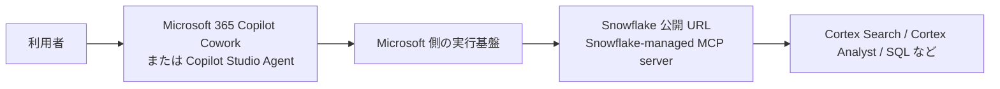

# Snowflake MCP パブリック接続手順

対象: Microsoft Copilot Studio / Microsoft 365 Copilot Cowork から、公開 URL 経由で Snowflake MCP Server に接続する構成  
調査日: 2026-06-18

## 1. この資料の目的

この資料では、会社の Snowflake に対して **パブリック接続** で MCP を使うための構成と手順を説明します。

構成は次のとおりです。



ポイント:

- MCP サーバーは Snowflake 内に作成します。
- Copilot Studio / Copilot Cowork は MCP クライアントです。
- 接続元は利用者 PC ではなく、Microsoft 側の実行基盤です。
- Snowflake network policy を使っている場合は、Microsoft 側の outbound IP を許可する必要があります。

## 2. 採用する構成

推奨は **Snowflake-managed MCP server** です。

| 項目 | 内容 |
|---|---|
| MCP サーバー | Snowflake-managed MCP server |
| MCP クライアント | Microsoft Copilot Studio / Microsoft 365 Copilot Cowork |
| ネットワーク | Snowflake 公開 URL |
| 認証 | Snowflake OAuth |
| OAuth 方式 | Copilot Studio では Manual OAuth |

注意: この資料では「Copilot Cowork」を **Microsoft 365 Copilot Cowork / Copilot Studio** として扱います。もし社内で「Snowflake CoWork」を指している場合は、最後の「Snowflake CoWork の場合」を確認してください。

## 3. 作業全体の流れ

| 手順 | 作業場所 | 内容 |
|---|---|---|
| 1 | Snowsight | MCP 用ロール、Warehouse、権限を準備 |
| 2 | Snowsight | `CREATE MCP SERVER` で MCP server を作成 |
| 3 | Snowsight | Snowflake OAuth Security Integration を作成 |
| 4 | Copilot Studio | MCP Server URL と OAuth 情報を登録 |
| 5 | Snowsight | Copilot Studio の Redirect URI を OAuth integration に反映 |
| 6 | Snowflake Network Policy | Microsoft 側 outbound IP を許可 |
| 7 | Copilot Studio / Cowork | 接続と tool 実行を確認 |

## 4. Snowflake MCP Server を作成する

### 4.1 どの画面で入力するか

Snowflake の SQL は **Snowsight** で実行します。

操作:

1. ブラウザで Snowflake Snowsight を開く
2. 左メニューから **Worksheets** を開く
3. 新しい SQL Worksheet を作成
4. 右上または上部のロールを `ACCOUNTADMIN` など必要なロールへ変更
5. SQL を貼り付けて **Run** を押す

### 4.2 MCP Server 作成 SQL

以下は例です。実際のデータベース名、スキーマ名、Semantic View、Cortex Search Service、Warehouse 名に置き換えてください。

```sql
USE ROLE ACCOUNTADMIN;
USE DATABASE ANALYTICS_DB;
USE SCHEMA AI_MCP;

CREATE OR REPLACE MCP SERVER muam_mcp_server
  FROM SPECIFICATION $$
tools:
  - name: "revenue-semantic-view"
    type: "CORTEX_ANALYST_MESSAGE"
    identifier: "ANALYTICS_DB.AI_MCP.REVENUE_SEMANTIC_VIEW"
    description: "売上データを自然言語で分析するための Semantic View"
    title: "Revenue Analyst"

  - name: "document-search"
    type: "CORTEX_SEARCH_SERVICE_QUERY"
    identifier: "ANALYTICS_DB.AI_MCP.DOCUMENT_SEARCH_SERVICE"
    description: "社内ドキュメントを検索する Cortex Search Service"
    title: "Document Search"

  - name: "readonly-sql"
    type: "SYSTEM_EXECUTE_SQL"
    description: "承認された範囲で Snowflake SQL を実行する読み取り用ツール"
    title: "Read Only SQL"
    config:
      read_only: true
      query_timeout: 120
      warehouse: "ANALYST_WH"
$$;
```

注意:

- `SYSTEM_EXECUTE_SQL` は、最初は `read_only: true` にしてください。
- Cortex Analyst は Semantic View を使います。
- tool 名と description は、Copilot がツール選択するときの判断材料になります。
- 1 つの MCP server に tool を増やしすぎると選択精度が下がるため、用途別に分けるのが安全です。

### 4.3 作成確認

Snowsight の SQL Worksheet で実行します。

```sql
SHOW MCP SERVERS IN SCHEMA ANALYTICS_DB.AI_MCP;

DESCRIBE MCP SERVER ANALYTICS_DB.AI_MCP.MUAM_MCP_SERVER;
```

## 5. Snowflake 権限設定

### 5.1 考え方

MCP server への `USAGE` だけでは不十分です。裏側の Semantic View、Cortex Search Service、Warehouse などにも権限が必要です。

OAuth セッションでは、接続ユーザーの `DEFAULT_ROLE` が使われます。Secondary roles は MCP OAuth セッションでは使えません。

### 5.2 サンプル SQL

Snowsight の SQL Worksheet で実行します。

```sql
USE ROLE SECURITYADMIN;

CREATE ROLE IF NOT EXISTS MCP_SNOWFLAKE_USER_ROLE;

GRANT USAGE ON DATABASE ANALYTICS_DB TO ROLE MCP_SNOWFLAKE_USER_ROLE;
GRANT USAGE ON SCHEMA ANALYTICS_DB.AI_MCP TO ROLE MCP_SNOWFLAKE_USER_ROLE;
GRANT USAGE ON WAREHOUSE ANALYST_WH TO ROLE MCP_SNOWFLAKE_USER_ROLE;

GRANT USAGE ON MCP SERVER ANALYTICS_DB.AI_MCP.MUAM_MCP_SERVER
  TO ROLE MCP_SNOWFLAKE_USER_ROLE;

GRANT SELECT ON SEMANTIC VIEW ANALYTICS_DB.AI_MCP.REVENUE_SEMANTIC_VIEW
  TO ROLE MCP_SNOWFLAKE_USER_ROLE;

GRANT USAGE ON CORTEX SEARCH SERVICE ANALYTICS_DB.AI_MCP.DOCUMENT_SEARCH_SERVICE
  TO ROLE MCP_SNOWFLAKE_USER_ROLE;

GRANT ROLE MCP_SNOWFLAKE_USER_ROLE TO USER <user_name>;

ALTER USER <user_name>
  SET DEFAULT_ROLE = 'MCP_SNOWFLAKE_USER_ROLE'
      DEFAULT_WAREHOUSE = 'ANALYST_WH';
```

## 6. MCP Server URL

Copilot Studio / Cowork に登録する URL は次の形式です。

```text
https://<public_account_url>/api/v2/databases/<database>/schemas/<schema>/mcp-servers/<server_name>
```

例:

```text
https://myorg-myaccount.snowflakecomputing.com/api/v2/databases/ANALYTICS_DB/schemas/AI_MCP/mcp-servers/MUAM_MCP_SERVER
```

注意:

- パブリック接続では、PrivateLink 用 URL ではなく Snowflake の公開 account URL を使います。
- 一部 MCP クライアントではホスト名の `_` が問題になるため、ハイフン `-` の URL を使うのが安全です。

## 7. Snowflake OAuth を作成する

### 7.1 どの画面で入力するか

作業場所: **Snowsight > Worksheets**

### 7.2 Security Integration 作成 SQL

最初は Redirect URI が不明な場合があります。その場合は仮の Redirect URI で作成し、Copilot Studio 側で Callback URL が表示されたあとに更新します。

```sql
USE ROLE ACCOUNTADMIN;

CREATE OR REPLACE SECURITY INTEGRATION MCP_OAUTH_FOR_COPILOT
  TYPE = OAUTH
  OAUTH_CLIENT = CUSTOM
  ENABLED = TRUE
  OAUTH_CLIENT_TYPE = 'CONFIDENTIAL'
  OAUTH_REDIRECT_URI = '<temporary_or_copilot_redirect_uri>'
  OAUTH_ISSUE_REFRESH_TOKENS = TRUE
  OAUTH_REFRESH_TOKEN_VALIDITY = 86400
  BLOCKED_ROLES_LIST = ('ACCOUNTADMIN', 'SECURITYADMIN', 'ORGADMIN', 'GLOBALORGADMIN');
```

Client ID / Client Secret を取得します。

```sql
SELECT SYSTEM$SHOW_OAUTH_CLIENT_SECRETS('MCP_OAUTH_FOR_COPILOT');
```

`MCP_OAUTH_FOR_COPILOT` は大文字で指定してください。Snowflake のこの関数では integration name が case sensitive です。

## 8. Copilot Studio に MCP Server を登録する

### 8.1 どの画面で入力するか

作業場所: **ブラウザの Microsoft Copilot Studio**

1. Copilot Studio を開く
2. 対象 Agent を開く
3. **Tools** ページへ移動
4. **Add a tool**
5. **New tool**
6. **Model Context Protocol** を選択
7. MCP onboarding wizard に入力

### 8.2 基本情報

| 項目 | 入力例 |
|---|---|
| Server name | Snowflake MCP |
| Server description | Snowflake の売上分析、社内文書検索、読み取り SQL を実行する MCP server |
| Server URL | `https://<public_account_url>/api/v2/databases/ANALYTICS_DB/schemas/AI_MCP/mcp-servers/MUAM_MCP_SERVER` |

Server description は Copilot の tool 選択に影響します。短くてもよいので、何ができるのか明確に書いてください。

## 9. Copilot Studio の OAuth 設定

Copilot Studio の MCP onboarding wizard で、認証方式に **OAuth 2.0** を選びます。

OAuth type は **Manual** を選びます。

入力値:

```text
Client ID:
Snowflake の SYSTEM$SHOW_OAUTH_CLIENT_SECRETS で取得した client_id

Client secret:
Snowflake の SYSTEM$SHOW_OAUTH_CLIENT_SECRETS で取得した client_secret

Authorization URL:
https://<public_account_url>/oauth/authorize

Token URL template:
https://<public_account_url>/oauth/token-request

Refresh URL:
https://<public_account_url>/oauth/token-request

Scopes:
refresh_token
```

role scope が必要な場合:

```text
refresh_token session:role:MCP_SNOWFLAKE_USER_ROLE
```

ただし、Snowflake-managed MCP server は接続ユーザーの `DEFAULT_ROLE` を使う設計に寄せる方が安全です。

## 10. Redirect URI を Snowflake に反映する

Copilot Studio の wizard が Callback URL / Redirect URI を表示したら、その値を Snowflake の Security Integration に設定します。

作業場所: **Snowsight > Worksheets**

```sql
USE ROLE ACCOUNTADMIN;

ALTER SECURITY INTEGRATION MCP_OAUTH_FOR_COPILOT
  SET OAUTH_REDIRECT_URI = '<copilot_studio_callback_url>';
```

複数 Redirect URI が必要な場合:

```sql
ALTER SECURITY INTEGRATION MCP_OAUTH_FOR_COPILOT
  SET OAUTH_ALTERNATE_REDIRECT_URIS = (
    '<alternate_redirect_uri_1>',
    '<alternate_redirect_uri_2>'
  );
```

## 11. Snowflake Network Policy の注意

Snowflake の network policy を使っている場合、許可すべき IP は利用者 PC の IP ではありません。

Copilot Studio / Cowork からの MCP 実行は Microsoft 側の実行基盤から Snowflake に接続されます。そのため、Microsoft 側の outbound IP を許可する必要があります。

作業場所: **Snowsight > Worksheets**

```sql
CREATE NETWORK RULE mcp_client_ingress_rule
  MODE = INGRESS
  TYPE = IPV4
  VALUE_LIST = ('<microsoft_outbound_ip_1>', '<microsoft_outbound_ip_2>');

ALTER NETWORK POLICY <your_policy_name>
  ADD ALLOWED_NETWORK_RULE_LIST = ('mcp_client_ingress_rule');
```

Microsoft 側の実際の IP 範囲は、契約、リージョン、サービスにより変わる可能性があります。Microsoft 公式ドキュメントまたは管理者ポータルで確認してください。

## 12. Copilot Studio / Cowork で接続確認

作業場所: **Copilot Studio のテストチャット** または **Microsoft 365 Copilot Cowork**

確認プロンプト例:

```text
Snowflake MCP のツール一覧を確認してください。
どのツールが何をするものか説明してください。
```

次に、読み取りだけの簡単な質問で確認します。

```text
売上データに関する分析ツールを使って、利用可能な指標や分析対象を確認してください。
```

本番データを直接集計させる前に、テスト用データや限定された Semantic View で動作確認してください。

## 13. トラブルシュート

| 症状 | 原因候補 | 対応 |
|---|---|---|
| OAuth 画面が戻ってこない | Redirect URI 不一致 | Copilot Studio が表示した Callback URL を Snowflake に設定 |
| OAuth は成功するが tool が使えない | Snowflake 権限不足 | MCP server と裏側 object の grant を確認 |
| tool 実行時に role が違う | `DEFAULT_ROLE` が違う | 利用 user の `DEFAULT_ROLE` を確認 |
| Copilot からだけ接続できない | network policy が Microsoft 側 IP を許可していない | Microsoft outbound IP を許可 |
| どの tool も選ばれない | Server description / tool description が曖昧 | 説明文を具体化 |
| SQL 実行が危険 | `read_only: false` になっている | 原則 `read_only: true` に戻す |

## 14. セキュリティ方針

- 本番は OAuth を使う。
- `ACCOUNTADMIN` や `SECURITYADMIN` を MCP 用 role にしない。
- Copilot で使うユーザーの `DEFAULT_ROLE` を最小権限 role にする。
- SQL 実行 tool は原則 `read_only: true`。
- Microsoft 側の outbound IP のみを Snowflake network policy で許可する。
- OAuth Client Secret は管理者のみが扱う。
- tool 名と description はレビューする。
- 未検証の外部 MCP server を同じ Agent に混ぜない。

## 15. チェックリスト

- [ ] Snowflake MCP server を作成済み
- [ ] `DESCRIBE MCP SERVER` で tool 定義を確認済み
- [ ] MCP 利用 role に必要権限を付与済み
- [ ] 利用 user の `DEFAULT_ROLE` と `DEFAULT_WAREHOUSE` を設定済み
- [ ] OAuth Security Integration を作成済み
- [ ] Client ID / Client Secret を取得済み
- [ ] Copilot Studio に MCP Server URL を登録済み
- [ ] Copilot Studio の Callback URL を Snowflake に反映済み
- [ ] Snowflake network policy で Microsoft 側 outbound IP を許可済み
- [ ] Copilot Studio / Cowork から tool 一覧を確認済み

## 16. Snowflake CoWork の場合

もし「copilot cowork」が Microsoft ではなく **Snowflake CoWork** を指す場合、構成の向きが変わります。

Snowflake CoWork では、Snowflake CoWork / Cortex Agents が外部 MCP server を呼び出す **MCP Connectors** があります。これは「Copilot が Snowflake に接続する」構成ではなく、「Snowflake 内の Agent が Jira、Salesforce、Slack、自社 API などの外部 MCP server に接続する」構成です。

流れ:

1. 外部 MCP server を用意する
2. Snowflake で OAuth 情報を持つ API integration を作る
3. `CREATE EXTERNAL MCP SERVER` で外部 MCP server object を作る
4. Cortex Agent の仕様に external MCP server を追加する
5. Snowflake CoWork ユーザーが OAuth 認証して利用する

今回の「Snowflake に対して MCP サーバーを構築し、Copilot Cowork から接続する」目的とは別枠です。

## 17. 参考リンク

- Snowflake Documentation: [Snowflake-managed MCP server](https://docs.snowflake.com/en/user-guide/snowflake-cortex/cortex-agents-mcp)
- Snowflake Documentation: [CREATE MCP SERVER](https://docs.snowflake.com/en/sql-reference/sql/create-mcp-server)
- Snowflake Documentation: [Configure Snowflake OAuth for custom clients](https://docs.snowflake.com/en/user-guide/oauth-custom)
- Snowflake Documentation: [CREATE SECURITY INTEGRATION - Snowflake OAuth](https://docs.snowflake.com/en/sql-reference/sql/create-security-integration-oauth-snowflake)
- Snowflake Documentation: [MCP Connectors](https://docs.snowflake.com/en/user-guide/snowflake-cortex/cortex-agents-mcp-connectors)
- Microsoft Learn: [Connect your agent to an existing MCP server](https://learn.microsoft.com/en-us/microsoft-copilot-studio/mcp-add-existing-server-to-agent)
- Microsoft Learn: [Build plugins for Copilot Cowork](https://learn.microsoft.com/en-us/microsoft-365/copilot/cowork/cowork-plugin-development)
- Model Context Protocol: [Streamable HTTP transport](https://modelcontextprotocol.io/specification/2025-11-25/basic/transports)

