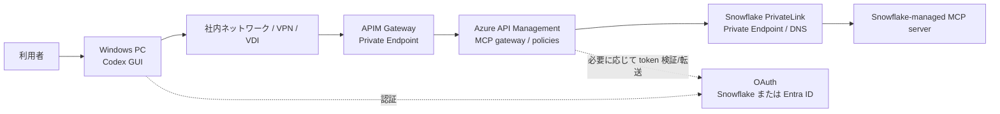

# Codex GUI から Azure API Management 経由で Snowflake MCP へ PrivateLink 接続する手順

作成日: 2026-06-19

## この資料の目的

この資料は、Windows の Codex GUI から Azure API Management、以下 APIM、を経由して Snowflake-managed MCP server にプライベート接続するための構成と手順を、初心者向けにまとめたものです。

この構成は、APIM で MCP tool 呼び出しの回数、利用者別の制限、認証、監査、ログ、タイムアウトなどを制御したい場合に使います。

## 先に知っておくべき重要事項

APIM で制御できるのは、主に Codex から Snowflake MCP server へ向かう MCP tool 呼び出しです。

Codex GUI 自体が OpenAI / ChatGPT 側で使うモデル token の消費量は、通常 APIM を通りません。そのため、この構成で直接制御できるのは次の範囲です。

- MCP tool の呼び出し回数
- MCP tool の同時実行数
- MCP tool のタイムアウト
- MCP tool の応答サイズやストリーミングに関する制御
- APIM を通る LLM API を別途使う場合の LLM token 制限

APIM の `llm-token-limit` は OpenAI Responses API、Chat Completions API、Anthropic Messages API、Google Vertex AI API などの LLM API 向けです。Snowflake MCP tool 呼び出しそのものは LLM API ではないため、Snowflake MCP への呼び出しには通常 `rate-limit-by-key` や `quota-by-key` を使います。

## 再調査後の機能判定

この APIM 経由構成は、3資料の中で Codex から安定させやすい構成です。ただし、Codex から APIM へ subscription key を送るだけでは Snowflake MCP は認証されません。APIM から Snowflake へ送る `Authorization: Bearer ...` も必ず設計してください。

| 項目 | 判定 | 理由 |
|---|---|---|
| APIM で既存 MCP server を公開 | 動く前提でよい | APIM は既存の remote MCP server を Streamable HTTP で公開、管理できます |
| Codex の `url` に APIM の MCP Server URL を設定 | 動く前提でよい | Codex は Streamable HTTP MCP server の `url` 設定に対応しています |
| `env_http_headers` で APIM subscription key を送る | APIM入口認証として有効 | Codex 公式設定にある HTTP header 環境変数方式です |
| APIM subscription key だけで Snowflake に接続 | 不十分 | subscription key は APIM 入口用であり、Snowflake の OAuth / bearer token にはなりません |
| APIM が Snowflake bearer token を付与 | 推奨 / 本命 | APIM Credential Manager または安全な Named Value / Key Vault で token を付与する設計にできます |
| Snowflake OAuth pass-through | 非推奨 / 要検証 | Snowflake-managed MCP server は Dynamic Client Registration 非対応です。現行公開Codex設定だけでは Snowflake の client secret を安全に扱う手順が明確でないため、初期構築の本線にしないでください |

最小で機能させるなら、最初のPoCでは「Codex -> APIM は subscription key」「APIM -> Snowflake は Snowflake 用 bearer token を APIM が付与」という2段構成にしてください。本番で入口認証を強める場合は「Codex -> APIM は Entra ID bearer token」「APIM -> Snowflake は APIM が Snowflake 用 token を付与」を本線にします。Snowflake OAuth pass-through は、Codex の OAuth login、APIM の Protected Resource Metadata、Snowflake の redirect URI がすべて整合することを実機検証できた場合だけ採用します。

## 全体構成



## 推奨する考え方

初心者向けには、次の順で考えると迷いにくいです。

1. Snowflake 側には Snowflake-managed MCP server を作る。
2. APIM には「既存の MCP server を公開して管理する」機能で Snowflake MCP server を登録する。
3. Codex GUI は Snowflake ではなく APIM の MCP URL を `config.toml` に登録する。
4. APIM policy で呼び出し回数、認証、ログ、タイムアウトを制御する。
5. 本番では APIM 入口を Entra ID で保護し、APIM から Snowflake へは APIM が Snowflake 用 token を付与する。
6. ユーザー単位の Snowflake 権限を維持したい場合だけ、Snowflake OAuth pass-through を別途設計検証する。

## この構成の認証パターン

| パターン | 入口認証 | Snowflake 側認証 | 推奨度 | 特徴 |
|---|---|---|---|---|
| A. 本番推奨 | Codex が APIM へ Entra ID bearer token を送る | APIM が Snowflake 用 token を付与 | 推奨 | 企業標準の入口制御にしやすく、APIM policy で認証、回数制限、監査を集中管理できます |
| B. PoC推奨 | Codex が APIM subscription key を送る | APIM が Snowflake 用 token を付与 | 推奨 | まず疎通確認しやすい構成です。Snowflake token を Codex PC に置かないため切り分けが簡単です |
| C. Codex managed OAuth + APIM PRM | Codex が APIM の OAuth / PRM フローで login | APIM が Snowflake 用 token を付与 | 高度 / 要検証 | Codex の OAuth login と APIM の Protected Resource Metadata が期待通り動くことを実機確認してから使います |
| D. Snowflake OAuth pass-through | Codex が Snowflake OAuth | APIM が Authorization header を転送 | 非推奨 / 要検証 | ユーザー別Snowflake監査を維持しやすい一方、SnowflakeのDynamic Client Registration非対応とCodex側client secret扱いが接続失敗要因になります |

最初に B で APIM から Snowflake へ届くことを確認し、その後 A に上げる進め方を推奨します。C と D は「OAuthの完成形」ではありますが、APIM、Codex、Snowflake の3者で redirect URI、client ID、scope、PRM を合わせ込む必要があるため、初期構築の本線にしないでください。

## 1. Snowflake 側の MCP server を作る

入力する画面: Snowflake Snowsight の `Worksheets`

Snowflake 側の基本設定は `01_codex_private_snowflake_mcp.md` と同じです。ここでは APIM 経由でも使える最小例だけ載せます。

```sql
-- 管理者権限で作業するため、ACCOUNTADMIN ロールに切り替えます。
USE ROLE ACCOUNTADMIN;

-- APIM 経由で使う MCP 専用ロールを作成します。
CREATE ROLE IF NOT EXISTS MCP_APIM_ROLE;

-- MCP tool 実行時に使うウェアハウスの利用権限を付与します。
GRANT USAGE ON WAREHOUSE <WAREHOUSE_NAME> TO ROLE MCP_APIM_ROLE;

-- MCP server object を置くデータベースの利用権限を付与します。
GRANT USAGE ON DATABASE <DATABASE_NAME> TO ROLE MCP_APIM_ROLE;

-- MCP server object を置くスキーマの利用権限を付与します。
GRANT USAGE ON SCHEMA <DATABASE_NAME>.<SCHEMA_NAME> TO ROLE MCP_APIM_ROLE;

-- MCP server object を作成する権限を付与します。
GRANT CREATE MCP SERVER ON SCHEMA <DATABASE_NAME>.<SCHEMA_NAME> TO ROLE MCP_APIM_ROLE;

-- Cortex Search Service を MCP tool として使う場合の利用権限です。
GRANT USAGE ON CORTEX SEARCH SERVICE <DATABASE_NAME>.<SCHEMA_NAME>.<SEARCH_SERVICE_NAME> TO ROLE MCP_APIM_ROLE;
```

MCP server object を作ります。

```sql
-- MCP server を作成するロールに切り替えます。
USE ROLE MCP_APIM_ROLE;

-- MCP server object を作るデータベースを選択します。
USE DATABASE <DATABASE_NAME>;

-- MCP server object を作るスキーマを選択します。
USE SCHEMA <SCHEMA_NAME>;

-- APIM から呼び出す Snowflake-managed MCP server を作成します。
CREATE OR REPLACE MCP SERVER APIM_PRIVATE_MCP
  -- ここから MCP tool 定義を YAML で記述します。
  FROM SPECIFICATION $$
    # 公開する tool の一覧です。
    tools:
      # APIM と Codex に表示される tool のタイトルです。
      - title: "Search internal documents"
        # Codex が tool を呼ぶための一意な名前です。
        name: "search_internal_documents"
        # tool の用途を説明します。
        description: "Search approved internal documents through a Snowflake Cortex Search Service."
        # Cortex Search Service を呼び出す tool 種別です。
        type: "CORTEX_SEARCH_SERVICE_QUERY"
        # 対象の Cortex Search Service の完全修飾名です。
        identifier: "<DATABASE_NAME>.<SCHEMA_NAME>.<SEARCH_SERVICE_NAME>"
  $$;
```

Snowflake MCP server URL の形式です。

```text
https://<snowflake_private_account_url>/api/v2/databases/<database>/schemas/<schema>/mcp-servers/APIM_PRIVATE_MCP
```

## 2. APIM のネットワークを PrivateLink 対応にする

入力する画面: Azure Portal

### 2.1 APIM の inbound private endpoint を作る

Azure Portal で操作します。

1. Azure Portal を開きます。
2. `API Management services` を開きます。
3. 対象の APIM インスタンスを選択します。
4. 左メニューの `Network` を開きます。
5. `Inbound private endpoint connections` を選びます。
6. `+ Add endpoint` を押します。
7. `Target sub-resource` は `Gateway` を選びます。
8. Codex 実行PCから到達できる VNet と Subnet を選びます。
9. Private DNS integration は有効にします。
10. 作成後、Connection state が `Approved` であることを確認します。

### 2.2 APIM から Snowflake PrivateLink へ出られるようにする

入力する画面: Azure Portal

APIM から Snowflake PrivateLink URL を呼び出すには、APIM の outbound 側も Snowflake PrivateLink に到達できる必要があります。

確認すること:

- APIM が Snowflake PrivateLink のある VNet または名前解決可能なネットワークに接続されていること。
- APIM から Snowflake account URL と OCSP URL が PrivateLink 側の IP に解決できること。
- APIM の SKU が、必要な inbound private endpoint と outbound VNet 統合をサポートしていること。

Azure Portal では、対象 APIM の `Network` 画面で `Outbound virtual network integration` または同等のネットワーク設定を確認します。

## 3. APIM に Snowflake MCP server を登録する

入力する画面: Azure Portal の APIM インスタンス

1. Azure Portal を開きます。
2. `API Management services` を開きます。
3. 対象 APIM インスタンスを選択します。
4. 左メニューの `APIs` を開きます。
5. `MCP servers` を開きます。
6. `+ Create MCP server` を押します。
7. `Expose an existing MCP server` を選びます。
8. `Backend MCP server base URL` に Snowflake MCP server URL を入力します。
9. `Transport type` は `Streamable HTTP` を選びます。
10. `Name` に `snowflake-private-mcp` などを入力します。
11. `Base path` に `snowflake-private` などを入力します。
12. 必要に応じて `Product` を関連付けます。
13. `Create` を押します。
14. 作成後、APIM の画面に表示される `Server URL` を控えます。

Codex の `config.toml` に登録するのは Snowflake URL ではなく、APIM が表示する `Server URL` です。

## 4. APIM policy で呼び出し制限を設定する

入力する画面: Azure Portal -> APIM -> `APIs` -> `MCP servers` -> 対象 MCP server -> `Policies`

次の例は、IP アドレスごとに 30 秒あたり 5 回まで MCP tool 呼び出しを許可する基本 policy です。MCP のストリーミングや長時間接続を壊さないため、レスポンス本文を policy 内で読み取らないでください。

```xml
<!-- APIM policy 全体の入れ物です。 -->
<policies>
  <!-- クライアントから APIM に入ってきた直後に実行する処理です。 -->
  <inbound>
    <!-- 既存の上位スコープ policy を継承します。 -->
    <base />

    <!-- 呼び出し元IPごとに 30 秒あたり 5 回までに制限します。 -->
    <rate-limit-by-key calls="5" renewal-period="30" counter-key="@(context.Request.IpAddress)" remaining-calls-variable-name="remainingCallsPerIP" />

    <!-- APIM からバックエンドへ送るリクエストに識別用ヘッダーを追加します。 -->
    <set-header name="x-apim-gateway" exists-action="override">
      <!-- このリクエストが APIM 経由であることを示す値です。 -->
      <value>snowflake-mcp-private</value>
    </set-header>
  </inbound>

  <!-- APIM から Snowflake MCP server へ転送する処理です。 -->
  <backend>
    <!-- 既存のバックエンド設定を継承します。 -->
    <base />
  </backend>

  <!-- Snowflake から APIM に戻ってきた直後に実行する処理です。 -->
  <outbound>
    <!-- 既存の上位スコープ policy を継承します。 -->
    <base />
  </outbound>

  <!-- エラー発生時に実行する処理です。 -->
  <on-error>
    <!-- 既存のエラー処理を継承します。 -->
    <base />
  </on-error>
</policies>
```

## 5. Entra ID OAuth で APIM 入口を保護する場合

入力する画面: Azure Portal -> Microsoft Entra ID -> App registrations

この章で扱う OAuth は、Codex から APIM に入るための Entra ID OAuth です。Snowflake 側の OAuth とは別物です。

重要: APIM は OAuth の認可サーバーではありません。利用者は Entra ID から access token を取得し、Codex はその token を `Authorization: Bearer ...` として APIM に送ります。APIM は `validate-azure-ad-token` policy で token を検証します。

安定して接続するため、最初は「Codex が Entra ID token を環境変数から送る」方式を推奨します。Codex の MCP OAuth login と APIM の Protected Resource Metadata、以下 PRM、を組み合わせる方式は高度なため、7.4 で別枠にしています。

### 5.1 Entra ID にアプリ登録を作る

アプリ登録は2種類に分けて考えると分かりやすいです。

| 種類 | 用途 | 例 |
|---|---|---|
| API / resource app | APIM の MCP API を表すアプリです。token の `aud`、scope、app role の受け皿になります | `snowflake-mcp-apim-api` |
| Client app | token を取得する側のアプリです。PoCでは Azure CLI、社内配布する場合は専用 public client / desktop app を使います | `codex-desktop-mcp-client` |

作業手順:

1. Azure Portal を開きます。
2. `Microsoft Entra ID` を開きます。
3. `App registrations` を開きます。
4. `New registration` を押します。
5. API / resource app として `snowflake-mcp-apim-api` などを作成します。
6. `Expose an API` を開き、Application ID URI を設定します。例: `api://<APIM_RESOURCE_APP_CLIENT_ID>`
7. Delegated permission の scope を作ります。例: `MCP.Access`
8. 利用者またはグループに同意、管理者同意、条件付きアクセスなど社内ポリシーを設定します。
9. Client app を使う場合は、Client app 側に API permission として `MCP.Access` を追加します。
10. `Directory (tenant) ID`、API / resource app の `Application (client) ID`、Client app の `Application (client) ID` を控えます。

PoC で Azure CLI から token を取る場合は、Azure CLI 側がこの API scope を要求できるように管理者同意が必要になることがあります。失敗する場合は、専用の public client app を作り、MSAL などで利用者にサインインさせて token を取得してください。

### 5.2 APIM policy で token を検証する

入力する画面: Azure Portal -> APIM -> `Policies`

次の policy は、APIM 入口で Entra ID access token を検証し、scope が `MCP.Access` であることを確認します。`audiences` は、実際に発行された token の `aud` に合わせてください。多くの場合は `api://<APIM_RESOURCE_APP_CLIENT_ID>` または API / resource app の client ID です。

```xml
<!-- APIM policy 全体の入れ物です。 -->
<policies>
  <!-- クライアントから APIM に入ってきた直後に実行する処理です。 -->
  <inbound>
    <!-- 既存の上位スコープ policy を継承します。 -->
    <base />

    <!-- Authorization ヘッダーに入った Microsoft Entra ID access token を検証します。 -->
    <validate-azure-ad-token tenant-id="{{entra-tenant-id}}" header-name="Authorization" output-token-variable-name="entra-jwt" failed-validation-httpcode="401" failed-validation-error-message="Unauthorized. Access token is missing or invalid.">
      <!-- token を取得する側の client app ID を指定します。Azure CLI を使うPoCでは、実際のaz tokenのappidに合わせます。 -->
      <client-application-ids>
        <application-id>{{codex-client-application-id}}</application-id>
      </client-application-ids>

      <!-- APIM MCP API 用に発行された token だけを許可します。実際の token の aud と一致させます。 -->
      <audiences>
        <audience>{{apim-mcp-api-audience}}</audience>
      </audiences>

      <!-- MCP用scopeを持つ token だけを許可します。 -->
      <required-claims>
        <claim name="scp" match="any" separator=" ">
          <value>MCP.Access</value>
        </claim>
      </required-claims>
    </validate-azure-ad-token>

    <!-- 認証済みリクエストにも接続元IPごとの呼び出し回数制限をかけます。 -->
    <rate-limit-by-key calls="30" renewal-period="60" counter-key="@(context.Request.IpAddress)" remaining-calls-variable-name="remainingCallsPerIP" />

    <!-- Entra ID token を Snowflake にそのまま送らないよう、後段で必ず Snowflake用 Authorization に上書きします。 -->
  </inbound>

  <!-- APIM から Snowflake MCP server へ転送する処理です。 -->
  <backend>
    <!-- 既存のバックエンド設定を継承します。 -->
    <base />
  </backend>

  <!-- Snowflake から APIM に戻ってきた直後に実行する処理です。 -->
  <outbound>
    <!-- 既存の上位スコープ policy を継承します。 -->
    <base />
  </outbound>

  <!-- エラー発生時に実行する処理です。 -->
  <on-error>
    <!-- 既存のエラー処理を継承します。 -->
    <base />
  </on-error>
</policies>
```

注意:

- 上記の `{{entra-tenant-id}}`、`{{codex-client-application-id}}`、`{{apim-mcp-api-audience}}` は APIM の Named Value として作成するか、実際の値に置き換えてください。
- Entra ID token は APIM 入口の認証用です。この token を Snowflake に渡しても Snowflake MCP の認証にはなりません。
- 6.1 または 6.2 の policy を同じ APIM MCP server policy に追加し、Snowflake へ送る `Authorization` ヘッダーを必ず Snowflake 用 token に上書きしてください。
- Client credentials 方式などで token に `scp` ではなく `roles` が入る設計にする場合は、`required-claims` の claim 名を `roles` に変更してください。

## 6. APIM から Snowflake へ token を渡す確実な方式

Snowflake-managed MCP server は OAuth を推奨し、Snowflake OAuth の Client ID と Client Secret を使います。また、Snowflake-managed MCP server は Dynamic Client Registration をサポートしていません。

APIM 経由で安定させるには、Codex PC に Snowflake token を置かず、APIM が Snowflake 用 token を付与する設計を本線にしてください。

### 6.1 推奨: APIM が Snowflake 用 token を付与する

この方式は、Codex 側の認証と Snowflake 側の認証を分離できます。APIM入口は subscription key または Entra ID で守り、APIM から Snowflake へ出るときだけ Snowflake 用 token を付けます。

必要なこと:

- APIM Credential Manager などで Snowflake 用 OAuth token を管理します。
- APIM policy で token を取得し、Snowflake への `Authorization` ヘッダーに設定します。
- Snowflake 側では APIM が使うユーザーまたはロールに最小権限を付与します。
- APIM 入口で受けた Entra ID token は Snowflake に流さず、Snowflake 用 token で必ず上書きします。

#### 6.1.1 Snowflake OAuth security integration を作る

入力する画面: Snowflake Snowsight の `Worksheets`

APIM Credential Manager を Snowflake OAuth の custom client として登録します。`OAUTH_REDIRECT_URI` には、APIM Credential Manager で表示される redirect URL を入れます。Microsoft の標準形式は次の形です。

```text
https://authorization-manager.consent.azure-apim.net/redirect/apim/<API-management-instance-name>
```

SQL例です。

```sql
-- 管理者権限で作業します。
USE ROLE ACCOUNTADMIN;

-- APIM Credential Manager から Snowflake OAuth token を取得するための integration です。
CREATE OR REPLACE SECURITY INTEGRATION APIM_MCP_OAUTH
  TYPE = OAUTH
  ENABLED = TRUE
  OAUTH_CLIENT = CUSTOM
  OAUTH_CLIENT_TYPE = 'CONFIDENTIAL'
  OAUTH_REDIRECT_URI = 'https://authorization-manager.consent.azure-apim.net/redirect/apim/<API-management-instance-name>'
  OAUTH_ISSUE_REFRESH_TOKENS = TRUE
  OAUTH_REFRESH_TOKEN_VALIDITY = 86400
  PRE_AUTHORIZED_ROLES_LIST = ('MCP_APIM_ROLE')
  BLOCKED_ROLES_LIST = ('SYSADMIN');

-- APIM Credential Manager に登録する client ID / client secret を確認します。
SELECT SYSTEM$SHOW_OAUTH_CLIENT_SECRETS('APIM_MCP_OAUTH');
```

注意:

- `OAUTH_REDIRECT_URI` は APIM Credential Manager の画面で表示される値と完全一致させます。
- Snowflake OAuth の scope には、必要に応じて `refresh_token session:role:MCP_APIM_ROLE` を使います。
- token endpoint は通常 `https://<snowflake_account_url>/oauth/token-request`、authorization endpoint は `https://<snowflake_account_url>/oauth/authorize` です。PrivateLinkを使う場合は、APIM から到達できる Snowflake account URL を使ってください。
- Credential Manager の connection 作成時は authorization endpoint がブラウザで開かれるため、管理者PCまたはVDIからも Snowflake OAuth endpoint に到達できる必要があります。
- APIM が token endpoint に到達できるDNS、ネットワーク、Firewall設定も確認してください。

#### 6.1.2 APIM Credential Manager に Snowflake OAuth provider を作る

入力する画面: Azure Portal -> APIM -> `Credential manager`

1. `Credential manager` を開きます。
2. `+ Create` で credential provider を作ります。
3. Identity provider は `Generic OAuth 2.0 with PKCE`、または画面上の同等の汎用OAuth providerを選びます。
4. Grant type は `Authorization code` を選びます。
5. Client ID / Client secret には Snowflake の `SYSTEM$SHOW_OAUTH_CLIENT_SECRETS` で確認した値を入れます。
6. Authorization URL は `https://<snowflake_account_url>/oauth/authorize` を入れます。
7. Token / Refresh URL は `https://<snowflake_account_url>/oauth/token-request` を入れます。
8. Scopes は `refresh_token session:role:MCP_APIM_ROLE` を入れます。
9. provider 作成後、connection を作成して Snowflake にサインインし、状態が `Connected` になることを確認します。
10. policy で使う `provider-id` と `authorization-id` を控えます。

APIM policy の考え方:

```xml
<!-- APIM Credential Manager から Snowflake 用 OAuth access token を取得します。 -->
<get-authorization-context provider-id="{{snowflake-oauth-provider-id}}" authorization-id="{{snowflake-authorization-id}}" context-variable-name="snowflake-auth" identity-type="managed" ignore-error="false" />

<!-- 取得した access token を Snowflake へ送る Authorization ヘッダーに設定します。 -->
<set-header name="Authorization" exists-action="override">
  <!-- Bearer token 形式で Snowflake へ渡します。 -->
  <value>@("Bearer " + ((Authorization)context.Variables.GetValueOrDefault("snowflake-auth"))?.AccessToken)</value>
</set-header>
```

この方式では Snowflake 側の監査上、APIM が使う Snowflake ユーザーまたはロールで実行されたように見えます。利用者個人ごとのSnowflake監査が必須の場合は、6.3 の pass-through を別途検証してください。

### 6.2 PoC: Key Vault / Named Value の固定 bearer token を付ける

最初の疎通確認だけを目的にする場合は、Snowflake 用の短時間 token または PAT を Azure Key Vault に保存し、APIM の Named Value から参照して `Authorization` ヘッダーに設定する方法もあります。これは本番の理想形ではありませんが、「APIM から Snowflake へ認証付きで到達できるか」を切り分けるには分かりやすいです。

入力する画面: Azure Portal -> APIM -> `Named values`

1. Azure Key Vault に Snowflake 用 token を保存します。
2. APIM の `Named values` で Key Vault secret を参照する値を作ります。
3. 例として Named Value 名を `snowflake-mcp-bearer-token` にします。
4. 値は `Bearer <Snowflake用token>` の形にします。
5. APIM の MCP server policy に次の `set-header` を追加します。

```xml
<!-- APIM から Snowflake へ送る Authorization ヘッダーを設定します。 -->
<set-header name="Authorization" exists-action="override">
  <!-- Key Vault 連携の Named Value から Bearer token 全体を読み込みます。 -->
  <value>{{snowflake-mcp-bearer-token}}</value>
</set-header>
```

注意:

- `snowflake-mcp-bearer-token` の値を `config.toml` に書かないでください。token は APIM / Key Vault 側で保管します。
- この方式では Snowflake 側の監査上、APIM が使う token のユーザーまたはロールで実行されたように見えます。
- token の有効期限が切れると `401 Unauthorized` になります。PoC後は Credential Manager、OAuth refresh、または社内のtoken更新運用を設計してください。

### 6.3 非推奨 / 要検証: ユーザーの Snowflake OAuth token を転送する

この方式は、ユーザーごとの Snowflake 権限と監査を維持しやすいです。ただし初期構築の本線にはしないでください。

必要なこと:

- Codex GUI が Snowflake OAuth を完了できること。
- Snowflake OAuth の client ID / client secret / redirect URI を Codex と安全に合わせられること。
- APIM が OAuth discovery / PRM / metadata を壊さず中継できること。
- APIM が `Authorization` ヘッダーを Snowflake にそのまま転送すること。

APIM policy の考え方:

```xml
<!-- クライアントから来た Authorization ヘッダーを Snowflake へ明示的に転送します。 -->
<set-header name="Authorization" exists-action="override">
  <!-- 受信した Authorization ヘッダーの値をそのまま使います。 -->
  <value>@(context.Request.Headers.GetValueOrDefault("Authorization"))</value>
</set-header>
```

この方式では、5章の Entra ID token 検証とは共存しにくくなります。APIM が入口で Entra ID token を受け、それを Snowflake に pass-through しても Snowflake では認証されません。pass-through するなら、入口token自体が Snowflake 用 token である必要があります。

## 7. Codex の config.toml に APIM MCP URL を設定する

入力する画面: Codex GUI の `Settings` -> `Configuration` -> `Open config.toml`

Codex GUI では CLI を使わず、GUI から `config.toml` を開いて MCP server を設定します。APIM が表示した MCP `Server URL` を、Snowflake URL ではなく Codex に登録します。

1. Codex GUI を開きます。
2. `Settings` を開きます。
3. `Configuration` を開きます。
4. `Open config.toml` を押します。
5. 開いた `config.toml` の末尾に、利用する認証方式に合わせて次のいずれかを追加します。
6. `config.toml` を保存します。
7. Codex GUI を完全に終了します。
8. Codex GUI を再起動します。

### 7.1 推奨: APIM subscription key を環境変数から送る

この方式は、APIM 側で subscription key、rate limit、quota、監査を扱う構成です。キーを `config.toml` に直接書かず、Windows の環境変数に入れるため、比較的安全に運用できます。

重要: この設定だけでは Snowflake 側の認証は完了しません。`APIM_SUBSCRIPTION_KEY` は Codex から APIM へ入るための鍵です。APIM から Snowflake MCP へ出ていくリクエストには、6.1、6.2、または6.3のいずれかの方法で Snowflake 用の `Authorization` ヘッダーを付けてください。これを忘れると、Codex から APIM までは届いても、Snowflake 側で `401 Unauthorized` になります。

Windows の環境変数設定画面:

1. Windows のスタートメニューで `環境変数` と検索します。
2. `環境変数を編集` を開きます。
3. ユーザー環境変数に `APIM_SUBSCRIPTION_KEY` を追加します。
4. 値に APIM の subscription key を入力します。
5. Codex GUI を完全に終了してから再起動します。

`config.toml` の設定例です。

```toml
# snowflake-apim-private という名前の MCP server 設定を追加します。
[mcp_servers.snowflake-apim-private]

# APIM が表示した MCP Server URL を指定します。
url = "https://<apim-name>.azure-api.net/<apim-mcp-path>/mcp"

# APIM_SUBSCRIPTION_KEY 環境変数の値を Ocp-Apim-Subscription-Key ヘッダーとして送ります。
env_http_headers = { "Ocp-Apim-Subscription-Key" = "APIM_SUBSCRIPTION_KEY" }

# MCP server への接続開始待ち時間を 20 秒にします。
startup_timeout_sec = 20

# MCP tool の実行待ち時間を 120 秒にします。
tool_timeout_sec = 120

# この MCP server を有効化します。
enabled = true

# APIM に接続できない場合でも Codex 自体は起動できるようにします。
required = false

# Snowflake tool を使う前に Codex が確認を出す既定動作にします。
default_tools_approval_mode = "prompt"

# Codex から使わせる tool を明示的に絞ります。
enabled_tools = ["search_internal_documents"]
```

### 7.2 検証用: APIM subscription key を config.toml に直接書く

この方式は設定が簡単ですが、`config.toml` に秘密情報が残ります。本番では 7.1 の環境変数方式を推奨します。

```toml
# snowflake-apim-private-test という名前の MCP server 設定を追加します。
[mcp_servers.snowflake-apim-private-test]

# APIM が表示した MCP Server URL を指定します。
url = "https://<apim-name>.azure-api.net/<apim-mcp-path>/mcp"

# APIM subscription key を固定ヘッダーとして送ります。
http_headers = { "Ocp-Apim-Subscription-Key" = "<APIM_SUBSCRIPTION_KEY>" }

# MCP tool の実行待ち時間を 120 秒にします。
tool_timeout_sec = 120

# この MCP server を有効化します。
enabled = true
```

### 7.3 推奨本番: APIM 入口を Entra ID bearer token で保護する場合

APIM 側を Entra ID OAuth で保護する場合は、Codex から `Authorization: Bearer ...` を送ります。Codex の `bearer_token_env_var` を使うと、環境変数の値を bearer token として送れます。

重要: 環境変数に入れる値は access token 本体だけです。`Bearer ` という文字は付けません。

Windows の環境変数設定画面:

1. Windows のスタートメニューで `環境変数` と検索します。
2. `環境変数を編集` を開きます。
3. ユーザー環境変数に `APIM_MCP_ACCESS_TOKEN` を追加します。
4. 値に APIM へ送る Entra ID access token 本体を入力します。
5. Codex GUI を完全に終了してから再起動します。

検証用に Azure CLI で token を取得する例です。

```powershell
# 社内テナントにサインインします。
az login --tenant <TENANT_ID>

# APIM MCP API 用の delegated scope で access token を取得します。
$token = az account get-access-token --scope "api://<APIM_RESOURCE_APP_CLIENT_ID>/MCP.Access" --query accessToken -o tsv

# Codex が読むユーザー環境変数に token 本体だけを保存します。
[Environment]::SetEnvironmentVariable("APIM_MCP_ACCESS_TOKEN", $token, "User")
```

注意:

- Azure CLI で上記scopeのtoken取得に失敗する場合は、Entra ID 側で API permission、管理者同意、または専用 client app の設定が不足しています。
- access token には有効期限があります。Codexを使う前に更新する運用にするか、7.4 の Codex managed OAuth + PRM を実機検証してください。
- この token は APIM 入口用です。Snowflake へ送る token は 6.1 または 6.2 の APIM policy で別途付与します。

`config.toml` の設定例です。

```toml
# snowflake-apim-private-entra という名前の MCP server 設定を追加します。
[mcp_servers.snowflake-apim-private-entra]

# APIM が表示した MCP Server URL を指定します。
url = "https://<apim-name>.azure-api.net/<apim-mcp-path>/mcp"

# APIM_MCP_ACCESS_TOKEN 環境変数の値を Authorization: Bearer として送ります。
bearer_token_env_var = "APIM_MCP_ACCESS_TOKEN"

# MCP server への接続開始待ち時間を 20 秒にします。
startup_timeout_sec = 20

# MCP tool の実行待ち時間を 120 秒にします。
tool_timeout_sec = 120

# この MCP server を有効化します。
enabled = true

# APIM に接続できない場合でも Codex 自体は起動できるようにします。
required = false

# Snowflake tool を使う前に Codex が確認を出す既定動作にします。
default_tools_approval_mode = "prompt"

# Codex から使わせる tool を明示的に絞ります。
enabled_tools = ["search_internal_documents"]
```

### 7.4 高度 / 要検証: Codex managed OAuth + APIM PRM を使う場合

Codex は、OAuth対応の Streamable HTTP MCP server に対して MCP OAuth login を実行できます。ただし APIM を OAuth 入口として使うには、APIM 側で MCP の Protected Resource Metadata、以下 PRM、や認可サーバー情報を正しく返し、Entra ID の redirect URI と Codex の callback URL を一致させる必要があります。

この方式を使う条件:

- APIM の MCP endpoint が PRM を返し、Codex が Entra ID の認可画面へ正しく誘導されること。
- Entra ID に登録する redirect URI が、Codex が実際に送る最終 `redirect_uri` と一致すること。
- Codex は `mcp_oauth_callback_url` の値をそのまま使うのではなく、server-specific callback ID を末尾に付けた URI を OAuth provider に送ります。Entra ID 側には、その「最終的なURI」を登録してください。
- 初回構築では 7.3 の `bearer_token_env_var` 方式で先に疎通を確認してください。

`config.toml` の設定例です。

```toml
# MCP OAuth のコールバック受信ポートを 4321 に固定します。
mcp_oauth_callback_port = 4321

# OAuth redirect_uri のベースURLを固定します。
# Codex はこの値に server-specific callback ID を追加して最終redirect_uriを作ります。
mcp_oauth_callback_url = "http://localhost:4321/callback"

# snowflake-apim-private-prm という名前の MCP server 設定を追加します。
[mcp_servers.snowflake-apim-private-prm]

# APIM が表示した MCP Server URL を指定します。
url = "https://<apim-name>.azure-api.net/<apim-mcp-path>/mcp"

# APIM MCP API 用のscopeです。APIM/PRM側がscopes_supportedを返す場合、Codexはサーバー広告のscopeを優先します。
scopes = ["api://<APIM_RESOURCE_APP_CLIENT_ID>/MCP.Access"]

# MCP tool の実行待ち時間を 120 秒にします。
tool_timeout_sec = 120

# この MCP server を有効化します。
enabled = true

# Snowflake tool を使う前に Codex が確認を出す既定動作にします。
default_tools_approval_mode = "prompt"
```

注意:

- この方式でも Snowflake へ渡す token は 6.1 または 6.2 で APIM が付与します。
- Codex managed OAuth を使う場合、必要に応じて `codex mcp login <server-name>` でログインします。GUI側に同等のログイン導線がある場合はそれを使います。
- Snowflake OAuth pass-through とは別方式です。ここで取得するのは APIM 入口用の Entra ID token です。
- Snowflake OAuth pass-through を行う場合は、Snowflake-managed MCP server が Dynamic Client Registration 非対応であること、Snowflakeのclient ID / client secret / redirect URIをCodex側と合わせ込む必要があることを前提に、別途実機検証してください。

## 8. APIM で token 使用量を制御したい場合の整理

### Snowflake MCP tool 呼び出し

Snowflake MCP tool 呼び出しには、通常このような制御を使います。

- `rate-limit-by-key`: 一定時間あたりの呼び出し回数を制限します。
- `quota-by-key`: 日次、月次などの総呼び出し量を制限します。
- `limit-concurrency`: 同時実行数を制限します。
- timeout 設定: 長すぎる tool 実行を止めます。
- Snowflake 側の `query_timeout`: custom tool の実行時間を制限します。

### OpenAI / Azure OpenAI などの LLM API

APIM 経由で LLM API も通す場合は、`llm-token-limit` で token per minute や月次 token quota を制御できます。

```xml
<!-- APIM policy 全体の入れ物です。 -->
<policies>
  <!-- LLM API に入ってきた直後に実行する処理です。 -->
  <inbound>
    <!-- 既存の上位スコープ policy を継承します。 -->
    <base />

    <!-- subscription ID ごとに 1 分あたり 5000 token までに制限します。 -->
    <llm-token-limit counter-key="@(context.Subscription.Id)" tokens-per-minute="5000" estimate-prompt-tokens="false" remaining-tokens-variable-name="remainingTokens" />
  </inbound>

  <!-- バックエンド LLM API へ転送する処理です。 -->
  <backend>
    <!-- 既存のバックエンド設定を継承します。 -->
    <base />
  </backend>

  <!-- LLM API からの応答後に実行する処理です。 -->
  <outbound>
    <!-- 既存の上位スコープ policy を継承します。 -->
    <base />
  </outbound>

  <!-- エラー発生時に実行する処理です。 -->
  <on-error>
    <!-- 既存のエラー処理を継承します。 -->
    <base />
  </on-error>
</policies>
```

Codex GUI のモデル通信そのものは、通常この APIM を通らないため、この `llm-token-limit` で Codex GUI の ChatGPT 利用 token を直接制御できるとは考えないでください。

## 9. 動作確認

入力する画面: Codex GUI のチャット画面

```text
APIM 経由の Snowflake MCP tool を使って、社内文書から「月次レポート」に関する情報を検索してください。更新系の操作はしないでください。
```

確認すること:

- Codex が APIM の MCP URL から tool 一覧を取得できること。
- APIM Credential Manager の Snowflake connection が `Connected` になっていること。
- APIM のメトリックでリクエストが記録されること。
- APIM trace で、Snowflake へ送る `Authorization` が Entra ID token ではなく Snowflake 用 token に上書きされていること。
- APIM の rate limit が効くこと。
- Snowflake 側で対象ロールの範囲内だけが返ること。

## トラブルシューティング

| 症状 | 原因候補 | 確認場所 |
|---|---|---|
| Codex から APIM に接続できない | APIM private endpoint の DNS が解決できない | Windows PC、社内DNS、APIM private DNS |
| APIM から Snowflake に接続できない | APIM outbound が Snowflake PrivateLink に到達できない | APIM Network、VNet、Private DNS |
| MCP streaming が壊れる | policy が response body を読んで buffering している | APIM Policies、Diagnostic settings |
| APIM で 401 Unauthorized | APIM subscription key 不足、Entra ID token 不足、有効期限切れ、`aud` / `scp` / client app ID 不一致 | Codex `config.toml`、Windows環境変数、APIM trace、Entra ID token claims |
| Snowflake で 401 Unauthorized | APIM が Snowflake 用 `Authorization` を付けていない、Entra ID token を誤ってSnowflakeへ転送している、Snowflake token 期限切れ | APIM Policies、Credential Manager、Named Values、Snowflake認証ログ |
| Credential Manager connection が Connected にならない | Snowflake OAuth redirect URI 不一致、client secret 不一致、authorization endpoint にブラウザから到達できない | APIM Credential Manager、Snowflake security integration、管理者PC/VDIのDNS |
| OAuth callback mismatch | Codex managed OAuth + PRM 利用時に、Entra ID の redirect URI が Codex の最終 `redirect_uri` と一致していない | Codex OAuth login画面 / ログ、Entra ID App registration、`mcp_oauth_callback_url` |
| Azure CLI で access token が取れない | API permission、管理者同意、scope名、テナント指定が不一致 | Entra ID App registrations、`az account show`、`az account get-access-token` |
| 429 Too Many Requests | APIM の rate limit に達した | APIM Metrics、Policies |
| token 制限が効かない | Snowflake MCP 呼び出しに LLM token policy を使っている | APIM policy 種別 |

## 参考資料

- Microsoft: [Expose and govern an existing MCP server](https://learn.microsoft.com/en-us/azure/api-management/expose-existing-mcp-server)
- Microsoft: [Secure access to MCP servers in API Management](https://learn.microsoft.com/en-us/azure/api-management/secure-mcp-servers)
- Microsoft: [validate-azure-ad-token policy](https://learn.microsoft.com/en-us/azure/api-management/validate-azure-ad-token-policy)
- Microsoft: [Configure common credential providers in credential manager](https://learn.microsoft.com/en-us/azure/api-management/credentials-configure-common-providers)
- Microsoft: [Connect privately to API Management by using an inbound private endpoint](https://learn.microsoft.com/en-us/azure/api-management/private-endpoint)
- Microsoft: [Configure API for server-sent events in Azure API Management](https://learn.microsoft.com/en-us/azure/api-management/how-to-server-sent-events)
- Microsoft: [AI gateway in Azure API Management](https://learn.microsoft.com/en-us/azure/api-management/genai-gateway-capabilities)
- Microsoft: [llm-token-limit policy](https://learn.microsoft.com/en-us/azure/api-management/llm-token-limit-policy)
- Snowflake: [Snowflake-managed MCP server](https://docs.snowflake.com/en/user-guide/snowflake-cortex/cortex-agents-mcp)
- Snowflake: [Configure Snowflake OAuth for custom clients](https://docs.snowflake.com/en/user-guide/oauth-custom)
- Snowflake: [CREATE SECURITY INTEGRATION, Snowflake OAuth](https://docs.snowflake.com/en/sql-reference/sql/create-security-integration-oauth-snowflake)
- OpenAI: [Codex MCP](https://developers.openai.com/codex/mcp)
- OpenAI: [Codex configuration reference](https://developers.openai.com/codex/config-reference)
- OpenAI: [Codex CLI reference](https://developers.openai.com/codex/cli/reference)
