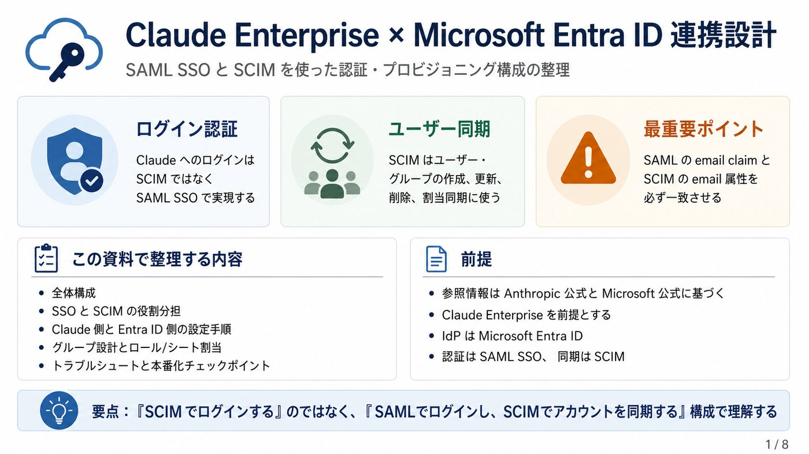
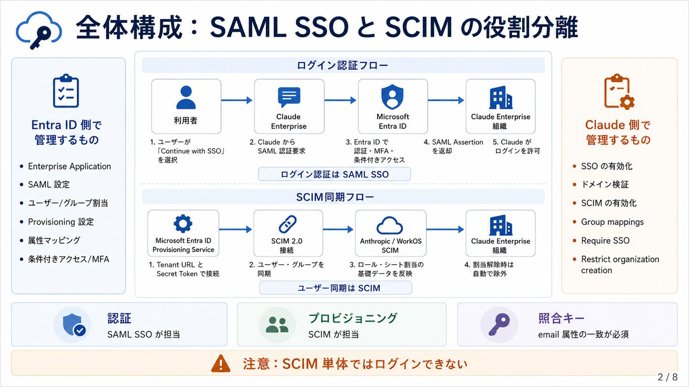
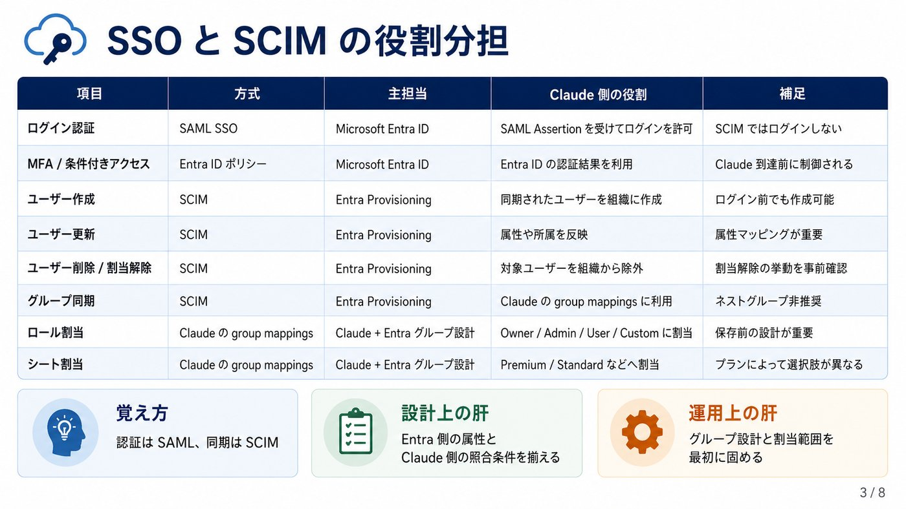
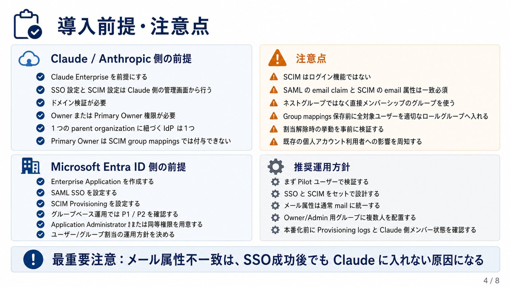
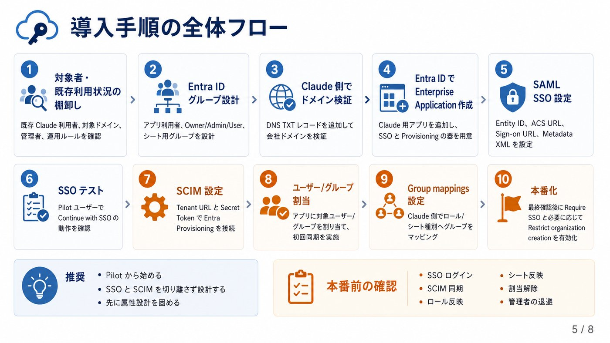
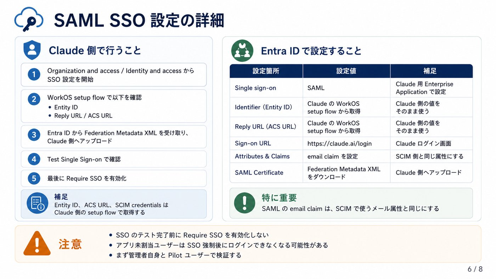
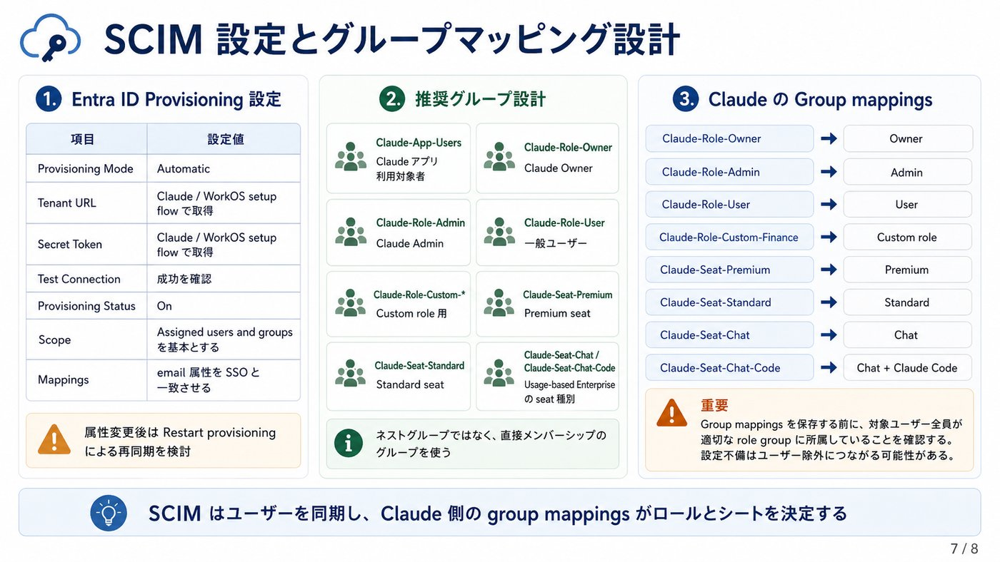
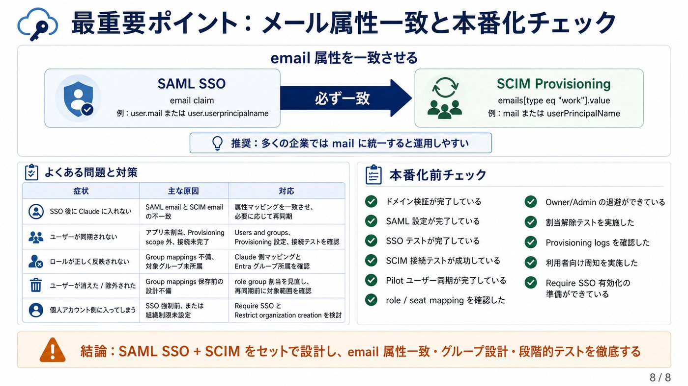

# SCIM導入

> GitHub表示用にMarkdown化し、解説画像は軽量版を参照する形にしています。

精査した結果、前回回答の大枠は正しいです。ただし、公式情報に照らすと、いくつかはより正確に修正すべきです。以下に、修正点と修正版の導入手順をまとめます。参照元は、Anthropic/Claude Help Center と Microsoft Learn の公式情報に限定しています。

## 1. 前回内容からの主な修正点

| 修正対象 | 前回の記述 | 修正版 |
| --- | --- | --- |
| 「SCIMでログイン」 | SCIMでClaudeへログインできるようにする、という文脈で説明 | ログイン認証はSAML SSO、SCIMはユーザー/グループの自動プロビジョニング。ClaudeもMicrosoftも、SCIMはアカウント作成・更新・削除/無効化の管理プロトコルとして説明している。 |
| SCIM利用条件 | Enterprise planで利用可能、と記述 | より正確には、ClaudeではEnterprise planと対象Console organizationでSCIM利用可。Team planではSCIM不可でJIT provisioningを使う。Anthropic公式もこの区分を明記している。(Claude ヘルプセンター) |
| 設定画面の場所 | Organization and access中心で記述 | Anthropic公式では、Claude側は Organization and access / Identity and access の表記が併存している。Entra ID向け手順では、Entity ID、ACS URL、SCIM credentialsはWorkOS setup flow内で取得し、Support問い合わせではないと明記されている。(Claude ヘルプセンター) |
| Entra ID側の権限 | Global AdministratorまたはApplication Administratorと記述 | Anthropicの前提は Global AdministratorまたはApplication Administrator。Microsoft Learn上では、Enterprise application追加には Cloud Application AdministratorまたはApplication Administrator、ユーザー/グループ割当にはCloud Application Administrator、Application Administrator、User Administrator、またはservice principal ownerが挙げられている。最小権限ではCloud/Application Administrator中心で設計すべき。(Claude ヘルプセンター) |
| SCIM同期頻度 | 「Entra IDは概ね40分周期」と記述 | これは概ね正しいが、より正確には、MicrosoftのSCIM非ギャラリー構成では同期プロセスが約40分間隔で動作する。一方、Anthropic側はIdPがWorkOSへpushした更新を受け、Claude Enterprise organizationがWorkOSの更新イベントを毎分pollし、通常は数分、混雑時は数時間かかる可能性がある。(Microsoft Learn) |
| Group mappingsのリスク | 「ロールグループに入っていないユーザーはプロビジョニング対象にならない」中心 | さらに厳密には、SCIM group mappingsを有効化する際、role group mappingに含まれないメンバーは削除され得る。Anthropicは、保存前に全ユーザーを適切なグループへ割り当てること、また不完全なgroup mappingsはメンバー削除につながることを警告している。(Claude ヘルプセンター) |
| デプロビジョニング | 「削除/無効化」と表現 | Claude側のSCIM directory syncでは、IdPアプリから外れたユーザーは自動的にremovedされる。一方、Microsoft Entra provisioning service一般では、対象アプリ実装によりdisable/soft-delete/deleteの挙動が変わるため、表現は「Claude側ではメンバー削除、Entra一般仕様ではdisable/deleteは対象実装依存」とするのが正確。(Claude ヘルプセンター) |
| Primary Owner | 記述は概ね正しい | 補足として、Primary OwnerはSCIM reconciliationの対象外だが、SSO enforcementの対象外ではない。Primary OwnerロールはSCIM group mappingsでは付与できず、Claude側で手動移管する必要がある。(Claude ヘルプセンター) |
| Console併用時 | 未記載 | Console organizationがTeam/Enterprise plan organizationとSSO設定を共有する場合、Claude ConsoleのIdP-initiated loginは現在サポートされず、SP-initiated loginの回避策が示されている。Consoleも対象に含む場合は注意が必要。(Claude ヘルプセンター) |

## 2. 修正版：全体構成

結論として、構成は次のように整理するのが正確です。

```text
[利用者]
│
│ 1. Claudeで「Continue with SSO」
▼
[Claude / Anthropic]
│
│ 2. SAML AuthnRequest
▼
[Microsoft Entra ID]
│
│ 3. 認証、MFA、条件付きアクセス、SAML Assertion発行
▼
[Claude]
│
│ 4. email claimをもとに、SCIMで作成済みのメンバー/シートと照合
▼
[Claude Enterprise workspace]
別経路:
[Microsoft Entra ID Provisioning Service]
│
│ SCIM 2.0 / Tenant URL / Secret Token
▼
[Anthropic / WorkOS SCIM]
│
│ ユーザー、グループ、ロール/シート割当の同期
▼
[Claude Enterprise organization]
```

Microsoft Learnでは、SSOはMicrosoft Entra IDがユーザーを認証し、SAMLなどの標準プロトコルでアプリへID情報を渡す仕組みとして説明されている。一方、SCIMは /Users と /Groups などのREST APIエンドポイントを使い、ユーザーやグループの作成・更新・削除を標準化するプロビジョニング用プロトコルとして説明されている。(Microsoft Learn)

## 3. 正しい役割分担

| 項目 | 使用技術 | 管理元 | Claude側の扱い |
| --- | --- | --- | --- |
| ログイン認証 | SAML SSO | Microsoft Entra ID | SAML assertionのemail claimでユーザーを識別 |
| MFA/条件付きアクセス | Entra ID policy | Microsoft Entra ID | Claude到達前にEntra側で制御 |
| ユーザー作成 | SCIM | Microsoft Entra provisioning | Claude/WorkOSへ自動作成 |
| ユーザー削除/割当解除 | SCIM | Microsoft Entra provisioning | Claude側メンバーから自動除外 |
| グループ同期 | SCIM | Microsoft Entra groups | Claude側group mappingsで利用 |
| ロール/シート | Claude group mappings | Entra group membership + Claude設定 | Owner/Admin/User/Custom、Premium/Standard等へ割当 |

Anthropic公式では、SAML SSO設定後に、Invite only、JIT、SCIM directory syncのいずれかを選ぶ流れになっている。SCIM directory syncは、IdP上の割当にもとづいて、ログインを待たずにユーザーを自動プロビジョニング/デプロビジョニングする方式である。(Claude ヘルプセンター)

## 4. 前提条件

### Claude / Anthropic側

Claude EnterpriseでSCIMを使う場合、SSO設定、ドメイン検証、Claude側のOwner/Primary Owner権限が必要です。Console organizationではAdmin権限が必要で、Console単体の場合はparent organizationの要件を満たす必要があります。Anthropic公式は、Enterprise planではparent organizationが自動作成され、各parent organizationは1つのIdPにのみ紐づくと説明している。(Claude ヘルプセンター)

### Microsoft Entra ID側

AnthropicのEntra ID向け公式手順では、SCIM provisioningにMicrosoft Entra ID P1/P2ライセンスが必要で、Entra側はGlobal AdministratorまたはApplication Administratorが前提とされている。Microsoft Learnでは、Enterprise application追加にはCloud Application AdministratorまたはApplication Administrator、グループベース割当にはMicrosoft Entra ID P1/P2が必要と説明されている。(Claude ヘルプセンター)

## 5. 推奨グループ設計

Entra IDでは、Claude用の直接メンバーシップグループを作る設計を推奨します。

| グループ例 | 用途 |
| --- | --- |
| Claude-App-Users | Claude Enterprise Applicationへ割り当てる全利用者 |
| Claude-Role-Owner | Claude Owner |
| Claude-Role-Admin | Claude Admin |
| Claude-Role-User | 一般User |
| Claude-Role-Custom-* | Custom roleを使う場合 |
| Claude-Seat-Premium | Premium seat |
| Claude-Seat-Standard | Standard seat |
| Claude-Seat-Chat | Usage-based EnterpriseのChat seat |
| Claude-Seat-Chat-Code | Usage-based EnterpriseのChat + Claude Code seat |

Microsoft Learnでは、アプリへのグループ割当はネストグループにカスケードせず、グループベース割当にはP1/P2が必要とされている。したがって、Claude連携用グループはネスト構造にせず、同期対象ユーザーを直接所属させる設計が安全である。(Microsoft Learn)

## 6. 修正版：設定手順

### Step 1: Claude側でドメインを検証する

ClaudeのOrganization and access、またはConsoleのIdentity and accessで対象ドメインを追加し、Anthropicが提示するTXTレコードをDNSへ追加します。Anthropic公式では、TXT値は anthropic-domain-verification- で始まり、Host/Nameはroot domainの @、既存TXTを置換せず追加、大文字小文字を含め完全一致で登録するよう説明されている。(Claude ヘルプセンター)

ドメイン検証自体は既存ユーザーのアクセスに影響しません。影響が出るのは、SSO設定後にRequire SSOを明示的に有効化した後です。(Claude ヘルプセンター)

### Step 2: Entra IDにClaude用Enterprise Applicationを追加する

Entra Admin Centerで Enterprise applications > New application に進み、Claudeを検索します。見つかればギャラリーアプリを選択し、見つからなければ Create your own application でClaude用アプリを作成します。AnthropicのEntra ID手順でも、Claudeがギャラリーに見つからない場合は独自アプリとして作成する流れが示されている。(Claude ヘルプセンター)

Microsoft Learnでも、Enterprise applicationsのGalleryからアプリを追加する流れと、必要ロールとしてCloud Application AdministratorまたはApplication Administratorが示されている。(Microsoft Learn)

### Step 3: SAML SSOを構成する

Entra IDのClaudeアプリで Single sign-on > SAML を選択し、Claude/WorkOS setup flowから取得した値をBasic SAML Configurationへ入力します。

| Entra ID設定項目 | 設定値 |
| --- | --- |
| Identifier / Entity ID | ClaudeのWorkOS setup flowから取得 |
| Reply URL / ACS URL | ClaudeのWorkOS setup flowから取得 |
| Sign-on URL | https://claude.ai/login |
| Attributes & Claims | email claimを user.mail、またはSCIM email mappingと同じ属性にする |
| Federation Metadata XML | Entra IDからダウンロードし、Claude/WorkOS setup flowへアップロード |

Anthropic公式は、Entity ID、Reply URL、SCIM credentialsはClaude側のWorkOS setup flowで提供されるもので、Support問い合わせで取得するものではないと明記している。また、email claimは user.mail、またはSCIMで使うものと同じ属性にする必要がある。(Claude ヘルプセンター)

### Step 4: SSOをテストする

Claude側のSSO setup flowでTest Single Sign-onを実行し、Entra IDに割り当てたテストユーザーでClaude組織へ入れることを確認します。Anthropic公式は、SSO enforcementを有効化すると、IdP側のAnthropicアプリに正しく割り当てられていないユーザーがログイン不能になる可能性があると警告している。(Claude ヘルプセンター)

### Step 5: Claude側でSCIM directory syncを選択する

ClaudeのUser provisioningで SCIM directory sync を選び、Setup SCIM / Manage SCIM からWorkOSのSCIM setup flowを開きます。そこで表示される Tenant URL と Secret Token をEntra IDのProvisioning設定へ入力します。Anthropic公式では、SCIMを選んだ場合、AnthropicとIdPの接続を確立してから有効化する手順になっている。(Claude ヘルプセンター)

### Step 6: Entra IDでSCIM provisioningを構成する

Entra IDのClaude Enterprise Applicationで Provisioning > Get Started に進み、Provisioning ModeをAutomaticにし、Claude/WorkOSから取得したTenant URLとSecret Tokenを入力してTest Connectionを行います。その後、Mappingsでemail属性がSSO email claimと同じ属性を参照していることを確認し、Provisioning StatusをOnにします。(Claude ヘルプセンター)

Microsoft Learnでは、SCIM対応アプリはTenant URLとSecret Token等で接続し、Test Connection、ユーザー/グループ割当、Attribute mapping、Provision on-demand、Start provisioningという流れで構成することが説明されている。同期対象を「assigned users and groups」にする場合、ユーザーやグループが未割当だとプロビジョニングされない。(Microsoft Learn)

### Step 7: ユーザー/グループをClaudeアプリに割り当てる

Entra IDのClaudeアプリで Users and groups から、Claudeを使わせるユーザーまたはグループを割り当てます。Anthropic公式では、割り当てられたpeople/groupsのみがプロビジョニングされ、SSOを許可されると説明されている。(Claude ヘルプセンター)

この時点で、ネストグループではなく直接メンバーグループを使ってください。Microsoft Learnは、アプリへのグループ割当はネストグループにカスケードしないと明記している。(Microsoft Learn)

### Step 8: Claude側でGroup mappingsを設定する

Claude側で Enable group mappings を有効化し、Entra IDから同期されたIdPグループをClaudeのroleおよびseat typeへマッピングします。Anthropic公式では、Owner/Admin/User/Customなどのrole、Premium/Standard、Chat、Chat + Claude Codeなどのseat typeがプラン種別に応じて扱われる。(Claude ヘルプセンター)

重要なのは、group mappingsを保存する前に、必要なユーザー全員をrole-based groupへ入れておくことです。Anthropic公式は、group mappingsを使う場合、全ユーザーをrole-based groupへ割り当てる必要があり、保存前の割当不備はユーザーのdeprovisioningにつながると警告している。(Claude ヘルプセンター)

### Step 9: 初回同期・手動同期・ログ確認

Entra ID側ではProvisioning logsを確認し、Claude側ではManage SCIMやMembersの表示を確認します。Microsoft Learnでは、Provisioning logsに、割当ユーザーの照会、対象アプリ上の存在確認、追加・更新・無効化など、プロビジョニングサービスの操作が記録されると説明されている。(Microsoft Learn)

Anthropic公式では、SCIMによる自動同期はIdPからWorkOSへpushされた変更をClaude側がpollして処理する構造で、通常は数分、混雑時は数時間かかる場合がある。また、role/seat mapping変更後は既存メンバーへ自動再同期されないため、Claude側のSync/Check for updatesで手動同期することが推奨されている。(Claude ヘルプセンター)

### Step 10: Require SSOとRestrict organization creationを有効化する

テスト完了後、Claude側で Require SSO for Claude を有効化します。Require SSOが有効な場合、ユーザーはClaude/Consoleログイン時に Continue with SSO を使う必要があり、SSOが必須でない場合はemail loginも選択可能です。(Claude ヘルプセンター)

ドメイン検証後は Restrict organization creation を有効化できます。これにより、検証済みドメインを使った新しいClaude/Console organizationやpersonal account作成を防げるため、企業統制上は有効化を強く推奨します。(Claude ヘルプセンター)

## 7. 最重要修正：email属性の完全一致

この案件で最も重要なのは、SAML SSOのemail claimとSCIMのemail属性を完全一致させることです。Anthropic公式は、ClaudeがSSOログインとSCIMでプロビジョニングされたseatを照合するprimary identifierとしてemailを使うと説明しており、SCIMとSSOが異なるEntra属性を参照するとログイン失敗の原因になる。(Claude ヘルプセンター)

推奨は以下です。

| 方針 | SAML email claim | SCIM mapping |
| --- | --- | --- |
| 企業メールを正とする | user.mail | mail → emails[type eq "work"].value |
| UPNを正とする | user.userprincipalname | userPrincipalName → emails[type eq "work"].value |

日本企業ではUPNが社員番号形式、内部ドメイン、またはメールアドレスと異なる形式になっていることがあるため、基本は mail に統一する方が安全です。Anthropic公式も、UPNが実メールでない場合はSCIMを mail 属性へ切り替える解決策を示している。(Claude ヘルプセンター)

属性マッピングを修正した場合は、増分同期ではなく Restart provisioningによるフル同期 が必要です。Anthropic公式は、email属性変更後はfull restartが必要で、Microsoft LearnでもRestart provisioningはwatermarkをクリアし全source objectsを再評価すると説明している。(Claude ヘルプセンター)

## 8. 本番導入時の最終チェックリスト

Claude Enterprise planで、SCIM directory syncが利用可能である。(Claude ヘルプセンター)

対象ドメインがClaude側でVerifiedになっている。(Claude ヘルプセンター)

ClaudeのWorkOS setup flowからEntity ID、ACS URL、SCIM Tenant URL、Secret Tokenを取得している。(Claude ヘルプセンター)

Entra IDのSAML email claimとSCIM emails[type eq "work"].value が同じ属性を参照している。(Claude ヘルプセンター)

Claudeアプリに割り当てるEntra IDグループは直接メンバー構成で、ネストグループに依存していない。(Microsoft Learn)

SCIM group mappingsを保存する前に、全対象ユーザーがrole-based groupに入っている。(Claude ヘルプセンター)

少なくとも1名以上、できれば複数名をOwner/Admin系グループへ入れている。(Claude ヘルプセンター)

Primary OwnerはSCIM group mappingsでは付与できないため、事前にClaude側で正しく設定している。(Claude ヘルプセンター)

Provisioning logs、Claude Members、Manage SCIM Directoryで同期状態を検証している。(Microsoft Learn)

Pilotユーザーで、SSOログイン、role反映、seat反映、割当解除時の挙動を確認している。(Claude ヘルプセンター)

Require SSO有効化前に、既存Free/Pro/Team/Maxアカウント利用者への影響を周知している。(Claude ヘルプセンター)

企業ドメインでの野良組織/個人アカウント作成を防ぐため、Restrict organization creationの有効化を検討している。(Claude ヘルプセンター)

## 9. 最終的な修正結論

前回回答は、「Entra IDでSAML SSO＋SCIMを構成する」という方向性は正しいです。修正後の最重要ポイントは次の3点です。

SCIMはログイン機能ではなく、プロビジョニング機能。ログイン認証はSAML SSOで行う。

SAML email claimとSCIM email mappingを完全一致させる。ここがズレると、ClaudeはSCIMで作成済みのseatとSSOログインを照合できない。

Group mappings保存前に、全ユーザーを適切なrole groupへ割り当てる。不完全なgroup mappingsやSCIM切替は、Claude側メンバー削除につながる可能性がある。


## 学習用解説画像

画像はGitHub表示用に軽量化しています。

### 解説画像 1/8



### 解説画像 2/8



### 解説画像 3/8



### 解説画像 4/8



### 解説画像 5/8



### 解説画像 6/8



### 解説画像 7/8



### 解説画像 8/8



