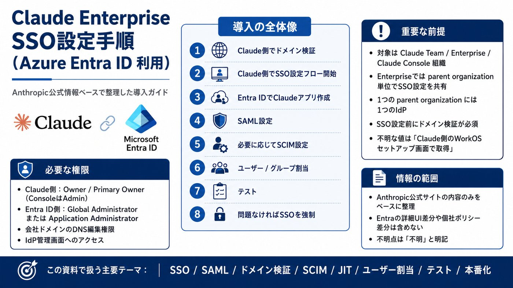
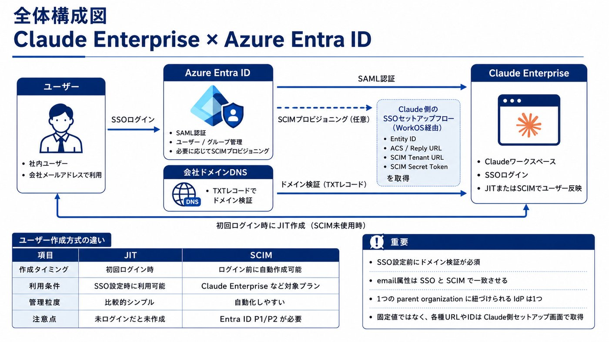
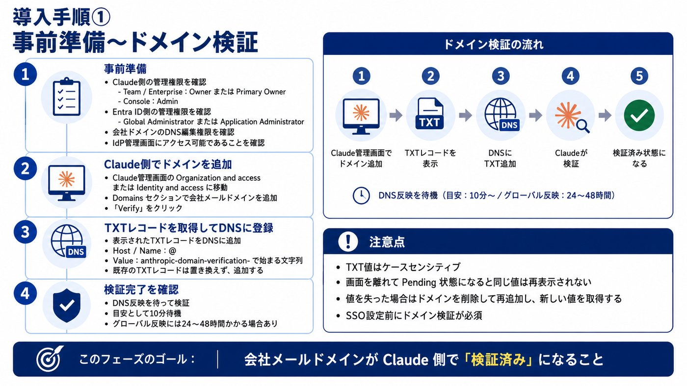
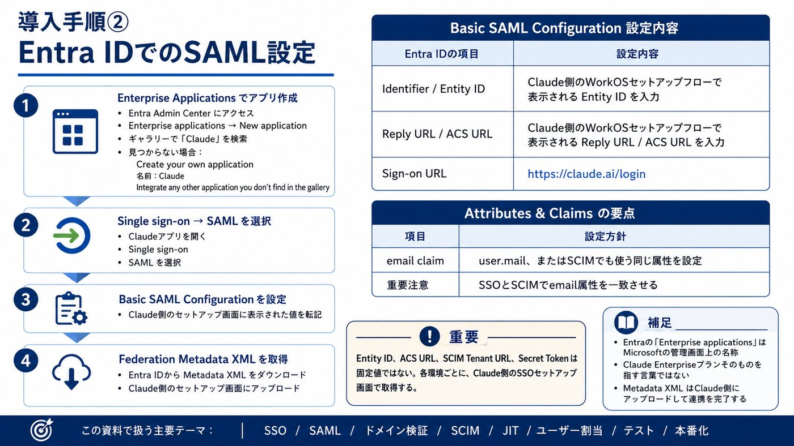
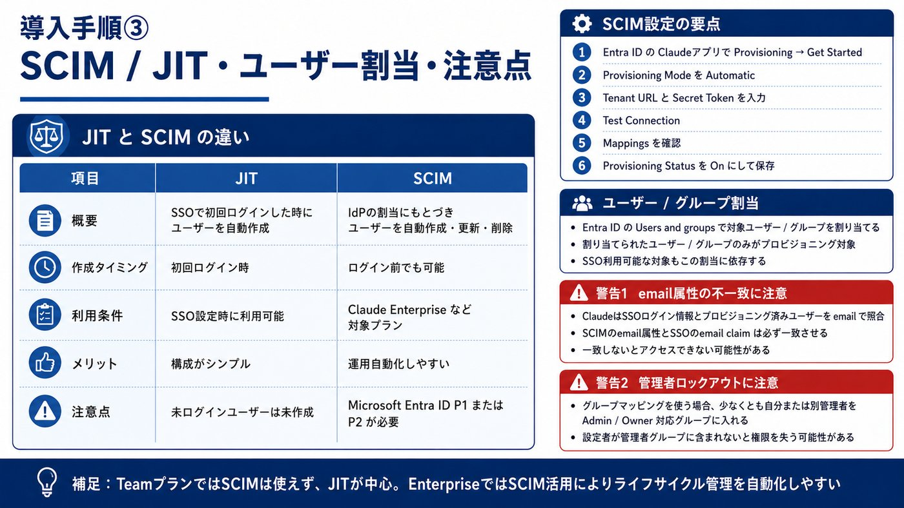
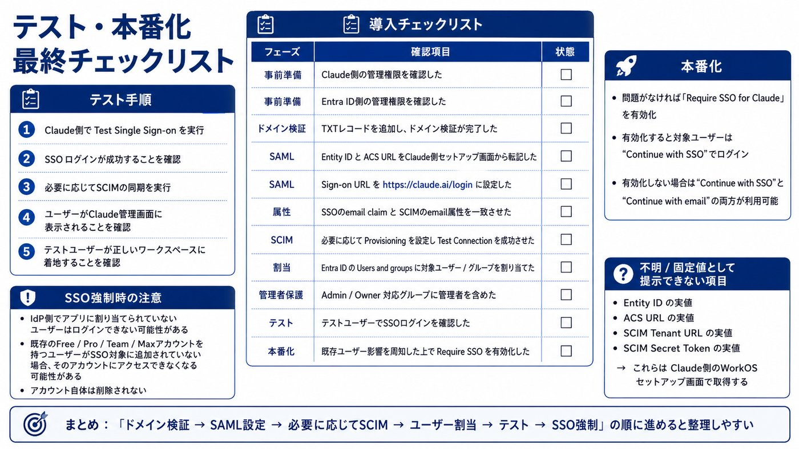

# SSO

> GitHub表示用にMarkdown化し、解説画像は軽量版を参照する形にしています。

以下は、Anthropic/Claude Help Center公式ページのみを根拠にした整理です。WorkOSやMicrosoftの外部ドキュメントは参照していません。  
結論から言うと、Claude Enterprise × Microsoft Entra ID のSSO設定は、Claude側でドメイン確認 → Claude側のSSO設定フローを開始 → EntraにClaudeアプリを作成 → SAML設定 → 必要ならSCIM → ユーザー/グループ割当 → テスト → SSO強制の順です。

## 1. 事前確認

ClaudeのSSOはTeam、Enterprise、Claude Console組織で利用できます。Enterpriseの場合、SSO設定を共有する単位である「parent organization」は組織セットアップ時に自動作成されます。また、SSO設定前にドメイン検証が必須で、1つのparent organizationには1つのIdPしか紐づけられません。複数のClaude/Console組織を同じparent organizationにリンクして、同じドメイン検証・SSO設定を共有することは可能です。(Claudeヘルプセンター)

必要な権限は、Claude Team/EnterpriseではOwnerまたはPrimary Owner、Claude ConsoleではAdminです。加えて、会社メールドメインのDNS設定にアクセスできること、会社のIdPにアクセスできることが前提です。Anthropicの公式手順では、ドメイン検証とSSO設定のセットアップフローにWorkOSが使われると説明されています。(Claudeヘルプセンター)

Entra ID側では、Anthropic公式のEntra専用手順により、Global Administrator または Application Administrator権限が必要です。SCIMプロビジョニングを使う場合は、Microsoft Entra ID P1またはP2ライセンスが必要とされています。(Claudeヘルプセンター)

## 2. Claude側でドメインを検証する

Claudeの管理画面で、Team/Enterpriseの場合はOrganization and access設定、Consoleの場合はIdentity and access設定に進み、Domainsセクションで会社メールドメインを追加します。公式手順では、ドメインを追加後に「Verify」をクリックし、表示されたTXTレコードをDNSに登録します。TXTレコードのHost/Nameは@、Valueはanthropic-domain-verification-で始まる文字列です。既存のTXTレコードは置き換えず、追加する形で登録します。(Claudeヘルプセンター)

注意点として、TXT値はケースセンシティブで、画面を離れてPending状態になると同じ値は再表示されません。値を失った場合はドメインを削除して再追加する必要があり、その場合は新しい値が生成されます。DNS反映は公式手順では10分待つよう案内されていますが、グローバル反映には24〜48時間かかる場合があるとされています。(Claudeヘルプセンター)

## 3. Claude側でSSO設定フローを開始する

ClaudeのOrganization and access、またはIdentity and access設定で、Authenticationセクションの**“Setup SSO”または“Manage SSO”を開きます。Entra IDに入力するEntity ID、Reply URL / ACS URL、SCIM用のTenant URLとSecret Token**は、このClaude側のWorkOSセットアップフロー内で提供されます。Anthropic公式手順では、これらの値はSupportに問い合わせるものではなく、セットアップフロー内で取得すると説明されています。(Claudeヘルプセンター)

ここで重要なのは、Entity IDやACS URLは固定値として公開されていない点です。環境ごとにClaude側のSSOセットアップ画面から取得してください。

## 4. Entra IDでClaudeアプリを作成する

Entra Admin Centerで、Enterprise applications → New applicationに進みます。ギャラリーで“Claude”を検索し、利用可能であれば選択します。見つからない場合は、Create your own applicationを選び、名前を“Claude”にします。その後、Integrate any other application you don’t find in the galleryを選んで作成します。(Claudeヘルプセンター)

公式手順上の補足として、Entraの「Enterprise applications」はMicrosoft側の管理画面の名称であり、ClaudeのEnterpriseプランとは別概念です。(Claudeヘルプセンター)

## 5. Entra IDでSAML SSOを設定する

作成したClaudeアプリで、Single sign-on → SAMLを選択します。Basic SAML Configurationには、Claude側のWorkOSセットアップフローに表示された値を使います。

| Entra IDの項目 | 入力する値 |
| --- | --- |
| Identifier / Entity ID | Claude側WorkOSセットアップフローのEntity ID |
| Reply URL / ACS URL | Claude側WorkOSセットアップフローのReply URL / ACS URL |
| Sign-on URL | https://claude.ai/login |

Attributes & Claimsでは、email claimがuser.mail、またはSCIMでも使う同じ属性を送るように設定します。その後、EntraからFederation Metadata XMLをダウンロードし、Claude側のWorkOSセットアップフローにアップロードします。(Claudeヘルプセンター)

## 6. 必要に応じてSCIMプロビジョニングを設定する

SCIMはClaude Enterpriseプランおよび対象のConsole組織で利用可能です。TeamプランではSCIMは使えず、JITプロビジョニングを使う形になります。JITは、IdPアプリに割り当てられたユーザーが初回ログイン時に自動作成される方式です。SCIMは、IdP側の割当に基づき、ログイン前でもユーザーの作成・削除を自動化できます。(Claudeヘルプセンター)

SCIMを使う場合、EntraのClaudeアプリでProvisioning → Get Startedに進み、Provisioning ModeをAutomaticにします。Tenant URLとSecret TokenはClaude側のWorkOSセットアップフローから取得し、Entraに入力します。その後、Test Connectionで接続確認を行い、Mappingsでemail属性がSSOのemail claimと同じフィールド、通常はuser.mailを指すようにします。最後にProvisioning StatusをOnにして保存します。(Claudeヘルプセンター)

特に重要なのは、SCIMのemail属性とSSOのemail claimを完全一致させることです。Anthropic公式トラブルシューティングでは、ClaudeはSSOログインとプロビジョニング済みシートをemailで照合し、SCIMとSSOで異なるEntra属性を使うとアクセス不可になると説明されています。(Claudeヘルプセンター)

## 7. Entra IDでユーザー・グループを割り当てる

EntraのClaudeアプリで、Users and groupsからClaudeにアクセスさせるユーザーまたはグループを割り当てます。Anthropic公式手順では、割り当てられたユーザー・グループのみがプロビジョニングされ、SSO利用を許可されるとされています。(Claudeヘルプセンター)

ロールやシート種別をIdPグループで制御したい場合は、Claude側でgroup mappingsを有効化します。この場合、IdP側でロールごとのグループを作成し、少なくとも自分を含む1名はAdminまたはOwner相当のグループに入れておく必要があります。設定者がAdmin/Ownerに対応するグループに入っていないと、権限がUserに下がり管理アクセスを失う可能性があります。(Claudeヘルプセンター)

## 8. テストする

Claude側のSSOセットアップの最後で、Test Single Sign-onを実行して設定エラーがないことを確認します。SCIMを有効化した場合は、プロビジョニングサイクルを実行し、ユーザーがClaudeの管理画面に表示されることも確認します。さらに、テストユーザーでSSOログインし、個人アカウントではなく、対象のClaude組織ワークスペースに着地することを確認します。(Claudeヘルプセンター)

## 9. 問題なければSSOを強制する

Claude側のAuthenticationセクションで、Require SSO for Claudeをオンにすると、対象ユーザーは“Continue with SSO”でログインする必要があります。Require SSOをオンにしない場合は、“Continue with SSO”と“Continue with email”の両方を選べます。(Claudeヘルプセンター)

SSO強制は慎重に行ってください。公式手順では、IdP側のAnthropicアプリに正しく割り当てられていないユーザーはログインできなくなる可能性があると警告されています。また、既存のFree/Pro/Team/Maxアカウントを持つユーザーがSSOアプリに追加されていない場合、Require SSO for Claudeを有効にすると、それらのアカウントにアクセスできなくなるが、アカウント自体は削除されないと説明されています。(Claudeヘルプセンター)

## 導入時の実務チェックリスト

| フェーズ | 確認項目 |
| --- | --- |
| 事前準備 | Claude側でOwner/Primary Owner権限がある |
| 事前準備 | Entra側でGlobal AdministratorまたはApplication Administrator権限がある |
| 事前準備 | 対象メールドメインのDNS TXTレコードを追加できる |
| ドメイン検証 | anthropic-domain-verification-で始まるTXT値を完全一致で登録した |
| SAML | Entity IDとACS URLをClaude側WorkOSフローから転記した |
| SAML | Sign-on URLをhttps://claude.ai/loginにした |
| Claims | email claimとSCIM email属性を同じEntra属性にした |
| SCIM | EnterpriseプランでSCIMを使う場合、Entra ID P1/P2ライセンスを確認した |
| 割当 | EntraのUsers and groupsに対象者を割り当てた |
| 管理者保護 | 自分または別管理者をOwner/Admin対応グループに入れた |
| テスト | Require SSOをオンにする前にテストユーザーでSSO成功を確認した |
| 本番化 | 既存ユーザーへの影響を周知してからRequire SSOをオンにした |

## 不明・固定値として提示できない点

Anthropic公式情報だけでは、各社環境のEntity ID、ACS URL、SCIM Tenant URL、Secret Tokenの実値は確認できません。これらはClaude側のWorkOSセットアップフロー内で取得する値です。(Claudeヘルプセンター)

また、Anthropic公式情報だけでは、Entra ID管理画面の最新UI差分、条件付きアクセス、MFAポリシー、証明書有効期限の個別設定値までは確認できません。SSO証明書をローテーションまたは期限更新する場合は、Claude/ConsoleのAuthenticationセクションでManage SSOを開き、Metadata configurationを編集して証明書情報を更新し、Test sign-inで確認する、という範囲までが公式手順で確認できる内容です。(Claudeヘルプセンター)

## 学習用解説画像

画像はGitHub表示用に軽量化しています。

### 解説画像 1/6

### 解説画像 2/6

### 解説画像 3/6

### 解説画像 4/6

### 解説画像 5/6

### 解説画像 6/6

