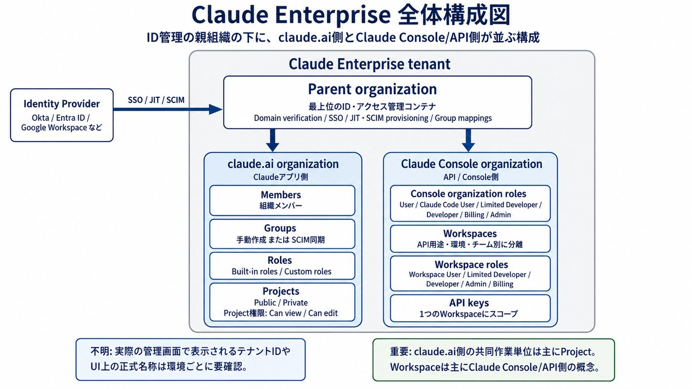
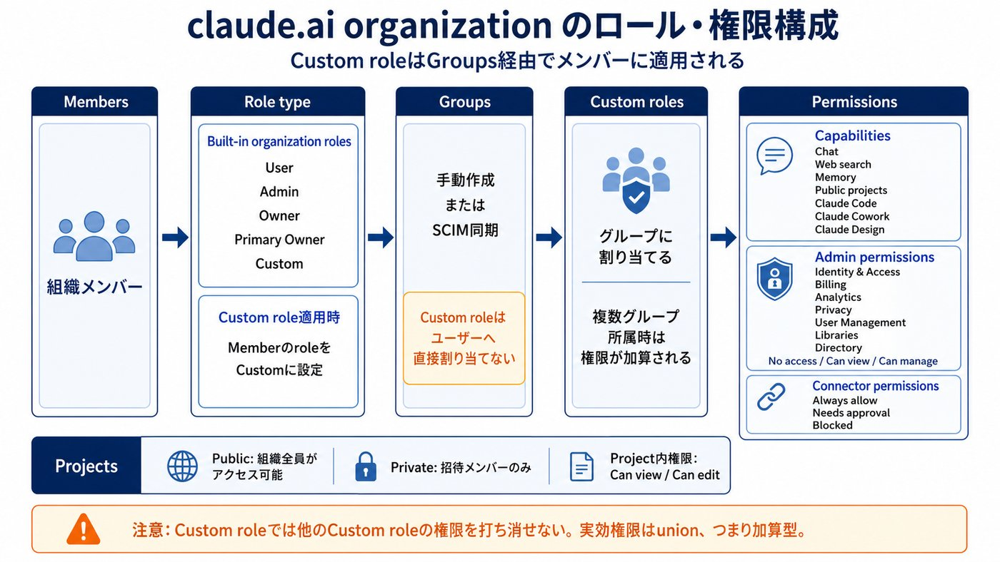
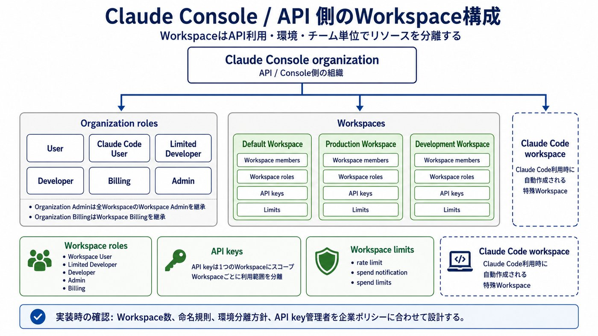
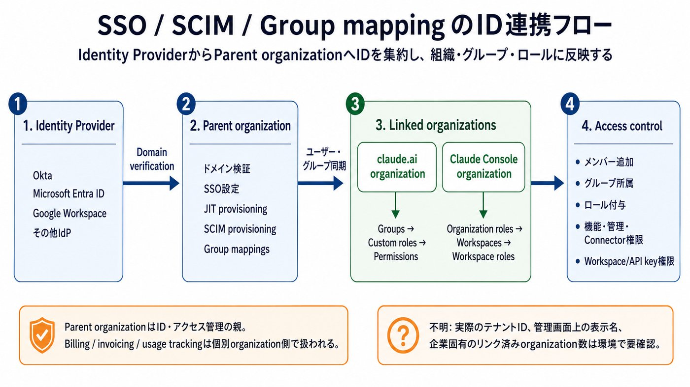
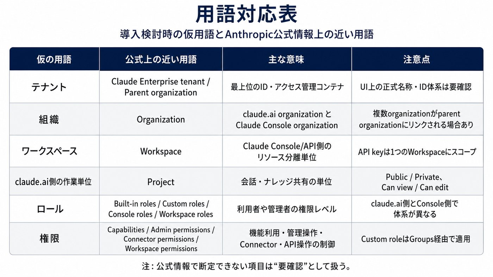
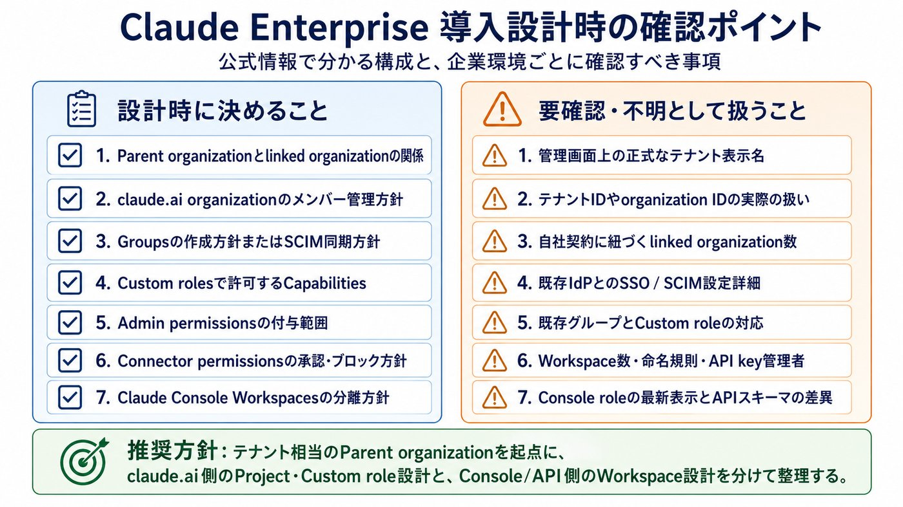

# 構成図

> GitHub表示用にMarkdown化し、解説画像は軽量版を参照する形にしています。

以下は、Anthropic / Claude公式情報のみを基にした構成図です。公式上は「テナント」に近い最上位概念として Claude Enterprise tenant と parent organization が使われており、その配下に claude.ai organization と Claude Console organization がリンクされます。Claude Console 側に Workspaces があり、claude.ai 側の共同作業単位は主に Projects です。(Claude Platform)

## 構成図

```text
flowchart TB
IDP["Identity Provider<br/>Okta / Entra ID / Google Workspace など"]
subgraph TENANT["Claude Enterprise tenant"]
PARENT["Parent organization<br/>最上位のID・アクセス管理コンテナ<br/>Domain verification / SSO / JIT・SCIM provisioning / group mappings"]
subgraph CLAUDEAI["claude.ai organization<br/>Claudeアプリ側"]
MEMBERS["Members<br/>組織メンバー"]
BUILTIN["Built-in organization roles<br/>User / Admin / Owner / Primary Owner<br/>＋ Custom"]
GROUPS["Groups<br/>手動作成 または SCIM同期<br/>部門・職種・用途単位"]
CUSTOMROLES["Custom roles<br/>グループに割り当てる<br/>※ユーザーへ直接割り当てない"]
CAPS["Capabilities<br/>Chat / Web search / Memory / Public projects<br/>Claude Code / Claude Cowork / Claude Design など"]
ADMINPERMS["Admin permissions<br/>Identity & Access / Billing / Analytics / Privacy<br/>User Management / Libraries / Directory"]
CONNECTORS["Connector permissions<br/>Always allow / Needs approval / Blocked"]
PROJECTS["Projects<br/>Public: 組織全員<br/>Private: 招待メンバーのみ<br/>Project内権限: Can view / Can edit"]
end
subgraph CONSOLE["Claude Console organization<br/>API / Console側"]
CONSOLE_ROLES["Console organization roles<br/>User / Claude Code User / Limited Developer<br/>Developer / Billing / Admin"]
WORKSPACES["Workspaces<br/>Default Workspace + 追加Workspace<br/>API用途・環境・チーム別に分離"]
WS_ROLES["Workspace roles<br/>Workspace User / Limited Developer<br/>Developer / Admin / Billing"]
API_KEYS["API keys<br/>1つのWorkspaceにスコープ"]
LIMITS["Workspace limits<br/>rate limit / spend notification・limits"]
CC_WS["Claude Code workspace<br/>Claude Code利用時に自動作成される特殊Workspace"]
end
PARENT --> CLAUDEAI
PARENT --> CONSOLE
end
IDP -->|"SSO / JIT / SCIM / group mappings"| PARENT
MEMBERS --> BUILTIN
MEMBERS -->|"role = Custom の場合"| GROUPS
GROUPS --> CUSTOMROLES
CUSTOMROLES --> CAPS
CUSTOMROLES --> ADMINPERMS
CUSTOMROLES --> CONNECTORS
CLAUDEAI --> PROJECTS
CONSOLE --> CONSOLE_ROLES
CONSOLE --> WORKSPACES
WORKSPACES --> WS_ROLES
WORKSPACES --> API_KEYS
WORKSPACES --> LIMITS
WORKSPACES --> CC_WS
```

## 用語対応

| 仮の用語 | 公式上の近い用語 | 説明 |
| --- | --- | --- |
| テナント | Claude Enterprise tenant / Parent organization | Enterprise tenant は 1つの parent organization を持ち、parent organization はIDを集約します。配下に claude.ai organization と Claude Console organization がリンクされます。(Claude Platform) |
| 組織 | Organization | claude.ai 側の organization と Claude Console 側の organization があり、複数 organization が同じ parent organization にリンクされる場合があります。(Claude Platform) |
| ワークスペース | Workspace | 公式上の Workspace は主に Claude Console/API 側の概念です。APIキー、メンバー、リソース制限をWorkspace単位に割り当てます。(Claude Platform) |
| claude.ai側の作業単位 | Project | claude.ai の会話・ナレッジ共有単位は Project です。Public / Private の可視性と、Can view / Can edit のプロジェクト権限があります。(Claude ヘルプセンター) |
| ロール | Built-in roles / Custom roles / Console roles / Workspace roles | claude.ai組織、Console組織、Workspaceでロール体系が分かれます。(Claude ヘルプセンター) |
| 権限 | Capabilities / Admin permissions / Connector permissions / Workspace permissions / Project permissions | Custom roleでは機能、管理領域、Connectorを制御します。WorkspaceではAPIキー・Workbench・Workspace管理などを制御します。(Claude ヘルプセンター) |

## 重要な読み取りポイント

Parent organization は“ID管理の親”で、課金・利用量は個別 organization 側。  
Parent organization はドメイン検証、SSO設定、ユーザープロビジョニングを管理します。一方、billing / invoicing / usage tracking は個別 organization レベルで扱われます。(Claude ヘルプセンター)

claude.ai Enterprise の Custom role はユーザーに直接ではなく、Groups経由で効く。  
典型フローは「Custom role作成 → Groupsに割り当て → MemberのroleをCustomに設定」です。Custom roleの対象メンバーは、グループに割り当てられたCustom roleでアクセスが決まります。(Claude ヘルプセンター)

Custom role の有効権限は加算型。  
1人が複数グループに所属し、それぞれ別のCustom roleを持つ場合、権限は union、つまり足し合わせで有効になります。あるroleで別roleの権限を打ち消すことはできません。(Claude ヘルプセンター)

Custom roleで制御できる範囲は3系統。  
機能権限は Chat、Memory、Web search、Public projects、Claude Code、Claude Cowork、Claude Designなど。管理権限は Identity & Access、Billing、Analytics、Privacy、User Management、Libraries、Directory management などで、レベルは No access / Can view / Can manage です。Connector権限は Always allow / Needs approval / Blocked で、組織全体の tool policy を超えて広げることはできません。(Claude ヘルプセンター)

Claude ConsoleのWorkspaceはAPIリソース分離用。  
WorkspaceはAPI利用を組織内で分離する仕組みで、API keysは単一Workspaceにスコープされます。Workspace roleは Workspace User / Limited Developer / Developer / Admin / Billing です。Organization Admin は全WorkspaceのWorkspace Adminを継承し、Organization BillingはWorkspace Billingを継承します。(Claude Platform)

## 不明・要確認として扱うべき点

「テナント」というUI表示名やテナントIDの扱い：公式ドキュメントでは “Claude Enterprise tenant” という説明はありますが、管理画面で顧客が直接見る正式フィールド名・ID体系まではこの調査範囲では断定できません。実装時は Compliance API / Admin API / 管理画面で確認してください。(Claude Platform)

Claude Consoleのロール数：公式Help Centerは Console role を6種類として “Limited Developer” を含めています。一方、Admin APIの説明では organization-level role を5種類として記載している箇所があります。API自動化を行う場合は、対象エンドポイントの最新スキーマと実際のConsole表示で照合が必要です。(Claude ヘルプセンター)

自社固有の構成：実際の linked organizations、Workspace数、Group名、Custom role名、Connector設定、契約上の例外設定は組織ごとに異なるため、公式一般情報だけでは不明です。


## 学習用解説画像

画像はGitHub表示用に軽量化しています。

### 解説画像 1/6



### 解説画像 2/6



### 解説画像 3/6



### 解説画像 4/6



### 解説画像 5/6



### 解説画像 6/6



