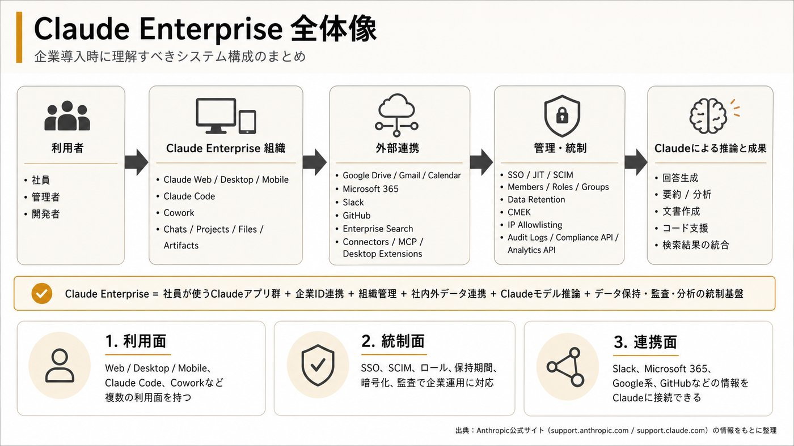
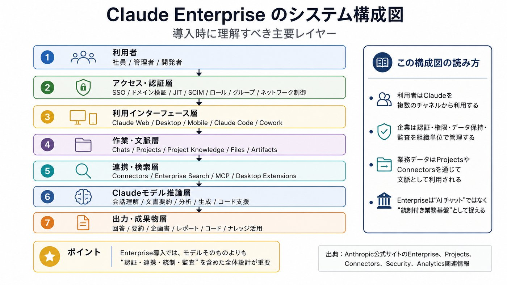
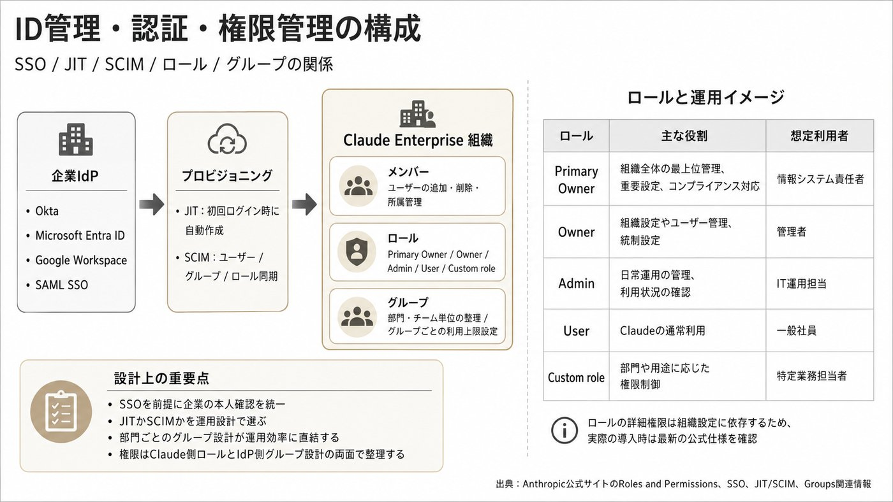
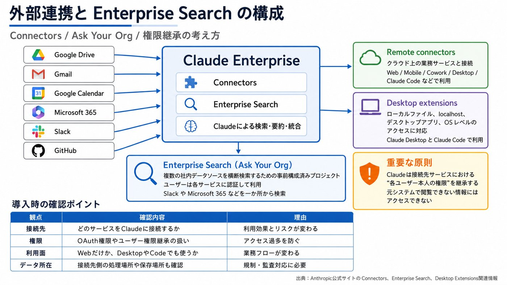
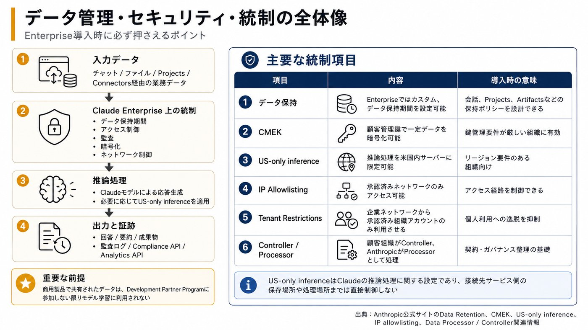
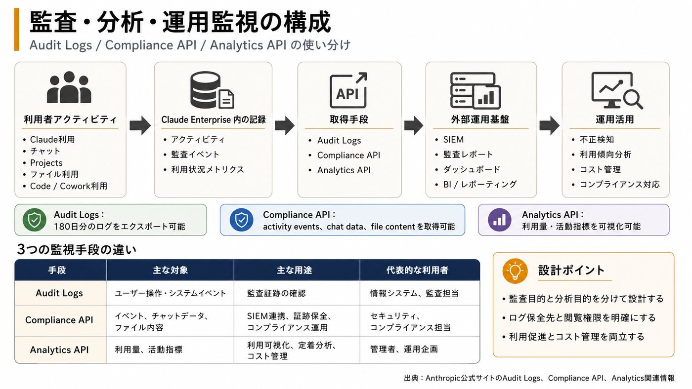
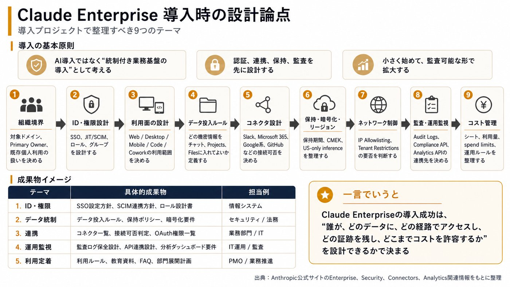

# 構成概要

> GitHub表示用にMarkdown化し、解説画像は軽量版を参照する形にしています。

以下は、Anthropic公式情報だけを前提にした、Claude Enterpriseの企業導入向け「論理構成」です。Anthropic内部の詳細なクラウド基盤構成ではなく、導入・運用側が理解すべき全体像として整理します。

## 1. まず全体像

Claude Enterpriseは、単なるチャットAIではなく、Claude利用画面、組織管理、ID管理、外部サービス連携、データ管理、監査・分析APIを含む企業向けSaaSとして捉えるのが適切です。Enterpriseプランは、高度なセキュリティ、コンプライアンス管理、チーム横断でのスケーラブルなAI利用を必要とする組織向けに位置づけられています。(Claude ヘルプセンター)

```text
社員・開発者
│
│ SSO / JIT / SCIM / ロール / グループ / ネットワーク制御
▼
Claude Enterprise 組織
├─ 利用面: Claude Web / Desktop / Mobile
├─ 開発面: Claude Code
├─ 作業面: Claude Cowork
├─ 文脈層: Chats / Projects / Files / Artifacts / Project Knowledge
├─ 連携層: Connectors / Enterprise Search / MCP / Desktop Extensions
├─ 管理層: Members / Roles / Groups / Spend limits / Org settings
└─ 監査層: Audit logs / Compliance API / Analytics API / Data export
│
▼
Claudeモデルによる推論
│
▼
回答、ファイル、コード、ドラフト、分析結果など
```

## 2. 主要コンポーネント

| 層 | 役割 | 導入時に見るポイント |
| --- | --- | --- |
| 利用インターフェース | 社員がClaudeを使う入口。Web、Desktop、Mobileに加え、Claude CodeやCoworkも含まれる | どの利用面を許可するか。Desktop展開、Claude Code利用、Cowork利用を部門別に制御するか |
| 組織・管理層 | Enterprise組織、メンバー、ロール、グループ、課金・利用量、機能設定を管理 | Owner / Primary Owner / Admin / User / Custom roleの設計 |
| ID・アクセス管理 | SSO、ドメイン検証、JIT、SCIMで企業IdPと連携 | Okta、Microsoft Entra ID、Google Workspace等との接続、退職者の自動無効化、部門別ロール割当 |
| 文脈・作業データ層 | Chats、Projects、Project Knowledge、Files、Artifactsなど | 機密情報投入ルール、プロジェクト共有範囲、保持期間 |
| 外部連携層 | Google Drive、Gmail、Google Calendar、GitHub、Microsoft 365、Slackなどと接続 | どのコネクタを許可するか、OAuth権限、第三者サービス側のデータ処理範囲 |
| モデル・実行層 | Claudeモデルがプロンプト、ファイル、コネクタ経由の情報をもとに推論 | モデル選択、US-only inference、コード実行、ローカルアクセス可否 |
| セキュリティ・データ統制層 | データ保持、CMEK、IP allowlisting、Tenant Restrictions、監査ログ | 規制要件、社内DLP、監査証跡、鍵管理、データ保持期間 |
| 監査・分析API層 | Compliance API、Analytics API、Audit logs、Admin API | SIEM連携、利用状況可視化、コスト管理、証跡取得 |

## 3. 利用者側の構成

利用者は、ClaudeをWeb、Desktop、Mobileで使えます。Enterpriseの新しい単一シートでは、Claude on web/desktop/mobileに加えて、Claude CodeとCoworkも含まれるとされています。(Claude ヘルプセンター)

通常の業務利用では、社員はチャット、ファイルアップロード、Projects、Artifacts、Enterprise Search、Connectorsなどを使います。Projectsは、個別のチャット履歴とナレッジベースを持つ自己完結型ワークスペースで、文書、テキスト、コード、その他ファイルをアップロードして文脈として使えます。(Claude ヘルプセンター)

開発者向けにはClaude Codeがあります。Claude Codeは、ターミナルまたは対応IDEからClaudeモデルへアクセスし、複雑なコーディングタスクを透明性と制御を保ちながら委任するためのツールです。(Claude ヘルプセンター)

## 4. 管理者側の構成

Enterprise管理者は、組織単位でメンバー、ロール、グループ、利用量、コネクタ、データ保持、監査、分析を管理します。Enterpriseでは、監査ログ、SCIM、カスタムデータ保持、Compliance API、Analytics API、CMEK、US-only inferenceなどのセキュリティ・コンプライアンス機能が含まれます。(Claude ヘルプセンター)

ロールは非常に重要です。Enterpriseのセキュリティ・データ制御では、SSO/auth管理、監査ログ要求、データ保持制御、フィードバック設定などはOwnerまたはPrimary Ownerが扱う管理領域として整理されています。(Claude ヘルプセンター)

さらにEnterpriseではグループを使い、部門・チーム単位でメンバーを論理的に整理できます。グループにはカスタムロールや利用上限を紐づけられ、SCIM経由でIdPからグループ同期することもできます。(Claude ヘルプセンター)

## 5. ID管理・認証の構成

企業導入では、最初にドメイン検証、SSO、ユーザープロビジョニングを設計します。SSOはTeam、Enterprise、Claude Console組織で利用可能で、設定には会社ドメインのDNS管理権限とIdPへのアクセスが必要です。(Claude ヘルプセンター)

プロビジョニング方式は主に、招待制、JIT、SCIMです。JITはTeam/Enterprise/Consoleで利用でき、SCIMはEnterprise/Consoleで利用可能です。SSO設定後、ユーザーをどのように組織へ追加・削除・ロール付与するかを決めます。(Claude ヘルプセンター)

実務上は、以下のように設計します。

```text
企業IdP
├─ SAML SSO
├─ JIT: 初回ログイン時に自動作成
└─ SCIM: ユーザー・グループ・ロールを同期
▼
Claude Enterprise組織
├─ メンバー
├─ グループ
├─ カスタムロール
└─ 利用上限・機能制御
```

## 6. 外部サービス連携の構成

Claude Enterpriseの価値は、社内の業務データとつなげられる点にあります。Connectorsは、Claudeがアプリやサービスにアクセスし、データを取得し、接続先サービス内でアクションを実行できる仕組みです。重要なのは、Claudeは接続先サービスにおける各ユーザー本人の権限を継承する点です。ユーザーが元システムで見られないファイル、チャンネル、レコードにはClaudeもアクセスできません。(Claude ヘルプセンター)

Enterpriseの公式説明では、Google Drive、Gmail、Google Calendar、GitHub、Microsoft 365、Slackなどへの接続により、手動アップロードなしで既存の文書、メール、カレンダー、チームコミュニケーションから文脈を取得できるとされています。(Claude ヘルプセンター)

連携方式は大きく2種類です。Remote connectorsはクラウドサービス向けで、Web、Mobile、Cowork、Desktop、Claude Codeなど複数のClaude利用面で使えます。一方、Desktop extensionsはローカルファイル、localhost上のDB、デスクトップアプリ、OSレベルのアクセスが必要な場合に使い、Claude DesktopとClaude Codeで利用されます。(Claude ヘルプセンター)

## 7. Enterprise Searchの構成

Enterprise Searchは、組織のナレッジソースを横断検索するための専用プロジェクトです。公式には「Ask Your Org」という事前構成済みプロジェクトとして説明されており、Slack、Microsoft 365など複数データソースを一か所から検索するためのワークスペースです。Ownerが初期セットアップし、ユーザーは各サービスに認証して利用します。(Claude ヘルプセンター)

つまり、Enterprise Searchは「社内検索エンジンそのもの」というより、Claude上に作られる組織横断ナレッジ検索用の専用作業空間です。

## 8. データ・セキュリティの構成

Claude for Work、つまりTeam/Enterpriseでは、商用契約上、顧客組織がユーザーデータのControllerであり、AnthropicはそのProcessorとしてClaudeサービス提供のために処理します。Anthropicは、商用製品で共有されたデータを、Development Partner Programへ参加しない限りモデル学習に使わないと説明しています。(Claude ヘルプセンター)

データ保持については、Enterpriseでカスタム保持期間を設定できます。対象は会話データやプロジェクトデータで、保持期間を過ぎるとチャット、Artifacts、Projectsなどが削除対象になります。デフォルトでは、カスタム保持期間を設定しない限りデータは無期限保持と説明されています。(Claude ヘルプセンター)

より厳格な管理が必要な場合、適格なEnterprise組織ではCMEKを使い、AWS KMS、Google Cloud KMS、Azure Key Vault上の顧客管理鍵で、チームのチャット、プロジェクト、ファイルなどの一定データを暗号化できます。(Claude ヘルプセンター)

また、Usage-based EnterpriseではUS-only inferenceを有効にすると、Claudeが回答生成する際の推論処理を米国内サーバーに限定できます。ただし、これは推論処理の場所に関する設定であり、SlackやGoogle Driveなど接続先サービスの処理場所やデータ保存場所までは制御しません。(Claude ヘルプセンター)

## 9. 監査・可視化の構成

Enterpriseでは監査ログが利用できます。Audit logsはEnterprise組織専用で、OwnerまたはPrimary Ownerが直近180日分のログをエクスポートできます。ログにはユーザー操作、システムイベント、データアクセスに関する情報が含まれますが、チャットやプロジェクトのタイトル・内容は監査ログそのものには含まれず、識別子として扱われます。(Claude ヘルプセンター)

Compliance APIを有効化すると、Enterprise Primary Ownerはactivity feed events、chat data、file contentをプログラムで取得できるようになります。監査ログイベントもCompliance APIに含まれるため、セキュリティ・コンプライアンス基盤やSIEMに取り込む設計が可能です。(Claude ヘルプセンター)

利用状況については、Analytics画面とAnalytics APIがあります。Claude.ai、Claude Code、Coworkの利用・活動指標を確認でき、Enterpriseでは同じメトリクスをダッシュボードやレポートツールへプログラム連携できます。(Claude ヘルプセンター)

## 10. 導入時に特に押さえるべき設計論点

Claude Enterprise導入では、次の順で整理すると抜け漏れが少ないです。

組織境界の設計  
どのドメインをClaude Enterpriseに紐づけるか、既存個人アカウントをどう扱うか、Primary Ownerを誰にするか。

ID・権限設計  
SSO必須化、JIT/SCIM、IdPグループ同期、Claude側ロール・カスタムロール・グループ設計。

利用面の設計  
Claude Web/Desktop/Mobile、Claude Code、Cowork、Claude Design、Enterprise Searchなどを誰に許可するか。

データ投入ルール  
チャット、ファイル、Projects、Artifacts、Project Knowledgeにどの機密区分の情報を入れてよいか。

コネクタ設計  
Google、Microsoft 365、Slack、GitHubなどを許可するか。OAuthスコープ、ユーザー権限継承、第三者サービス側の処理場所を確認する。

保持・暗号化・リージョン設計  
カスタムデータ保持、CMEK、US-only inference、データエクスポート、削除ポリシーを決める。

ネットワーク制御  
IP allowlistingで承認済みネットワークからのアクセスに限定するか、Tenant Restrictionsで企業ネットワークから個人アカウント利用を防ぐか。IP allowlistingはEnterprise専用、Tenant Restrictionsは企業ネットワークから承認済み組織アカウントだけを使わせる制御です。(Claude ヘルプセンター)

監査・運用監視  
Audit logs、Compliance API、Analytics APIをどの監査基盤・可視化基盤へ連携するか。

コスト管理  
Enterpriseではアクセス用のシート費とは別に、Claude、Claude Code、Coworkの利用量が標準APIレートに基づいて課金される形態が説明されています。管理者は組織・ユーザー単位でspend limitsを設定できます。(Claude ヘルプセンター)

## まとめ

Claude Enterpriseの構成は、次の一文で理解できます。

Claude Enterprise = 社員が使うClaudeアプリ群 + 企業IdP連携 + 組織管理 + 社内外データ連携 + Claudeモデル推論 + データ保持・暗号化・監査・分析の統制基盤

導入案件では、単に「Claudeを使えるようにする」だけでなく、誰が、どの端末・機能から、どのデータへ、どの権限でアクセスし、その利用履歴をどう監査し、どれだけのコスト上限で運用するかを設計することが中核になります。


## 学習用解説画像

画像はGitHub表示用に軽量化しています。

### 解説画像 1/7



### 解説画像 2/7



### 解説画像 3/7



### 解説画像 4/7



### 解説画像 5/7



### 解説画像 6/7



### 解説画像 7/7



