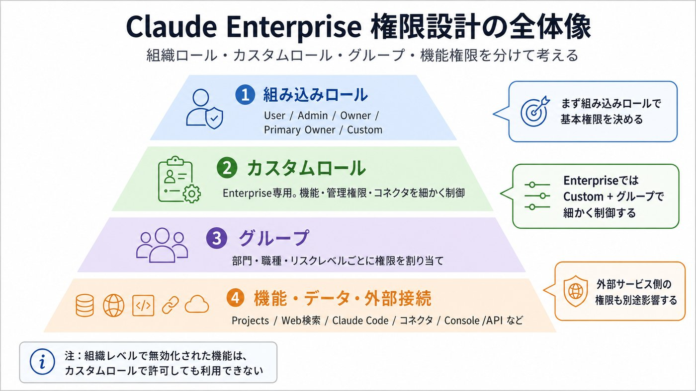
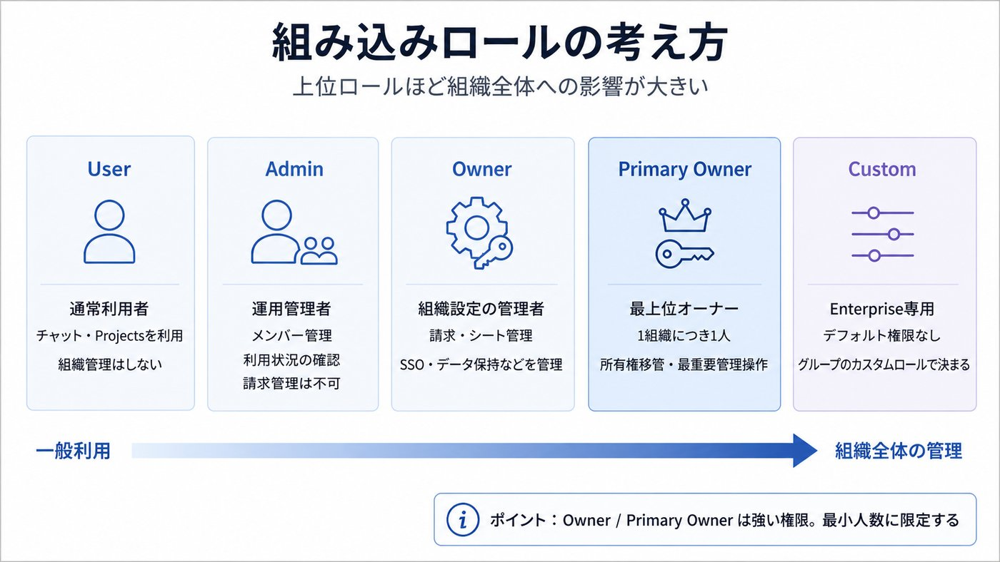
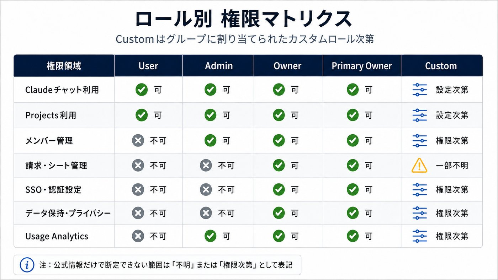
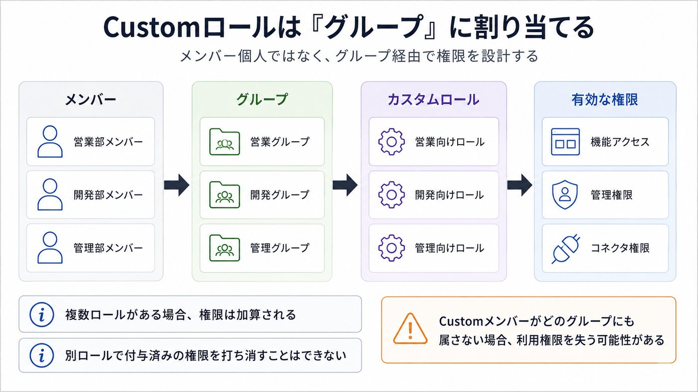
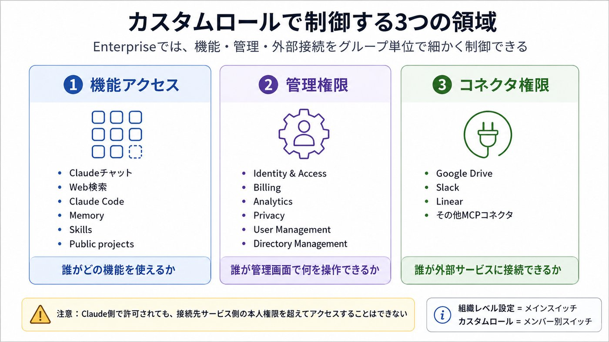
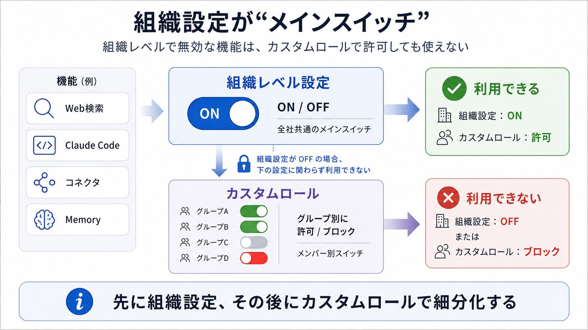
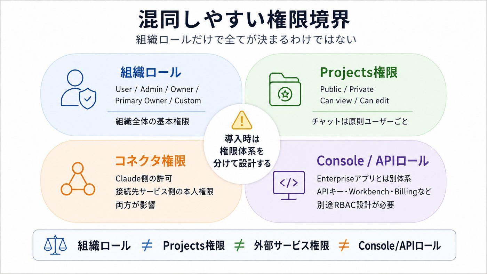
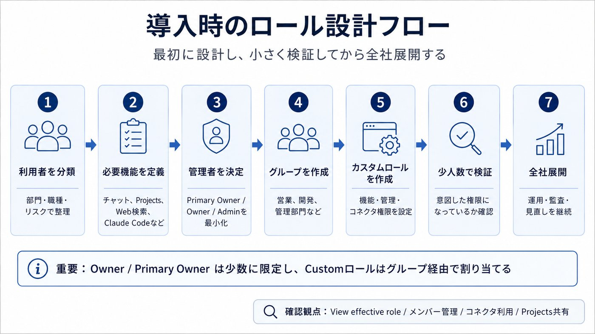
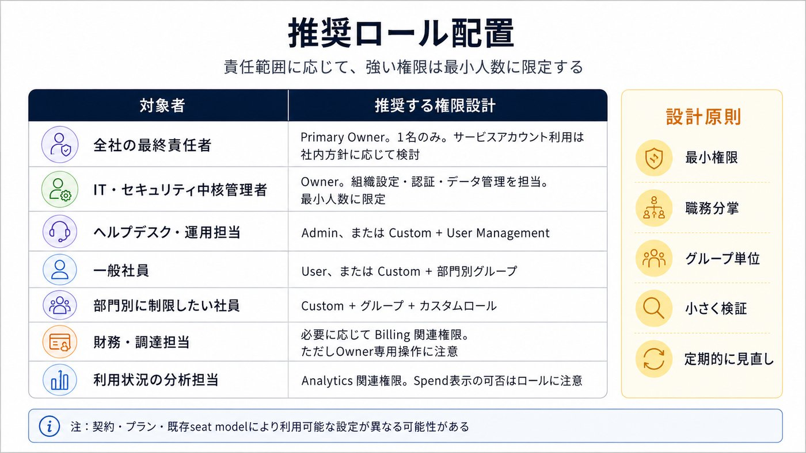
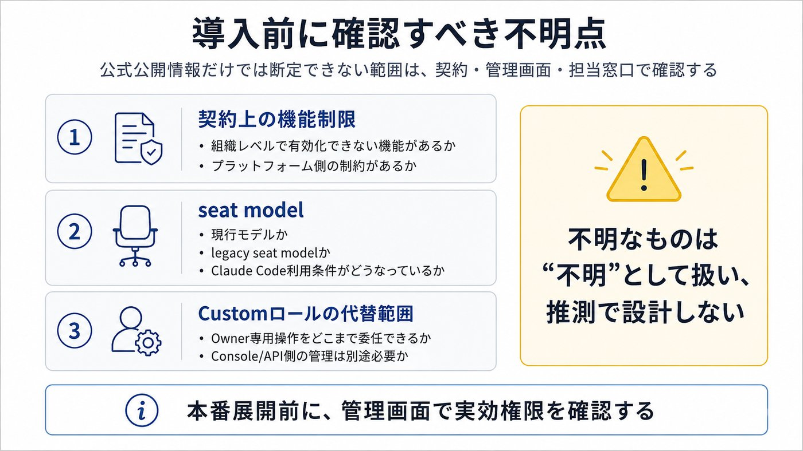

# 組織管理ロール

> GitHub表示用にMarkdown化し、解説画像は軽量版を参照する形にしています。

以下は 2026年6月30日時点で確認できるAnthropic公式情報のみに基づく整理です。対象は主に Claude Enterprise / Claude for Work の組織管理ロールです。なお Claude Console/API側のロールは別体系なので、最後に分けて説明します。

## 1. まず全体像：Claude Enterpriseの権限は「4層」で考える

Claude Enterpriseの権限設計は、だいたい次の4層です。

| 層 | 何を決めるか | 重要ポイント |
| --- | --- | --- |
| 組み込みロール | User / Admin / Owner / Primary Owner / Custom | 組織全体の基本権限を決める |
| カスタムロール | 機能、管理権限、コネクタ利用可否 | Enterpriseのみ。グループ単位で割り当てる |
| グループ | 部門・チーム単位のアクセス制御 | カスタムロールはメンバー個人ではなくグループに割り当てる |
| 機能・コネクタ・プロジェクト単位の権限 | Web検索、Claude Code、コネクタ、Projectsなど | 組織設定、カスタムロール、外部サービス側の権限が重なる |

Anthropic公式では、Team/Enterpriseではロールが「個人が組織内で何を見られるか、何をできるか」を決めると説明されています。Enterpriseではさらにカスタムロールにより、グループ単位でより細かく機能アクセスを制御できます。(Claudeヘルプセンター)

## 2. 組み込みロールの意味

### User：一般利用者

User は通常のClaude利用者です。チャットの作成・変更、Projectsの利用は可能です。(Claudeヘルプセンター)  
一方で、メンバー管理、請求、SSO、データ保持、監査ログなどの組織管理機能は通常担当しません。

導入時の扱いとしては、ほとんどの一般社員はまずUser相当、または後述のCustomロールで制御するのが基本です。

### Admin：運用管理者

Admin は、メンバー管理を担当できる運用管理者です。Anthropic公式では、Organization Admins が Organization settings > Members でメンバーを管理できるとされています。Admins以上はメンバー追加、招待リンク作成、CSVエクスポートなどが可能です。(Claudeヘルプセンター)

ただし、請求ページへのアクセスはOwner / Primary Ownerのみと明記されています。つまりAdminは日常的なユーザー運用には使いやすい一方、請求・契約・高度な組織設定まで任せるロールではありません。(Claudeヘルプセンター)

EnterpriseではAdminはUsage Analyticsを見られますが、Spend、つまり支出関連の分析は見られません。(Claudeヘルプセンター)

### Owner：組織オーナー

Owner は、組織設定・請求・シート購入・高度な管理設定を担当する強い権限のロールです。Anthropic公式では、OwnerとPrimary OwnerのみがEnterpriseのシート購入やBillingアクセスを行えるとされています。(Claudeヘルプセンター)

また、組織レベルの機能トグル、インテグレーション、SSO・SAML、データ保持、監査ログ、フィードバック設定などのセキュリティ／データ管理系は、Owner / Primary Ownerが中心です。(Claudeヘルプセンター)

導入時は、Ownerを多く配りすぎないのが重要です。実務上はIT管理部門、セキュリティ管理者、導入責任者など、組織全体の設定を変更してよい少数者に限定する設計が安全です。

### Primary Owner：最上位オーナー

Primary Owner は組織に1人だけ存在する最上位の所有者です。Anthropic公式では、Primary Ownerは1組織につき1人のみ、ライセンスを消費し、サービスアカウントにすることも可能とされています。(Claudeヘルプセンター)

Primary Ownerの移管は現在のPrimary Ownerが実施できます。(Claudeヘルプセンター)  
また、データエクスポートやPrimary Ownership transfer requestなど、最上位の管理操作に関係します。(Claudeヘルプセンター)

導入案件では、Primary Ownerを誰にするかはかなり重要です。個人退職・異動リスクを避けるため、公式に可能とされているサービスアカウント利用を検討対象に入れる価値があります。ただし、実際にサービスアカウントを使うかは顧客のID管理・監査方針に合わせて判断してください。

### Custom：Enterprise専用のカスタム制御用ロール

Custom はEnterprise専用です。Customに設定されたメンバーは、デフォルト権限を持たず、所属グループに割り当てられたカスタムロールによってアクセス権が決まります。(Claudeヘルプセンター)

ここがEnterprise導入で最も重要です。  
User / Admin / Owner / Primary Owner はロール自体が権限を持ちますが、Customメンバーは グループ + カスタムロール で権限を付与します。

## 3. 権限マトリクスのざっくり整理

| 領域 | User | Admin | Owner | Primary Owner | Custom |
| --- | --- | --- | --- | --- | --- |
| Claudeチャット利用 | 可 |   | 可 |   | カスタムロール次第 |
| Projects利用 | 可 |   | 可 |   | カスタムロール次第 |
| メンバー追加・管理 | 不可 | 可 |   | 可 | User Management権限次第 |
| Admin / Ownerロール変更 | 不可 |   | 可 |   | 公式上、カスタム管理権限の対象外の可能性あり |
| 請求ページアクセス | 不可 |   | 可 |   | Billing権限次第。ただしOwner専用項目あり |
| シート購入 | 不可 |   | 可 |   | 不明。公式上はOwner / Primary Ownerのみと明記 |
| Usage Analytics | 不可 | 可、Spend除く | 可 |   | Analytics権限次第 |
| SSO / SAML / 認証設定 | 不可 |   | 可 |   | Identity & Access権限次第 |
| データ保持・プライバシー設定 | 不可 |   | 可 |   | Privacy権限次第 |
| カスタムロール管理 | 不可 |   | 可 |   | Identity & Access “Can manage” 次第 |

上表のうち、Custom列は注意が必要です。Anthropic公式では、カスタム管理権限は「Ownerにせずに一部の管理権限を委任できる」と説明されていますが、Owner/Admin管理、APIキーやClaude Console管理、コンプライアンス／セキュリティキー、組織レベルのcapability設定などはカスタム管理権限の対象外とされています。(Claudeヘルプセンター)

## 4. カスタムロールで制御できるもの

Enterpriseのカスタムロールでは、大きく3種類を制御します。

### 4.1 機能アクセス

公式ページで例示されている機能には、Claudeチャット、コード実行・ファイル作成、Memory、Web search、Public projects、Skills、Claude Code、Fast mode、Claude Code dynamic workflows、Claude Security、Claude Code artifacts、Claude Design、Claude Cowork、Claude for Chromeなどがあります。(Claudeヘルプセンター)

重要なのは、組織レベルで無効化された機能は、カスタムロールで許可しても使えないという点です。公式は、組織レベルの設定が「メインスイッチ」、カスタムロールが「メンバー別スイッチ」だと説明しています。(Claudeヘルプセンター)

### 4.2 管理権限

カスタムロールでは、以下の管理領域に対して No access / Can view / Can manage のようなアクセスレベルを設定できます。公式で挙げられている領域は、Identity & Access、Billing、Analytics、Privacy、User Management、Libraries、Directory Managementです。(Claudeヘルプセンター)

特に Identity & Access の Can manage は強い権限です。公式は、この権限を持つ人がグループやロールを作成・編集でき、自分自身のアクセスを拡張できる可能性があるため、信頼できるセキュリティ／IT管理者に限定すべきと注意しています。(Claudeヘルプセンター)

### 4.3 コネクタ権限

カスタムロールでは、コネクタやツールの利用可否も制御できます。公式では、ブロックされたコネクタはユーザーに表示されず、ブロックされたツールはグレーアウトされ、「not enabled for your role」のような表示になると説明されています。(Claudeヘルプセンター)

ただし、コネクタはClaude側の権限だけで完結しません。Claudeは接続先サービス、たとえばSlack、Google Drive、Linearなどにおける本人の権限を継承します。接続元サービスで見られないファイル、チャンネル、レコードにはClaudeもアクセスできません。(Claude ヘルプセンター)

## 5. グループ設計が重要

カスタムロールはメンバー個人ではなく グループに割り当てる 仕組みです。複数のカスタムロールが割り当てられた場合、権限は加算、つまりunionになります。あるロールで付与された権限を、別のロールで打ち消すことはできません。(Claudeヘルプセンター)

したがって、導入時は次の順序が安全です。

部門・職種・リスクレベルごとにグループを設計する

グループごとに必要な機能を決める

カスタムロールを作る

グループにカスタムロールを割り当てる

対象メンバーの組織ロールをCustomにする

“View effective role” で実際に有効な権限を確認する

公式でも、Customメンバーがどのグループにも所属していない、またはグループにカスタムロールが割り当てられていない場合、管理権限や製品アクセスを失うと説明されています。(Claudeヘルプセンター)

## 6. Projectsの権限は組織ロールとは別に考える

Projectsには Public と Private があります。Public projectは組織内の全員が閲覧・利用でき、Private projectは招待されたメンバーのみがアクセスできます。(Claude ヘルプセンター)

Private project内では、プロジェクトメンバーに Can view または Can edit のような権限を設定できます。Can viewは閲覧中心、Can editはプロジェクトのinstructions、knowledge、メンバー設定などを変更できます。(Claude ヘルプセンター)

また、Projectを共有してもチャット履歴が自動共有されるわけではありません。Project内のチャットはデフォルトでは非公開で、ユーザーが明示的に共有した場合のみスナップショットとして共有されます。(Claude ヘルプセンター)

## 7. Enterprise導入時のおすすめ設計

実務上は、次のように分けると説明しやすいです。

| 対象 | 推奨ロール設計 |
| --- | --- |
| 全社の最終責任者 | Primary Owner。1名のみ。サービスアカウント可否も検討 |
| IT・セキュリティの中核管理者 | Owner。ただし最小人数 |
| ヘルプデスク・ユーザー運用担当 | Admin、またはCustom + User Management |
| 一般社員 | UserまたはCustom |
| 部門別に機能制限したい社員 | Custom + グループ + カスタムロール |
| 財務・調達担当 | 必要に応じてCustom + Billing view/manage。ただしOwner専用操作に注意 |
| 分析担当 | Custom + Analytics view、またはEnterprise Admin |

Anthropic公式は、RBACを導入する前に、必要な権限、グループ、カスタムロールを設計し、メンバーCSVをバックアップし、少人数のパイロットで確認してから拡大する手順を推奨しています。(Claudeヘルプセンター)

## 8. API Consoleのロールは別物

Claude Enterpriseの組織ロールと、Claude Console/APIのロールは混同しない方がよいです。公式では、Claude Consoleには User、Claude Code User、Limited Developer、Developer、Billing、Admin という別のロール体系があると説明されています。(Claude ヘルプセンター)

APIキー管理、Workbench、使用量・コスト、Billing、Workspace管理などはConsole側のロールで制御されます。Enterpriseアプリ側のOwner/Admin設計とは別に、API利用がある企業ではConsole側のRBACも設計対象にしてください。(Claude ヘルプセンター)

## 9. 不明・要確認事項

公式公開情報だけでは、次は断定できません。

| 項目 | 状態 |
| --- | --- |
| 対象企業の契約にプラットフォームレベルの機能制限があるか | 不明。公式は、契約上のoverrideにより管理画面で変更できない機能があり得ると説明しています。(Claudeヘルプセンター) |
| 対象企業が現行の単一Enterprise seat modelか、legacy seat modelか | 不明。公式は、既存顧客にはChat / Chat + Claude Code、Standard / Premiumなどのlegacy seat modelが存在すると説明しています。(Claudeヘルプセンター) |
| CustomロールでOwner専用操作をどこまで代替できるか | 一部不明。公式はカスタム管理権限で多くの管理操作を委任できる一方、Owner/Admin管理、Claude Console、セキュリティキー、組織レベルcapability設定などは対象外としています。(Claudeヘルプセンター) |

まとめると、Claude Enterpriseでは Owner / Primary Ownerは組織全体の強権限、Adminはユーザー運用、CustomはEnterprise向けの細粒度制御 と捉えるとわかりやすいです。導入案件では、最初から全員をUserで入れるより、部門・職種・リスクに応じたグループ設計とCustomロール設計を先に作るのが安全です。

◆◆◆◆◆◆◆◆◆◆◆◆◆◆◆◆◆◆◆◆◆◆◆◆◆◆◆◆◆◆◆◆◆◆◆◆◆◆◆◆◆◆◆◆◆◆◆◆◆◆◆◆◆◆◆◆◆◆◆◆◆◆◆◆◆◆◆◆◆◆◆◆◆◆◆◆◆◆◆◆◆◆◆◆◆◆◆◆◆◆◆◆◆◆

以下のように、導入説明用にそのまま使いやすい形で整理できます。

## 1. 組み込みロール一覧

| ロール | 位置づけ | 主なできること | 主な制限・注意点 | 推奨対象 |
| --- | --- | --- | --- | --- |
| User | 一般利用者 | Claudeチャット、Projectsなどの通常利用 | 組織管理、請求、SSO、メンバー管理は不可 | 一般社員 |
| Admin | 運用管理者 | メンバー追加・招待・削除、利用状況確認など | 請求管理や高度な組織設定は基本的に不可 | ヘルプデスク、IT運用担当 |
| Owner | 組織管理者 | 請求、シート管理、SSO/SAML、データ保持、監査ログ、組織設定など | 強権限のため付与対象を絞るべき | IT管理者、セキュリティ管理者、導入責任者 |
| Primary Owner | 最上位オーナー | Owner権限に加え、最終的な所有者としての管理操作 | 1組織に1人のみ。退職・異動リスクに注意 | 契約・管理責任者、または管理用サービスアカウント |
| Custom | Enterprise専用の細粒度制御用ロール | グループに割り当てたカスタムロールに応じて機能・管理権限を付与 | グループ未所属、またはロール未割当だと利用権限を失う可能性あり | 部門別・職種別に権限を分けたい社員 |

根拠：Anthropic公式のロール説明では、Team/EnterpriseのロールとしてUser、Admin、Owner、Primary Owner、Enterprise専用のCustomが説明されています。

## 2. 権限領域別の整理

| 権限領域 | User | Admin | Owner | Primary Owner | Custom |
| --- | --- | --- | --- | --- | --- |
| Claudeチャット利用 | ○ |   | ○ |   | 設定次第 |
| Projects利用 | ○ |   | ○ |   | 設定次第 |
| メンバー招待・削除 | × | ○ |   | ○ | User Management権限次第 |
| ロール変更 | × | 一部制限あり | ○ |   | 設定次第。ただしOwner/Admin管理は対象外の可能性あり |
| 請求ページ確認 | × |   | ○ |   | Billing権限次第。ただしOwner専用操作あり |
| シート購入・管理 | × |   | ○ |   | 不明。公式上はOwner / Primary Owner中心 |
| Usage Analytics確認 | × | ○ |   | ○ | Analytics権限次第 |
| Spend / 支出分析 | × |   | ○ |   | Analytics/Billing設定次第 |
| SSO / SAML設定 | × |   | ○ |   | Identity & Access権限次第 |
| データ保持・プライバシー設定 | × |   | ○ |   | Privacy権限次第 |
| 監査ログ | × |   | ○ |   | 関連管理権限次第 |
| カスタムロール管理 | × |   | ○ |   | Identity & Access “Can manage” 次第 |
| コネクタ利用 | 通常可 |   | 通常可 |   | カスタムロール設定次第 |

Customロールでは、機能アクセス、管理権限、コネクタ利用可否を細かく制御できます。管理権限にはIdentity & Access、Billing、Analytics、Privacy、User Management、Libraries、Directory Managementなどが含まれます。

## 3. カスタムロールで制御できる主な項目

| 分類 | 制御できる内容 | 例 | 導入時の注意点 |
| --- | --- | --- | --- |
| 機能アクセス | Claude上の機能を使えるか | Claudeチャット、Web search、Memory、Skills、Claude Code、コード実行など | 組織レベルで無効化された機能は、カスタムロールで許可しても使えない |
| 管理権限 | 管理画面の各領域を見られるか・変更できるか | Billing、Analytics、Privacy、User Management、Identity & Accessなど | “Can manage” は強い権限。特にIdentity & Accessは慎重に付与 |
| コネクタ権限 | 外部サービス連携を使えるか | Google Drive、Slack、Linearなど | Claude側で許可しても、接続先サービス側の本人権限を超えてアクセスすることはできない |
| グループ単位の制御 | 部門・職種ごとに権限を付与 | 営業、開発、法務、経理など | カスタムロールは個人ではなくグループに割り当てる |

カスタムロールはグループに割り当てる仕組みで、複数ロールが付与された場合は権限が加算されます。

## 4. 導入時の推奨ロール設計

| 対象者 | 推奨ロール | 理由 |
| --- | --- | --- |
| 全体責任者 | Primary Owner | 組織に1人だけ必要な最上位所有者 |
| IT責任者・セキュリティ責任者 | Owner | SSO、データ保持、監査ログ、組織設定を管理するため |
| 情シス運用・ヘルプデスク | Admin または Custom + User Management | ユーザー追加・削除など日常運用を担当するため |
| 一般社員 | User または Custom | 通常利用のみならUser、部門別制御が必要ならCustom |
| 開発部門 | Custom | Claude Code、コード実行、開発系コネクタなどを個別に許可しやすい |
| 法務・人事・経理 | Custom | 機密性やコネクタ利用範囲を部門別に制御しやすい |
| 財務・調達担当 | Custom + Billing view/manage、またはOwner | 請求確認が必要。ただし強い操作権限には注意 |
| 利用状況分析担当 | Admin、Owner、またはCustom + Analytics | Usage Analytics確認用 |

## 5. 設計上の重要ポイント

| ポイント | 内容 |
| --- | --- |
| Ownerは最小人数にする | 請求、SSO、データ保持、監査ログなど強い権限を持つため |
| Primary Ownerは退職・異動リスクを考慮する | 1人のみなので、管理責任者やサービスアカウント運用を検討する |
| 部門別制御にはCustomを使う | Enterprise導入では、全員Userよりもグループ + Customロール設計が安全 |
| カスタムロールは加算方式 | 複数グループに所属すると権限が足し合わされる |
| 組織レベル設定が上位 | 組織全体で無効化された機能は、個別ロールで許可しても使えない |
| コネクタは外部サービス側の権限も見る | Claude側で許可しても、Google DriveやSlack側で見られない情報にはアクセスできない |
| API Consoleロールとは別物 | Claude Enterpriseアプリのロールと、API Consoleのロールは別体系 |

## 6. ひとことで説明するなら

| ロール | 一言でいうと |
| --- | --- |
| User | Claudeを使う人 |
| Admin | ユーザー運用をする人 |
| Owner | 組織設定・請求・セキュリティを管理する人 |
| Primary Owner | 組織の最終所有者 |
| Custom | Enterpriseで部門・職種別に細かく制御される人 |

## 学習用解説画像

画像はGitHub表示用に軽量化しています。

### 解説画像 1/10

### 解説画像 2/10

### 解説画像 3/10

### 解説画像 4/10

### 解説画像 5/10

### 解説画像 6/10

### 解説画像 7/10

### 解説画像 8/10

### 解説画像 9/10

### 解説画像 10/10

