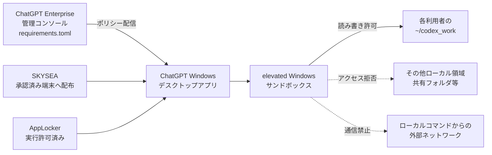

# ChatGPT Windowsデスクトップアプリ Codex利用制御 基本設計書

**文書区分：** 基本設計書  
**対象：** `requirements.toml`による企業管理


| **案件名**   | ChatGPT Enterprise導入                                 |
|--------------|--------------------------------------------------------|
| **対象**     | ChatGPT Windowsデスクトップアプリ上のCodexローカル実行 |
| **顧客名**   | ［顧客名］                                             |
| **作成会社** | ［受注者名］                                           |
| **版数**     | 1.0                                                    |
| **作成日**   | 2026年8月26日                                          |

本書内の［　］は提出前に顧客情報へ置換する記入欄

# 文書管理

**表 0-1　改訂履歴**

| **版数** | **日付**      | **改訂内容** | **作成者** |
|----------|---------------|--------------|------------|
| 1.0      | 2026年8月26日 | 初版作成     | ［作成者］ |

**表 0-2　レビュー・承認**

| **区分** | **所属・役割**         | **氏名** | **日付** |
|----------|------------------------|----------|----------|
| レビュー | ［顧客側レビュー担当］ | ［氏名］ | ［日付］ |
| 承認     | ［顧客側承認担当］     | ［氏名］ | ［日付］ |
| 確認     | ［受注者側責任者］     | ［氏名］ | ［日付］ |

**表 0-3　表記規則**

| **表記**          | **意味**                                                                      |
|-------------------|-------------------------------------------------------------------------------|
| requirements.toml | Codexローカル実行へ管理者強制の制約を適用するポリシー。本文では正式名称に統一 |
| 設定値            | 作成済みrequirements.tomlの値を設計項目として記載。TOML本文そのものは非掲載   |
| 要検証            | 対象クライアント版または企業端末の実環境で確認が必要な項目                    |
| 対象外            | 本書の基本設計に含めず、関連設計または既存運用へ委ねる項目                    |

# 目次

1. [文書概要](#1-文書概要)
2. [システム構成](#2-システム構成)
3. [前提条件・対象環境](#3-前提条件対象環境)
4. [利用者・配布設計](#4-利用者配布設計)
5. [Codex利用制御設計](#5-codex利用制御設計)
6. [requirements.toml設定設計](#6-requirementstoml設定設計)
7. [運用設計](#7-運用設計)
8. [試験・受入設計](#8-試験受入設計)
9. [制約・残存リスク](#9-制約残存リスク)
10. [参考資料](#10-参考資料)

> **対象範囲の要点**  
> ChatGPTデスクトップアプリ全体の機能統制ではなく、Windowsアプリ上で動作するCodexローカルランタイムと、その導入・利用開始に必要な端末側対策を対象とする。

# 1. 文書概要

## 1.1 目的

本書は、会社管理のWindows端末へChatGPTデスクトップアプリを導入し、Codexローカル実行を安全に利用するための基本設計を定義する。作成済みrequirements.tomlの設計内容に加え、アプリ配布、AppLocker、Windowsサンドボックスの事前構築、利用者限定、運用および試験を一体として整理する。

requirements.toml本文は設定資産として別管理し、本書には掲載しない。本文では設定項目、設定値、設計理由および制約を表形式で記載する。

## 1.2 設計目標

- Codexが通常の業務ファイルへ無制限にアクセスすることを防ぎ、作業領域を各利用者のcodex_work配下へ限定する。

- 危険性の高いコマンドを禁止し、主要なシェル、開発ツール、ファイル操作およびリポジトリ操作を人間の承認対象とする。

- サンドボックス内コマンドからの外部通信、未管理MCP、未管理Hooks、Apps、プラグイン、ブラウザー操作およびComputer Useを制限する。

- Windowsでは強いelevatedサンドボックスのみを使用し、unelevatedへのフォールバックを認めない。

- アプリの配布および利用を、ChatGPT Enterpriseアカウントを保有し、デスクトップ利用申請が承認された者に限定する。

## 1.3 対象範囲

**表 1-1　対象範囲**

| **区分** | **対象**                                                    | **設計上の扱い**                                                                               |
|----------|-------------------------------------------------------------|------------------------------------------------------------------------------------------------|
| 対象     | ChatGPT Windowsデスクトップアプリ上のCodexローカル実行      | requirements.tomlによる承認、権限、ファイル、ネットワーク、機能およびWindowsサンドボックス制御 |
| 対象     | Windows端末へのアプリ配布                                   | SKYSEAによる承認済み利用者端末への配布                                                         |
| 対象     | 端末側の事前準備                                            | AppLocker実行許可、codex_work作成、elevatedサンドボックスの事前プロビジョニング                |
| 対象     | 利用資格および運用                                          | Enterpriseアカウント、利用申請、変更管理、監視、停止および試験                                 |
| 対象外   | ChatGPT Web版、モバイル版、Codex CLI、IDE拡張、Codex cloud  | 本書のポリシー適用対象として扱わない                                                           |
| 対象外   | 全社ネットワーク、DLP、データ分類、ソース管理基盤の詳細設計 | 既存セキュリティ設計または別設計へ委ねる                                                       |
| 対象外   | ChatGPT一般チャット機能の全機能統制                         | requirements.tomlが対象とするCodexローカル機能以外は別途確認                                   |

## 1.4 用語

**表 1-2　用語一覧**

| **用語**               | **説明**                                                                                        |
|------------------------|-------------------------------------------------------------------------------------------------|
| Codexローカル          | ChatGPTデスクトップアプリ上でローカルファイルやコマンドを扱うCodex実行機能                      |
| requirements.toml      | 管理者がCodexローカルの許可範囲を強制するTOML形式のポリシー                                     |
| Permission Profile     | ファイルシステムとネットワークの許可範囲をまとめた権限プロファイル                              |
| サンドボックス         | Codexが起動するコマンドを、OSの機構で限定された範囲へ閉じ込める実行境界                         |
| elevatedサンドボックス | 専用の低権限ユーザー、ファイル境界、ファイアウォールルール等を利用するWindows向けの強い分離方式 |
| MCP                    | Codexへ外部ツールやデータソースを接続するModel Context Protocol                                 |
| Hooks                  | Codexの処理タイミングに応じて追加処理を実行する仕組み                                           |
| Appshots               | 画面またはアプリ状態を取得する機能                                                              |
| Computer Use           | ブラウザーや画面を操作する機能群                                                                |
| SKYSEA                 | 本案件でアプリ配布および端末管理に使用する既存管理製品                                          |

# 2. システム構成

## 2.1 全体構成

本設計は、ChatGPT Enterpriseの管理レイヤー、端末管理レイヤー、Windows端末上のCodex実行レイヤーを組み合わせる。requirements.tomlはクラウド管理コンソールを正とし、サインインした対象利用者へ配信する。端末側ではSKYSEA、AppLockerおよび事前プロビジョニングにより、利用開始前の条件を整える。



**図 2-1　全体構成**

## 2.2 構成要素

**表 2-1　構成要素**

| **構成要素**                      | **役割**                                                                        |
|-----------------------------------|---------------------------------------------------------------------------------|
| ChatGPT Enterpriseワークスペース  | 利用者のEnterpriseアカウント、ワークスペースアクセスおよび管理者権限の管理      |
| Codex管理コンソール               | requirements.toml互換ポリシーの登録、割当および変更管理                         |
| SKYSEA                            | 承認済み利用者の端末へChatGPTデスクトップアプリを配布し、配布結果を記録         |
| AppLocker                         | ChatGPTデスクトップアプリの実行を阻害しないよう、対象アプリの実行許可を設定済み |
| ChatGPT Windowsデスクトップアプリ | 利用者がEnterpriseアカウントでサインインし、Codexローカルを利用するクライアント |
| elevated Windowsサンドボックス    | Codexが起動するコマンドを専用の低権限境界で実行                                 |
| codex_work                        | 各利用者のホーム配下に作成するCodex専用作業フォルダ                             |

## 2.3 制御の流れ

1.  利用者がChatGPTデスクトップ利用を申請し、承認者が業務上の必要性を確認する。

2.  管理者がEnterpriseアカウントおよびポリシー割当対象を確認する。

3.  端末管理者がAppLocker実行許可、codex_workのローカル配置および端末要件を確認する。

4.  SKYSEAが対象端末へアプリを配布する。

5.  端末管理者が利用者単位でelevatedサンドボックスを事前プロビジョニングする。

6.  利用者がEnterpriseアカウントでサインインし、アプリを再起動してクラウド管理ポリシーを受信する。

7.  Codexはcorp_codex_workプロファイルおよびコマンドルールに従って処理する。

8.  導入担当者が許可操作と拒否操作を試験し、利用開始記録を残す。

# 3. 前提条件・対象環境

**表 3-1　前提条件**

| **項目**          | **前提**                                            | **補足**                                                                                                 |
|-------------------|-----------------------------------------------------|----------------------------------------------------------------------------------------------------------|
| 端末              | 会社管理のWindows端末                               | 企業標準OS、セキュリティ更新、SKYSEAエージェント稼働を前提                                               |
| OS                | OpenAI公表のWindows要件を満たすこと                 | Windows 11を推奨。Windows 10を使用する場合はサンドボックス互換性を事前検証                               |
| 利用者権限        | 通常利用は標準ユーザー                              | アプリを管理者として起動しない。UACは無効化せず、管理者が事前プロビジョニングを実施                      |
| ChatGPTアカウント | ChatGPT Enterpriseアカウント                        | 対象ワークスペースへのアクセス権を保有し、利用申請が承認済み                                             |
| Codexクライアント | 0.138.0以上                                         | Permission Profileの管理者強制を有効にする最低条件。古い版は配布対象外                                   |
| 作業フォルダ      | `C:\Users\<user>\codex_work`                         | 事前作成したローカルNTFS通常フォルダ。共有、リダイレクト、ジャンクション、シンボリックリンクを使用しない |
| AppLocker         | 対象アプリの実行許可設定済み                        | 解除結果を端末で確認。AppLocker全体の無効化は本設計の対象外                                              |
| 管理権限          | Enterprise管理者および端末管理者                    | ポリシー登録、割当、SKYSEA配布、サンドボックス構築に必要                                                 |
| ネットワーク      | ChatGPTサービス利用に必要な通信が既存設計で許可済み | サンドボックス内コマンドのネットワーク禁止とは別制御                                                     |

> **重要**  
> `network.enabled = false`が禁止する対象は、Codexが起動したローカルコマンドの通信。ChatGPTデスクトップアプリがOpenAIサービスへ接続するための通信は、既存のネットワーク設計で別途許可する。

## 3.1 作業フォルダ要件

各利用者の作業領域は、現在ログインしているユーザーのホーム配下にあるcodex_workのみとする。requirements.toml内の「~」は現在のユーザーホームへ展開されるため、Windowsでは原則として`C:\Users\<user>\codex_work`を指す。

- 端末のローカルディスク上へ作成する。ネットワーク共有、割当ドライブ、OneDrive等によるフォルダリダイレクト先を使用しない。

- Everyone等の広範な主体へ書き込み権限を付与しない。利用者、SYSTEMおよび端末管理者に必要なNTFS権限のみを付与する。

- 配下の.gitおよび.codexはCodexから読み取り専用となるため、利用ツールとの互換性を試験する。

- OS一時フォルダへの書き込みを禁止するため、コンパイル、圧縮、パッケージ管理等の業務利用を事前検証する。

# 4. 利用者・配布設計

## 4.1 利用資格

**表 4-1　利用資格**

| **条件**             | **内容**                                                             |
|----------------------|----------------------------------------------------------------------|
| Enterpriseアカウント | ChatGPT Enterpriseワークスペースの有効アカウントを保有               |
| 利用申請             | ChatGPTデスクトップアプリの利用申請が承認済み                        |
| 対象端末             | SKYSEA管理下の会社Windows端末                                        |
| 利用教育             | 承認画面の確認、codex_work限定利用、禁止事項および事故報告手順を受講 |
| 利用継続             | 異動、退職、業務終了、端末交換時に再確認                             |

アプリ配布対象は、Enterpriseアカウントを保有し、利用申請が承認された者に限定する。管理ポリシーはサインインしたEnterpriseの識別情報に紐づくため、初回利用時に対象ワークスペースへサインインしていることを確認する。

> **補足**  
> `requirements.toml`はワークスペースのメンバー登録や座席付与を行わない。個人アカウントのサインイン遮断も単独では実現しないため、利用資格、ID管理、配布対象および初回確認を組み合わせる。

## 4.2 配布・導入フロー

**表 4-2　配布・導入フロー**

| **No.** | **工程**                 | **担当**         | **実施内容**                                                                 |
|---------|--------------------------|------------------|------------------------------------------------------------------------------|
| 1       | 利用申請受付             | 利用者／承認者   | 業務目的、対象端末、利用期間を確認し、申請を承認                             |
| 2       | アカウント・ポリシー割当 | Enterprise管理者 | Enterpriseアカウントの有効性を確認し、管理ポリシーの対象グループへ追加       |
| 3       | 端末事前確認             | 端末管理者       | OS、SKYSEA、AppLocker、標準ユーザー運用、ローカルcodex_workを確認            |
| 4       | アプリ配布               | 端末管理者       | SKYSEAで対象利用者の端末へ社内承認済みパッケージを配布                       |
| 5       | サンドボックス構築       | 端末管理者       | 管理者コンテキストで利用者単位のelevatedサンドボックスを事前プロビジョニング |
| 6       | 初回サインイン           | 利用者           | Enterpriseアカウントでサインインし、対象ワークスペースを選択                 |
| 7       | 適用確認                 | 導入担当者       | ポリシー、作業領域、禁止機能、承認画面、elevatedサンドボックスを確認         |
| 8       | 利用開始記録             | 運用担当者       | 利用者、端末、配布版、ポリシー版、試験結果、開始日を記録                     |

## 4.3 SKYSEA配布設計

- 配布対象は、承認済み利用者と会社管理端末を対応付けた配布グループ。

- 配布パッケージは社内検証済みのChatGPT Windowsデスクトップアプリ。パッケージ版、配布日およびハッシュをリリース記録へ保存。

- 配布結果は成功、再起動待ち、失敗、対象外を判定し、失敗端末を個別に是正。

- 段階配布は検証グループ、本番先行グループ、全対象の順。Codexの主要更新時は同じ手順を反復。

- 利用資格喪失時は配布グループから除外し、必要に応じてSKYSEAでアンインストール。

## 4.4 AppLocker設計

案件前提の「AppLocker解除済み」は、ChatGPTデスクトップアプリに対する実行許可設定済みを意味し、AppLocker全体の無効化を意味しない。導入時は、利用者コンテキストでChatGPTアプリが起動できること、およびAppLockerイベントログに拒否が記録されないことを確認する。AppLockerの解除はアプリ利用資格を付与する制御ではないため、SKYSEAの配布対象とEnterpriseの利用者管理を別に維持する。

## 4.5 elevatedサンドボックスの事前プロビジョニング

利用者の初回起動時にUAC昇格操作を要求しないよう、端末管理者が利用者ごとにelevatedサンドボックスを事前構築する。UAC自体は無効化しない。

実行コマンドの一般形は次のとおり。

```powershell
codex sandbox setup --elevated --user "<domain>\<user>" --codex-home "C:\Users\<user>\.codex"
```

案件提示の実行例は次のとおり。

```powershell
codex sandbox setup --elevated --user "testdomain\tanaka-tarou" --codex-home "C:\Users\tanaka-tarou\.codex"
```

実行後は、専用サンドボックスユーザー／グループ、必要なログオン権、ファイル境界およびファイアウォール設定の作成成功を確認する。requirements.tomlでelevatedのみを許可するため、構築に失敗した端末はunelevatedへ切り替えず、利用開始を保留する。

# 5. Codex利用制御設計

## 5.1 設計方針

**表 5-1　設計方針**

| **方針**        | **内容**                                                                                     |
|-----------------|----------------------------------------------------------------------------------------------|
| 既定拒否        | ファイルシステム全体を拒否し、Codexの実行に必要な最小読み取りとcodex_workのみを再許可        |
| 最小権限        | 書き込み先をcodex_workに限定し、.gitと.codexを読み取り専用化                                 |
| 人間による判断  | Neverおよび自動レビューを禁止し、主要コマンドへ明示承認を要求                                |
| 外部経路の閉塞  | ローカルコマンド通信、MCP、Apps、プラグイン、ブラウザー操作、Computer Use等を禁止            |
| 強いWindows分離 | elevatedサンドボックスのみを許可し、弱いフォールバックを禁止                                 |
| 多層防御        | requirements.tomlの限界を、標準ユーザー、AppLocker、SKYSEA、ID管理、フォルダ検証、教育で補完 |

## 5.2 承認ポリシー

承認ポリシーはuntrustedのみを許可し、Neverを選択できないようにする。自動レビューを禁止し、承認者を人間の利用者に限定する。シェル、Git、検索、転送等の主要コマンドには個別のpromptルールを設定する。

> **制御上の注意**  
> `untrusted`は、既知の安全な一部読み取り操作を承認なしで実行する場合がある。`requirements.toml`には全コマンドを例外なく`prompt`へ一致させる包括的ワイルドカードがないため、「全操作の完全な都度承認」は設計目標としない。

## 5.3 ファイルアクセス

corp_codex_workプロファイルは、ファイルシステム全体を既定拒否とし、Codexの起動に必要な最小限のシステム／ランタイムファイルを読み取り許可する。その上で、各利用者の~/codex_workだけを読み書き可能にする。

**表 5-2　実効ファイルアクセス**

| **対象**                      | **権限**           | **設計意図**                                                  |
|-------------------------------|--------------------|---------------------------------------------------------------|
| ~/codex_work                  | 読み取り・書き込み | ソース、ドキュメント、生成物等のCodex作業領域                 |
| ~/codex_work/.git             | 読み取り           | Git管理情報の直接変更を抑止。通常のGit操作との互換性は要検証  |
| ~/codex_work/.codex           | 読み取り           | プロジェクト内Codex設定の自己変更を抑止                       |
| Codex実行に必要な最小ファイル | 読み取り           | シェル、Git、言語ランタイム等の起動に必要                     |
| OS一時フォルダ                | 拒否               | codex_work外の書き込み経路を閉塞。ツール互換性は要検証        |
| その他のローカル領域・共有    | 拒否               | 通常の業務ファイル、UNC共有、割当ドライブ等へのアクセスを抑止 |

利用者が別フォルダをWorkspaceとして画面上で選択する操作自体は制御できない。ただし、本プロファイルは:workspaceや:workspace_rootsを継承しないため、選択先へ自動的に権限を付与しない。

## 5.4 ネットワークおよび外部連携

corp_codex_work内で起動したローカルコマンドのネットワーク接続を禁止する。Web検索はcachedのみを許可し、ライブページ取得を禁止する。MCPは空の管理テーブルにより全面禁止し、Hooksは管理者定義だけを許可するが、現行ポリシーでは管理Hooksを定義しない。Apps、プラグイン、ブラウザー操作、Computer Useおよびリモートコントロールも無効化する。

**表 5-3　通信・外部機能の扱い**

| **機能**                                   | **扱い**       | **補足**                                                     |
|--------------------------------------------|----------------|--------------------------------------------------------------|
| ChatGPTアプリのサービス通信                | 許可           | サインイン、会話、ポリシー取得等。既存ネットワーク設計の対象 |
| Codexが起動したローカルコマンドの通信      | 禁止           | Permission Profileのnetwork.enabled=false                    |
| Web検索                                    | cachedのみ     | ライブ取得およびindexed検索を禁止。disabledは選択可能        |
| MCP                                        | 禁止           | 管理者が個別に追加するまで空のAllowlist                      |
| Hooks                                      | 管理者定義のみ | 現行ポリシーでは管理Hooksなし                                |
| Apps／プラグイン／ブラウザー／Computer Use | 禁止           | 別データアクセス経路および画面操作経路を閉塞                 |

## 5.5 コマンドルール

requirements.tomlのprefix_rulesで、危険性の高いコマンドをforbidden、主要な開発・参照・転送コマンドをpromptとする。ルールはコマンド先頭の一致によるベストエフォート制御であり、別名、ラッパー、APIおよび未列挙実行ファイルを完全には網羅しない。

**表 5-4　コマンドルール概要**

| **分類**                          | **判定**  | **主な対象**                                                     |
|-----------------------------------|-----------|------------------------------------------------------------------|
| 権限昇格                          | forbidden | sudo、su、doas、pkexec、runas、gsudo等                           |
| WSL起動                           | forbidden | wsl、wsl.exe                                                     |
| マウント・共有・ドライブ・ACL変更 | forbidden | mount、subst、New-PSDrive、New-SmbMapping、icacls、takeown等     |
| Windows共有接続                   | forbidden | net use                                                          |
| シェル・ランタイム・ビルド        | prompt    | PowerShell、cmd、bash、Python、Node.js、dotnet、Java、Go、Rust等 |
| 検索・参照・Git・転送・圧縮       | prompt    | git、rg、find、grep、curl、ssh、robocopy、tar、7z等              |

## 5.6 Windowsサンドボックス

Windowsではelevated実装だけを許可する。elevatedはCodexへ管理者権限を与える設定ではなく、専用の低権限サンドボックスユーザー、ファイル境界、ファイアウォールルールおよびローカルポリシーを利用する強い分離方式を示す。

端末がelevatedサンドボックスの前提条件を満たさない場合、Codexをunelevatedで継続させず、端末ポリシー、ログオン権、ローカルユーザー／グループ作成、ファイアウォール変更可否を調査する。

# 6. requirements.toml設定設計

本章は、作成済みrequirements.tomlの設定値を基本設計項目として整理する。TOML本文、コメントおよび具体的な構文全体は掲載せず、設定項目、設定値、設計理由および検証上の注意だけを記載する。

> **管理方針**  
> クラウド管理コンソールを設定の正とする。端末ローカルの`%ProgramData%\OpenAI\Codex\requirements.toml`は本案件では配布しない。既存のローカル`requirements.toml`または`managed_config.toml`が存在する端末は競合調査の対象。

## 6.1 クラウド管理情報

**表 6-1　クラウド管理情報**

| **項目**       | **設定・運用値**                                  | **設計理由**                                   |
|----------------|---------------------------------------------------|------------------------------------------------|
| 管理画面       | https://chatgpt.com/codex/cloud/settings/policies | Enterprise管理者がポリシーを登録・割当         |
| 推奨ポリシー名 | WIN-CODEX-RESTRICTED                              | Windows向け制限ポリシーを識別                  |
| 割当対象       | ChatGPTデスクトップ利用承認者グループ             | Enterpriseアカウントと利用申請に基づく         |
| 正本           | 変更管理下のrequirements.toml                     | 文書管理システムまたは版管理リポジトリで別管理 |
| 適用タイミング | アプリ起動／再起動時                              | ポリシー変更後は対象利用者へ再起動を指示       |
| 変更方式       | 検証グループ後に本番割当                          | 小規模検証、承認、展開、適用確認、証跡保存     |

## 6.2 設定一覧

**表 6-2　requirements.toml設定一覧**

| **No.**                      | **設定項目**                                                                               | **設定値**                                                                | **設計理由・補足**                                                                                                                |
|------------------------------|--------------------------------------------------------------------------------------------|---------------------------------------------------------------------------|-----------------------------------------------------------------------------------------------------------------------------------|
| **承認ポリシー**             |                                                                                            |                                                                           |                                                                                                                                   |
| 1                            | allowed_approval_policies                                                                  | \["untrusted"\]                                                           | Neverを選択できないようにする。untrustedでも安全と判定された一部読み取り操作は承認なしとなる可能性。                              |
| 2                            | allowed_approvals_reviewers                                                                | \["user"\]                                                                | 自動レビューを禁止し、人間の利用者だけが承認。利用者自身による不適切な承認は教育と運用で補完。                                    |
| **Web検索・管理機能**        |                                                                                            |                                                                           |                                                                                                                                   |
| 3                            | allowed_web_search_modes                                                                   | \["cached"\]                                                              | ライブ検索とindexed検索を禁止。仕様上disabledは暗黙的に許可。                                                                     |
| 4                            | allow_managed_hooks_only                                                                   | true                                                                      | ユーザー、プロジェクト、セッション、プラグインのHooksを読み込まず、管理レイヤーのHooksだけを許可。現行ポリシーでは管理Hooksなし。 |
| 5                            | allow_appshots                                                                             | false                                                                     | 画面・アプリ状態を取得する経路を無効化。                                                                                          |
| 6                            | allow_remote_control                                                                       | false                                                                     | Codexのデバイスリモートコントロールを無効化。SSH等のCodex外接続は別制御。                                                         |
| **Permission Profile**       |                                                                                            |                                                                           |                                                                                                                                   |
| 7                            | default_permissions                                                                        | "corp_codex_work"                                                         | 管理者定義プロファイルを既定値として強制。                                                                                        |
| 8                            | allowed_sandbox_modes                                                                      | \["read-only"\]                                                           | 0.137.0以前の旧クライアント向けフェイルセーフ。新規設計の主制御はPermission Profile。                                             |
| 9                            | allowed_permission_profiles.corp_codex_work                                                | true（本プロファイルのみ）                                                | 未指定の組み込みプロファイルおよび将来追加プロファイルを拒否。                                                                    |
| 10                           | permissions.corp_codex_work.description                                                    | 現在のユーザーの~/codex_workだけを読み書き可能にする企業管理プロファイル  | 管理者と利用者がプロファイルの目的を識別。                                                                                        |
| **ファイルシステム**         |                                                                                            |                                                                           |                                                                                                                                   |
| 11                           | permissions.corp_codex_work.filesystem\[":root"\]                                          | "deny"                                                                    | ファイルシステム全体を既定拒否。                                                                                                  |
| 12                           | permissions.corp_codex_work.filesystem\[":minimal"\]                                       | "read"                                                                    | Codexがシェル、Git、言語ランタイム等を起動するための最小ファイルだけ読取許可。                                                    |
| 13                           | permissions.corp_codex_work.filesystem\["~/codex_work"\]                                   | "write"                                                                   | 各利用者の専用作業フォルダと配下だけを読み書き許可。                                                                              |
| 14                           | permissions.corp_codex_work.filesystem\["~/codex_work/.git"\]                              | "read"                                                                    | Git管理情報の直接書換えを抑止。Git操作への影響を実機検証。                                                                        |
| 15                           | permissions.corp_codex_work.filesystem\["~/codex_work/.codex"\]                            | "read"                                                                    | プロジェクト内Codex設定の自己変更を抑止。                                                                                         |
| 16                           | permissions.corp_codex_work.filesystem\[":tmpdir"\] / \[":slash_tmp"\]                     | "deny"                                                                    | OS一時フォルダをcodex_work外の書き込み先として使用させない。ビルド等の互換性リスク。                                              |
| 17                           | permissions.filesystem.deny_read                                                           | /mnt/\*\*, /media/\*\*, /run/media/\*\*, /Volumes/\*\*                    | WSL、Linux、macOS等の代表的マウント先を防御的に読取拒否。Windows対象では主に迂回経路への備え。                                    |
| **ネットワーク・MCP**        |                                                                                            |                                                                           |                                                                                                                                   |
| 18                           | permissions.corp_codex_work.network.enabled                                                | false                                                                     | Codexが起動したローカルコマンドからの外部通信を禁止。Web検索やアプリ自身の通信とは別制御。                                        |
| 19                           | mcp_servers                                                                                | 空テーブル                                                                | 全MCPを無効化。将来利用する場合は管理者が名称とidentityを厳密に登録。                                                             |
| **コマンドルール：禁止**     |                                                                                            |                                                                           |                                                                                                                                   |
| 20                           | rules.prefix_rules（権限昇格）                                                             | sudo, su, doas, pkexec, runas, gsudo等 → forbidden                        | 主要なOS権限昇格コマンドを禁止。全昇格経路を完全には網羅しない。                                                                  |
| 21                           | rules.prefix_rules（WSL）                                                                  | wsl, wsl.exe → forbidden                                                  | WSL経由でWindowsドライブや共有へ迂回することを抑止。UI上のWSL選択操作は別問題。                                                   |
| 22                           | rules.prefix_rules（マウント・共有・ACL）                                                  | mount, subst, New-PSDrive, New-SmbMapping, icacls, takeown等 → forbidden  | マウント、共有接続、ドライブ割当およびOSアクセス権変更を禁止。                                                                    |
| 23                           | rules.prefix_rules（net use）                                                              | net / net.exe + use → forbidden                                           | Windows共有フォルダ接続およびネットワークドライブ割当を禁止。                                                                     |
| **コマンドルール：承認要求** |                                                                                            |                                                                           |                                                                                                                                   |
| 24                           | rules.prefix_rules（シェル・ランタイム・ビルド）                                           | PowerShell, cmd, bash, Python, Node.js, dotnet, Java, Go, Rust等 → prompt | 主要なシェル、インタープリターおよびビルドツールの実行へ人間の承認を要求。                                                        |
| 25                           | rules.prefix_rules（検索・参照・転送・Git）                                                | git, rg, find, grep, curl, ssh, robocopy, tar, 7z等 → prompt              | 主要なファイル参照、検索、転送、圧縮およびリポジトリ操作へ人間の承認を要求。                                                      |
| **別経路となる機能**         |                                                                                            |                                                                           |                                                                                                                                   |
| 26                           | features.apps                                                                              | false                                                                     | Apps／コネクター経由のデータアクセスを無効化。                                                                                    |
| 27                           | features.plugins / remote_plugin / plugin_sharing                                          | false / false / false                                                     | プラグイン、リモートカタログおよびワークスペース共有を無効化。                                                                    |
| 28                           | features.in_app_browser / browser_use / browser_use_external / browser_use_full_cdp_access | すべてfalse                                                               | 内蔵・外部ブラウザー操作、Browser Agentおよび完全CDPアクセスを無効化。cached Web検索は別機能。                                    |
| 29                           | features.computer_use                                                                      | false                                                                     | Computer Use、Record & Replayおよび関連有効化フローを無効化。                                                                     |
| 30                           | features.guardian_approval                                                                 | false                                                                     | 自動承認機能を無効化し、人間承認方針と整合。                                                                                      |
| **Windowsサンドボックス**    |                                                                                            |                                                                           |                                                                                                                                   |
| 31                           | windows.allowed_sandbox_implementations                                                    | \["elevated"\]                                                            | 強いelevatedだけを許可し、unelevatedへのフォールバックを禁止。elevatedはCodexへの管理者権限付与ではない。                         |

## 6.3 適用および変更管理

**表 6-3　ポリシー変更手順**

| **工程**     | **内容**                                                                                       |
|--------------|------------------------------------------------------------------------------------------------|
| 変更起票     | 設定変更の目的、対象、想定影響、ロールバック方法を記録                                         |
| レビュー     | セキュリティ担当、端末担当、Enterprise管理者、業務代表が確認                                   |
| 検証         | 代表端末で正常系と禁止系を実施。特にクライアント版、.git、.codex、一時フォルダ、elevatedを確認 |
| 本番反映     | 管理コンソールへ登録し、承認済みグループへ割当。反映時刻とポリシー版を記録                     |
| 利用者通知   | アプリ再起動、変更点、利用影響、問い合わせ先を通知                                             |
| 事後確認     | 有効設定と代表操作を確認し、証跡を保存                                                         |
| ロールバック | 直前の承認済みポリシーへ戻し、対象利用者のアプリを再起動                                       |

# 7. 運用設計

## 7.1 役割分担

**表 7-1　役割分担**

| **役割**         | **責任**                                                                        |
|------------------|---------------------------------------------------------------------------------|
| Enterprise管理者 | Enterpriseアカウント、グループ、管理ポリシー、管理者権限および割当の管理        |
| 端末管理者       | AppLocker、SKYSEA配布、codex_work確認、サンドボックス事前構築、端末トラブル対応 |
| セキュリティ担当 | ポリシー変更レビュー、残存リスク受容、インシデント判断、監査                    |
| サービスデスク   | 申請受付、一次切り分け、利用停止手続、証跡管理                                  |
| 利用者           | codex_work内での利用、承認内容の確認、管理者起動禁止、異常時の報告              |
| SIer             | 設計、導入支援、試験計画、結果整理、移管および変更支援                          |

## 7.2 定常運用

**表 7-2　定常運用項目**

| **運用項目** | **内容**                                                                                                           |
|--------------|--------------------------------------------------------------------------------------------------------------------|
| 利用者追加   | 申請承認、アカウント確認、ポリシー割当、SKYSEA配布、事前プロビジョニング、受入試験                                 |
| 利用者削除   | ポリシー対象・配布グループから除外し、必要に応じてアンインストール。成果物とcodex_workの扱いはデータ管理規程に従う |
| 端末交換     | 新端末で全導入工程を再実施。旧端末のアプリ、認証状態および作業データを処理                                         |
| アプリ更新   | 0.138.0以上を維持し、検証グループでポリシー互換性とelevated動作を確認後に段階配布                                  |
| ポリシー変更 | 表6-3の変更管理手順を適用                                                                                          |
| 定期点検     | 四半期または主要更新時に利用者一覧、割当、端末版、禁止機能、作業フォルダ物理配置を確認                             |
| 問い合わせ   | SKYSEA配布、AppLocker、サンドボックス、ポリシー、業務ツール互換性の順に切り分け                                    |

## 7.3 監視・証跡

**表 7-3　保存する証跡**

| **証跡**               | **主な記録項目**                                         |
|------------------------|----------------------------------------------------------|
| 利用申請・承認記録     | 利用者、端末、目的、期間、承認者、承認日                 |
| Enterprise管理記録     | ポリシー版、割当グループ、変更日時、変更者、レビュー記録 |
| SKYSEA配布ログ         | 対象端末、配布パッケージ版、配布結果、失敗理由           |
| サンドボックス構築記録 | 対象利用者、端末、実行日、実行者、成功可否、エラー       |
| 受入試験証跡           | 画面、ログ、テスト結果、例外、是正内容                   |
| 障害・インシデント記録 | 発生事象、影響、暫定対処、恒久対処、再発防止             |

Codexのローカルログを採取する場合は、CODEX_HOME配下に利用者の操作履歴や機密情報が含まれる可能性を考慮し、アクセス権、保管期間、持出しおよび削除を既存のログ取扱規程へ合わせる。

## 7.4 利用者ルール

- 作業対象は`C:\Users\<user>\codex_work`配下へ配置し、他フォルダや共有をWorkspaceとして利用しない。

- 承認画面では、コマンド、対象ファイル、目的および外部通信の有無を確認し、不明な操作を承認しない。

- ChatGPTデスクトップアプリを「管理者として実行」しない。

- 個人アカウントへ切り替えず、指定されたEnterpriseワークスペースを利用する。

- Apps、プラグイン、MCP、ブラウザー操作、Computer UseまたはWSLを有効化しようとしない。

- アクセス拒否やビルド失敗を回避するためにOS権限、共有接続、ACLまたはサンドボックスを変更しない。

- 意図しないファイル参照、承認要求、情報送信またはポリシーエラーを検知した場合は処理を停止して報告する。

## 7.5 障害・インシデント対応

**表 7-4　障害・インシデント対応**

| **事象**                     | **初動**                                                                                                |
|------------------------------|---------------------------------------------------------------------------------------------------------|
| ポリシー未適用／取得失敗     | アプリ利用を停止し、Enterpriseサインイン、割当、時刻同期、ネットワーク、クライアント版を確認            |
| elevated構築失敗             | 利用開始を保留し、UAC、ローカルユーザー／グループ作成、ファイアウォール、ログオン権、企業ポリシーを確認 |
| unelevatedへの切替表示       | 運用上許容せず、elevatedを再構築。解消まで対象端末でCodexを使用しない                                   |
| 作業フォルダ外アクセスの疑い | 処理停止、対象端末隔離の要否判断、ログ保全、ポリシー版と実効設定を確認                                  |
| 不審な承認／コマンド実行     | 処理停止、証跡保全、影響範囲調査、必要に応じてアカウント停止およびアプリ削除                            |
| 更新後の互換性不良           | 段階配布を停止し、既知の安定版または直前ポリシーへ戻す                                                  |

# 8. 試験・受入設計

## 8.1 試験方針

代表利用者と代表端末を用い、承認済みの正常操作と意図的に禁止した操作の双方を確認する。ポリシー設定値の静的確認だけでなく、ChatGPTデスクトップアプリ上の実効動作、Windowsサンドボックスおよび端末管理の結果を確認する。

受入条件は、重要度「必須」の項目がすべて合格し、要検証項目の業務影響と回避策が顧客に承認されていること。

## 8.2 試験項目

**表 8-1　試験項目**

| **ID** | **重要度** | **分類**           | **確認内容**                                         | **期待結果**                         |
|--------|------------|--------------------|------------------------------------------------------|--------------------------------------|
| T-01   | 必須       | 利用資格           | 承認済み利用者だけがSKYSEA配布対象                   | 対象者は配布、非対象者は未配布       |
| T-02   | 必須       | AppLocker          | 標準ユーザーでChatGPTアプリ起動                      | 起動成功、拒否イベントなし           |
| T-03   | 必須       | サンドボックス     | 事前プロビジョニング後の初回利用                     | 利用者のUAC操作なしでelevatedが起動  |
| T-04   | 必須       | サインイン         | Enterpriseアカウントで対象ワークスペースへサインイン | 対象ポリシーを受信                   |
| T-05   | 必須       | クライアント版     | Codex版を確認                                        | 0.138.0以上                          |
| T-06   | 必須       | 承認ポリシー       | Neverおよび自動レビューの選択可否                    | 選択不可                             |
| T-07   | 必須       | 作業領域           | codex_work内でファイル作成・変更・削除               | 成功                                 |
| T-08   | 必須       | 作業領域外         | Documents、Desktop、他ドライブ、UNC共有の読み書き    | 拒否                                 |
| T-09   | 必須       | ネットワーク       | サンドボックス内コマンドから外部URLへ接続            | 拒否                                 |
| T-10   | 必須       | Web検索            | live／indexed検索を選択または実行                    | 使用不可。cachedまたはdisabledのみ   |
| T-11   | 必須       | MCP／Hooks         | 未管理MCP、ユーザー／プロジェクトHooksの有効化       | 無効または拒否                       |
| T-12   | 必須       | 禁止コマンド       | runas、wsl、net use、icacls等を実行                  | forbiddenとして拒否                  |
| T-13   | 必須       | 承認対象コマンド   | PowerShell、Python、Git、curl等を実行                | 人間の承認画面を表示                 |
| T-14   | 必須       | 外部機能           | Apps、プラグイン、ブラウザー、Computer Useを確認     | 無効または利用不可                   |
| T-15   | 必須       | サンドボックス実装 | unelevatedへの切替またはフォールバック               | 不可。elevatedのみ                   |
| T-16   | 要検証     | .git               | 対象業務のGit操作                                    | 必要な業務が成立、または制約を明確化 |
| T-17   | 要検証     | .codex             | 対象業務でプロジェクト設定を参照                     | 読取のみで業務が成立                 |
| T-18   | 要検証     | 一時フォルダ       | ビルド、圧縮、パッケージ管理                         | 業務可否と代替手順を確定             |
| T-19   | 必須       | Workspace UI       | codex_work外をWorkspaceとして選択                    | 選択操作は可能でもアクセスは拒否     |
| T-20   | 必須       | ポリシー変更       | 検証ポリシーを更新しアプリ再起動                     | 変更が反映し、旧値へロールバック可能 |

## 8.3 受入証跡

- Enterprise管理コンソールのポリシー名、版、割当対象および反映日時。

- SKYSEAの配布結果、アプリ版および対象端末。

- elevatedサンドボックスの構築成功記録。

- 承認画面、禁止メッセージ、ファイルアクセス拒否、ネットワーク拒否の画面またはログ。

- 要検証項目の結果、業務影響、代替手順および顧客承認。

- 試験実施者、実施日、端末、利用者、結果および不具合票。

# 9. 制約・残存リスク

requirements.tomlはCodexローカルランタイムの多くを制御するが、Windows OS、アプリ配布、利用者判断、Workspace選択UIおよび物理フォルダ配置までを単独で完全統制しない。次の制約を前提として運用する。

**表 9-1　制約・残存リスク**

| **項目**                   | **残存リスク**                                                                                      | **補完対策**                                                |
|----------------------------|-----------------------------------------------------------------------------------------------------|-------------------------------------------------------------|
| 全操作の完全な都度承認     | 全コマンドへ一致する包括ルールがなく、安全と判定された読み取り等は承認なしとなる場合                | 主要コマンドのprompt、利用教育、定期監査                    |
| Workspace選択操作          | codex_work外のフォルダをUIで選択する操作自体は防止不可                                              | アクセス権を付与せず、利用手順と試験で明確化                |
| 管理者起動                 | requirements.tomlだけではChatGPTアプリの管理者起動を禁止不可                                        | 標準ユーザー運用、ローカル管理者権限制限、UAC維持、利用教育 |
| 権限昇格・共有接続の網羅性 | 別名、ラッパー、API、独自ツール等がprefix_rulesに一致しない可能性                                   | OS権限、AppLocker／アプリ制御、ネットワーク制御で補完       |
| codex_workの物理配置       | 共有、リダイレクト、ジャンクション等をTOMLだけで検証不可                                            | 導入時と定期点検でローカル通常フォルダを確認                |
| 古いクライアント           | 0.137.0以前はPermission Profile管理を無視                                                           | SKYSEAで0.138.0以上のみ配布し、旧版を更新・削除             |
| .git読取専用               | Gitの通常操作やワークツリー機能へ影響する可能性                                                     | 代表業務で検証し、必要なら設計変更を正式審査                |
| 一時フォルダ拒否           | ビルド、圧縮、パッケージ管理が失敗する可能性                                                        | 業務ツールごとに検証し、許可変更はリスク審査                |
| Enterprise以外のサインイン | クラウド管理ポリシーはサインイン識別情報に依存し、requirements.toml単独で個人アカウントを遮断しない | 配布対象限定、SSO／ID管理、初回サインイン確認、利用教育     |
| ChatGPT一般機能            | Codexローカル以外のChatGPTデスクトップ機能へ同じ制御が及ばない場合                                  | Workspace設定、Apps権限、データ利用ルールを別途確認         |
| 製品仕様変更               | 設定キー、機能、画面、適用範囲がクライアント更新で変わる可能性                                      | 公式資料確認、検証グループ、変更管理、定期レビュー          |

## 9.1 総合評価

**表 9-2　総合評価**

| **評価対象**                                | **判定**     |
|---------------------------------------------|--------------|
| 通常のローカル作業をcodex_workへ限定        | おおむね可能 |
| 共有フォルダの通常読み書き禁止              | おおむね可能 |
| ローカルコマンド通信、MCP、Hooks等の制限    | 可能         |
| 全実行の完全な人間承認                      | 不可         |
| Workspace登録操作そのものの制限             | 不可         |
| OS権限昇格の完全禁止                        | 不可         |
| requirements.tomlだけによる全要件の完全達成 | 不可         |

本設計は、通常のCodex作業を狭いサンドボックスへ閉じ込める対策として有効となる。完全な端末統制はrequirements.tomlだけで実現せず、標準ユーザー、SKYSEA、AppLocker、ID管理、フォルダ検証、運用および教育を継続して組み合わせる。

# 10. 参考資料

本書の設計値は添付資料を基礎とし、管理方式、主要な設定キー、Permission Profile、WindowsサンドボックスおよびWindowsアプリ配布の考え方をOpenAI公式資料で確認した。製品仕様は変更される可能性があるため、本番反映時に対象クライアント版と最新資料を再確認する。

**表 10-1　参考資料一覧**

| **No.** | **資料名**                                                            | **用途**                                                                             |
|---------|-----------------------------------------------------------------------|--------------------------------------------------------------------------------------|
| [1]   | Codex Enterprise requirements.toml（案件添付資料）                    | 本設計の設定値、設計意図、制御可否および制約の基礎資料                               |
| [2]   | OpenAI「Managed configuration／Configuration Reference／Permissions」 | クラウド配信、優先順位、設定キー、Permission Profile、ファイルおよびネットワーク権限 |
| [3]   | OpenAI「Admin rollout guide／Windows sandbox」                        | Enterprise導入、段階展開、elevated／unelevated、Windows要件およびトラブルシュート    |
| [4]   | OpenAI「ChatGPT Windows アプリの使用」                                | Windowsアプリの組織配布とシステム要件                                                |
