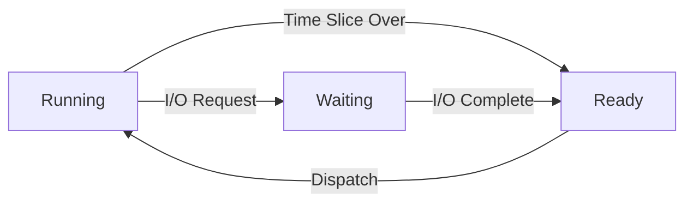
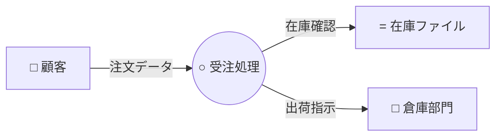

# 情報処理技術者試験 共通午前Ⅰ 完全攻略ガイド：基礎理論

これは、情報処理技術者試験（基本情報、応用情報、高度試験共通）の午前Ⅰ試験における「基礎理論」分野を網羅的に、かつ初心者にも分かりやすく解説した学習資料です。
試験で頻出のポイントや、間違いやすい「ひっかけ」ポイントを重点的に解説しています。

---

## 📚 第1章：離散数学 (Discrete Mathematics)

コンピュータの世界は「0」と「1」でできています。この離散的（飛び飛び）な値を扱う数学が離散数学です。論理的な思考力を問う問題として頻出です。

### 1-1. 論理 (Logic)

プログラミングや回路設計の基礎となる考え方です。

#### ✅ 命題 (Proposition)
「正しい (True)」か「正しくない (False)」かが明確に決まる文章や式のこと。
- 例：「1 + 1 = 2」は真 (True)。「1 + 1 = 3」は偽 (False)。

#### ✅ 論理演算 (Logical Operations)
真(1)と偽(0)を用いた計算です。基本の4つ＋αを覚えましょう。

| 演算名 | 日本語 | 記号 | 説明 |
| :--- | :--- | :--- | :--- |
| **AND** | 論理積 | $A \cdot B$, $A \land B$ | AとBが**両方とも1**のときだけ1 |
| **OR** | 論理和 | $A + B$, $A \lor B$ | AとBの**どちらか一方でも1**なら1 |
| **NOT** | 否定 | $\bar{A}$, $\neg A$ | 0なら1、1なら0（反転） |
| **XOR** | 排他的論理和 | $A \oplus B$ | AとBが**異なるとき**だけ1 |

> [!IMPORTANT]
> **試験での最重要ポイント：XOR (排他的論理和)**
> XORは「食い違っていたら1」です。同じ値なら0になります。
> 暗号化技術やパリティチェック（誤り検出）で頻繁に使われます。「AとBが同じなら0、違うなら1」と暗記しましょう。

#### ✅ ド・モルガンの法則 (De Morgan's laws)
論理式の変形問題で必ずと言っていいほど出ます。
「否定の全体は、個別の否定の反対」のようなイメージです。

1. $\overline{A \cdot B} = \overline{A} + \overline{B}$
   - 「AかつB」ではない ＝ 「Aじゃない」または「Bじゃない」
2. $\overline{A + B} = \overline{A} \cdot \overline{B}$
   - 「AまたはB」ではない ＝ 「Aじゃない」かつ「Bじゃない」

> [!TIP]
> **覚え方のコツ**
> バー（否定の横線）を切ると、演算記号（・と＋）がひっくり返る！と覚えましょう。

---

### 1-2. 集合 (Sets)

データの集まりを扱うための概念です。データベース（SQL）の基礎にもなります。

#### ✅ ベン図 (Venn Diagram)
集合の関係を視覚的に表した図です。

- **和集合 (Union, $A \cup B$)**: AまたはBに入っている要素全部（ORのイメージ）。
- **積集合 (Intersection, $A \cap B$)**: AとBの両方に入っている要素だけ（ANDのイメージ）。
- **差集合 ($A - B$)**: Aの中に合って、Bには含まれないもの。
- **補集合 ($\bar{A}$)**: Aに含まれないもの全部。

> [!WARNING]
> **ひっかけポイント：記号の向き**
> - $\cup$ (カップ) ：水がたくさん入るから「和集合（全部）」
> - $\cap$ (キャップ)：帽子。重なっている部分だけなので「積集合」
> どっちがどっちか分からなくならないように注意！

---

### 1-3. 関係 (Relations)

データとデータのつながりを定義します。特に「関係データベース」の理論的背景となります。
試験では、**「反射律」「対称律」「推移律」** という言葉が出ることがありますが、深入りしすぎず「そういう性質がある」程度でOKです。

- **関数**: Xが決まればYがただ一つに決まる関係 ($y = f(x)$)。

---

### 1-4. グラフ理論 (Graph Theory)

点（ノード）と線（エッジ）でつながりを表した図形です。ネットワーク構成やアルゴリズムで使われます。

#### ✅ 木構造 (Tree)
階層的な構造を持つグラフです。ファイルシステム（フォルダ構成）などが代表例。

- **根 (Root)**: てっぺんにあるノード。
- **葉 (Leaf)**: 子を持たない末端のノード。
- **深さ (Depth)**: 根からの距離。

#### ✅ グラフの種類
- **有向グラフ**: 矢印があり、一方通行などの向きがある（例：Webページのリンク）。
- **無向グラフ**: 向きがない（例：友だち関係）。
- **完全グラフ**: すべてのノードが互いにつながっているグラフ。

> [!NOTE]
> **探索アルゴリズムとの関連**
> グラフを調べる方法として「深さ優先探索」「幅優先探索」があります。
> - **深さ優先**: 行けるところまで深く突き進み、行き止まったら戻る。
> - **幅優先**: 近いところからしらみつぶしに調べる。

---
## 🔢 第2章：数値表現 (Numerical Representation)

コンピュータ内部では、文字も画像も音声も、すべて数値（0と1）として扱われます。この章は計算問題として出題されることが多いため、計算手順をマスターしましょう。

### 2-1. 基数変換 (Radix Conversion)

普段私たちが使っているのは10進数ですが、コンピュータは2進数、8進数、16進数を使います。

#### ✅ n進数の基本
- **2進数 (Binary)**: 0, 1 (桁上がり：2)
- **8進数 (Octal)**: 0 ~ 7 (桁上がり：8)
- **10進数 (Decimal)**: 0 ~ 9 (桁上がり：10)
- **16進数 (Hexadecimal)**: 0 ~ 9, A, B, C, D, E, F (桁上がり：16)
    - A=10, B=11, ..., F=15 です。

#### ✅ 2進数 ⇔ 10進数の変換
**【2進数 → 10進数】**
各桁の重み（$2^0, 2^1, 2^2...$）を掛けて足します。
例：$101_{(2)}$
$= 1 \times 2^2 + 0 \times 2^1 + 1 \times 2^0$
$= 4 + 0 + 1 = 5_{(10)}$

**【10進数 → 2進数】**
商が0になるまで2で割り続け、余りを**下から順に**並べます。
例：$6_{(10)}$
$6 \div 2 = 3$ 余り $0$
$3 \div 2 = 1$ 余り $1$
$1 \div 2 = 0$ 余り $1$
→ 下から読んで $110_{(2)}$

#### ✅ 小数の変換
小数の場合、重みは $2^{-1} (0.5), 2^{-2} (0.25)...$ となります。
10進小数を2進数にするには、**小数が0になるまで2を掛け続け、整数の部分を取り出し**ます。

> [!WARNING]
> **循環小数に注意**
> $0.1_{(10)}$ のように、10進数ではきれいに書けても、2進数にすると無限に循環してしまう数があります。これが「誤差」の原因になります。

---

### 2-2. 補数と負の数 (Complements)

コンピュータで「引き算」をするために発明されたのが**補数**です。コンピュータは足し算しかできない（回路を単純にするため）ので、**「A - B」を「A + (Bの補数)」**として計算します。

#### ✅ 2の補数 (2's Complement)
現在のコンピュータで負の数を表す標準的な方法です。
**作り方手順**:
1. 2進数の0と1をすべて反転させる（1の補数）。
2. その結果に **+1** する。

> **例題**: 8ビットで「-5」を表せ。
> 1. まず「+5」を2進数にする → `00000101`
> 2. 反転させる → `11111010`
> 3. 1を足す → `11111011`
> これが「-5」です。

> [!IMPORTANT]
> **最上位ビット（先頭の1ビット）**
> 補数表現では、先頭のビットが「符号ビット」になります。
> - 0なら正の数
> - 1なら負の数

---

### 2-3. 固定小数点と浮動小数点

#### ✅ 固定小数点数 (Fixed Point)
小数点の位置を固定して扱う方法。単純ですが、扱える数の範囲が狭いです。

#### ✅ 浮動小数点数 (Floating Point)
科学技術計算など、非常に大きな数や小さな数を扱うために、小数点を移動（浮動）させて表現します。IEEE 754という規格が一般的です。

数値 $N$ を以下のように表します。
\[ N = (-1)^S \times M \times B^E \]
- **S (Sign)**: 符号（プラスかマイナスか）。
- **M (Mantissa)**: 仮数部（有効数字の部分）。
- **B**: 基数（通常は2）。
- **E (Exponent)**: 指数部（小数点をどこにズラすか）。

> [!TIP]
> **試験対策イメージ**
> 「$1.23 \times 10^5$」みたいな書き方です。
> - $1.23$ が仮数（細かい数字）。
> - $10^5$ が指数（大きさのケタ）。
> これにより、広い範囲の数を表現できます。

---

### 2-4. 誤差 (Errors)

浮動小数点計算などで生じる、正しい値とのズレのことです。用語の定義がよく問われます。

| 誤差の種類 | 解説 | 例 |
| :--- | :--- | :--- |
| **丸め誤差** (Rounding Error) | 四捨五入、切り上げ、切り捨てなどで、端数を処理したために生じる誤差。 | $1 \div 3 = 0.3333...$ を $0.33$ とする。 |
| **桁落ち** (Cancellation) | **値がほぼ等しい2つの数の引き算**をしたとき、有効数字が激減すること。 | $1.2345 - 1.2344 = 0.0001$ (有効数字5桁が1桁に！) |
| **情報落ち** (Loss of Trailing Digits) | **絶対値が非常に大きい数と、非常に小さい数の足し算**をしたとき、小さい方の数が無視されてしまうこと。 | $100000000 + 0.00000001 = 100000000$ |
| **オーバーフロー** (Overflow) | 計算結果が扱える最大値を超えてしまうこと。 | |
| **アンダーフロー** (Underflow) | 計算結果が0に近すぎて、0と区別がつかなくなること。 | |

> [!IMPORTANT]
> **「桁落ち」と「情報落ち」の区別**
> - **桁落ち (Cancellation)**: **近い数同士の引き算**。有効数字が減る（スカスカになる）。
> - **情報落ち (Loss of Info)**: **デカい数 ＋ チビ数**。チビが消える。
> この違いは頻出です！

---
## 📡 第3章：情報理論 (Information Theory)

情報を効率よく、正確に伝えるための理論です。アナログデータのデジタル化や、通信エラーへの対処法学びます。

### 3-1. 符号化 (Encoding)

アナログ信号（自然界の音や光）をデジタルデータ（0と1）に変換する手順は、**PCM (Pulse Code Modulation) 方式** が基本です。

#### ✅ PCM方式の3ステップ
この順番と意味を覚えましょう。「標・量・符（ひょう・りょう・ふ）」と覚える人もいます。

1. **標本化 (Sampling)**
   - 時間を一定間隔で区切り、その時点の値を拾うこと。
   - 間隔を短くするほど、元の波形に近くなります。
   - **サンプリング定理**: 元の周波数の2倍以上の周波数でサンプリングすれば、元に戻せるという法則。

2. **量子化 (Quantization)**
   - 拾った値（サンプリングした値）を、決められた段階数値（整数）に直すこと。
   - 段階を細かくするほど精度は上がりますが、データ量は増えます。
   - 丸め処理をするため、ここで**量子化雑音**（誤差）が発生します。

3. **符号化 (Encoding)**
   - 量子化した数値を2進数（ビット列）に変換すること。

---

### 3-2. 誤り検出と訂正 (Error Detection & Correction)

通信中にノイズなどでデータが化けてしまった（ビット反転）とき、それを見つけたり直したりする技術です。

| 方式名 | 特徴 | 能力 |
| :--- | :--- | :--- |
| **パリティチェック** (Parity Check) | データを送る際、1の個数が「偶数」か「奇数」になるように余分なビット（パリティビット）を付加する。 | **1ビットの誤りを検出**できる。（訂正は不可。2ビット誤ると検出できない！） |
| **ハミング符号** (Hamming Code) | 複数のパリティビットを巧みに組み合わせる。 | **1ビットの誤りを訂正**できる。2ビットの検出も可能。 |
| **CRC** (Cyclic Redundancy Check) | 生成多項式による割り算の余りを利用する。 | **バースト誤り**（連続した誤り）の検出に強い。通信分野でよく使われる。 |

> [!IMPORTANT]
> **「検出」と「訂正」の違い**
> - パリティは「間違ってることまでは分かるけど、どこが違うか分からない（だから直せない）」。
> - ハミング符号は「ここが間違ってると特定できる（だから直せる）」。
> 試験では「訂正できるのはどれか？」という問い方をよくされます（正解はハミング符号）。

---

## 🤖 第4章：オートマトン・形式言語 (Automata & Formal Languages)

コンピュータが言葉やプログラムをどう認識し、処理するかという理論モデルです。

### 4-1. オートマトン (Automaton)

コンピュータの動作を「状態」と「入力」による移り変わり（遷移）としてモデル化したものです。**有限オートマトン**の状態遷移図がよく出題されます。

- **状態遷移図**: 丸（状態）と矢印（遷移）で描かれます。「現在の状態がAで、入力が1なら、状態Bに移る」といったルールを追跡（トレース）する問題が出ます。落ち着いて指でなぞれば解けます。

### 4-2. 形式言語 (Formal Language)

プログラミング言語の文法などを定義するためのルールです。

#### ✅ BNF (Backus-Naur Form)
文法を定義する記法です。以下のような記号を使います。
- `::=` : 定義する（左辺は右辺である）。
- `|` : または (OR)。
- `< >` : 非終端記号（さらに展開できる要素）。

> **例**: `<数字> ::= 0 | 1 | ... | 9`
> 意味：「数字」とは、0または1または...または9のことである。

#### ✅ 正規表現 (Regular Expressions)
文字列のパターンを表現する方法です。UNIXやプログラミングで実用的に使われます。
- `*` : 直前の文字の0回以上の繰り返し（例：`A*` → 空文字, A, AA, AAA...）
- `?` : 直前の文字が0回か1回出現（あるかないか）。
- `+` : 直前の文字が1回以上の繰り返し（少なくとも1回はある）。
- `.` : 任意の1文字。

### 4-3. 逆ポーランド記法 (Reverse Polish Notation)

数式 `$A + B$` を `$A B +$` のように、「演算子を後ろに置く」書き方です。
コンピュータがスタック（Stack）を使って計算するのに適しています。

- **計算手順**:
  1. 数字ならスタックに積む (Push)。
  2. 演算子なら、スタックから2つ数字を取り出し (Pop)、計算して、結果をまた積む。

> [!TIP]
> **試験対策**
> 「通常の式 $A + B \times C$ を逆ポーランド記法にせよ」という問題が出ます。
> 結合の強い順にカッコでくくって、演算子を右に出すイメージで解きます。
> $(A + (B \times C)) \rightarrow (A + BC\times) \rightarrow ABC\times+$
## ⏳ 第5章：計算量 (Computational Complexity)

アルゴリズム（問題を解く手順）の良し悪しを評価する指標です。「どれくらい速いか（時間計算量）」と「どれくらいメモリを使うか（空間計算量）」があります。特に**時間計算量**が重要です。

### 5-1. オーダ記法 ($O$記法)

データ量 $n$ が増えたとき、計算時間がどれくらいの勢いで増えるかを表します。$O(n)$ のように書きます。

| 記法 | 増加のイメージ | アルゴリズム例 |
| :--- | :--- | :--- |
| $O(1)$ | データが増えても時間は変わらない。最強。 | 配列の要素へのアクセス (ハッシュ法) |
| $O(\log n)$ | データが増えても、時間は少ししか増えない。非常に高速。 | 二分探索 (Binary Search) |
| $O(n)$ | データ量に比例して時間が増える。 | 線形探索 (Linear Search) |
| $O(n \log n)$ | $n$ と $n^2$ の中間。ソート手法の限界。 | クイックソート、マージソート |
| $O(n^2)$ | データ量が2倍になると、時間は4倍になる。遅い。 | バブルソート、選択ソート |
| $O(2^n)$ | 指数関数的に増える。データが増えると計算不能になる。 | 巡回セールスマン問題の総当たり |

> [!IMPORTANT]
> **グラフでのイメージ**
> 試験では、グラフの形を問われることがあります。
> - $n^2$ は急カーブで上昇します。
> - $\log n$ は最初だけ上がって、あとは緩やかになります。
> 「二分探索は $\log n$」は鉄板の知識です！

---

## 📊 第6章：確率・統計 (Probability & Statistics)

データの分析や、リスクの予測に使われる数学です。AIやビッグデータ解析の基礎となります。

### 6-1. 統計の基礎 (Statistics)

#### ✅ 代表値
データの「真ん中」や「特徴」を表す値です。
- **平均値 (Mean)**: 合計 ÷ 個数。外れ値（極端に大きい/小さい値）の影響を受けやすい。
- **メジアン (Median)**: 中央値。データを順に並べたとき、真ん中に来る値。
- **モード (Mode)**: 最頻値。一番多く登場する値。

#### ✅ ばらつきの尺度
データがどれくらい散らばっているかを表します。
- **分散 (Variance, $\sigma^2$)**: 「（データ － 平均値）の2乗」の平均。
- **標準偏差 (Standard Deviation, $\sigma$)**: 分散のルート（平方根）。単位が元のデータと同じになるので扱いやすい。
    - 標準偏差が大きい ＝ バラつきが大きい（リスクが高い）。
    - 標準偏差が小さい ＝ 平均の近くに集まっている（安定している）。

> [!WARNING]
> **「正規分布」の基本性質**
> 左右対称の釣り鐘型の分布です。
> - **平均 ± $\sigma$** の範囲に、全体の約 **68%** が入る。
> - **平均 ± $2\sigma$** の範囲に、全体の約 **95%** が入る。
> この「埋まる確率」はよく出題されます！

### 6-2. 相関 (Correlation)

2つのデータ（XとY）の関係性です。「身長が高い人は体重も重い傾向がある」など。

- **相関係数**: $-1$ から $+1$ の間の値をとります。
    - **$+1$ に近い**: 正の相関（片方が増えると、もう片方も増える）。
    - **$-1$ に近い**: 負の相関（片方が増えると、もう片方は減る）。
    - **$0$ に近い**: 相関なし。

### 6-3. 順列と組み合わせ
確率計算の基礎です。
- **順列 (${}_n P_r$)**: 順番を考慮して並べる。
- **組み合わせ (${}_n C_r$)**: 順番を気にせず選ぶ。

---


---

## 🏁 まとめと応援メッセージ
基礎理論は、最初は「数学だらけで難しい」と感じるかもしれませんが、**一度理解してしまえば暗記要素が少なく、得点源になりやすい**分野です。
- 計算問題（基数変換、確率、計算量）は、手を動かして慣れること。
- 理論問題（論理回路、オートマトン）は、図を描いて考えること。

この資料を読み返し、過去問を解いてパターンを掴めば必ず解けます。頑張ってください！


---


# 【初心者向け解説】情報処理技術者試験 共通午前Ⅰ：コンピュータシステム 完全攻略ガイド

## はじめに
本資料は、技術的なバックグラウンドがない方でも**「コンピュータシステム」の仕組みを直感的に理解**し、情報処理技術者試験（共通午前Ⅰ）で**合格点を取る**ことを目的としています。

専門用語は、私たちが普段生活している世界の言葉（例：料理、整理整頓、仕事の段取り）に翻訳して解説します。
試験独特の「引っ掛けポイント」や「必ず出る計算問題」も網羅していますので、安心して読み進めてください。

---

# 第1部：コンピュータの基礎構造 ～頭脳と記憶の仕組み～

コンピュータは、人間でいうところの「頭脳」と「記憶」を中心に動いています。まずは、この中心メンバーたちがどのように連携して仕事をしているのかを見ていきましょう。

## 1. コンピュータの5大装置 ～オフィスの役割分担～

コンピュータの中身は、会社組織と同じように5つの役割を持った部署（装置）で構成されています。これを**「コンピュータの5大装置」**と呼びます。

| 装置名 | アナロジー（役割） | 具体的な仕事 | 具体例 |
| :--- | :--- | :--- | :--- |
| **制御装置** | **司令塔（マネージャー）** | 各部署に指示を出し、全体の調整を行う。 | CPUの一部 |
| **演算装置** | **計算係（作業員）** | 実際に計算したり、データを加工したりする。 | CPUの一部 |
| **記憶装置** | **本棚・倉庫（保管場所）** | 指示書やデータを保存しておく。 | メモリ、HDD/SSD |
| **入力装置** | **受付窓口** | 外部からの情報を受け取る。 | キーボード、マウス |
| **出力装置** | **広報・配送** | 処理した結果を外部へ出す。 | 画面、プリンタ |

> [!NOTE]
> **CPU（Central Processing Unit）**は、上記の**「制御装置」**と**「演算装置」**が合体した、まさに**「コンピュータの頭脳」**です。

---

## 2. ＣＰＵの性能指標 ～シェフの腕前～

### クロック周波数（シェフの手の速さ）
CPUの性能を表す最も基本的な数字が**「クロック周波数」**です。単位は**Hz（ヘルツ）**を使います。
これは、CPUというシェフが**「1秒間に何回、包丁をトントンできるか」**というリズムの速さだと思ってください。

*   **1GHz（ギガヘルツ）** = 1秒間に10億回のリズム
*   数字が大きいほど、リズムが速く、処理能力が高い可能性が高いです。

### CPI と MIPS（1秒間にどれだけ料理を作れるか？）

ここが試験でよく出る最初の計算ポイントです。

*   **CPI (Cycles Per Instruction)**
    *   **「1皿の料理を作るのに、何回包丁をトントンする必要があるか」**
    *   この数字は**小さいほど優秀**です。（少ない動作で料理が完成するから）
*   **MIPS (Million Instructions Per Second)**
    *   **「1秒間に、何百万皿の料理を完成させられるか」**
    *   この数字は**大きいほど優秀**です。

> [!IMPORTANT]
> **超頻出！MIPSの計算公式**
> 試験では必ず**「クロック周波数が〇〇GHzで、1命令に〇〇クロックかかるCPUのMIPSを求めよ」**という問題が出ます。
>
> **公式（覚えなくてOK、意味を理解しよう）：**
> $$\text{MIPS} = \frac{\text{クロック周波数（MHz）}}{\text{1命令に必要なクロック数（CPI）}}$$
>
> **【例題の解き方】**
> 「1GHzのCPUで、1命令に4クロックかかるとき、何MIPSか？」
> 1. まず単位を合わせる。1GHz = 1000MHz（1000百万回のリズム）。
> 2. 1000回のリズムがあり、1つの仕事に4回リズムを使う。
> 3. $1000 \div 4 = 250$
> 4. 答え：**250 MIPS**（1秒間に2億5千万回命令を実行できる）

---

## 3. パイプライン処理 ～流れ作業で効率アップ～

### カレー作りで考える「逐次制御」と「パイプライン」

CPUが命令を実行する手順は、以下のステップに分かれています。
1. **命令読出し (Fetch)**：レシピを見る
2. **解読 (Decode)**：手順を理解する
3. **アドレス計算**: 材料の場所を確認する
4. **オペランド読出し**: 材料を持ってくる
5. **実行 (Execute)**：切る・煮る
6. **結果書込み**: お皿に盛る

#### 逐次制御（効率が悪いやり方）
1人のお客様のカレーを、**「レシピを見る」～「お皿に盛る」まで全て終わってから**、次のお客様のカレーを作り始める方式。
これでは、最初のお客様のカレーを煮込んでいる間、包丁担当の人は暇をしてしまいます。

#### パイプライン制御（流れ作業）
これを解決するのが**パイプライン**です。
工場のように工程ごとの担当者を置き、**ベルトコンベア式**に流します。

1. Aさんのカレーの「レシピを見る」が終わったら、すぐにAさんは次の工程へ。
2. 空いた「レシピを見る」係は、すぐにBさんの注文に取り掛かる。

こうすることで、**理想的には1クロックごとに1つの命令が完了**するようになります。

### パイプラインハザード ～流れ作業のトラブル～

試験では**「ハザード（Hazard）」**＝「予期せぬトラブルでラインが止まること」について問われます。

| ハザードの種類 | 料理での例え | コンピュータでの現象 |
| :--- | :--- | :--- |
| **制御ハザード** | 「あ、やっぱり注文変更！」と言われて、作りかけの料理を捨てる状態。 | **分岐命令**（if文など）で、次に実行すべき命令が変わってしまい、読み込んでいた命令が無駄になること。 |
| **データハザード** | 「野菜を切る係」が遅れていて、「炒める係」が材料待ちでぼーっとしている状態。 | 前の命令の計算結果が出ないと、次の計算が始められない状態。 |
| **構造ハザード** | 包丁が1本しかなくて、肉を切る係と野菜を切る係が取り合いになった状態。 | メモリなどの資源を複数の工程で同時に使おうとして競合すること。 |

> [!WARNING]
> **試験対策：分岐予測（ぶんきよそく）**
> 制御ハザード（注文変更）を防ぐために、CPUは**「たぶんこっちの注文が来るだろう」と予想して先読み**します。これを**分岐予測**といいます。当たれば高速ですが、外れると作り直し（ペナルティ）が発生します。
> スーパーコンピュータなどは、この「予測能力」が非常に高いのです。

---

## 4. メモリ階層 ～スピードと容量のトレードオフ～

コンピュータには、データを保存する場所（記憶装置）がいくつかありますが、これらは**「ピラミッド構造」**になっています。
**「速いメモリは値段が高くて容量が小さい」**、**「遅いメモリは安くて容量が大きい」**という絶対的なルールがあります。

### 記憶装置のピラミッド（勉強机のアナロジー）

この階層構造を**「勉強机での作業」**に例えると非常に分かりやすくなります。

| 階層 | 実際の名前 | アナロジー（勉強場所） | 特徴 |
| :--- | :--- | :--- | :--- |
| **最上位** | **レジスタ** | **手元・脳内** | CPUの内部にある。超爆速だが、今の瞬間に計算しているデータしか持てない。 |
| **第2位** | **キャッシュメモリ** | **机の上** | よく使う教科書やノートを広げておく場所。すぐに手が届く。 |
| **第3位** | **主記憶（メインメモリ）** | **本棚** | 部屋にある本棚。机よりは遠いが、たくさんの本を置ける。 |
| **第4位** | **補助記憶（HDD/SSD）** | **図書館・倉庫** | 家の外にある巨大倉庫。行くのに時間はかかるが、世界中の本を保管できる。 |

### キャッシュメモリと効果的なアクセス

CPU（人間）は、まずは**机の上（キャッシュメモリ）**を探します。
*   探しているデータが机の上にあった！ → **ヒット (Hit)**
*   机の上にない！本棚まで取りに行かなきゃ… → **N/A (Miss)**

#### 実効アクセス時間の計算（※超重要・頻出）

試験では、この「平均してどれくらいの時間でデータを持ってこられるか」を計算させられます。

> **公式：**
> $$(\text{キャッシュでの時間} \times \text{ヒット率}) + (\text{主記憶の時間} \times (1 - \text{ヒット率}))$$

**【例題直感理解】**
*   机の上の本を取る時間：1秒
*   本棚から取る時間：100秒（遠い！）
*   **ヒット率90%**（10回のうち9回は机の上にある）

計算式：
$(1\text{秒} \times 0.9) + (100\text{秒} \times 0.1)$
$= 0.9 + 10$
$= 10.9\text{秒}$

> [!TIP]
> **ここがポイント！**
> たった10%しか「ハズレ（本棚）」がないのに、平均時間はプンと跳ね上がります（1秒→10.9秒）。
> コンピュータにおいて**「キャッシュヒット率」を高めることがいかに重要か**がわかる計算です。
> 試験では、「ヒット率がいくらなら、平均時間が〇〇秒になるか？」という逆算パターンも出ます。

### 仮想記憶（Virtual Memory） ～狭い机を広く見せる魔法～

私たちのPCのメモリ（主記憶）は8GBや16GBしかありませんが、平気で巨大なゲームや動画編集ソフトをいくつも起動できます。
これは**仮想記憶**という「嘘をつく技術」のおかげです。

*   **仕組み**:
    *   実際には**補助記憶（HDD/SSD）**の広いスペースを使っています。
    *   CPUには「広大なメモリ空間がある」と錯覚させます。
*   **ページング方式**:
    *   メモリ空間を**「ページ」**という一定の大きさ（例：4KB）に区切って管理します。
    *   今使っているページだけを**主記憶（本棚）**に置き、使っていないページは**補助記憶（倉庫）**に追い出します。

> [!WARNING]
> **スラッシング（Thrashing）に注意！**
> ページの入れ替え頻度が高すぎると、CPUが「倉庫への行き来」ばかりに時間を使ってしまい、実際の仕事が全く進まなくなる現象です。
> PCの動作が極端に重くなり、HDDランプが点灯しっぱなしになるアレです。
> **対策**は、**主記憶（物理メモリ）を増設する**しかありません。

---

# 第2部：システムの動作と性能 ～効率よく安全に動かす～

コンピュータは、CPUだけで動いているわけではありません。ハードディスクからデータを読み込んだり、キーボード入力を受け付けたり、様々な仕事が同時に発生します。
ここでは**「忙しいCPUを邪魔せずに、いかに効率よく仕事を進めるか」**がテーマです。

## 5. 入出力・周辺装置 ～社長と秘書の連携プレー～

コンピュータの中では、CPUが**「超高速で仕事をする社長」**、周辺装置（HDDやプリンタ）は**「動作が遅い外部業者」**だと考えてください。
社長（CPU）が外部業者（HDD）の到着をずっと待っているのは時間の無駄です。そこで登場するのが**「割込み」**と**「DMA」**です。

### 割込み（Interrupt）＝ 緊急の内線電話

社長（CPU）が資料作成などの重要な仕事をしているときに、外部業者（HDD）から「データ届きました！」と連絡が来る仕組みです。

*   **ポーリング方式（悪い例）**:
    *   社長が5分おきに「まだ？まだ？」と電話して確認すること。社長の仕事が進まない。
*   **割込み方式（良い例）**:
    *   「終わったら電話して」と言っておき、社長は自分の仕事に集中する。電話（割込み）が鳴った時だけ対応する。

> [!NOTE]
> **内部割込み**と**外部割込み**
> *   **内部割込み**: 社長自身のミス。「ゼロで割り算しちゃった！」、「メモリ不足になっちゃった！」など、プログラム実行中のエラー。
> *   **外部割込み**: 外部からの連絡。「キーボードが押されたよ」、「タイマーの時間が来たよ」、「ハードウェアが故障したよ」。

### DMA（Direct Memory Access）＝ 社長を通さない配送

通常、データは「HDD → CPU（社長の手元） → メモリ」という順序で運ばれます。
しかし、大量のデータを運ぶのにいちいち社長の手を煩わせるのは無駄です。

*   **DMA方式**:
    *   **「配送業者（DMAコントローラ）」**を雇い、社長を通さずに**「HDD ⇔ メモリ」**間で直接荷物を運びます。
    *   社長（CPU）はその間、別の計算に集中できます。
    *   試験では**「CPUの負荷を下げるための仕組みはどれか？ → DMA」**と即答できるようにしましょう。

---

## 6. システム性能評価 ～定食屋の回転率～

システムの性能を測る言葉はたくさんありますが、**「定食屋」**で考えると一発で分かります。

### スループットとレスポンスタイム

| 用語 | 日常語訳 | 定食屋での例え | 試験でのポイント |
| :--- | :--- | :--- | :--- |
| **スループット** (Throughput) | **処理能力・仕事量** | **「1時間に何人のお客さんを捌けるか？」** | 単位時間あたりの処理件数。サーバー全体の強さを表す。 |
| **レスポンスタイム** (Response Time) | **待ち時間** | **「注文してから料理が出てくるまでの時間」** | ユーザーが「遅いなぁ」と感じるかどうか。オンラインシステムで重要。 |
| **ターンアラウンドタイム** (Turnaround Time) | **全所要時間** | **「料理を注文して、食べて、会計を済ませて店を出るまでの全時間」** | バッチ処理（夜間の一括処理など）で重視される。 |

> [!WARNING]
> **レスポンスタイムとターンアラウンドタイムの違い**
> *   **レスポンスタイム**: 処理の**開始**が見えるまでの時間。（最初の1文字が出るまで）
> *   **ターンアラウンドタイム**: 処理が**完全に終了**して結果が返ってくるまでの時間。（全部終わるまで）
> 試験ではこの定義の違いを突いてきます。

### アムダールの法則（Amdahl's Law）

これは**「システムの一部だけを高速化しても、全体の性能はそこまで上がらない」**という厳しい現実を示す法則です。

*   **例え**:
    *   カレー作り全体で1時間かかるとします。「野菜を切る（10分）」と「煮込む（50分）」。
    *   どんなに凄い職人を雇って「野菜切り」を**一瞬（0分）**にできたとしても、全体の時間は「50分」にしかなりません。
    *   **ボトルネック（一番遅い部分）を改善しないと意味がない**のです。

### ベンチマークテスト

コンピュータの性能を測るテストのことです。

*   **SPECint / SPECfp**: 整数演算や浮動小数点演算の性能を測る有名な指標。
*   **TPC**: トランザクション処理（銀行の振込処理みたいなやつ）の性能を測る指標。

---

# 第3部：信頼性と応用 ～止まらないシステムを作る～

システムは「速い」だけでなく、「止まらない（信頼性）」ことも非常に重要です。

## 7. システムの信頼性 (RASIS) ～健康診断～

良いシステムの条件は5つの頭文字をとって**RASIS（ラシス）**と呼ばれます。

| 項目 | 意味 | 試験でのポイント |
| :--- | :--- | :--- |
| **R**eliability（信頼性） | **壊れないこと** | 次の**MTBF**で測る。 |
| **A**vailability（可用性） | **いつでも使えること** | 次の**稼働率**で測る。 |
| **S**erviceability（保守性） | **直しやすいこと** | 次の**MTTR**で測る。 |
| **I**ntegrity（保全性） | **データが矛盾しないこと** | データの整合性が守られているか。 |
| **S**ecurity（安全性） | **秘密が守られること** | 情報漏洩やウイルス対策。 |

### MTBFとMTTR ～稼働時間と入院時間～

この2つの用語と稼働率は、**今回の範囲で最も出る確率が高い計算問題**です。

*   **MTBF (Mean Time Between Failures)**: 平均故障間隔
    *   **「故障してから次の故障までの時間」** ＝ **「元気に動いている時間（寿命）」**
    *   この時間は**長いほうが優秀**。
*   **MTTR (Mean Time To Repair)**: 平均修理時間
    *   **「故障してから直るまでの時間」** ＝ **「入院している時間」**
    *   この時間は**短いほうが優秀**。

### 稼働率の計算（※最頻出）

**稼働率**とは、「人生（全時間）のうち、元気に動いていた時間の割合」です。

> **公式：**
> $$\text{稼働率} = \frac{\text{元気な時間 (MTBF)}}{\text{元気な時間 (MTBF)} + \text{入院時間 (MTTR)}}$$

**【例題】**
*   1000時間動いて、修理に100時間かかった。
*   稼働率 = $1000 \div (1000 + 100)$ = 約0.91 (91%)

#### 直列システムと並列システムの稼働率

複数の装置をつなげた時の、全体の稼働率を求める問題が出ます。（装置Aと装置Bの稼働率をそれぞれ $A, B$ とします）

1.  **直列システム（どっちか１つでも壊れたらアウト）**
    *   公式：$A \times B$
    *   例：0.9 × 0.9 = 0.81 (81%)
    *   **解説**: 両方元気じゃないとダメなので、信頼性は下がります。

2.  **並列システム（どっちか１つでも生きていればOK）**
    *   公式：$1 - (1 - A) \times (1 - B)$
    *   意味：**「両方とも同時にダウンする確率」を1から引く**。
    *   例：$1 - (0.1 \times 0.1) = 1 - 0.01 = 0.99$ (99%)
    *   **解説**: 予備機（冗長化）があるので、信頼性は劇的に上がります。

> [!TIP]
> **計算のコツ**
> 並列計算は「二人同時に休む確率」を求めて、それを全体から引く、と覚えましょう。「両方バカンスに行っちゃう確率」は低いはずです。

### 冗長化構成（じょうちょうか）とRAID

壊れても大丈夫なように、予備を用意することを**冗長化**といいます。

*   **デュアルシステム**: 2台で**同じ計算**をし、結果を照合する。片方が壊れたら切り離す。信頼性は最強だがコストが高い。（例：航空管制システム）
*   **デュプレックスシステム**: 1台がメイン、1台は**待機（別の仕事）**。メインが壊れたら切り替える。
*   **RAID（レイド）**: 複数のHDDを組み合わせて信頼性を上げる技術。
    *   **RAID 0 (ストライピング)**: 分散書き込みで**高速化**するが、1台壊れたらデータ全滅。信頼性はない。
    *   **RAID 1 (ミラーリング)**: まったく同じデータを2台に書く。信頼性は高いが、容量効率は悪い（半分になる）。
    *   **RAID 5**: **パリティ（誤り訂正符号）**を分散して保存。1台壊れても復旧できるし、容量効率も良い。試験では**RAID 5**が一番出ます。

---

## 8. 組込みシステムとリアルタイムOS

### 組込みシステム (Embedded System)
パソコンのような汎用機ではなく、**「特定の目的のために機械に組み込まれたコンピュータ」**のことです。
例：炊飯器、エアコン、自動車のエンジン制御、スマートウォッチ。

*   **特徴**:
    *   リソース（CPUやメモリ）が厳しい制限がある。
    *   絶対に止まってはいけない（自動車など）。

### リアルタイムOS (RTOS)
組込みシステムでよく使われるOSです。WindowsやLinuxとは目的が違います。

*   **目的**: **「決められた時間（デッドライン）までに、必ず処理を終わらせること」**
*   **イベントドリブン**: センサーからの反応（イベント）があったら、今やっている処理を中断してでも、すぐにそちらに対応する（プリエンプティブなスケジューリング）。

> [!WARNING]
> **用語注意：プリエンプション（Preemption）**
> 優先順位の高いタスク（仕事）が来たら、今のタスクを無理やり中断させて、CPUの権利を奪い取る方式のこと。リアルタイムOSではこれが必須です。「割り込み優先度」が重要になります。

---

## おわりに

お疲れ様でした！「コンピュータシステム」の分野は、最初は難しい用語ばかりに見えますが、アナロジーを使えば「仕事の段取り」や「整理整頓」の話と同じであることが分かります。

**合格のための最終チェックリスト:**
- [ ] **MIPS**の計算ができますか？（クロック ÷ CPI）
- [ ] **メモリピラミッド**の順序（レジスタ＞キャッシュ＞主記憶）を言えますか？
- [ ] **キャッシュヒット率**から平均アクセス時間を計算できますか？
- [ ] **稼働率**の並列計算（1 - (1-A)(1-B)）ができますか？
- [ ] **RAID 1**と**RAID 5**の違いを説明できますか？

これらが「なんとなくイメージできる」状態であれば、合格点は目前です！試験がんばってください！


---


# 情報処理技術者試験 共通午前Ⅰ対策：【完全網羅】データベース徹底解説ガイド

## はじめに
本資料は、情報処理技術者試験（共通午前Ⅰ）における重要分野の一つ、「データベース」に特化した学習用ガイドです。
初心者の方でも理解しやすいよう、専門用語の解説はもちろん、具体的な例や図解（テキストベース）を多用し、試験で問われやすいポイント（「ここが出る！」「引っ掛け注意！」）を強調して構成しています。
この資料を読み込むことで、データベースの基礎から運用まで、試験合格に必要な知識を網羅的に身につけることができます。

---

## 第1章 データベース基礎概念
この章では、データベースを扱う上で避けては通れない基本的な用語と、データの整理手法について学びます。

### 1.1 データベースとは何か？
データベース（DB）とは、大量のデータを **「整理整頓」** し、必要な時に **「誰でも」「簡単に」「間違いなく」** 取り出せるようにしたデータの集まりです。
ただのファイル管理との大きな違いは、データの一貫性を保つ仕組みや、同時アクセスを制御する仕組み（DBMS：Database Management System）が備わっている点です。

### 1.2 3層スキーマ構造（Three-Schema Architecture）
試験で超頻出の概念です。「スキーマ（Schema）」とは、データベースの「設計図」や「枠組み」のことです。
データベースの独立性を高めるために、見る人やシステムによって3つの階層に分けて定義します。

> [!IMPORTANT]
> **試験対策ポイント：3つのスキーマの違いを完璧に暗記せよ！**

1.  **外部スキーマ（External Schema）**
    *   **「ユーザーから見た」** データベースの姿。
    *   ユーザーやアプリケーションプログラムが必要とするデータの見え方を定義します。
    *   例：「商品一覧画面」に見えているデータの並び、「ビュー（View）」など。
    *   **キーワード**：ユーザービュー、サブスキーマ

2.  **概念スキーマ（Conceptual Schema）**
    *   **「データベース全体」** の本来の姿。
    *   データの実体、属性、データ間の関係（リレーション）を定義します。物理的な保存場所などは気にせず、論理的な構造を示します。
    *   例：テーブル定義（「社員」テーブルには「ID」「名前」がある、など）。
    *   **キーワード**：論理設計、実体

3.  **内部スキーマ（Internal Schema）**
    *   **「コンピュータから見た」** 物理的な格納状態。
    *   データがディスク上のどこに、どのような形式で保存されているかを定義します。
    *   例：インデックスの構造、データファイルの保存場所、ハッシュ化など。
    *   **キーワード**：物理設計、物理記憶

> [!TIP]
> **覚え方のコツ**
> *   **外**側（ユーザー）
> *   真ん中（**概念**＝実体）
> *   **内**側（ハードディスク）
>
> ユーザーインターフェースが変わっても（外部）、データの論理構造（概念）は影響を受けない（**論理データ独立性**）。
> ディスク装置を変えても（内部）、データの論理構造（概念）は影響を受けない（**物理データ独立性**）。
> これを実現するのが3層スキーマです。

---

### 1.3 インスタンス（Instance）
スキーマが「設計図（型）」なら、インスタンスは「その型に基づいて作られた**実データ**」です。
テーブル定義がスキーマで、そこに入っている行（レコード）の集まりがインスタンスと考えればOKです。

---

### 1.4 E-R図（Entity-Relationship Diagram）
データベース設計（概念設計）の段階で用いられる、データ構造を視覚化する図です。
「実体（エンティティ）」と「関係（リレーションシップ）」で表現します。

#### E-R図の構成要素
1.  **実体（Entity）**
    *   管理対象となるもの（人、物、事象など）。
    *   図では **「長方形」** で表します。
    *   例：社員、部署、商品、受注

2.  **関係（Relationship）**
    *   実体同士のつながり。
    *   図では **「ひし形」** または **線** で表します。
    *   例：社員は部署に「所属する」、顧客が商品を「注文する」

3.  **属性（Attribute）**
    *   実体が持つ詳細情報。
    *   図では「楕円」で表すことが多いですが、長方形の中に記述することもあります。
    *   例：社員エンティティの「社員番号」「氏名」「年齢」

#### 多重度（Cardinality）
実体同士の対応関係の数のこと。
*   **1対1**：夫と妻（一夫一婦制の場合）
*   **1対多**：部署と社員（1つの部署に複数の社員がいる） **※これが一番多い！**
*   **多対多**：学生と科目（学生は複数の科目を受講し、科目は複数の学生に受講される）
    *   ※多対多はそのままではリレーショナルデータベース（RDB）で扱いにくいため、間に「連関エンティティ（交差テーブル）」を挟んで「1対多、多対1」に分解するのが定石です。

> [!WARNING]
> **引っ掛け注意！**
> 試験では、「この業務要件の場合、E-R図はどれか？」という問題が出ます。
> 特に「1対多」なのか「多対多」なのかを、業務ルールの記述から読み取る必要があります。
> 「1人の社員は複数のプロジェクトを兼任できる」と書いてあれば「多対多」の可能性が高いです。

---

### 1.5 正規化（Normalization）
正規化とは、データの重複をなくし、矛盾が起きないようにテーブルを綺麗に分割する作業のことです。
**第1正規形から第3正規形までの定義と手順**は、午前Ⅰ試験の最頻出項目です。

#### 【重要】関数従属（Functional Dependency）
正規化理解の鍵です。
「Xが決まれば、Yがただ一つに決まる」とき、「YはXに**関数従属**している」と言います。
（記号：`X -> Y`）
*   例：`社員番号 -> 氏名` （社員番号が決まれば、氏名は1人に決まる）

#### 正規化のステップ

##### 0. 非正規形（Unnormalized Form）
繰り返し項目が含まれている状態。1つのセルに複数の値が入ってしまっている状態。
例：
| 受注番号 | 顧客名 | 商品名 |
| :--- | :--- | :--- |
| 001 | A社 | PC, マウス, キーボード |

##### 1. 第1正規形（1NF）
**「繰り返し部分を排除する」**
全ての項目が単一の値（スカラ値）になるようにする。行を分けて繰り返しをなくします。
例：
| 受注番号 | 顧客名 | 商品名 |
| :--- | :--- | :--- |
| 001 | A社 | PC |
| 001 | A社 | マウス |
| 001 | A社 | キーボード |

*   **特徴**：まだ重複が多い。「受注番号001」に対して「A社」が何度も出てくる。
*   **主キー**：「受注番号」＋「商品名」（複合キー）でユニークになる。

##### 2. 第2正規形（2NF）
**「主キーの一部に従属する項目（部分関数従属）を別テーブルに分離する」**
主キーが複合キー（例：受注番号＋商品名）の場合に発生します。
*   「顧客名」は「受注番号」だけで決まる。（商品名は関係ない） -> **部分関数従属**
*   「単価」は「商品名」だけで決まる。（受注番号は関係ない） -> **部分関数従属**
これらを別のテーブルに切り出します。

*   **テーブル1（受注）**：受注番号、顧客名
*   **テーブル2（商品）**：商品名、単価
*   **テーブル3（受注明細）**：受注番号、商品名、数量

*   **定義**：第1正規形であり、かつ、全ての非キー属性が主キー全体に完全関数従属していること。

##### 3. 第3正規形（3NF）
**「主キー以外の項目に従属する項目（推移的関数従属）を別テーブルに分離する」**
主キー以外の項目によって他の項目が決まる関係を排除します。
例：「受注」テーブルに「顧客コード」「顧客名」「顧客住所」がある場合。
*   主キーは「受注番号」。
*   `受注番号 -> 顧客コード` はOK。
*   しかし、`顧客コード -> 顧客名・顧客住所` という関係がある。
*   `受注番号 -> 顧客コード -> 顧客名` というまたがりの関係を **推移的関数従属** と呼びます。

これを分離します。
*   **テーブル1（受注）**：受注番号、顧客コード
*   **テーブル2（顧客）**：顧客コード、顧客名、顧客住所

*   **定義**：第2正規形であり、かつ、推移的関数従属が存在しないこと。

> [!IMPORTANT]
> **試験対策まとめ**
> *   **第1正規化**：繰り返しの排除
> *   **第2正規化**：部分関数従属の排除（主キーの一部で決まるやつを追い出す）
> *   **第3正規化**：推移的関数従属の排除（主キー以外で決まるやつを追い出す）
>
> 「正規化を行うとテーブル数が増えるため、結合処理（JOIN）が増えて検索性能が落ちる場合がある」というデメリットも覚えておきましょう。

---

## 第2章 関係モデル（Relational Model）
現在の主流であるリレーショナルデータベース（RDB）の数学的なモデルです。
表（テーブル）、行（タプル）、列（属性）でデータを表現します。

### 2.1 キーの概念
テーブルの中から特定の行を識別したり、他のテーブルと紐付けたりするための重要な列です。

#### 候補キー（Candidate Key）
行を一意に識別できる能力を持つ列（または列の組み合わせ）。
主キーの「候補」になるものたちです。
*   条件：一意性（重複しない）と最小性（余計な列を含まない）を満たすこと。

#### 主キー（Primary Key: PK）
候補キーの中から、そのテーブルの代表として選ばれたキー。
以下の制約を持ちます。
1.  **一意性**：値が重複してはならない。
2.  **非NULL**：値が空（NULL）であってはならない（**NOT NULL制約**）。

#### 外部キー（Foreign Key: FK）
他のテーブルの主キーを参照している列。
データの整合性を保つために使われます。
*   例：「受注テーブル」の「顧客コード」は、「顧客テーブル」の「顧客コード（PK）」を参照している外部キー。

#### 複合キー（Composite Key）
複数の列を組み合わせて初めて一意になるキー。
*   例：成績テーブルの「学生番号」と「科目コード」。（一人の学生は複数の科目をとるし、一つの科目は複数の学生がいるが、学生番号×科目コードの組み合わせは一意になる）

---

### 2.2 整合性制約（Integrity Constraints）
DBに矛盾したデータが入らないようにするためのルール。これらは最重要キーワードです。

#### 実体整合性（Entity Integrity）
**「主キーの値は一意であり、かつNULLであってはならない」** という制約。
これは主キーの定義そのものです。
*   違反例：主キーである社員番号に、既に存在する「001」を登録しようとした。あるいはNULLを入れようとした。

#### 参照整合性（Referential Integrity）
**「外部キーの値は、参照先のテーブルに存在するか、またはNULLでなければならない」** という制約。
*   違反例：「顧客テーブル」に存在しない「顧客コード：999」を使って、「受注テーブル」にデータを登録しようとした。
    *   これを許すと、「誰の注文かわからない」幽霊データが生まれてしまいます。

> [!WARNING]
> **用語のひっかけ**
> *   **実体整合性** = 主キーの話
> *   **参照整合性** = 外部キーの話
>
> シンプルですが、試験本番で焦ると逆にしがちです。
> 「参照」という言葉が来たら「外部へのリンク＝外部キー」と連想しましょう。

#### その他の制約
*   **一意性制約（Unique Constraint）**：主キー以外でも重複を許さない列に設定（例：メールアドレス）。※NULLは許可される場合が多い（DBMSによる）。
*   **ドメイン制約（Domain Constraint）**：列に入る値の定義域（型や範囲）を守る制約。（例：年齢は0以上の整数）。

---

## 第3章 SQL基礎
SQL（Structured Query Language）は、関係データベース（RDB）を操作するための言語です。
試験では、SELECT文の複雑な条件や、結合、集約関数の使い方が頻出です。
まずは基本構文を確実にマスターしましょう。

### 3.1 SQLの分類
SQLの命令は大きく3つに分類されます。

1.  **DDL（Data Definition Language：データ定義言語）**
    *   データの「入れ物」を作る、変更する、消す。
    *   命令：`CREATE`（作成）、`DROP`（削除）、`ALTER`（変更）
    *   対象：テーブル、ビュー、インデックスなど。

2.  **DML（Data Manipulation Language：データ操作言語）**
    *   データの「中身」を操作する。**※一番よく使います！**
    *   命令：
        *   `SELECT`（検索）
        *   `INSERT`（追加）
        *   `UPDATE`（更新）
        *   `DELETE`（削除）

3.  **DCL（Data Control Language：データ制御言語）**
    *   権限やトランザクションを制御する。
    *   命令：`GRANT`（権限付与）、`REVOKE`（権限剥奪）、`COMMIT`（確定）、`ROLLBACK`（取り消し）

---

### 3.2 SELECT文の基礎
データを検索するための最も基本的な構文です。

```sql
SELECT [列名, ...]
FROM [テーブル名]
WHERE [検索条件]
ORDER BY [並べ替え基準の列名] [ASC | DESC];
```

*   **DISTINCT**：重複行を排除して表示します。（例：`SELECT DISTINCT 部署名 FROM 社員`）
*   **AS**：列に別名を付けます。（例：`SELECT 社員番号 AS ID FROM 社員`）
*   **ORDER BY**：並べ替えを行います。
    *   **ASC**（Ascending）：昇順（小さい順：1->10, A->Z, あ->ん） **※省略時はこっち！**
    *   **DESC**（Descending）：降順（大きい順：10->1, Z->A, ん->あ）

#### 重要な条件指定（WHERE句）
*   **比較演算子**：`=`, `<>`, `<`, `>`, `<=`, `>=`
*   **論理演算子**：`AND`, `OR`, `NOT`
*   **範囲指定**：`BETWEEN 値1 AND 値2` （値1以上、値2以下 ※境界値を含む）
*   **リスト比較**：`IN (値1, 値2, ...)` （いずれかの値に一致）
*   **パターンマッチ（LIKE演算子）**
    *   `%`：0文字以上の任意の文字列（例：`'A%'`はAで始まる全て）
    *   `_`：任意の1文字（例：`'A_'`はAで始まる2文字の文字列）
*   **NULL判定**
    *   `IS NULL`：NULLである
    *   `IS NOT NULL`：NULLでない
    *   **※注意：** `列名 = NULL` と書いてはいけません！NULLは「値がない状態」なので、等号では比較できないのです。

---

### 3.3 テーブルの結合（JOIN）
複数のテーブルをくっつけて、一つの大きな表として扱います。
試験では、「内部結合」と「外部結合」の違いが重要です。

#### 1. 内部結合（INNER JOIN）
両方のテーブルに**共通して存在するデータだけ**をつなぎ合わせます。
片方にしか存在しないデータは、結果から**消えます**。

```sql
SELECT A.社員名, B.部署名
FROM 社員テーブル A
INNER JOIN 部署テーブル B
ON A.部署コード = B.部署コード;
```
*   結果：部署コードが一致する社員と部署の組み合わせだけが表示されます。所属部署がない社員や、社員がいない部署は表示されません。

#### 2. 左外部結合（LEFT OUTER JOIN）
**「左側（FROM句で先に書いた方）」** のテーブルを主役（マスタ）にします。
左側のテーブルのデータは**すべて表示**し、右側のテーブルに対応するデータがあればくっつけます。なければNULLを表示します。

```sql
SELECT A.社員名, B.部署名
FROM 社員テーブル A
LEFT OUTER JOIN 部署テーブル B
ON A.部署コード = B.部署コード;
```
*   結果：全社員が表示されます。部署が決まっていない社員の「部署名」列はNULLになります。

#### 3. 右外部結合（RIGHT OUTER JOIN）
左外部結合の逆で、**「右側（JOIN句に書いた方）」** のテーブルを主役・マスタにします。
右側のデータはすべて表示されます。

> [!TIP]
> **試験での見分け方**
> 図が出題されて「これ（片方が欠けている）はどの結合か？」と問われたり、SQLの結果セットを予測させたりします。
> *   **INNER**：両方にあるやつだけ（共通部分）。
> *   **LEFT/RIGHT**：片方を優先して残す（優先する側にデータがあれば必ず行が出る）。

#### 4. 交差結合（CROSS JOIN）
全ての組み合わせ（直積）を作ります。
テーブルAが10行、テーブルBが5行なら、結果は50行になります。
実務・試験ともに出題頻度は低めですが、「直積」という言葉が出たらこれです。

---

### 3.4 集約とグループ化（GROUP BY）
データをグループごとにまとめて統計を取ります。

#### 集約関数（Aggregate Functions）
*   `COUNT(*)`：行数を数える（NULLも含む）。
*   `COUNT(列名)`：列の値がある行数を数える（**NULLは除外される！**）。
*   `SUM(列名)`：合計。
*   `AVG(列名)`：平均。
*   `MAX(列名)`：最大値。
*   `MIN(列名)`：最小値。

#### GROUP BY句
指定した列の値が同じものを1つのグループにまとめます。

```sql
SELECT 部署コード, COUNT(*)
FROM 社員テーブル
GROUP BY 部署コード;
```
*   結果：部署ごとの社員数が表示されます。

> [!WARNING]
> **超重要：SELECT句の制限**
> `GROUP BY`を使った場合、`SELECT`句に書けるのは以下の2つだけです。
> 1.  GROUP BYで指定した列（グループ化のキー）
> 2.  集約関数（SUM, COUNTなど）
>
> ※個別の「社員名」などを書くことはできません（どの社員を表示していいかわからないため）。これ、よくエラー探しの問題で出ます。

#### HAVING句
**「集約した後」** の結果に対して条件を指定して絞り込みます。

```sql
SELECT 部署コード, AVG(給与)
FROM 社員テーブル
GROUP BY 部署コード
HAVING AVG(給与) >= 300000;
```
*   意味：社員の平均給与が30万円以上の「部署」を表示する。

> [!IMPORTANT]
> **WHERE句とHAVING句の違い**
> *   **WHERE句**：グループ化**「前」**の行に対する絞り込み。
> *   **HAVING句**：グループ化**「後」**のグループに対する絞り込み。
>
> 例：
> *   「男性社員だけの」 -> WHERE 性別 = '男'
> *   「平均年齢が30歳以上の部署」 -> HAVING AVG(年齢) >= 30

---

### 3.5 副問合せ（Subquery）
SQL文の中に埋め込まれた別のSQL文のことです。
`()` で囲って記述します。

#### 単一行副問合せ
結果が「1行1列」になるもの。`=`, `>`, `<` などで比較に使えます。
```sql
SELECT 社員名 FROM 社員
WHERE 給与 > (SELECT AVG(給与) FROM 社員);
```
*   意味：(全社員の平均給与) よりも給与が高い社員を表示。

#### 複数行副問合せ
結果が複数行になるもの。`IN`, `ANY`, `ALL` などを使います。
```sql
SELECT 社員名 FROM 社員
WHERE 部署コード IN (SELECT 部署コード FROM 部署 WHERE 地域 = '東京');
```
*   意味：(東京にある部署のコードリスト) のいずれかに所属する社員を表示。

#### 相関副問合せ（Correlated Subquery）
外側のクエリと内側のクエリが連携しているもの。
外側の1行ごとに内側のクエリが実行されるイメージです。
`EXISTS` 句と組み合わせて、「ある条件を満たすデータが存在するかどうか」をチェックするのによく使われます。
処理が重くなりがちですが、複雑な条件判定（「過去に一度も注文したことがない顧客」など）に威力を発揮します。

---

### 3.6 ビュー（View）
SELECT文に名前を付けて保存した「仮想的なテーブル」です。
データの実体は持ちませんが、テーブルと同じように `SELECT` できます。

*   **メリット**
    1.  **SQLの簡略化**：複雑な結合や集約をビューにしておけば、利用者は簡単なSQLでデータを取得できる。
    2.  **セキュリティ**：特定の列（例：個人情報）を除いたビューを作ることで、重要データへのアクセスを制限できる。
    3.  **論理データ独立性**：テーブル構造が変わっても、ビューの定義を変えればアプリへの影響を防げる。

---

### 3.7 集合演算
2つの検索結果（SELECTの結果）に対する足し引きを行います。

*   **UNION**：和集合（A または B）。重複は**削除**されます。
*   **UNION ALL**：和集合。重複を**含めて**すべて表示します。（高速）
*   **EXCEPT** (または **MINUS**)：差集合（A にあって B にないもの）。
*   **INTERSECT**：積集合（A と B の両方にあるもの）。

> [!TIP]
> **その他覚え書き**
> *   **一意制約違反**：INSERT時に、既に存在する主キーと同じ値を入れようとするとエラー。
> *   **NULLの演算**：`100 + NULL` の結果は `NULL` です。集約関数以外でNULLが絡むと、結果は基本的にNULLになります。これを防ぐには `COALESCE` 関数（NULLなら別の値を返す）などを使います。

---

## 第4章 トランザクション処理
銀行の振込処理のように、「一連の処理がすべて成功するか、すべて失敗するか」のどちらかでないと困る処理のまとまりを「トランザクション」と呼びます。
複数のユーザーが同時にアクセスしてもデータがおかしくならないようにする仕組み（同時実行制御）もここで学びます。

### 4.1 ACID特性
トランザクション処理に求められる4つの性質です。それぞれの頭文字をとってACID（アシッド）と呼ばれます。

> [!IMPORTANT]
> **試験対策：それぞれの意味と、どの機能で実現されているかを結びつける！**

1.  **原子性（Atomicity）**
    *   **「All or Nothing（すべて実行されるか、何もなかったことにするか）」**
    *   中途半端な状態（A口座からは引かれたが、B口座には入金されていない状態）を許しません。
    *   実現機能：**コミット（Commit）** と **ロールバック（Rollback）**

2.  **一貫性（Consistency）**
    *   **「整合性が保たれていること」**
    *   処理の前後で、あらかじめ決められたルール（整合性制約など）が破られていないこと。
    *   例：主キーが一意であること、口座残高がマイナスにならないこと。

3.  **隔離性（Isolation）**：独立性とも呼ばれます。
    *   **「同時実行しても、順次実行したときと同じ結果になること」**
    *   処理中のトランザクションの影響を、他のトランザクションに見せないこと。
    *   実現機能：**排他制御（ロック）**

4.  **耐久性（Durability）**：永続性とも呼ばれます。
    *   **「完了（コミット）した結果は、障害が起きても消えないこと」**
    *   一度「完了！」と言ったら、その後に停電してもデータは守られる必要があります。
    *   実現機能：**ログ（ジャーナル）ファイル** を用いたリカバリ

---

### 4.2 排他制御（Locking）
隔離性を保つために、データに「鍵（ロック）」をかけます。

#### 共有ロック（Shared Lock：Sロック）
*   **「読む」** ときにかけるロック。
*   他の人は、**読むことはできる**が、書くことはできない。
*   （みんなで教科書を読むことはできるけど、落書きはダメ、なイメージ）

#### 専有ロック（Exclusive Lock：Xロック）
*   **「書く（更新する）」** ときにかけるロック。
*   他の人は、**読むことも書くこともできない**。
*   （誰かがノートに書いているときは、覗き見も書き込みも禁止、なイメージ）

| あなた \ 他人 | 共有ロック(S) | 専有ロック(X) | ロックなし |
| :--- | :---: | :---: | :---: |
| **共有ロック(S)したい** | **〇 (共有可能)** | × (待たされる) | 〇 |
| **専有ロック(X)したい** | × (待たされる) | × (待たされる) | 〇 |

#### 2相ロック方式（2-Phase Locking：2PL）
ロックをかけるフェーズ（成長相）と、ロックを解除するフェーズ（縮退相）を明確に分けるルール。
これを守ることで、**直列可能性（シリアライザビリティ）** が保証されます。
※デッドロックを防ぐものではないので注意！

#### デッドロック（Deadlock）
お互いに相手が持っているロックの解除待ちをしてしまい、どちらも進めなくなる状態。
*   Aさん：資源1をロック中 -> 資源2が欲しい（Bさんがロック中なので待ち）
*   Bさん：資源2をロック中 -> 資源1が欲しい（Aさんがロック中なので待ち）
*   **対策**：資源にアクセスする**順序を決めておく**（必ず資源1->資源2の順にロックする、など）。

---

### 4.3 隔離性水準（Isolation Levels）
ロックを厳しくしすぎると、みんなが待ち状態になって性能が落ちます。
そこで、多少の矛盾は許容して性能を上げる設定（隔離レベル）があります。

**発生しうる問題（副作用）**
1.  **ダーティリード（Dirty Read）**：コミットされていない（汚れた）データを読んでしまう。
2.  **ノンリピータブルリード（Non-repeatable Read）**：1つのトランザクション内で同じデータを2回読んだら、値が変わっていた（誰かが更新・コミットした）。
3.  **ファントムリード（Phantom Read）**：1つのトランザクション内で同じ検索を2回したら、行数が増減していた（誰かがINSERT/DELETE・コミットした）。

**ISO標準の隔離レベル（下に行くほど厳しい・遅い）**
1.  **READ UNCOMMITTED**：ダーティリードが発生する。（一番ゆるい）
2.  **READ COMMITTED**：ダーティリードは防ぐ。ノンリピータブルリードは発生する。（多くのDBのデフォルト）
3.  **REPEATABLE READ**：ノンリピータブルリードまで防ぐ。ファントムリードは発生する可能性がある。
4.  **SERIALIZABLE**：完全に直列化したのと同じ。（一番厳しい、すべて防ぐ）

> [!WARNING]
> **試験での問われ方**
> 「あるトランザクションが更新中のデータを、他のトランザクションが読み込めてしまった。これはどの隔離レベルか？」といった事例問題が出ます。
> **「コミット前が読める = Dirty Read = READ UNCOMMITTED」** と即答できるようにしましょう。

---

## 第5章 インデックスと性能設計
「データベースが重い！」というトラブルの9割は、インデックスが適切に使われていないことが原因と言われます。
試験では、インデックスの仕組み（B+木）と、効く場合・効かない場合の判断が問われます。

### 5.1 インデックス（索引）とは
本の「索引（さくいん）」と同じです。
データを探すときに、全ページをめくる（**全表走査：Table Scan**）のではなく、索引を見て該当ページに直接ジャンプする（**インデックス走査：Index Scan**）ことで、検索を劇的に高速化します。

### 5.2 B+木（B-Plus Tree） インデックス
現在、最も一般的に使われているインデックスの構造です。
木（ツリー）のような構造をしており、根（Root）から葉（Leaf）に向かって辿っていきます。

*   **構造の特徴**
    *   **平衡木（Balanced Tree）**：根からどの葉までも深さが一定です。＝どのデータも同じくらいの速さで見つかる。
    *   **データは葉にのみ格納**：途中の節（ブランチ）には探索のための値だけがあります。
    *   **シーケンシャルアクセスに強い**：葉（リーフノード）同士が連結リスト（ポインタ）で繋がっているため、「値が100～200のデータを全部欲しい」といった範囲検索が非常に高速です。

> [!IMPORTANT]
> **試験頻出：B+木はなぜ範囲検索に強いのか？**
> 葉ノード同士が横につながっているため、一度葉に到達したら、そこから横に移動するだけで連続したデータを取得できるからです。
> （単なるB木は横につながっていないので、行ったり来たりが必要になる）

### 5.3 インデックスの効果と逆効果
インデックスは万能薬ではありません。副作用もあります。

1.  **検索（SELECT）は早くなる**
    *   特に、大量のデータから少量のデータを絞り込むとき（WHERE句）や、結合（JOIN）、並べ替え（ORDER BY）に効果絶大です。

2.  **更新（INSERT/UPDATE/DELETE）は遅くなる**
    *   データを変更するたびに、インデックス（B+木）も書き換える必要があるからです。
    *   インデックスを貼りすぎると、登録処理がガクンと遅くなります。

### 5.4 選択率（Selectivity）とカーディナリティ
「インデックスを貼っても意味がない列」を見分けるキーワードです。

*   **カーディナリティ（Cardinality）**：「値のバリエーションの数」のこと。
    *   高い例：社員番号、マイナンバー（全員違う） -> **インデックス効果は大！**
    *   低い例：性別（男・女の2種類しかない） -> **インデックス効果は小（または逆効果）**

*   **選択率**：条件に合う行数の割合。
    *   全データの「数％」に絞り込めるならインデックスを使うべき。
    *   全データの「50％」がヒットするような検索なら、わざわざインデックスを見るより、最初から全部読んだ方が（全表走査）速い場合が多いです（オプティマイザが判断します）。

---

## 第6章 データベース運用と保守
動いているシステムを守る活動です。「バックアップ」と「障害回復」は、計算問題としてもよく出ます。

### 6.1 バックアップの種類
データの量が増えると、毎日全部バックアップするのは時間がかかりすぎます。
そこで、以下の方法を組み合わせます。

1.  **フルバックアップ（Full Backup）**
    *   ある時点のデータを**丸ごと**コピーする。
    *   **メリット**：復旧が簡単（これさえ戻せばいい）。
    *   **デメリット**：時間がかかる、容量を食う。
    *   基本的に「週に1回（日曜日の夜など）」行います。

2.  **差分バックアップ（Differential Backup）**
    *   **「最後のフルバックアップ」** からの変更分を保存する。
    *   **復旧手順**：フル ＋ 特大の差分1つ
    *   日が経つにつれてバックアップサイズが大きくなる。

3.  **増分バックアップ（Incremental Backup）**
    *   **「前回のバックアップ（フルまたは増分）」** からの変更分だけを保存する。
    *   **メリット**：毎日のバックアップ時間は最短、容量も最小。
    *   **デメリット**：復旧が面倒（フル ＋ 月曜分 ＋ 火曜分 ＋ 水曜分... と全部順番に当てる必要がある）。

> [!TIP]
> **試験対策：復旧時間の比較**
> 障害発生時、**「復旧時間が一番短い」** のは「フル ＋ 差分」の組み合わせです。（当てるファイル数が少ないから）
> **「バックアップ時間が一番短い」** のは「フル ＋ 増分」の組み合わせです。（日々のコピー量が少ないから）

### 6.2 障害回復（リカバリ）
データベースが壊れたとき、どうやって直すか。
「バックアップファイル」と「ログファイル（ジャーナル）」を使います。

#### ログファイル（トランザクションログ / WAL）
DBに対する「更新履歴」を記録したファイル。「何時何分、誰が、Aを100から200に変えた」という記録です。
これがあれば、バックアップ時点から障害発生直前までの操作を再現できます。

#### 前進復帰（ロールフォワード：Roll Forward）
**「物理障害（ディスク故障など）」** の場合に使います。
1.  最新の「フルバックアップ」を新しいディスクに書き戻す。（例：日曜夜の状態に戻る）
2.  バックアップ以降の「ログファイル」を使って、更新処理を再実行（**Redo**）する。
3.  障害直前の状態まで追いつく！

#### 後退復帰（ロールバック：Roll Back）
**「論理障害（プログラムミス、トランザクション中の強制終了など）」** の場合に使います。
データベース自体は壊れていないが、中途半端な更新をしてしまった場合。
1.  ログファイルを見て、更新を取り消す（**Undo**）処理を行う。
2.  トランザクション開始前の状態に戻す。

> [!WARNING]
> **どっちがどっち？**
> *   **Forward（前へ）**：バックアップという「過去」から、現在に向かって進める（Redo）。
> *   **Back（後ろへ）**：現在の中途半端な状態から、開始前（過去）に戻す（Undo）。

### 6.3 チェックポイント（Checkpoint）
データベースは性能向上のため、データをメモリ上（バッファ）で更新し、後でまとめてディスクに書き込みます。
メモリ上の更新データをディスクに書き込んで同期をとるタイミングを「チェックポイント」と言います。
*   障害発生時、ロールフォワードが必要なのは「最後のチェックポイント以降」の更新だけで済みます。（それ以前は既にディスクにあるから）

### 6.4 分散データベースと2相コミット（Two-Phase Commit）
複数のサーバにあるDBを同期して更新する場合、「片方は成功したが、片方は失敗した」という状態は許されません。
これを防ぐのが2相コミットです。

1.  **第1相（Prepare）**：調停者（コーディネータ）が全員に「コミットできるか？」と聞く。全員が「OK（Ready）」と答えて初めて次へ進む。
2.  **第2相（Commit）**：全員がOKなら、「コミットせよ！」と命令する。一人でもNOなら、「全員ロールバックせよ！」と命令する。

---

## 最終章 試験直前チェックリスト（One More Thing）
最後に、分野横断的ですが、よく出る用語をリストアップします。

*   **ストアドプロシージャ**：一連のSQL処理をサーバ側に保存したもの。ネットワーク負荷を減らせる。
*   **デッドロック検出**：Wait-forグラフ（待ちグラフ）に閉路（ループ）ができたらデッドロック。
*   **オプティマイザ**：SQLをどう実行すれば一番速いか（実行計画）を決めるRDBMSの頭脳。
*   **NoSQL**：RDB以外のDBの総称。
    *   **KVS（Key-Value Store）**：単純なキーと値のペア。高速・スケーラブル（例：Redis）。
    *   **ドキュメント指向DB**：JSONなどの形式で保存（例：MongoDB）。

---
**解説は以上です。**
このガイドの内容を理解していれば、午前Ⅰのデータベース問題は確実に得点源になります。
まずは基本的な用語（3層スキーマ、ACID、正規化の定義）を正確に覚え、次にSQLの結合や集約の理屈を理解してください。
**Good Luck!**


---


# 情報処理技術者試験 共通午前Ⅰ「3-3. 法務・標準化」完全攻略ガイド

## はじめに

この資料は、情報処理技術者試験の共通午前Ⅰで出題される「法務・標準化」分野について、初心者の方でも理解できるように丁寧に解説した学習ガイドです。

### 本資料の特徴
1.  **専門用語を噛み砕いて解説**: 難しい法律用語も、現場の事例などを交えて分かりやすく説明します。
2.  **試験に出るポイントを網羅**: 過去問の傾向分析に基づき、頻出項目をカバーしています。
3.  **「引っ掛け」対策**: 間違いやすいポイントを強調表示し、得点力アップを狙います。
4.  **略語のフルネーム記載**: IT用語特有の略語も、元の英語（フルネーム）とその意味を併記します。

---

## 第1章 知的財産権

知的財産権とは、人間の知的活動によって生み出されたアイデアや創作物に対して認められる権利のことです。IT業界、特にソフトウェア開発やコンテンツ制作において、最も重要な法律知識の一つです。

### 1. 知的財産権の全体像

知的財産権は大きく分けて「著作権」と「産業財産権」などに分類されます。

| 権利の種類 | 保護対象 | 登録の必要性 | 管轄 |
| :--- | :--- | :--- | :--- |
| **著作権** | 文芸、学術、美術、音楽、**プログラム**など | **不要（無方式主義）** | 文化庁 |
| **産業財産権** | 新しい技術やデザイン、ブランドなど | **必要（方式主義）** | 特許庁 |

> [!IMPORTANT]
> **ここが試験に出る！**
> *   **著作権**は、作品を作った時点で自動的に発生します（**無方式主義**）。役所に届け出る必要はありません。
> *   **産業財産権（特許権など）**は、特許庁に出願し、登録されて初めて権利が発生します（**方式主義**）。

---

### 2. 産業財産権（特許・実用新案・意匠・商標）

産業財産権には4つの種類があります。それぞれの違いを整理しましょう。

#### ① 特許権 (Patent Right)
*   **保護対象**: 自然法則を利用した技術的思想の創作のうち、高度なもの（＝**発明**）。
    *   例：新しいアルゴリズムを使った効率的なデータ処理装置、画期的なCPUの構造など。
    *   ※単なる計算手順や、自然法則を利用していないもの（ゲームのルールなど）は対象外です。
*   **存続期間**: **出願**から**20年**。
*   **ポイント**: 「高度なもの」であることが要件です。また、プログラムそのものではなく、「プログラムによって実現される装置や方法」として保護されます（一定条件下で「物の発明」としてプログラムも保護対象になります）。

#### ② 実用新案権 (Utility Model Right)
*   **保護対象**: 物品の形状、構造または組み合わせに係る考案。
    *   例：スマートフォンの持ちやすい形状、パソコンの放熱構造など。
    *   ※「小発明」とも呼ばれます。方法や液体などは対象外です。
*   **存続期間**: **出願**から**10年**。
*   **ポイント**: 特許よりも簡易的な考案が対象です。無審査で登録されます（早期登録制度）。

#### ③ 意匠権 (Design Right)
*   **保護対象**: 物品の形状、模様、色彩などの**デザイン**。
    *   例：スマートフォンの画面デザイン（GUI）、PCの筐体デザイン。
*   **存続期間**: **出願**から**25年**。
*   **ポイント**: 美観を起こさせるものが対象です。

#### ④ 商標権 (Trademark Right)
*   **保護対象**: 商品やサービスを識別するための文字、図形、記号などの**マーク**（ブランド）。
    *   例：Windowsのロゴ、Appleのリンゴマーク、会社名やサービス名。
*   **存続期間**: **登録**から10年。ただし、**更新することで半永久的に保持可能**。
*   **ポイント**: 産業財産権の中で唯一、更新によって永続的に権利を持てます。

> [!WARNING]
> **引っ掛け注意！存続期間の起算点**
> *   特許・実用新案・意匠は「**出願**」から〇〇年です。
> *   商標は「**登録**」から10年（更新可）です。
> *   著作権は「**死後**」や「**公表後**」が基準になります。
>
> 混同しないように注意しましょう！

---

### 3. 著作権 (Copyright)

IT分野では、プログラムやドキュメント、Webサイトのデザインなどが著作権の保護対象となります。

#### 著作権の構成
著作権は、一つの権利ではなく、複数の権利の束（バンドル）です。大きく2つに分けられます。

1.  **著作者人格権**: 作者の「心」を守る権利。他人には譲渡できません。
    *   **公表権**: 未公表の著作物を公表するかどうか決める権利。
    *   **氏名表示権**: 自分の名前を表示するかどうか決める権利。
    *   **同一性保持権**: 勝手に内容を改変されない権利。
2.  **著作財産権**: 作者の「財布」を守る権利。**譲渡や相続が可能**です。
    *   複製権、公衆送信権、貸与権、翻訳権・翻案権など。
    *   一般に「著作権を譲渡する」という場合、この財産権を指します。

#### 保護期間
現在の日本の法律（TPP11協定発効後）では、原則として以下の通りです。
*   **個人の著作物**: 著作者の**死後70年**まで。
*   **法人（団体）の著作物**: **公表後70年**まで。
*   **映画の著作物**: **公表後70年**まで。

#### プログラムの著作権に関する特例
プログラムは著作物として保護されますが、いくつかの例外（保護されないもの）があります。

> [!IMPORTANT]
> **ここが最重要！著作権法で保護されないもの**
> 1.  **プログラム言語** (Programming Language): C言語やPythonといった言語そのもの。
> 2.  **規約（プロトコル/インターフェース）** (Rule): 通信規約やAPIの仕様など。
> 3.  **解法（アルゴリズム）** (Algorithm): 問題を解決するための手順や計算方法。
>
> **理由**: これらは誰が使っても同じ結果になるべきものであり、特定の独占を認めると産業の発展を阻害するためです。
> アルゴリズム自体は保護されませんが、それを記述した**ソースコード**は保護されます。

#### 権利の制限（許諾なく使える場合）
*   **私的使用のための複製**: 自分自身や家族など限られた範囲で使用する場合。
*   **引用**: 正当な範囲内で、他人の著作物を自分の著作物に取り込むこと（出典の明記が必要）。
*   **プログラムのバックアップ**: 滅失・毀損に備えて複製すること。
*   **プログラムの修正（翻案）**: バグ修正や機能拡張など、自社で使用するために必要な改変。

#### 職務著作（法人著作）
会社の業務として従業員が作成したプログラムなどの著作権は、原則として**会社（法人）**に帰属します。
**要件**:
1.  法人等の発意に基づくこと
2.  業務に従事する者が職務上作成すること
3.  法人等の名義で公表されるもの（プログラムは公表要件不要）
4.  契約や就業規則に別段の定めがないこと

---

### 4. その他の権利と法律

#### 営業秘密（不正競争防止法）
特許として公開せずに、企業内部で秘密裏に管理されている技術やノウハウも保護されます。これを**営業秘密**といいます。
**営業秘密の3要件**（全て満たす必要があります）:
1.  **秘密管理性**: アクセス制限などがかかっており、秘密として管理されていること。
2.  **有用性**: 事業活動に役立つ情報であること（脱税マニュアルなどは対象外）。
3.  **非公知性**: 世間に知られていないこと。

#### ライセンス契約
ソフトウェアの使用許諾契約のことです。
*   **シュリンクラップ契約** (Shrink-wrap contract): ソフトウェアの包装（シュリンクラップ）を破った時点で、契約内容に同意したとみなす方式。
*   **クリックラップ契約** (Click-wrap contract): インストール画面などで「同意する」ボタンをクリックすることで契約が成立する方式。

#### ライセンス形態
*   **サイトライセンス**: 特定の施設（サイト）内であれば、複数のコンピュータで使用できる契約。
*   **ボリュームライセンス**: 企業などが大量に導入する場合に、一本あたりの単価を安くする契約。
*   **CAL** (Client Access License): サーバソフトウェアにアクセスするクライアント（PCやユーザー）ごとの権利。

---

### 5. OSS（Open Source Software）ライセンス

ソースコードが公開され、利用・改変・再配布が自由なソフトウェアです。ただし、「何でもあり」ではなく、ライセンスごとのルールがあります。
**「コピーレフト (Copyleft)」**という概念が重要です。「著作権（Copyright）を使って、著作物を自由に使い続けられる状態を保証する」という考え方です。

| ライセンス名 | 特徴 | コピーレフト性 | 改変後のソース公開義務 |
| :--- | :--- | :--- | :--- |
| **GPL** (General Public License) | 最も厳格。このコードを利用（リンク含む）して作ったソフトもGPLにしなければならない（**感染性**）。 | 強い | **あり** |
| **LGPL** (Lesser GPL) | ライブラリとしての動的リンクなら、リンク側のソフトはGPLにしなくて良い（ソース公開不要）。 | 中 | 条件による |
| **MPL** (Mozilla Public License) | ファイル単位で適用。改変したファイルは公開必要だが、組み合わせた別のファイルは公開不要。 | 中 | ファイル単位であり |
| **MITライセンス** | 非常に緩やか。著作権表示と許諾表示を含めれば、商用利用もソース非公開も自由。 | 弱い（なし） | **なし** |
| **BSDライセンス** | MITとほぼ同じ。非常に自由度が高い。（Apache Licenseもこれに近い） | 弱い（なし） | **なし** |

> [!WARNING]
> **引っ掛け注意！**
> *   「OSS = 無料（フリーソフト）」とは限りません。商用利用（有料販売）が認められているOSSライセンスも多数あります。
> *   「パブリックドメイン（著作権放棄）」とは異なります。OSSは著作権を保持した上で、ライセンス（利用条件）を提示しています。
> *   **GPL**のコードを一部でも流用して作成したソフトウェアを顧客に納品・配布する場合、そのソフトウェア全体のソースコードを開示要求される可能性があります。業務利用では特に注意が必要です。


---

## 第2章 情報関連法規

IT業務を遂行する上で遵守しなければならない重要な法律について解説します。特にセキュリティとプライバシーに関する法律は頻出です。

### 1. サイバーセキュリティ基本法

日本のサイバーセキュリティ政策の基本理念を定めた法律です。
*   **ポイント**: 国の責務だけでなく、**国民や重要社会基盤事業者（インフラ事業者）等の責務（努力義務）**も明記されています。「自分たちの情報は自分で守る」という自主的な取り組みが求められます。

---

### 2. 不正アクセス禁止法

ネットワークを通じた不正なアクセス行為を禁止・処罰する法律です。

> [!IMPORTANT]
> **「不正アクセス行為」の定義（禁止されていること）**
> 1.  **なりすまし**: 他人のID・パスワードを無断で入力してログインすること。
> 2.  **セキュリティ・ホール攻撃**: プログラムの不備（脆弱性）を突いて、アクセス制御を回避すること。
> 3.  **助長行為**: 他人のID・パスワードを、正当な理由なく第三者に教える（提供する）こと。
>
> **※ここがポイント**:
> *   ID・パスワードを**聞き出す行為**や、**保管する行為**も処罰対象です。
> *   自分の管理するシステムであっても、**他人のIDで勝手に見ること**は管理者権限の濫用などに当たる可能性がありますが、不正アクセス禁止法の「不正アクセス」は「アクセス制御機能」を破ることが要件です。

---

### 3. 個人情報保護法

個人情報の適正な取り扱いを定めた法律です。改正が多いため、最新の定義を押さえましょう。

#### ① 個人情報の定義
「生存する個人に関する情報」であって、以下のいずれかに該当するもの。
1.  氏名、生年月日などにより**特定の個人を識別できるもの**（他の情報と容易に照合できる場合を含む）。
2.  **個人識別符号**が含まれるもの。

#### ② 個人識別符号 (Individual Number)
「これ単体で誰だか分かる記号・番号」のことです。
*   **身体的特徴**: 指紋データ、顔認識データ、DNA情報、虹彩データなど。
*   **公的な番号**: 旅券番号（パスポート）、基礎年金番号、運転免許証番号、マイナンバー、保険証の記号番号など。
*   **注意**: 携帯電話番号やメールアドレスは、それ単体では個人識別符号に含まれませんが、氏名と紐づいていれば全体として「個人情報」になります。

#### ③ 要配慮個人情報 (Special care-required personal information)
不当な差別や偏見が生じないように、特に慎重な取り扱いが必要な情報。
*   **内容**: 人種、信条、社会的身分、病歴、犯罪の経歴、犯罪被害の事実など。
*   **ルール**: 取得する際に、原則として**本人の同意**が必要です（オプトアウト方式による第三者提供は禁止）。

#### ④ 匿名加工情報 (Anonymously Processed Information)
特定の個人を識別できないように加工し、かつ復元できないようにした情報。
*   **メリット**: ビッグデータ活用などのため、**本人の同意なく**第三者に提供できます。
*   **ルール**: 加工方法などの公表が必要です。

> [!WARNING]
> **引っ掛け注意！**
> *   **死者の情報**は、原則として個人情報保護法の対象外です（ただし、遺族の個人情報になる場合は対象）。
> *   **「5000人以上」要件は撤廃**されました。現在では、取り扱う個人情報が1件だけの小規模事業者も法の適用対象です。

---

### 4. マイナンバー法（番号法）
（行政手続における特定の個人を識別するための番号の利用等に関する法律）

国民一人ひとりに割り振られた12桁の個人番号（マイナンバー）の利用を規制する法律です。
*   **利用範囲**: **「社会保障」「税」「災害対策」**の3分野に厳格に限定されています。
*   **禁止事項**: 社員旅行のリスト作成など、上記目的以外でマイナンバーを収集・保管することは、本人の同意があっても**違法**です。

---

### 5. その他の重要法規

#### 特定電子メール法
広告や宣伝のためのメール（迷惑メール）を規制します。
*   **オプトイン方式**: 原則として、あらかじめ**「送っていいですよ」と同意した人**にしか送信できません。
*   **表示義務**: 送信者の氏名・住所、受信拒否（オプトアウト）の通知方法を表示する必要があります。

#### プロバイダ責任制限法
ネット上の掲示板やSNSで権利侵害（誹謗中傷、著作権侵害）があった場合のルールです。
*   **プロバイダの責任**: 適切な対応（削除など）をすれば、損害賠償責任を免れます。
*   **発信者情報開示請求**: 被害者は、プロバイダに対して書き込みを行った人の情報（住所、氏名、IPアドレスなど）の開示を請求できます。

#### 電子署名法
「電子署名」に、手書きの署名や押印と同じ法的効力を認める法律です。
*   **要件**: 本人だけが行えるものであること（本人性）＋改変されていないこと（非改ざん性）。

#### 労働者派遣法・労働基準法
IT現場で多い「派遣」と「請負」の違いに関わります（詳しくは第4章で解説します）。
*   **36協定（サブロク協定）**: 時間外労働（残業）をさせるために労使間で結ぶ必要がある協定（労働基準法第36条）。


---

## 第3章 セキュリティ・品質・管理の標準化

システム開発や運用現場では、バラバラなやり方ではなく「世界共通のルール（標準規格）」に従うことが求められます。

### 1. 標準化団体と規格

まず、規格を決めている団体を知っておきましょう。

*   **ISO** (International Organization for Standardization): 国際標準化機構。工業分野の国際標準（ISO規格）を策定。電気・通信分野は除きます。
*   **IEC** (International Electrotechnical Commission): 国際電気標準会議。電気・電子技術分野の国際標準を策定。
*   **JIS** (Japanese Industrial Standards): 日本産業規格。日本の国家標準。
*   **IEEE** (Institute of Electrical and Electronics Engineers): 米国の電気電子学会。LANの規格（IEEE 802.11など）で有名。
*   **IETF** (Internet Engineering Task Force): インターネット技術の標準化組織。TCP/IPなどのRFCを発行。

### 2. マネジメントシステムの規格

「組織をどう管理するか」という仕組み（マネジメントシステム）に関する規格です。

#### ① ISMS（ISO/IEC 27000シリーズ）
**情報セキュリティマネジメントシステム** (Information Security Management System) の規格です。
*   **目的**: 組織が情報を適切に管理し、機密性・完全性・可用性を維持・改善すること。
*   **PDCAサイクル**: Plan（計画）→ Do（実行）→ Check（点検）→ Act（処置）を繰り返してスパイラルアップ（継続的改善）させることが求められます。
*   **JIS Q 27001**: 日本国内での対応規格。これを取得している企業は情報セキュリティの管理体制がしっかりしていると認定されます（Pマークとは別物ですが似た目的です）。

#### ② QMS（ISO 9000シリーズ）
**品質マネジメントシステム** (Quality Management System) の規格です。
*   **目的**: 製品やサービスの「品質」を継続的に改善し、顧客満足度を高めること。
*   **ISO 9001**: 要求事項を定めた規格。製造業だけでなく、ソフトウェア開発でも取得されます。

#### ③ ITSMS（ISO/IEC 20000シリーズ）
**ITサービスマネジメントシステム** (IT Service Management System) の規格です。
*   **目的**: ITサービスの品質（SLAの達成など）を管理・提供すること。
*   **ベース**: 以前は**ITIL** (Information Technology Infrastructure Library) というベストプラクティス集（成功事例集）が元になっています。

### 3. ガイドラインと監査

#### システム監査
組織のシステムが、リスクに対して適切にコントロールされているかを**独立した立場**で点検・評価することです。
*   **システム監査基準**: 監査人が従うべき行動規範や監査の手順。
*   **システム管理基準**: 企業がシステムを管理する際に従うべき実践規範。
*   **重要ポイント（独立性）**: 監査を行う人（システム監査人）は、**監査対象の部署（システム部門など）から独立していなければなりません**。自分で作ったものを自分で監査するのはNGです。

#### その他のガイドライン
*   **サイバーセキュリティ経営ガイドライン**: 経産省とIPAが策定。経営者がリーダーシップを取ってセキュリティに取り組むための指針。

---

## 第4章 契約の基礎

IT開発の現場では主に「請負」「準委任」「派遣」という3つの契約形態が使われます。それぞれの責任範囲と指揮命令系統の違いは、試験で必ずと言っていいほど出題されます。

### 1. 契約形態の比較表（最重要）

| 契約形態 | 指揮命令権（誰が指示する？） | 完成責任（成果物は必須？） | 瑕疵担保（契約不適合）責任 | 善管注意義務 |
| :--- | :--- | :--- | :--- | :--- |
| **請負 (Contract)** | **受託者（ベンダ）** | **あり** | **あり** | なし（完成義務が主） |
| **準委任 (Quasi-mandate)** | **受託者（ベンダ）** | **なし** | 原則なし | **あり** |
| **労働者派遣** | **派遣先（ユーザー企業）** | **なし** | なし | （労働契約に基づく） |

> [!IMPORTANT]
> **試験必勝ポイント：ここが違います！**
> 1.  **指揮命令権**:
>     *   派遣は「お客さん（派遣先）」が直接指示できます。「これやって」「あれ修正して」と指示してOK。
>     *   請負・準委任は「ベンダ（受託者）」が自社の社員に指示します。お客さんがベンダの社員に直接細かい指示を出すと**「偽装請負」という違法行為**になります。
> 2.  **目的**:
>     *   **請負**: 「仕事を**完成**させること」が目的。プログラムが完成しなければ報酬は貰えません。
>     *   **準委任**: 「事務処理（業務）を**行う**こと」が目的。ベストを尽くして業務を行えば、成果物が完成しなくても報酬が発生します（近年は成果完成型の準委任もありますが、基本は行為型）。

### 2. 各契約の詳細

#### ① 請負契約
*   **例**: システム開発、プログラム作成など、成果物が明確な業務。
*   **瑕疵（かし）担保責任（現：契約不適合責任）**: 納品したものに欠陥（バグなど）があった場合、修理したり損害賠償したりする責任を負います。

#### ② 準委任契約
*   **例**: システムの運用保守、要件定義のコンサルティング、ヘルプデスクなど。
*   **善管注意義務**: 「善良なる管理者の注意」をもって業務を遂行する義務。「プロとして当たり前の注意を払って仕事しなさい」という意味です。手を抜いてはいけませんが、結果に対する責任までは負いません。

#### ③ SLA (Service Level Agreement)
「サービスレベル合意書」のこと。サービスの品質について、提供者と利用者の間で合意した文書です。
*   **内容**: 「稼働率99.9%以上」「問い合わせには1時間以内に回答する」など、数値目標を定めます。
*   **目的**: 「言った言わない」のトラブルを防ぎ、サービスの品質を保証するため。未達の場合のペナルティ（返金など）も定めることが一般的です。

#### ④ PL法（製造物責任法）
製品の欠陥によって、人の生命・身体・財産に損害を与えた場合の賠償責任を定めた法律です。
*   **ポイント**: ソフトウェア単体は「動産」ではないため、原則としてPL法の対象である「製造物」には当たりません。ただし、**組み込みソフト**が入ったハードウェア（家電や機械）が事故を起こした場合は、製造物責任を問われます。

---

## 付録: 重要用語リスト

最後に、略語と正式名称、意味をまとめておきます。直前チェックに活用してください。

| 略語 | フルネーム | 意味 |
| :--- | :--- | :--- |
| **Pマーク** | Privacy Mark | 個人情報保護体制の基準を満たす事業者に付与されるマーク（JIS Q 15001準拠）。 |
| **GDPR** | General Data Protection Regulation | EU一般データ保護規則。EU域内の個人データを保護する厳格な規則。日本企業も対象になる場合がある。 |
| **NDA** | Non-Disclosure Agreement | 秘密保持契約。業務で知った秘密を第三者に漏らさない約束。 |
| **CP** | Copyright | 著作権。 |
| **DRM** | Digital Rights Management | デジタル著作権管理。コピーガード技術などの総称。 |
| **CC** | Creative Commons | 著作物の再利用許諾に関する国際的なルール（CCライセンス）。 |
| **MIT** | Massachusetts Institute of Technology | （ライセンス名として）制限が緩く使いやすいOSSライセンスの一つ。 |
| **ASP** | Application Service Provider | アプリケーションをインターネット経由で提供する事業者。 |
| **SaaS** | Software as a Service | ソフトウェアをサービスとしてネット経由で利用する形態。 |

---
**学習のまとめ**
法務・標準化分野は、暗記が必要な部分もありますが、「なぜその法律があるのか？」「誰を守るためのものか？」を考えると理解しやすくなります。
*   **知的財産**: 作った人の権利を守る。
*   **情報法規**: 利用者のプライバシーや安全を守る。
*   **契約**: 仕事の依頼主と請負主の認識ズレを防ぐ。

この資料を繰り返し読み、過去問演習を行えば、合格点は確実に取れます！頑張ってください！


---


# 情報処理技術者試験 共通午前Ⅰ 完全攻略ガイド
## 3-2. 経営・企業活動

本学習ガイドでは、**「経営・企業活動」** 分野について、初心者の方でも直感的に理解できるように解説します。
試験で頻出の用語や、引っ掛け問題として出やすいポイントを徹底的に網羅しています。

---

## 第1章：経営管理の基礎

企業の経営活動を効率的に行い、目標を達成するための仕組みや手法について学びます。
ITパスポートレベルの基礎から、応用情報・高度試験で問われる深い内容までをカバーします。

### 1-1. 経営管理のサイクル (PDCA)

経営管理の基本中の基本であり、業務改善のフレームワークとして最も有名なのが **PDCAサイクル** です。
試験では、「どの活動が、P・D・C・Aのどれに該当するか」を問う問題が頻出です。

| 段階 | 英語 | 日本語 | 詳細・試験でのポイント |
| :--- | :--- | :--- | :--- |
| **P** | **Plan** | 計画 | 目標を設定し、それを達成するための計画を立案する段階。<br>例：年間売上目標の設定、プロジェクト計画書の作成。 |
| **D** | **Do** | 実行 | 計画に基づいて実際に業務を行う段階。<br>例：計画に沿ったシステムの開発、営業活動の実施。 |
| **C** | **Check** | 評価 | 実行した結果が計画通りか確認・評価する段階。<br>例：予実管理（予算と実績の比較）、アクセスログの分析。 |
| **A** | **Act** | 改善 | 評価結果に基づき、ズレを修正したり次回の計画への反映を行ったりする段階。<br>※ **Action** と表記されることもありますが、試験では「処置」「改善」の意味です。<br>例：改善案の策定、業務プロセスの見直し。 |

> [!WARNING] **試験の引っ掛けポイント**
> **「A」は「Action」ですが、単なる「行動」ではありません！**
> 試験で「A（Act/Action）は、計画に基づいて業務を実行することである」という選択肢が出たら**間違い**です。それは「Do（実行）」の説明です。
> **Aは「改善」「処置」「見直し」** です。ここを絶対に混同しないようにしましょう。

---

### 1-2. 経営目標と評価指標 (KPI / KGI / CSF)

経営戦略を成功させるためには、漠然と頑張るのではなく、具体的な数値目標を持つことが重要です。
ここで登場する3つのキーワード（KGI, CSF, KPI）は、セットで覚えましょう。これらは**トップダウン（上流から下流へ）**で設定されます。

#### 1. KGI (Key Goal Indicator：重要目標達成指標)
*   **意味**: 最終的な「ゴール」での達成度合いを測る指標。
*   **イメージ**: 「結果」の数字。
*   **例**: 年間売上高 10億円、当期純利益 5%増。

#### 2. CSF (Critical Success Factor：重要成功要因)
*   **意味**: KGIを達成するために、「何が最も重要か」を示す具体的な要因。
*   **イメージ**: 成功の「カギ」。
*   **別名**: **KSF (Key Success Factor)** と呼ばれることもあります。
*   **例**: 新規顧客の獲得数を増やす、リピート率を上げる、Webサイトの閲覧数を増やす。

#### 3. KPI (Key Performance Indicator：重要業績評価指標)
*   **意味**: CSFがうまくいっているかを測るための、中間プロセスごとの数値目標。
*   **イメージ**: 「過程」の数字。
*   **例**:
    *   (CSFがWeb閲覧数なら) → 1日のPV数 1万件。
    *   (CSFが新規獲得なら) → 1日あたりのテレアポ件数 50件。

> [!NOTE] **KPIとKGIの関係**
> **KPI（中間目標）** を積み重ね達成していくことで、最終的に **KGI（最終ゴール）** が達成されるという関係性です。
> 試験では、「最終的な目標指標はどれか（答え：KGI）」、「業務プロセスの中間指標はどれか（答え：KPI）」という問われ方をします。

---

### 1-3. バランストスコアカード (BSC)

従来の財務情報（売上や利益など）だけでなく、非財務情報も含めて多面的に企業を評価・管理する手法です。
**4つの視点**が必ず試験に出ます。完全に暗記してください。

#### 4つの視点と因果関係
BSCでは、以下の4つの視点は独立しているのではなく、**下から上へ**因果関係が繋がっていると考えます。

1.  **学習と成長の視点** (Learning and Growth)
    *   人材の育成やモチベーション、組織の能力向上。
    *   例：従業員満足度の向上、スキルアップ研修の受講率。
    *   *ここが良くなると… ↓*
2.  **業務プロセスの視点** (Internal Business Processes)
    *   社内の業務効率や製品品質の向上。
    *   例：製造時間の短縮、不良品率の低減。
    *   *ここが良くなると… ↓*
3.  **顧客の視点** (Customer)
    *   顧客からの評価、満足度。
    *   例：顧客満足度アンケートの点数、クレーム件数の減少。
    *   *ここが良くなると… ↓*
4.  **財務の視点** (Financial)
    *   最終的な業績、株主への還元。
    *   例：売上高、ROI（投資利益率）、営業利益率。

> [!IMPORTANT] **試験対策：視点の穴埋め問題**
> 「顧客満足度の向上」などは「顧客の視点」、「従業員の提案件数」などは「学習と成長の視点」です。
> 具体例と視点の名称を結びつけられるようにしておきましょう。

---

### 1-4. 経営管理システム (SCM / CRM / ERP)

ITを活用して経営資源を最適化するための手法・システムです。アルファベット3文字の略語が多いですが、それぞれの「目的」と「対象」を区別しましょう。

| 用語 | フルネーム | 日本語 | 目的・キーワード |
| :--- | :--- | :--- | :--- |
| **SCM** | Supply Chain Management | サプライチェーンマネジメント | **供給連鎖**全体の最適化。<br>調達・製造・物流・販売の一連の流れを情報共有し、**リードタイム（納期）の短縮**や**在庫の削減**を目指す。 |
| **CRM** | Customer Relationship Management | 顧客関係管理 | **顧客情報**の一元管理。<br>顧客ごとの購入履歴や問い合わせを記録し、きめ細かな対応で**顧客満足度（CS）の向上**や**LTV（顧客生涯価値）**の最大化を目指す。 |
| **SFA** | Sales Force Automation | 営業支援システム | 営業活動の効率化。<br>商談の進捗状況や日報をシステム化し、営業担当者間でのナレッジ共有を図る。 |
| **ERP** | Enterprise Resource Planning | 経営資源計画 | 全社の**経営資源**（ヒト・モノ・カネ・情報）の統合管理。<br>会計、人事、生産、販売などのデータを一元化し、**経営判断の迅速化**を図る。「統合基幹業務システム」とも呼ばれる。 |

> [!TIP] **用語の覚え方**
> *   **SCM** = 「Supply（供給）」→ モノの流れ → 物流・在庫・納期。
> *   **CRM** = 「Customer（顧客）」→ 顧客データ → 満足度・LTV。
> *   **ERP** = 「Enterprise（企業全体）」→ 全体統合 → 経営資源の一元化。

#### 補足重要語句
*   **LTV (Life Time Value：顧客生涯価値)**
    *   一人の顧客が生涯（取引期間中）を通じて、企業にどれだけの利益をもたらしてくれるかという指標。
    *   CRMの最終目的の一つ。
*   **TOC (Theory of Constraints：制約理論)**
    *   一連の工程の中で、全体のパフォーマンスを制限している「ボトルネック（制約場所）」を集中的に改善し、全体のスループット（処理能力）を最大化する理論。

---

### 1-5. 事業継続計画 (BCP / BCM)

災害や事故、サイバー攻撃などの予期せぬ事態が発生した際に、重要な業務を中断させない、あるいは早期復旧させるための計画です。

*   **BCP (Business Continuity Plan：事業継続計画)**
    *   緊急時に「どの事業を優先するか」「どのシステムをいつまでに復旧させるか」などを定めた**計画書**そのもの。
*   **BCM (Business Continuity Management：事業継続マネジメント)**
    *   BCPを策定し、訓練や見直しを行い、維持・管理していく**運用サイクル**全体のこと。

#### 関連する指標
*   **RPO (Recovery Point Objective：目標復旧時点)**
    *   「どの時点のデータまで復旧させるか」。
    *   例：障害発生の「1日前」のデータまで戻ればよいか、「直前」まで戻す必要があるか。
*   **RTO (Recovery Time Objective：目標復旧時間)**
    *   「いつまでに復旧させるか」。
    *   例：障害発生から「3時間以内」に再開する。
*   **RLO (Recovery Level Objective：目標復旧レベル)**
    *   「どの程度のレベル（サービス品質）で復旧させるか」。

---

### 1-6. 意思決定の手法

経営判断やアイデア出しに使われる手法です。

*   **ブレーンストーミング (Brainstorming)**
    *   複数人で自由にアイデアを出し合う手法。
    *   **4つのルール（批判厳禁、自由奔放、質より量、結合改善）** が重要。
*   **デルファイ法**
    *   複数の専門家に**アンケート**を繰り返し行い、意見を収束させていく手法。
    *   メンバーが集まって議論するわけではなく、匿名性が保たれるのが特徴。未来予測などによく使われる。
*   **親和図法**
    *   大量のアイデアやデータを、**親和性（関連性）** の高いもの同士でグループ化し、整理する手法。
*   **ロジックツリー**
    *   問題をツリー状に分解していき、原因や解決策を論理的に探る手法。

---

> [!CAUTION] **第1章のまとめチェック**
> - [ ] PDCAの「A」は改善（Act）であると説明できるか？
> - [ ] KGI（ゴール）とKPI（プロセス）の違いを説明できるか？
> - [ ] BSCの4つの視点（財務・顧客・業務プロセス・学習と成長）を言えるか？
> - [ ] SCMは「在庫・納期」、CRMは「顧客・LTV」、ERPは「資源統合」とキーワードで区別できるか？
> - [ ] デルファイ法は「アンケート」を用いる手法だと覚えているか？


---

## 第2章：会計・財務の基礎

技術者であっても、プロジェクトの収支管理や企業の経営状態を理解するために基本的な会計知識は必須です。
「計算問題」が多く出題される分野でもあります。**公式を覚えてしまえば得点源**になります！

### 2-1. 財務諸表（財務三表）

企業の経営成績や財政状態を報告するための書類を「財務諸表」と言います。
中でも重要な「財務三表」の役割を確実に覚えましょう。

| 略称 | 名称 | 日本語 | 役割・キーワード |
| :--- | :--- | :--- | :--- |
| **B/S** | Balance Sheet | **貸借対照表** | **決算日時点**での企業の**財政状態**（資産・負債・純資産）を表す。「バランスシート」とも呼ぶ。 |
| **P/L** | Profit and Loss Statement | **損益計算書** | **ある期間**（1年間など）の企業の**経営成績**（いくら儲かったか）を表す。 |
| **C/F** | Cash Flow Statement | **キャッシュフロー計算書** | 会計期間における**現金（キャッシュ）の出入り**を表す。黒字倒産などを防ぐために重要。 |

#### 1. 貸借対照表 (B/S) の構造
左側（借方）に「資産」、右側（貸方）に「負債」と「純資産」を記載します。
左右の合計金額は**必ず一致**します（バランスする）。

*   **資産の部**: 会社が持っている財産（現金、売掛金、土地、建物など）。
*   **負債の部**: 将来返済しなければならない借金（買掛金、借入金など）。**他人資本**とも言う。
*   **純資産の部**: 株主からの出資や過去の利益の蓄積。返済義務がない。**自己資本**とも言う。

> [!NOTE] **自己資本比率**
> 会社の安全性を見る指標。
> $自己資本比率(\%) = \frac{純資産}{資産合計} \times 100$
> この数値が高いほど、借金が少なく安全な会社と言えます。

#### 2. 損益計算書 (P/L) の5つの利益
P/Lでは、売上高から費用を引いていき、最終的な利益を求めます。
引く順番と言葉の定義が試験に出ます。**上から順に**覚えましょう。

1.  **売上総利益** (粗利)
    *   $売上高 - 売上原価$
    *   商品そのものの力で稼いだ利益。
2.  **営業利益**
    *   $売上総利益 - 販管費$ (販売費及び一般管理費)
    *   会社の本業で稼いだ利益。**最も重視される指標**の一つ。
3.  **経常利益** (ケイツネ)
    *   $営業利益 + 営業外収益 - 営業外費用$
    *   本業以外の財務活動（利息の受取・支払など）を含めた、毎期経常的に発生する利益。
4.  **税引前当期純利益**
    *   $経常利益 + 特別利益 - 特別損失$
    *   臨時的な損益（土地の売却益、災害損失など）を加味した利益。
5.  **当期純利益**
    *   $税引前当期純利益 - 法人税等$
    *   最終的に会社に残る利益。

#### 3. キャッシュフロー計算書 (C/F) の3区分
お金の出入りを3つの活動に分類します。

*   **営業活動によるC/F**: 本業での収入・支出。**プラス**であることが健全。
*   **投資活動によるC/F**: 設備投資や株の売買。設備投資をするとマイナスになるため、成長企業は**マイナス**になることが多い。
*   **財務活動によるC/F**: 借入や返済、配当金の支払。借金を返すとマイナスになる。

---

### 2-2. 損益分岐点分析 (CVP分析)

「いくら売れば黒字になるか（赤字にならないか）」を分析する手法です。
計算問題のド定番です。公式を暗記しましょう。

#### 費用の分類
*   **変動費**: 売上の増減に**比例して**増減する費用（材料費、仕入原価など）。
*   **固定費**: 売上に関係なく**一定額**かかる費用（家賃、人件費、リース料など）。

#### 重要公式
すべては以下の基本式から導かれます。
$売上高 - 変動費 - 固定費 = 利益$
（損益分岐点では利益が0になる）

1.  **変動費率**
    *   $変動費率 = \frac{変動費}{売上高}$
2.  **損益分岐点売上高**
    *   $\text{損益分岐点売上高} = \frac{固定費}{1 - 変動費率}$
    *   ※ $(1 - 変動費率)$ は **限界利益率** とも呼ばれます。

> [!WARNING] **計算のコツ**
> 分母の $(1 - 変動費率)$ は「0.4」や「0.6」などの小数になります。
> 計算ミスをしないように、最後に固定費を小数で割る手順を練習しておきましょう。

---

### 2-3. 財務分析指標 (ROE / ROA / ROI)

アルファベット3文字の指標シリーズです。
「R」は **Return（利益）** です。分子には必ず「利益」が来ます。
分母が何になるかで区別します。

| 指標 | フルネーム | 日本語 | 意味・計算式 |
| :--- | :--- | :--- | :--- |
| **ROE** | Return On **Equity** | **自己資本利益率** | 株主が出したお金（自己資本）を使って、どれだけ効率よく利益を上げたか。<br>計算式：$\frac{当期純利益}{自己資本} \times 100$ |
| **ROA** | Return On **Assets** | **総資産利益率** | 借金も含めた会社の全財産（総資産）を使って、どれだけ効率よく利益を上げたか。<br>計算式：$\frac{当期純利益}{総資産} \times 100$ |
| **ROI** | Return On **Investment** | **投資利益率** | 投資したコストに対して、どれだけ効果（利益）があったか。コスパ。<br>計算式：$\frac{利益}{投資額} \times 100$ |

> [!TIP] **ROEとROAの違いの覚え方**
> *   **Equity** (エクイティ) = 株主資本、自己資本。
> *   **Assets** (アセット) = 資産全体。
> 株主にとってはROEが高い方が嬉しい（自分たちの出したお金を効率よく増やしてくれているから）。

---

### 2-4. 在庫評価と減価償却

#### 在庫評価（棚卸資産の評価基準）
モノの仕入れ価格が変動する場合、残っている在庫の価値をどう決めるかというルールです。
*   **先入先出法 (FIFO)**: 先に仕入れたものから先に売れていくと仮定する。物価上昇時は、古い安いものが売原価になり、新しい高いものが在庫に残るため、**在庫評価額が高く**なり、利益が多く計上される。
*   **後入先出法 (LIFO)**: 後から仕入れたものから先に売れていくと仮定する。（※現在の会計基準では原則廃止されているが、概念として問われる可能性あり）
*   **移動平均法**: 仕入れの都度、平均単価を計算し直す。

#### 減価償却
建物やPCなどの高額な資産は、買った年に全額費用にするのではなく、使える期間（耐用年数）にわたって少しずつ費用計上します。
*   **定額法**: 毎年**同じ金額**を償却する（費用の額が一定）。
*   **定率法**: 未償却残高に対して**一定の率**を掛けて償却する。初年度の償却額が最も大きく、年々減っていく。

---

> [!CAUTION] **第2章のまとめチェック**
> - [ ] 損益計算書の5つの利益の順番を言えるか？（売上総→営業→経常…）
> - [ ] 損益分岐点売上高の公式 $\frac{固定費}{1 - 変動費率}$ を覚えたか？
> - [ ] ROEの分母は「自己資本」、ROAの分母は「総資産」と区別できるか？
> - [ ] 定額法（定額）と定率法（最初は多い）の特徴を理解したか？


---

## 第3章：マーケティングの基礎

「モノを売るための仕組み」を考えるのがマーケティングです。
カタカナ用語やアルファベット用語が頻出ですが、**図をイメージ**して覚えると忘れにくいです。

### 3-1. マーケティングの全体像と3C分析

マーケティング戦略を立てる際、まずは環境分析を行います。その代表格が **3C分析** です。

*   **Customer（市場・顧客）**: 誰が買うのか、市場規模はどれくらいか。
*   **Competitor（競合）**: ライバルは誰か、強みは何か。
*   **Company（自社）**: 自社の強み・弱みは何か。

> [!NOTE] **戦略策定プロセス**
> 環境分析（3C/SWOT）→ 基本戦略（STP）→ 具体策（4P）
> という流れで進みます。

---

### 3-2. SWOT分析

自社の現状を、**内部要因（自社のこと）**・**外部要因（市場のこと）** と、**プラス要因**・**マイナス要因** のマトリクスで分析します。

| | ポジティブ（良いこと） | ネガティブ（悪いこと） |
| :--- | :--- | :--- |
| **内部環境**<br>(自社) | **Strength（強み）**<br>例：高い技術力、ブランド力。 | **Weakness（弱み）**<br>例：資金力不足、営業力不足。 |
| **外部環境**<br>(市場) | **Opportunity（機会）**<br>例：景気回復、ブーム到来。 | **Threat（脅威）**<br>例：法規制の強化、競合の参入。 |

> [!IMPORTANT] **クロスSWOT分析**
> 単に4つを挙げるだけでなく、かけ合わせて戦略を練ります。
> *   **強み × 機会**: 積極的に攻める戦略。
> *   **弱み × 脅威**: 撤退や縮小を検討する戦略（最悪の事態を避ける）。

---

### 3-3. マーケティング・ミックス (4P / 4C)

具体的にどのような製品を、いくらで、どうやって売るかという戦術です。
売り手側の視点（4P）と買い手側の視点（4C）をペアで覚えましょう。**試験ではこの対応関係が問われます。**

| 4P (売り手視点) | 英語 | 4C (買い手視点) | 英語 | 意味 |
| :--- | :--- | :--- | :--- | :--- |
| **Product** | **製品** | **Customer Value** | **顧客価値** | 何を売るか。顧客にとってどんな価値があるか。 |
| **Price** | **価格** | **Cost** | **顧客経費** | いくらで売るか。顧客はいくら払えばいいか（時間・手間含む）。 |
| **Place** | **流通** | **Convenience** | **利便性** | どこで売るか。顧客にとって買いやすいか。 |
| **Promotion**| **販促** | **Communication**| **対話** | どう広めるか。顧客とどうコミュニケーションするか。 |

---

### 3-4. プロダクトポートフォリオマネジメント (PPM)

多角化している企業が、どの事業に資源（ヒト・カネ）を集中させるかを判断するための手法です。
**市場成長率**（縦軸）と**市場占有率（シェア）**（横軸）のマトリクスで4つに分類します。

| 名称 | 市場成長率 | 市場シェア | 特徴と戦略 |
| :--- | :--- | :--- | :--- |
| **花形**<br>(Star) | **高い** | **高い** | 稼ぎ頭だが、競争激化のため設備投資などにお金がかかる。<br>→ シェア維持・拡大を目指す。 |
| **金のなる木**<br>(Cash Cow) | 低い | **高い** | 成長は鈍化したがシェアが高く、投資が少なくて済むため**利益を効率よく生む**。<br>→ ここで稼いだ利益を「花形」や「問題児」に回す。 |
| **問題児**<br>(Problem Child)| **高い** | 低い | 成長市場だがシェアが低い。投資を増やして「花形」にするか、撤退するか判断が必要。<br>→ 資金が必要。 |
| **負け犬**<br>(Dog) | 低い | 低い | 魅力がない事業。<br>→ 撤退を検討する。 |

> [!WARNING] **PPMの引っ掛け**
> 「金のなる木」は投資が必要ないため、資金の**供給源**となります。
> 一方、「花形」は一番の稼ぎ頭に見えますが、成長にお金がかかるため、意外と手元に現金が残りません。

---

### 3-5. その他 重要マーケティング用語

#### 1. プロダクトライフサイクル
製品が市場に出てから消えるまでの4段階。
1.  **導入期**: 認知度低。赤字覚悟で投資。需要はイノベーター（革新的採用者）に限られる。
2.  **成長期**: 売上急増。競合が参入し市場が拡大。利益も最大化。
3.  **成熟期**: 成長鈍化。買い替え需要が中心。シェア争いが激化し価格競争が起きる。**「金のなる木」**になりやすい。
4.  **衰退期**: 売上減少。撤退を検討。

#### 2. コトラーの競争地位戦略
市場シェアに基づく4つの戦略タイプ。
*   **リーダー**: シェアNo.1企業。**全方位戦略**（全ての顧客層をターゲットにする）をとる。
*   **チャレンジャー**: 2番手以下の企業。リーダーに差別化戦略で挑戦する。
*   **フォロワー**: 他社の真似をしてコストを抑え、利益を確保する（模倣戦略）。
*   **ニッチャー**: 大手が手を出さない隙間産業（ニッチ市場）で独自性を発揮する。

#### 3. RFM分析
優良顧客を見分けるための3つの指標。
*   **Recency**: 最新購買日（いつ買ったか）
*   **Frequency**: 購買頻度（何回買ったか）
*   **Monetary**: 購買金額（いくら使ったか）
※これらをランク付けして顧客をセグメント化します。

#### 4. 消費者購買行動モデル
*   **AIDMA (アイドマ)**: Attention(注目) → Interest(興味) → Desire(欲求) → Memory(記憶) → Action(行動)。従来のモデル。
*   **AISAS (アイサス)**: Attention → Interest → **Search(検索)** → Action → **Share(共有)**。インターネット普及後のモデル。「検索」と「共有（SNS等）」が特徴。

---

> [!CAUTION] **第3章のまとめチェック**
> - [ ] 4Pと4Cの対応関係（Place ⇔ Convenience 等）を言えるか？
> - [ ] SWOTの「強み×機会」などの掛け合わせ戦略を理解したか？
> - [ ] PPMの「花形」と「金のなる木」の違い（資金の使い道・供給源）を説明できるか？
> - [ ] 成長期、成熟期の特徴は？
> - [ ] AISASのSは何を表すか？


---

## 第4章：組織・人材・経営法務

企業を構成する「人」と「組織」に関する仕組み、および法的ルールです。
特に**「請負」と「派遣」の違い**は、IT業界で働く上で必須知識であり、試験でも超頻出です。

### 4-1. 様々な組織形態

企業の組織構造にはいくつかの型があります。それぞれのメリット・デメリットが問われます。

| 組織形態名 | 特徴 | メリット | デメリット |
| :--- | :--- | :--- | :--- |
| **機能別組織** | 開発、営業、経理など、**職能（仕事の内容）**ごとに分けた組織。 | 専門スキルを高めやすい。<br>同じ仕事をする人が集まるため効率的。 | 他部署との調整が大変。<br>経営者以外、全体利益を意識しにくい。 |
| **事業部制組織** | 製品ごとの「家電事業部」「PC事業部」や、地域ごとの「関東支社」のように分けた組織。 | 各事業部が**利益責任**を持つため、責任所在が明確。<br>市場変化に素早く対応できる。 | 各事業部に経理や人事が置かれるため、機能が重複しコストがかかる（セクショナリズム）。 |
| **マトリックス組織** | 「職能別」と「事業部制」を組み合わせた網の目状の組織。<br>1人の社員が2つの所属を持つイメージ。 | 資源を柔軟に活用できる。<br>情報の共有がスムーズ。 | **ワンマンツーボス（命令系統が2つ）** のため、現場が混乱しやすい。<br>調整コストが高い。 |
| **プロジェクト組織** | 特定の課題解決のために臨時で結成される組織。<br>完了すれば解散する。 | 専門家を集中的に投入できる。<br>環境変化に強い。 | メンバーが不安定になりやすい。 |

#### 重要な役職
*   **CEO** (Chief Executive Officer): 最高経営責任者。
*   **CIO** (Chief Information Officer): **最高情報責任者**。情報戦略のトップ。
*   **CISO** (Chief Information Security Officer): **最高情報セキュリティ責任者**。セキュリティ統括のトップ。

---

### 4-2. 労働契約と請負契約（超重要）

IT開発現場では、他社の社員が働くことがよくあります。
「誰が指揮命令（指示）を出すか」という点で、契約形態が厳格に区別されています。**ここが試験の最重要ポイントです。**

| 契約形態 | 指揮命令権は誰？ | お金は何に支払われる？ | 完成責任 | 備考 |
| :--- | :--- | :--- | :--- | :--- |
| **派遣契約**<br>(労働者派遣) | **派遣先**<br>(お客様) | 「労働時間」に対して支払われる。 | ない | 派遣社員は、お客様（派遣先）の指示に従って働く。<br>派遣元と雇用関係はあるが、指示は派遣先。 |
| **請負契約** | **請負元**<br>(ベンダー) | 「成果物」に対して支払われる。 | **ある** | お客様が作業者に直接指示してはいけない（**偽装請負**になる）。<br>あくまで「完成品」を納める契約。 |
| **準委任契約** | **委任先**<br>(ベンダー) | 「業務の遂行（善管注意義務）」に対して支払われる。 | ない | コンサルや運用保守など。「結果」ではなく「やること」に責任を持つ。<br>指揮命令はベンダー側にある。 |

> [!WARNING] **偽装請負（違法）**
> 契約は「請負」や「準委任」なのに、発注者（客先）が作業者に直接「これやって」「明日は休んで」などの指示を出すこと。
> これは**実態が派遣**であるため、派遣法違反となります。
> 請負契約の場合、指示は必ず「ベンダーの責任者」を通して行わなければなりません。

---

### 4-3. 経営戦略・企業活動の用語

#### 経営戦略用語
*   **コアコンピタンス**: 他社には真似できない、その企業独自の**中核となる強み**。
    *   例：ホンダのエンジン技術、ソニーの小型化技術。
    *   これ以外の業務は**アウトソーシング**するのが一般的。
*   **アウトソーシング (BPO)**: 業務の一部を外部企業に委託すること。
    *   BPO (Business Process Outsourcing) は、人事や経理などの業務プロセスごと丸投げすること。
*   **M&A** (Mergers and Acquisitions): 企業の合併・買収。
*   **TOB** (Take Over Bid): 株式公開買付。経営権を得るために、株主から株を買い集めることを公表して行うこと。
*   **MBO** (Management Buyout): 経営陣買収。経営陣が自社株を買い取り、オーナー経営者として独立すること。

#### 経営法務・ガバナンス
*   **コーポレートガバナンス (企業統治)**: 企業が公正・透明な経営を行うよう監視・規律する仕組み。株主などが経営者の暴走を防ぐこと。
*   **コンプライアンス (法令遵守)**: 法律だけでなく、社内規則や企業倫理、社会規範を守ること。「法令等遵守」と訳される。
*   **CSR** (Corporate Social Responsibility): **企業の社会的責任**。利益追求だけでなく、環境保護や社会貢献活動を行う責任。
*   **ステークホルダー**: 株主、従業員、顧客、取引先、地域社会など、企業に関わるすべての利害関係者。

---

## 学習のまとめ

お疲れ様でした！「3-2. 経営・企業活動」の範囲は以上です。
最後に、合格のための **「絶対に落としてはいけないポイント」** を3つ挙げます。

1.  **PDCAとBSC**: 「Aは改善」「BSCの4つの視点」は脊髄反射で答えられるように。
2.  **計算問題**: 損益分岐点の公式、ROE/ROAの計算は、数字を変えられても解けるように練習を。
3.  **派遣と請負**: 「指揮命令権がどこにあるか」で契約形態を瞬時に見分けられるように。

このガイドを繰り返し読み、過去問演習を行えば、この分野は満点を取れるはずです。
頑張ってください！


---


# 【初心者向け】情報処理技術者試験（共通午前Ⅰ）対策：ネットワーク完全攻略ガイド

## はじめに：なぜ「ネットワーク」を学ぶのか？

現代社会において、ネットワークは「デジタル社会の酸素」です。
スマホでLINEを送る、YouTubeを見る、仕事をするときにメールを送る……これら全てがネットワークのおかげで成り立っています。

このガイドでは、**「見えない通信の世界」**を、**「目に見える郵便や会話」**に例えながら、直感的に理解できるように解説します。
試験勉強としてだけでなく、「インターネットって結局どうなってるの？」という疑問もスッキリ解消しましょう！

---

## このガイドの使い方

1.  **「例え話」でイメージをつかむ**: 難しい用語は、まず身近なものに置き換えて理解します。
2.  **「図解イメージ」を頭に描く**: 文字だけでなく、頭の中でデータの流れを想像してください。
3.  **「試験のツボ」を押さえる**: <span style="color: red; font-weight: bold;">ここが出る！</span> というポイントを特に強調しています。そこは重点的に覚えましょう。
4.  **「ひっかけポイント」に注意**: 間違えやすい部分はアラートで示しています。

---

# 1. ネットワークの基礎：通信の「お作法」

コンピュータ同士が会話をするためには、共通の「ルール」が必要です。
そのルールの全体像である「OSI参照モデル」と「TCP/IP」から見ていきましょう。

## 1.1 通信のルールブック「プロトコル」

人と人が話すとき、日本語なら日本語、英語なら英語という「言語のルール」が必要です。
コンピュータの世界では、このルールのことを**プロトコル (Protocol)** と呼びます。

> [!NOTE]
> **覚え方**: プロトコル ＝ **「お約束事」**

## 1.2 通信の階層モデル：OSI参照モデル vs TCP/IP

通信という複雑な仕事を、いくつかの役割（階層）に分けて整理したものが「階層モデル」です。
**「会社組織」**に例えると分かりやすいです。社長、部長、課長、平社員……と役割が分かれているように、通信も役割分担しています。

試験では、**7階層の「OSI参照モデル」**と、**4階層の「TCP/IPモデル」**の2つが出ます。

### 郵便局の例えで理解する「階層」

手紙を出すプロセスを想像してください。

1.  **手紙を書く** (アプリケーション層)
2.  **封筒に入れて相手の住所を書く** (トランスポート層・インターネット層)
3.  **ポストに投函し、配送トラックに乗る** (ネットワークインターフェース層)
4.  **物理的な道路を通って届く** (ハードウェア)

### 【最重要】OSI参照モデル (7階層) と TCP/IP (4階層) の対応表

この表は**試験に100%出ます**。丸暗記必須です！

| 階層 | OSI参照モデル (7層) | 役割 (一言で) | TCP/IPモデル (4層) | 代表的なプロトコル (例) |
| :--- | :--- | :--- | :--- | :--- |
| **第7層** | **アプリケーション層** | 具体的なサービス (Web, メール) | **アプリケーション層** | HTTP, FTP, SMTP |
| **第6層** | **プレゼンテーション層** | データの翻訳・形式変換 | (アプリ層に統合) | JPEG, ASCII, 暗号化 |
| **第5層** | **セッション層** | 通信の開始・終了の手順 | (アプリ層に統合) | - |
| **第4層** | **トランスポート層** | 通信の品質管理・信頼性 | **トランスポート層** | **TCP, UDP** |
| **第3層** | **ネットワーク層** | 宛先までの経路選択 (住所) | **インターネット層** | **IP, ICMP, ARP** |
| **第2層** | **データリンク層** | 直接つながった機器間の通信 | **ネットワーク** | Ethernet, PPP |
| **第1層** | **物理層** | ケーブルや電気信号 | **インターフェース層** | LANケーブル, 光ファイバ |

> [!IMPORTANT]
> **試験のツボ & ひっかけポイント**
> *   **TCP/IPは4階層**ですが、本によっては5階層と書かれることもあります。試験では「OSIは7層、TCP/IPは4層」という対比が重要です。
> *   **「ゲートウェイ」**は全階層、**「ルータ」**は第3層(ネットワーク層)、**「L2スイッチ(スイッチングハブ)」**は第2層(データリンク層)で動く機器です。**どの機器がどの層か？** は頻出です！

---

## 1.3 データの変身：カプセル化 (Encapsulation)

データが送信されるとき、各階層で「ヘッダ」という**荷札**が付けられていきます。これを行きの工程で **「カプセル化」**、届いて荷札を剥がす工程を **「非カプセル化」** と呼びます。

### マトリョーシカ・スタイル

イメージとしては、**マトリョーシカ**や**入れ子になった箱**です。

1.  **データ** (手紙の中身)
2.  **TCPヘッダ** をつける → **「セグメント」** になる (封筒に入れる)
3.  **IPヘッダ** をつける → **「パケット」** になる (宛名シールを貼る)
4.  **MACヘッダ(イーサネットヘッダ)** をつける → **「フレーム」** になる (配送用コンテナに入れる)
5.  **電気信号** に変換してケーブルを流れる (トラックで運ぶ)

受信側では、逆の順序でヘッダ(箱)を開けていき、最後にデータを取り出します。

> [!WARNING]
> **【超頻出】 データの呼び名の違いに注意！**
> *   トランスポート層 (TCP) のデータ単位： **セグメント**
> *   ネットワーク層 (IP) のデータ単位： **パケット**
> *   データリンク層 (Ethernet) のデータ単位： **フレーム**
>
> 「IPパケット」「イーサネットフレーム」という組み合わせで覚えましょう。「IPフレーム」や「TCPパケット」という言葉は（厳密には）間違いです。試験ではここを入れ替えた選択肢が出ます！

---

# 2. インターネットの住所：IP (Internet Protocol)

手紙を届けるには「住所」が必要です。
インターネットの世界での住所、それが **IPアドレス** です。
この章は、計算問題が出るので**最重要パート**です。

## 2.1 IPアドレスの基礎：IPv4 と IPv6

現在、インターネットの住所には2つのバージョンがあります。

### IPv4 (バージョン4)
*   **形式**: `192.168.1.1` のように、0〜255の数字を4つ、ドットで区切ります。
*   **長さ**: **32ビット** (2進数で32桁)。
*   **問題点**: 住所が足りない！ (約43億個しか作れず、枯渇しました)

### IPv6 (バージョン6)
*   **形式**: `2001:0db8:1234::1` のように、英数字をコロンで区切ります。
*   **長さ**: **128ビット**。
*   **特徴**: ほぼ無限に作れるので、IoT機器（家電など）全てに割り当てられます。
*   **セキュリティ**: IPsecという暗号化機能が標準装備されています。

> [!NOTE]
> **試験での覚え方**
> *   IPv4 = **32ビット** (短い、足りない)
> *   IPv6 = **128ビット** (長い、無限)
> *   **「IPsec標準装備はIPv6」** というのもよく出ます。

---

## 2.2 住所の仕組み：ネットワーク部とホスト部

IPアドレスは、ただの数字の羅列ではありません。
**「○丁目（ネットワーク部）」**と**「○番地（ホスト部）」**に分かれています。

例：`192.168.1.1`
*   `192.168.1` までが「営業部というネットワーク」(ネットワーク部)
*   最後の `.1` が「田中さんのPC」(ホスト部)

どこまでがネットワーク部かを決めるのが **「サブネットマスク」** です。

### サブネットマスク
よく見る `255.255.255.0` というやつです。
これは「左から24ビット目（3つ目の数字）までがネットワーク部ですよ」という意味です。

## 2.3 CIDR (サイダー) 表記

サブネットマスク `255.255.255.0` と書くのは面倒なので、単純に「左から何ビットか」を `/` の後ろに書く方法です。
これを **CIDR表記** と呼びます。

*   `192.168.1.1/24`
    *   これは `192.168.1.1` で、サブネットマスクは `255.255.255.0` (24ビット分が1) ですという意味。

---

## 2.4 【試験の難所】 サブネット計算とアドレスの種類

ここが一番の難所ですが、試験ではパターンが決まっています。
以下の2つの特別なアドレスを計算させる問題が出ます。

1.  **ネットワークアドレス**: そのネットワーク全体を表す代表アドレス (ホスト部が全部 **0**)
2.  **ブロードキャストアドレス**: そのネットワーク全員に一斉送信するアドレス (ホスト部が全部 **1**)

### 計算の必勝パターン (例: /24 の場合)

IPアドレス: `192.168.1.55` / サブネットマスク: `255.255.255.0` (/24)

1.  **どこで切れるか見る**: `/24` なので、3つ目のドットまでがネットワーク部。
2.  **ホスト部を見つける**: 最後の `.55` の部分。
3.  **ネットワークアドレス**: ホスト部を **0** にする → `192.168.1.0`
4.  **ブロードキャストアドレス**: ホスト部を **255** (全部1) にする → `192.168.1.255`

> [!WARNING]
> **ひっかけ計算問題：サブネット化**
>
> 「`/24` のネットワークをさらに4分割しました。サブネットマスクはどうなりますか？」
>
> **解き方**:
> 1.  4分割するには、2ビット必要です ($2^2 = 4$)。
> 2.  もともとの `/24` に **2** を足します。
> 3.  答えは `/26` です。
>
> 単純な足し算で解けることが多いので、難しく考えすぎないように！

---

## 2.5 ルーティング：バケツリレー

パケットを宛先に届けるために、ルータたちが協力して転送することを **ルーティング** と呼びます。

*   **デフォルトゲートウェイ**:
    *   「宛先がわからない手紙は、とりあえずこいつに渡せ」という、ネットワークの**出口**にあるルータ。
    *   PCの設定で必ず入力しますよね。これがないとインターネットに出られません。

> [!TIP]
> **動的ルーティングプロトコル**
> ルータ同士が「こっちの道が空いてるよ」と情報交換する言葉。
> *   **RIP (リップ)**: 距離ベクトル型。ホップ数（経由するルータの数）だけで判断。単純だけど遅い。
> *   **OSPF (オー・エス・ピー・エフ)**: リンクステート型。回線の速度なども考慮して賢くルートを決める。大規模向け。
>
> **「OSPFはリンクステート型で賢い」** と覚えておけばOKです。

---

# 3. 信頼性を運ぶ：TCPとUDP (トランスポート層)

IPアドレスで相手の「家」までは届きました。
でも、その家の中の「誰（どのアプリ）」に届けるのか？ そもそもちゃんと届いたのか？
それを管理するのが **トランスポート層** の仕事です。

この層には、性格が正反対の2人の主役がいます。

*   **TCP (Transmission Control Protocol)**: 慎重で確実な「書留郵便」タイプ
*   **UDP (User Datagram Protocol)**: 速くて雑な「投げ飛ばし」タイプ

## 3.1 確実な TCP：3ウェイ・ハンドシェイク

TCPは、データを送る前に「今から送るよ？」「いいよ！」と確認してから通信を始めます。
これを **3ウェイ・ハンドシェイク** と呼びます。

### 3段階の挨拶 (試験頻出！)
1.  送信側「送っていい？ (SYN)」
2.  受信側「いいよ (ACK)、こっちも送っていい？ (SYN)」
3.  送信側「ＯＫです (ACK)」

これで **「コネクション（通信の土管）」** が確立されます。
このおかげで、パケットが途中で消えても「届いてないよ」と再送要求 (**再送制御**) ができ、信頼性が保たれます。

### 混雑を避ける仕組み
*   **フロー制御**: 相手のバケツが溢れないように、送る量を調整する。
*   **輻輳(ふくそう)制御**: ネットワークの道が混んでいたら、送るペースを落とす。

## 3.2 高速な UDP

UDPは、事前の挨拶なしにいきなり送りつけます。コネクションレス型です。

*   **メリット**: 確認応答がないので、**めちゃくちゃ速い**。オーバーヘッド（余計な処理）が少ない。
*   **デメリット**: 途中でパケットが消えても気にしない。

### どっちを使う？ (試験のツボ)
| 特徴 | TCP (確実) | UDP (高速) |
| :--- | :--- | :--- |
| **用途** | 失敗が許されない通信 | 多少消えてもリアルタイム性が大事な通信 |
| **アプリ例** | Web (HTTP), メール (SMTP), ファイル転送 (FTP) | **動画ストリーミング, 音声通話 (VoIP), DNS, DHCP** |

> [!WARNING]
> **ひっかけポイント：DNSとNTP**
> *   **DNS** (名前解決) や **NTP** (時刻合わせ) は、小さなデータを一瞬で送りたいので **UDP** を使います。
> *   「信頼性が重要だから全てTCPを使う」という選択肢は×です。動画がカクついても止まらない方が嬉しいですよね？ だからUDPです。

---

# 4. アプリケーションを支えるプロトコル

人間が使うソフト（ブラウザやメーラー）の裏側で働いているプロトコルたちです。
「どのプロトコルが何をするか？」と「ポート番号」をセットで覚えるのが合格への近道です。

## 4.1 Webのプロトコル：HTTPとHTTPS

*   **HTTP (HyperText Transfer Protocol)**: Webページを見るための基本。
    *   **ポート番号: 80**
    *   データが丸見えなので危険。
*   **HTTPS (HTTP Secure)**: HTTPを暗号化したもの。
    *   **ポート番号: 443**
    *   現在はほぼこれ。鍵マークがついているやつです。

## 4.2 メールのプロトコル：3人の運び屋

メールは「送る」と「受け取る」で全く別のプロトコルを使います。ここが試験の頻出ポイントです。

| プロトコル | 役割 | ポート番号 (代表例) | 例え |
| :--- | :--- | :--- | :--- |
| **SMTP** | **送信・転送** | 25 | **郵便ポスト**。手紙を投函する、または郵便局間で転送する。 |
| **POP3** | **受信 (ダウンロード)** | 110 | **私書箱から手紙を持ち帰る**。サーバからメールが消える（デフォルト設定）。 |
| **IMAP** | **受信 (サーバ上で見る)** | 143 | **私書箱を窓から覗く**。データはサーバに残るので、スマホとPC両方で見れる。 |
| **SMTP-AUTH** | **認証付き送信** | **587 (Submission)** | 「あなた誰？」と確認してから送るポスト。スパム対策。 |

> [!IMPORTANT]
> **試験のツボ：SMTPとPOPの使い分け**
> *   「メールを送る」＝ **SMTP**
> *   「メールを受け取る（サーバから取り出す）」＝ **POP3** または **IMAP**
> *   特にポート番号 **25 (SMTP)** と **110 (POP3)** は基本中の基本です。
> *   最近の試験では、スパム対策の **OP25B (Outbound Port 25 Blocking)** や、**587番ポート**もよく出ます。

## 4.3 インフラを支える縁の下の力持ち

自分が直接操作することは少ないですが、ネットにつなぐために必須なやつらです。

### DHCP (Dynamic Host Configuration Protocol)
*   **役割**: IPアドレスの**自動割り当て**。
*   **仕組み**: ケーブルを挿すと「誰かー！住所くださーい！」と叫んで（ブロードキャスト）、DHCPサーバが「はい、君は `192.168.1.5` ね」と教えてくれます。

### DNS (Domain Name System)
*   **役割**: **「名前解決」**。URLとIPアドレスの変換。
*   **仕組み**: 人間は数字（IPアドレス）を覚えられないので、`google.co.jp` という名前を使います。これを `172.217.xx.xx` に変換してくれる電話帳のようなシステムです。

### NTP (Network Time Protocol)
*   **役割**: **時計合わせ**。
*   **重要性**: ログ（アクセス記録）の時間にズレがあると、事件が起きた時に原因究明できないため重要です。

### SNMP (Simple Network Management Protocol)
*   **役割**: **ネットワーク監視**。
*   **仕組み**: サーバやルータが元気に動いているか、トラフィック（通信量）が増えすぎていないかを管理者が見張るためのプロトコルです。

> [!NOTE]
> **ポート番号まとめ (暗記推奨)**
> *   **20/21**: FTP (ファイル転送)
> *   **22**: SSH (安全な遠隔操作)
> *   **23**: Telnet (暗号化なしの遠隔操作・危険)
> *   **25**: SMTP (メール送信)
> *   **53**: DNS (名前解決) - **UDPも使う！**
> *   **80**: HTTP (Web)
> *   **110**: POP3 (メール受信)
> *   **443**: HTTPS (安全なWeb)

---

# 5. 無線とモバイル：見えないケーブル

ケーブルがなくても繋がる無線LAN (Wi-Fi) とモバイル通信。
便利ですが、「見えない」からこそセキュリティと「衝突」に注意が必要です。

## 5.1 Wi-Fiの規格 (IEEE 802.11 シリーズ)

Wi-Fiの正式名称は **IEEE 802.11** です。後ろにつくアルファベットで世代が分かります。

| 規格名 | 通称 | 周波数 | 特徴 |
| :--- | :--- | :--- | :--- |
| **IEEE 802.11ac** | **Wi-Fi 5** | 5GHz | 高速。今の主流。 |
| **IEEE 802.11ax** | **Wi-Fi 6** | 2.4 / 5GHz | **超高速・混雑に強い**。たくさんの人が同時に使っても遅くなりにくい。 |

### 周波数帯の使い分け
*   **2.4GHz帯**: 壁に強いが、電子レンジやBluetoothと干渉する（めっちゃ混んでる）。
*   **5GHz帯**: 高速で干渉が少ないが、壁などの障害物に弱い。

## 5.2 無線の交通整理：CSMA/CA

無線は、みんなで一つの空気（電波）を共有します。同時に喋ると声が混ざって聞こえなくなります（衝突）。
これを避ける仕組みが **CSMA/CA (Carrier Sense Multiple Access with Collision Avoidance)** です。

*   **仕組み**: 「誰か喋ってないかな？ (Carrier Sense)」と聞き耳を立てて、誰もいなければ「ちょっと待ってから (Avoidance)」送信します。
*   **キーワード**: **「送信要求 (RTS) / 送信可 (CTS)」** という手信号を使うこともあります。

> [!WARNING]
> **【超頻出】 CSMA/CD との違い！**
> *   **CSMA/CD (Collision Detection)**: **有線LAN (イーサネット)** の昔の方式。「衝突したら検知してやり直す」。
> *   **CSMA/CA (Collision Avoidance)**: **無線LAN** の方式。「衝突しないように慎重に避ける」。
>
> 無線は「衝突したこと」を検知するのが難しいので、**CD (検知)** ではなく **CA (回避)** を使います。
> **「無線はCA (客室乗務員)」** と無理やり覚えましょう！

## 5.3 無線のセキュリティ

電波は家の外まで漏れるので、暗号化が必須です。

*   **WEP**: **× 危険**。古すぎてすぐ解読される。使ってはいけない。
*   **WPA2 (AES)**: **○ 標準**。現在はこれ以上が必須。
*   **WPA3 (SAE)**: **◎ 最新**。さらに強い。辞書攻撃（パスワード総当たり）に強い。

### その他の用語
*   **SSID**: Wi-Fiの名前。「DIRECT-xy-Printer」みたいなやつ。
*   **ステルス機能**: SSIDを一覧に表示させない機能（でも実はバレバレなので過信は禁物）。
*   **MACアドレスフィルタリング**: 登録した機器しか繋がせない機能。

---

# 6. ネットワークの設計と運用：止まらないネットワークを作る

最後に、ネットワークを設計・運用する上で重要な「技術」と「冗長化（バックアップ）」についてです。

## 6.1 LANとインターネットをつなぐ：NATとNAPT

家のPC（プライベートIP）から、インターネット（グローバルIP）に出るとき、住所の変換が行われています。

*   **NAT (ナット)**: プライベートIP 1つを、グローバルIP 1つに変換する（1対1）。
*   **NAPT (ナプト) / IPマスカレード**: プライベートIP **複数** を、グローバルIP **1つ** に変換する（多対1）。
    *   **ポート番号** を使って区別することで、1つのIPをみんなで共有できます。一般家庭のルータはこれです。

## 6.2 「止まらない」ための冗長化プロトコル

機械はいつか壊れます。壊れた時に自動で予備に切り替わる仕組みが必要です。

### VRRP (Virtual Router Redundancy Protocol)
*   **役割**: **ルータの冗長化**。
*   **仕組み**: 2台のルータで「仮想的なIPアドレス」を共有しま す。メインが死んだら、サブがそのIPを引き継ぎます。
*   PCからは「ゲートウェイはずっと同じIP」に見えるので、設定変更なしで切り替わります。

### STP (Spanning Tree Protocol)
*   **役割**: **ループ防止**（L2スイッチ）。
*   **仕組み**: スイッチをリング状に繋ぐと、パケットが永遠に回り続けてパンクします（ブロードキャストストーム）。
*   STPは、わざと一箇所のポートを「通れなくする」ことで論理的に木構造（ツリー）にして、ループを防ぎます。ケーブルが切れたら、止めていたポートを開放して通信を復旧させます。

> [!WARNING]
> **用語の混同に注意**
> *   **VRRP**: **ルータ** のバックアップ。
> *   **STP**: **スイッチ** のループ防止（結果としてバックアップにもなる）。

## 6.3 快適さを保つ：QoS (Quality of Service)

ネットワークが混雑した時でも、重要な通信を優先させる技術です。

*   **優先制御**: 「社長のビデオ会議（音声・動画）」は絶対通す。「平社員のメール」は後回し。
*   **帯域制御**: 特定の通信スピードを制限したり保証したりする。

---

# おわりに：合格へのアドバイス

ネットワークは覚える用語が多いですが、**「それが何のためにあるのか？」**（例：手紙を届けるため、住所が足りないから、混雑を防ぐため）という **目的** から理解すると、頭に入りやすくなります。

このガイドで解説した項目の「ひっかけポイント」を意識しながら、過去問を解いてみてください。「あ、これ進研ゼミでやったところだ！」となるはずです。

### 最終チェックリスト
*   [ ] **OSI 7階層とTCP/IP 4階層** の対応は完璧？
*   [ ] **IPアドレスの計算** (/24の意味) はできる？
*   [ ] **TCP (確実)** と **UDP (高速)** の違いは言える？
*   [ ] **SMTP (25)** と **POP3 (110)** の役割は逆じゃない？
*   [ ] **CSMA/CA** は無線、**CSMA/CD** は有線？

ここまで読んだあなたなら大丈夫です。合格を目指して頑張ってください！


---


# OS & Middleware Study Guide: The "Office Manager" Analogy 🏢

> [!NOTE]
> **Concept**: If the Computer Hardware is the "Office Building & Equipment", the **OS (Operating System)** is the **"Office Manager" (General Affairs Department)**. They don't do the actual business work (calculations), but they manage the resources (desks, staff, tools) to make sure everything runs smoothly.

## Chapter 1: OS Basics & Process Management (Resource Management)

### 1. What is an OS?
The OS manages hardware resources (CPU, Memory, Disk) and provides a convenient environment for applications (employees) to work.
- **Kernel**: The core of the OS (The Head Manager).
- **Shell**: The interface that accepts commands from the user (The Receptionist).

### 2. Processes and Threads
Imagine a "Project" in the office.

| Term | Analogy | Characteristics |
| :--- | :--- | :--- |
| **Process** | **Project Team** 🚛 | A unit of resource allocation. Heavy to create/destroy (requires new desks, budget). Each process has its own memory space. |
| **Thread** | **Staff Member** 🏃 | A unit of execution within a team. Light to create. Threads share the process's memory (office space). |

> [!IMPORTANT]
> **Context Switch**: Switching from one process to another is like **"Changing the Team"** occupying the meeting room. It takes time (Overhead) to swap out documents (registers/memory). 
> *Tip: Switching threads is faster than switching processes!*

### 3. Process State Transitions (The Life of a Task)
A process (or thread) goes through 3 main states.

1.  **Running (Execution)**: Actually working in the Meeting Room (CPU).
    - Only 1 process can be here at a time (per CPU core).
2.  **Ready (Executable)**: Waiting in line for the Meeting Room. "I'm ready to work, just need a room!"
    - *Transition*: "Running" -> (Time Slice Over/Preemption) -> "Ready".
3.  **Waiting (Blocked)**: Waiting for data (documents) from the archive or input. "I can't work until the client calls back."
    - *Transition*: "Running" -> (I/O Request) -> "Waiting".
    - *Transition*: "Waiting" -> (I/O Complete) -> **"Ready"** (Not directly back to Running!).



> [!WARNING]
> **Trick Question**: A process in "Waiting" state **CANNOT** go directly back to "Running". It must line up in "Ready" first.

### 4. Synchronization & Mutual Exclusion (The Toilet Key) 🔑
When multiple threads share a resource (global variable, file), we need to prevent conflict.
- **Critical Section**: The part of code that accesses the shared resource (The Toilet).
- **Mutual Exclusion (Mutex)**: only one person can enter. Use a **Lock** (Toilet Key). 
  - *If locked*: Wait outside.
  - *If unlocked*: Enter, Lock, Do business, Unlock, Leave.
- **Semaphore**: Like a parking lot with `N` spaces. Controls access for `N` processes.

### 5. Deadlock (The "Waiting for Tool" Standoff) 🔒🔒
Two staff members are stuck forever.
- A has the **Stapler** and waits for the **Tape**.
- B has the **Tape** and waits for the **Stapler**.
- Neither will let go. **Result**: Work stops completely.

> [!TIP]
> **4 Conditions for Deadlock**:
> 1. Mutual Exclusion (Only 1 user).
> 2. Hold and Wait (Holding resource while waiting).
> 3. No Preemption (Cannot forcibly take it).
> 4. Circular Wait (A waits for B, B waits for A).

### 6. Scheduling Algorithms (Who goes next?)
The "Office Manager" decides who gets the Meeting Room (CPU).
- **Round Robin**: STRICTLY Time-based. Everyone gets 10 minutes. "Time's up! Next!" (Fair, good for response time).
- **Priority**: System tasks (VIPs) go first. Batch jobs go last.
  - *Starvation*: Low priority tasks might never run.
- **FCFS (First Come First Serve)**: Simple queue.
- **SJF (Shortest Job First)**: Quickest tasks first. (Optimizes average turnaround time).

#### Performance Metrics
- **Turnaround Time** = Time from Submission to Completion.
  - `Turnaround = Processing Time + Waiting Time`
  - *Analogy*: Total time you spent at the DMV (Waiting in line + Being served).
- **Response Time**: Time from Input to First Response (important for interactive systems).
- **Throughput**: Number of jobs completed per hour.

---

## Chapter 2: Memory & File Management (The "Desk" & "Archive") 🗄️

### 1. Memory Management (The Desk)
- **Main Memory (RAM)** = **The Desk Surface**. You can only work on documents that are on the desk.
- **Secondary Storage (HDD/SSD)** = **The Archive/Warehouse**. Huge storage, but slow. You can't work directly on files here; you must bring them to the desk first.

### 2. Virtual Memory (The "Fake" Desk Extension)
The OS tricks the CPU/Apps into thinking the desk is HUGE.
- **Virtual Address Space**: The imaginary desk space given to each process.
- **Real Address Space**: The actual physical RAM available.
- **Paging**: Dividing the work into standard **A4 Folders (Pages)**.
  - When the desk is full, you move momentarily unused folders to the Warehouse (Swap Out/Page Out).
  - When you need a folder from the Warehouse, you bring it back (Page In).

> [!IMPORTANT]
> **Thrashing**: If you have too many processes given the real RAM size, the OS spends ALL its time moving folders (Pages) back and forth between Desk (RAM) and Warehouse (Disk).
> *Result*: System becomes unresponsive. "The Manager is just running around moving boxes and no work is done!"

### 3. Page Replacement Algorithms (Which folder to trash?)
When the desk is full and you need open a new folder, which one do you send to the Warehouse?

| Algorithm | Meaning | Analogy |
| :--- | :--- | :--- |
| **LRU (Least Recently Used)** | Remove the one NOT used for the longest time. | "I haven't looked at the Tax Report in 3 hours, so I'll put that away." |
| **FIFO (First In First Out)** | Remove the oldest one loaded. | "This file has been on my desk since 9 AM, so away it goes." (Inefficient if it's a core manual). |

> [!WARNING]
> **LRU Calculation Trick**:
> If you have 3 page frames: [Empty, Empty, Empty]
> Access: 1, 2, 3, 4, 1, 2, 5...
> - 1, 2, 3 fill the frames.
> - 4 comes: Replace the *Least Recently Used* (which is 1). Frames: [4, 2, 3].
> - 1 comes: Replace LRU (2). Frames: [4, 1, 3].
> *Always look BACKWARDS in time to find the victim!*

### 4. File Systems (The Filing Cabinet)
- **Root Directory (/)**: The main cabinet drawer.
- **Directory**: A Folder containing files or other folders.
- **File**: A Document.

#### Paths: Where is the file?
- **Absolute Path**: Full directions from the Root. "Cabinet / Drawer A / Project X / Plan.txt".
  - Always starts with `/` (root).
- **Relative Path**: Directions from *where you are standing now*. "Project X / Plan.txt" (if you are in Drawer A).
  - `.` = Current Directory (Here).
  - `..` = Parent Directory (Up one level).

### 5. Access Rights (Permissions) 🔐
Who can do what?
- **r (Read)**: 4 points. Can view.
- **w (Write)**: 2 points. Can modify/delete.
- **x (Execute)**: 1 point. Can run (or enter directory).

**Permission Group**: Owner / Group / Others.
**Example**: `chmod 755 file.txt`
- Owner: 7 (4+2+1) = Read + Write + Execute.
- Group: 5 (4+1) = Read + Execute.
- Others: 5 (4+1) = Read + Execute.

---

## Chapter 3: Middleware & Distributed Processing (The Specialists) 🌍

### 1. Middleware (The Interpreter/Coordinator)
Software that sits **middle** of the OS and the Application to make things easier.
- **Concept**: The "Translator" or "Specialized Coordinator". The OS speaks "Hardware driver language", the App speaks "Business logic". Middleware bridges them.

#### Common Types
| Middleware | Analogy | Function |
| :--- | :--- | :--- |
| **DBMS** | **The Librarian** 📚 | Manages data retrieval and storage efficiently so the App doesn't have to worry about looking through every shelf. |
| **Web Server** | **The Receptionist** 💁‍♀️ | Accepts requests from the outside world (HTTP) and passes them to the internal team. (Example: Apache, Nginx). |
| **Application Server** | **The Foreman** 👷 | Executes the actual business logic programs. (Example: Tomcat, Unicorn). |

### 2. Remote Procedure Call (RPC)
Calling a function on a **different computer** as if it were local.
- **Analogy**: You (Client) pick up the phone and ask a colleague in the **Tokyo Branch** (Server) to "Calculate the Taxes" (Procedure).
- You wait on hold until they give you the answer.
- You don't need to know *how* they did it or where they are sitting exactly; you just need the result.
- **Key Tech**: SOAP, REST, gRPC.

### 3. Distributed Transactions (The "All or Nothing" Rule)
When multiple computers must update data together.
- **Scenario**: Transferring money from Bank A to Bank B.
  1. Deduct $100 from Bank A.
  2. Add $100 to Bank B.
- **Problem**: What if the power fails after Step 1 but before Step 2? Money disappears!

#### Two-Phase Commit (2PC) - The Wedding Vow 💍
To ensure consistency (ACID), we use a coordinator.

1.  **Phase 1 (Prepare/Voting)**:
    - Coordinator asks Bank A: "Can you commit?" -> A locks funds and says "YES".
    - Coordinator asks Bank B: "Can you commit?" -> B checks space and says "YES".
2.  **Phase 2 (Commit)**:
    - If **EVERYONE said YES**: Coordinator says "Global Commit! Do it!" -> Both save changes.
    - If **ANYONE said NO** (or timeout): Coordinator says "Rollback! Abort!" -> Everyone cancels and goes back to start.

> [!IMPORTANT]
> **ACID Properties**:
> - **Atomicity**: All or nothing.
> - **Consistency**: Data remains valid.
> - **Isolation**: Transactions don't interfere.
> - **Durability**: Saved changes survive power loss.


---


# 情報処理技術者試験 共通午前Ⅰ：プロジェクトマネジメント 完全攻略ガイド

このガイドは、情報処理技術者試験の共通午前Ⅰで出題される「プロジェクトマネジメント」分野を、初心者の方でも理解できるように、かつ試験で得点に直結するように網羅的に解説するものです。

---

## 目次

1. [プロジェクトマネジメントの基礎概念](#1-プロジェクトマネジメントの基礎概念)
2. [プロジェクト計画（スコープ・スケジュール・見積り）](#2-プロジェクト計画スコープスケジュール見積り)
3. [進捗・コスト管理（EVMなど）](#3-進捗コスト管理evmなど)
4. [リスク管理](#4-リスク管理)
5. [品質管理](#5-品質管理)
6. [調達・契約・コミュニケーション](#6-調達契約コミュニケーション)

---

## 1. プロジェクトマネジメントの基礎概念

プロジェクトマネジメントは、**「期限」**と**「予算」**という制約の中で、**「目的（成果物）」**を達成するための活動です。

### 1-1. 定常業務とプロジェクトの違い

試験では、まず「プロジェクトとは何か」という定義が問われることがあります。

| 項目 | 定常業務 (Operations) | プロジェクト (Project) |
| :--- | :--- | :--- |
| **期間** | 継続的・反復的（終わりがない） | **有期性**（明確な開始と終了がある） |
| **成果** | 標準化された製品・サービス | **独自性**（ユニークな成果物） |
| **例** | 工場での大量生産、日々の経理処理 | 新システムの開発、新製品の研究開発 |

> [!IMPORTANT]
> **試験の鉄則（引っ掛けポイント）**
> 「プロジェクトは定常的に繰り返される業務である」という選択肢は**間違い**です。プロジェクトの最大の特徴は**「有期性（いつか終わる）」**と**「独自性（ユニークである）」**の2点です。

### 1-2. PMBOK (Project Management Body of Knowledge)

**PMBOK（ピンボック）**は、プロジェクトマネジメントの知識体系をまとめた世界標準のガイドブックです。アメリカのプロジェクトマネジメント協会（PMI）が策定しています。

試験では、PMBOKの用語や考え方をベースにした問題が出題されます。
※現在は第7版が出ていますが、試験の基本用語としては第6版までの「プロセス」や「知識エリア」の概念も依然として重要です。ここでは試験に出やすい概念を中心に解説します。

#### ステークホルダ (Stakeholders)
プロジェクトに利害関係を持つすべての人や組織のことです。
*   顧客（発注者）
*   プロジェクトマネージャー (PM)
*   プロジェクトチームメンバー
*   ユーザー（利用者）
*   スポンサー（資金提供者）

> [!NOTE]
> プロジェクトマネージャーの役割は、これらステークホルダの**期待や要求を調整し、プロジェクトを成功に導く**ことです。「顧客の言う通りにすること」だけがPMの仕事ではありません。

---

## 2. プロジェクト計画（スコープ・スケジュール・見積り）

プロジェクトを始める前に、「何を作るか（スコープ）」、「いつまでに作るか（スケジュール）」、「いくらで作るか（コスト）」を詳細に決める必要があります。

### 2-1. スコープ管理 (Scope Management)

**スコープ (Scope)** とは、プロジェクトの「範囲」のことです。「何をやるか」と同時に**「何をやらないか」**を明確にすることが重要です。

#### WBS (Work Breakdown Structure)
スコープ定義の最強のツールが **WBS（ワーク・ブレークダウン・ストラクチャー：作業分解図構成図）** です。
プロジェクト全体の成果物を、管理可能な単位（タスク）になるまで階層的に分解した図です。

*   **最下層の要素**: **ワークパッケージ (Work Package)** と呼びます。これが進捗管理やコスト見積もりの最小単位となります。
*   **8/80ルール**: ワークパッケージのサイズは、一般的に8時間～80時間（1日～2週間）程度が目安とされます（試験ではここまで細かくは問われませんが、常識として知っておくと良いです）。

> [!IMPORTANT]
> **試験の鉄則（WBSのメリット）**
> WBSを作成する目的として正しいものはどれか？という問題がよく出ます。
> *   正解例: **「作業の抜け漏れを防ぎ、責任分担を明確にするため」**
> *   引っ掛け: 「スケジュールを作成するため」（スケジュール作成の*材料*にはなりますが、WBS自体は時間を表しません。時間はガントチャート等です。）

### 2-2. スケジュール管理 (Schedule Management)

作業の順序を決め、所要時間を見積もり、スケジュールを作成します。

#### アローダイアグラム (Arrow Diagram) / PERT図
作業の流れを矢印で結んだ図です。作業の順序関係と、プロジェクト全体の最短期間を把握するために使います。

*   **クリティカルパス (Critical Path)**:
    *   開始点から終了点までをつなぐ経路の中で、**所要時間の合計が最も長くなる経路**のこと。
    *   この経路上の作業が1日でも遅れると、プロジェクト全体の完了も1日遅れます。
    *   逆に言えば、クリティカルパス以外の作業には**余裕（フロート）**があります。

> [!TIP]
> **試験対策：クリティカルパスを即座に見つける**
> アローダイアグラムの問題が出たら、全ての経路の所要時間を足し算してください。**一番数字が大きくなった経路**がクリティカルパスです。「一番時間がかかる経路」＝「プロジェクトが終わるまでに最低限必要な時間」です。

#### ガントチャート (Gantt Chart)
横軸に時間、縦軸に作業項目をとり、各作業の開始日と終了日を棒グラフで表したものです。
*   **メリット**: 「いつ」「誰が」「何を」やるか、**予定と実績の対比**が一目でわかる。
*   **デメリット**: 作業同士の**依存関係（順序関係）が分かりにくい**（これはアローダイアグラムの方が得意）。

### 2-3. コスト見積り手法

「このシステムいくらで作れる？」と聞かれたときに、どう計算するかという手法です。

1.  **類推見積り法 (Analogous Estimating)**
    *   過去の似たようなプロジェクトの実績値を参考にして、「あれが1000万円だったから、今回はちょっと大きいので1200万円くらいかな」と予想する方法。
    *   **特徴**: 早いが、精度は低い（過去のデータに依存）。
2.  **パラメトリック見積り法 (Parametric Estimating / 係数見積り法)**
    *   統計データや数式を使う方法。「画面1枚あたり10万円 × 50枚 ＝ 500万円」のように計算する。
    *   **FP法（ファンクションポイント法）**もこれに分類されることがあります。
3.  **ボトムアップ見積り法 (Bottom-up Estimating / 積上げ見積り法)**
    *   WBSで分解した詳細なタスクごとにコストを見積もり、それを全部足し合わせる方法。
    *   **特徴**: 手間はかかるが、**最も精度が高い**。

> [!IMPORTANT]
> **試験の鉄則（精度の比較）**
> 精度が高い順に並べよ、というニュアンスの問題が出たら、
> **ボトムアップ ＞ パラメトリック ＞ 類推**
> の順であると覚えておきましょう。ボトムアップは細かい積み上げなので確実性が高いです。

---

## 3. 進捗・コスト管理（EVMなど）

計画ができたら、実行段階では「予定通り進んでいるか？」「予算オーバーしていないか？」を監視します。ここで試験に最もよく出るのが **EVM (Earned Value Management)** です。

### 3-1. EVM (Earned Value Management: アーンド・バリュー・マネジメント)

EVMは、プロジェクトの進捗状況を「スケジュール」と「コスト」の両面から、**統一された「金額（価値）」という単位**で定量的に管理する手法です。
「スケジュールが3日遅れてる」という時間情報と、「予算を10万円使いすぎた」というコスト情報を、すべて「金額」に換算して統合的に評価します。

#### 3つの基本指標（これが全ての基礎！）

EVMを理解するには、以下の3つの値を覚える必要があります。これらは全て「ある時点（現時点）」での値です。

1.  **PV (Planned Value): 計画価値**
    *   「現時点までに、計画ではこれだけの作業（金額分）が終わっているはず」という**予定の予算**。
    *   **意味**: **「やるつもりだった作業の予算」**
2.  **EV (Earned Value): アーンド・バリュー（出来高）**
    *   「現時点までに、実際に完了した作業を金額（予算）に換算した値」。
    *   **意味**: **「実際に終わった作業の価値（予算ベース）」**。これが最も重要です！
3.  **AC (Actual Cost): 実コスト**
    *   「現時点までに、実際にかかった費用」。
    *   **意味**: **「実際に使ったお金」**

> [!TIP]
> **初心者のための覚え方**
> *   **PV**: Plan（プラン・予定）
> *   **EV**: Earn（稼いだ・成果）→ **今の実力値**
> *   **AC**: Actual（実際の出費）→ **レシートの合計**

#### 進捗とコストの分析（差異分析）

上記の3つの値を使って、プロジェクトの状態を判断します。

**A. スケジュールの遅れ (SV: Schedule Variance)**
*   計算式: **SV = EV - PV**
*   意味: （やったこと）引く（やるつもりだったこと）
*   判定:
    *   プラスなら：予定より進んでいる（Good）
    *   マイナスなら：**予定より遅れている（Bad）**

**B. コストの超過 (CV: Cost Variance)**
*   計算式: **CV = EV - AC**
*   意味: （やったことの価値）引く（実際に使った金）
*   判定:
    *   プラスなら：予算内に収まっている（Good）
    *   マイナスなら：**予算オーバー（Bad）**

#### 効率の分析（指数分析）

差異（引き算）だけでなく、効率（割り算）も重要です。試験ではこちらの計算問題も出ます。基準は「1.0」です。

**C. スケジュール効率指数 (SPI: Schedule Performance Index)**
*   計算式: **SPI = EV ÷ PV**
*   判定:
    *   1.0より大きい：効率が良い（進んでいる）
    *   1.0より小さい：**効率が悪い（遅れている）**

**D. コスト効率指数 (CPI: Cost Performance Index)**
*   計算式: **CPI = EV ÷ AC**
*   判定:
    *   1.0より大きい：コスト効率が良い（安く済んでいる）
    *   1.0より小さい：**コスト効率が悪い（高くついている）**

> [!IMPORTANT]
> **試験の鉄則（EVMの引っ掛けポイント）**
> 1.  **「引き算の順序」**: 常に **「EV（成果）」から引く**、または **「EV（成果）」を割る** と覚えてください。EVが主役です。
>     *   SV = EV - PV
>     *   CV = EV - AC
> 2.  **「1以上か1未満か」**: SPIもCPIも、**「1より大きければ優秀」**、**「1より小さければ問題あり」**です。
>     *   例: 「SPIが0.8である」→ 予定の8割しか進んでいない → 遅れている。
> 3.  **EAC (完成時総コスト見積り)**:
>     *   「今のペース（CPI）のまま最後まで行ったら、最終的にいくらかかる？」という予測値。
>     *   式: **EAC = BAC (完成時総予算) ÷ CPI**
>     *   効率が悪い(CPI < 1)と、分母が小さくなるので、EAC(最終コスト)は当初予算より膨らみます。

#### 具体的な問題例のイメージ

> 「プロジェクトの中間地点です。
> 計画予算(PV)は100万円の予定でした。
> 実際に完了した作業の予算価値(EV)は90万円分です。
> でも、実際には120万円のお金を使ってしまいました(AC)。」

*   **スケジュールは？**: 90万(EV) - 100万(PV) = -10万。 **遅れています。**
*   **コストは？**: 90万(EV) - 120万(AC) = -30万。 **予算オーバーです。**
*   **結論**: お金を使いすぎているのに、作業は遅れているという**最悪の状態**です。

---

## 4. リスク管理

プロジェクトには常に「うまくいかない可能性（リスク）」があります。問題が起きてから慌てるのではなく、事前に予測して対策しておくのがリスク管理です。

### 4-1. リスクマネジメントのプロセス

リスク管理は以下の順番で行われます。試験でも「次は何か？」と順序が問われることがあります。

1.  **リスク特定（識別）**: 「どんなリスクがあるか？」を洗い出す（ブレインストーミングなど）。
2.  **リスク定性的分析**: リスクの「発生確率」と「影響度」を評価し、**優先順位**をつける（高・中・低など）。
3.  **リスク定量的分析**: リスクがプロジェクト全体に与える影響を**数値化**する（金額や日数で算出）。※すべてのリスクに行うわけではなく、重要なものに行う。
4.  **リスク対応計画**: 「どう対処するか」を決める。
5.  **リスクの監視・コントロール**: 計画通り実行し、新しいリスクがないか見張る。

### 4-2. リスク対応戦略（最重要！）

「火事が起きたらどうするか？」と同じで、リスクへの対応には4つのパターン（プラスのリスクを含めると8つ）があります。
ここでは試験によく出る **「マイナスのリスク（脅威）」** への4つの戦略を完璧に覚えてください。

#### 脅威（マイナスのリスク）への対応

1.  **回避 (Avoid)**
    *   **リスクそのものをなくす**。
    *   例：「技術的に難しい機能の実装を**やめる**」、「プロジェクト自体を中止する」、「危険な作業方法を変更する」。
2.  **転嫁 (Transfer)**
    *   リスクの影響や責任を**他人に移す**。
    *   例：「**保険**に入る」、「専門業者に**アウトソーシング**（外部委託）する」、「契約で免責条項を入れる」。
3.  **軽減 (Mitigate)**
    *   発生確率や影響度を**下げる**努力をする。
    *   例：「担当者をベテランに変える（確率を下げる）」、「サーバーを二重化する（影響を下げる）」、「泥棒が入ってもいいように監視カメラをつける」。
4.  **受容 (Accept)**
    *   **何もしない（受け入れる）**。対策コストの方が高くつく場合や、どうしようもない場合。
    *   例：「地震が起きたら諦める」、「予備費（コンチンジェンシー予備）だけ積んでおいて、起きたら考える」。

> [!IMPORTANT]
> **試験対策：区別の仕方**
> *   **「保険」「外部委託」** という言葉が出たら即座に **「転嫁」**。
> *   **「確率を下げる」「二重化」** は **「軽減」**。
> *   **「スコープ縮小」「中止」** は **「回避」**。

#### 好機（プラスのリスク）への対応

「宝くじに当たるかも？」のような「良いこと（チャンス）」もリスクの一種と考えます。

1.  **活用 (Exploit)**: 絶対に起きるようにする（回避の逆）。有能な人を抜擢するなど。
2.  **共有 (Share)**: 誰かと組んでチャンスを掴む（転嫁の逆）。ジョイントベンチャーなど。
3.  **強化 (Enhance)**: 起きる確率を高める（軽減の逆）。
4.  **受容 (Accept)**: 起きたらラッキーと思う。

---

## 5. 品質管理

「品質が良い」とは、「バグがない」だけでなく「顧客の要求を満たしている」ことです。

### 5-1. QC7つ道具（Quantitative Control 7 Tools）

品質データを分析するための7つのグラフや図です。**「どの図が何のために使われるか」** が問われます。

| 道具名 | 特徴・キーワード | 用途 |
| :--- | :--- | :--- |
| **パレート図** | **棒グラフ（件数）と折れ線グラフ（累積比率）**の複合。**「ABC分析」**。 | 「どの問題から解決すべきか」の**優先順位**を決める。重要な2割の原因が8割の問題を起こしている。 |
| **特性要因図** | 魚の骨のような形（フィッシュボーンチャート）。 | **「結果（問題）」と「原因」の因果関係**を整理する。 |
| **管理図** | 上方管理限界線(UCL)と下方管理限界線(LCL)がある折れ線グラフ。 | 工程が**安定状態か異常状態か**を見極める。 |
| **散布図** | X軸とY軸に点を打つ。 | 2つのデータの**相関関係**（正の相関、負の相関）を見る。 |
| **ヒストグラム** | データの分布（ばらつき）を見る柱状グラフ。 | データの**ばらつき**の状態把握。 |
| チェックシート | 点検項目が並んでいる表。 | データの収集・点検確認。 |
| 層別 | データをグループ（層）に分ける考え方。 | 分析の前処理として使う。 |

> [!TIP]
> **試験の鉄則（QCの覚え方）**
> *   **「優先順位」**といえば **パレート図**。
> *   **「因果関係」「魚の骨」**といえば **特性要因図**。
> *   **「異常の検知」「限界線」**といえば **管理図**。
> *   **「相関」**といえば **散布図**。

### 5-2. 品質保証と品質管理

*   **品質管理 (QC: Quality Control)**: 製造現場での「製品のチェック」。テストやレビュー。
*   **品質保証 (QA: Quality Assurance)**: 顧客に対して「品質が確かであること」を保証する活動。プロセスが正しいかの監査なども含む。

---

## 6. 調達・契約・コミュニケーション

プロジェクトは自社だけで行うとは限りません。外部に発注（調達）したり、関係者と調整（コミュニケーション）したりすることも重要です。

### 6-1. 調達管理と契約

外部のSIerやベンダーに作業を依頼するプロセスです。

#### 提案依頼書 (RFP: Request For Proposal)
これが最も重要です。発注側がベンダーに対して「こういうシステムを作りたいから、**具体的な提案と見積もりをください**」と依頼する文書です。
*   **RFI (Request For Information: 情報提供依頼書)**: RFPの前段階。「御社はどんな技術持ってますか？」「大体いくらくらい？」と、広く情報を集めるための文書。

#### 契約形態（請負と準委任）

日本のIT業界では、主に2つの契約形態があります。責任の所在が違うので、**超重要**です。

| 項目 | **請負契約 (Contract for Work)** | **準委任契約 (Mandate)** |
| :--- | :--- | :--- |
| **目的** | **「仕事の完成」**（成果物を納品すること） | **「業務の遂行」**（善管注意義務で働くこと） |
| **完成責任** | **あり**（完成しないとお金がもらえない） | **なし**（真面目に働けば完成しなくても報酬発生） |
| **瑕疵担保責任** | **あり**（納品後にバグがあったら直す責任がある） | **なし**（ただし善管注意義務違反があれば問われる） |
| **指揮命令権** | **受託側（ベンダー）** | **受託側（ベンダー）** |
| **主な対象** | プログラミング、システム構築など明確な成果物がある工程 | コンサルティング、要件定義、運用保守、PM支援など |

> [!WARNING]
> **引っ掛けポイント：派遣契約との違い**
> 「派遣契約」の場合のみ、指揮命令権が**「発注側（顧客）」**にあります。請負や準委任（まとめてSESと呼ぶこともある）では、顧客がエンジニアに直接「これやって、あれやって」と指示するのは**偽装請負**という違法行為になります。

### 6-2. コミュニケーション管理

「言った言わない」のトラブルを防ぐ管理です。

#### コミュニケーション・チャネル（経路）の数
メンバーが増えると、やり取りの線（チャネル）爆発的に増えます。
*   計算式: **n(n-1) / 2** （nはメンバー数）
*   例: 4人なら 4×3÷2 = 6本。10人なら 10×9÷2 = 45本！
*   教訓: 人数を増やしすぎると、作業効率よりも連絡コスト（コミュニケーションオーバーヘッド）が大きくなり、かえって遅れることがある（**ブルックスの法則**）。

---

## 最終確認：プロジェクトマネジメント用語チェックリスト

試験直前に、以下の用語の意味がパッと浮かぶか確認してください。

- [ ] **クラッシング**: コスト（お金）をかけて、要員を追加したり残業したりして、スケジュールを短縮すること。
- [ ] **ファストトラッキング**: 本来は順番にやる作業を、前倒しで並行して行い（重複させ）、スケジュールを短縮すること。（リスクが高まる）。
- [ ] **CCB (Change Control Board: 変更管理委員会)**: 仕様変更要求があったときに、それを承認するか却下するかを審議・決定する組織。PMの独断で決めないこと。
- [ ] **エンタープライズ環境要因**: 会社の文化、インフラ、市況など、PMがコントロールできない外部要因。
- [ ] **組織のプロセス資産**: 過去のプロジェクトのデータやテンプレート、ノウハウなど、会社が持っている資産。

---

## おわりに

プロジェクトマネジメントの問題は、計算問題（EVM、アローダイアグラム）と、用語の意味（PMBOK用語、契約形態）の2パターンが主です。
特に計算問題は、**公式さえ覚えていれば確実に点が取れる**ドル箱問題ですので、SPI/CPIやフロートの計算は必ずマスターしておきましょう！

合格をお祈りしています！


---


# 情報処理技術者試験 共通午前Ⅰ：サービスマネジメント（運用・ITSM）完全攻略ガイド

> [!IMPORTANT]
> **本ガイドの使い方**
> この資料は、情報処理技術者試験（共通午前Ⅰ）の「サービスマネジメント」分野で高得点を取るために作成されています。
> 単なる用語の羅列ではなく、**「試験でどう問われるか」「どこで間違えやすいか（ひっかけポイント）」**に重点を置いています。
> 以下のアイコンに注目して学習を進めてください。
>
> 🛑 **【試験の罠】**: 多くの受験者が引っかかる、間違いやすいポイント。最重要。
> 💡 **【暗記のコツ】**: 複雑な概念を覚えるためのヒント。
> 📝 **【出題キーワード】**: 問題文でよく使われるフレーズ。

---

## 1. ITサービスマネジメント（ITSM）の基本概念

システムは「作って終わり」ではありません。ユーザーが日々業務で利用し、価値を生み出し続けるためには、適切な「運用」と「管理」が必要です。これを体系化したものが **ITSM (IT Service Management)** です。

### 1.1 ITIL (Information Technology Infrastructure Library)
ITSMの成功事例（ベストプラクティス）を体系的にまとめた書籍群（フレームワーク）です。
試験では、「ITILとは何か」という定義や、その中心的な考え方が問われます。

| 項目 | 解説 |
| :--- | :--- |
| **定義** | ITサービスマネジメントのベストプラクティス集。イギリス政府が策定。 |
| **目的** | ビジネスニーズに合致したITサービスの提供と、サービスの品質向上・コスト最適化。 |
| **特徴** | プロセスアプローチを採用している（「誰がやるか」より「どういう手順・プロセスでやるか」を重視）。 |

> 🛑 **【試験の罠】ITILは「規格」ではない！**
> ITILはあくまで「参考書（ガイドライン）」であり、**ISOのような「規格」や「ルール」ではありません**。
> 「ITILに準拠しなければならない」といった表現は厳密には誤りです（ISO/IEC 20000がITILをベースにした規格です）。
> 選択肢で「法的強制力がある」「必ず守るべき規則である」とあったら即座に除外してください。

### 1.2 サービスライフサイクル
ITIL（特にv3）では、サービスを以下のライフサイクル（一生）で捉えます。

1.  **サービスストラテジ (Service Strategy)**: 戦略。どのようなサービスを誰に提供するか決める。
2.  **サービスデザイン (Service Design)**: 設計。可用性やセキュリティなどを設計する。
3.  **サービストランジション (Service Transition)**: 移行。本番環境へ導入する。
4.  **サービスオペレーション (Service Operation)**: 運用。日々の運用を行う。
5.  **継続的サービス改善 (CSI: Continual Service Improvement)**: 改善。PDCAを回して良くしていく。

---

## 2. 運用プロセス（サービスオペレーション）

試験で最も出題頻度が高いのがここです。特に「インシデント管理」と「問題管理」の違いは**超頻出**です。

### 2.1 インシデント管理 vs 問題管理

ユーザーから「メールが送れない！」という問い合わせがあった場合を想像してください。

#### インシデント管理 (Incident Management)
*   **目的**: **「一刻も早く」** 通常のサービスレベルに復旧させること。
*   **アプローチ**: 応急処置（Workaround）を重視。根本原因が分からなくても、とりあえず再起動して直ればOKとする。
*   **キーワード**: 迅速な復旧、応急処置、業務への影響最小化。

#### 問題管理 (Problem Management)
*   **目的**: インシデントの **「根本原因」** を究明し、再発を防止すること。
*   **アプローチ**: 時間をかけてでも原因を特定し、恒久的な対策（Patch適用など）を行う。
*   **キーワード**: 根本原因の究明、再発防止、恒久対策、既知のエラー。

> 🛑 **【試験の罠】この違いを絶対に混同しないこと！**
> *   問題文：「根本原因を究明するプロセスは？」 $\rightarrow$ 正解：**問題管理**
> *   問題文：「ユーザーへのサービスを迅速に再開させるプロセスは？」 $\rightarrow$ 正解：**インシデント管理**
>
> よくある引っかけで、「インシデント管理の主たる目的は、再発防止のために原因を分析することである」という選択肢が出ますが、これは**間違い**です！それは「問題管理」の仕事です。

| プロセス名 | 目的 | やることの例 |
| :--- | :--- | :--- |
| **インシデント管理** | **今の火を消す** (迅速復旧) | サーバー再起動、パスワードリセット、予備機への切替 |
| **問題管理** | **出火原因を断つ** (根本解決) | ログ詳細解析、バグ修正パッチの適用要請、設定見直し |

### 2.2 変更管理 (Change Management)
システムに変更を加える際、リスクを評価し、認可するプロセスです。
変更によって新たな障害（二次災害）が起きないようにコントロールします。

*   **RFC (Request For Change)**: 変更要求書。変更管理プロセスへの入り口。
*   **CAB (Change Advisory Board)**: 変更諮問委員会。変更内容を評価し、導入の可否を議論・助言する組織。

### 2.3 リリース管理および展開管理
変更管理で承認された変更（プログラムや設定）を、実際に本番環境に適用（配布）するプロセスです。
*   **DSL (Definitive Software Library)**: 確定版ソフトウェア保管庫。完全にテスト済みのマスターソフトウェアを保管する場所。勝手に開発者がコードを書き換えないように管理する。

### 2.4 構成管理 (Configuration Management)
ITサービスのすべての構成要素（CI: Configuration Item）の情報を正確に管理すること。
*   **CMDB (Configuration Management Database)**: 構成管理データベース。
    *   ハードウェア（サーバー、PC）
    *   ソフトウェア（OS、アプリのバージョン）
    *   文書（仕様書、マニュアル）
    *   **それらの関係性**（どのサーバーでどのアプリが動いているか）
*   **目的**: インシデント発生時の影響範囲特定や、資産管理の基礎となる。

---

## 3. サービスレベル管理 (SLM: Service Level Management)

提供するサービスの「品質」を定義し、維持・改善する活動です。

### 3.1 SLA (Service Level Agreement：サービスレベル合意書)
サービス提供者と顧客（利用者）の間で結ぶ、**「品質保証の約束」**です。

*   **記載内容の例**:
    *   稼働率（例：月間99.9%以上）
    *   応答時間（例：画面表示完了まで3秒以内）
    *   復旧時間（例：障害発生から4時間以内に復旧）
    *   サポート対応時間（例：平日9:00～17:00）

> 🛑 **【試験の罠】SLAは一方的な通知ではない！**
> SLAは「Agreement（合意）」です。プロバイダが勝手に決めるものではなく、**顧客と合意**して決定します。
> また、**「達成可能な目標」**を設定することが重要です。100%絶対に止まらないシステムなど存在しないため、非現実的な目標（稼働率100%など）をSLAに書くべきではありません。

### 3.2 可用性管理 (Availability Management)
ユーザーが必要なときにいつでもシステムを使える状態（可用性）を維持するプロセスです。
ここでは計算問題が出ます。公式を必ず覚えましょう。

#### 重要指標
1.  **MTBF (Mean Time Between Failures)**: 平均故障間隔
    *   **意味**: システムが故障せずに動いている時間の平均。「信頼性」の指標。**長いほど良い**。
    *   **計算式**: $\frac{\text{総稼働時間}}{\text{故障回数}}$

2.  **MTTR (Mean Time To Repair)**: 平均修復時間
    *   **意味**: 故障してから復旧するまでにかかる時間の平均。「保守性」の指標。**短いほど良い**。
    *   **計算式**: $\frac{\text{総修理時間}}{\text{故障回数}}$

3.  **稼働率 (Availability)**
    *   **意味**: システムが動いている割合。
    *   **計算式**: $\frac{\text{MTBF}}{\text{MTBF} + \text{MTTR}}$

> 💡 **【暗記のコツ】分子は必ずMTBF**
> 稼働率の計算式で、分母は「全体」つまり「動いてる時間(MTBF) ＋ 止まってる時間(MTTR)」です。
> 分子は「動いてる時間」なので **MTBF** です。
> $\frac{\text{動いてる時間}}{\text{全体}} = \frac{\text{MTBF}}{\text{MTBF} + \text{MTTR}}$

### 3.3 キャパシティ管理 (Capacity Management)
システムの処理能力（容量）を管理し、現在および将来の需要に見合うようにするプロセスです。
*   **モニタリング**: CPU使用率、ディスク容量、メモリ使用量などを監視。
*   **サイジング**: 将来のデータ増加などを予測し、サーバー増設などの計画を立てる。
*   **しきい値**: 「ディスクが80%埋まったらアラートを出す」といった基準値。

---

## 4. 運用設計 (Operations Design)

実際にシステムを運用するためのルールや仕組みを設計します。

### 4.1 システム監視
システムが正常に動いているかを監視する仕組みです。

| 監視の種類 | 内容 |
| :--- | :--- |
| **死活監視 (Ping監視)** | サーバーがネットワーク的に応答するかどうか（生きているか）を確認。 |
| **リソース監視** | CPU、メモリ、ディスクなどが枯渇していないかを確認。SNMPなどが使われる。 |
| **プロセス監視** | 特定のサービス（Webサーバーなど）が起動しているかを確認。 |

> 🛑 **【試験の罠】死活監視だけでは不十分！**
> pingが通っても、Webサーバーアプリがダウンしている可能性があります。
> 「pingに応答があればサービスは正常である」という記述は**誤り**です。
> プロセス監視や、実際にWebページを表示できるか確認する「外形監視」が必要です。

### 4.2 バックアップ運用
データ消失に備えてコピーを取ることです。3つの方式の違いが**頻出**です。

| 方式 | バックアップ対象 | バックアップ時間 | 復旧時間 |
| :--- | :--- | :--- | :--- |
| **フルバックアップ** | 全データ | 長い | **短い** (フル1本で戻る) |
| **差分バックアップ** (Differential) | 前回の **「フル」** からの変更分 | 中くらい | **中くらい** (フル + 最新差分) |
| **増分バックアップ** (Incremental) | 前回の **「バックアップ（フルor増分）」** からの変更分 | **短い** | 長い (フル + 増分1 + 増分2...) |

> 💡 **【暗記のコツ】差分 vs 増分**
> *   **差分**: いつも「親分（フル）」との差を見る。だから復旧は「親」と「自分」だけでいい。
> *   **増分**: いつも「隣（直前）」との差を見る。だから復旧は「全員（履歴全部）」集めないといけない。

### 4.3 ジョブ管理
定型的な業務（夜間のバッチ処理など）を自動化する管理です。
*   **ジョブスケジューラ**: 指定した日時や条件（前のジョブが終わったら、など）でプログラムを実行するツール。
*   **ジョブネット**: 複数のジョブの実行順序を定義したもの。

---

## 5. 事業継続マネジメント (BCM: Business Continuity Management)

災害や大規模障害が発生した際に、事業を継続・早期復旧させるための管理です。

### 5.1 BCP (Business Continuity Plan)
**事業継続計画**。災害時に「どの業務を」「いつまでに」「どのレベルで」復旧させるかを定めた計画書。
BCMは、このBCPを策定・維持・訓練するマネジメントプロセス全体のことを指します。

### 5.2 災害対策用語 (RTO vs RPO)
この2つの指標の違いは図で覚えるのが一番です。

*   **RTO (Recovery Time Objective)**: 目標復旧時間
    *   **「いつ復旧するか？」**
    *   障害発生から、システムが再開するまでの許容時間。
    *   これを短くするには、ホットスタンバイ構成などの即時切り替えの仕組みが必要（コスト高）。
    
*   **RPO (Recovery Point Objective)**: 目標復旧時点
    *   **「いつのデータに戻すか？」**
    *   障害発生時点から、どのくらい前のデータまでなら失っても許容できるか。
    *   RPO=0（データ消失ゼロ）にするには、リアルタイム同期が必要（コスト高）。
    *   RPO=1日（昨日のデータでOK）なら、日次バックアップで済む。

> 🛑 **【試験の罠】Time(時間) か Point(時点) か**
> *   「業務停止時間をどれだけ短くするか」 $\rightarrow$ **RTO**の話
> *   「データをどれだけ失わないようにするか」 $\rightarrow$ **RPO**の話
>
> 混同しやすいので、**「Point = 時点 = データの中身の話」**と覚えましょう。

---

## 6. 重要計算式・数値まとめ

試験直前にここだけ見直しましょう。

| 指標 | 計算式 / 意味 | 理想 |
| :--- | :--- | :--- |
| **稼働率** | $\frac{\text{MTBF}}{\text{MTBF} + \text{MTTR}}$ | 1.0 (100%) に近いほど良い |
| **MTBF** | $\frac{\text{稼働時間}}{\text{故障回数}}$ (平均故障間隔) | 長いほど良い (壊れにくい) |
| **MTTR** | $\frac{\text{修理時間}}{\text{故障回数}}$ (平均修復時間) | 短いほど良い (すぐ直る) |
| **直列システムの稼働率** | 稼働率A $\times$ 稼働率B | 全体はAやB単体より**下がる** |
| **並列システムの稼働率** | $1 - (1 - \text{稼働率A}) \times (1 - \text{稼働率B})$ | 全体はAやB単体より**上がる** |

---

## 7. 略語集 (Glossary)

| 略語 | フルネーム | 日本語訳・意味 |
| :--- | :--- | :--- |
| **ITSM** | IT Service Management | ITサービスマネジメント |
| **ITIL** | Information Technology Infrastructure Library | ITSMのベストプラクティス集 |
| **SLA** | Service Level Agreement | サービスレベル合意書 |
| **SLM** | Service Level Management | サービスレベル管理 |
| **RFC** | Request For Change | 変更要求書 |
| **CAB** | Change Advisory Board | 変更諮問委員会 |
| **CMDB** | Configuration Management Database | 構成管理データベース |
| **MTBF** | Mean Time Between Failures | 平均故障間隔 |
| **MTTR** | Mean Time To Repair | 平均修復時間 |
| **BCP** | Business Continuity Plan | 事業継続計画 |
| **BCM** | Business Continuity Management | 事業継続マネジメント |
| **RTO** | Recovery Time Objective | 目標復旧時間 |
| **RPO** | Recovery Point Objective | 目標復旧時点 |
| **UPS** | Uninterruptible Power Supply | 無停電電源装置（停電時に一時的に給電） |
| **TCO** | Total Cost of Ownership | 総所有コスト（導入費＋運用費） |

---
**学習のポイント**: 
サービスマネジメント分野は、「用語の定義」と「プロセス（手順）」が問われます。
「誰がやるか」よりも「**どのプロセスでやるか**（インシデント管理なのか問題管理なのか）」を常に意識して問題を解いてください。
健闘を祈ります！


---


# 情報処理技術者試験 共通午前Ⅰ「システム監査」完全攻略ガイド 🛡️📖

> [!TIP]
> **はじめに**
> この教材は、共通午前Ⅰの「システム監査」分野を得点源にするための完全ガイドです。
> 初心者の方でも理解しやすいよう、専門用語を噛み砕き、図解や例え話を多く取り入れています。
> 試験で頻出の「ひっかけポイント」も重点的に解説していますので、これを読めば合格点間違いなしです！

## 目次
1.  **第1部：システム監査の世界へようこそ**（基礎概念）
2.  **第2部：監査の流れをマスターする**（監査手続）
3.  **第3部：内部統制とIT統制**（監査の対象）
4.  **第4部：監査の結果を報告する**（報告と改善）
5.  **第5部：ひっかけ問題・勘違いポイント集**（試験対策）

---

# 第1部：システム監査の世界へようこそ 🔰

> [!NOTE]
> この章では、「システム監査」という言葉を初めて聞く方に向けて、その目的や役割といった**一番大事な基礎**を解説します。ここを理解しておかないと、後の章で出てくる細かいルールが頭に入ってきません。まずはリラックスして、全体像を掴みましょう！

## 1. システム監査とは？ 🤔

### 1.1 「粗探し」ではなく「健康診断」 🏥
「監査」と聞くと、何か悪いことをしていないか探られる「取り調べ」や「粗探し」のような怖いイメージを持っていませんか？
システム監査は、決して**犯人探し**ではありません。

システム監査の本当の姿は、**情報システムの「健康診断」** です。

- **お医者さん（監査人）** が、
- **患者さん（企業の情報システム）** を診察して、
- 「ここは健康ですね」「ここは病気になりそうなので直しましょう」と **アドバイス（助言）** したり、
- 「健康であることを証明します！」と **太鼓判（保証）** を押したりすること。

これがシステム監査です。

### 1.2 教科書的な定義（試験に出る！） 📝
試験で問われる定義は少し堅苦しいですが、重要キーワードが含まれているので確認しましょう。

> **システム監査の定義**
> 専門的な知識を持った**独立かつ客観的**な立場のシステム監査人が、情報システムのリスクに対するコントロールが適切に整備・運用されているかを評価し、改善のための**助言**や、安全性・信頼性などに関する**保証**を与える活動のこと。

この定義の中に、試験で頻出のキーワードが隠れています。

1.  **独立かつ客観的**：監査される側と癒着していない、第三者の目線であること。
2.  **助言（Advice）**：悪いところを直すようにアドバイスすること。
3.  **保証（Assurance）**：「このシステムは大丈夫です」と証明すること。

---

## 2. 監査人の超重要ルール：独立性と客観性 ⚖️

システム監査において、最も狙われやすい（そして最も重要な）概念が**「独立性」**です。

### 2.1 独立性（Independence）とは？
監査人が、監査される部署（被監査部門）から影響を受けない立場にあることです。

**❌ ダメな例（独立性がない）：**
- 開発部の部長が、自分の部下が作ったシステムを監査する。
  → （心の声）「不具合が見つかったら僕の責任になるから、見なかったことにしよう…」
  → これでは公正な監査ができません！これを**「自己監査」**といい、絶対に禁止されています。

**⭕ 良い例（独立性がある）：**
- 社長直属の「監査部」の人が、開発部のシステムを監査する。
- 外部の監査専門会社の人を呼んでくる。

### 2.2 外観上の独立性 👀
実は、独立性には2種類あります。試験ではこの違いが問われることがあります。

| 種類 | 意味 | ポイント |
| :--- | :--- | :--- |
| **精神的独立性** | 心の中で公平・不偏の態度を保つこと。 | 正直であること、誠実であること。証明が難しい。 |
| **外観上の独立性** | **誰が見ても**「あの人は公平だ」と思われる立場にいること。 | **「身内」ではないこと。** 組織図上で独立していること。 |

> [!IMPORTANT]
> **試験対策ポイント：**
> 「監査人は精神的に公平であれば、開発部のメンバーが監査しても良い」 → **× バツです！**
> たとえ心がどれだけ清らかでも、**「外観上の独立性」**がなければ監査人にはなれません。利害関係があってはいけないのです。

---

## 3. 監査の種類：立場と目的で使い分ける 🔄

システム監査には、誰がやるか（主体）、何のためにやるか（目的）によって種類があります。

### 3.1 誰がやるか？（内部 vs 外部）

#### 🏠 内部監査 (Internal Audit)
- **誰が？**：社内の「監査部門」の人。
- **メリット**：社内の事情（業務内容や文化）に詳しい。コストが安い。
- **デメリット**：どうしても「身内」の甘さが出やすい（独立性が低い）。

#### 🏢 外部監査 (External Audit)
- **誰が？**：社外の専門家（公認会計士やシステム監査企業）。
- **メリット**：しがらみがなく、客観的で厳しい目で見られる（独立性が高い）。専門知識が豊富。
- **デメリット**：社内事情に疎い場合がある。コストが高い。

### 3.2 何のためにやるか？（保証 vs 助言）

#### 🛡️ 保証型監査 (Assurance)
- **目的**：外部のステークホルダー（株主や取引先）に対して、「この会社のシステムは信頼できます！」と**証明すること**。
- **キーワード**：信頼性の付与、説明責任の履行。
- **例**：財務報告に関わるシステムの監査（これにお墨付きがないと、決算書が信じてもらえない）。

#### 💊 助言型監査 (Consulting)
- **目的**：経営者や管理者に対して、「ここを直せばもっと良くなりますよ」と**改善案を出すこと**。
- **キーワード**：業務改善、効率化、有効性の向上。
- **例**：システム開発プロジェクトの進捗監査（遅れている原因を分析してアドバイスする）。

---

## 4. 監査人の権限：できること・できないこと 👮‍♂️

ここが**最大のひっかけポイント**です！
監査人は「警察」でもなければ「裁判官」でもありません。あくまで「ドクター（診断医）」です。

### ⭕ 監査人にできること（権限）
1.  **資料の閲覧**：システム設計書やログを見せてもらう。
2.  **ヒアリング**：担当者に質問する。
3.  **調査**：現場に行って確認する。
4.  **報告**：調査結果を社長（経営者）に報告する。
5.  **勧告**：「こう直すべきです」と提案する。

### ❌ 監査人にできないこと（権限なし！）
1.  **命令**：「今すぐこのシステムを止めなさい！」と現場に命令する。
    → **命令するのは「経営者」の役割です。**
2.  **修正**：監査人が自分でプログラムを書き換えてバグを直す。
    → **絶対にダメ！** 監査人が手を動かしたら、その時点で「独立性」を失います（それはもう開発作業です）。

> [!WARNING]
> **超頻出ひっかけ問題：**
> 「システム監査人は、重大な欠陥を発見した場合、直ちに担当者に修正を**命じなければならない**。」
>
> 答えは **【誤り】** です。
> 監査人は「指摘・報告・勧告」までが仕事。命令系統には入りません。修正を命じるのは、その報告を受けたトップマネジメント（経営者）です。

---

## 第1部のまとめ ✅
- システム監査は「粗探し」ではなく**「健康診断」**。
- **「独立性」**（特に外観上の独立性）が命。開発者が自分のシステムを監査するのはNG。
- **「保証」**（証明する）と**「助言」**（アドバイスする）の2つの機能がある。
- 監査人は**「命令」**できない。報告して改善を**「勧告」**するだけ。

まずはこの基本ルールをしっかり押さえておけば、応用問題に騙されなくなります。
次は、実際に監査を行う際の手順（どんな準備をして、どう調査するのか）について解説します！
# 第2部：監査の流れをマスターする 🌊

> [!NOTE]
> 第1部で「誰が」「何のために」やるかが分かりました。
> 第2部では、**「具体的にどういう順番で進めるのか」** を見ていきます。試験ではこの「順番」と「手順ごとの目的」がよく問われます！

## 1. 監査計画の策定 📅

いきなり調査を始めるわけではありません。まずは計画です。
ここで重要なキーワードは**「リスクアプローチ」**です。

### 1.1 リスクアプローチ (Risk Approach)
監査資源（時間や人手）は有限です。すべてのシステムを隅々までチェックするのは無理です。
そこで、**「リスクが高いところを重点的に監査しよう！」** という考え方をします。これをリスクアプローチといいます。

- **リスクが高い**（お金を扱うシステム、個人情報システムなど） → 念入りに調べる 🕵️
- **リスクが低い**（社内掲示板など） → 簡易的なチェックで済ませる 👌

### 1.2 2つの計画
監査計画には、期間によって2種類あります。

1.  **中長期計画（基本計画）**：3〜5年単位。「今年は販売システム、来年は会計システム…」といった大きなスケジュール。
2.  **年度計画（個別計画）**：1年単位、または個別の監査ごとの詳細な計画。「〇月〇日から××システムの監査を実施する」という具体的なもの。

> [!IMPORTANT]
> **試験対策ポイント：**
> 監査計画を作る責任者は誰か？
> 答えは **「システム監査人」** です。（監査部門長などが承認しますが、作成主体は監査側です。被監査部門ではありません。）

---

## 2. 予備調査と本調査 🔍

監査の実施フェーズは、必ず **「予備調査」→「本調査」** の順で行われます。
この順番は絶対です！

### 2.1 予備調査 (Preliminary Survey)
- **目的**：現状をざっくり把握して、「本調査でどこを重点的に見るべきか」を決めるため。
- **手法**：主に**書類チェック**や**アンケート（質問書）**。
- **イメージ**：お医者さんの**問診**。「最近調子はどうですか？」「ここ痛いですか？」と聞く段階。

### 2.2 本調査 (main Survey)
- **目的**：予備調査で見つけた「怪しいポイント」が本当に問題なのか、証拠を集めて裏付けを取るため。
- **手法**：主に**実地調査**、**ヒアリング**、**データ検証**。
- **イメージ**：お医者さんの**精密検査**。レントゲンを撮ったり血液検査をする段階。

> [!WARNING]
> **「抜き打ち監査」について**
> 基本的に、監査は事前に「いつ行きますよ」と通知して行います（相手も準備が必要だからです）。
> しかし、**例外的に「抜き打ち」で行う場合もあります**。
> それは、**「現金実査」**など、事前に知らせると証拠隠滅（現金を合わせるなど）される恐れがある場合です。
> 試験で「いかなる場合も事前に通知しなければならない」と出たら **【誤り】** です！

---

## 3. 監査証拠 (Audit Evidence) 📄

監査人が「ここには問題があります」と言うためには、口先だけでなく**「証拠」**が必要です。

### 3.1 証拠の要件
集めた証拠なら何でも良いわけではありません。2つの要件を満たす必要があります。

| 要件 | 意味 | 試験での問われ方 |
| :--- | :--- | :--- |
| **十分性** (Sufficiency) | **量**が足りているか？ | 「結論を支えるのに十分な数量があるか」 |
| **適切性** (Appropriateness) | **質**が良いか？信頼できるか？ | 「事実と関連しているか」「信頼できる情報源か」 |

### 3.2 証拠能力を高めるには？
- **原本**であること（コピーは改ざんの可能性がある）。
- **第三者が作成したもの**であること（自分で作ったメモより、銀行の残高証明書の方が信頼できる）。
- システムのログであれば、**改ざん防止措置**がとられていること。

### 3.3 監査調書 (Audit Working Papers)
集めた証拠や、調査した計算過程などをまとめたファイルを「監査調書」といいます。
これは、監査人の意見（報告書）が正当であることを裏付けるための資料です。
監査終了後も、**一定期間保存**する必要があります。

---

## 第2部のまとめ ✅
- 監査は**「リスクアプローチ」**で行う（危ないところ重点的）。
- 調査は **「予備調査（問診）」→「本調査（検査）」** の順番で！逆転はありえない。
- 証拠隠滅の恐れがあるときは、例外的に**「抜き打ち」**OK。
- 証拠は「量（十分性）」と「質（適切性）」が大事。
# 第3部：内部統制とIT統制 🛡️

> [!NOTE]
> 監査人は何をチェックするのでしょうか？
> その主な対象が**「内部統制（Internal Control）」**です。
> 特にITに関しては、**「全般統制」**と**「業務処理統制」**という2つのキーワードが頻出です。この違いをマスターしましょう！

## 1. 内部統制とは？ 🏗️

企業が健全に活動するために、社内に組み込む「ルールや仕組み」のことです。
金融庁などで採用されている基準（元はCOSOフレームワーク）では、**4つの目的**が定義されています。

1.  **業務の有効性と効率性**（無駄なく儲ける！）
2.  **財務報告の信頼性**（粉飾決算をしない！）※J-SOX法で特に重視
3.  **事業活動に関わる法令等の遵守**（コンプライアンス！）
4.  **資産の保全**（会社の財産を守る！）

これらの目的を達成するための手段の一つが「ITへの対応」であり、それを「IT統制」と呼びます。

---

## 2. IT統制の2本柱：全般統制と業務処理統制 🏛️

ここが試験の**超頻出エリア**です。
IT統制は、その適用範囲によって2つに分けられます。

### 2.1 全般統制 (IT General Controls - ITGC)
- **範囲**：システム開発や運用管理など、**IT基盤全体**に関わること。
- **イメージ**：**「土台」**。特定の業務アプリに限らず、すべてのアプリに影響する共通ルール。
- **具体例**：
    - システム開発規定の整備
    - プログラムの変更管理（勝手に本番環境を変えない）
    - アクセス管理（ID/パスワードの管理、サーバ室の入退室管理）
    - 防火壁やウイルス対策ソフトの導入
    - **職務分掌（開発者と運用者の分離）**

### 2.2 業務処理統制 (IT Application Controls - ITAC)
- **範囲**：販売管理、給与計算など、**個別のアプリケーション**の中に組み込まれたチェック機能。
- **イメージ**：**「アプリの機能」**。その業務特有のルール。
- **具体例**：
    - 入力データのチェック（数字項目に文字が入ったらエラーにする）
    - エラーデータの修正と再入力の手順
    - 帳票の出力件数と入力件数の照合（コントロールトータル）
    - 二重入力の防止機能

> [!IMPORTANT]
> **試験での見分け方：**
> - 「パスワード」「サーバ室」「開発標準」など、**みんなに関係する**話なら **「全般統制」**
> - 「入力チェック」「売上計算」「エラーリスト」など、**特定の業務処理**の話なら **「業務処理統制」**

---

## 3. 職務分掌：開発と運用は絶対に分ける！ 🤝❌

内部統制の中で、システム監査的に最も厳しく見られるのが**「職務分掌（Segregation of Duties）」**です。
大原則として、**「開発担当者」と「運用担当者」は別人**でなければなりません。

### なぜ分けるのか？
もし、プログラマ（開発者）が本番環境（運用）も自由に触れたらどうなるでしょうか？
1.  プログラマがこっそり不正なプログラム（自分の口座にお金を送金するなど）を仕込む。
2.  本番環境でそれを実行する。
3.  ログを消して証拠隠滅する。

これが**1人で全部できてしまいます**。これを防ぐために、役割を分けます。

- **開発担当者**：プログラムを作る。でも本番環境には触れない（テスト環境で作業する）。
- **運用担当者**：本番環境を操作する。でもプログラムの中身はいじれない（コンパイル済みのモジュールだけ使う）。

こうすれば、不正をするには2人が結託（共謀）しなければならず、ハードルが上がります。これを**「相互牽制（そうごけんせい）」**といいます。

> [!WARNING]
> **よくあるひっかけ問題：**
> Q. 「緊急事態が発生し、本番プログラムにバグが見つかった。開発担当者が**速やかに本番環境にログインして修正**を行った。」
> A. **【不適切】です！**
>
> 緊急時であっても、原則として開発者が直接本番を触ってはいけません。
> 正しい手順は、「開発者が修正プログラムを作成」→「承認を受ける」→「運用担当者が本番に適用する」です。
> ※どうしても緊急で開発者が操作せざるを得ない場合でも、**事後に必ず承認を得てログを監査する**などの特例措置が必要です。「自由にやっていい」わけではありません。

---

## 第3部のまとめ ✅
- IT統制には「土台」となる**全般統制**と、「アプリ機能」である**業務処理統制**がある。
- 全般統制がダメだと、その上で動く業務処理統制も信頼できなくなる。
- **職務分掌**は超重要！**「開発」と「運用」は混ぜるな危険。**
- プログラマに本番環境の更新権限（書き込み権限）を与えてはいけない。
# 第4部：監査の結果を報告する 📢

> [!NOTE]
> 調査（予備調査・本調査）が終わったら、いよいよ仕上げです。
> 監査人が最終的に作成する成果物、それが**「監査報告書」**です。
> ここでは「誰に報告するのか？」「報告した後どうするのか？」という点が試験で狙われます。

## 1. 監査報告書の作成 📝

監査人は、調査結果に基づいて「監査報告書」を作成します。
ここには、以下の内容を記載します。

1.  **監査の概要**（対象範囲、期間など）
2.  **指摘事項**（調査で発覚した問題点や欠陥）
3.  **改善勧告**（こう直したほうがいいですよ、というアドバイス）
4.  **監査意見**（全体的にどうだったかという評価）

### 誰に報告する？
監査報告書の提出先は、**「監査依頼者」**です。
基本的には、社長などの**「経営者」**になります。
（被監査部門の部長にコソッと渡すのではありません！トップに正式に報告します）

### 意見の表明（保証型監査の場合）
財務諸表監査などの「保証型」の場合、以下のいずれかの意見を表明します。

- **無限定適正意見**：問題なし！完璧！💮
- **限定付適正意見**：一部を除いて問題なし。（除外事項がある）⚠️
- **不適正意見**：ダメです。問題だらけで信頼できません。❌
- **意見不表明**：証拠が少なすぎて判断できません（監査範囲の制約など）。❓

---

## 2. 改善勧告とフォローアップ 🏃‍♂️💨

報告して終わりではありません。問題があれば直してもらわないといけません。
しかし、ここで監査人の**「立ち位置」**が重要になります。

### 2.1 改善実施の責任者は誰？
監査報告書を受け取った経営者は、被監査部門（現場）に改善を指示します。
そして、実際にシステムを修正したりルールを変えたりして**改善を実行する責任があるのは、「被監査部門（現場）」**です。

**監査人は改善作業をしません。**
（第1部で言った通り、監査人が手を出したら独立性が損なわれるからです）

### 2.2 フォローアップ (Follow-up)
監査人は、改善作業そのものはしませんが、**「ちゃんと改善されたかな？」と確認すること**はします。これを**「フォローアップ」**といいます。

1.  監査人が「ここ直してね（改善勧告）」と報告書に書く。
2.  被監査部門が「わかりました、こう直します」と**「改善計画書」**を作る。
3.  被監査部門が改善を実施する。
4.  監査人が「計画通り直ったかな？」と確認する（フォローアップ）。

> [!IMPORTANT]
> **試験対策ポイント：**
> Q. 「監査人は、指摘事項の改善が行われるまで、現場に常駐して指導・監督を行わなければならない。」
> A. **【誤り】** です！
>
> 監査人は「指導・監督」という強い権限は持ちませんし、現場にべったり張り付くこともありません。あくまで「確認（モニタリング）」する立場です。
> 「改善の実施責任」は現場（被監査部門）にある、という点を忘れないでください。

---

## 第4部のまとめ ✅
- 監査報告書は**「経営者」**（依頼者）に提出する。
- 改善を実行するのは**「被監査部門」**である。（監査人ではない！）
- 監査人は、改善されたかどうかを後でチェックする**「フォローアップ」**を行う。
- 監査人は「命令」も「実施」もしない。「報告」と「確認」のプロである。
# 第5部：【超重要】ひっかけ問題・勘違いポイント集 🚨

> [!CAUTION]
> ここには、多くの受験者が涙を飲んだ「ひっかけ問題」のパターンを集めました。
> 最後の仕上げとして、これらの「罠」を見抜けるようになってください！

## 1. 監査人の「権限」に関するひっかけ 🙅‍♂️

| 誤った記述（ひっかけ） | 正しい理解（正解） |
| :--- | :--- |
| 監査人は、不正を発見した場合、直ちに担当者を**処罰**しなければならない。 | **【×】** 処罰を行うのは経営者や人事部です。監査人に処罰権はありません。 |
| 監査人は、プログラムの誤りを発見した場合、自ら**修正**しなければならない。 | **【×】** 監査人が修正してはいけません（独立性の喪失）。指摘するだけです。 |
| 監査人は、改善が行われるまで現場で**指導・監督**しなければならない。 | **【×】** 改善の実施責任は現場にあります。監査人は後でフォローアップ（確認）するだけです。 |

## 2. 監査の「基準」に関するひっかけ 📚

システム監査には国（経済産業省）が定めた**「システム監査基準」**というルールブックがあります。

| 誤った記述（ひっかけ） | 正しい理解（正解） |
| :--- | :--- |
| システム監査基準は、システム監査人が**遵守しなければならない**法規である。 | **【×】** 「法規（法律）」ではありません。あくまで「ガイドライン（規範）」です。ただし、実務上はこれに従うことが求められます。 |
| 監査基準に従わなかった場合、**刑事罰**が科される。 | **【×】** 法律ではないので、これに違反しただけで逮捕されたりはしません（会社から懲戒を受ける可能性はありますが）。 |

## 3. 覚えておくべき3文字略語 🔤

この3つは非常によく出ます。定義をしっかり区別しましょう。

### ① CSA (Control Self Assessment)：統制自己評価
- **意味**：監査人ではなく、**現場の担当者自身**が、自分の部署のリスクやコントロールを分析・評価すること。
- **ポイント**：「自分で自分を評価するなんて甘くなるのでは？」と思うかもしれませんが、**「当事者意識を持たせる」「改善意欲を高める」**というポジティブな効果が期待できます（ファシリテーターとして監査人が支援することもあります）。

### ② CAAT (Computer Assisted Audit Techniques)：コンピュータ利用監査技法
- **意味**：監査人が、監査ツール（ソフトウェア）を使ってデータを分析すること。
- **ポイント**：システム監査といっても、紙の証拠を見るだけではありません。監査人がプログラムを書いて、大量のデータから異常値を抽出したりします。**「監査のためのツール」**です。

### ③ SLA (Service Level Agreement)：サービスレベル合意書
- **意味**：サービスの提供者（IT部門やベンダー）と利用者（ユーザー部門）の間で、「これくらいの品質を保証します」と取り決めた契約。
- **ポイント**：システム監査では、「SLAで決めた通りのサービスが提供されているか？」をチェックすることがあります。
    - **可用性**（稼働率99.9%以上）
    - **性能**（応答時間3秒以内）など

---

## 4. 監査人の倫理規定（これだけは守れ！） 🤵

監査人には高い倫理観が求められます。

1.  **誠実性**：嘘をつかない。
2.  **客観性**：事実に基いて判断する。
3.  **守秘義務**：監査で知った秘密を漏らさない。
    - **Q. 犯罪の証拠を見つけたら？**
    - A. 守秘義務よりも、法令による通報義務などが優先される場合がありますが、基本的には**正当な理由なく**漏らしてはいけません。
4.  **専門的能力**：勉強し続けること（能力がないのに監査を引き受けてはいけない）。

---

## 最終確認テスト 💯

最後に、この問題に即答できれば合格レベルです！

**Q. システム監査人が、被監査部門の責任者に対して行う行為として、適切なものはどれか？**

1.  改善の実施を**命令**する。
2.  改善後のシステムを**本番環境に適用**する。
3.  改善のための具体的な措置について**助言**を行う。
4.  改善が行われるまで業務を**停止**させる。

・・・

**答え：3**
（1は命令、2は実施、4は強制であり、いずれも監査人の権限を超えています。「助言（アドバイス）」が正解！）

---

> [!TIP]
> **お疲れ様でした！**
> これでシステム監査の主要な範囲は網羅できました。
> 「監査人はドクター（診断＆アドバイス）、治すのは患者（現場）」というイメージを常に持っていれば、迷ったときも正解を選べるはずです。
> 試験、頑張ってください！👍


---


# 情報処理技術者試験 共通午前Ⅰ対策：【完全網羅】システム開発技術（ソフトウェア工学）徹底解説ガイド

## はじめに
本資料は、情報処理技術者試験（共通午前Ⅰ）における「システム開発技術（ソフトウェア工学）」分野に特化した学習用ガイドです。
システムがどのような流れで作られ（開発プロセス）、どう設計・テスト・保守されていくのか。
抽象的な言葉が多くてとっつきにくいこの分野を、具体的なイメージと共に解説します。
特に、試験で頻出の「結合度・凝集度」や「テスト手法」などの技術的なトピックは詳しく掘り下げます。

---

## 第1章 開発プロセス：システム作りの進め方
システムを作るための「進め方（レシピ）」には、いくつかの型があります。
それぞれの特徴、メリット・デメリット、そして「どんなプロジェクトに向いているか」を理解しましょう。

### 1.1 ウォータフォールモデル（Waterfall Model）
滝の水が上から下へ落ちるように、工程を順番に終わらせていく手法です。最もクラシックで一般的です。
「前の工程には戻らない」ことが前提です。

*   **特徴**
    *   **工程単位の完了**：各工程の終わりに「成果物（ドキュメント）」を作成し、承認（レビュー）を得てから次へ進みます。
    *   **V字モデル**：開発工程とテスト工程が対応しています（詳細は第5章で解説）。

*   **メリット**：スケジュール管理がしやすい。大規模開発に向いている。
*   **デメリット**：後戻りができないため、仕様変更に弱い（最初の方の間違いが後で発覚すると修正コストが甚大）。

### 1.2 アジャイル開発（Agile Development）
「仕様は変化するもの」という前提で、小さな単位で開発を繰り返す（イテレーション）手法です。

*   **XP（eXtreme Programming）**：技術者寄りの実践的プラクティス集。
    *   **ペアプログラミング**：2人1組でコードを書く。品質向上と知識共有が目的。
    *   **テスト駆動開発（TDD）**：コードを書く前にテストコードを書く。
    *   **リファクタリング**：外から見た振る舞いを変えずに、内部構造を綺麗にする。

*   **スクラム（Scrum）**：チーム運営寄りのフレームワーク。
    *   **スプリント**：1週間～1ヶ月程度の繰り返し期間。
    *   **プロダクトバックログ**：やりたいこと（要件）の優先順位リスト。
    *   **デイリースクラム**：毎朝の短い進捗確認会議。

### 1.3 DevOps（デブオプス）
「開発（Development）」と「運用（Operations）」が仲良く協力して、ユーザーに価値を素早く届けようという概念です。
これを支える技術として **CI/CD** があります。

*   **CI（継続的インテグレーション）**：コードを変更するたびに、自動でビルド・テストを行う。
*   **CD（継続的デリバリー/デプロイ）**：テストを通ったものを、自動で本番環境（または検証環境）にリリースする。

### 1.4 CMMI（Capability Maturity Model Integration）
組織の「開発プロセスがどれくらい成熟しているか」を5段階で評価するモデルです。
試験では、「どのレベルがどんな状態か」が問われます。

| レベル | 状態 | キーワード |
| :--- | :--- | :--- |
| **レベル1（初期）** | 手順が決まっていない。個人の頑張り頼み。 | **場当たり的** |
| **レベル2（管理された）** | プロジェクト単位では管理できている（前回うまくいった方法を真似できる）。 | **反復できる** |
| **レベル3（定義された）** | **組織（全社）** として標準プロセスが定義されている。 | **標準化** |
| **レベル4（定量的に管理された）** | プロセスを **数値（データ）** で測定・管理している。 | **定量的** |
| **レベル5（最適化している）** |継続的にプロセスを **改善** している。 | **継続的改善** |

> [!WARNING]
> **引っ掛けポイント**
> *   レベル3は「組織標準」があること。
> *   レベル4は「数値（定量）」で管理していること。
> *   「標準化されているが数値管理まではしていない」ならレベル3です。

---

## 第2章 要件定義：何を作るかを決める
システム開発で一番重要なのが「何を作るか」を決めることです。
ここで失敗すると、どんなに優秀なプログラマがいても失敗します。

### 2.1 機能要件と非機能要件
要件には2種類あります。

1.  **機能要件（Functional Requirements）**
    *   システムが **「何をするか」**。
    *   例：「会員登録ができること」「売上集計が表示されること」「請求書が印刷できること」。

2.  **非機能要件（Non-functional Requirements）**
    *   システムが **「どうあるべきか（品質）」**。機能以外のすべて。
    *   **性能**：「3秒以内に画面が表示されること」。
    *   **信頼性**：「24時間365日止まらないこと」。
    *   **セキュリティ**：「パスワードが暗号化されること」。
    *   **拡張性**：「ユーザーが10倍に増えても耐えられること」。

> [!TIP]
> **試験対策：非機能要件グレード**
> IPAが定めている「非機能要件グレード」という指標があります。
> 「可用性」「性能・拡張性」「運用・保守性」「移行性」「セキュリティ」「システム環境・エコロジー」の6大項目があります。

### 2.2 要件定義の手法

#### DFD（Data Flow Diagram：データフロー図）
データの「流れ」に着目して業務を記述する図です。
時間は表現しません（「いつ」処理するかは書かない）。

*   **○（プロセス/処理）**：データの加工。
*   **□（エンティティ/外部）**：データの発生源・吸収先（人や他システム）。
*   **＝（データストア/ファイル）**：データが蓄えられる場所。
*   **→（データフロー）**：データの流れ。

#### 決定表（デシジョンテーブル）
複雑な条件分岐を整理するための表です。
「条件（Y/N）」と「その時の動作（X）」をマトリクスにします。
テストケースの作成（論理網羅）にも使われます。

#### 状態遷移図（State Transition Diagram）
「状態」が変化するシステム（組込み系や在庫管理など）の記述に使います。
UMLのステートマシン図もこれの一種です。

---

---

## 第3章 システム方式設計と詳細設計
「要件（何を作りたいか）」を「設計図（どうやって作るか）」に落とし込む工程です。
試験では、「外部設計と内部設計の切り分け」と「モジュール設計の評価指標（結合度・凝集度）」が超頻出です。

### 3.1 外部設計と内部設計
ざっくり言うと、「ユーザーに見えるかどうか」の違いです。

1.  **外部設計（基本設計）**
    *   **「ユーザーから見える部分」** を決める。
    *   画面レイアウト、帳票デザイン、コード設計、操作マニュアルの方針など。
    *   ユーザーレビュー（合意）が必要です。

2.  **内部設計（詳細設計）**
    *   **「ユーザーから見えない（プログラマしか見ない）部分」** を決める。
    *   プログラムの分割（モジュール化）、アルゴリズム、データベースの物理設計、変数名など。
    *   ユーザーには理解できないので、開発側だけで進めます。

### 3.2 UML（Unified Modeling Language）
設計図を描くための「世界共通の記号（言語）」です。
「構造（静的）」を表す図と「振る舞い（動的）」を表す図に分かれます。

#### 【構造図】システムの形を表す
*   **クラス図（Class Diagram）最为重要！**
    *   システムの静的な構造（クラスと属性、操作、関係）を表す。E-R図のプログラム版みたいなもの。
    *   関係（多重度）：「1対1」「1対多」などの線で結ぶ。
*   **オブジェクト図**：ある時点でのクラスの具体例（インスタンス）。

#### 【振る舞い図】動きを表す
*   **ユースケース図（Use Case Diagram）**
    *   「ユーザー（アクター）」が「システムを使って何ができるか」を表す。
    *   要件定義フェーズでよく使う。人形（スティックマン）の絵が出てきたらこれ。
*   **シーケンス図（Sequence Diagram）**
    *   時間の流れに沿って、オブジェクト間のメッセージのやり取りを表す。
    *   縦軸が時間軸。
*   **アクティビティ図（Activity Diagram）**
    *   処理の流れ（フローチャート）を表す。並行処理も書ける。
*   **ステートマシン図（State Machine Diagram）**
    *   状態遷移図のこと。

---

### 3.3 モジュール設計（機能分割）
大きなプログラムは、小さな部品（モジュール）に分割して作ります。
「良い分割」と「悪い分割」を見分けるための指標が、**結合度**と**凝集度**です。
**「結合度は弱く、凝集度は強く」** するのが良い設計です（独立性を高める）。

#### 【重要】モジュール結合度（Coupling）
**「部品同士の癒着具合」** です。癒着していると、片方を直すと片方が壊れるので、弱い方が良いです。
（下に行くほど結合度が強く、**悪い状態**）

1.  **データ結合（Data coupling）**：**【最良】**
    *   必要なデータ（引数）だけを渡す。
    *   例：`関数の引数(数値)`
2.  **スタンプ結合（Stamp coupling）**
    *   データ構造（配列や構造体）ごと渡すが、一部しか使わない。
    *   例：`関数の引数(顧客レコード全体)` ※必要なのは顧客名だけなのに。
3.  **制御結合（Control coupling）**
    *   「どう処理するか」を決めるスイッチ（フラグ）を渡す。相手の中身を知っていないと渡せない。
    *   例：`関数の引数(処理モードフラグ)`
4.  **外部結合（External coupling）**
    *   外部宣言されたデータ（グローバル変数など）を共有する。
5.  **共通結合（Common coupling）**
    *   共通領域（大域変数）を複数のモジュールでガッツリ共有する。
6.  **内容結合（Content coupling）**：**【最悪】**
    *   他人のモジュールの中身（内部データやコード）を直接いじる。スパゲッティコードの極み。

#### 【重要】モジュール強度（Cohesion：凝集度）
**「部品としての純度（まとまり具合）」** です。一つのことに集中しているほど強い方が良いです。
（下に行くほど強度が弱く、**悪い状態**）

1.  **機能的強度（Functional cohesion）**：**【最良】**
    *   「平方根を計算する」など、単一の機能を実行する。
2.  **情報的強度（Informational cohesion）**
    *   同じデータに対する操作（追加、更新、削除など）をまとめたもの（クラスやオブジェクト指向のカプセル化に近い）。
3.  **連絡的強度（Communicational cohesion）**
    *   同じデータを順番に使う機能をまとめたもの。
    *   例：「データを入力し、そのデータをチェックする」。
4.  **手順的強度（Procedural cohesion）**
    *   処理の手順（フローチャート）に従ってまとめたもの。
5.  **時間的強度（Temporal cohesion）**
    *   「初期化」や「終了処理」など、特定の時間に実行されるものをまとめたもの。関連性は薄い。
6.  **論理的強度（Logical cohesion）**
    *   似たような機能を一つにまとめて、引数（フラグ）で切り替えるもの。**制御結合**の原因になる。
7.  **暗号的強度（Coincidental cohesion）**：**【最悪】**
    *   関係ない機能を適当にまとめたもの。「その他」フォルダみたいなモジュール。

> [!TIP]
> **覚え方のコツ**
> *   **結合度**：**「デ・ス・制・外・共・内」**（データ・スタンプ・制御・外部・共通・内容）
>     *   「データでスタンプ制御して、外で共通の内容」という謎の語呂で覚える人が多いです。
> *   **強度**：**「暗・論・時・手・連・情・機」**（暗号・論理・時間・手順・連絡・情報・機能）
>     *   **「機能的」が最強**、と覚えておけば試験ではだいたい正解できます。

---

## 第4章 品質管理：良いソフトを作る仕組み
「品質が良い」とはどういうことか？
バグがないだけでなく、使いやすさや性能も品質の一部です。

### 4.1 ソフトウェア品質特性（ISO/IEC 9126）
品質を6つの側面で評価します。

1.  **機能性（Functionality）**：目的の仕事ができるか？
2.  **信頼性（Reliability）**：障害が起きないか？ システムが落ちないか？
3.  **使用性（Usability）**：使いやすいか？
4.  **効率性（Efficiency）**：サクサク動くか？（メモリやCPUの無駄遣いがないか）
5.  **保守性（Maintainability）**：修正しやすいか？
6.  **移植性（Portability）**：別の環境（OS）に移行しやすいか？
※現在は「ISO/IEC 25010 (SQuaRE)」に移行しつつありますが、基本の考え方は同じです。

### 4.2 レビュー技法
プログラムした本人以外がチェックして、バグを早期発見する活動です。

1.  **ウォークスルー（Walkthrough）**
    *   **作成者** が主体（司会）となって説明し、参加者が質問・指摘する。
    *   非形式的で、カジュアルな勉強会に近い。

2.  **インスペクション（Inspection）**
    *   **モデレータ（司会進行役）** が主体となる。
    *   チェックリストなどのルールに基づいて厳格に行う。
    *   記録係がいる。
    *   **試験頻出キーワード**：**「モデレータ」「参加者の役割分担」「厳格」**

3.  **パスアラウンド**
    *   メールやチャットで資料を回覧してコメントをもらう。

### 4.3 QC7つ道具
品質問題を分析するためのグラフ類です。
*   **パレート図**：「ABC分析」。重要な2割の原因が、8割の問題を起こしている（80:20の法則）。棒グラフ（件数）と折れ線グラフ（累積比率）の複合グラフ。
*   **特性要因図**：別名「フィッシュボーンチャート（魚の骨）」。結果に対する原因の因果関係を整理する。

---

## 第5章 テスト技術：バグを見つける技術
プログラムができたらテストです。
テストは「動くことを確認する」ためではなく、**「欠陥（バグ）を見つけて取り除く」** ために行います。

### 5.1 V字モデル（テスト工程の対応）
開発（左側）とテスト（右側）の工程は、V字型に対応関係があります。
「どの設計書の通りに動くか？」を確認します。

1.  **単体テスト（Unit Test）** <-> **詳細設計（内部設計）**
    *   関数やモジュール単体での動作確認。
2.  **結合テスト（Integration Test）** <-> **基本設計（外部設計）**
    *   モジュールをつなぎ合わせたときの動作確認（インターフェース試験）。
3.  **システムテスト（System Test）** <-> **要件定義**
    *   本番と同じ環境で、システム全体の要件（性能含む）を満たしているか。
4.  **受入テスト（Acceptance Test）**
    *   **ユーザー** が行う最終確認。

### 5.2 ホワイトボックステスト（White-box Testing）
プログラムの **「内部構造（ロジック）」** が正しいかを確認する手法です。
網羅率（カバレッジ）を指標にします。

*   **命令網羅（Statement Coverage / C0）**
    *   すべての命令（行）を少なくとも1回は通る。
*   **分岐網羅（Branch Coverage / C1）**
    *   すべての分岐（if文のTrue/Falseルート）を少なくとも1回は通る。
*   **条件網羅（Condition Coverage / C2）**
    *   条件式の組み合わせ（A=TrueかつB=Falseなど）を網羅する。（※試験ではC1とC0の違いが問われることが多いです）

> [!IMPORTANT]
> **試験対策：C0とC1の違い**
> *   `IF A > 0 THEN Print "Positive"` というコードの場合。
> *   **C0（命令）**：A=1 を1回流せば、Print文を通るのでOK。
> *   **C1（分岐）**：A=1（Trueルート）と、A=-1（Falseルート）の **両方** を流さないとダメ。**C1の方が品質が高い**です。

### 5.3 ブラックボックステスト（Black-box Testing）
プログラムの中身は見ず、**「入力に対して正しい出力が出るか（仕様通りか）」** を確認する手法です。
仕様書（外部設計書）を元にテストケースを作ります。

#### 同値分割（Equivalence Partitioning）
「同じ動きをするデータのグループ（クラス）」に分ける方法です。
例： `年齢 0〜100` が有効な入力の場合。
*   有効クラス：10〜20などの「普通の数字」
*   無効クラス：-5（小さすぎ）、200（大きすぎ）
それぞれのクラスから代表値を1つ選んでテストします。

#### 限界値分析（Boundary Value Analysis：境界値分析）
バグは「境目」に潜みます。同値クラスの **境界の値** を狙い撃ちします。
例： `IF x >= 100` の場合。
*   **100**（境界ぴったり：有効）
*   **99**（境界から1つ下：無効）
この2つをテストするのが最も効果的です。

### 5.4 埋め込み法（間違い探し）
テストの品質（まだどれくらいバグが残っているか）を推定する手法です。
全体のバグ数は神様しか知りませんが、**「わざとバグを埋め込む」** ことで推定します。

*   **計算式（覚える！）**
    *   `埋め込んだバグ発見数 / 埋め込んだバグ総数 = 本来のバグ発見数 / 本来のバグ総数(未知)`
    *   つまり、**「埋め込んだバグが50%見つかったなら、本来のバグもまだ50%しか見つかってない」** という理屈です。

---

---

## 第6章 保守・運用とSLCP
システムは作って終わりではありません。「運用（使う）」と「保守（直す・改良する）」の方が期間はずっと長いです。

### 6.1 ソフトウェアライフサイクルプロセス（SLCP）
ソフトウェアが生まれてから死ぬまでの「一生」における共通の物差し（フレームワーク）です。
発注者と供給者の間で、「ここまではやった」「ここからはやってない」という認識齟齬をなくすために使います。
試験では、「企画プロセス」「要件定義プロセス」「開発プロセス」「保守プロセス」などの並び順や内容が問われます。

> [!TIP]
> **試験頻出：合意のタイミング**
> SLCPでは、何事も **「合意」** が重要です。
> *   要件定義が終わったら、ユーザーと「これでいいですね？」と合意する。
> *   テストが終わったら、「これで納品しますね？」と合意する。
> 文章化して合意することの重要性を説いています。

### 6.2 保守の種類（メンテナンス）
「保守」と一言で言っても、中身は色々あります。

1.  **修正保守**：バグを直す。当たり前のこと。
2.  **適応保守**：環境の変化（OSのバージョンアップや法改正）に対応する。
3.  **完全化保守**：機能追加や性能向上など、より良くする（リファクタリングもここに含まれる場合がある）。
4.  **予防保守**：将来のトラブルを防ぐ。（例：ログが溢れる前に定期削除する仕組みを入れる）。

### 6.3 変更管理と構成管理
プログラムを勝手に書き換えると、どれが最新版かわからなくなったり、動かなくなったりします。

*   **構成管理（Configuration Management）**
    *   ソースコードや設計書のバージョン（版数）を管理すること。
    *   ツール：Git（ギット）、Subversionなど。
    *   **チェックイン/チェックアウト**：誰がファイルを編集しているか管理する。

### 6.4 リファクタリング（Refactoring）
アジャイル開発などで特に重視される考え方です。
**「外部から見た振る舞いを変えずに、内部構造を整理・改善すること」** です。
*   目的：コードを読みやすくする、修正しやすくする（保守性の向上）。
*   注意：**機能追加はしません**。バグ修正もしません。リファクタリング中に機能を変えるとバグの原因になります。

---

## 最終章 試験直前チェックリスト
最後に、システム開発分野の「計算・論理問題」ポイントを再確認しましょう。

*   [ ] **工数計算**：人月（Man-Month）の計算はできるか？
    *   「5人で10ヶ月かかる仕事」＝50人月。これを「20人でやると？」-> 2.5ヶ月（実際はそんな単純じゃないけど試験ではこう計算します）。
*   [ ] **アローダイアグラム（PERT）**：工程のクリティカルパス（最短で終わる日数＝最長の経路）を見つけられるか？
*   [ ] **稼働率計算**：直列システム（A×B）と並列システム（1-(1-A)(1-B)）の計算は完璧か？
*   [ ] **FP法（ファンクションポイント法）**：機能の数と難易度から開発規模を見積もる手法の名前を覚えているか？

これで「システム開発技術」の解説は終了です。
この分野は、プログラマとしての「常識」であると同時に、PM（プロジェクトマネージャー）としての「管理能力」も問われます。
**「なぜその工程が必要なのか？」** という目的を常に意識して学習してください。

**Good Luck!**


---


# 情報処理技術者試験 共通午前Ⅰ：システム戦略・IT企画 完全攻略ガイド

## はじめに
本資料は、情報処理技術者試験の「共通午前Ⅰ」における**「システム戦略」「IT企画」**分野を網羅的に解説する学習資料です。
技術者ではない方、初学者の方でも理解しやすいよう、専門用語を平易な言葉で解説し、試験で頻出のポイントや「引っ掛け問題」として狙われやすい箇所を重点的に補足しています。

### 本書の構成
1. **経営戦略とIT**: 企業が勝つための戦略と、それを支えるITの基礎（SWOT, PPM, EAなど）
2. **業務分析・業務プロセス**: 仕事の流れを整理・改善する手法（BPR, モデリングなど）
3. **情報システム化計画**: システム導入の計画と評価（ROI, 全体最適など）
4. **調達・提案・評価**: ベンダ選定と契約の重要ポイント（RFI/RFP, SLAなど）

---

# 第1章 経営戦略とIT ～企業が生き残るための地図～

この章では、企業が競争に勝つためにどのようにITを活用するか、その土台となる「経営戦略」のフレームワーク（思考ツール）と、組織全体の設計図である「エンタープライズアーキテクチャ（EA）」について学びます。

> [!IMPORTANT]
> **試験対策の最重要ポイント**
> - **フレームワークの名称と用途の一致**: 「どの図が何のために使われるか」を問う問題が非常に多いです。
> - **EAの4つの分類**: ビジネス、データ、アプリケーション、テクノロジの4層を正確に区別できるかがカギです。

---

## 1. 競争優位のための経営戦略フレームワーク

試験では「○○を行うための手法はどれか？」という形式でよく出題されます。それぞれの図や表が「何を分析するものか」をイメージできるようにしましょう。

### 1-1. SWOT分析（スウォット分析）
企業の現状を「内部要因」と「外部要因」、「プラス面」と「マイナス面」の4つの視点で整理する手法です。

| | ポジティブ（良いこと） | ネガティブ（悪いこと） |
|---|---|---|
| **内部要因** (自社のこと) | **Strengths (強み)**<br>例：高い技術力、ブランド力 | **Weaknesses (弱み)**<br>例：資金不足、知名度が低い |
| **外部要因** (市場・社会) | **Opportunities (機会)**<br>例：市場拡大、法規制の緩和 | **Threats (脅威)**<br>例：不況、強力な競合の出現 |

> [!WARNING]
> **よくある間違い（試験のトラップ）**
> 「競合他社が新商品を発売した」は**Threats (脅威)**です。「自社の営業力が弱い」は**Weaknesses (弱み)**です。
> **「外の話」なのか「家の話」なのか**を混同しないように注意してください！試験では具体的な事象が挙げられ、「これはSWOTのどれに当たるか？」と問われます。

### 1-2. PPM（プロダクト・ポートフォリオ・マネジメント）
企業が複数の事業を行っている場合、どの事業に投資し、どの事業から撤退すべきかを判断するための図です。
縦軸に**「市場成長率」**、横軸に**「市場占有率（シェア）」**をとります。

#### 4つの象限（ここが頻出！）
1.  **花形 (Star)**
    *   **特徴**: 成長率もシェアも高い。稼ぎ頭だが、競争も激しいため設備投資などでお金もかかる。
    *   **戦略**: シェア維持のために投資を継続する。
2.  **金のなる木 (Cash Cow)**
    *   **特徴**: 成長率は低い（もう市場が成熟している）が、シェアは高い。投資しなくても利益を生み出し続ける。
    *   **戦略**: ここで稼いだ現金を、他の「花形」や「問題児」への投資に回す。
3.  **問題児 (Problem Child)**
    *   **特徴**: 成長率は高いのに、シェアが低い。放っておくと負けるが、投資すれば「花形」になる可能性がある。
    *   **戦略**: 資金を投入してシェア拡大を狙うか、見込みがなければ撤退するか判断する。
4.  **負け犬 (Dog)**
    *   **特徴**: 成長率もシェアも低い。
    *   **戦略**: 基本的に撤退を検討する。

> [!TIP]
> **覚え方**
> 「金のなる木」は投資がいらない親孝行な存在。「問題児」は金がかかるが将来性がある。「花形」はスターだけど維持費も高い。

### 1-3. アンゾフの成長マトリクス
「製品」と「市場」の2軸で、企業の成長戦略を4つに分類します。

| | **既存**の製品 | **新規**の製品 |
|---|---|---|
| **既存**の市場 | **市場浸透戦略**<br>今の客に今の製品をもっと売る（広告強化など） | **新製品開発戦略**<br>今の客に新しい製品を売る（新型iPhoneなど） |
| **新規**の市場 | **市場開拓戦略**<br>新しい客（海外など）に今の製品を売る | **多角化戦略**<br>新しい客に新しい製品を売る（全く違うビジネスを始める）|

> [!NOTE]
> 試験では「既存市場に対して新製品を投入するのはどの戦略か？」といった問われ方をします。表を頭に描けるようにしておきましょう。

### 1-4. マイケル・ポーターの5フォース分析
業界全体の収益性を脅かす「5つの脅威（力）」を分析します。「なぜ儲からないのか？」を外から分析するツールです。

1.  **新規参入の脅威**: 異業種から強いライバルが入ってくる。
2.  **売り手の交渉力**: 部品などの仕入れ先が強気で、安く買えない。
3.  **買い手の交渉力**: 顧客が強気で、安く買いたたかれる。
4.  **代替品の脅威**: 別のすごい製品が出てきて、自分たちの製品がいらなくなる（例：ガラケーに対するスマホ）。
5.  **競合他社との敵対関係**: 同業者との価格競争が激しい。

---

## 2. 目標達成のための指標 (KPI / KGI / CSF)

会社が目標に向かって正しく進んでいるかを数値で管理するための用語です。これらはセットで出題されます。

1.  **KGI (Key Goal Indicator / 重要目標達成指標)**
    *   **意味**: **「最終ゴール」**です。
    *   例：「年間売上10億円達成」「利益率20%達成」
    *   *覚え方: Goal（ゴール）だから最終目標！*

2.  **CSF (Critical Success Factor / 重要成功要因)**
    *   **意味**: ゴールするために**「絶対に外せないカギ」**です。これを失敗するとゴールできません。
    *   例：「新規顧客の獲得数を増やす」「リピート率を上げる」
    *   *覚え方: Factor（要因）だからプロセスのカギ！*

3.  **KPI (Key Performance Indicator / 重要業績評価指標)**
    *   **意味**: CSFがうまくいっているかを測る**「中間目標（数値）」**です。
    *   例：「ウェブサイトへの訪問者数 1万PV/月」「商談数 50件/月」
    *   *覚え方: Performance（パフォーマンス）だから日々の成績！*

> [!WARNING]
> **絶対に出る引っ掛けパターン**
> 問題文：「業務プロセスの実施状況をモニタリングするために設定する指標はどれか？」
> 正解は **KPI** です。KGIを選ばないように！KGIは「結果・ゴール」、KPIは「途中経過」です。

---

## 3. エンタープライズアーキテクチャ (EA)

**EA (Enterprise Architecture)** とは、企業（Enterprise）の構造（Architecture）を整理し、全体最適化するための設計図のことです。
巨大な組織はシステムがバラバラになりがちなので、「全体で統一感を持たせよう」という取り組みです。
EAは4つの「層（レイヤ）」で構成されます。**この4つの名前と内容は、試験で最も狙われるポイントの一つです。**

### 3-1. EAの4つの分類（レイヤ）

| 層の名称 | 日本語訳 | 内容 | キーワード（成果物） |
|---|---|---|---|
| **BA** (Business Architecture) | **政策・業務体系** | 会社が「何をやるか」「業務の流れはどうあるべきか」。一番上の層。 | 業務フロー図<br>機能構成図 |
| **DA** (Data Architecture) | **データ体系** | 業務で使う「データ」の構造やルール。各システムでデータをどう共有するか。 | E-R図<br>データ定義表 |
| **AA** (Application Architecture) | **処理体系** | 業務を実現するための「アプリケーション（ソフトウェア）」の構成。 | 情報システム関連図<br>システム機能構成図 |
| **TA** (Technology Architecture) | **技術体系** | アプリを動かすための「ハードウェア、OS、ネットワーク」などの技術的基盤。 | ネットワーク構成図<br>ハードウェア構成図 |

### 3-2. 現状(As-Is) と あるべき姿(To-Be)
EAでは、まず「今の姿」を整理し、その次に「理想の姿」を描き、そのギャップ（差）を埋める計画を立てます。

*   **As-Is（アズイズ）モデル**: **現状**の姿。今の問題点を洗い出すために作る。
*   **To-Be（トゥービー）モデル**: **あるべき（理想）**の姿。将来こうなりたいという目標。

> [!TIP]
> **試験での出題パターン**
> 「業務とシステムの現状（As-Is）とあるべき姿（To-Be）を対比して、全体最適化を行う手法はどれか？」
> 正解：**EA (エンタープライズアーキテクチャ)**

---

## 4. その他、覚えておくべき戦略用語

*   **ニッチ戦略（隙間戦略）**: 大企業が狙わない小さな市場（隙間）に特化して、そこでトップを狙う戦略。
*   **コモディティ化**: 最初は高機能で特別だった製品が、普及するにつれて一般的になり、価格競争に巻き込まれて価値が下がること。（例：テレビ、PCの低価格化）
*   **コア・コンピタンス**: 他社には真似できない、その企業独自の強み・核となる能力。（例：ホンダのエンジン技術、ソニーの小型化技術）
*   **ブルーオーシャン戦略**: 競争相手がいない未開拓の市場（青い海）を見つけ出し、高利益を上げる戦略。逆に競争が激しい市場は「レッドオーシャン（血で赤い海）」と呼びます。

---
*(第1章 終了)*

---

# 第2章 業務分析・業務プロセス ～仕事の流れを可視化する～

この章では、業務の流れを整理・改善するための手法（BPR, BPM）と、業務やシステムの設計図を描くための「モデリング手法」（DFD, E-R図など）について解説します。
試験では**「図の意味」や「記号の役割」を問う問題**が頻出です。

---

## 1. 業務改善のキーワード (BPR / BPM)

似ている言葉ですが、**「抜本的改革」か「継続的改善」か**という決定的な違いがあります。

### 1-1. BPR (Business Process Reengineering)
企業の業務プロセスを**根本的に**見直し、再設計することです。
*   **キーワード**: **抜本的**、**根本的**、**再構築**（リエンジニアリング）。
*   **イメージ**: 古い家をリフォームするのではなく、一度更地にして建て直すイメージ。
*   **目的**: コスト削減、品質向上、スピードアップなどを劇的に改善する。

### 1-2. BPM (Business Process Management)
業務プロセスを継続的に管理し、改善し続ける「マネジメント活動」のことです。
*   **キーワード**: **継続的**、**PDCAサイクル**。
*   **イメージ**: 日々の掃除やメンテナンスを繰り返して、少しずつ良くしていくイメージ。

> [!WARNING]
> **試験のトラップ**
> 「業務プロセスを抜本的に再考し、劇的に変革するのはどれか？」と聞かれたら **BPR**。「PDCAサイクルを用いて継続的に改善するのはどれか？」と聞かれたら **BPM**。混同しないように！

---

## 2. 業務を「図」にするモデリング手法

言葉で「ああしてこうして」と説明するより、図（モデル）にしたほうが正確に伝わります。代表的な図法を覚えましょう。

### 2-1. DFD (Data Flow Diagram / データフロー図)
業務における**「データの流れ」**に着目した図です。「どの部署から、どんなデータが、どこへ流れていくか」を表します。
**時間の流れ（順序）は表しません。**

#### DFDで使う4つの記号
試験では「この記号は何を表すか？」と問われます。

1.  **○ (プロセス)**: データの処理・加工（例：計算する、印刷する）。
2.  **□ (外部要素)**: データの発生源や行先（例：顧客、取引先、他システム）。
3.  **＝ (データストア)**: データの保管場所（例：ファイル、データベース、帳簿）。
4.  **矢印 (データフロー)**: データの流れる方向。



> [!NOTE]
> **ここが出る！**
> DFDには**「処理の手順（いつやるか）」や「制御構造（もし～なら）」は書きません**。あくまで「データの移動」だけを書きます。

### 2-2. E-R図 (Entity-Relationship Diagram)
業務で扱う「データ（エンティティ）」同士の「関係（リレーションシップ）」を表す図です。データベース設計の基礎になります。

*   **エンティティ (Entity / 実体)**: 管理したい対象（例：顧客、商品、注文）。四角で囲みます。
*   **リレーションシップ (Relationship / 関連)**: エンティティ同士のつながり（例：顧客は注文を行う）。線で結びます。

#### カーディナリティ（多重度）
「1対1」なのか「1対多」なのかを表す記号です。試験でよく出ます。

*   **1対1**: 「夫」と「妻」（一夫一婦制の場合）。
*   **1対多**: 「部署」と「社員」。1つの部署には**複数**の社員がいるが、社員は1つの部署に所属する。
*   **多対多**: 「学生」と「受講科目」。1人の学生は複数を学べるし、1つの科目は多数の学生に学ばれる。

### 2-3. UML (Unified Modeling Language)
オブジェクト指向開発で使われる統一的な「図の描き方」のルールセットです。共通午前1でよく出る代表的なものを紹介します。

| 図の名称 | 概要 |
|---|---|
| **クラス図** | システムの静的な構造を表す。クラス（設計図）同士の関係を描く。E-R図に近い。 |
| **ユースケース図** | **「ユーザ（利用者）」がシステムを使って「何ができるか」**を表す図。要件定義でよく使う。<br>登場人物（アクター）を棒人間で描くのが特徴。 |
| **シーケンス図** | オブジェクト間のやりとりを**「時間の流れ」**に沿って表す図。上から下へ時間が進む。 |
| **アクティビティ図** | 処理の流れ（フローチャート）を表す図。 |

> [!TIP]
> **覚え方のコツ**
> *   **「ユーザの要件」**ときたら **ユースケース図**。
> *   **「時系列」**ときたら **シーケンス図**。
> *   **「構造」**ときたら **クラス図**。

---

## 3. ソリューションビジネスとシステム活用

### 3-1. クラウドコンピューティングの分類
システムを自社で持たず、インターネット越しに利用する形態です。「どこまで事業者が面倒を見てくれるか」で分類されます。

*   **SaaS (Software as a Service / サース)**: **ソフトまで全部**借りる。ユーザは使うだけ。（例：Gmail, Salesforce）
*   **PaaS (Platform as a Service / パース)**: **アプリを動かす土台（OSやDB）**まで借りる。アプリは自分で作る。（例：Google App Engine）
*   **IaaS (Infrastructure as a Service / イアース)**: **ハードウェア（サーバや回線）**だけ借りる。OSから自分で入れる。（例：AWS EC2）

### 3-2. SoR と SoE
近年よく問われるキーワードです。

*   **SoR (Systems of Record)**: **「記録」**のためのシステム。正確性が命。従来の基幹システム（会計、人事など）。
*   **SoE (Systems of Engagement)**: **「結びつき」**のためのシステム。顧客との関係を強化する。使いやすさや変更の速さが命。（スマホアプリ、SNS連携など）。

---
*(第2章 終了)*

---

# 第3章 情報システム化計画 ～システムを作る前の準備～

この章では、「どのようなシステムを作るべきか」を決める計画段階の話です。
いきなり「プログラミング！」ではなく、まずは「会社の目標に合っているか確認する（全体最適）」ことが重要です。

---

## 1. 全体最適と部分最適

*   **部分最適**: ある部署（例：経理部だけ）にとっては便利だが、会社全体で見ると連携が取れてなくて不便な状態。
*   **全体最適**: 会社全体でデータや業務がスムーズにつながり、最も効率が良い状態。
    *   **ポイント**: 情報システム戦略では、常に**「全体最適」**を目指します。「各部署の要望をそのまま聞く」は部分最適になりがちなので×（バツ）です。
    *   これを実現するためのツールが、第1章で出てきた**EA（エンタープライズアーキテクチャ）**です。

---

## 2. システム化のプロセス（順番が大事！）

システムを作るまでの流れは、大きく以下の順序で進みます。この順番を問う問題が出ます。

1.  **情報システム戦略の策定**: 経営戦略に基づいて、「ITで何を解決するか」という大きな方針を決める。
2.  **全体システム化計画**: 個別のシステムではなく、会社全体のシステムのあるべき姿を計画する。
3.  **個別システム化構想・計画**: 具体的なシステム（例：新在庫管理システム）の対象範囲やスケジュールを決める。
4.  **要件定義**: 「どんな機能が必要か」を細かく決める。（ここは開発チームの仕事に近くなります）

### 2-1. 要件定義の「機能」と「非機能」
システムに求める要件は2つに分けられます。

|  | 内容 | 例 |
|---|---|---|
| **機能要件** | システムが**「できること」**。ユーザが「これがやりたい」と直接頼むこと。 | データを検索できること<br>帳票を印刷できること |
| **非機能要件** | システムの**「性能」「品質」**。ユーザは言わないかもしれないが、プロとして必要なこと。 | 3秒以内に画面が表示されること<br>24時間365日止まらないこと<br>セキュリティが強固であること |

> [!WARNING]
> **試験のトラップ**
> 「システムの応答時間を5秒以内にする」はどっち？と聞かれます。これは「機能」ではなく、性能に関する**「非機能要件」**です。

---

## 3. 投資対効果の評価 (ROI)

金銭的な評価手法です。「いくら儲かるか」を計算します。

### 3-1. ROI (Return On Investment / 投資利益率)
投資したお金に対して、どれくらい利益が出たかの割合です。

*   **計算式**: $\frac{\text{利益}}{\text{投資額}} \times 100 (\%)$

例えば、100万円投資して、150万円の売上があり、そこからコストを除いた「利益」が20万円だった場合。
ROI = (20 ÷ 100) × 100 = 20% です。**数字が大きいほど優秀**です。

### 3-2. 回収期間法 (Payback Period Method)
「元を取るのに何年かかるか」という単純な計算です。
*   投資額が1000万円で、毎年200万円の利益が出るなら、回収期間は5年です。
*   **期間が短いほど優秀**です。

---
*(第3章 終了)*

---

# 第4章 調達・提案・評価 ～ベンダと一緒に仕事をする～

システムを自社で作る（内製）場合以外は、IT企業（ベンダ）に発注します。
この発注プロセスには**「絶対に間違えてはいけない順番」**があります。

---

## 1. RFI と RFP （超・最重要！）

この2つの違いと順番は、共通午前1で**最も出題される用語のひとつ**です。絶対に暗記してください。

### 1-1. RFI (Request For Information / 情報提供依頼書)
*   **いつ？**: 最初に行う。「まだ何をしてほしいか具体的に決まっていない」段階。
*   **だれに？**: 広く多くのベンダに。
*   **なにを？**: 「御社はどんな技術を持っていますか？」「今までどんな実績がありますか？」を聞く。
*   **目的**: ベンダの実力を知り、発注できそうな候補を絞り込むため。

### 1-2. RFP (Request For Proposal / 提案依頼書)
*   **いつ？**: RFIの後に行う。「やってほしいことが決まった」段階。
*   **だれに？**: RFIで絞り込んだ有力なベンダに。
*   **なにを？**: 「うちの問題はこれです。解決策（提案書）とお見積りをください」と頼む。
*   **目的**: 具体的な提案内容と金額を比較し、発注する1社を決めるため。

> [!IMPORTANT]
> **試験での必勝パターン**
> 1.  順番は **「RFI (情報) → RFP (提案)」** です。「I（愛）があるからP（プロポーズ）する」と覚えましょう。
> 2.  **「発注元（ユーザ企業）」が作成して、「発注先（ベンダ）」に提示するもの**です。
>     *   ※「ベンダが作成する」という引っ掛け問題が出ます。逆です！ベンダが出すのは「提案書」と「見積書」です。

---

## 2. SLA (Service Level Agreement / サービスレベル合意書)

システムの「品質（運用サービスのレベル）」について、発注元とベンダの間で結ぶ契約です。
「なんとなく頑張ります」ではなく、**「ここまで保証します」と数値で約束**します。

*   **例**: 「サーバは月間99.9%の時間、稼働させます」「障害時は30分以内に連絡します」
*   もしこの数値を守れなかった場合、利用料金を返金するなどのペナルティを決めることもあります。

> [!NOTE]
> クラウドサービス（AWSやAzureなど）でもSLAは一般的です。「止まらないこと」を保証するための契約と覚えましょう。

---

## 3. TCO (Total Cost of Ownership / 総保有コスト)

システムにかかるお金は、「買った時」だけではありません。

*   **初期コスト (イニシャルコスト)**: ハードウェア購入費、ソフトウェア開発費など。
*   **運用コスト (ランニングコスト)**: 電気代、保守費用、ヘルプデスクの人件費、教育費など。

この2つを足した、**「導入から廃棄までにかかる費用の総額」**を **TCO** と言います。

> [!WARNING]
> **試験のトラップ**
> 「PCを安く買ったが、故障が多くて修理費がかさんだ結果、TCOは高くなった」という事例が出ます。
> **「目先の安さ（初期コスト）だけでなく、維持費も含めて判断する」**という考え方が正解です。

---

# 巻末付録：直前チェックリスト

試験直前にここだけ確認しましょう！

- [ ] **SWOT分析**: **「機会・脅威」**は外部（市場）、**「強み・弱み」**は内部（自社）。
- [ ] **PPM**: **「花形」**はシェア高・成長高（金かかる）。**「金のなる木」**はシェア高・成長低（金くれる）。
- [ ] **EAの4層**: **BA**（ビジネス）、**DA**（データ）、**AA**（アプリ）、**TA**（技術）。
- [ ] **RFIとRFP**: **情報（Info）**を集めてから、**提案（Proposal）**を頼む。作成するのは**発注元**。
- [ ] **SLA**: サービスの**品質**を保証する約束。
- [ ] **BPR**: **抜本的**改革。 **BPM**: **継続的**改善。
- [ ] **ROI**: 利益率。高いほうが良い。

---
以上で解説を終了します。試験頑張ってください！


---


