# Microsoft Foundry 学習資料

> **対象読者**: システムエンジニア（Linux/ネットワーク初級、クラウド初級）
> **ゴール**: Microsoft Foundry を使った AI ソリューションを **設計** し **構築** できるようになる

---

# 第 1 章　Microsoft Foundry の全体像

## 概要

**Microsoft Foundry は「AI を作って動かすための統合プラットフォーム」** です。

もう少しかみ砕くと、こういうことです：

- AI を使ったアプリやサービスを作りたいとき、必要なもの（AI モデル・データ・接続先・セキュリティ設定…）がたくさんある
- それらを **バラバラに管理するのは大変**
- Microsoft Foundry は、それらを **1 か所にまとめて管理・開発・運用できる場所**

たとえるなら、Microsoft Foundry は **「AI の工場」** です。

- 工場の中に、材料（データ）、機械（AI モデル）、作業指示書（エージェント）、外部の取引先とのやりとり窓口（ツール・接続）がすべてそろっている
- 工場長（管理者）は、誰が何を触れるか、どこまで見えるかを細かく管理できる

> [!NOTE]
> Microsoft Foundry は、以前 **Azure AI Studio** や **Azure AI Foundry** と呼ばれていたものが進化したサービスです。ネットで調べると旧名称の記事が出てくることがありますが、同じものの名前が変わっただけです。

---

## 要点

### ① 5 つのサービス柱

Microsoft Foundry は、大きく分けて **5 つの機能の柱** で成り立っています。

| 柱 | 何をするところか | たとえると |
|----|------------------|-----------|
| **モデル** | AI の頭脳（GPT など）を選んで使う | 工場の「機械」を選ぶ |
| **エージェント** | AI に具体的な仕事をさせる仕組みを作る | 機械を動かす「作業員」を配置する |
| **ツール** | AI を外部のシステム（SAP・Salesforce など）とつなぐ | 工場と取引先をつなぐ「通信回線」 |
| **機械学習** | 自社データで AI を微調整する | 機械を自社仕様にカスタマイズする |
| **Foundry IQ** | AI が参照できる知識ベースを作る | 作業員が見る「マニュアル棚」 |

### ② コントロールプレーン

5 つの柱の **土台** として、**コントロールプレーン** があります。

コントロールプレーンとは、簡単に言うと **「工場全体を管理する本部」** です。

- **認証**: 誰がこの工場に入れるか
- **ポリシー**: どんなルールで運営するか
- **監視**: 工場の稼働状況を見守る
- **AI Gateway**: AI へのリクエスト（問い合わせ）の交通整理

### ③ Hub と Project

Microsoft Foundry の管理構造は **2 階層** になっています。

- **Hub（ハブ）**: AI 開発の「チーム共通の設定」をまとめる場所（工場の「本社」）
- **Project（プロジェクト）**: 個別の開発タスクを管理する場所（工場の「部署」）

→ 詳しくは第 2 章で説明します。

### ④ Azure の周辺サービスとの連携

Microsoft Foundry は単体で完結するわけではなく、Azure の他のサービスと連携して動きます。

| 連携する Azure サービス | 役割 |
|------------------------|------|
| Azure OpenAI Service | GPT などの AI モデルを提供する |
| Azure Key Vault | パスワードや API キーを安全に保管する |
| Azure Storage | データやファイルを保存する |
| Azure API Management | API の管理・交通整理を行う |
| Application Insights | アプリの動作状況を監視する |
| Microsoft Entra ID | ユーザー認証を行う（旧 Azure AD） |

---

## 全体構成図

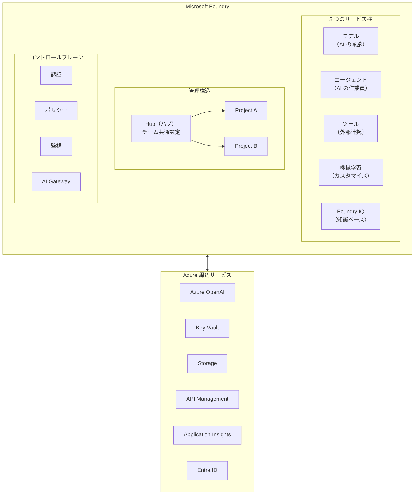

---

## 用語対照表

| 旧名称 | 現在の名称 | いつ頃変わったか |
|--------|-----------|-----------------|
| Azure AI Studio | Azure AI Foundry | 2024 年後半 |
| Azure AI Foundry | Microsoft Foundry | 2025 年 |
| Azure Active Directory（Azure AD） | Microsoft Entra ID | 2023 年 |
| Azure AI Search | Foundry IQ（ナレッジレイヤー） | 2025 年（統合） |

---

## 具体例

### 「社内 FAQ チャットボット」を作る場合の全体像

ある企業が「社内の問い合わせに自動で答える AI チャットボット」を作りたいとします。

1. **Hub** を作る → チーム全体のセキュリティや共通接続を設定
2. **Project** を作る → 「FAQ チャットボット開発」という個別プロジェクト
3. **モデル** を選ぶ → GPT-4o（コスト・品質のバランスが良い）を選択
4. **ツール** をつなぐ → 社内の FAQ データベースと接続
5. **エージェント** を作る → 「FAQ に答える」という指示を設定
6. **コントロールプレーン** で管理 → 誰が使えるか、1 分あたり何回まで質問できるか、を設定

---

## 注意（落とし穴）

> [!WARNING]
> **名前の変遷に惑わされないこと**
> 「Azure AI Studio」「Azure AI Foundry」「Microsoft Foundry」は **すべて同じ系統のサービス** です。記事の検索時に旧名称が出てきても、基本的な仕組みは共通しています。ただし、画面のレイアウトや一部機能が変わっていることがあるので、操作手順を確認するときは **公開日が新しい情報** を優先してください。

> [!CAUTION]
> **Microsoft Foundry ≠ Azure OpenAI Service**
> よく混同されますが、Azure OpenAI Service は「AI モデルを提供するサービス」であり、Microsoft Foundry の **一部** として組み込まれています。Foundry はそれに加えて、エージェント・ツール・監視・セキュリティなど、AI ソリューション全体をカバーします。

> [!IMPORTANT]
> **5 つの柱をすべて使う必要はない**
> 最初は「モデル」と「エージェント」だけ使って小さく始め、必要に応じて「ツール」「Foundry IQ」「機械学習」を追加していくのが現実的です。全部を一度に理解しようとする必要はありません。

---

# 第 2 章　Hub と Project ── 管理の基本構造

## 概要

Microsoft Foundry のリソース管理は **2 階層** になっています。

- **Hub（ハブ）** ＝ 「本社」。チーム全体に共通するルールやインフラを設定する場所
- **Project（プロジェクト）** ＝ 「部署」。個別のAI開発タスクを進める場所

この 2 階層構造のメリットは、**「設定の手間を減らしつつ、チームごとに独立して作業できる」** ことです。

たとえるなら：
- 本社（Hub）が「全社共通のセキュリティルール」と「経理システムへの接続情報」を決めておく
- 各部署（Project）は、そのルールを自動的に引き継ぎながら、自分の仕事だけに集中できる

つまり、Hub で一度セキュリティ設定をすれば、その下のすべての Project に自動で適用されます。Project ごとにイチから設定し直す必要はありません。

---

## 要点

### ① Hub（ハブ）が持つもの

Hub は「共通基盤」です。以下のものを管理します。

| Hub が管理するもの | 具体的には |
|-------------------|-----------|
| セキュリティ設定 | ネットワーク制御、暗号化、アクセスポリシー |
| 接続情報 | Azure OpenAI / Key Vault / Storage などへの接続 |
| コンピュートリソース | AI を動かすための計算資源 |
| ガバナンスポリシー | 利用ルールや制限事項 |

### ② Project（プロジェクト）が持つもの

Project は「個別の作業場所」です。以下のものを管理します。

| Project が管理するもの | 具体的には |
|-----------------------|-----------|
| モデルのデプロイ | どの AI モデルをどの設定で動かすか |
| データセット | 開発に使うデータ |
| エージェント | AI に仕事をさせる設定 |
| 評価結果 | AI がどれくらい正確に答えたかのテスト結果 |
| ファイル | アップロードしたドキュメントなど |

### ③ なぜ 2 階層なのか（設計の理由）

**1 階層だけだと困ること：**
- チーム A の設定変更がチーム B に影響する
- セキュリティ設定を毎回プロジェクトごとに設定し直す必要がある
- 誰がどのプロジェクトを見られるか、の管理が煩雑になる

**2 階層にすると：**
- Hub でセキュリティを一括管理 → 全 Project に自動適用
- Project ごとに独立 → チーム間の干渉がない
- アクセス権を Hub レベルと Project レベルで分けられる

---

## Hub / Project 階層構造図

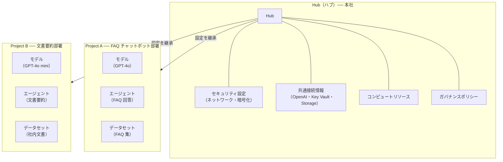

---

## 設計判断表 ── Hub と Project の使い分け

「これは Hub に設定すべき？ それとも Project？」を判断するための表です。

| 設定内容 | 置く場所 | 理由 |
|---------|---------|------|
| ネットワーク制限（VNet / プライベートエンドポイント） | **Hub** | 全プロジェクトに共通のネットワークポリシーを適用したいから |
| Azure OpenAI への接続情報 | **Hub** | 同じ接続を複数のプロジェクトで共有できるから |
| Key Vault への接続 | **Hub** | 秘密情報の管理は一元化すべきだから |
| 特定の AI モデルのデプロイ | **Project** | プロジェクトごとに使うモデルが異なるから |
| エージェントの設定 | **Project** | プロジェクトの目的に合わせた設定が必要だから |
| 実験用のデータセット | **Project** | 他のプロジェクトと混ざらないようにしたいから |
| ストレージアカウントの接続 | **Hub**（推奨） | 多くのプロジェクトで共有するほうが管理しやすいから |
| RBAC（アクセス権限） | **両方** | Hub レベルで大枠を決め、Project レベルで細かく制御する |

---

## Hub 作成時の設定項目一覧

Hub を作るときに決めるべき主な設定項目です。

| 設定項目 | 意味 | 推奨 | 注意 |
|---------|------|------|------|
| **Hub 名** | Hub の識別名（Azure 内でユニーク） | わかりやすい名前（例：`corp-ai-hub-prod`） | あとから変更できない |
| **リージョン** | Hub を作る場所（データセンターの地域） | `Japan East`（東日本）が基本 | モデルによっては対応リージョンが限られる |
| **リソースグループ** | Azure リソースをまとめるグループ | 環境別に分ける（例：本番用 / 開発用） | 既存のものを使ってもよい |
| **ストレージアカウント** | データ保存先 | 新規作成が推奨（Hub と同じリージョン） | 既存のものを使う場合はアクセス権を確認 |
| **Key Vault** | 秘密情報の保管先 | 新規作成が推奨 | 既存のものを使う場合はアクセスポリシーを確認 |
| **ネットワーク設定** | パブリック or プライベート | 本番環境は **プライベート（マネージドネットワーク）** | 開発時はパブリックでもよいが、本番では避ける |
| **マネージド ID** | Hub が他のサービスにアクセスするための ID | システム割り当てマネージド ID を有効化 | これがないと Key Vault や Storage に接続できない |

---

## 具体例

### 設計例 ── 3 チームで AI 開発する場合

ある企業に「カスタマーサポート」「社内ナレッジ」「データ分析」の 3 チームがあり、それぞれ AI を使いたいとします。

**設計方針：**

```
Hub: corp-ai-hub-prod（全チーム共通）
├── 共通設定
│   ├── ネットワーク: マネージドVNet（プライベート）
│   ├── 接続: Azure OpenAI（East Japan）
│   ├── 接続: Key Vault
│   └── 接続: Storage Account
│
├── Project: cs-chatbot（カスタマーサポートチーム）
│   ├── モデル: GPT-4o（高品質な回答が必要）
│   ├── エージェント: 問い合わせ対応ボット
│   └── データ: 過去の問い合わせログ
│
├── Project: knowledge-search（社内ナレッジチーム）
│   ├── モデル: GPT-4o mini（コスト重視）
│   ├── エージェント: 社内文書検索
│   └── データ: 社内マニュアル集
│
└── Project: data-analysis（データ分析チーム）
    ├── モデル: GPT-4o + Code Interpreter
    ├── エージェント: データ分析レポート生成
    └── データ: 売上データ
```

**この設計のメリット：**
- ネットワーク設定は Hub で 1 回だけ → 全 Project に適用
- Key Vault の接続は Hub で 1 回だけ → 全 Project で利用可能
- 各チームは自分の Project だけを見る → 他チームのデータは見えない

---

## 注意（落とし穴）

> [!WARNING]
> **Hub のリージョン選びは慎重に**
> Hub のリージョン（データセンターの場所）は **あとから変更できません**。また、使いたい AI モデルによっては「このリージョンでは使えない」ということがあります。Hub を作る前に、使いたいモデルが対応しているリージョンを確認してください。

> [!CAUTION]
> **Hub を削除すると、その下の全 Project が消える**
> Hub は Project の「親」です。Hub を削除すると、その下のすべての Project、モデル、エージェント、データが **まとめて削除されます**。本番環境の Hub 削除は絶対に慎重に行ってください。

> [!IMPORTANT]
> **1 Hub ＝ 1 環境 がおすすめ**
> 「開発環境」と「本番環境」を同じ Hub にまとめると、開発中の設定ミスが本番に影響するリスクがあります。環境ごとに Hub を分けるのが安全です。
> - `corp-ai-hub-dev`（開発用）
> - `corp-ai-hub-prod`（本番用）

---

# 第 3 章　モデル ── 選び方・使い方

## 概要

Microsoft Foundry でいう **「モデル」** とは、**AI の頭脳** のことです。

人間に質問を投げると答えが返ってくるように、AI モデルに質問やデータを渡すと、回答や分析結果が返ってきます。Microsoft Foundry では、**さまざまなメーカーの AI モデル** をカタログから選んで使うことができます。

たとえるなら、Microsoft Foundry のモデルカタログは **「レンタル重機のカタログ」** です。

- 用途に合った重機（モデル）を選ぶ
- 小さな現場には小型の重機（軽量モデル）、大規模工事には大型重機（高性能モデル）
- 使った分だけ料金を払う

---

## 要点

### ① 使えるモデルの種類

Microsoft Foundry では、さまざまな提供元の AI モデルを使えます。

| カテゴリ | 提供元の例 | 代表的なモデル | 得意なこと |
|---------|-----------|---------------|-----------|
| **テキスト生成** | OpenAI | GPT-4o, GPT-4o mini, GPT-5 | 文章の作成、質問への回答、要約 |
| **コード生成** | OpenAI | GPT-5-Codex | プログラムコードの生成・レビュー |
| **画像生成** | OpenAI | GPT-image-1 | 画像の作成・編集 |
| **音声処理** | OpenAI | gpt-realtime | 音声からテキスト、テキストから音声 |
| **オープンソース** | Meta, Mistral | Llama, Mistral | コスト抑制、カスタマイズしやすい |
| **推論特化** | OpenAI | o4-mini | 複雑な論理的思考が必要なタスク |

### ② モデルの選び方

モデル選びのポイントは **3 つ** です。

1. **用途** ── 何をさせたいか？（チャット？ コード生成？ 画像？）
2. **品質 vs コスト** ── 高い精度が必要か？ それとも安く済ませたいか？
3. **速度** ── リアルタイムで返事が必要か？ 多少遅くても構わないか？

### ③ デプロイ方式（モデルの動かし方）

モデルを選んだら「どうやって動かすか」も決める必要があります。ここでは3つの方式があります。

**デプロイ** とは、「選んだモデルを実際に使える状態にすること」です。レンタルした重機を現場に搬入して、動ける状態にするようなものです。

---

## モデル選定フロー

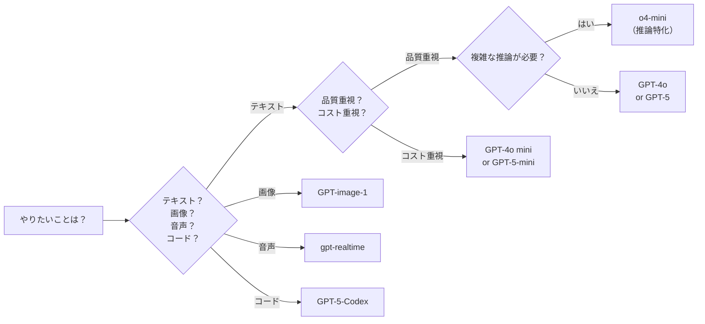

---

## デプロイ方式比較表

| 方式 | 仕組み | メリット | デメリット | 向いている場面 |
|------|--------|---------|-----------|--------------|
| **標準デプロイ** | 専用のコンピュートを割り当てる | 安定した性能、予測可能なコスト | 使っていなくても課金される | 常時稼働するサービス |
| **サーバーレスAPI** | 使った分だけ課金される方式 | 初期コストゼロ、スケール自動 | アクセス集中時に遅くなる可能性 | 開発・テスト、利用量が読めないとき |
| **マネージドコンピュート** | Azure が計算資源を自動管理 | 細かい設定が不要 | カスタマイズの自由度が低い | エージェントや評価処理の実行 |

---

## モデルルーターの仕組み

**モデルルーター** は、Microsoft Foundry に搭載されている **「自動振り分け機能」** です。

やっていることは単純で：
- ユーザーからのリクエスト（質問や依頼）を受け取る
- その内容に応じて、**一番コスパの良いモデル** に自動で振り分ける
- 簡単な質問 → 安くて速いモデル（GPT-4o mini など）
- 難しい質問 → 高性能なモデル（GPT-4o, GPT-5 など）

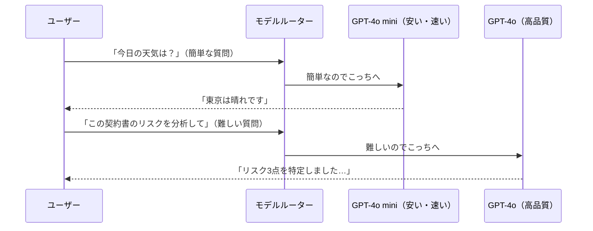

**メリット：** 全部の質問を高性能モデルに投げると高コスト。ルーターを使えば、**品質を落とさずにコストを 30〜50% 削減** できるケースがあります。

---

## 具体例

### 「社内ヘルプデスク AI」のモデル設計

社内の IT ヘルプデスクを AI 化する場合を考えます。

**要件：**
- パスワードリセットなどの定型質問 → 速く安く処理したい
- ネットワーク障害の切り分け → 正確に分析してほしい
- 月間 10,000 件の問い合わせ

**モデル設計：**

| 問い合わせの種類 | 割合 | 選ぶモデル | デプロイ方式 | 理由 |
|----------------|------|-----------|------------|------|
| 定型質問（パスワードリセット等） | 60% | GPT-4o mini | サーバーレス API | 安く速い。定型回答は軽いモデルで十分 |
| 技術的な質問（障害切り分け等） | 30% | GPT-4o | 標準デプロイ | 正確さが重要。安定した性能が必要 |
| 複雑な分析（システム構成の相談等） | 10% | GPT-5 | サーバーレス API | 頻度が低いので、使った分だけ課金で十分 |

**ポイント：** モデルルーターを使えば、上記の振り分けを **手動で設定しなくても自動でやってくれます**。

---

## 注意（落とし穴）

> [!WARNING]
> **モデルの対応リージョンを必ず確認する**
> すべてのモデルがすべてのリージョン（地域のデータセンター）で使えるわけではありません。たとえば、最新の GPT-5 は当初 `East US` や `West Europe` でしか使えず、`Japan East` では使えないことがあります。Hub のリージョンを決める前に、使いたいモデルの対応状況を確認してください。

> [!CAUTION]
> **コスト見積もりを事前にやること**
> AI モデルの料金は「トークン単位」（＝テキストの長さに応じた課金単位）です。テスト段階では安く見えても、本番で大量に使うと予想外のコストになることがあります。必ず月間の利用量を見積もってからデプロイしてください。

> [!IMPORTANT]
> **「一番高いモデル＝最適」ではない**
> 高性能モデルは賢いですが、遅くて高い。簡単なタスクには軽量モデルのほうが速くて安く、結果も十分です。**用途に合ったモデルを選ぶ**ことが、設計の基本です。

---

# 第 4 章　エージェント ── AI のお仕事係

## 概要

**エージェント** とは、AI モデルに「役割」と「道具」と「指示」を与えて、**実際に仕事をさせる仕組み** のことです。

第 3 章で説明した「モデル」は、あくまで頭脳です。頭脳だけでは仕事はできません。そこで必要なのがエージェントです。

たとえるなら：
- **モデル** ＝ 頭の良い人の「脳」
- **エージェント** ＝ その人に名刺（役割）・道具箱（ツール）・作業指示書（インストラクション）を渡して、**仕事ができる状態にしたもの**

つまり、エージェント ＝ **モデル ＋ ツール ＋ 指示** のセットです。

たとえば「カスタマーサポート担当のエージェント」は：
- 頭脳：GPT-4o（モデル）
- 道具：FAQ データベースへのアクセス（ツール）
- 指示：「お客様の質問に丁寧に答えてください。不明な点は担当者に引き継いでください」（インストラクション）

---

## 要点

### ① エージェントの 3 つのタイプ

Microsoft Foundry では、3 種類の方法でエージェントを作れます。

| タイプ | 作り方 | 難易度 | 特徴 |
|--------|--------|--------|------|
| **宣言型エージェント** | Foundry ポータル上でマウス操作だけで作る | ★☆☆ 簡単 | プログラミング不要。設定を入力するだけ |
| **コード型エージェント** | Python や .NET の SDK でプログラムを書いて作る | ★★★ 中〜上級 | 自由度が高い。複雑な処理が書ける |
| **ホスト型エージェント** | コードで作ったエージェントを Foundry に預けて動かす | ★★☆ 中級 | サーバー管理不要。Foundry が実行環境を用意してくれる |

**最初は「宣言型エージェント」から始めるのがおすすめ** です。プログラミングの知識がなくても作れます。

### ② エージェントの構成要素

すべてのエージェントは、以下の 4 つで構成されます。

| 構成要素 | 何か | 具体例 |
|---------|------|--------|
| **モデル** | AI の頭脳 | GPT-4o, GPT-4o mini |
| **インストラクション** | 「こう動いてね」という指示文 | 「お客様の質問に日本語で丁寧に回答してください」 |
| **ツール** | 外部のデータやシステムにアクセスする手段 | FAQ データベース、社内 API、Web 検索 |
| **ナレッジ** | エージェントが参照できる知識データ | 社内マニュアル、製品仕様書 |

### ③ マルチエージェント ── 複数の AI が連携する仕組み

1 つのエージェントだけでは対応しきれない複雑な仕事は、**複数のエージェントを連携させる** ことで解決します。これが「マルチエージェント」です。

たとえるなら、**チーム作業** です：
- 「受付担当」エージェントがお客様の質問を受け取る
- 問い合わせの種類を判断して、「技術担当」か「営業担当」のエージェントに振り分ける
- 各担当が回答を作成して、「受付担当」が最終回答をまとめてお客様に返す

---

## エージェント構成図

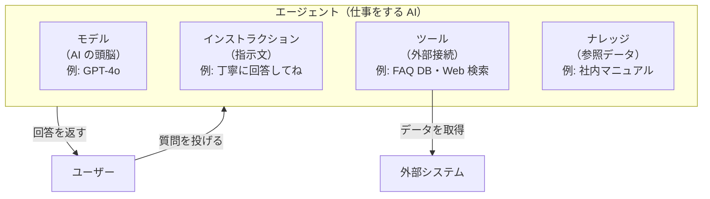

---

## エージェントの種類 比較表

| 比較項目 | 宣言型 | コード型 | ホスト型 |
|---------|--------|---------|---------|
| **作り方** | ポータルで設定 | Python / .NET で書く | コードで作って Foundry に預ける |
| **必要なスキル** | なし（設定だけ） | プログラミング能力 | プログラミング＋デプロイ知識 |
| **自由度** | 低い（テンプレ的） | 高い（何でもできる） | 高い |
| **実行環境の管理** | 不要 | 自分で用意 | Foundry が管理（不要） |
| **おすすめ場面** | シンプルな Q&A ボット | 複雑な業務ロジック | 本番運用のエージェント |
| **利用フレームワーク** | ─ | Microsoft Agent Framework | Microsoft Agent Framework |

---

## マルチエージェント通信図

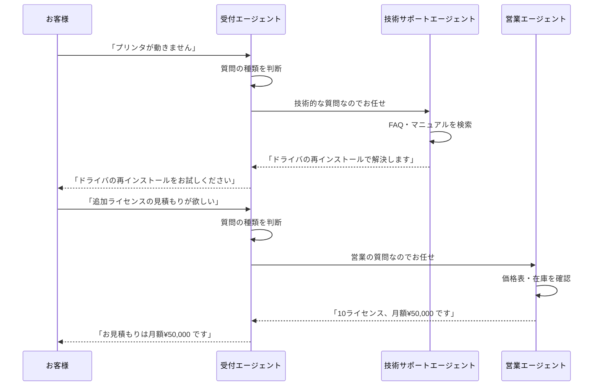

---

## 具体例

### 宣言型エージェントの作成（ポータルでの操作イメージ）

「社内 FAQ に答えるエージェント」を作る場合の手順です。

| ステップ | やること | 設定内容 |
|---------|---------|---------|
| 1 | Foundry ポータルにログイン | → Project を選択 |
| 2 | 「エージェント」メニューを開く | → 「新規作成」をクリック |
| 3 | エージェント名を入力 | 例：`faq-support-agent` |
| 4 | モデルを選択 | GPT-4o mini（コスト重視） |
| 5 | インストラクション（指示）を入力 | 「あなたは社内 FAQ アシスタントです。提供されたナレッジベースから回答してください。回答がわからない場合は、その旨を伝えてください。」 |
| 6 | ツールを追加 | FAQ データベースへの接続を設定 |
| 7 | ナレッジを追加 | 社内 FAQ のファイルをアップロード |
| 8 | テスト | 右側のチャット画面でテスト |
| 9 | デプロイ | 「デプロイ」ボタンで公開 |

**これだけで、プログラミングなしでエージェントが動きます。**

---

## 注意（落とし穴）

> [!WARNING]
> **インストラクション（指示文）が曖昧だと、エージェントも曖昧に動く**
> 「なんでも答えて」という指示は危険です。エージェントが勝手に嘘の情報を作り出す（ハルシネーション）ことがあります。**「FAQ データベースの情報だけを使って回答して」「わからなければ『わかりません』と答えて」** のように、明確に制約を書きましょう。

> [!CAUTION]
> **マルチエージェントは設計が複雑になる**
> エージェントが増えるほど「誰が何を担当するか」「どの順番で処理するか」の設計が複雑になります。まずは **1 つのエージェント** で動かしてから、必要に応じて分割するのが安全です。

> [!IMPORTANT]
> **エージェントのテストは必ず本番投入前にやる**
> エージェントは AI なので、想定外の回答をすることがあります。テスト用の質問リストを用意し、期待する回答が返ってくるか確認してからデプロイしてください。Microsoft Foundry には **評価機能** が内蔵されているので、それを使うのがおすすめです。

---

# 第 5 章　ツールと接続 ── 外部連携の仕組み

## 概要

エージェント（第 4 章）は、頭脳（モデル）と指示だけでも動けます。しかし、**外の世界の情報にアクセスできなければ、できることは限られます**。

たとえば：
- 「今月の売上を教えて」→ 売上データベースにアクセスできないと答えられない
- 「顧客の情報を調べて」→ CRM（顧客管理システム）に接続できないと無理

そこで必要なのが **ツール** と **接続** です。

**ツール** ＝ エージェントが外部と情報をやりとりするための「手段」
**接続（Connection）** ＝ 外部のサービスとつながるための「回線」

たとえるなら：
- ツールは「電話機」
- 接続は「電話回線」
- 電話機（ツール）があっても、回線（接続）がなければ電話はかけられない

---

## 要点

### ① MCP（Model Context Protocol）── AI と外部をつなぐ共通規格

**MCP** とは、AI エージェントが外部のシステムと情報をやりとりするための **共通ルール（規格）** です。

なぜ共通規格が必要かというと：
- SAP、Salesforce、ServiceNow、自社システム…… 連携先は多種多様
- それぞれに別々の接続方法を用意すると、開発も管理も大変
- MCP という共通の「言葉」を使えば、**どのシステムとも同じやり方で接続できる**

たとえるなら、MCP は **USB 規格** のようなものです。USB があればマウスもキーボードもプリンタも同じ端子で接続できるように、MCP があれば SAP も Salesforce も同じ方法で AI とつなげます。

### ② 3 種類のツール

| ツールの種類 | 何ができるか | 具体例 |
|------------|------------|--------|
| **既成コネクタ** | すぐに使えるプリセット接続（1,500 種類以上） | Salesforce, SAP, ServiceNow, Shopify, GitHub |
| **Azure サービスツール** | Azure の各サービスと連携 | Azure AI Search, Speech, Vision, Translator |
| **カスタムツール** | 自分で作る接続 | 自社 API, Azure Functions, Logic Apps |

### ③ Foundry IQ ── 統合ナレッジレイヤー

**Foundry IQ** とは、エージェントが参照できる **知識の倉庫** です（以前の Azure AI Search が進化したもの）。

- エージェントに「この資料を参考にして答えてね」と言える
- 社内文書、マニュアル、FAQ などをアップロードして使う
- 自動でインデックス（索引）を作り、エージェントが素早く検索できるようにする

---

## ツール接続の全体図

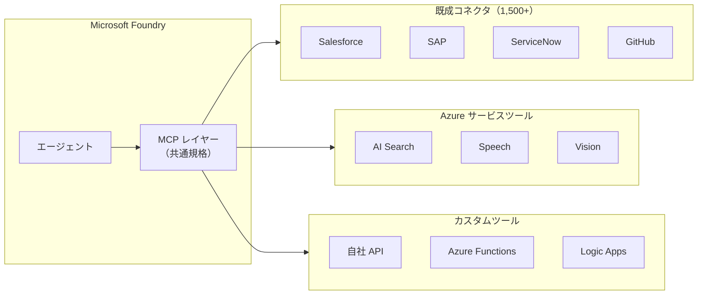

---

## コネクタ分類表

| カテゴリ | 代表的なコネクタ | 主な用途 |
|---------|----------------|---------|
| **CRM / 営業** | Salesforce, HubSpot, Dynamics 365 | 顧客情報の取得・更新 |
| **ERP / 業務** | SAP, Oracle, NetSuite | 受発注・在庫・会計データの参照 |
| **IT サービス** | ServiceNow, Jira, PagerDuty | チケット管理、インシデント対応 |
| **EC / 小売** | Shopify, WooCommerce | 商品データ・注文状況の取得 |
| **開発** | GitHub, GitLab, Azure DevOps | コード管理、CI/CD の操作 |
| **コミュニケーション** | Teams, Slack, Outlook | メッセージ送受信、予定確認 |
| **データ / BI** | Power BI, SQL Database, Cosmos DB | データの取得・分析結果の参照 |
| **AI サービス** | Azure AI Speech, Vision, Translator | 音声認識、画像認識、翻訳 |

---

## カスタムツール作成フロー

自社独自の API をエージェントのツールとして使えるようにする流れです。

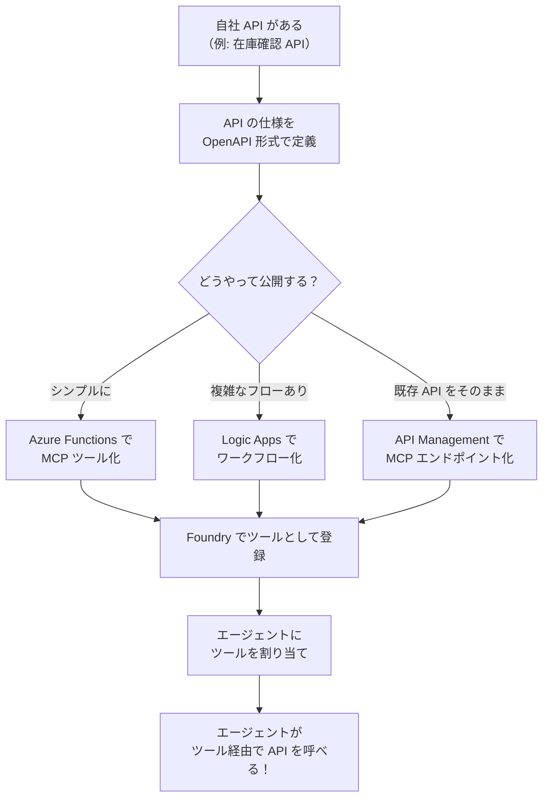

---

## 具体例

### 「在庫確認ボット」に自社 API をつなぐ

営業担当者が「製品 A の在庫は何個？」と聞くと、AI が倉庫システムの在庫数を答えてくれるボットを作るケース。

| ステップ | やること | 詳細 |
|---------|---------|------|
| 1 | 自社の在庫 API を確認 | `GET /api/stock/{product_id}` で在庫数を返す API がある |
| 2 | MCP ツール定義を書く | 「この API は在庫数を返します。パラメータは product_id です」と定義 |
| 3 | Foundry にツールとして登録 | ポータルの「ツール」メニューからカスタムツールを追加 |
| 4 | 認証情報を設定 | API キーを Key Vault に保存し、接続情報に設定 |
| 5 | エージェントにツールを割り当て | 「在庫確認ツール」をエージェントの使えるツールに追加 |
| 6 | テスト | 「製品 A の在庫は？」→ エージェントが API を呼んで「150 個です」と回答 |

**ポイント：** エージェントは「いつどのツールを使うか」を自分で判断します。「在庫」と聞かれたら在庫ツールを使い、「天気」と聞かれたらツールを使わずに回答します。

---

## 注意（落とし穴）

> [!WARNING]
> **接続のための認証情報は Key Vault に入れること**
> API キーやパスワードをコードや設定ファイルに直書きすると、漏洩のリスクがあります。必ず **Azure Key Vault** に保管し、接続設定から Key Vault を参照してください。

> [!CAUTION]
> **ツールが多すぎるとエージェントが混乱する**
> エージェントに 20 個も 30 個もツールを割り当てると、「どのツールを使うか」の判断が難しくなり、誤ったツールを使う頻度が上がります。**1 つのエージェントに割り当てるツールは 5〜10 個程度** に抑え、必要に応じてマルチエージェント構成で分割しましょう。

> [!IMPORTANT]
> **MCP ツールにもレート制限をかけること**
> 外部 API には「1 分間に何回まで」という制限がある場合が多いです。エージェントが大量にツールを呼ぶと、API の制限に引っかかってエラーになります。AI Gateway のレート制限機能を使って、呼び出し回数を制御してください。

---

# 第 6 章　認証・セキュリティ・ガバナンス

## 概要

AI をビジネスで使うとき、**「誰がアクセスできるか」「データは安全か」「ルールは守られているか」** が非常に重要です。

Microsoft Foundry では、セキュリティを **3 つの観点** で管理します。

| 観点 | 何を守るか | たとえると |
|------|-----------|-----------|
| **認証** | 本人確認（この人は誰？） | 工場の「入館証チェック」 |
| **認可（RBAC）** | 権限管理（何ができる？） | 工場内の「立入禁止エリアの管理」 |
| **ガバナンス** | ルール遵守（規則通りに使ってる？） | 工場の「安全管理規程」 |

これらは **Hub レベル** で一括設定し、**Project レベル** で細かく調整するのが基本です（第 2 章で説明した 2 階層の考え方）。

---

## 要点

### ① Microsoft Entra ID ── 認証の仕組み

**Microsoft Entra ID**（旧 Azure Active Directory / Azure AD）は、**「あなたは誰ですか？」を確認する仕組み** です。

- Microsoft Foundry にアクセスする全ユーザーは、まず Entra ID で本人確認される
- パスワード＋多要素認証（スマホの認証アプリなど。パスワードだけでなく、もう 1 つの確認手段を使うこと）が推奨
- **Entra Agent ID**: エージェント（AI）専用の ID。人間ではなく AI が他のサービスにアクセスする際に使う

### ② RBAC（ロールベースアクセス制御）

**RBAC** とは、**「この人はこの役割（ロール）だから、これができる」** という仕組みです。

たとえるなら：
- 「工場長」ロール → 全エリアに入れる、設備の追加・削除もできる
- 「作業員」ロール → 自分の作業場だけ。設備をいじることはできない
- 「見学者」ロール → 見るだけ。何も操作できない

### ③ データ保護

- **保存時暗号化**: データが保存されているときも暗号化されている（ディスクを盗まれても読めない）
- **通信時暗号化（TLS）**: データが通信中に暗号化されている（通信を傍受されても読めない）
- **Key Vault**: パスワードや API キーは Key Vault に保管し、必要なときだけ取り出す

### ④ AI コンテンツ安全性

**Azure AI Content Safety** は、AI の入出力から **有害なコンテンツを検出・ブロック** する仕組みです。

- 暴力的な内容、ヘイトスピーチ、個人情報（PII）の検出
- エージェントが不適切な回答を返さないようにフィルタリング
- 設定で検出レベルを調整可能

---

## 認証フロー図

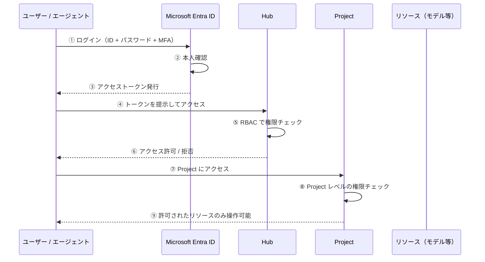

---

## RBAC 設計表

Microsoft Foundry で使う主なロール（役割）と権限の対応です。

| ロール名 | できること | 推奨する割り当て先 | 注意 |
|---------|-----------|------------------|------|
| **所有者（Owner）** | すべての操作（作成・削除・権限変更含む） | IT 管理者・インフラ担当（最小限の人数） | 権限が最大。誤操作のリスクも最大 |
| **共同作成者（Contributor）** | リソースの作成・変更・削除ができる。権限変更はできない | 開発チームのリーダー | 他人の権限を変更できないので安全 |
| **Azure AI Developer** | モデルのデプロイ・エージェント作成ができる | AI 開発者 | Foundry 特有のロール |
| **Azure AI Inference Deployment Operator** | モデルのデプロイのみ可能 | 運用担当者 | 開発はできない。運用特化 |
| **閲覧者（Reader）** | 見るだけ。変更はできない | 経営層・監査担当 | 誤操作の心配がない |

### RBAC の設計ポイント

- **最小権限の原則**: 必要な権限だけを与える。「とりあえず所有者」は避ける
- **Hub レベル**: 全体の管理者に広い権限を付与
- **Project レベル**: 各チームのメンバーに、そのプロジェクトだけの権限を付与

---

## セキュリティ設定チェック表

| 設定項目 | 意味 | 推奨 | 注意 |
|---------|------|------|------|
| **多要素認証（MFA）** | パスワード以外にもう 1 つの確認手段 | **必須で有効化** | これがないとパスワード漏洩で即侵入される |
| **条件付きアクセス** | 「この場所/デバイスからしかアクセスさせない」 | 社内ネットワークのみ許可（推奨） | 過度に制限すると在宅ワーカーが困る |
| **マネージド ID** | Hub/Project が他の Azure サービスにアクセスするための ID | システム割り当てマネージド ID を有効化 | API キーの直書きを不要にする |
| **Key Vault アクセスポリシー** | 誰が Key Vault の秘密情報を読めるか | 必要なサービスだけに絞る | 全員に読み取り権限を与えない |
| **ネットワーク制限** | パブリックインターネットからのアクセス可否 | 本番は **プライベートのみ** | 第 7 章で詳しく解説 |
| **保存時暗号化** | ストレージのデータ暗号化 | **既定で有効**（特に設定不要） | カスタムキーを使うなら Key Vault で管理 |
| **通信暗号化（TLS）** | ネットワーク通信の暗号化 | **既定で有効**（TLS 1.2 以上） | 古い TLS バージョンは無効化する |
| **AI コンテンツフィルタ** | 有害コンテンツの検出・ブロック | **有効にする** | フィルタの厳しさは用途に応じて調整 |
| **PII フィルタリング** | 個人情報（氏名・住所・電話番号等）の検出 | 個人情報を扱う場合は **必須** | 誤検出もあるのでテストが必要 |
| **監査ログ** | 誰が何をしたかの記録 | **必ず有効化** | コンプライアンス監査で必要になる |

---

## 具体例

### 3 チーム構成の RBAC 設計例

第 2 章で紹介した 3 チーム構成を例にします。

| 対象 | Hub でのロール | Project: cs-chatbot | Project: knowledge-search | Project: data-analysis |
|------|--------------|---------------------|--------------------------|----------------------|
| IT 管理者（田中さん） | **所有者** | ─（Hub から継承） | ─（Hub から継承） | ─（Hub から継承） |
| CS チームリーダー | 閲覧者 | **共同作成者** | 閲覧者 | アクセスなし |
| CS チームメンバー | ─ | **AI Developer** | アクセスなし | アクセスなし |
| ナレッジチームリーダー | 閲覧者 | アクセスなし | **共同作成者** | アクセスなし |
| データ分析チームリーダー | 閲覧者 | アクセスなし | アクセスなし | **共同作成者** |
| 経営層 | **閲覧者** | 閲覧者 | 閲覧者 | 閲覧者 |

**ポイント：**
- IT 管理者は Hub の「所有者」→ 全体を管理できる
- 各チームリーダーは自分の Project だけ「共同作成者」→ 他チームのデータは見えない
- 経営層は全体を「閲覧者」→ 状況確認はできるが、設定変更はできない

---

## 注意（落とし穴）

> [!WARNING]
> **「とりあえず全員に所有者ロール」は絶対にやらない**
> 所有者ロールは Hub やリソースの **削除もできてしまう** 最強の権限です。誤操作で本番環境を削除する事故を防ぐために、所有者は 2〜3 人に限定し、他のメンバーには必要最小限のロールを割り当ててください。

> [!CAUTION]
> **マネージド ID を使わないと、認証情報が漏洩する**
> 「接続先の API キーをコードに書いちゃえ」は最大の落とし穴です。コードが漏洩した瞬間にすべてのサービスに不正アクセスされます。マネージド ID を使えば、API キーをコードに書かずに安全に認証できます。

> [!IMPORTANT]
> **AI コンテンツフィルタは「強くしすぎ」にも注意**
> フィルタを最高レベルにすると、正当なビジネス文書（医療用語、法律用語など）まで誤ってブロックすることがあります。用途に応じて適切なレベルに調整し、テストで確認してください。

---

# 第 7 章　ネットワークと通信

## 概要

Microsoft Foundry を安全に使うには、**「どのネットワーク経路でデータがやりとりされるか」** を理解し、適切に設計する必要があります。

簡単に言うと、通信経路には **2 つの選択肢** があります。

| 経路 | 仕組み | たとえると |
|------|--------|-----------|
| **パブリック** | インターネットを経由する | 公道を使って荷物を運ぶ |
| **プライベート** | Azure 内部の専用回線を使う | 私有地の専用道路で荷物を運ぶ |

**本番環境ではプライベート経路が推奨** です。パブリック経路はインターネットを通るため、セキュリティリスクが高くなります。

---

## 要点

### ① マネージドネットワーク

**マネージドネットワーク** とは、Microsoft Foundry が **自動的に用意してくれるプライベートネットワーク** です。

- Hub を作るときに「マネージドネットワーク」を選ぶと、自動で専用のネットワークが構築される
- このネットワーク内では、データがインターネットを一切通らずにやりとりされる
- 設定はほぼ自動。ネットワークの深い知識がなくても使える

### ② プライベートエンドポイント

**プライベートエンドポイント** とは、Azure のサービス（Storage, Key Vault, OpenAI など）に **インターネットを通さずに直接つなげる接続口** です。

通常、Azure のサービスにアクセスするにはインターネットを経由します。しかし、プライベートエンドポイントを作ると、**Azure 内部の専用回線** で直接つながります。

たとえるなら：
- パブリック → 公道を使って銀行（Azure サービス）に行く。途中で誰かに見られるリスクあり
- プライベートエンドポイント → 銀行直結の地下通路で行く。外に出ないので安全

### ③ AI Gateway

**AI Gateway** は、AI モデルへのリクエスト（問い合わせ）の **交通整理をしてくれる仕組み** です。Azure API Management（API の管理サービス） をベースに動いています。

AI Gateway がやってくれること：
- **レート制限**: 1 分間のリクエスト数を制限（API の使いすぎを防ぐ）
- **負荷分散**: 複数のモデルエンドポイントにリクエストを分散
- **認証チェック**: 権限のないリクエストをブロック
- **ログ記録**: 誰が何を聞いたか記録

---

## ネットワーク構成図

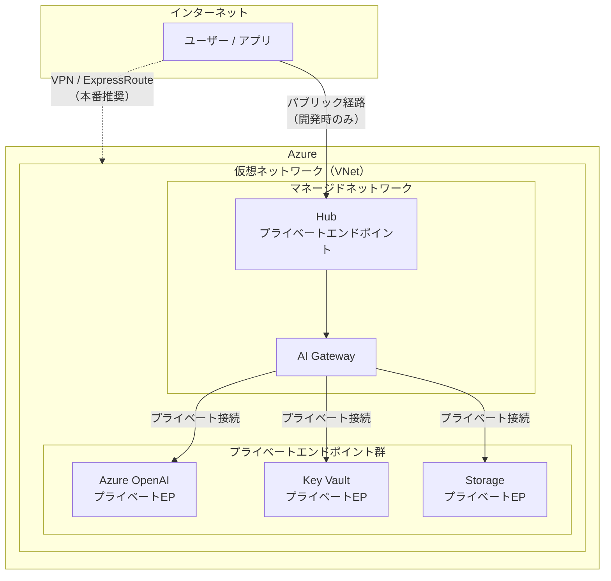

---

## 通信経路の比較表

| 比較項目 | パブリック経路 | プライベート経路 |
|---------|-------------|----------------|
| **通信経路** | インターネット経由 | Azure 内部の専用回線 |
| **セキュリティ** | 低い（暗号化はされるが、インターネットを通る） | 高い（外部に出ない） |
| **設定の手間** | ほぼなし | やや必要（VNet, プライベートエンドポイントの設定） |
| **コスト** | 追加料金なし | プライベートエンドポイントごとに追加料金 |
| **速度** | 普通 | 速い（Azure 内部で完結するため） |
| **推奨用途** | 開発・テスト環境 | **本番環境** |

---

## AI Gateway の処理フロー

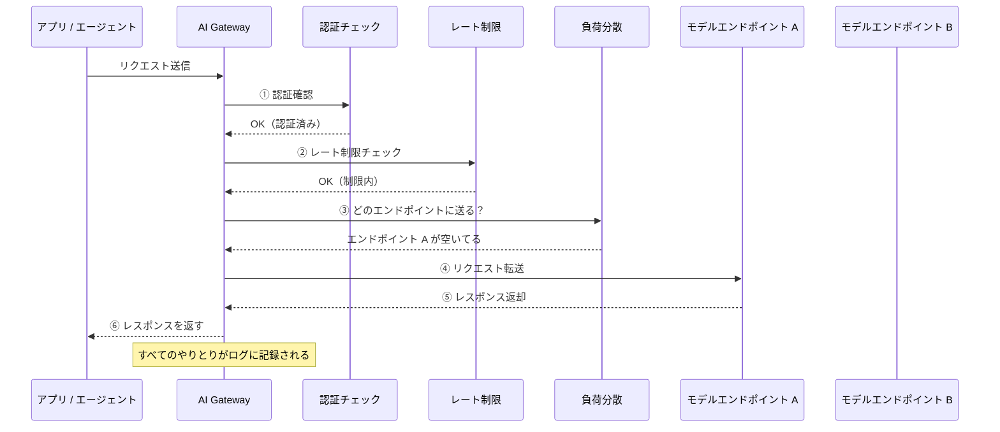

---

## 具体例

### 本番環境のネットワーク設計

本番環境で AI チャットボットを公開する場合のネットワーク設計例です。

| 設計項目 | 設定内容 | 理由 |
|---------|---------|------|
| Hub のネットワーク | **マネージドネットワーク（プライベート）** | 内部通信をインターネットに出さないため |
| Azure OpenAI への接続 | **プライベートエンドポイント** | AI モデルとの通信を完全に内部化 |
| Key Vault への接続 | **プライベートエンドポイント** | 秘密情報へのアクセスを安全にする |
| Storage への接続 | **プライベートエンドポイント** | データの保存・読み出しを安全にする |
| ユーザーからのアクセス | **VPN または ExpressRoute 経由** | 社内ネットワークから Azure に安全にアクセス |
| AI Gateway のレート制限 | **1 分あたり 60 リクエスト / ユーザー** | API の使いすぎによるコスト超過を防ぐ |
| パブリックアクセス | **無効化** | インターネットからの直接アクセスを遮断 |

### 開発環境のネットワーク設計（簡易版）

| 設計項目 | 設定内容 | 理由 |
|---------|---------|------|
| Hub のネットワーク | **パブリック** | 開発中はすぐに試せることを優先 |
| プライベートエンドポイント | **なし** | コスト削減（開発環境なので） |
| AI Gateway のレート制限 | **1 分あたり 30 リクエスト / ユーザー** | テスト中の誤操作で大量課金を防ぐ |
| パブリックアクセス | **特定 IP のみ許可** | 開発チームの IP アドレスだけ通す |

---

## 注意（落とし穴）

> [!WARNING]
> **本番環境でパブリックアクセスを有効にしない**
> 開発時にパブリックアクセスを使っていて、そのまま本番に持ち込むケースがあります。本番では必ずプライベートに切り替えるか、少なくとも **IP 制限** をかけてください。

> [!CAUTION]
> **プライベートエンドポイントは追加コストがかかる**
> プライベートエンドポイントは 1 つにつき時間単位の料金が発生します。必要なサービス分だけ作成し、使わなくなったら削除してください。目安として、1 つのプライベートエンドポイントで月額数千円程度です。

> [!IMPORTANT]
> **VNet の設計は最初にしっかり考える**
> VNet（仮想ネットワーク＝Azure 内に作る専用のネットワーク空間）の IP アドレス範囲は、あとから変更が難しいです。将来のサービス拡張を見越して、十分な IP アドレス範囲を確保してください。社内の既存ネットワークと IP 範囲が重複しないことも確認が必要です。

---

# 第 8 章　構築手順 ── ゼロから動かすまで

## 概要

この章では、いよいよ **実際に手を動かして Microsoft Foundry の環境を構築する手順** を説明します。

これまでの章で学んだ知識をもとに、以下の流れで **「FAQ チャットボット」を動かす** ところまでをゴールにします。

1. 前提条件の確認
2. Hub を作る
3. Project を作る
4. モデルをデプロイする
5. 接続を設定する
6. エージェントを作って動かす
7. セキュリティを確認する

ここでは **Foundry ポータル（Web 画面）** で操作する方法をメインに解説します。CLI（コマンドライン）や SDK（プログラムから操作する方法）でもできますが、まず画面操作で仕組みを理解してから進むのがおすすめです。

---

## 構築手順フローチャート

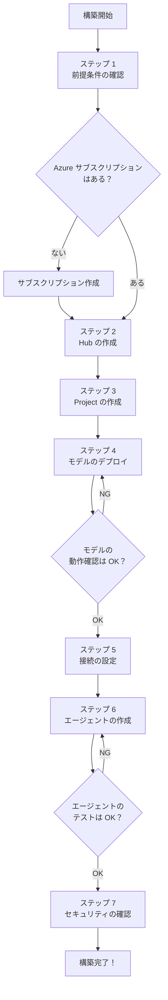

---

## 要点

### ステップ 1：前提条件の確認

構築を始める前に、以下の準備ができているか確認してください。

| 確認項目 | 必要なもの | 確認方法 |
|---------|-----------|---------|
| Azure サブスクリプション | 有効なサブスクリプション | Azure Portal にログインして確認 |
| 権限 | サブスクリプションの「共同作成者」以上のロール | Azure Portal → サブスクリプション → アクセス制御(IAM) |
| Microsoft Entra ID | テナント（組織） | 通常、会社のアカウントがあれば存在する |
| リージョンの確認 | 使いたいモデルが使えるリージョン | Microsoft の公式ドキュメントで確認 |

### ステップ 2：Hub の作成

| 手順 | 操作 | 詳細 |
|------|------|------|
| 2-1 | Foundry ポータルにアクセス | ブラウザで Foundry ポータルの URL にアクセスし、ログイン |
| 2-2 | 「管理」→「Hub」を開く | 左メニューから「管理」セクションへ |
| 2-3 | 「+新しい Hub を作成」をクリック | |
| 2-4 | Hub 名を入力 | 例：`corp-ai-hub-dev`（開発用） |
| 2-5 | リージョンを選択 | `Japan East`（東日本）推奨。ただしモデル対応を確認 |
| 2-6 | リソースグループを選択 or 新規作成 | 例：`rg-ai-dev` |
| 2-7 | ストレージアカウントを設定 | 「新規作成」を選択（Hub と同じリージョン） |
| 2-8 | Key Vault を設定 | 「新規作成」を選択 |
| 2-9 | ネットワーク設定 | 開発用は「パブリック」、本番用は「プライベート」 |
| 2-10 | 「作成」をクリック | 数分で作成完了 |

### ステップ 3：Project の作成

| 手順 | 操作 | 詳細 |
|------|------|------|
| 3-1 | 作成した Hub を開く | Hub の一覧からクリック |
| 3-2 | 「+新しい Project を作成」をクリック | |
| 3-3 | Project 名を入力 | 例：`faq-chatbot-project` |
| 3-4 | 「作成」をクリック | Hub の設定（ネットワーク・接続等）を自動で引き継ぐ |

### ステップ 4：モデルのデプロイ

| 手順 | 操作 | 詳細 |
|------|------|------|
| 4-1 | Project 内で「モデルカタログ」を開く | |
| 4-2 | 使いたいモデルを検索 | 例：`GPT-4o mini` |
| 4-3 | 「デプロイ」をクリック | |
| 4-4 | デプロイ設定を入力（下の表を参照） | |
| 4-5 | 「デプロイ」を実行 | 数分で完了 |
| 4-6 | 動作確認 | デプロイ後の画面でテストメッセージを送って回答を確認 |

### ステップ 5：接続の設定

必要に応じて、外部サービスとの接続を追加します。

| 手順 | 操作 | 詳細 |
|------|------|------|
| 5-1 | 「設定」→「接続」を開く | |
| 5-2 | 「+新しい接続を追加」をクリック | |
| 5-3 | 接続先を選択 | 例：Azure OpenAI Service, Azure Storage |
| 5-4 | 認証方法を選択 | **マネージド ID**（推奨）または API キー |
| 5-5 | 接続情報を入力 | エンドポイント URL, API バージョンなど |
| 5-6 | 「保存」をクリック | |

### ステップ 6：エージェントの作成

| 手順 | 操作 | 詳細 |
|------|------|------|
| 6-1 | 「エージェント」メニューを開く | |
| 6-2 | 「+新しいエージェント」をクリック | |
| 6-3 | モデルを選択 | ステップ 4 でデプロイしたモデルを選ぶ |
| 6-4 | インストラクション（指示）を入力 | 下記の例文を参照 |
| 6-5 | ツールを追加（必要に応じて） | ファイルアップロード、Web 検索など |
| 6-6 | ナレッジを追加（必要に応じて） | FAQ ファイルをアップロード |
| 6-7 | テスト | 右側のチャット画面で質問して回答を確認 |
| 6-8 | 「保存」→「デプロイ」 | |

**インストラクションの例文：**

```
あなたは社内 FAQ アシスタントです。以下のルールに従って回答してください。

1. 提供されたナレッジベース（FAQ データ）を参照して回答すること
2. ナレッジベースに該当する情報がない場合は「申し訳ございませんが、この件は担当者にお問い合わせください」と答えること
3. 推測や一般知識で回答しないこと
4. 回答は日本語で、丁寧語を使うこと
5. 回答は200文字以内に収めること
```

### ステップ 7：セキュリティの確認

構築完了前に、セキュリティ設定を確認します。

| 確認項目 | 確認方法 | OK / NG の判断 |
|---------|---------|---------------|
| RBAC | Hub → アクセス制御(IAM) | 不要な「所有者」がいないか |
| ネットワーク | Hub → ネットワーク設定 | 本番なら「プライベート」になっているか |
| Key Vault | 接続設定で API キー直書きがないか | マネージド ID を使っているか |
| コンテンツフィルタ | モデル → コンテンツフィルタ設定 | 有効になっているか |
| 監査ログ | Hub → 診断設定 | ログ出力先が設定されているか |

---

## 作成方法の比較表

| 比較項目 | ポータル（Web 画面） | CLI（コマンドライン） | SDK（プログラム） |
|---------|--------------------|--------------------|-------------------|
| **難易度** | ★☆☆ 初心者向き | ★★☆ 中級者向き | ★★★ 上級者向き |
| **操作方法** | マウスクリックで操作 | コマンドを入力して操作 | Python / .NET コードで操作 |
| **メリット** | 直感的。すぐ始められる | 自動化しやすい。繰り返し作業に強い | 完全に自動化できる。CI/CD と連携可能 |
| **デメリット** | 手作業なので、環境複製が面倒 | コマンドを覚える必要がある | プログラミングスキルが必要 |
| **おすすめ場面** | 初めての構築・検証 | 複数環境の構築・運用自動化 | 本番運用・パイプラインへの組み込み |

---

## デプロイ設定表

モデルをデプロイする際に設定する主な項目です。

| 設定項目 | 意味 | 推奨（開発） | 推奨（本番） | 注意 |
|---------|------|------------|------------|------|
| **デプロイ名** | このデプロイを識別する名前 | `gpt4o-mini-dev` | `gpt4o-mini-prod` | 環境がわかる名前にする |
| **モデルバージョン** | モデルの特定バージョン | 最新版 | 安定版（テスト済み） | 自動更新は本番では無効に |
| **デプロイ方式** | 標準 / サーバーレス | サーバーレス | 標準 | 第 3 章の比較表を参照 |
| **TPM（毎分トークン数）** | 1 分間に処理できるテキスト量の上限 | 10K | 用途に応じて（30K〜） | 上限をこえるとエラーになる |
| **コンテンツフィルタ** | 有害コンテンツのフィルタ設定 | 既定 | 用途に合わせてカスタマイズ | 厳しすぎると正当な内容もブロック |

---

## よくあるエラーと対処法

| エラー内容 | 原因 | 対処法 |
|-----------|------|--------|
| 「リソースプロバイダーが登録されていません」 | サブスクリプションで必要なサービスが有効になっていない | サブスクリプション → リソースプロバイダー → `Microsoft.CognitiveServices` を登録 |
| 「クォータ不足」 | リージョンのモデル利用上限に達している | 別のリージョンを試す、またはクォータ増加を申請 |
| 「デプロイに失敗しました」 | リージョンがモデルに対応していない | モデルの対応リージョン一覧を確認して変更 |
| 「接続テスト失敗」 | 認証情報が間違っている or ネットワーク制限 | API キー / エンドポイント URL を再確認。ファイアウォール設定も確認 |
| 「レート制限超過（429 エラー）」 | 短時間にリクエストを送りすぎ | TPM / RPM（毎分リクエスト数）の設定を見直す。リトライ処理を実装 |
| 「エージェントが応答しない」 | モデルが未デプロイ、または接続エラー | モデルのデプロイ状態と接続先の設定を確認 |

---

## 注意（落とし穴）

> [!WARNING]
> **開発環境で作ったものをそのまま本番環境にしない**
> 開発環境は「パブリック」ネットワーク、「所有者」ロールで作業していることが多いです。本番に持っていくときは、ネットワーク設定（プライベート化）、RBAC（最小権限）、コンテンツフィルタの設定をすべて見直してください。

> [!CAUTION]
> **モデルバージョンの自動更新に注意**
> モデルバージョンが自動更新に設定されていると、ある日突然モデルの挙動が変わることがあります。本番環境では **バージョンを固定** し、新バージョンは開発環境でテストしてから切り替えてください。

> [!IMPORTANT]
> **構築は「小さく始めて段階的に」**
> 最初からすべてを完璧に構築しようとすると、設定の複雑さに圧倒されます。まず「Hub → Project → モデルデプロイ → テスト」の最小構成で動作確認し、そのあとセキュリティ・ネットワーク・エージェントを段階的に追加していくのが成功のコツです。

---

# 第 9 章　監視・運用・トラブルシュート

## 概要

AI システムは「作って終わり」ではありません。**動かし始めてからが本番** です。

- エージェントはちゃんと正しい回答をしているか？
- レスポンスが遅くなっていないか？
- コストが予算内に収まっているか？
- エラーが起きていないか？

これらを常に把握するのが **監視（モニタリング）** です。そして、問題が起きたときに原因を特定して対処するのが **トラブルシュート** です。

たとえるなら：
- **監視** ＝ 工場の「計器盤」を見て稼働状況を確認すること
- **トラブルシュート** ＝ 異常ランプが点いたときに原因を調べて直すこと

---

## 要点

### ① 何を監視するのか（4 つの観点）

| 観点 | 何を見るか | なぜ見るか |
|------|-----------|-----------|
| **品質** | エージェントの回答の正確さ・適切さ | 間違った回答を返していないか確認 |
| **性能** | 応答時間（何秒で回答が返ってくるか） | ユーザー体験の悪化を防ぐ |
| **安全性** | 有害コンテンツの検出・ブロック件数 | 不適切な回答が出ていないか確認 |
| **コスト** | トークン使用量と料金 | 予算超過を防ぐ |

### ② 使う監視ツール

| ツール | 何ができるか | 使う場面 |
|--------|-------------|---------|
| **Foundry Observability ダッシュボード** | Foundry 内蔵の監視画面。エージェントの品質・性能を一覧で確認 | 日常的な監視 |
| **Application Insights** | Azure の監視サービス。詳細なログとメトリクス（数値データ）を記録 | 問題の詳細調査 |
| **トレーシング** | エージェントの動作を 1 ステップずつ時系列で追跡する機能 | 「なぜこの回答になったか」の原因分析 |
| **Azure Cost Management** | コストの監視・予算アラート | 月額料金の管理 |

### ③ エージェントの評価

Microsoft Foundry には、エージェントの **回答品質を自動で評価する機能** があります。

- **テスト用の質問と正解のセット** を用意する
- Foundry がエージェントの回答を正解と比較して、正確さをスコアで出す
- 定期的に評価を実行して、品質の変化を追跡する

---

## 監視の仕組み全体図

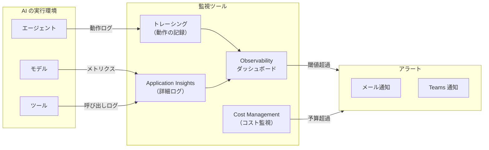

---

## アラート設定表

監視すべき指標と、アラートを出す基準の目安です。

| 監視指標 | 意味 | 閾値の目安 | アラート内容 |
|---------|------|-----------|------------|
| **応答時間** | エージェントが回答を返すまでの時間 | **5 秒以上** | 「レスポンスが遅くなっています」 |
| **エラー率** | リクエストに対するエラーの割合 | **5% 以上** | 「エラーが増加しています」 |
| **トークン使用量** | 1 日あたりの使用トークン数 | 日次予算の **80%** | 「本日のトークン使用量が予算に近づいています」 |
| **429 エラー（レート制限）** | レート制限超過エラーの発生数 | **10 回/時間以上** | 「レート制限に頻繁に抵触しています」 |
| **コンテンツフィルタ発動** | 有害コンテンツがブロックされた回数 | **1 回以上**（要内容確認） | 「コンテンツフィルタが作動しました」 |
| **月額コスト** | 当月の累計コスト | 月間予算の **70%** | 「コストが予算の 70% に達しました」 |

---

## トラブルシュート手順図

問題が発生したときの切り分け手順です。

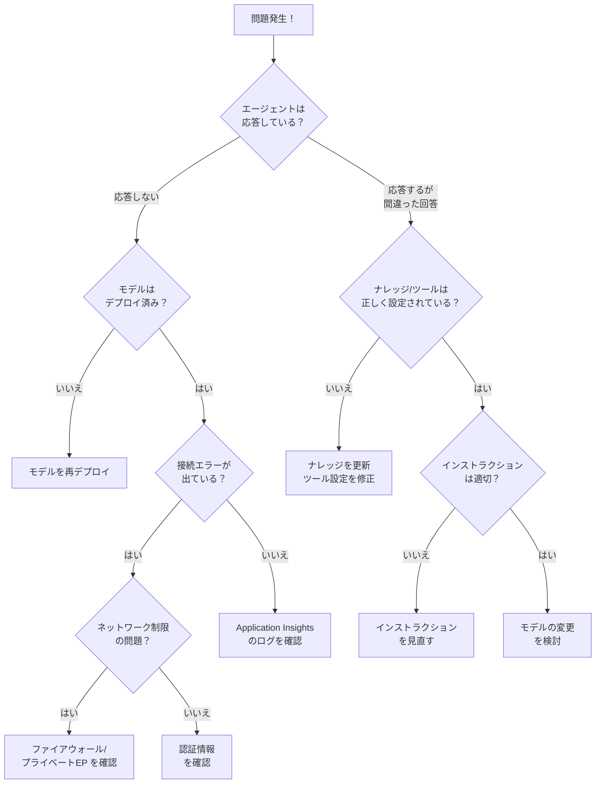

---

## 具体例

### 日常運用のチェックリスト

運用開始後に、定期的に確認すべき項目です。

**毎日確認：**
| 確認項目 | 確認方法 | 対応 |
|---------|---------|------|
| エラー率 | Observability ダッシュボード | 5% を超えていたら原因調査 |
| 応答時間 | Observability ダッシュボード | 5 秒を超えていたらモデル/ネットワークを確認 |
| コンテンツフィルタ発動 | ログを確認 | 不適切な入力パターンがないか確認 |

**毎週確認：**
| 確認項目 | 確認方法 | 対応 |
|---------|---------|------|
| トークン使用量トレンド | Cost Management | 増加傾向なら原因を調査 |
| エージェント評価スコア | 評価機能を実行 | スコアが下がっていたらインストラクション/ナレッジを見直し |
| RBAC の確認 | アクセス制御(IAM) | 不要な権限が残っていないか |

**毎月確認：**
| 確認項目 | 確認方法 | 対応 |
|---------|---------|------|
| 月額コスト | Cost Management | 予算内か確認。超過傾向なら最適化 |
| モデルバージョン | デプロイ設定 | 新バージョンが出ていないか。更新が必要か |
| セキュリティパッチ | Azure のセキュリティ通知 | 必要な更新があれば適用 |

### コスト最適化のコツ

| 最適化方法 | 効果 | 難易度 |
|-----------|------|--------|
| モデルルーターを使う | 簡単な質問を安いモデルに振り分け → **30〜50% 削減** | ★☆☆ |
| TPM を適切に設定する | 過剰な予約を避ける | ★☆☆ |
| サーバーレスデプロイを使う（利用量が少ない場合） | 使った分だけ課金 | ★☆☆ |
| インストラクションで回答の長さを制限 | トークン消費を抑える | ★☆☆ |
| 不要なモデルデプロイを削除 | 不要課金を防ぐ | ★☆☆ |

---

## 注意（落とし穴）

> [!WARNING]
> **監視を設定しないまま本番運用しない**
> 監視がないと、エラーが起きても気づかず、コストが膨らんでも気づかず、問題が大きくなってから発覚します。最低限 **応答時間・エラー率・コスト** の 3 つはアラートを設定してください。

> [!CAUTION]
> **トレーシングのデータ保存量に注意**
> トレーシングは非常に詳細なログを記録するため、長期間すべてのリクエストを記録すると **ストレージコストが増大** します。サンプリング（例：全リクエストの 10% だけ記録）を設定するか、保存期間に上限を設けてください。

> [!IMPORTANT]
> **「エージェントの品質が落ちた」と感じたら、まずナレッジとインストラクションを確認**
> ほとんどの品質低下は、ナレッジデータが古くなっている、またはインストラクションが新しい要件に合っていないことが原因です。モデル自体の問題であることは意外と少ないです。

---

# 第 10 章　まとめ・チェックリスト

## まず覚える 10 個

Microsoft Foundry を使った AI ソリューションの設計・構築で、**最初に頭に入れておくべき 10 項目** です。

| # | 覚えること | 一言解説 |
|---|-----------|---------|
| **1** | Microsoft Foundry は AI の統合プラットフォーム | AI の開発から運用まで、すべてを 1 か所で管理する場所 |
| **2** | Hub ＝ チーム共通設定、Project ＝ 個別の作業場所 | Hub で決めたセキュリティ設定が全 Project に自動適用される |
| **3** | 5 つのサービス柱：モデル／エージェント／ツール／機械学習／Foundry IQ | 全部は使わなくても OK。まずモデルとエージェントから |
| **4** | コントロールプレーンが認証・ポリシー・監視を一元管理 | AI Gateway がリクエストの交通整理をしてくれる |
| **5** | モデルはカタログから選び、用途に合ったデプロイ方式で動かす | 標準 / サーバーレス / マネージドの 3 方式がある |
| **6** | エージェント ＝ モデル ＋ ツール ＋ インストラクション | この 3 つを組み合わせて「仕事をする AI」を作る |
| **7** | MCP はエージェントと外部システムの共通接続規格 | 1,500 以上の既成コネクタですぐに始められる |
| **8** | 認証は Entra ID、秘密情報は Key Vault、権限は RBAC | API キーのコード直書きは絶対 NG |
| **9** | 本番はプライベートネットワーク＋プライベートエンドポイント | 通信がインターネットを通らないので安全 |
| **10** | 監視は Observability ダッシュボード＋Application Insights | 応答時間・エラー率・コストの 3 つは最低限アラートを設定 |

---

## 実務チェックリスト

AI ソリューションの設計から運用まで、各フェーズで確認すべき項目の一覧です。

### 設計フェーズ

| ☐ | 確認項目 | 確認内容 | 関連する章 |
|---|---------|---------|-----------|
| ☐ | 要件の明確化 | AI に何をさせたいか？ ユーザーは誰か？ を明文化した | 第 1 章 |
| ☐ | Hub / Project の設計 | Hub の数、Project の分割方針を決めた | 第 2 章 |
| ☐ | リージョンの選定 | 使いたいモデルが対応するリージョンを確認した | 第 2,3 章 |
| ☐ | モデルの選定 | 用途・品質・コストを考慮してモデルを選んだ | 第 3 章 |
| ☐ | デプロイ方式の選定 | 標準 / サーバーレス / マネージドの方式を決めた | 第 3 章 |
| ☐ | エージェントの設計 | インストラクション、ツール、ナレッジの方針を決めた | 第 4 章 |
| ☐ | 外部連携の設計 | 接続先のシステムと接続方法（MCP / カスタム）を決めた | 第 5 章 |
| ☐ | RBAC の設計 | 誰にどのロールを割り当てるか決めた | 第 6 章 |
| ☐ | ネットワーク設計 | パブリック / プライベートの方針、VNet の IP 範囲を決めた | 第 7 章 |
| ☐ | コスト見積もり | 月間のトークン使用量と料金を見積もった | 第 3,9 章 |

### 構築フェーズ

| ☐ | 確認項目 | 確認内容 | 関連する章 |
|---|---------|---------|-----------|
| ☐ | Azure サブスクリプション | 有効なサブスクリプションがある | 第 8 章 |
| ☐ | リソースプロバイダーの登録 | `Microsoft.CognitiveServices` が登録されている | 第 8 章 |
| ☐ | Hub の作成 | Hub が作成され、ストレージ・Key Vault が接続されている | 第 8 章 |
| ☐ | Project の作成 | Project が Hub の下に作成されている | 第 8 章 |
| ☐ | モデルのデプロイ | モデルがデプロイされ、テストメッセージで動作確認済み | 第 8 章 |
| ☐ | 接続の設定 | 必要な外部サービスとの接続が完了している | 第 8 章 |
| ☐ | エージェントの作成 | エージェントが作成され、テストで期待通りの回答を返す | 第 8 章 |

### セキュリティ確認

| ☐ | 確認項目 | 確認内容 | 関連する章 |
|---|---------|---------|-----------|
| ☐ | MFA（多要素認証） | 全ユーザーで有効化されている | 第 6 章 |
| ☐ | RBAC | 「所有者」ロールが最小限の人数に限定されている | 第 6 章 |
| ☐ | マネージド ID | API キーの直書きがなく、マネージド ID を使用している | 第 6 章 |
| ☐ | Key Vault | 秘密情報が Key Vault に格納されている | 第 6 章 |
| ☐ | ネットワーク（本番） | マネージドネットワーク＋プライベートエンドポイントが設定されている | 第 7 章 |
| ☐ | パブリックアクセス（本番） | 無効化されている、または IP 制限がかかっている | 第 7 章 |
| ☐ | コンテンツフィルタ | AI コンテンツ安全性フィルタが有効になっている | 第 6 章 |
| ☐ | 監査ログ | 診断設定でログの出力先が設定されている | 第 6 章 |

### 運用開始前の確認

| ☐ | 確認項目 | 確認内容 | 関連する章 |
|---|---------|---------|-----------|
| ☐ | 監視アラート | 応答時間・エラー率・コストのアラートが設定されている | 第 9 章 |
| ☐ | エージェント評価 | テスト用の質問セットで品質評価を実施した | 第 9 章 |
| ☐ | モデルバージョン固定 | 本番のモデルバージョンが固定されている（自動更新 OFF） | 第 9 章 |
| ☐ | コスト予算設定 | Azure Cost Management で予算アラートを設定した | 第 9 章 |
| ☐ | 運用手順書 | 日次・週次・月次の確認項目が文書化されている | 第 9 章 |
| ☐ | 障害対応手順 | トラブルシュートの手順が文書化されている | 第 9 章 |
| ☐ | バックアップ計画 | ナレッジデータ・設定のバックアップ方針が決まっている | 第 9 章 |

---

## この資料のまとめ

| 章 | 学んだこと | 設計・構築でのポイント |
|----|-----------|---------------------|
| 1 | 全体像 | 5 つの柱とコントロールプレーンを理解する |
| 2 | Hub / Project | 本社（Hub）と部署（Project）の 2 階層で管理する |
| 3 | モデル | 用途・品質・コストで選ぶ。ルーターでコスト最適化 |
| 4 | エージェント | モデル＋ツール＋指示のセット。まず宣言型から |
| 5 | ツールと接続 | MCP で外部連携。ツールは 5〜10 個に抑える |
| 6 | セキュリティ | Entra ID ＋ RBAC ＋ Key Vault が三本柱 |
| 7 | ネットワーク | 本番はプライベート。開発はパブリック OK |
| 8 | 構築手順 | 小さく始めて段階的に。エラー対処表を手元に |
| 9 | 監視・運用 | 応答時間・エラー率・コストは最低限監視する |
| 10 | まとめ | 10 項目を頭に入れ、チェックリストで確認 |

---

> **おつかれさまでした！**
> この資料で学んだ知識があれば、Microsoft Foundry を使った AI ソリューションの **設計と構築の全体像** を把握できているはずです。
> まずは開発環境で「Hub → Project → モデルデプロイ → エージェント作成」を実際にやってみましょう。**手を動かすことが、一番の学びになります。**

---
