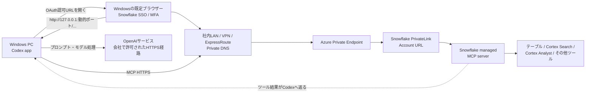
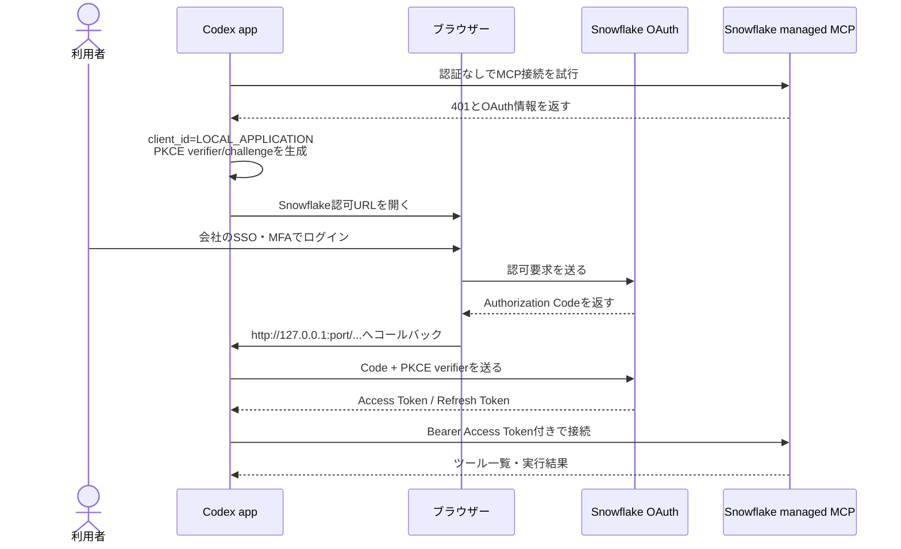

# Windows版Codex appからAzure PrivateLink経由でSnowflake managed MCPサーバーへ接続する手順

- **対象**: Windows PC上のCodex appをMCPクライアントとして設定する担当者
- **前提**: Snowflakeアカウント、Azure PrivateLink、Private DNS、Snowflake managed MCPサーバーは構築済み
- **重点**: クライアントPCの設定、OAuth認証、接続試験、障害切り分け
- **調査日**: 2026年7月23日
- **資料の位置付け**: 公式ドキュメントと公開ソースコードを照合した実装ガイド

> [!IMPORTANT]
> 本資料で最も重要な結論は、**Codex appはリモートMCPとOAuthをサポートしている**一方、Snowflake managed MCPの公式OAuth例は「Client Secretを持つ機密クライアント」であり、現在確認できるCodexのMCP設定はClient Secretを受け取らない、という点です。
>
> そのため、本資料では、Snowflakeのローカル／デスクトップアプリ向け公開OAuthクライアントである **`SNOWFLAKE$LOCAL_APPLICATION`** を使い、Codexへ **`client_id = "LOCAL_APPLICATION"`** を指定する方式を、第一候補のPoC構成として説明します。
>
> ただし、**「Snowflake managed MCP + Codex app + `SNOWFLAKE$LOCAL_APPLICATION`」を一連の手順として明記した両社の公式資料は、調査時点では確認できませんでした**。個々の仕様は整合しますが、組み合わせ全体は本番導入前のPoCで必ず実証してください。

---

## 目次

1. [最初に読む結論](#1-最初に読む結論)
2. [確認できたこと・推論・不明点](#2-確認できたこと推論不明点)
3. [全体構成](#3-全体構成)
4. [OAuthの仕組み](#4-oauthの仕組み)
5. [なぜSnowflake公式の機密クライアント例をそのまま使えないのか](#5-なぜsnowflake公式の機密クライアント例をそのまま使えないのか)
6. [推奨するPoC構成](#6-推奨するpoc構成)
7. [担当者と役割分担](#7-担当者と役割分担)
8. [作業開始前に受け取る情報](#8-作業開始前に受け取る情報)
9. [作業を止めるべき条件](#9-作業を止めるべき条件)
10. [Windowsクライアントの構築手順](#10-windowsクライアントの構築手順)
11. [OAuth認証の実行手順](#11-oauth認証の実行手順)
12. [接続後の確認手順](#12-接続後の確認手順)
13. [固定コールバックポートが必要な場合](#13-固定コールバックポートが必要な場合)
14. [Snowflake管理者に依頼する確認](#14-snowflake管理者に依頼する確認)
15. [PoC合格基準](#15-poc合格基準)
16. [トラブルシューティング](#16-トラブルシューティング)
17. [セキュリティと運用上の注意](#17-セキュリティと運用上の注意)
18. [本調査で不明な点](#18-本調査で不明な点)
19. [ロールバック手順](#19-ロールバック手順)
20. [作業チェックリスト](#20-作業チェックリスト)
21. [参照資料](#21-参照資料)

---

## 1. 最初に読む結論

### 1.1 Codex appはOAuth対応か

**対応しています。** OpenAI公式資料では、ローカルのCodexクライアントが、Streamable HTTP方式のリモートMCPサーバーとOAuth認証を利用できることが説明されています。Codex app、Codex CLI、Codex IDE拡張は、原則として同じ `~/.codex/config.toml` を参照します。

Windows版Codex appも公式提供されています。ただし、会社で使用する場合は、個人判断でインストールせず、社内のソフトウェア配布・OpenAIワークスペース・データ利用ポリシーに従ってください。

### 1.2 Snowflake managed MCPはOAuth対応か

**対応しています。** ただし、次の点に注意が必要です。

- Snowflake managed MCPはOAuth 2.0に対応しています。
- Snowflake managed MCPは、OAuthのDynamic Client Registration（DCR）をサポートしていません。
- Snowflake公式のmanaged MCP手順は、一般にClient IDとClient Secretを持つ **CONFIDENTIALクライアント** を例示しています。
- 現在確認できるCodexのMCP設定は、固定Client IDを指定できますが、MCP OAuth用Client Secretの設定項目は確認できません。

したがって、CodexにClient IDを指定せず自動登録させる方法は、Snowflakeの「DCR非対応」と衝突します。また、Snowflake公式例のClient SecretをCodexへそのまま渡す方法もありません。

### 1.3 本資料の推奨方式

PoCでは次の方式を第一候補とします。

| 項目 | 推奨値 |
|---|---|
| MCPクライアント | Windows版Codex app |
| MCP転送方式 | Streamable HTTP |
| MCP URL | Snowflake管理者から受領したPrivateLink用の完全URL |
| OAuthクライアント種別 | 公開クライアント |
| OAuth Client ID | `LOCAL_APPLICATION` |
| Snowflake OAuth統合 | 組み込み `SNOWFLAKE$LOCAL_APPLICATION` |
| Client Secret | 使用しない・PCへ配布しない |
| OAuthフロー | Authorization Code + PKCE |
| コールバック | `http://127.0.0.1:<動的ポート>/...` |
| トークン保存 | Windowsの安全な資格情報ストアを優先 |
| Snowflakeロール | 対象ユーザーの `DEFAULT_ROLE` |
| Snowflakeウェアハウス | 対象ユーザーの `DEFAULT_WAREHOUSE` |

### 1.4 最終判断

この構成は、公開されている各仕様を照合すると技術的に整合します。ただし、組み合わせ全体の公式認定を確認できないため、次の順序で進めます。

1. 会社の検証用Snowflakeユーザー、検証用ロール、読み取り専用ツールでPoCする。
2. OAuthログイン、ツール一覧、読み取り実行、アプリ再起動、トークン更新まで確認する。
3. Client SecretがPCへ配布・保存されていないことを確認する。
4. 権限境界、監査ログ、データ持ち出し方針を確認する。
5. 全項目に合格した後で、本番利用を承認する。

---

## 2. 確認できたこと・推論・不明点

情報の確度を混同しないため、次のように分類します。

| 分類 | 内容 | 判断 |
|---|---|---|
| 公式確認済み | CodexのローカルクライアントはStreamable HTTPのリモートMCPとOAuthをサポートする | 利用可能 |
| 公式確認済み | Windows版Codex appが提供されている | 利用可能 |
| 公式確認済み | Snowflake managed MCPはOAuthに対応する | 利用可能 |
| 公式確認済み | Snowflake managed MCPはDCRをサポートしない | 固定Client IDが必要 |
| 公式確認済み | `SNOWFLAKE$LOCAL_APPLICATION` はローカル／デスクトップアプリ向け公開クライアントである | 候補に適する |
| 公式確認済み | 同統合はPKCEと127.0.0.1のループバックコールバックを使用し、Client Secretを必要としない | CodexのOAuth実装と方向性が一致 |
| 実装確認済み | 現行Codex公開ソースにはMCPごとの `oauth.client_id` がある | 固定Client IDを指定可能 |
| 実装確認済み | 現行Codex公開ソースはOAuthでPKCEを使い、ローカルコールバックサーバーを起動する | Snowflakeローカル統合と方向性が一致 |
| 実装確認済み | 現行Codex公開ソースのMCP OAuth設定にClient Secret項目は見当たらない | 機密クライアント例を直接利用できない |
| 推論 | PrivateLink到達性のあるWindows上で動くCodex appはPrivateLink URLを直接利用できる | PoCで確認する |
| 推論 | `LOCAL_APPLICATION` のトークンをSnowflake managed MCPが受理する可能性が高い | PoCの最重要確認点 |
| 不明 | 利用予定のCodex appバージョンが、公開ソースと同じ `oauth.client_id` 設定を受理するか | バージョンを固定して試験する |
| 不明 | 会社のSnowflakeアカウントで `SNOWFLAKE$LOCAL_APPLICATION` が有効か | Snowflake管理者が確認する |
| 不明 | 組織固有のネットワークポリシー、プロキシ、EDRがループバック認証を許可するか | Windows実機で確認する |
| 不明 | MCPサーバーが公開する具体的なツール名と必要権限 | MCPサーバー担当者から受領する |

> [!WARNING]
> `mcp_servers.<名前>.oauth.client_id` は、調査時点のCodex公開ソースで確認できる設定ですが、OpenAIの一般向け設定リファレンスには記載が見当たりませんでした。したがって、**利用予定バージョンで設定が読み込まれること自体をPoC項目に含めます**。

---

## 3. 全体構成

### 3.1 構成図



### 3.2 初心者向けの説明

この構成には、実質的に二つの通信経路があります。

**経路A: SnowflakeへのMCP通信**

- Codex appからSnowflake managed MCPへHTTPSで接続します。
- 接続先にはPrivateLink用のSnowflakeホスト名を使います。
- Windows PCが社内LAN、VPN、ExpressRouteなどを通してAzure Private Endpointへ到達できる必要があります。
- Private DNSによって、SnowflakeのPrivateLinkホスト名が会社指定のPrivate Endpointへ解決される必要があります。

**経路B: Codexのモデル通信**

- Codex appは、会社が許可したインターネット／プロキシ経路でOpenAIサービスへ接続します。
- PrivateLinkはSnowflakeへの経路を保護するものであり、OpenAIへのモデル通信までSnowflake PrivateLink内に閉じるものではありません。
- MCPツールの結果はCodexが回答を生成するために利用するため、機密データをどこまでモデルへ渡してよいか、会社のデータガバナンス確認が必要です。

### 3.3 PrivateLinkで重要なこと

Snowflake公式資料では、利用者のPC上で動くクライアントは、ネットワーク到達性とDNSが整っていればPrivateLink URLを直接利用できます。一方、クラウドSaaS側で動くホスト型クライアントは、通常、会社のPrivate DNSやPrivate Endpointへ直接到達できないため、公開URLが必要です。

今回のCodex appはWindows PC上で動くため、前者として扱うのが自然です。ただし、次のすべてをWindows実機で検証します。

- Codex appプロセスがPrivate DNSを利用できること。
- Codex appが会社のVPN／ルーティングを利用できること。
- ブラウザーも同じPrivateLink用Snowflake URLへ到達できること。
- システムプロキシやEDRがPrivateLink通信や127.0.0.1コールバックを妨げないこと。

---

## 4. OAuthの仕組み

### 4.1 OAuthを簡単に説明すると

OAuthは、CodexへSnowflakeのパスワードを保存せず、利用者がブラウザーでSnowflakeへログインして、期限付きのアクセストークンをCodexへ渡す仕組みです。

今回の構成では、次の情報を使います。

| 用語 | 意味 |
|---|---|
| Client ID | どの種類のアプリが認証を要求しているかを表す公開識別子 |
| Client Secret | 機密クライアントだけが保持する秘密情報。今回の推奨構成では使わない |
| Authorization Code | ブラウザー認証後に短時間だけ使える一時コード |
| PKCE | Authorization Codeを横取りされてもトークンへ交換しにくくする保護方式 |
| Access Token | MCPサーバーへアクセスするときに使う期限付きトークン |
| Refresh Token | Access Tokenを更新するためのトークン |
| Redirect URI | 認証後にブラウザーが戻る宛先 |
| Loopback | 同じPCを表す `127.0.0.1` への通信 |

### 4.2 認証シーケンス



### 4.3 `SNOWFLAKE$LOCAL_APPLICATION` を使う理由

Snowflakeの組み込み統合 `SNOWFLAKE$LOCAL_APPLICATION` は、ローカル／デスクトップアプリやSnowflake REST APIへ直接接続するアプリ向けです。公式仕様には次の特徴があります。

- 公開クライアントとして動作する。
- Client Secretを必要としない。
- Client IDには `LOCAL_APPLICATION` を使う。
- PKCEが必要である。
- Redirect URIは `http://127.0.0.1[:port][/path]` の形式を使う。
- トークン要求でクライアント資格情報をPOST本文へ入れる場合、`client_id=LOCAL_APPLICATION` を送る。

Codexの公開ソースで確認できる動作も、固定Client ID、PKCE、ローカルHTTPコールバック、Client Secretなしという構成です。このため、技術的な方向性が一致します。

---

## 5. なぜSnowflake公式の機密クライアント例をそのまま使えないのか

Snowflake managed MCPの公式手順では、カスタムOAuthセキュリティ統合を `OAUTH_CLIENT = CUSTOM`、`OAUTH_CLIENT_TYPE = 'CONFIDENTIAL'` として作成し、Client IDとClient SecretをMCPクライアントへ設定する例が示されています。

一方、現在確認できるCodexのMCP OAuth設定は次の状態です。

- 固定Client IDを指定できる。
- Client Secretの設定項目は確認できない。
- Client IDを指定しない場合はDCRを試す実装である。
- Snowflake managed MCPはDCR非対応である。

したがって、次の二つは避けます。

1. **Client IDを省略する**  
   CodexがDCRを試し、Snowflake側で失敗する可能性が高いためです。

2. **Client SecretをTOML、環境変数、HTTPヘッダーへ独自に埋め込む**  
   Codexの正規のMCP OAuth設定ではなく、秘密情報漏えいや更新不能の原因になるためです。

### 5.1 比較表

| 項目 | Snowflake managed MCP公式例 | Codexで確認できるMCP OAuth | 本資料のPoC候補 |
|---|---|---|---|
| クライアント種別 | CONFIDENTIAL | 公開クライアント相当 | 公開クライアント |
| Client ID | 必須 | 指定可能 | `LOCAL_APPLICATION` |
| Client Secret | 必須 | 設定項目を確認できない | 使用しない |
| DCR | Snowflakeは非対応 | Client ID未指定時に利用し得る | 固定Client IDで回避 |
| PKCE | 構成次第 | 使用する | 使用する |
| Redirect URI | 登録済みURI | ローカルコールバック | 127.0.0.1ループバック |
| 公式な組合せ資料 | Snowflake一般MCPクライアント向け | OpenAI一般MCP OAuth向け | 組合せ資料なし。PoC必須 |

---

## 6. 推奨するPoC構成

### 6.1 PoC構成の要点

- Snowflake managed MCPのPrivateLink URLを、Codex appへStreamable HTTP MCPとして登録します。
- MCPごとのOAuth Client IDに `LOCAL_APPLICATION` を指定します。
- Client Secretは設定しません。
- Codexのトークン保存先には `keyring` を指定し、Windowsの資格情報ストアを優先します。
- 最初は `required = false` とし、MCP障害でCodex app全体が起動不能になることを避けます。
- 最初はツール実行を毎回確認する `default_tools_approval_mode = "prompt"` とします。
- 本番化前に、利用ツールを `enabled_tools` で許可リスト化します。

### 6.2 採用判定の流れ

```text
[1] Windows PCからPrivateLink MCP URLへ到達できるか
    ├─ いいえ → DNS、VPN、ルーティング、プロキシを修正
    └─ はい
         ↓
[2] Codex appが oauth.client_id = LOCAL_APPLICATION を読み込むか
    ├─ いいえ → Codexバージョン／設定仕様をOpenAIへ確認
    └─ はい
         ↓
[3] Snowflake OAuthログインと127.0.0.1コールバックが成功するか
    ├─ いいえ → local application統合、EDR、ブラウザー、ネットワークポリシーを確認
    └─ はい
         ↓
[4] 発行トークンでmanaged MCPのtools/listが成功するか
    ├─ いいえ → 本組合せは現環境では採用不可。代替案へ
    └─ はい
         ↓
[5] 読み取り、権限境界、再起動、トークン更新、監査に合格するか
    ├─ いいえ → 原因を修正して再試験
    └─ はい → セキュリティ承認後に本番候補
```

### 6.3 PoCが失敗した場合の代替案

優先順位は次のとおりです。

1. OpenAIまたはSnowflakeに、この組合せの正式サポート状況と推奨構成を問い合わせる。
2. Client Secretを安全に扱える、会社承認済みの別MCPクライアントを利用する。
3. 社内Azure上に、セキュリティレビュー済みのOAuth／MCPゲートウェイを配置し、秘密情報をデスクトップへ配布しない構成にする。
4. Codex側の正式な機密クライアント対応を待つ。

> [!CAUTION]
> デスクトップPCへClient Secretを配布するだけの「簡易ラッパー」や、TOMLへ秘密情報を直接書く回避策は採用しないでください。デスクトップアプリは秘密を安全に保持できない公開クライアントとして設計するのが原則です。

---

## 7. 担当者と役割分担

| 担当 | 主な作業 |
|---|---|
| あなた（Codexクライアント担当） | Codex app導入、PrivateLink疎通確認、`config.toml` 設定、OAuthログイン、PoC実施、結果記録 |
| Snowflake managed MCP担当 | 完全なMCP URL、サーバー名、ツール名、読み取り専用試験、必要権限、期待結果を提供 |
| Snowflakeセキュリティ管理者 | `SNOWFLAKE$LOCAL_APPLICATION` の有効性、ユーザー、DEFAULT_ROLE、DEFAULT_WAREHOUSE、ネットワークポリシー、権限を確認 |
| Azureネットワーク担当 | Private Endpoint、Private DNS、VPN／ExpressRoute、ルーティング、プロキシ除外を確認 |
| Windows／EDR担当 | Codex app配布、127.0.0.1リスナー、ブラウザー起動、資格情報ストア、ファイアウォールを確認 |
| OpenAIワークスペース管理者 | Codex app利用許可、MCP利用方針、データ管理方針を確認 |
| 情報セキュリティ／法務 | SnowflakeデータをCodexのモデルコンテキストへ渡すことの承認、監査、利用規約を確認 |

---

## 8. 作業開始前に受け取る情報

MCPサーバー担当者と管理者から、次の項目を受け取ってください。

### 8.1 必須情報

| 項目 | 記入例 | 受領先 |
|---|---|---|
| MCP表示名 | `snowflake_managed` | 自分で決定、英数字とアンダースコア推奨 |
| PrivateLink用ホスト名 | `xxxxx.privatelink.snowflakecomputing.com` など | Snowflake／Azure担当 |
| 完全なMCP URL | `https://.../api/v2/databases/.../schemas/.../mcp-servers/...` | MCP担当 |
| Snowflakeデータベース | `<DATABASE>` | MCP担当 |
| Snowflakeスキーマ | `<SCHEMA>` | MCP担当 |
| managed MCPサーバー名 | `<MCP_SERVER>` | MCP担当 |
| Snowflakeユーザー | `<USER_NAME>` | Snowflake管理者 |
| DEFAULT_ROLE | `<MCP_ACCESS_ROLE>` | Snowflake管理者 |
| DEFAULT_WAREHOUSE | `<MCP_WAREHOUSE>` | Snowflake管理者 |
| 読み取り専用の試験ツール | 会社固有 | MCP担当 |
| 正常時の期待結果 | 件数、固定文字列、既知のレコードなど | MCP担当 |
| VPN接続要否 | 必要／不要 | Azureネットワーク担当 |
| 想定Private Endpoint IP | 会社指定値 | Azureネットワーク担当 |
| Codex app配布元 | Microsoft Store、会社ポータル等 | Windows／OpenAI管理者 |
| 利用予定Codex appバージョン | 実機で確認した値 | 自分 |

### 8.2 MCP URLの形式

Snowflake managed MCPのURLは、概ね次の形式です。

```text
https://<PRIVATE_ACCOUNT_HOST>/api/v2/databases/<DATABASE>/schemas/<SCHEMA>/mcp-servers/<MCP_SERVER>
```

各プレースホルダーの意味は次のとおりです。

| プレースホルダー | 入れる値 |
|---|---|
| `<PRIVATE_ACCOUNT_HOST>` | `https://` を除いたPrivateLink用Snowflakeホスト名 |
| `<DATABASE>` | managed MCPを作成したデータベース名 |
| `<SCHEMA>` | managed MCPを作成したスキーマ名 |
| `<MCP_SERVER>` | Snowflake上のmanaged MCPサーバー名 |

> [!IMPORTANT]
> URLは推測して作らず、MCPサーバー担当者からコピー可能な完全URLとして受け取ってください。大文字・小文字、引用符付き識別子、URLエンコードの問題を避けられます。

---

## 9. 作業を止めるべき条件

次のいずれかに該当する場合は、クライアント設定を進めず、担当管理者へ戻してください。

- PrivateLink用の完全なMCP URLが不明である。
- Windows PCが会社のVPN／社内ネットワークへ接続できない。
- `SNOWFLAKE$LOCAL_APPLICATION` の有効性を管理者が確認できない。
- 会社からClient SecretをPCへ直接保存するよう指示されたが、保管方式と正式サポートが未確認である。
- Snowflakeユーザーの `DEFAULT_ROLE` または `DEFAULT_WAREHOUSE` が未設定である。
- 検証用の読み取り専用ツールと期待結果がない。
- MCPツール結果をOpenAIサービスへ渡すことについて、会社の承認がない。
- Codex appの入手元が不明、または会社承認済みではない。

---

## 10. Windowsクライアントの構築手順

## 10.1 手順1: Codex appを導入する

### 操作する画面

- Windowsの会社ポータル、Microsoft Store、またはOpenAI公式の案内画面
- 会社の指定に従ってください

### 作業

1. 会社承認済みの方法でWindows版Codex appをインストールします。
2. Codex appを起動します。
3. 会社で許可されたOpenAI／ChatGPTアカウントでサインインします。
4. Codex appの設定画面または「About／バージョン情報」に相当する画面で、バージョンを記録します。
5. バージョン情報が見つからない場合は、Windowsの「設定」→「アプリ」→「インストールされているアプリ」から確認します。

> [!NOTE]
> Codex appへのサインインと、Snowflake OAuthへのサインインは別の認証です。最初にCodex appへサインインし、その後MCPサーバー用にSnowflakeへサインインします。

## 10.2 手順2: PowerShellを開く

### 操作する画面

1. Windowsのスタートメニューを開きます。
2. `PowerShell` と入力します。
3. 「Windows PowerShell」または「PowerShell」を通常権限で開きます。

通常は管理者として起動する必要はありません。会社の端末管理ルールで管理者権限が必要な場合だけ、Windows管理者へ依頼してください。

## 10.3 手順3: 値をPowerShellへ設定する

以下の `<...>` を管理者から受け取った値へ置き換えます。

```powershell
# PrivateLink用Snowflakeホスト名だけを変数へ設定します。https://やURLのパスは入れません。
$SnowflakeHost = "<PRIVATE_ACCOUNT_HOST>"

# 管理者から受け取った完全なmanaged MCP URLを変数へ設定します。
$McpUrl = "https://<PRIVATE_ACCOUNT_HOST>/api/v2/databases/<DATABASE>/schemas/<SCHEMA>/mcp-servers/<MCP_SERVER>"

# 入力したホスト名を画面へ表示し、入力ミスがないか確認します。
$SnowflakeHost

# 入力したMCP URLを画面へ表示し、入力ミスがないか確認します。
$McpUrl
```

### 正常の目安

- `$SnowflakeHost` に `https://` が付いていない。
- `$McpUrl` は `https://` から始まる。
- URLの末尾が対象managed MCPサーバー名になっている。
- URLにスペースが入っていない。

## 10.4 手順4: Private DNSを確認する

### 操作する画面

- 先ほど開いたPowerShell

```powershell
# PrivateLink用Snowflakeホスト名をDNSで名前解決し、CNAMEやIPアドレスを表示します。
Resolve-DnsName -Name $SnowflakeHost
```

### 正常の目安

- エラーにならず、CNAMEまたはIPアドレスが返る。
- 最終的なIPまたは名前解決経路が、Azureネットワーク担当者から受け取った想定と一致する。
- 公開側へ解決されていないことを、Azureネットワーク担当者が確認する。

### 異常の例

- `DNS name does not exist`
- タイムアウト
- 会社が指定したPrivate Endpointとは異なるIPへ解決される

この場合は、Codex設定ではなく、VPN、DNSサフィックス、Private DNS Zone、DNSフォワーダーをAzureネットワーク担当者に確認してもらいます。

## 10.5 手順5: TCP 443の到達性を確認する

### 操作する画面

- PowerShell

```powershell
# SnowflakeホストのHTTPS用TCPポート443へ接続できるか確認します。
Test-NetConnection -ComputerName $SnowflakeHost -Port 443
```

### 正常の目安

```text
TcpTestSucceeded : True
```

`False` の場合は、次を確認します。

- VPNへ接続しているか。
- AzureルートとNetwork Security Groupが正しいか。
- Windows Defender FirewallやEDRがブロックしていないか。
- プロキシ経由に誤送信されていないか。

## 10.6 手順6: HTTPS応答を確認する

### 操作する画面

- PowerShell

```powershell
# MCP URLへHTTPS GETを送り、本文は保存せず、レスポンスヘッダーだけを画面へ表示します。
curl.exe --silent --show-error --output NUL --dump-header - --connect-timeout 15 "$McpUrl"
```

### 結果の読み方

| 結果 | 判断 |
|---|---|
| `401 Unauthorized` | ネットワークとTLSは概ね到達済み。OAuth未実施なので自然な候補 |
| `403 Forbidden` | サービスへ到達済み。ユーザー／ネットワークポリシー／権限を確認 |
| `405 Method Not Allowed` | URLへ到達済み。GETが許可されず、MCPのPOSTだけを受け付ける可能性 |
| `404 Not Found` | ホストへ到達したが、MCP URL、DB、スキーマ、サーバー名が誤っている可能性 |
| `5xx` | Snowflake／MCP側へ到達したが、サーバー側障害または設定不備の可能性 |
| TLS証明書エラー | SSL検査、社内CA、ホスト名、プロキシを確認 |
| タイムアウト／接続失敗 | DNS、VPN、ルート、ファイアウォール、Private Endpointを確認 |

> [!CAUTION]
> `curl.exe -k` や `--insecure` で証明書検証を無効化しないでください。PoCで証明書エラーを隠すと、本番時に中間者攻撃や誤経路を検出できません。

## 10.7 手順7: プロキシ設定を補助確認する

PrivateLinkホストが誤って公開プロキシへ送られている疑いがある場合に実行します。

### 操作する画面

- PowerShell

```powershell
# WinHTTPのシステムプロキシ設定を表示します。
netsh winhttp show proxy

# 現在のPowerShellプロセスに設定されたHTTP・HTTPS・NO_PROXY関連の環境変数を表示します。
Get-ChildItem Env: | Where-Object { $_.Name -match '^(HTTP|HTTPS|ALL|NO)_PROXY$' }
```

PrivateLinkホストをプロキシ除外へ追加すべきかは、自己判断せずWindows／ネットワーク管理者へ確認してください。Codex appとブラウザーがPowerShellとは異なるプロキシ設定を利用する場合もあります。

## 10.8 手順8: Codex設定ファイルの場所を確認する

Codexの既定設定ファイルは、Windowsでは通常、次の場所です。

```text
%USERPROFILE%\.codex\config.toml
```

ただし、環境変数 `CODEX_HOME` が設定されている場合は、そのフォルダーが優先される可能性があります。次のPowerShellで正しい場所を求めます。

### 操作する画面

- PowerShell

```powershell
# CODEX_HOME環境変数の現在値を表示します。空欄なら通常のユーザープロファイル配下を使います。
$env:CODEX_HOME

# CODEX_HOMEが空なら「ユーザープロファイル\.codex」を使い、設定済みならその値を使います。
$CodexConfigDir = if ([string]::IsNullOrWhiteSpace($env:CODEX_HOME)) { Join-Path $env:USERPROFILE ".codex" } else { $env:CODEX_HOME }

# Codexの設定ファイルconfig.tomlの完全パスを組み立てます。
$CodexConfigPath = Join-Path $CodexConfigDir "config.toml"

# 実際に使用する設定フォルダーを画面へ表示します。
$CodexConfigDir

# 実際に使用する設定ファイルの完全パスを画面へ表示します。
$CodexConfigPath
```

## 10.9 手順9: 設定フォルダーを作り、既存設定をバックアップする

### 操作する画面

- PowerShell

```powershell
# Codex設定フォルダーが存在しない場合は作成し、存在する場合はそのまま利用します。
New-Item -ItemType Directory -Force -Path $CodexConfigDir | Out-Null

# config.tomlが既に存在する場合だけ、日時付きのバックアップファイルを同じフォルダーへ作成します。
if (Test-Path $CodexConfigPath) { Copy-Item -Path $CodexConfigPath -Destination "$CodexConfigPath.bak-$(Get-Date -Format 'yyyyMMdd-HHmmss')" }

# config.tomlが存在しない場合だけ、空の設定ファイルを新規作成します。
if (-not (Test-Path $CodexConfigPath)) { New-Item -ItemType File -Path $CodexConfigPath | Out-Null }

# 設定フォルダー内のconfig.tomlとバックアップファイルを一覧表示します。
Get-ChildItem -Path $CodexConfigDir -Filter "config.toml*" | Select-Object Name, Length, LastWriteTime
```

## 10.10 手順10: `config.toml` をメモ帳で開く

### 操作する画面

- PowerShellからWindowsメモ帳を起動します

```powershell
# 実際に使用するconfig.tomlをWindowsメモ帳で開きます。
notepad.exe $CodexConfigPath
```

### 注意事項

- 既存設定を全削除しないでください。
- 同じ名前の `[mcp_servers.snowflake_managed]` が既にある場合は、重複作成しないでください。
- TOMLでは、同じテーブル名を二重に定義するとエラーになることがあります。
- ファイル名が `config.toml.txt` にならないようにしてください。
- 文字コードはUTF-8を推奨します。

## 10.11 手順11: MCP設定を追記する

次の設定を、既存の `config.toml` の末尾へ追記します。`<...>` を実値へ置き換えます。

> [!IMPORTANT]
> `oauth.client_id` は公開ソースで確認した設定です。利用予定のCodex appがこれを受理しない場合、設定エラー、無視、またはDCRエラーになる可能性があります。その場合はトラブルシューティングの「Dynamic Client Registrationエラー」を参照してください。

```toml
# OAuthトークンをOSの安全な資格情報ストアへ保存する方式を明示します。
mcp_oauth_credentials_store = "keyring"

# 「snowflake_managed」という名前のMCPサーバー設定を開始します。
[mcp_servers.snowflake_managed]

# Snowflake管理者から受領したPrivateLink用managed MCPの完全URLを設定します。
url = "https://<PRIVATE_ACCOUNT_HOST>/api/v2/databases/<DATABASE>/schemas/<SCHEMA>/mcp-servers/<MCP_SERVER>"

# 保存済みOAuth資格情報を使う認証方式を指定します。
auth = "oauth"

# このMCPサーバーをCodex app起動時に有効化します。
enabled = true

# PoC中はMCP接続失敗でCodex全体を停止させない設定にします。
required = false

# MCP初期接続とツール一覧取得を最大30秒待つ設定にします。
startup_timeout_sec = 30

# 一つのMCPツール呼び出しを最大120秒待つ設定にします。
tool_timeout_sec = 120

# ツール実行前に利用者へ確認を求める安全側の設定にします。
default_tools_approval_mode = "prompt"

# SnowflakeへRefresh Tokenの発行を要求するOAuthスコープを指定します。
scopes = ["refresh_token"]

# このMCPサーバー専用のOAuthクライアント設定を開始します。
[mcp_servers.snowflake_managed.oauth]

# Snowflakeの組み込みローカルアプリ用公開Client IDを指定し、DCRを使わないようにします。
client_id = "LOCAL_APPLICATION"
```

### 保存操作

1. メモ帳で「ファイル」→「保存」を選びます。
2. メモ帳を閉じます。
3. Codex appが起動中であれば、まだ再起動せず、まず内容確認を行います。

## 10.12 手順12: 保存した設定内容を確認する

### 操作する画面

- PowerShell

```powershell
# 保存したconfig.tomlの内容をPowerShell画面へ表示します。
Get-Content -Path $CodexConfigPath
```

次を目視確認します。

- URL内の `<...>` がすべて実値へ置き換わっている。
- Client IDが正確に `LOCAL_APPLICATION` になっている。
- Client Secretを書いていない。
- 同じ `[mcp_servers.snowflake_managed]` が重複していない。
- ダブルクォートが全角の `“ ”` ではなく半角の `"` である。

## 10.13 手順13: Codex appを完全再起動する

### 操作する画面

1. Codex appのウィンドウを閉じます。
2. タスクトレイにCodex appが残る場合は、アイコンを右クリックして終了します。
3. WindowsのタスクマネージャーでCodex関連プロセスが残っていないことを確認します。
4. Codex appを再起動します。

> [!NOTE]
> 設定ファイル変更後は、ウィンドウを閉じるだけでなく、アプリプロセスを完全に再起動する方が確実です。

## 10.14 手順14: MCPサーバーが読み込まれたか確認する

### 操作する画面

Codex appで、次のいずれかを確認します。画面名はバージョンにより多少異なる可能性があります。

- 「Settings」→「MCP servers」
- 「Settings」→「MCP」
- 「Settings」→「Tools / MCP」
- チャット入力欄で `/mcp`

期待する状態は次のとおりです。

- `snowflake_managed` が一覧へ表示される。
- URLがPrivateLink用URLになっている。
- 認証前は「Authenticate」「Login required」「Not authenticated」などと表示される。
- 設定構文エラーが表示されない。

### 表示されない場合

1. `CODEX_HOME` と実際に編集したパスを再確認します。
2. TOMLの重複テーブルや引用符を確認します。
3. Codex appを完全再起動します。
4. Codex appのバージョンを記録します。
5. `oauth.client_id` が未対応の可能性を管理者／OpenAIサポートへ確認します。

## 10.15 任意: Codex CLIが利用できる場合の確認

Codex appと同じPCにCodex CLIが会社承認済みでインストールされ、`codex` コマンドがPATHへ登録されている場合だけ実行します。CLIがない場合は、この手順を飛ばしてください。

### 操作する画面

- PowerShell

```powershell
# codexコマンドがインストールされ、現在のPATHから見つかるか確認します。
Get-Command codex -ErrorAction SilentlyContinue

# Codexが読み込んだMCPサーバー一覧をJSON形式で表示します。
codex mcp list --json

# snowflake_managedの設定内容をJSON形式で表示します。
codex mcp get snowflake_managed --json
```

`auth_status`、URL、`enabled` などを確認します。CLIの出力形式はバージョンにより変わる可能性があります。

---

## 11. OAuth認証の実行手順

## 11.1 GUIから認証を開始する

### 操作する画面

- Codex appの「Settings」→「MCP servers」相当の画面

### 作業

1. `snowflake_managed` を選択します。
2. 「Authenticate」「Login」「Sign in」などのボタンを押します。
3. 既定ブラウザーが起動することを確認します。

Codex appのバージョンによっては、サーバー追加時または最初のツール利用時に、自動的にブラウザーが開く場合があります。

## 11.2 ブラウザーで接続先を確認する

ブラウザーのアドレスバーで、次を確認します。

- ホスト名が会社指定のSnowflake PrivateLink用ホスト、または会社が承認したSnowflake認証先である。
- 不審な短縮URLや第三者ドメインではない。
- HTTPS証明書警告が出ていない。

想定外のホストへ移動した場合は、認証情報を入力せず中止してください。

## 11.3 Snowflakeへサインインする

### 操作する画面

- Windowsの既定ブラウザー

### 作業

1. 会社のSnowflake SSO画面でユーザーを確認します。
2. 会社の多要素認証を完了します。
3. OAuth同意画面が表示された場合は、対象が会社のSnowflakeアカウントであることを確認します。
4. 過剰な権限が表示される場合は承認せず、Snowflake管理者へ確認します。
5. 許可された内容であれば承認します。

## 11.4 127.0.0.1コールバックを確認する

認証完了後、ブラウザーは概ね次の形式のURLへ移動します。

```text
http://127.0.0.1:<動的ポート>/callback/<Codexが生成する識別子>?code=...&state=...
```

これは外部サーバーではなく、同じWindows PC上で一時的に待ち受けているCodex appへ認証結果を返す処理です。

正常時は、ブラウザーに次のような完了メッセージが表示されます。

```text
Authentication complete. You may close this window.
```

表示文言はバージョンにより異なる場合があります。完了後はブラウザータブを閉じ、Codex appへ戻ります。

> [!WARNING]
> コールバックURLには一時的なAuthorization Codeやstateが含まれます。URL全体をチャット、チケット、メール、スクリーンショットへ貼り付けないでください。

## 11.5 GUIで認証ボタンがない場合

Codex CLIが会社承認済みで利用できる場合だけ、PowerShellからログインを試せます。

```powershell
# snowflake_managedに対するOAuthログインフローを開始します。
codex mcp login snowflake_managed
```

ブラウザーが開かない場合、PowerShellへ表示された認可URLを、同じWindows PCのブラウザーで開きます。別PCで開くと、127.0.0.1のコールバック先が別PCになり失敗します。

---

## 12. 接続後の確認手順

## 12.1 接続状態を確認する

### 操作する画面

- Codex appのMCPサーバー設定画面
- またはチャット入力欄の `/mcp`

期待する状態は次のとおりです。

- `snowflake_managed` が「Connected」「Authenticated」などの状態になる。
- 認証エラーが消える。
- MCPサーバーが公開するツール一覧を取得できる。

## 12.2 最初の確認プロンプト

### 操作する画面

- Codex appの通常のチャット／タスク入力欄

次の文章を入力します。

```text
snowflake_managed MCPサーバーで利用可能なツール名と説明だけを一覧表示してください。
この段階では、データを読み取るツールも書き込むツールも実行しないでください。
```

確認する内容は次のとおりです。

- MCP担当者から受領したツール名が表示される。
- 想定外の管理・削除・更新ツールが公開されていない。
- ツール説明が会社の想定と一致する。

## 12.3 読み取り専用試験

MCP担当者から受領した、データ変更を行わない試験を実行します。次のテンプレートの `<...>` を置き換えます。

```text
snowflake_managed MCPサーバーの読み取り専用ツール「<READ_ONLY_TOOL>」だけを使って、
「<TEST_QUERY_OR_REQUEST>」を実行してください。
データの追加、更新、削除、DDL、権限変更は実行しないでください。
実行前に、使用するツール名と引数を表示して承認を求めてください。
```

### 合格条件

- 実行前に承認画面が出る。
- 表示されたツール名と引数が想定どおりである。
- 読み取り専用ツールだけが使われる。
- 結果がMCP担当者から受領した期待結果と一致する。
- Snowflakeのクエリ履歴や監査ログに、対象ユーザー、ロール、ウェアハウスが正しく記録される。

## 12.4 権限境界試験

検証環境で、Snowflake管理者が安全と判断した「権限がない対象」への読み取りを試します。

期待する結果は、アクセス拒否です。意図せず取得できた場合は、本番化を中止し、Snowflakeロール、managed MCPのツール定義、基礎オブジェクト権限を見直します。

## 12.5 アプリ再起動試験

1. Codex appを完全終了します。
2. 再起動します。
3. `/mcp` または設定画面で接続状態を確認します。
4. 再度読み取り専用試験を実行します。

期待する結果は、毎回Snowflakeパスワードを再入力せず、保存済みトークンまたはRefresh Tokenで接続できることです。

## 12.6 トークン更新試験

Access Tokenの有効期間を超えるまで待つ、またはSnowflake管理者が許可した検証方法で期限切れ状態を作り、次を確認します。

- CodexがRefresh Tokenを使って自動更新できる。
- 更新後もMCPツールを利用できる。
- 更新に失敗した場合は、再認証を促す明確な状態になる。
- 不要なClient Secretを要求しない。

有効期間の変更やRefresh Token失効はSnowflake全体へ影響し得るため、管理者の管理下で行ってください。

## 12.7 VPN切断時の否定試験

会社のポリシー上、PrivateLinkがVPN／社内ネットワーク内だけで利用できる設計の場合に実施します。

1. Codex appを終了します。
2. VPNを切断します。
3. PowerShellでDNSとTCP 443を再確認します。
4. Codex appを起動し、MCP接続が失敗することを確認します。
5. VPNを再接続して復旧することを確認します。

これにより、誤って公開Snowflake URLへフォールバックしていないことを確認できます。

---

## 13. 固定コールバックポートが必要な場合

### 13.1 原則

Codexは、コールバックポートを指定しなければ、空いているローカルポートを動的に選びます。`SNOWFLAKE$LOCAL_APPLICATION` は127.0.0.1のループバックURIを前提としているため、通常は動的ポートを推奨します。

### 13.2 固定ポートを使うケース

次のような組織要件がある場合だけ固定します。

- EDRで許可するローカルポートを事前登録する必要がある。
- Windows Defender Firewallの例外を固定したい。
- 障害解析でコールバックポートを固定したい。

### 13.3 設定例

`config.toml` のMCPテーブルより前のトップレベルへ、次を追加します。

```toml
# OAuthコールバック用のローカル待受ポートを8765へ固定します。
mcp_oauth_callback_port = 8765

# OAuthコールバックの基準URLをWindows自身の127.0.0.1へ固定します。
mcp_oauth_callback_url = "http://127.0.0.1:8765/callback"
```

Codexの現行公開ソースでは、MCPサーバーURLから生成した識別子を、この基準URLのパス末尾へ追加します。そのため、実際のRedirect URIは概ね次の形になります。

```text
http://127.0.0.1:8765/callback/<サーバー固有の識別子>
```

識別子を手計算して設定しないでください。Codexが生成した実際の認可URL内の `redirect_uri` をPoCログで確認します。ただし、認可コードやstateを含むURL全体は保存しないでください。

### 13.4 ポート使用状況の確認

### 操作する画面

- PowerShell

OAuth開始前に次を実行します。

```powershell
# TCPポート8765を既に使用しているプロセスがあるか確認します。
Get-NetTCPConnection -LocalPort 8765 -ErrorAction SilentlyContinue
```

何も表示されなければ、通常は未使用です。別プロセスが表示された場合は、勝手に停止せず、Windows管理者と別ポートを選びます。

OAuth開始中に次を実行します。

```powershell
# OAuth実行中に127.0.0.1のポート8765で待ち受けているプロセスを確認します。
Get-NetTCPConnection -LocalAddress 127.0.0.1 -LocalPort 8765 -State Listen -ErrorAction SilentlyContinue
```

> [!CAUTION]
> `mcp_oauth_callback_url` にPCのLAN IP、`0.0.0.0`、公開ホスト名を設定しないでください。ローカルデスクトップOAuthでは127.0.0.1のループバックを使い、ネットワークから到達可能なコールバックを公開しないことが安全です。

---

## 14. Snowflake管理者に依頼する確認

この章のSQLは、あなたが実行するのではなく、原則としてSnowflake管理者がSnowsightのSQL Worksheetで実行します。権限が与えられている場合でも、会社の変更管理手順に従ってください。

## 14.1 `SNOWFLAKE$LOCAL_APPLICATION` の存在と設定を確認する

### 操作する画面

- Snowsight
- 「Projects」→「Worksheets」→新規SQL Worksheet

```sql
-- セキュリティ統合を確認できる管理ロールへ切り替えます。
USE ROLE SECURITYADMIN;

-- 組み込みローカルアプリ用OAuth統合が存在するか一覧で確認します。
SHOW SECURITY INTEGRATIONS LIKE 'SNOWFLAKE$LOCAL_APPLICATION';

-- 組み込みローカルアプリ用OAuth統合の詳細設定を表示します。
DESC SECURITY INTEGRATION SNOWFLAKE$LOCAL_APPLICATION;
```

管理者は少なくとも次を確認します。

- 統合が存在する。
- 統合が有効である。
- Refresh Tokenが会社方針どおりに設定されている。
- ネットワークポリシーが対象ユーザーのPC／経路を許可する。
- トークンの単回使用や有効期間が会社方針に合う。

## 14.2 アカウントの無効化パラメーターを確認する

Snowflakeアカウントでは、組み込みローカルアプリ統合を無効化するアカウントパラメーターが設定されている可能性があります。

```sql
-- アカウントパラメーターを確認できるACCOUNTADMINロールへ切り替えます。
USE ROLE ACCOUNTADMIN;

-- ローカルアプリ統合を無効化するパラメーターの現在値を表示します。
SHOW PARAMETERS LIKE 'DISABLE_SNOWFLAKE_LOCAL_APPLICATION_INTEGRATION' IN ACCOUNT;
```

`TRUE` の場合、本資料の方式はそのままでは利用できません。セキュリティ方針を確認し、管理者が採用可否を判断します。

## 14.3 SnowflakeユーザーのDEFAULT_ROLEとDEFAULT_WAREHOUSEを確認する

Snowflake managed MCPのOAuthセッションでは、対象ユーザーの `DEFAULT_ROLE` が使われ、セカンダリロールは使われません。また、`DEFAULT_WAREHOUSE` がない、または利用権限がない場合、セッション初期化が失敗する可能性があります。

```sql
-- ユーザー設定を確認できるUSERADMINロールへ切り替えます。
USE ROLE USERADMIN;

-- 対象Snowflakeユーザーの現在設定を表示します。
DESC USER <USER_NAME>;
```

変更が必要で、変更承認を得ている場合の例です。

```sql
-- 対象ユーザーの既定ロールと既定ウェアハウスを、承認済みの値へ設定します。
ALTER USER <USER_NAME> SET DEFAULT_ROLE = '<MCP_ACCESS_ROLE>' DEFAULT_WAREHOUSE = '<MCP_WAREHOUSE>';
```

> [!WARNING]
> `DEFAULT_ROLE` は通常のSnowflakeログインにも影響します。既存業務へ影響するため、利用者専用ロールを設計し、変更前後の影響を確認してください。

## 14.4 managed MCPサーバーへのUSAGEを付与する

Snowflake managed MCPへ接続しツールを発見するには、対象MCPサーバーに対する `USAGE` が必要です。

```sql
-- 権限付与を行うセキュリティ管理ロールへ切り替えます。
USE ROLE SECURITYADMIN;

-- 対象managed MCPサーバーを利用する権限を専用ロールへ付与します。
GRANT USAGE ON MCP SERVER <DATABASE>.<SCHEMA>.<MCP_SERVER> TO ROLE <MCP_ACCESS_ROLE>;
```

これだけでは、各MCPツールが参照するテーブル、ビュー、Cortex Search Service、Cortex Analyst Semantic Modelなどの権限は付与されません。基礎オブジェクトの権限は、MCPサーバー担当者がツールごとに明示してください。

## 14.5 ロール付与を確認する

```sql
-- 対象ロールへ付与されている権限を一覧表示します。
SHOW GRANTS TO ROLE <MCP_ACCESS_ROLE>;

-- 対象ユーザーへ付与されているロールを一覧表示します。
SHOW GRANTS TO USER <USER_NAME>;
```

管理者は次を確認します。

- 対象ユーザーが `<MCP_ACCESS_ROLE>` を利用できる。
- `<MCP_ACCESS_ROLE>` にMCP SERVERのUSAGEがある。
- `<MCP_ACCESS_ROLE>` にDEFAULT_WAREHOUSEのUSAGEがある。
- 読み取り専用PoCに不要な書き込み権限がない。
- MCPツールが使う基礎オブジェクトへ必要最小限の権限がある。

## 14.6 ネットワークポリシーを確認する

`SNOWFLAKE$LOCAL_APPLICATION` のトークン要求では、Snowflakeのネットワークポリシーが適用されます。公式仕様上、ローカルアプリのトークン要求では、ユーザー、統合、アカウントの順でポリシーが評価されます。

管理者は次を確認します。

- OAuthを実行する利用者の送信元が許可されている。
- VPN接続時のNAT／送信元IPがポリシーに含まれる。
- PrivateLink接続とOAuthエンドポイントの両方が許可される。
- 利用者個別ポリシーが、統合またはアカウントポリシーを意図せず上書きしていない。

具体的なネットワークポリシーSQLは会社固有のため、本資料では一律の変更コマンドを提示しません。

## 14.7 MCP担当者から受け取る最終情報

Snowflake管理者／MCP担当者は、クライアント担当へ次を返します。

- 正確なPrivateLink用MCP URL
- 対象Snowflakeユーザー
- 実際に使われるDEFAULT_ROLE
- 実際に使われるDEFAULT_WAREHOUSE
- USAGE付与済みの確認
- ツールごとの基礎オブジェクト権限
- 読み取り専用の試験ツール名
- 正常時の期待結果
- 監査ログの確認担当者
- `SNOWFLAKE$LOCAL_APPLICATION` が有効であること
- 本方式をPoCしてよいという承認

---

## 15. PoC合格基準

次の項目をすべて記録し、合格／不合格を付けます。

| 番号 | 試験 | 合格条件 |
|---:|---|---|
| 1 | Private DNS | ホスト名が会社指定のPrivate Endpoint経路へ解決される |
| 2 | TCP 443 | `TcpTestSucceeded : True` |
| 3 | HTTPS | 401、403、405等のHTTP応答が得られ、TLS警告がない |
| 4 | Codex設定読込 | `snowflake_managed` がアプリへ表示され、構文エラーがない |
| 5 | 固定Client ID | DCRを試さず、`LOCAL_APPLICATION` で認可が開始される |
| 6 | PrivateLink OAuth | ブラウザーが承認済みSnowflake認証先へ到達する |
| 7 | SSO／MFA | 対象ユーザーで認証が完了する |
| 8 | ループバック | 127.0.0.1のコールバックが完了する |
| 9 | トークン保存 | Client Secretを保存せず、トークンが安全な資格情報ストアに保存される |
| 10 | MCP接続 | 接続状態がConnected／Authenticatedになる |
| 11 | tools/list | 期待するツール一覧を取得できる |
| 12 | 読み取り試験 | 期待結果と一致する |
| 13 | 承認プロンプト | ツール実行前に承認確認が出る |
| 14 | 権限境界 | 権限外データへのアクセスが拒否される |
| 15 | ロール | Snowflake監査でDEFAULT_ROLEが使われている |
| 16 | ウェアハウス | DEFAULT_WAREHOUSEで正常実行される |
| 17 | 再起動 | Codex app再起動後も再接続できる |
| 18 | Refresh Token | Access Token更新後も再ログインなしで利用できる |
| 19 | VPN否定試験 | VPN外から接続できず、公開URLへフォールバックしない |
| 20 | 監査 | 利用者、ロール、ウェアハウス、ツール実行を追跡できる |
| 21 | 秘密情報 | PC上のTOML、ログ、チケットにClient Secretやトークンがない |
| 22 | データガバナンス | MCP結果をCodexへ渡すことが会社で承認済み |

### 15.1 特に重要なゲート

次の四項目の一つでも不合格なら、本番化しません。

1. `LOCAL_APPLICATION` でOAuthが完了すること。
2. そのトークンでSnowflake managed MCPが接続を受理すること。
3. Refresh Tokenまたは再認証が運用可能であること。
4. 権限境界とデータガバナンスが承認されること。

---

## 16. トラブルシューティング

障害は、上から順番に切り分けます。最初からSnowflake権限だけを疑わず、ネットワーク、設定、OAuth、セッション、ツールの層を分けて確認します。

## 16.1 Codex appにMCPサーバーが表示されない

### 主な原因

- 編集した `config.toml` の場所が違う。
- `CODEX_HOME` が設定されている。
- TOML構文エラーがある。
- 同じMCPテーブル名を二重定義している。
- Codex appを完全再起動していない。
- 利用バージョンが設定キーに未対応である。

### 確認コマンド

```powershell
# Codexが利用する可能性のあるCODEX_HOMEを表示します。
$env:CODEX_HOME

# 実際に編集したconfig.tomlの完全パスを表示します。
$CodexConfigPath

# config.tomlが存在するか確認します。
Test-Path $CodexConfigPath

# config.tomlの内容を表示します。
Get-Content -Path $CodexConfigPath
```

### 対応

- バックアップと比較して、追記部分だけを一度削除し、Codexが起動するか確認します。
- 最小設定で再度試します。
- 利用バージョンとエラーメッセージを記録し、OpenAI管理者／サポートへ確認します。

## 16.2 DNS解決に失敗する

### 症状

- `Resolve-DnsName` が失敗する。
- ブラウザーがSnowflakeホストを開けない。
- Codexが接続タイムアウトになる。

### 対応

- VPN接続を確認します。
- Azure Private DNS ZoneとDNSフォワーダーを確認します。
- PCのDNSキャッシュを消去する場合は、会社の手順に従います。

管理者から実行許可を得た場合のコマンドです。

```powershell
# WindowsのDNSキャッシュを消去し、古い名前解決結果を破棄します。
ipconfig /flushdns

# キャッシュ消去後にPrivateLinkホストを再度名前解決します。
Resolve-DnsName -Name $SnowflakeHost
```

## 16.3 TCP 443に接続できない

### 主な原因

- VPN未接続
- Azureルート不備
- Network Security Group
- Windows Firewall／EDR
- Private Endpointの状態異常
- プロキシ誤経路

### 対応

PowerShellの結果と時刻をAzureネットワーク担当者へ渡します。証明書検証を無効化して回避しないでください。

## 16.4 `Dynamic client registration not supported` が出る

### 意味

Codexが固定Client IDを使わず、DCRで新しいOAuthクライアントを登録しようとしています。Snowflake managed MCPはDCR非対応です。

### 主な原因

- `[mcp_servers.snowflake_managed.oauth]` が読み込まれていない。
- `client_id` の綴りが違う。
- Codex appのバージョンがこの設定に未対応である。
- 別の `config.toml` を編集している。

### 対応

- Client IDが `LOCAL_APPLICATION` であることを確認します。
- `CODEX_HOME` を再確認します。
- Codex appのバージョンを記録します。
- 現行バージョンで固定OAuth Client IDを設定する正式な方法をOpenAIへ問い合わせます。

このエラーをClient Secretの直書きで回避しないでください。

## 16.5 `invalid_client` が出る

### 主な原因

- `SNOWFLAKE$LOCAL_APPLICATION` が無効である。
- アカウント無効化パラメーターがTRUEである。
- Client IDの値が誤っている。
- CodexがSnowflakeの期待と異なるクライアント認証方式を送っている。
- managed MCPが、当該アカウントではlocal applicationトークンを受理しない。

### 対応

- Snowflake管理者が統合とアカウントパラメーターを確認します。
- 実際の認可URLの `client_id` が `LOCAL_APPLICATION` であることを確認します。
- トークン、認可コード、stateを除いたサニタイズ済みログで、Snowflake／OpenAIへ問い合わせます。
- PoCの組合せ非対応と判明した場合は、代替案へ移行します。

## 16.6 `invalid_scope` が出る

### 主な原因

- `refresh_token` スコープが当該統合で許可されていない。
- 管理者が別のスコープ設計をしている。
- Codexがメタデータから取得したスコープと手動設定が衝突している。

### 対応

自己判断でロールスコープを追加せず、Snowflake管理者へ必要スコープを確認します。切り分けのために、承認を得て `scopes = ["refresh_token"]` の行を一時的に削除して認証できるか試すことはできますが、その場合はRefresh Tokenが発行されるかを別途確認します。

managed MCPのOAuthセッションはDEFAULT_ROLEを使うため、`session:role-any` などの強いスコープを安易に追加しないでください。

## 16.7 Redirect URIエラーが出る

### 症状

- `redirect_uri_mismatch`
- `invalid_redirect_uri`
- ブラウザーが認証後にエラーになる

### 確認

- Redirect URIが `http://127.0.0.1:` で始まっているか。
- `localhost`、LAN IP、PC名へ書き換えられていないか。
- 固定コールバック設定を入れた場合、Codexがそのポートで待受できているか。
- カスタムCONFIDENTIAL統合のClient IDを誤って使っていないか。

### 対応

`SNOWFLAKE$LOCAL_APPLICATION` と `LOCAL_APPLICATION` の組を使い、ループバックURIに戻します。カスタム統合のRedirect URI登録を無理に合わせるのではなく、まず推奨PoC構成へ戻してください。

## 16.8 OAuthコールバックがタイムアウトする

### 主な原因

- ブラウザー認証に時間がかかりすぎた。
- Codex appを認証途中で閉じた。
- EDR／Firewallが127.0.0.1の待受を遮断した。
- 別PCのブラウザーで認可URLを開いた。
- 固定ポートが他プロセスに使用されている。

### 対応

- Codex appとブラウザーを同じWindows PCで使います。
- OAuthをやり直し、速やかにSSO／MFAを完了します。
- 動的ポートへ戻して試します。
- Windows／EDR担当者へ、Codexが127.0.0.1で一時的に待受することを説明します。

## 16.9 OAuthは成功したがMCPが401になる

### 主な原因

- トークンのresource／audienceがmanaged MCPと一致しない。
- トークンが保存されていない。
- Access Tokenが期限切れでRefreshに失敗した。
- Codex appとCLIで別の資格情報ストアを参照している。
- 当該組合せをmanaged MCPが受理しない。

### 対応

- 一度ログアウトして再認証します。
- `oauth_resource` を自己判断で追加しないでください。CodexのOAuth実装はMCP URLをresourceとして扱うため、重複・不一致を起こす可能性があります。
- サニタイズ済みのHTTPステータス、`WWW-Authenticate` ヘッダー、時刻、サーバーURLを管理者へ渡します。
- トークン本文は共有しません。

Codex CLIが利用できる場合のログアウト／再ログインです。

```powershell
# snowflake_managed用に保存されたOAuth資格情報を削除します。
codex mcp logout snowflake_managed

# snowflake_managedのOAuthログインを最初からやり直します。
codex mcp login snowflake_managed
```

## 16.10 MCPが403になる

### 主な原因

- MCP SERVERへのUSAGE不足
- DEFAULT_ROLEが想定外
- ユーザーにロールが付与されていない
- ネットワークポリシー拒否
- 基礎オブジェクト権限不足

### 対応

Snowflake管理者に、対象ユーザー、DEFAULT_ROLE、USAGE、ツールの基礎権限を確認してもらいます。OAuthの同意を繰り返すだけでは解決しません。

## 16.11 セッション初期化に失敗する

### 代表的な原因

- `DEFAULT_WAREHOUSE` が未設定
- DEFAULT_WAREHOUSEが停止／存在しない
- DEFAULT_ROLEにウェアハウスUSAGEがない
- DEFAULT_ROLEがMCP SERVERを利用できない

### 対応

Snowflake管理者が `DESC USER` とロール権限を確認します。

## 16.12 ツール一覧が空、または一部しか見えない

### 主な原因

- managed MCPサーバー定義にツールが登録されていない。
- 対象ロールにツールの基礎オブジェクト権限がない。
- ツール定義の名前や環境が違う。
- 本番と検証のMCP URLを取り違えている。

### 対応

MCP担当者に、MCPサーバー定義、ツール一覧、対象環境、必要権限を確認してもらいます。

## 16.13 ツール実行が長時間終わらない

### 主な原因

- Snowflakeウェアハウスの起動待ち
- クエリが重い
- Cortexサービスの遅延
- PrivateLink／プロキシのアイドルタイムアウト
- `tool_timeout_sec` が短い

### 対応

- Snowflake Query Historyで実行状況を確認します。
- 最初は軽量な読み取り専用試験を使います。
- タイムアウトを延長する場合は、原因を確認した後で変更します。

変更例です。

```toml
# MCPツール呼び出しの待ち時間を300秒へ延長します。
tool_timeout_sec = 300
```

## 16.14 アプリ再起動後に再認証を毎回求められる

### 主な原因

- `mcp_oauth_credentials_store = "keyring"` が利用環境で機能していない。
- Windows資格情報ストアへのアクセスがEDRで拒否されている。
- Refresh Tokenが発行されていない。
- Refresh Tokenが単回使用設定とクライアント挙動で失効している。
- Codex appの当該バージョンに不具合がある。

### 対応

- Windows／EDR担当者に資格情報ストアへのアクセスを確認してもらいます。
- Snowflake管理者にRefresh Token設定と監査ログを確認してもらいます。
- 一時切り分けとして、会社承認を得たうえで `mcp_oauth_credentials_store = "auto"` を試せます。
- トークンを平文ファイルへ保存する方式は、本番で採用しません。

切り分け用の設定例です。

```toml
# 利用可能な安全な保存方式をCodexへ自動選択させます。
mcp_oauth_credentials_store = "auto"
```

## 16.15 ブラウザーは接続できるがCodex appだけ接続できない

### 主な原因

- Codex appがシステムプロキシと異なる設定を使う。
- Codex appプロセスがVPNスプリットトンネル対象外である。
- アプリ単位のEDRルールがある。
- Codex appが別ユーザーコンテキストで動いている。

### 対応

Windows／ネットワーク担当者に、Codex appプロセスのDNS、プロキシ、ルーティング、TLSログを確認してもらいます。ブラウザーだけの成功をもってPrivateLink接続成功とは判断しません。

## 16.16 Hosted ChatGPTのコネクターと混同している

Web版ChatGPTやクラウド側で動くホスト型コネクターは、ローカルWindowsの `config.toml` やPrivate DNSを利用しません。SnowflakeのChatGPTコネクター例では、公開到達可能なMCP URLとClient ID／Client Secretを使う構成が示されています。

今回の対象は、**Windows PC上で動くCodex app** です。Web版ChatGPTのコネクター設定画面へ同じPrivateLink URLを登録しても、クラウド側から到達できない可能性があります。

---

## 17. セキュリティと運用上の注意

## 17.1 Client SecretをPCへ置かない

- `SNOWFLAKE$LOCAL_APPLICATION` は公開クライアントとして使います。
- `config.toml` にClient Secretを書きません。
- 環境変数へClient Secretを入れません。
- 独自HTTPヘッダーでClient Secretを送らせません。
- チケット、メール、チャット、スクリーンショットへSecretやTokenを貼りません。

## 17.2 トークンを安全に保存する

- `mcp_oauth_credentials_store = "keyring"` を第一候補にします。
- Windows資格情報ストアを会社のEDR／バックアップ方針に合わせます。
- 端末廃棄、利用者異動、権限剥奪時に、CodexのMCPログアウトとSnowflake側のトークン失効を行います。
- トークンを平文ファイルへエクスポートしません。

## 17.3 最小権限を使う

- 専用Snowflakeロールを使います。
- managed MCP SERVERのUSAGEだけでなく、基礎オブジェクト権限も最小化します。
- PoCは読み取り専用から始めます。
- 本番では利用ツールを許可リスト化します。

ツール名が確定した後の例です。

```toml
# 本番でCodexへ公開するツールを、MCP担当者が承認した名前だけに制限します。
enabled_tools = ["<READ_ONLY_TOOL_1>", "<READ_ONLY_TOOL_2>"]
```

この行は `[mcp_servers.snowflake_managed]` テーブル内へ置きます。実際のツール名はMCP担当者から受領してください。

## 17.4 ツール実行の承認を維持する

PoCと初期本番では、次を維持します。

```toml
# MCPツールを自動実行せず、利用者の承認を求めます。
default_tools_approval_mode = "prompt"
```

特に、SQL実行、データ変更、ファイル出力、外部通知に関係するツールを自動承認しないでください。

## 17.5 MCPツールからのプロンプトインジェクションに注意する

MCPツールの説明、取得データ、ドキュメント本文に、モデルへ不正な指示を与える文字列が含まれる可能性があります。

- 信頼できるMCPサーバーだけを登録します。
- ツール許可リストを使います。
- 実行前のツール名と引数を確認します。
- データ中の指示文を、システム管理者の指示とみなさない運用ルールを定めます。
- 機密情報を別ツールや外部送信先へ渡す連鎖を許可しません。

## 17.6 PrivateLinkの範囲を誤解しない

PrivateLinkで保護されるのは、主としてWindows PCからSnowflakeまでの通信経路です。Codexが回答を生成するため、プロンプトとMCPツール結果はCodexのモデル処理で利用されます。

したがって、次を会社として確認します。

- どのSnowflakeデータをCodexへ渡してよいか。
- 個人情報、機密情報、輸出管理データを含めてよいか。
- OpenAIワークスペースのデータ制御、ログ、保持方針。
- 利用者が結果をローカルファイルやGitリポジトリへ書き出す権限。
- 監査証跡とインシデント対応手順。

## 17.7 バージョンを固定・記録する

今回の構成は、Codexの実装詳細に依存する部分があります。本番では次を記録します。

- Codex appバージョン
- `config.toml` の承認済みハッシュまたは版番号
- Snowflakeの設定変更日
- `SNOWFLAKE$LOCAL_APPLICATION` の主要設定
- MCPサーバー定義の版
- PoC実施日と試験結果

Codex app更新後は、少なくともOAuthログイン、再起動、Refresh Token、読み取り試験を再実施します。

## 17.8 ログをサニタイズする

問い合わせ時に共有してよい情報の例です。

- 発生日時とタイムゾーン
- Codex appバージョン
- MCPサーバー表示名
- ホスト名とURLパス。ただし会社方針でマスクする
- HTTPステータス
- エラー種別
- Snowflake Query ID
- OAuthの `error` と `error_description`

共有してはいけない情報です。

- Access Token
- Refresh Token
- Authorization Code
- Client Secret
- Cookie
- `state` の完全値
- コールバックURLのクエリ文字列全体
- Snowflakeパスワード

---

## 18. 本調査で不明な点

精度を優先し、未確認事項を明示します。

### 18.1 組合せ全体の公式サポート

Snowflake managed MCP、Codex app、`SNOWFLAKE$LOCAL_APPLICATION` の各機能は確認できました。しかし、三者を組み合わせた公式のエンドツーエンド手順や互換性表は確認できませんでした。

**対処**: PoCを必須とし、必要に応じてOpenAIとSnowflakeへサポート問い合わせを行います。

### 18.2 `oauth.client_id` の一般向け正式文書

Codexの公開ソースとCLI実装では、MCPごとの固定OAuth Client IDを確認できました。一方、調査時点の一般向けCodex設定リファレンスでは同じ項目の記載を確認できませんでした。

**対処**: 利用予定バージョンで読み込み試験を行い、バージョンを固定します。未対応なら非公開の回避策を使わず、OpenAIへ正式設定方法を確認します。

### 18.3 managed MCPがlocal applicationトークンを受理するか

SnowflakeのOAuthトークンはSnowflakeアカウント用に発行され、local applicationはSnowflake REST利用向けです。ただし、managed MCP公式例はCONFIDENTIAL統合を使っています。

**対処**: OAuth成功だけでなく、発行トークンによるmanaged MCPの `tools/list` と実ツール呼び出しをPoCゲートにします。

### 18.4 会社固有のPrivateLink URLとDNS

実際のホスト名、CNAME、Private Endpoint IP、VPN方式、プロキシ除外は会社環境固有です。

**対処**: Azure／Snowflake管理者が完全URLと想定名前解決結果を提供します。

### 18.5 MCPツール名と必要権限

managed MCPサーバーの定義は別担当者が管理しているため、本資料では実ツール名と基礎権限を確定できません。

**対処**: MCP担当者がツール一覧、用途、書き込み有無、必要Snowflake権限、試験データを提供します。

### 18.6 Codex appの画面名

Codex appは更新されるため、「Settings」「MCP servers」「Authenticate」などの表示名が将来変わる可能性があります。

**対処**: 画面名だけでなく、`config.toml`、サーバー名、URL、認証状態という目的で確認します。

---

## 19. ロールバック手順

設定に問題がある場合、次の順序で元へ戻します。

## 19.1 Codex appを終了する

1. Codex appを閉じます。
2. タスクトレイから完全終了します。
3. タスクマネージャーでCodex関連プロセスが残っていないことを確認します。

## 19.2 OAuth資格情報を削除する

Codex CLIが利用できる場合は、PowerShellで実行します。

```powershell
# snowflake_managed用に保存されたOAuth資格情報を削除します。
codex mcp logout snowflake_managed
```

CLIがない場合は、Codex appのMCP設定画面にある「Logout」「Disconnect」「Remove credentials」相当の操作を使います。Windows資格情報マネージャーから手動削除する場合は、会社のWindows管理手順に従ってください。

## 19.3 MCP設定をバックアップへ戻す

バックアップファイル名を確認します。

```powershell
# config.tomlと日時付きバックアップを新しい順に一覧表示します。
Get-ChildItem -Path $CodexConfigDir -Filter "config.toml*" | Sort-Object LastWriteTime -Descending | Select-Object Name, Length, LastWriteTime
```

戻すバックアップを `<BACKUP_FILE_NAME>` へ入れます。

```powershell
# 現在の問題があるconfig.tomlをロールバック前の証跡として別名保存します。
Copy-Item -Path $CodexConfigPath -Destination "$CodexConfigPath.failed-$(Get-Date -Format 'yyyyMMdd-HHmmss')"

# 指定したバックアップ内容で現在のconfig.tomlを上書きします。
Copy-Item -Path (Join-Path $CodexConfigDir "<BACKUP_FILE_NAME>") -Destination $CodexConfigPath -Force

# 復元したconfig.tomlの内容を表示します。
Get-Content -Path $CodexConfigPath
```

## 19.4 Codex appを再起動する

Codex appを起動し、既存機能が正常に戻ったことを確認します。

## 19.5 Snowflake側トークンを失効する

端末紛失、利用者異動、漏えい疑いがある場合は、ローカルログアウトだけで終わらせず、Snowflake管理者へ対象OAuthトークン／セッションの失効を依頼します。具体的な失効方法は会社のSnowflake運用手順に従います。

---

## 20. 作業チェックリスト

### 20.1 事前準備

- [ ] 会社承認済みのWindows版Codex appを入手した
- [ ] Codex appバージョンを記録した
- [ ] OpenAIワークスペースの利用許可を確認した
- [ ] PrivateLink用の完全MCP URLを受領した
- [ ] 想定Private Endpoint／DNS情報を受領した
- [ ] Snowflakeユーザーを確認した
- [ ] DEFAULT_ROLEを確認した
- [ ] DEFAULT_WAREHOUSEを確認した
- [ ] 読み取り専用試験ツールと期待結果を受領した
- [ ] MCP結果をCodexへ渡すデータガバナンス承認を得た

### 20.2 Snowflake管理確認

- [ ] `SNOWFLAKE$LOCAL_APPLICATION` が存在する
- [ ] 同統合が有効である
- [ ] アカウント無効化パラメーターがPoCを妨げない
- [ ] 対象ユーザーに専用ロールが付与されている
- [ ] 専用ロールにMCP SERVERのUSAGEがある
- [ ] 専用ロールにウェアハウスUSAGEがある
- [ ] 基礎オブジェクト権限が最小化されている
- [ ] ネットワークポリシーが対象経路を許可する

### 20.3 Windowsネットワーク

- [ ] VPN／社内ネットワークへ接続した
- [ ] `Resolve-DnsName` が成功した
- [ ] 名前解決結果がAzure担当者の想定と一致した
- [ ] `Test-NetConnection` の443が成功した
- [ ] `curl.exe` でHTTP応答を取得した
- [ ] TLS証明書警告がない
- [ ] PrivateLinkホストが誤って公開プロキシへ送られていない

### 20.4 Codex設定

- [ ] 正しい `CODEX_HOME` を確認した
- [ ] `config.toml` をバックアップした
- [ ] PrivateLink MCP URLを設定した
- [ ] `auth = "oauth"` を設定した
- [ ] `client_id = "LOCAL_APPLICATION"` を設定した
- [ ] Client Secretを設定していない
- [ ] トークン保存を `keyring` にした
- [ ] ツール承認を `prompt` にした
- [ ] Codex appを完全再起動した
- [ ] MCPサーバーが一覧へ表示された

### 20.5 OAuthとMCP試験

- [ ] ブラウザーが承認済みSnowflake認証先を開いた
- [ ] SSO／MFAが成功した
- [ ] 127.0.0.1コールバックが成功した
- [ ] MCPがConnected／Authenticatedになった
- [ ] 期待するツール一覧を取得した
- [ ] 読み取り専用試験が成功した
- [ ] ツール実行前に承認画面が出た
- [ ] 権限外アクセスが拒否された
- [ ] Snowflake監査ログを確認した
- [ ] Codex app再起動後も接続できた
- [ ] Access Token更新後も利用できた
- [ ] VPN切断時に接続できなかった
- [ ] Client SecretやTokenがログへ残っていない

### 20.6 本番化判定

- [ ] 組合せ全体のPoC結果を文書化した
- [ ] OpenAI／Snowflakeサポート上の懸念を解消した
- [ ] 情報セキュリティ承認を得た
- [ ] 本番用ツール許可リストを設定した
- [ ] 本番用Snowflakeロールを最小権限化した
- [ ] バージョン更新時の再試験手順を定めた
- [ ] 退職・異動・端末紛失時のトークン失効手順を定めた

---

## 21. 参照資料

以下は、調査で重視した一次資料です。Webページは更新されるため、実装時にも最新版を確認してください。ソースコードのリンクは、調査時に確認したコミットへ固定しています。

### 21.1 OpenAI公式

1. [Introducing the Codex app](https://openai.com/index/introducing-the-codex-app/)  
   Codex appの概要とWindows対応の確認に使用。

2. [Model Context Protocol - OpenAI / ChatGPT Learn](https://learn.chatgpt.com/docs/extend/mcp?surface=cli)  
   ローカルCodexクライアントのMCP、Streamable HTTP、OAuth、設定共有、GUIでの追加・認証方法の確認に使用。

3. [Codex config reference](https://learn.chatgpt.com/docs/config-file/config-reference)  
   `mcp_servers`、URL、OAuth認証、スコープ、タイムアウト、ツール承認、OAuthコールバック、資格情報保存方式の確認に使用。

4. [OpenAI Codex source: MCP configuration types, pinned commit](https://github.com/openai/codex/blob/4462b9deef211723b781b426f5e5d36a5777115f/codex-rs/config/src/mcp_types.rs)  
   MCPごとの `oauth.client_id` と、Client Secret設定がないことの実装確認に使用。

5. [OpenAI Codex source: OAuth login flow, pinned commit](https://github.com/openai/codex/blob/4462b9deef211723b781b426f5e5d36a5777115f/codex-rs/rmcp-client/src/perform_oauth_login.rs)  
   固定Client ID、PKCE、127.0.0.1コールバック、動的ポート、サーバー固有パス、トークン保存の実装確認に使用。

### 21.2 OAuthクライアント実装の一次資料

6. [oauth2-rs source: token endpoint request, pinned commit](https://github.com/ramosbugs/oauth2-rs/blob/72ce74401c26eb4dc85dcbfde587bbcfc149e3ae/oauth2/src/endpoint.rs)  
   Client Secretがない場合、Client IDがトークン要求のPOST本文へ入る実装の確認に使用。

### 21.3 Snowflake公式

7. [Set up a Snowflake-managed MCP server](https://docs.snowflake.com/en/user-guide/snowflake-cortex/cortex-agents-mcp)  
   managed MCP URL、OAuth対応、DCR非対応、公式CONFIDENTIAL OAuth例、USAGE権限、PrivateLinkクライアントの考え方の確認に使用。

8. [Snowflake OAuth for local applications](https://docs.snowflake.com/en/user-guide/oauth-local-applications)  
   `SNOWFLAKE$LOCAL_APPLICATION`、`LOCAL_APPLICATION`、公開クライアント、PKCE、127.0.0.1 Redirect URI、Client Secret不要、ネットワークポリシーの確認に使用。

9. [Snowflake OAuth overview](https://docs.snowflake.com/en/user-guide/oauth-snowflake-overview)  
   Snowflake OAuth全体、ローカルアプリ統合、OAuthセッションの考え方の確認に使用。

10. [Configure Snowflake OAuth for custom clients](https://docs.snowflake.com/en/user-guide/oauth-custom)  
    カスタムOAuth統合、公開／機密クライアント、Client Secretを使う構成との比較に使用。

11. [Behavior change: Snowflake OAuth local applications](https://docs.snowflake.com/en/release-notes/bcr-bundles/un-bundled/bcr-2056)  
    組み込みローカルアプリ統合とアカウント無効化パラメーターの確認に使用。

12. [Azure Private Link and Snowflake](https://docs.snowflake.com/en/user-guide/privatelink-azure)  
    Azure PrivateLinkの前提とSnowflake接続の確認に使用。

### 21.4 Microsoft公式

13. [Azure Private Endpoint DNS integration](https://learn.microsoft.com/azure/private-link/private-endpoint-dns-integration)  
    Private Endpoint利用時のDNS設計、オンプレミス／VPNからの名前解決確認に使用。

---

## 付録A: 最小構成だけを再掲

この付録はコピー用です。各行の意味は本文を参照してください。

```toml
# OAuthトークンをOSの安全な資格情報ストアへ保存します。
mcp_oauth_credentials_store = "keyring"

# Snowflake managed MCPの設定を開始します。
[mcp_servers.snowflake_managed]

# PrivateLink用managed MCPの完全URLを設定します。
url = "https://<PRIVATE_ACCOUNT_HOST>/api/v2/databases/<DATABASE>/schemas/<SCHEMA>/mcp-servers/<MCP_SERVER>"

# OAuth認証を使用します。
auth = "oauth"

# MCPサーバーを有効化します。
enabled = true

# PoC中の接続失敗でCodex全体を停止させません。
required = false

# 初期接続を30秒待ちます。
startup_timeout_sec = 30

# ツール呼び出しを120秒待ちます。
tool_timeout_sec = 120

# ツール実行前に利用者の承認を求めます。
default_tools_approval_mode = "prompt"

# Refresh Tokenを要求します。
scopes = ["refresh_token"]

# Snowflake用OAuthクライアント設定を開始します。
[mcp_servers.snowflake_managed.oauth]

# 組み込みローカルアプリ用の公開Client IDを指定します。
client_id = "LOCAL_APPLICATION"
```

---

## 付録B: 管理者へ送る依頼文テンプレート

```text
Windows版Codex appから、Azure PrivateLink経由でSnowflake managed MCPへ接続するPoCを行います。
クライアントは公開OAuthクライアントとして、Snowflake組み込みのSNOWFLAKE$LOCAL_APPLICATIONとclient_id=LOCAL_APPLICATIONを使用する候補構成です。
Client SecretはWindows PCへ配布・保存しません。

次の情報と確認結果をご提供ください。

1. PrivateLink用の完全なmanaged MCP URL
2. 対象Snowflakeユーザー
3. 対象ユーザーのDEFAULT_ROLE
4. 対象ユーザーのDEFAULT_WAREHOUSE
5. 対象ロールへのMCP SERVER USAGE付与状況
6. MCPツールが利用する基礎オブジェクト権限
7. 読み取り専用のPoCツール名、入力例、期待結果
8. SNOWFLAKE$LOCAL_APPLICATIONの存在・有効状態
9. DISABLE_SNOWFLAKE_LOCAL_APPLICATION_INTEGRATIONアカウントパラメーターの値
10. OAuthとPrivateLink経路に適用されるネットワークポリシー
11. 想定するPrivate DNS解決結果とPrivate Endpoint
12. Snowflake監査ログを確認する担当者

この組合せ全体を明記した公式エンドツーエンド手順は確認できていないため、OAuth成功だけでなく、tools/list、読み取り実行、権限境界、アプリ再起動、トークン更新までをPoCの合格条件とします。
```

---

**文書終了**
